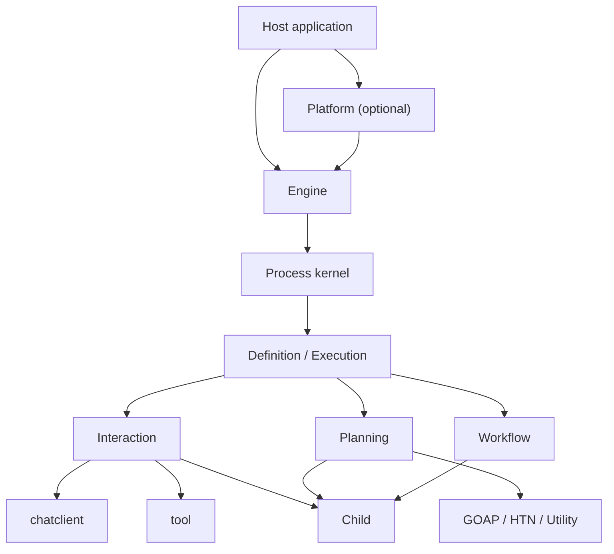

# Agent Framework architecture

This document defines the Agent Framework's position, domain language,
boundaries, structure, invariants, and the engineering standard it is built to.
It records no phase progress, no commits, and no temporary implementation
detail.

- Repository-wide rules: [`../AGENTS.md`](../AGENTS.md),
  [`../DESIGN_PHILOSOPHY.md`](../DESIGN_PHILOSOPHY.md), and
  [`../REFACTORING.md`](../REFACTORING.md).
- The usage entry point: [`README.md`](README.md).

When the code and this document disagree, neither side wins by default: if the
implementation is wrong, change the implementation; if reality has overtaken the
design, change this document and the code together. Repository history is not a
current contract.

---

## 1. Position

> Agent is an embeddable, composable Go framework with one unified execution
> lifecycle. It lets Interaction, Planning, and any future execution strategy
> proven to have independent advancement and recovery semantics be equal,
> nestable Agent Definitions.

### 1.1 From a direct capability to a complete application

The framework must let a user pay only the complexity their requirement
actually needs:

```text
Direct AI capability
    chatclient / embeddingclient / tool
        ↓ the model must choose tools itself
Local agent execution
    Engine + an Interaction Definition
        ↓ pause, resume, budgets, and subtasks are needed
Managed Process execution
    Engine + snapshots + child Processes
        ↓ multi-definition deployment, routing, and governance are needed
A complete agent application
    Platform + a Host application
```

"Embeddable" is not an execution mode, and there is no `EmbeddedMode`.
Embeddability comes from explicit dependencies, no global container, optional
persistence, and the fact that one Engine runs inside an ordinary Go process.

A direct model call is always a first-class path. A program that needs one or a
few explicit model calls should use `chatclient` directly, and ordinary
synchronous control flow can use the standalone `flow` library — neither should
be forced to create an Agent or a Process.

### 1.2 What the architecture raises

This architecture raises the system's ceiling for expression, composition,
recovery, and governance — not the model's intelligence. Its key property is
compositional closure:

> Any Agent Definition can start a child Process of any other Agent Definition;
> that child may use any execution strategy and keep composing, and every
> instance still obeys the same Process lifecycle.

---

## 2. Core design principles

1. **The minimal correct abstraction first.** No package, interface, config, or
   extension point is built ahead of need for a sense of completeness.
2. **One concept, one term.** Never keep plan and todo, run and execution,
   sub-agent and child-agent as parallel public concepts.
3. **Abstraction increases downward; concreteness accumulates upward.** The
   shared kernel carries no GOAP, no ReAct, no arbitrary orchestration
   implementation, and no product session state.
4. **Execution strategy is the primary axis of variation.** Interaction and
   Planning are not extensions; any other strategy must first prove independent
   advancement and recovery semantics.
5. **An extension expresses a cross-cutting capability only.** Event
   observation, policy checks, and instrumentation may extend; the primary
   control flow must never disguise itself as an extension.
6. **A lifecycle has exactly one owner.** The Engine establishes one
   `treeRuntime` commit line per root tree, and a strategy only advances one
   bounded step outside that owner.
7. **Composition over wrapping.** Orchestrator-worker semantics come from
   composing established strategies and child Processes. Ordinary synchronous
   control flow stays in `flow`; only deterministic orchestration that needs an
   independent Process lifecycle becomes a managed Workflow.
8. **State belongs to its owner.** GOAP state belongs to Planning, messages and
   turns to Interaction, stage/branch/fan-out cursors to Workflow. A future
   strategy's state stays with its owner and does not move into the kernel ahead
   of time.
9. **Framework state and application persistence are layered.** Agent captures,
   validates, and restores an execution snapshot; the Host decides when, where,
   and in which transaction to save it.
10. **Safe and deterministic by default.** No arbitrary side effect is retried by
    default, no recursion is unbounded by default, and concurrent completion
    order never decides a business result.
11. **Transparency over magic.** No scanning, annotations, global DI, implicit
    strategy registration, or hidden model calls.
12. **The simple option first.** Upgrade from a direct call or a `flow`
    composition to a managed child Process, multiple agents, or an autonomous
    agent only when evaluation proves it necessary.
13. **Input, intent, and fact are strictly separated.** A Signal enters an
    Execution, a Transition expresses intent, an Event records a fact. None of
    the three may impersonate another.
14. **State advancement is separated from external effects.** A Step produces
    only candidate state and effect intents; models, tools, actions, and other
    I/O are executed by the strategy's own effect dispatcher.

These align with the direction Anthropic emphasizes in
[Building effective agents](https://www.anthropic.com/engineering/building-effective-agents):
simplicity, transparency, composability, and taking tool-interface design
seriously.

---

## 3. Unified domain language

Naming uses the package qualifier to avoid stutter: prefer `agent.Definition`
over `agent.AgentDefinition`.

| Term | Its one meaning | Explicitly not |
|---|---|---|
| `Definition` | An immutable Agent behavior definition that can create or restore an Execution | A running instance, a deployment record |
| `Descriptor` | A Definition's stable name, description, and input/output contract | A mutable configuration bag |
| `Deployment` | A validated, frozen, exactly restorable Definition | A Process |
| `DeploymentRef` | A Deployment's stable identity as a value reference | A pointer, a mutable registry entry |
| `Input` | The immutable wire value validated against the target Descriptor at Process creation | A Host request DTO, a shared mutable object |
| `Output` | The final semantic result validated against the target Descriptor at completion | Concatenated deltas, a UI projection |
| `Execution` | The advanceable execution state owned by a concrete strategy inside one Process | The Engine, a goroutine |
| `Process` | An Engine-managed running instance and its shared lifecycle facts | GOAP's Process-specific state |
| `Signal` | Input the Engine accepts and hands to an Execution in order | An already-happened fact, a state-mutation entry |
| `SignalID` | The stable deduplication identity of one Signal delivery | A wait target identity |
| `WaitID` | The wait-target identity the Engine mints and exposes to an external answerer | A Signal delivery identity, a strategy payload |
| `Transition` | The candidate state and next lifecycle intent produced by one bounded Step | An arbitrary application event set, a committed fact |
| `Effect` | An operation intent declared by a Transition, executed outside the Step by the Engine or a strategy dispatcher | A Host transaction, an arbitrary business event |
| `Prepared Step` | The candidate state and fixed intent the Engine records atomically before an effect runs, not yet finalized | Committed execution state, a Host transaction |
| `Event` | A framework fact that has already happened | A Signal, a command, a Transition |
| `Delta` | A transient streaming increment produced during execution | A completed result, recoverable state, an authoritative record |
| `Engine` | The one execution kernel driving Processes, state transitions, and parent/child scheduling | A product session runtime, a deployment marketplace |
| `Platform` | The optional multi-definition deployment, catalog, routing, and governance container | A synonym for Engine |
| `Strategy` | Interaction, Planning, and any new primary execution semantics that passes admission | An extension |
| `Planning Action` | An immutable search operation with preconditions, predicted effects, and a cost | An executable function, an LLM tool |
| `Tool` | A JSON/schema capability exposed for a model to select and call | Every Action |
| `Delegate` | An Interaction composition value exposing one exact child Deployment through a model-comprehensible tool contract | A general Action, Platform routing, a dispatcher starting a Process on its own |
| `Child Process` | An ordinary Process started by another Process | A separate `SubAgent` type |
| `ProcessSnapshot` | An immutable single-Process diagnostic and strategy-inspector value | A recovery unit, a store or a transaction |
| `TreeSnapshot` | The canonical recovery state of a complete root tree, with an optional durable writer identity | A Host store, a transaction, a product record |
| `Waiting` | Waiting on a declared external condition | A human pause |
| `Paused` | Explicitly removed from scheduling by an operator or a strategy, awaiting continuation | A subtask not finished yet |

Naming constraints, stated negatively:

- No `AgentManager`, `ExecutionService`, `RuntimeHelper`, `Common`, `Utils`, or
  `Impl`.
- ReAct is never named `reactive` — a reactive planner and ReAct are different
  concepts.
- A `Mode` enum never carries fundamentally different execution lifecycles.
- One operation never gets overlapping entries such as `StartAgent`, `RunAgent`,
  and `ExecuteAgent`.
- No `SubAgent` struct: parentage lives in the Process relation.
- The transient word `agent` never enters a domain type name, an event name, or
  a snapshot kind.
- `Correlation` never simultaneously means a SignalID, a WaitID, an EffectID,
  and a strategy-internal logical key.

---

## 4. Ownership boundaries

### 4.1 The Agent Framework owns

- Definition validation and Deployment freezing.
- The Process state machine and the bounded execution loop.
- Creating, advancing, capturing, and restoring an Execution.
- The Process tree, child scheduling, and parent wake-up.
- Signal acceptance, ordering, deduplication, wait addressing, and confirmation
  of successful consumption.
- Stable Effect identity, dispatch order, and in-framework settlement facts.
- General usage and budget limits.
- The Waiting, Paused, Completed, Failed, Canceled, TimedOut, and Killed
  lifecycle.
- Framework events and general observable facts.
- The snapshot envelope, its validation, and the recovery protocol.
- Explicit assembly of execution strategies.

### 4.2 The base modules own

- `core/chat`: the provider-neutral request, the single-`Output` response, and
  the stream protocol.
- `chatclient`: direct model calls, middleware, and structured output.
- `embeddingclient`: direct embedding capability.
- `tool` and `tools`: the tool protocol, schemas, invocation, and concrete tools.
- `history`: standalone history capability.
- `otel`: composition and adapters over the official OTel API.

Agent reuses these and never duplicates a Client, Model, Tool, Message,
Embedding, or OTel abstraction.

### 4.3 The Host application owns

- Product identities: user, workspace, conversation, session, turn.
- HTTP, WebSocket, SSE, desktop, and CLI transports.
- Stores, repositories, database schemas, transactions, and CAS or lease policy.
- Product permissions, subscriptions, billing, audit, and retention.
- UI copy, display state, and product event mapping.
- Provider and model selection, price tables, and product default budgets.
- When a checkpoint commits, and the application write set around it.
- Destruction, rollback, replacement, and restore policy for its own facts, plus
  the lifecycle cleanup of the Processes those facts relate to.

A Host ultimately depends only on Agent's neutral lifecycle contract. It never
parses the internal snapshot payload of Planning, Interaction, or a future
strategy.

---

## 5. Target architecture and the execution waist



### 5.1 The waist

Every execution strategy intersects on exactly these semantics:

```text
Definition
  ├─ describes the static contract
  ├─ creates a new Execution
  └─ restores an Execution from its own state

Execution
  ├─ consumes Signals in order
  ├─ advances one bounded Step with no external side effect
  ├─ produces candidate state, a Transition, and Effects
  └─ captures its own portable state

Engine
  ├─ creates and owns Processes
  ├─ calls Execution.Step
  ├─ applies the Transition
  ├─ establishes stable Effect identity and calls the strategy dispatcher
  ├─ redelivers Effect results as Signals
  ├─ schedules child Processes
  └─ resumes a parent when its wait condition is met
```

The current waist is below; exact parameter names, GoDoc, and the complete
public surface are guarded jointly by the code, the tests, and the callers:

```go
type Definition interface {
	Descriptor() Descriptor
	Start(Input) (Execution, error)
	Restore(ExecutionState) (Execution, error)
}

type Execution interface {
	Step(context.Context, []Signal) (Transition, error)
	Snapshot() (ExecutionState, error)
}
```

The public waist uses portable, type-erased JSON values. Generics are for edge
typed adapters only: `Definition[I, O]` must never enter the root contract the
Engine has to hold homogeneously. A Descriptor's input and output schema is the
authoritative structural contract and enters Deployment identity; the Definition
and its typed adapter still own the Go types and the semantic invariants.

Strategy effect payloads and all Signal payloads are opaque to the Engine. Each
strategy defines a minimal dispatcher and codec in its own package, and the
Deployment freezes and binds them. The Engine understands only its own framework
effects, envelope identity, routing, ordering, limits, and settlement; it never
imports or type-switches a concrete strategy. The exact public contract of a
dispatcher and its erased raw value has been frozen jointly by Interaction,
Planning, Workflow, and independent consumers.

If child-Process capability must be injected into an Execution, the real
consuming package defines the minimal interface. A whole `*Engine` or an
ever-growing `ExecutionContext` is never passed to every strategy. Child
creation, waiting, model calls, tools, and actions are all declared as Effects
through a Transition, so the Engine keeps owning lifecycle order while the
strategy keeps owning concrete execution semantics.

### 5.2 Step

A `Step` is one cancellable, discardable, purely candidate reduction — it is not
the whole task:

| Strategy | One Step |
|---|---|
| Interaction | Consume a model, tool, or external-input Signal and decide the next effect, wait, or completion |
| GOAP | Consume an observation or action result and advance observe → plan → act → reobserve |
| Workflow | Advance one ordered stage's pure reduction, child start or wait, or a stable aggregation boundary |

Three different scales are needed to understand the kernel: **the root tree is
the consistency, commit, and recovery unit; a Process is the lifecycle and
strategy-state isolation unit; a Step or dispatcher job is the concurrency
unit.** Adding Processes to one tree adds mutually isolated candidate
computation and external I/O concurrency, but it does not add authoritative
commit parallelism. Independent commit throughput means splitting into separate
root trees, never bypassing the owner line.

No strategy's Step may execute a model, a tool, an action, or any other external
I/O, hide an unbounded loop, or start an unowned goroutine. The runtime builds a
cancellation-only context from `context.Background()`: it carries no value, no
deadline, and no cause, and exists only so the tree owner can cancel a
computation that has already lost its right to commit. An external operation can
only be expressed as an Effect and executed by that strategy's dispatcher.

Each root tree's private `treeRuntime` is the only framework commit owner, but
pure computation does not occupy the owner line: one Process has at most one
Step job, and different siblings run in parallel. The owner hands a job the
last-stable ExecutionState and an ordered Signal prefix; the job completes the
Step, the Transition validation, and the candidate snapshot, and returns an
attempt identity. Only the owner may revalidate and adopt the result. When a
kill, pause, cancel, or a new incarnation expires an attempt, the result and any
error are discarded whole and the Execution is rebuilt from last-stable state.

A dispatcher Effect uses a `planned → pending → settled` state machine:

1. the owner validates the candidate state, signal consumption, budget,
   capability, and complete batch identity;
2. the current Effect enters pending, and in durable mode the pending boundary —
   carrying the complete tree — commits first;
3. only after pending succeeds does the dispatcher job start outside the owner;
4. the dispatcher result is normalized to a definite or an Unknown settlement;
5. only after the settled boundary succeeds does the owner install the
   settlement, the candidate state, the mailbox, and the Process transition.

One Process's Effects cross pending and settled one at a time in declaration
order, and a planned Effect that has not been dispatched can never become
Unknown. Ephemeral mode runs the same state machine without calling the Host
durability port. Events and deltas record attempts and observations only; they
never substitute for an acknowledged `TreeSnapshot`.

### 5.3 The deterministic orchestration boundary

Deterministic orchestration is divided by lifecycle strength. Ordinary in-process
Go or AI control flow can be written directly in Go, or with the standalone
`flow`. When each unit of work needs its own ProcessID, DeploymentRef, snapshot,
budget, capabilities, cancellation, and tree recovery, use a managed Workflow.
`flow` is an existing implementation worth learning from, not a required
dependency: Workflow may absorb its explicit topology, typed composition,
deterministic ordering, and bounded fan-out ideas, but reuse is not required, no
mandatory adapter exists, and no runtime, store, journal, or recovery fact is
shared.

A Workflow Definition freezes an ordered stage sequence. A stage consumes the
current immutable, schema-validated value and produces the next; adjacent
schemas connect exactly at construction. The first closed vocabulary is only
`Transform`, `Call`, `Switch`, `Fork`, `Map`, and `Loop`: a sequence is the stage
declaration order, prompt chaining is consecutive Calls, a gate is a Transform or
Switch, a vote is a pure reducer after a Fork, and evaluator-optimizer is a Loop
composition. Multi-stage branching composes by calling another Workflow
Deployment, never by nesting a second Execution in one Process.

Transforms, selectors, reducers, and predicates are bounded deterministic pure
functions inside one Step. A Call, a selected branch, a Fork branch, a Map item,
and a Loop iteration each start a real child Process of an exact Deployment.
Fork and Map must be configured with a positive `WindowSize`: each fixed window
settles completely before the next starts, and results are placed back in
declaration order. That name promises no continuously refilled sliding pool. A
Loop has an explicit positive iteration limit and distinguishes exactly between
"predicate satisfied" and "limit exhausted". The ExecutionState holds only the
stage, value, case, window, item, and iteration cursors plus child, wait, and
result identities — never a function, a concrete Deployment value, an Engine, a
goroutine, a store or journal, or Host data.

`flow.Node.Run`, the graph scheduler, and the journal still may not enter
`Execution.Step`. Workflow produces no dispatcher Effect; it composes only
through framework child Effects, and its in-package dispatcher merely rejects an
unexpected dispatcher Effect. That keeps the Engine the only owner of the Process
loop, effect commits, and tree recovery.

### 5.4 The Process state machine

A shared Process uses only these states:

```text
NotStarted → Running
Running    → Waiting | Paused | Completed | Failed | Canceled | TimedOut | Killed
Waiting    → Running | Failed | Canceled | TimedOut | Killed
Paused     → Running | Canceled | TimedOut | Killed
```

- `Continue`: the next Step can still be scheduled immediately.
- `Waiting`: awaiting a tool result, human input, a time, a child Process, or
  another declared condition.
- `Completed`: produced a result satisfying the Definition's output contract.
- A terminal state is decided jointly by the control intent the Engine has
  recorded and the Step result — never inferred from error text or from
  `context.Canceled` alone.
- An explicit Engine kill maps to `Killed`. A parent Process or Host context
  cancellation maps to `Canceled`, with the cause distinguishing the initiator.
- A Process deadline, or an Effect deadline promoted to a Process termination
  reason, maps to `TimedOut`. A deadline is never flattened into an ordinary
  `Failed`.
- An ordinary Step error, an external failure, a panic, or a contract violation
  maps to `Failed`, keeping a stable error classification.
- A committed terminal state is first-terminal-wins: a late cancellation or
  deadline cannot overwrite it.
- `Stuck` is not a shared state. "GOAP found no feasible plan" is a Planning
  result and a strategy decision.

The terminal matrix is matched in this priority and guarded continuously by a
table-driven contract:

| Recorded reason | Deadline reached | Step/Effect result | Terminal | Cause |
|---|---:|---|---|---|
| Explicit Engine kill | any | any | `Killed` | Engine kill reason |
| Process/parent/Host deadline | yes | any | `TimedOut` | The exact deadline owner |
| Parent cancellation | no | any | `Canceled` | Parent cancellation |
| Host context cancellation | no | any | `Canceled` | Host cancellation |
| No control-plane cancellation | no | Contract violation, external failure, or panic | `Failed` | Stable error classification |
| No control-plane cancellation | no | Legal completion | `Completed` | Completion |

An Effect's own cancellation or deadline first reaches the strategy as a
settlement Signal. Only when the strategy or the Engine decides it terminates the
whole Process is the same matrix applied — a local call failure is never
promoted to a Process terminal state on its own.

A shared Process may own:

- `ProcessID`, `RootProcessID`, `ParentProcessID`
- `DeploymentRef`
- `StartedAt`, `FinishedAt`
- `Status`, the exact terminal cause or failure, and the current wait condition
- General usage and budget
- The opaque envelope, arrival order, delivery state, and consumption cursor of
  pending Signals
- The mapping from WaitID to a strategy logical wait key
- The not-yet-finalized prepared step envelope, the only place holding pending
  Effects, stable EffectIDs, and per-item settlements
- The Execution state envelope

A shared Process does not own:

- Goal, WorldState, Plan
- WorkingContext, model-call or tool-call cursors, tool checkpoints
- Any concrete strategy's private cursor, branch, or join state
- Product session, conversation, or turn
- Provider, model, or USD ledger

### 5.5 The Execution state envelope

The shared snapshot holds only a discriminated strategy-state envelope:

```go
type ExecutionState struct {
	Kind    string
	Payload json.RawMessage
}
```

- The Planning payload owns WorldState, the planning pass, action attempts,
  exclusions, confirmations, and child wait state. Goal, action bindings, and the
  planner stay in the exact Definition.
- The Interaction payload owns WorkingContext, the model-call count, a pending
  model response, the tool-call cursor and checkpoint, Delegate settlements, and
  artifact provenance.
- The Workflow payload owns the stage index, current value, selected case,
  fan-out window and output, loop iteration, and child wait state.
- A future strategy's payload owns only its own admitted recovery state; the
  shared envelope reserves no fields.
- A Host may persist the envelope but must never parse the payload by `Kind` and
  participate in strategy control flow.
- Recovery must find the Definition through an exact `DeploymentRef`. A global
  `kind → factory` mega-switch is forbidden.

The shared snapshot constrains the envelope only and never interprets the payload
recursively. Each strategy's schema owner guards its own current
ExecutionState, Effect, Signal, and Delta wire shape in its own package, with
coverage tests preventing an unregistered private JSON shape. The kernel has no
right to import or interpret those private shapes.

### 5.6 Signals, waiting, and safe consumption

A Signal is the only runtime input into an Execution. The shared envelope carries
a stable SignalID, optional WaitID routing, and an opaque JSON payload; the
Engine separately records its own monotonic sequence number, delivery state, and
consumption cursor. The Engine wall clock never enters strategy input: business
time must be submitted explicitly by the Host as a stable payload, and the
receive-observation time belongs to an Event only. A Signal's kind or schema,
where needed, must be encapsulated inside its owner's payload and never become a
type the shared Process can interpret. The Engine never decides strategy control
flow from a payload and never puts a concrete Signal type into the shared
Process.

The Signal delivery contract must satisfy:

- Repeated submission of the same SignalID produces exactly one logical
  consumption.
- A Signal accepted by a running Process queues to the next safe Step boundary
  the strategy declares.
- A waiting Process accepts only input its current WaitID allows; expired,
  already-settled, and wrong-target input fails deterministically.
- The Signal cursor advances only when the candidate state and the Transition
  commit successfully; a failed Step never permanently swallows input.
- The pending queue, the deduplication facts, and the cursor are all
  snapshottable and subject to per-item and total limits.

A WaitID is minted by the Engine; an Execution can never generate an external
wait identity itself. The Execution first declares a logical wait through a
Transition; at effect settlement or finalization the Engine atomically saves the
WaitID-to-logical-wait mapping and enqueues an internal Signal carrying the
WaitID; on the next Step the Execution writes it into its private state and
enters Waiting explicitly. An answer arriving early after the mapping exists may
queue but is consumed only at the matching safe boundary. This round trip keeps
the Execution a single writer and allows no Engine callback into, or direct
mutation of, strategy state.

Each strategy must declare its own safe consumption boundary and prove it with
contract tests. Interaction consumes a steer by default after an already-started
model call and tool batch settle, and before the next model effect; the
observable upper bound on its latency is the remaining duration of the current
uninterruptible effect plus the next Step's scheduling delay, and that must be
written in the public GoDoc. The general Engine chooses "wait for settlement" and
offers no interrupt-and-restart that would abandon an uncertain side effect, nor
pretends to own external compensation semantics.

### 5.7 Effects and settlement

An Effect is the only way an Execution requests an operation outside a Step. The
candidate envelope distinguishes only a framework-owned target from a Deployment
dispatcher target and carries an owner-owned raw payload; the Engine derives the
EffectID from the ProcessID, the Step sequence, and the effect index, and freezes
the payload. The Engine interprets only the closed set of framework Effects such
as child, wait, and timer; a strategy Effect is handed whole to its bound
dispatcher. A dispatcher never mutates the Execution — it produces deltas and a
final settlement Signal. Model, tool, and action kinds are never promoted into a
kernel union.

An Engine-owned Effect must use the EffectID to ensure repeated scheduling never
creates a duplicate child, wait, or other framework entity. A dispatcher for an
external effect such as a model, tool, or action must use the EffectID as the
stable request identity and state its replay contract explicitly: automatic
redelivery is allowed only where replaying the same EffectID is proven to be the
same logical operation. Where that cannot be proven, an unknown settlement must
remain an observable state awaiting explicit adjudication — never silently
replayed and never assumed successful. Business transactions, compensation, and
external idempotency remain the concern of a concrete adapter or the Host.

The first version of an Effect batch from one Transition advances item by item in
declaration order: only after one Effect settles may the next planned Effect
enter pending. EffectIDs and settlements are placed deterministically by batch
index; pending and Unknown items keep their own settlement facts and recover only
under their own replay contract, never by rerunning the whole batch or by
producing a protocol result ordered by completion time. A parallel batch may be
designed separately only when a real benchmark or trace proves it necessary and
it does not change the durable prefix.

### 5.8 Input, output, and typed adapters

The Engine must hold and run heterogeneous Definitions homogeneously, so the root
waist is not generic. The wire values of Input, Output, Signal, Effect, and
ExecutionState all use a JSON representation that its owner copies defensively
and bounds in size — never `any` or a shared mutable `json.RawMessage` routing
around the contract. Strict decoding and payload semantic validation are done by
the Definition, Execution, or dispatcher that owns the schema.

A Descriptor carries the authoritative input and output schema, and the schema
plus any configuration affecting encoding semantics enters the Deployment digest.
The Engine performs structural validation at the start, complete, and child
settlement boundaries; the Definition performs semantic validation. The everyday
Go API comes from edge generic adapters providing strict `I ↔ raw input` and
`raw output ↔ O` conversion, while the Engine and the catalog depend only on the
non-generic Definition.

---

## 6. Execution strategies

### 6.1 Interaction

Interaction is the ReAct-style strategy in which the model selects tools
autonomously from environment feedback. It suits coding, research, chat, and
open-ended tasks.

Its capabilities are ordinary and streaming model calls, a stable tool boundary,
multi-turn loops, checkpoints, exact recovery, bounded tool parallelism,
human-in-the-loop, steer, usage, and the complete lifecycle event set.
Interaction's private WorkingContext is the model working set needed to restore
the current Execution exactly. It is not the cross-Process product history or UI
record the Host owns.

The tool loop is Interaction's implementation mechanism, not a second public
concept under another name. Whether to expose a smaller direct runner must be
proven by an independent consumer.

### 6.2 Planning

Planning expresses goal-directed selection over a known action model. `Planner`
is the real substitution point inside Planning:

```text
Planning Definition
    ├─ GOAP planner
    ├─ HTN planner
    ├─ Utility planner
    └─ A future planner with a real requirement
```

Planning exclusively owns Goal, Condition, Truth, WorldState, PlannedAction
metadata, and replan or no-plan policy.

GOAP suits a scenario where the goal is machine-verifiable, several paths exist,
action preconditions, effects, and costs are declarable, and the environment
changes. GOAP is not the default agent semantics and is not for wrapping fixed
control flow or an open-ended ReAct loop.

### 6.3 Deterministic orchestration

`flow` is an optional ordinary in-process composition library; Workflow is the
managed strategy that orchestrates real child Processes only. Workflow uses
ordered stages rather than an arbitrary DAG or registry, depends on and
duplicates no `flow` runtime, and compiles to no GOAP. A later design may
selectively absorb composition regularities `flow` has proven, without code reuse
as a goal. Its independent state is the current value, the stage cursor, the
branch, item, and iteration windows, and the child waits — all already proven by
a full tree restore from an independent public-API consumer.

### 6.4 Orchestrator-worker composition

Orchestrator-worker is composed from Interaction, Workflow, managed Delegates,
typed artifacts, a completion validator, and child Processes. It is not a
separate strategy, a separate ExecutionState kind, or a prebuilt package. Only an
implementation proving it has advancement and recovery semantics these existing
capabilities cannot express may apply for admission as a new strategy.

It has two orthogonal, composable shapes. When the model must directly choose
among a few known workers, Interaction exposes exact Deployments as Delegates and
the model's tool call creates the corresponding child Process. When the task set
is split dynamically by the model from the input but the scheduling order,
window, count limit, and aggregation must be deterministic, a decomposer
Interaction first emits a consumer-owned typed task list, a Workflow Map then
creates an exact worker child per item, and another Interaction synthesizes the
ordered typed results. Both shapes use only the existing Process waist. The
framework adds no general Worker, Task, Result, Team, Supervisor, or shared
blackboard type.

Planning can be an exact worker Deployment, but only for a subtask whose goal is
verifiable through WorldState and Goal and whose actions have honest predictive
semantics. The orchestration layer may only submit that Planning Definition's
Input and consume its Output. It must not inspect the plan, remote-control
actions step by step, use Planning as an arbitrary content transformer, or push a
business task or result schema down into Planning or Workflow. An open-ended
analysis worker should use Interaction or the consumer's own Definition.

An Interaction typed artifact represents only a successfully completed child
result that passed the exact Delegate's output schema again. It keeps a stable
order by model turn and tool-call position, stores a portable `agent.Output` in
the ExecutionState, and exposes to a validator only an immutable `Artifact`, the
exact Delegate name, and the erased-or-typed decode edge. An ordinary tool
result, an argument violation, a start failure, a non-completed child, and any
`IsError` tool result are not artifacts. The framework never guesses by Go type
name, never filters `any`, never publishes to a shared blackboard, and owns no
product artifact store. An application that wants to keep or share results across
Processes must model that explicitly in its own Definition output or in a Host
aggregate.

A completion validator is a bounded, deterministic, side-effect-free pure
function frozen by the Interaction Definition. It runs only when a final model
response or a direct-tool result forms a completion candidate, reading an
independently copied current WorkingContext, the candidate Output, and the
artifacts. The WorkingContext is that Execution's model context — not the Host
conversation or transcript — and does not yet include the candidate. The
validator returns an explicit binary: accept, or reject with non-empty bounded
feedback. On rejection, the candidate context and the feedback enter the
WorkingContext as the next user message, still bounded by a positive
`MaxModelCalls`; exhaustion terminates with a stable execution failure rather
than passing an unaccepted candidate off as completion. An evaluator that needs a
model, a tool, the network, or any other external judgment must be a managed
child Process and can never hide inside a validator callback.

### 6.5 Evaluator-optimizer composition

Evaluator-optimizer is a derived composition of a Workflow Loop, not a new
strategy. The loop's typed value is defined by the consumer and must at minimum
hold the original objective, the ordered attempt and feedback history, the
current candidate, the best-so-far, and the accepted flag. Each round's body is
an exact child Workflow that first calls an exact optimizer child and then an
exact evaluator child. The optimizer reads the previous round's evaluator
feedback and produces a new candidate; the evaluator scores it and gives the next
round's feedback; the loop's pure predicate reads only committed accepted state.

The maximum iteration count, the evaluation rule, and the acceptance threshold
must be configured explicitly and enter Deployment identity — the framework
supplies no default notion of "good". The best-so-far updates only on a strict
improvement, keeping the earliest result on a tie. Reaching the threshold sets
`LoopResult.Satisfied=true`; exhaustion completes normally but must report
`Satisfied=false` and return the best attempt rather than the last. The attempt
history, score, feedback, threshold range, and final report are all
consumer-owned typed schemas; none enters Workflow or the kernel, and none
propagates through a shared blackboard or a runtime type query.

The exact optimizer and evaluator child Deployments must satisfy the typed state
contract the consumer declares. Where the underlying capability comes from
Interaction, Planning, an ordinary tool, or another Definition, the conversion and
state merge must be done explicitly by a consumer-owned adapter Deployment;
Workflow neither guesses nor rewrites a Descriptor. An evaluator needing a model,
the network, or another external judgment must be a managed child Process and can
never hide inside a pure loop predicate, a Transform, or an Interaction
completion validator. Use this composition only when the evaluation criterion is
clear enough, the feedback is actually consumable by the optimizer, and
evaluation proves the loop beats a single generation.

### 6.6 Admitting a new strategy

A Process has exactly one top-level Execution and one top-level ExecutionState
envelope. A strategy must never drive another framework Execution inside one
Process; composition that crosses strategies or needs independent pausing,
recovery, budget, or cancellation must create a child Process.

Add a new Definition and Execution only when a new pattern has state advancement
and recovery semantics fundamentally different from the existing strategies.
GOAP, HTN, and Utility share the Planning lifecycle and should implement a
planner rather than each creating an engine.

---

## 7. Planning Action, Tool, and Delegate

`planning.Action` expresses only the stable name, exact description,
preconditions, predicted effects, and cost that the Planning search uses. It has
no JSON input or output, no execution function, and no external side-effect
semantics. An `ActionBinding` is what binds a predicted operation to a dispatcher
executor or an exact child Deployment, and a `PlannedAction` is only the planner's
stable reference to it. The framework therefore invents no general executable
Action sharing a name with `planning.Action`, and provides no general
Action-to-Tool adapter that cannot be derived from predictive metadata.

A Tool is a callable protocol offered to a model, emphasizing a
model-comprehensible name, description, parameter schema, and textual result. A
Tool may come straight from MCP, a Host, or an ordinary Go adapter and need not
participate in Planning. Permissions, sandboxing, once-only execution, product
approval, transactions, and business idempotency belong to the concrete assembly
boundary. `core/tool.Guard` is the authorization decoration boundary shared by
ordinary and managed calls; Interaction supplies exact `ToolInvocation`
attribution through the call context but returns only a stable refusal to the
model, never leaking the Authorizer's specific reason.

When the model must choose a worker with an independent lifecycle, Interaction
uses a `Delegate`: it freezes a model-friendly tool name and description, one
exact child Deployment, a per-call budget, and attenuated capabilities. The model
parameters express only the target child Descriptor's business Input; the
ProcessID, DeploymentRef, recursion depth, budget, permissions, and parentage are
all decided by the Definition and the Engine, never filled in by the model. The
Interaction Execution recognizes a Delegate call and advances it through the
framework `StartChild` and `WaitForChildren`; a dispatcher and an ordinary tool
gain no second Process-creation entry.

One model tool-call batch may contain both ordinary tools and Delegates.
Interaction splits it only into consecutive runs in the original order: an
ordinary-tool run continues through the dispatcher with bounded concurrency and
human-in-the-loop, and a Delegate run declares a batch of child starts and waits
for all. After everything settles, only the original assistant message and one
tool-result message ordered strictly by the original tool-call order are appended
to the WorkingContext. Invalid Delegate arguments, a deterministic child start
failure, and a non-completed child terminal state are error tool results the
model can decide about again; a mismatched framework Signal, identity, or
successful-output schema is an execution contract violation and must never be
disguised as an ordinary worker failure.

Platform selects the active root Deployment only before a Process starts. It
never swaps Interaction's exact Delegate for a string registry lookup. If a model
must someday select a worker from a dynamic catalog within one Interaction, the
selection and permission contract must be proven separately — never by routing
around the exact child Deployment and Engine admission.

---

## 8. Child Processes and recursive composition

Agent self-recursion is not the current Go call stack re-entering the same
function — it is the same Definition creating a new child Process:

```text
Process A₀
  └─ Process A₁
       └─ Process A₂
```

Each Process has a unique ID, independent Execution state, an independent
snapshot, and an allocated budget. The Definition may be the same; the Process
never is.

Only two orthogonal semantics exist:

1. `StartChild`: start one or more child Processes.
2. `WaitForChildren`: wait for results under an `all`, `any`, or `quorum`
   condition.

A synchronous call is the convenience combination of start plus wait-all;
parallelism, racing, and voting are expressed by the same primitives. A long wait
must never block a Step: the parent Execution requests the child start through an
Effect, captures its wait state, and returns Waiting, and the Engine resumes it
with the child settlement as a Signal.

Recursion and dynamic delegation must be constrained by the Engine:

- Maximum depth, total child count, fan-out, and parallelism.
- Maximum steps, model calls, tool calls, tokens, cost, and wall time.
- A child budget is allocated out of the parent's remaining budget, never a copy
  of the full budget.
- A child's capabilities are only a subset of the parent's; there is no recursive
  privilege escalation.
- Parent context is projected per task; the full message set, blackboard, and
  secrets are not copied by default.
- Deadlines and cancellation propagate downward.
- No terminal state of a parent may leave an active orphan. A parent deadline
  keeps its exact source in descendants; every other parent terminal state
  propagates level by level as a parent cancellation.
- A parent terminal state delivers control intent only to direct children still
  active at that moment; a child that already completed legally keeps its
  completion. If a parent result depends on a child, the strategy must
  `WaitForChildren` explicitly rather than rely on the scheduling order of two
  concurrent run loops.
- `Process.Await` returns only after that Process's terminal result is linearized
  and the Engine has finished the parent completion notification, the child
  termination delivery, and the wait deregistration directly triggered by this
  termination. It does not promise the entire descendant tree has terminated.
- A child start uses a stable request identity and is never created twice on
  recovery.
- A child output satisfies the target Definition's output contract.
- A child Process must never wait on an ancestor Process.
- A child failure enters the parent Execution as a result; retry, fallback,
  partial success, failure promotion, and aggregation policy are defined
  explicitly by the orchestration, and the Engine guesses none of them.
- Parent and child creation, waiting, recovery, and cancellation all produce
  observable events.

The Process tree is the shared unit of execution, cancellation, budget, and
recovery. If several parents must someday share a result, model it as an explicit
artifact or reference — never let one Process have two parents.

---

## 9. Coverage of the Anthropic orchestration patterns

Per the taxonomy in
[Building effective agents](https://www.anthropic.com/engineering/building-effective-agents),
the coverage and its evidence are below. A pattern name is composition
vocabulary, not a checklist requiring one strategy, package, or type each.

| Pattern | Implementation boundary | Who decides the path | Behavioral evidence |
|---|---|---|---|
| Augmented LLM | `chatclient` or Interaction plus tools and WorkingContext; retrieval is a tool or provider, long-term memory has an explicit owner | One model call or Interaction turn | `direct_vs_managed`, `autonomous`, Interaction tool and WorkingContext tests |
| Prompt chaining | `flow.Then` or consecutive Workflow Calls | Code | `workflow_patterns`: two exact children in series passing a typed value |
| Routing | `flow.Switch`, Workflow Switch, or Platform routing | Code, a classifier, or the model | `workflow_patterns`: urgent and standard inputs each create only the selected exact child |
| Parallel sectioning | `flow.Map`/`flowx.FanOut`, or Workflow Fork/Map | Code | `workflow_patterns`: facts and risks in stable declaration order; Workflow Fork/Map contract tests |
| Parallel voting | `flow` parallel composition, or Workflow Fork plus a consumer-owned typed reducer | Code | `workflow_patterns`: four voters across two windows, a 2–2 tie stably choosing the earliest declared result |
| Orchestrator-workers | Interaction Delegates, or a decomposer Interaction plus Workflow Map plus a synthesizer Interaction; a worker is always a child Process | The model splits and selects; Workflow fixes only scheduling and aggregation | `orchestrator_workers`: dynamic tasks and exact Planning Delegate tests |
| Evaluator-optimizer | `flow.Loop` or Workflow Loop plus exact optimizer and evaluator children | Code controls the loop; the model may evaluate | `evaluator_optimizer`: feedback, early acceptance, exhausted best-not-last, and stable ties |
| Autonomous agent | Interaction plus tools plus environment feedback plus an explicit stop and limit | The model | `autonomous`: model → tool → model final, and Interaction limit tests |
| Pattern composition | `flow`, Workflow, Interaction, and child Processes composed at lifecycle boundaries | Code and the model, per boundary | Heterogeneous Process trees in `composition`, `orchestrator_workers`, `evaluator_optimizer` |

Acceptance requires both a runnable example and behavioral assertions: a topology
type or a pattern name in a document is not an implementation. If ordinary Go or
`chatclient` suffices, do not create a Process; upgrade to managed composition
only when an independent lifecycle, recovery, budget, cancellation, or governance
is genuinely worth it.

Complexity follows the minimum sufficient ladder:

| Requirement | Preferred boundary | Should not take on |
|---|---|---|
| One or a few model calls, no managed lifecycle | Direct `chatclient` | A Process, a snapshot, a child tree |
| In-process deterministic control flow, no per-node identity, budget, or recovery | Ordinary Go or standalone `flow` | The Agent Engine, a Process per node |
| A model or tool loop needing pause, resume, steer, limits, or events | One Interaction Process | Workflow, a worker catalog |
| Branches or iterations that each need identity, budget, cancellation, and tree recovery | Workflow plus exact child Processes | A second scheduler, a shared store or blackboard |
| The model dynamically selects a worker | Interaction Delegates, composing Workflow when deterministic task scheduling is needed | A supervisor strategy, a string registry |
| Selection and unified governance across Deployments | Platform | Expanding the Engine or strategy state in reverse |

Managed complexity shows up linearly in the real tree: the smallest Workflow
example is four Processes, orchestrator-worker is six, and a three-round
evaluator-optimizer and the full workflow-patterns example are ten each. Process
count is not itself a value: it is justified only when those identities really
carry an independent recovery, resource, cancellation, or observation boundary.
A pure Transform creates a child in the examples as a topology fixture — that
does not mean business code should upgrade an ordinary function to a Process by
default.

---

## 10. Engine and Platform

### 10.1 Engine

The Engine is the minimal managed execution boundary. It establishes one
`treeRuntime` per root tree; starts, advances, pauses, resumes, and terminates
Processes; accepts and delivers Signals; schedules bounded Step and dispatch jobs
and commits results only on the owner line; manages the Process tree, waits, and
cancellation; captures and restores a complete tree; enforces general limits and
policy; and publishes neutral framework events and transient deltas.

The Engine owns no product session, database transaction, model catalog, price
table, or UI protocol.

`EngineConfig` freezes `Limits`, `TreeLimits`, and the maximum `CapabilitySet`
per root tree; a child may only permanently allocate from the parent budget and
attenuate capabilities. The optional `ProcessAdmitter` is the single start
admission contract shared by root and child Processes: it reads the immutable
`ProcessAdmission` — the ProcessRelation, exact DeploymentRef, Descriptor,
Budget, and CapabilitySet — and returns approval or refusal under the starter's
context. It cannot modify an allocation, create a Process, or gain Engine or
Process control; the Engine's budget, capability-subset, and tree limits are
always enforced in the one kernel state. Product identity, subscription, price,
and transaction never enter that value.

Admission happens before `Definition.Start` and before the Process is published.
A rejected root does not start; a rejected child forms a stable child-start
failure. An admitter may coordinate with a caller-owned external admission, but it
must respect the context, stay bounded and concurrency-safe, never re-enter the
Engine or a Process, and guarantee business correctness itself for a possible
replay of the same prospective ProcessID. The framework defines no store,
transaction, charge, lease, or idempotency SPI because of it.

A successful admission means initialization is allowed, not that the Process is
published. The optional `ProcessStartOutcomeAcknowledger` receives exactly one
neutral conclusion per accepted admission: `started` when initialization and the
initial snapshot self-certify, or `aborted` with a stable `Failure` when any
initialization boundary fails. A tentative `StartedAt` is generated only after an
accepted admission and becomes a lifecycle fact only after a started outcome
succeeds; an aborted outcome has no `StartedAt`. An outcome carries no product
identity, persistent object, application state, or callback capability. The
Engine keeps a prospective start reservation internally: `started` publishes
without possibility of failure only after the acknowledgment returns nil,
`aborted` never publishes, and a failed acknowledgment does not publish either.
An event listener has no veto or error channel and cannot substitute for that
synchronous correctness boundary.

A captured Process restores its original admission. It is not re-judged by the
current admitter and does not replay its start outcome; revoking authorization is
decided by the caller before restore or expressed through explicit Process
control, so a snapshot restore never depends on hidden live policy.

### 10.2 Platform

Platform is the optional complete shape built on the Engine. It owns the
Deployment catalog, digests, Definition routing, multi-agent composition
discovery, and the Host-facing governance entry.

Local embedded use can create only an Engine and run explicit Definitions; a
complete application can use Platform. The two share Process and Execution
semantics and establish no second runtime.

Platform does not wrap, create, or proxy an Engine. The complete shape is the
Host assembling one `platform.Platform` explicitly as the exact
`DeploymentResolver`, alongside the existing `ProcessAdmitter`, `EventListener`,
and `EngineConfig`. The root Deployment is still selected by the Host from an
active candidate snapshot and then handed to `Engine.Start` or `Engine.Run`.
Platform therefore has no second Start or Run, Process handle, scheduler, or
observation bus.

Platform's catalog is an immutable in-memory snapshot of exact Deployment
bindings: the zero value is empty, one name may keep several definitions with
different digests, and a duplicate exact DeploymentRef must be rejected rather
than overwritten. Enumeration order is fixed by Definition name and then complete
Deployment digest, and the returned set is isolated from the internal slice. The
catalog directly implements the `DeploymentResolver` the Engine consumes, and
contains no active route, change command, remote discovery, Process reference
count, or Host persistence.

Deploy, Replace, and Undeploy only update the catalog and route snapshot the
Platform owner holds; Definition routing selects an exact DeploymentRef from one
committed snapshot. Neither may degrade the catalog into a package-global mutable
registry, and neither may make the Engine depend on Platform in reverse.

An active Deployment's slot key is fixed to the Definition name: one name has one
active binding. A different complete digest in the same slot is a conflict and
requires an explicit Replace. Replace only changes that slot and preserves the old
exact binding. Undeploy must submit the current exact DeploymentRef, so a stale
reference cannot take down a binding that has already been replaced. Every local
change publishes a complete immutable state at once; none of them declares an
external persistence transaction, a distributed CAS, or request idempotency.

Definition discovery and selection expose only `DeploymentCandidate{exact ref,
Descriptor}` from one active snapshot; a candidate has no dispatcher, Engine, or
Process capability. The caller-supplied `DeploymentSelector` owns the
request-specific input and the selection policy, may use the context to perform
model or network I/O, and returns one exact DeploymentRef. Platform validates
that ref belongs to the same candidate snapshot and returns the original
Deployment from it, so a concurrent Replace or Undeploy cannot redirect a
completed selection to another binding. The historical catalog is for exact
restore only and never enters routing candidates automatically.

Platform's zero value is a usable empty deployment aggregate;
`New(deployments...)` exists only to construct an initial active set once and
validate conflicts. A discovery caller receives non-executable
`DeploymentCandidate` values only, and no second executable `ActiveDeployments`
enumeration is published. Code needing exact restore uses the catalog and
`Resolve`; code needing to start uses the captured exact Deployment returned by
`SelectDeployment`. There is no single-field config, no duplicated active
executable view, and no compatibility entry.

`embedded_vs_platform` runs the identical Workflow root and exact workers through
a caller-owned resolver and through the Platform selector and resolver, and
compares Output, Status, Usage, both Process trees, both admissions, and the
stable Process, Step, and Effect event projections. A child may finish before or
after the parent registers its wait across runs, so `signal.accepted` and
intermediate running or waiting facts may legitimately differ. The Platform
equivalence contract does not falsely claim per-item equality of wall clock,
ProcessID, or the complete event sequence across runs.

### 10.3 Deployment recovery

- A Deployment freezes the Definition and any configuration affecting recovery
  semantics.
- A Process snapshot always records the exact DeploymentRef.
- The Engine depends only on the minimal `DeploymentResolver` defined at its own
  consumption site, or receives an already-resolved Deployment explicitly at
  restore. That resolver is a context-free, synchronous, bounded, deterministic
  exact-binding lookup with no remote I/O: the same exact reference cannot change
  result with the caller or the timing.
- Routing, tenant or caller selection, and remote publication discovery must all
  produce an exact DeploymentRef first and only then enter the resolver; the
  resolver takes on none of those responsibilities.
- A same-reference child reuses the current Deployment directly and does not call
  the resolver. A tree restore resolves each distinct DeploymentRef at most once
  and registers the whole tree only after every Deployment and snapshot
  validates.
- Platform is the only in-process executable catalog, routing, and governance
  implementation. No second authoritative catalog is built inside the Engine; the
  Host's durable publication rebuilds it at process start.
- The catalog holds executable Deployment values and must not pose as a
  cross-process serializable publication repository; the Host or an adapter
  builds the local immutable snapshot from durable publication facts.
- No package-global registry.
- No guessing a concrete factory from an execution kind.
- A Go function address is not a reliable implementation identity: the Deployment
  digest must come from stable explicit configuration and schema.

---

## 11. Snapshot, recovery, and persistence

The Agent Framework captures a consistent Process and tree execution state,
validates the schema, DeploymentRef, parentage, and state-machine invariants, and
restores from a complete `TreeSnapshot` and the exact Deployment.
Non-serializable state must fail explicitly.

The Host owns the store, transactions, CAS, leases, idempotency, retention,
product identity association, atomic commit of the application write set, and the
post-crash scheduling policy. Agent defines no store or repository to pretend it
owns persistence, and never calls back into a Host transaction inside a
Transition.

Recovery constraints:

- No goroutine, call stack, closure, client connection, or context is serialized.
- A strategy explicitly places the state it needs for recovery into its own
  ExecutionState.
- A snapshot can be captured only at a last-stable or prepared-step atomic
  boundary. A prepared snapshot must completely contain the candidate state, the
  Signal range to be consumed, the EffectIDs, the frozen payloads, and any
  settlements already present. A concurrent capture between those two boundaries
  must deterministically wait or refuse — never read half-committed state.
- The framework defines consistent capture points; the Host decides which
  captures are persisted. "Captured" does not mean "persisted".
- `ProcessSnapshot` is for diagnostics, strategy inspectors, event and debug
  tooling, and tests. It is not a recovery input: a complete `TreeSnapshot` is the
  only recovery unit, and treating a child as a new root or restoring only a
  parent is forbidden.
- `TreeSnapshot` strictly holds every Process snapshot, the Engine-owned active
  direct-child waits, the planned/pending/settled effect phases, and the complete
  tree program counter. It holds no dispatcher, resolver, or Host persistence
  object. Each tree's owner line forms the canonical snapshot directly; an
  in-flight Step or dispatch job does not enter the snapshot, which keeps only the
  last-stable state and the committed effect phases.
- The `TreeSnapshot` envelope must carry `CurrentTreeSnapshotVersion`. A missing
  or unknown version returns a distinct `ErrUnsupportedTreeSnapshotVersion` and is
  never disguised as content corruption; the kernel reads only the current version
  and performs no implicit migration. Draining, retention, or an explicit wire
  migration before an upgrade belongs to the Host that owns the persisted data and
  must complete before `RestoreTree` is called.
- A tree restore first validates the root, parent, depth, and ChildKey, the budget
  sum, capability attenuation, the tree limits, the active child waits, and every
  exact DeploymentRef, and only then registers the complete tree atomically. Any
  validation or resolution failure must leave no partial Process behind.
- Cancelling a waiting subtree is a kernel-owned one-shot prepared capability.
  `PrepareWaitingSubtreeCancellation` freezes the source root tree at a complete
  quiescent cut, records the acknowledged `SourceTreeDigest`, computes the
  deterministic resulting TreeSnapshot, the parent-before-child canceled Process
  IDs, and the paused parent IDs needing explicit continuation, and returns a
  `PreparedWaitingSubtreeCancellation`. That capability must end in exactly one of
  `Apply` or `Discard`; before it ends, the same root tree cannot cross the frozen
  boundary and the result cannot be recomputed from a second state.
- The prepared result preserves the canceled Processes and their permanent child
  budget allocations, expressing the facts as a host-canceled target,
  parent-canceled active descendants, closed waits, and a kernel-owned
  child-completion Signal; a direct parent enters Paused before consuming that
  completion Signal. Every failable, cancellable Process projection is staged
  before Prepare returns the capability, and a failure releases the source tree
  with live state unchanged. The contextless `Apply()` afterwards crosses a single
  apply gate and completes the existing finalization, so a caller cannot use
  request cancellation to undo a durable decision already formed; `Discard` only
  releases the source tree. Both preserve existing Process handles, replace no
  controller, neither parse nor modify the opaque ExecutionState, and introduce no
  persistence, transaction, checkpoint, lease, or product deletion model.
- Process admission and its conclusive start outcome belong only to a first root
  or child start. A restore does not call the admitter or acknowledger again and
  does not write live policy or an outcome into the shared snapshot. A Host that
  disallows restoration must refuse before calling restore, or explicitly
  terminate the restored Process.
- Durable mode is driven by the closed `TreeDurability` port: root and child start
  outcomes, effect pending/settled/resolved, Parked and Terminal checkpoints, and
  restore activation all submit the complete prospective TreeSnapshot. The Host
  callback must perform an atomic CAS on the previous digest and current
  incarnation, and that contract must never evolve into a framework store or
  transaction SPI.
- A budget during child admission participates in resource gating only as a
  provisional reservation owned by the `treeRuntime` job; it does not enter the
  snapshot's committed reserved budget. A started outcome installs the child, the
  topology, the parent settlement, and the committed reservation together in the
  same prospective tree; every other path releases the provisional state.
- A durable restore first establishes an invisible whole-tree local reservation.
  After the CAS succeeds only failure-free publication remains, which avoids
  discovering a same-Engine identity conflict after the authoritative head has
  already advanced. A late completion from an old writer is discarded by the
  attempt and incarnation fence.
- A tree-scoped durability fault first collects each Process's existing Unknown
  items, current boundary, and sibling in-flight external EffectIDs, then
  terminates the whole tree with a canonical two-phase resolution. The termination
  result must not depend on map iteration or parent propagation timing.
- An external side effect is handled with an idempotency key, an external fact, or
  an explicit checkpoint protocol — never guessed from the snapshot alone.
- The snapshot schema breaks outright during development; no long-term dual read
  is kept.

An ephemeral snapshot has no incarnation; a durable snapshot uses a valid,
cryptographically random `TreeIncarnationID` as its only mode marker. Every
restore generates a new incarnation before publishing any Process, and the Host
performs the activation CAS on the previous `(digest, incarnation)`. A durable
Engine exposes no `CaptureTree` that saves after releasing the owner: only a
runtime durability callback, or a concrete prepared tree capability that still
holds the source frozen, may advance the authoritative head.

Interaction keeps the WorkingContext needed for exact recovery self-sufficiently
in its private ExecutionState by default. The Host's product history is not a
second source of truth that could silently rebuild it at restore. If a strategy
genuinely depends on a mutable external fact, it may store only an opaque revision
or digest in its own state, validated by that strategy's provider; when the
external fact changes, exact recovery is refused, and starting from the new fact
means creating a new Process.

When a Host destroys, rolls back, replaces, or restores its own facts, it must
terminate and clean up the invalidated Processes, snapshots, and continuations
inside its own lifecycle and write set. The framework provides neutral lifecycle
and capture capability only; it knows no product identity, history watermark,
deletion set, or database atomicity, and none of those values may enter the shared
Process snapshot.

---

## 12. Extensions, events, and observability

A cross-cutting substitution point defines one exact small interface at its real
consumption site. No general extension marker, capability registry, or
runtime-type-dispatched god scope is built. `ProcessAdmitter` handles start
admission only; `ProcessStartOutcomeAcknowledger` closes the ephemeral admission
lifecycle only; a complete durable Host implements the closed `TreeDurability`;
`EventListener` and `DeltaListener` observe only. They differ semantically and are
never merged into a Policy, Guard, Middleware, or catch-all commit layer. An
internal dependency with one implementation and no external substitution need uses
the concrete type directly.

An Event describes a framework fact that has already happened. It never carries a
Signal, a command, a Transition, or a product protocol. Every Event carries a
Process-local sequence, the ProcessID, the exact DeploymentRef, the
ProcessRelation, an optional Step or Effect identity, a stable name, a phase, an
`OccurredAt`, and an independent payload — so child, deployment, and recovery
attribution never depend on a Host query. Events split into attempt facts and
committed facts: the former prove a Step or Effect was really attempted, the
latter prove the Engine committed a Process, Signal, or Step state. The framework
event vocabulary is closed: construction and deserialization both validate the
name, phase, Step and Effect identity, and matching payload, so an unknown name, a
mismatched identity, a missing required field, or an illegal enum can never become
a `Valid` Event. A common payload is read through an immutable typed fact, so an
observer never copies a private JSON struct or guesses the protocol from tags.

The current framework fact set is fixed at:

- Process started, restored, paused, resumed, finished — a strategy Step
  committing Paused also produces a process-paused fact
- Signal accepted
- Step started, finished, prepared, committed
- Framework or dispatcher Effect started, finished
- Delta dropped

Event names are unified as root-package constants and never scattered as strings
at publication sites. Both the Step-finished and Effect-finished payloads carry a
non-negative `duration_ms` measured by the same owner, and the Effect lifecycle
additionally carries the exact target and settlement status. Strategy-specific
lifecycles for models, tools, and Planning actions must never be guessed by a
kernel that does not understand an opaque Effect; where needed, the corresponding
dispatcher or adapter uses the official OTel API or its own neutral observation
contract, without polluting the framework event names.

`EventListener` and `DeltaListener` are both error-free observation interfaces:
the absence of a return value means neither can change a fact nor create the
impression of a vetoable execution. An implementation must be bounded,
concurrency-safe, and must not re-enter the observed Process. A panic is isolated
and exposed by the Engine that owns delivery as a monotonic saturating counter.
The Interaction dispatcher likewise owns categorized counters for its model and
tool observers. Both return immutable typed snapshots, publish no recursive
failure events, do not pollute business usage or settlement, and do not bind a
domain module to a logging or telemetry implementation. Events keep their order
synchronously within each Process and promise no global order across Processes;
one tree's initial started and restored facts are still published in canonical
parent-before-child order, so parent-child trace attribution does not depend on map
iteration. A durable tree's process-paused and terminal facts share the tree
owner's checkpoint publication aggregate and are published only after the
corresponding checkpoint callback returns successfully, so a crash prefix never
leaks an unacknowledged lifecycle past a Host commit boundary. Deltas continue to
be delivered asynchronously through an independent bounded queue.

A Delta is a transient stream output distinct from an Event. The Delta buffer is
explicitly bounded, ordered by an in-call sequence, and never replayed after
recovery; a drop caused by a slow consumer must be observable through a gap or a
dropped count. An observation listener failure never changes a Step or Process
result and must never create an unowned goroutine. The completion Output must be
derived independently from the final effect settlement and Transition — a
concatenation of deltas is never the single source of truth.

Event time fields have exact semantics, and a duration is computed from a pair of
times or generated by the same owner. A Host may project UI, audit, and ledger
views; Agent never depends on a projection in reverse.

The standalone `otel/agent` adapter consumes only the typed facts of framework
events and uses the official OTel trace and metric API directly: each Process
runtime activation and its Steps and Effects form spans; activation and exit,
activation, Step, and Effect durations in seconds, the terminal framework usage,
and delta drops form metrics. A span carries exact Process, tree, and Deployment
attribution, and a durable span additionally carries the current
TreeIncarnationID. Metrics use only low-cardinality Deployment, activation,
status, cause, target, and stable failure classification. The observer keeps no
callback context long-term, only spans; `Close` first refuses new observation,
waits for every in-flight callback, and then ends the remaining spans. Providers
are injected explicitly through `ObserverConfig`, falling back to the OTel global
provider when nil, and a typed nil is rejected at construction. The adapter writes
no raw payload, Input, Output, or product identity into telemetry. A kernel
architecture gate forbids any OTel import, and the adapter's production gate
forbids importing the OTel SDK, a strategy, a retired framework implementation, or
a Host; the SDK is used only in behavior tests.

---

## 13. Dependencies and package structure

The accepted production dependency direction is below; an arrow is a Go import:

```text
Host / examples ──> root, platform, otel, concrete strategies

platform ─────────┐
otel ─────────────┤
interaction ──────┤
planning ─────────┼──> root kernel
workflow ─────────┘
planning/goap ───────> planning

interaction ─────────> chatclient + tool + core/chat
root kernel ──────X──> any agent subpackage
all production ───X──> a retired framework / a Host app / flow / a logging backend
non-otel packages ─X─> OpenTelemetry
```

The production package set is exactly:

```text
agent/
├── root package files       the public waist, Engine, Process, common entries
├── interaction/             the model-and-tool autonomous interaction Definition
├── planning/                the Planning domain and the planner contract
│   └── goap/                the GOAP implementation, depending only on the Planning contract
├── workflow/                deterministic ordered orchestration of managed child Processes
├── platform/                the Deployment catalog, selection, and governance
├── agenttest/               reusable contract suites and reference adapters, outside the Host production closure
└── examples/                runnable examples verifying the public usage paths
```

The OpenTelemetry adapter lives in the standalone sibling module `otel/agent`,
depending on the public event contract here from the integration layer. It is not
a production package of the Agent Framework and brings no OTel dependency back
into this module.

Constraints:

- No prebuilt `core/`, `runtime/`, `service/`, `manager/`, `common/`, or `utils/`
  layer or generically named package.
- The root package carries the genuinely shared and indivisible public semantics;
  a strategy-specific type stays in its strategy package.
- A new package is created only after an independent reason to change and a real
  consumer are proven, and after it is registered in the production package set
  and allowed edges above. `htn`, `utility`, `hitl`, and `internal` do not exist
  today.
- No package is split mechanically for tidiness; the basis is an independent
  reason to change, a severed dependency, and a real consumer.
- The root façade does not re-export every high-level type through a pile of
  aliases.
- Only the Engine may construct a `Process`; a public read-only or control surface
  must never bypass the legal state machine to create or rewrite one.
- A whole-graph architecture test scans every non-test production `.go` file,
  including build-tag-constrained files, and locks the package set, the allowed
  internal edges, and the ownership of key external dependencies. `agenttest` and
  the examples are accepted separately as a contract-test consumer and a public-API
  composition consumer, and neither enters the Host production DAG.

---

## 14. Engineering standard

This section defines the technical standard the framework is implemented to. It
is more specific than the repository-wide rules and can never relax them. On a
conflict, apply the stricter rule closer to the root cause; if that still does not
decide it, stop implementing and update the corresponding contract above first.

### 14.1 Incremental scope, complete semantics

Every capability already decided must be completed at its root cause and in the
correct layer:

- No wrong abstraction is kept to touch less code.
- No adapter, alias, fallback, or special branch hides an incorrect model.
- No "it runs" simplification is committed with the correct semantics left as a
  TODO.
- Repository history is not a contract for current naming, types, or package
  structure.
- When a design is wrong, deleting and rewriting the current code is allowed;
  stacking on the error is not.

"Complete" does not mean implementing every future capability at once, nor
pre-building every possible interface and config:

> Each batch implements only the scope a real requirement has proven, but within
> that scope the semantics, boundaries, errors, recovery, tests, and documentation
> must be complete, leaving no known debt.

A local spike may validate an interface; its temporary abstractions, hardcoding,
and unfinished paths must never reach the mainline. A commit keeps only the
minimal correct design a real implementation has proven.

### 14.2 Arbitration priority

When design principles conflict, decide in this order:

1. **Correctness and invariants**: state cannot be illegal, recovery cannot
   duplicate a side effect, an error cannot be swallowed.
2. **Responsibility and ownership**: behavior and state must live in the correct
   layer; no abstraction leak.
3. **Dependency direction**: a lower layer never depends upward, and the framework
   never depends on a Host.
4. **Clarity and simplicity**: a reader should follow the normal control flow once
   and understand it; no cleverness traded for line count.
5. **API ergonomics**: correct use is natural, incorrect use is hard, the common
   path is short and explicit.
6. **Extensibility**: extend only along a proven axis of change; build no hook for
   a guess.
7. **Reuse and deduplication**: extract only where the knowledge and the reason to
   change are the same.
8. **Performance**: get the semantics right first, then optimize from a benchmark
   or profile.

A later item never justifies sacrificing an earlier one. DRY must not create a
reverse dependency; performance must not cache derived state that cannot be
invalidated reliably; a short API must not hide important failure semantics.

### 14.3 Macro standards

- **Fix the cause, not the symptom.** Reject a patch at the point of failure, a
  consumer-side workaround leaving the source broken, a reactive coercion or
  retry masking an upstream bad state, and an invariant left to the caller.
- **Every layer's responsibility fits in one sentence.** If it does not, the layer
  is doing two jobs.
- **Dependencies form a verifiable DAG**, enforced by architecture tests rather
  than by convention.
- **Abstraction is exactly sufficient**: one implementation with no substitution
  need uses the concrete type; a real substitution point gets the smallest
  interface at its consumption site.
- **Framework semantics are never polluted by application responsibility.** No
  product identity, history watermark, storage protocol, or UI semantics enters a
  public framework type.
- **Transactions, idempotency, and extension points have exact boundaries.** The
  framework provides stable identity and neutral lifecycle; it never claims to own
  external transactional or idempotency semantics.
- **One lifecycle, one extension mechanism.** Primary control flow never
  masquerades as an extension.
- **Signal, Transition, Effect, Event, and Delta are never interchanged.**
- **Step commit discipline**: a Step produces candidates only, and only the owner
  line commits.
- **An independent delivery contains no half-finished work.**

### 14.4 Micro standards

- **Shallow, direct, locally understandable.** A reader should not need the whole
  module in their head to read one function.
- **Names are exact and unique.** One concept has one name, and one name has one
  concept.
- **A Go-style rich domain model.** Behavior lives on the entity or value object
  that owns the invariant, not in a procedural helper.
- **Object-oriented thinking without a Java shape.** No `Impl`, `Manager`, or
  `Helper`, no getter and setter pairs, no builder chain.
- **SOLID, DRY, KISS, and YAGNI applied**, per the repository-wide definitions.
- **A design pattern is named only when the structure genuinely appears.**
- **API ergonomics**: config through an options struct; the zero value is useful
  where that is meaningful; the common path is short.
- **Errors are contracts**: wrap with `%w`, classify with a sentinel or typed
  error, never branch on a string.
- **Data, state, and ownership**: validate and take ownership of a slice, map, or
  config at construction; hand back copies, not aliases.
- **Concurrency and cancellation**: every goroutine has a clear owner, a stop
  condition, and deterministic commit semantics; `context.Context` carries
  cancellation, deadlines, and request-scoped values only and never enters a
  snapshot.
- **Comments and documentation** follow the repository comment discipline: state
  *why* and *what constrains*, never *what*.

### 14.5 Tests as proof of design

Tests are not only a regression gate — they prove the abstraction holds:

- Every interface is verified by a real consumer contract test, not only a compile
  assertion.
- Every strategy proves the shared Definition and Execution semantics with
  `agenttest.RunDefinitionConformance` and representative legal samples, and proves
  its own semantics with its own tests.
- Conformance runs under a cancellation-only context and verifies Descriptor
  stability under concurrency, Start instance isolation, exact snapshot and
  restore, and that the same state and Signal input produce byte-equivalent
  candidate, Transition, and Effect values. It can only find hidden input the
  samples actually expose; the prohibition on clocks, randomness, globals, and I/O
  remains a contract carried jointly by code review, race tests, and
  strategy-owned negative tests, and a single pass never poses as a static proof.
- The state machine covers every legal and illegal transition.
- Snapshots cover capture → restore → continue at every legal suspension boundary.
- The Signal contract covers out-of-order arrival, duplicate delivery, an unknown
  WaitID, the cursor committing together with candidate state, and a failed Step
  not swallowing a signal.
- The Effect contract covers the planned, pending, and settled phases, no dispatch
  before the pending callback, the complete tree head, stable EffectIDs, dispatcher
  recovery, settlement deduplication, declaration-order batches, Unknown and
  resolution, non-retriable side effects, and the attempt versus committed fact
  boundary.
- The typed adapter contract proves schema validation happens at the edge and that
  an erased Engine can hold heterogeneous Definitions homogeneously.
- The terminal matrix covers Engine, parent, Host, and Effect cancellation sources,
  deadlines, contract violations, external failures, and panics.
- The Delta contract covers listener failure isolation, a bounded buffer, explicit
  drops, no replay after recovery, and a final Output that does not depend on delta
  reconstruction.
- Child Processes cover recursion, budget exhaustion, cancellation, partial
  failure, ancestor-wait refusal, and recovery deduplication.
- The Process admission contract covers zero `Definition.Start` before a rejection,
  exactly one started or aborted conclusion after acceptance, zero publication
  before the acknowledgment, acknowledgment failure and panic, isomorphic root and
  child identity, the concurrency boundary between a pending start and Close or a
  tree limit, and zero admission or outcome on restore.
- Public tree durability conformance drives the opaque boundary only through normal
  Engine paths, covering the base head, a same-content retry, the three effect
  boundaries, Parked and Terminal, random incarnation fencing, and a delayed
  old-writer transaction and activation race. It must not expose a boundary
  constructor, a private wire, or a store mutation hook for testing. Content
  conflict and commit ambiguity or rollback are produced by adapter storage tests;
  child outcome atomicity and checkpoint coalescing are proven by kernel owner
  tests; the ten-line crash prefix is proven item by item through an `agenttest`
  internal typed before-and-after commit gate that never enters the public API.
- A child start's provisional budget must participate in every resource gate and
  never enter the committed snapshot; only a started outcome's prospective tree
  converts it together with the child, the topology, and the parent settlement,
  while aborted, stale, and durability-fault paths all release it.
- A tree-scoped fault must collect the whole tree's unresolved facts and complete
  the canonical termination resolution for every Process before publishing the
  result and the parent-child bookkeeping. Map iteration order must never change
  terminal priority or lose a sibling EffectID.
- The prepared tree change contract covers the acknowledged source-head freeze,
  exactly one Apply or Discard, Host ambiguous-commit reconciliation, bounded
  completion after the gate, exactly one winner under concurrent resolution,
  independence of other root trees, a result restorable across Engines, and a
  capability whose private fields hold framework state only.
- Parallel paths verify a stable result order and run under race tests.
- Wire and snapshot codecs are verified by round-trip, malformed-input, and fuzz
  tests.
- Error tests use `errors.Is` and `errors.As`, never a brittle full-string
  comparison.
- An example uses the official public API and runs as a minimal integration test.

Being unable to write an independent behavioral contract for an abstraction
usually means the abstraction does not hold yet.

### 14.6 Definition of done, per batch

**Design.** The problem and its cause are clear and the fix lands with the correct
owner. No new abstraction leak or reverse dependency. Every public type is
explainable independently of the current product, with no application identity,
history watermark, storage protocol, or UI semantics. A new interface has a real
consumer and a substitution reason. Every new type, method, field, and parameter
name is semantically unique and exact.

**Implementation.** The normal, error, cancellation, boundary, and recovery
semantics are complete. Domain behavior converges on the correct entity or value
object. No stub, TODO, FIXME, HACK, compatibility shim, dead code, or empty
directory. No unowned goroutine, unbounded concurrency, or random commit order.
Comments, GoDoc, the wire, and the code agree.

**Verification.** `go build ./...`, `go vet ./...`, `go test ./...`, the relevant
contract, race, fuzz, and architecture tests, no unexpected diff after
`go mod tidy`, and `git diff --check` passing. The architecture and engineering
standards are updated only when their contract genuinely changed — an ordinary
batch does not append an execution log.

**Commit.** One batch is independently revertable, contains no parallel change to
another workspace module, states the *why* and the invariant it protects, and is
pushed afterwards.

### 14.7 Signals rejected outright in review

Any one of these means the batch is not done:

- "Like this for now, fix it properly later."
- "Kept temporarily for compatibility with the old module."
- "A caller probably would not use it that way."
- "Add a retry or fallback and it stops erroring."
- "Put every mode in one enum or config and split it later."
- "There is one implementation, but there may be more later, so extract an
  interface now."
- "Put it in core or common so everyone can use it."
- "Putting the transaction, session, or store in Agent would be more convenient."
- "It is deterministic once we add a lock."
- "Copying the full parent context to the child is easiest."
- "Covering the happy path is enough."
- "The name is inaccurate but renaming is a hassle."
- "Leave the comment; the code runs."
- "More patterns and deeper abstraction raise the framework's ceiling."

There is one final test:

> Is this implementation in the correct layer, holding a real invariant with the
> smallest complete design, and can the next Go developer understand and use it
> correctly without knowing the history?
