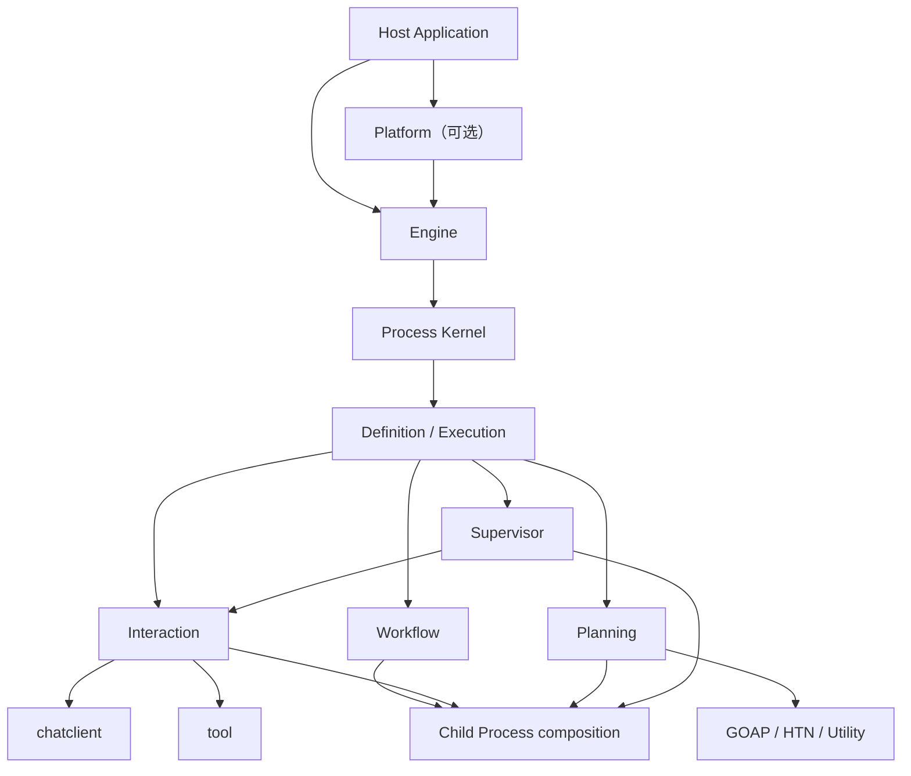

# Agent Framework 绿色重构架构

> 状态：已接受的目标设计基线，生产实现尚未开始
> 建立日期：2026-08-06
> 最后更新：2026-08-06
> 实施范围：重构期间为 `agent2`；最终替换后为唯一的 `agent`

本文只定义新 Agent Framework 的定位、领域语言、边界、目标结构和不可变量，不记录阶段进度、提交或临时实施细节。

- 架构决策及取舍原因见 [`DECISIONS.md`](DECISIONS.md)。
- 阶段任务、当前进度和执行事实见 [`EXECUTION_PLAN.md`](EXECUTION_PLAN.md)。
- 上位约束见 [`../../CLAUDE.md`](../../CLAUDE.md)、[`../../DESIGN_PHILOSOPHY.md`](../../DESIGN_PHILOSOPHY.md) 和 [`../../REFACTORING.md`](../../REFACTORING.md)。

代码与本文冲突时不得静默迁就：如果实现有误，修改实现；如果设计被事实推翻，先更新决策文档，再修改本文和代码。计划中的能力不能描述成已经交付。

---

## 1. 背景与重构边界

旧 [`agent`](../../agent) 最早移植自 Embabel Agent，保留了 GOAP、Goal、Action、Condition、Blackboard、Planner、Process 和子进程等重要思想。经过多轮 Go 化和产品化改造，它已经成为成熟且较深的 planner-driven framework，并被 `app/runtime` 等模块直接消费。

新的共同 Process 不再以 Planning 为中心。继续在旧模块内改变 Process、snapshot 和执行循环的本质，会让框架验证与应用迁移互相阻塞，因此采用平行模块绿色重构：

1. 在 `agent2` 内从最小执行窄腰开始，不承担旧公开 API 和 snapshot 兼容。
2. 用真实 Interaction、Planning 和 Workflow 实现反向验证共同抽象。
3. 在新模块独立闭合能力和测试之前，不迁移 `app/runtime`。
4. 完成后一次性迁移消费者、删除旧模块并把新模块改回 `agent`。

`agent2` 只是孵化目录，不是永久领域术语或计划长期发布的 v2 产品名。最终仓库只保留一个 `agent` 模块和一套公共 API。

### 1.1 旧模块是现成参考，不是兼容规范

并存期间可以直接阅读旧 `agent` 的生产实现、测试和文档，无需依赖 Git 历史还原已经解决过的问题。重点参考：

- GOAP、HTN、Utility 等算法及其正确性测试。
- Tool loop 的事件顺序、checkpoint/resume 和并发控制。
- Process tree、HITL、budget、usage、snapshot 和恢复中的已验证不变量。
- 旧模块历次边界清洗留下的反例与 architecture tests。

参考不等于复制：

- `agent2` 不 import 旧 `agent`，旧 `agent` 也不 import `agent2`。
- 旧代码不决定新 API、包结构或共同领域模型。
- 每项旧能力都要按“保留思想、重新实现、移除”裁决，并用新合同重新测试。
- 不为减少暂时重复，把旧 `agent` 的混合抽象下沉成所谓共享层。
- 旧模块在切换前保持可用，最终整体删除，不形成永久双轨。

---

## 2. 总体定位

> Agent 是一个可嵌入、可组合、拥有统一执行生命周期的 Go Framework；它允许 Interaction、Planning、Workflow、Supervisor 以及未来的新执行策略成为平等且可嵌套的 Agent Definition。

### 2.1 从直接能力到完整应用

框架必须允许使用者只支付当前需求所需的复杂度：

```text
直接 AI 能力
    chatclient / embeddingclient / tool
        ↓ 需要模型自主选择工具
本地 Agent 执行
    Engine + Interaction Definition
        ↓ 需要暂停恢复、预算和子任务
托管 Process 执行
    Engine + snapshot + child Process
        ↓ 需要多定义部署、路由和长期治理
完整 Agent 应用
    Platform + Host Application
```

“嵌入式”不是一种 Execution Mode，不建立 `EmbeddedMode`。可嵌入性来自显式依赖、无全局容器、可选持久化，以及同一 Engine 可以在普通 Go 进程内运行。

直接模型调用永远是一等路径。只需要一次或少量明确模型调用的程序应直接使用 `chatclient`，不应被迫创建 Agent、Process 或 Workflow。

### 2.2 能力上限

新架构提高的是系统的表达、组合、恢复和治理上限，而不是模型本身的智力。其关键性质是组合闭包：

> 任意 Agent Definition 可以启动另一个 Agent Definition 对应的子 Process；子 Process 可以使用任意执行策略并继续组合，而所有实例仍服从同一个 Process 生命周期。

---

## 3. 核心设计原则

1. **最小正确抽象优先。** 不为完整感预建 package、接口、配置或扩展点。
2. **一个概念只有一个术语。** 不同时保留 plan/todo、run/execution、sub-agent/child-agent 等近义公共概念。
3. **抽象程度向下递增，具体度向上累积。** 共同 Kernel 不承载 GOAP、ReAct、Workflow 或产品 Session 的专属状态。
4. **Execution Strategy 是主变化轴。** Interaction、Planning 和 Workflow 不是 Extension。
5. **Extension 只表达横切能力。** 事件观察、策略检查、instrumentation 等可以扩展；主控制流不能伪装成扩展。
6. **生命周期只有一个所有者。** Engine 是唯一 Process 驱动循环，具体策略只推进一个有界步骤。
7. **组合优于包装。** Workflow 不编译成伪 GOAP Agent；Supervisor 不包装成单 GOAP Action。
8. **状态归拥有者。** GOAP 状态归 Planning，消息和轮次归 Interaction，游标和分支归 Workflow。
9. **框架状态与应用持久化分层。** Agent 捕获、验证和恢复执行快照；Host 决定何时、在哪里、以何种事务保存。
10. **默认安全且确定。** 不默认重试任意副作用，不默认无限递归，不允许并发完成顺序决定业务结果。
11. **透明胜过魔法。** 不做扫描、注解、全局 DI、隐式策略注册或隐藏模型调用。
12. **简单方案先行。** 只有评测证明需要时，才从直接调用升级到 Workflow、多 Agent 或自主 Agent。

这些原则与 Anthropic 在 [Building effective agents](https://www.anthropic.com/engineering/building-effective-agents) 中强调的简单、透明、可组合以及重视工具接口设计的方向一致。

---

## 4. 统一领域语言

代码命名利用 package qualifier 避免口吃，例如最终模块中优先 `agent.Definition`，不写 `agent.AgentDefinition`。

| 术语 | 唯一含义 | 明确不表示 |
|---|---|---|
| `Definition` | 不可变的 Agent 行为定义，可创建或恢复 Execution | 运行实例、部署记录 |
| `Descriptor` | Definition 的稳定名称、描述、输入输出契约等静态信息 | 可变配置袋 |
| `Deployment` | 已校验、冻结、可精确恢复的 Definition | Process |
| `DeploymentRef` | Deployment 的稳定身份和值引用 | 指针、可变注册项 |
| `Execution` | 某个 Process 内、由具体策略拥有的可推进执行状态 | Engine、goroutine |
| `Process` | Engine 管理的运行实例及共同生命周期事实 | GOAP Process 专属状态 |
| `Transition` | 一次有界 Step 的结果及下一生命周期意图 | 任意应用事件集合 |
| `Engine` | 驱动 Process、执行状态迁移和父子调度的唯一执行内核 | 产品 Session runtime、部署市场 |
| `Platform` | 可选的多 Definition 部署、目录、路由和治理容器 | Engine 的同义词 |
| `Strategy` | Interaction、Planning、Workflow 等主执行语义 | Extension |
| `Action` | 框架内可组合、具有类型化输入输出的操作 | LLM Tool 的同义词 |
| `Tool` | 暴露给模型选择和调用的 JSON/Schema 能力 | 所有 Action |
| `Child Process` | 由另一个 Process 启动的普通 Process | 独立的 `SubAgent` 类型 |
| `Snapshot` | 可移植的执行状态捕获 | Store、事务或审计日志 |
| `Waiting` | 正在等待已声明的外部条件 | 人工暂停 |
| `Paused` | 由操作者或策略明确停止调度、等待继续 | 子任务尚未完成 |

命名反向约束：

- 不创建 `AgentManager`、`ExecutionService`、`RuntimeHelper`、`Common`、`Utils`、`Impl`。
- 不把 ReAct 命名为 `reactive`；Reactive Planner 和 ReAct 是不同概念。
- 不用 `Mode` 枚举承载本质不同的执行生命周期。
- 不为同一操作同时提供 `StartAgent`、`RunAgent`、`ExecuteAgent` 等含义重叠入口。
- 不创建 `SubAgent` 结构体；父子性存在于 Process relation。
- 不把暂时的 `agent2` 写入领域类型名、事件名或 snapshot kind。

---

## 5. 所有权边界

### 5.1 Agent Framework 拥有

- Definition 校验与 Deployment 冻结。
- Process 状态机和有界执行循环。
- Execution 的创建、推进、捕获和恢复。
- Process tree、子 Process 调度和父级唤醒。
- 通用 usage/budget 限制。
- Waiting、Paused、Completed、Failed、Killed 生命周期。
- Framework event 和通用可观测事实。
- snapshot envelope、校验和恢复协议。
- 执行策略的显式装配。

### 5.2 基础模块拥有

- `core/chat`：provider-neutral 请求、响应和流协议。
- `chatclient`：直接模型调用、middleware 和结构化输出。
- `embeddingclient`：直接 embedding 能力。
- `tool`/`tools`：工具协议、schema、调用和具体工具。
- `chathistory`：独立 history 能力。
- `otel`：官方 OTel API 的组合与 adapter。

Agent 复用这些能力，不复制 Client、Model、Tool、Message、Embedding 或 OTel 抽象。

### 5.3 Host Application 拥有

- 用户、Workspace、Conversation、Session、Turn 等产品身份。
- HTTP/WebSocket/SSE/desktop/CLI 传输协议。
- Store、Repository、数据库 schema、事务和 CAS/lease 策略。
- 产品权限、订阅、计费、审计和 retention。
- UI 文案、展示状态和产品事件映射。
- provider/model 选择、价格表和产品默认预算。
- checkpoint 的提交时机与应用 write-set。

`app/runtime` 最终只依赖 Agent 的中性生命周期合同，不解析 Planning、Interaction 或 Workflow 的内部 snapshot payload。

---

## 6. 目标架构与执行窄腰



### 6.1 窄腰

所有 Execution Strategy 只在以下语义上相交：

```text
Definition
  ├─ 描述静态契约
  ├─ 创建新的 Execution
  └─ 从自身状态恢复 Execution

Execution
  ├─ 推进一个有界 Step
  └─ 捕获自身可移植状态

Engine
  ├─ 创建和拥有 Process
  ├─ 调用 Execution.Step
  ├─ 应用 Transition
  ├─ 调度子 Process
  └─ 在满足等待条件时恢复父 Process
```

方向性接口如下，精确 Go 签名要用至少两个真实策略原型验证后冻结：

```go
type Definition interface {
	Descriptor() Descriptor
	Start(Input) (Execution, error)
	Restore(ExecutionState) (Execution, error)
}

type Execution interface {
	Step(context.Context) (Transition, error)
	Snapshot() (ExecutionState, error)
}
```

如果子 Process 能力需要注入 Execution，应由真实消费包定义最小接口，不能把完整 `*Engine` 或不断膨胀的 `ExecutionContext` 传给所有策略。优先验证由 Transition 声明 child start/wait effect，使 Engine 继续拥有生命周期副作用和幂等边界。

### 6.2 Step

`Step` 表示一个可调度、可捕获、边界明确的执行量，不等同于整个任务：

| Strategy | 一个 Step |
|---|---|
| Interaction | 一次模型响应及其当前工具调用批次，或一个明确挂起点 |
| GOAP | observe → plan → 执行首个 Action → reobserve 的一次闭环 |
| Workflow | 一个节点或一个具有确定提交语义的并行批次 |
| Supervisor | 一次模型决策及所选 Action/子任务的调度 |

任何 Strategy 的 Step 都不能永久占有调度线程、隐藏无限循环或启动无所有者 goroutine。

### 6.3 Process 状态机

共同 Process 只使用以下状态：

```text
NotStarted → Running
Running    → Waiting | Paused | Completed | Failed | Killed
Waiting    → Running | Failed | Killed
Paused     → Running | Killed
```

- `Continue`：仍可立即调度下一 Step。
- `Waiting`：等待工具结果、人类输入、时间、子 Process 或其他已声明条件。
- `Completed`：产生符合 Definition 输出契约的结果。
- Go `error`：当前 Step 失败，由 Engine 映射为 `Failed` 并保留 cause。
- `Stuck` 不是共同状态；GOAP 无可行计划属于 Planning 的结果和策略决定。

共同 Process 可以拥有：

- `ProcessID`、`RootProcessID`、`ParentProcessID`
- `DeploymentRef`
- `StartedAt`、`FinishedAt`
- `Status`、`Failure`、当前等待条件
- 通用 usage/budget
- Execution state envelope

共同 Process 不拥有：

- Goal、WorldState、Blackboard、Plan
- Messages、Round、Tool checkpoint
- Workflow cursor、branch、join
- 产品 Session、Conversation、Turn
- provider、model、USD 账本

### 6.4 Execution state envelope

共同 snapshot 只保存可判别的策略状态信封：

```go
type ExecutionState struct {
	Kind          string
	SchemaVersion uint16
	Payload       json.RawMessage
}
```

- Planning payload 拥有 Goal、WorldState、Blackboard、Plan exclusion 等。
- Interaction payload 拥有 Messages、Round、pending tool call 和 checkpoint。
- Workflow payload 拥有 cursor、branch state 和 join state。
- Supervisor payload 拥有 artifacts、候选 action 和当前决策状态。
- Host 可以持久化 envelope，但不得依据 `Kind` 解析 payload 并参与策略控制流。
- 恢复必须通过精确 `DeploymentRef` 找回 Definition；禁止全局 `kind → factory` 巨型 switch。

---

## 7. Execution Strategy

### 7.1 Interaction

Interaction 是模型根据环境反馈自主选择工具的原生 ReAct 类执行策略，适用于编码、研究、聊天和开放式任务。

目标能力包括普通与流式模型调用、稳定 Tool 边界、多轮循环、checkpoint、精确恢复、有界工具并行、HITL、usage 和完整生命周期事件。

不长期保留 `toolloop` 与 `interaction` 两套公共概念。工具循环是 Interaction 的实现机制；是否暴露更小的直接 Runner，必须由独立消费者证明，不能仅为了迁移旧代码保留。

### 7.2 Planning

Planning 表达已知 Action 模型上的目标导向选择。`Planner` 是 Planning 内部的真实可替换点：

```text
Planning Definition
    ├─ GOAP Planner
    ├─ HTN Planner
    ├─ Utility Planner
    └─ 后续有真实需求的新 Planner
```

Planning 独占 Goal、Condition、Truth、WorldState、Blackboard、PlannedAction metadata 和 replan/no-plan policy。

GOAP 适合目标可机器验证、存在多条路径、Action 前置条件/效果/成本可声明且环境会变化的场景。GOAP 不作为默认 Agent 语义，也不用于包装固定 Workflow 或开放式 ReAct 循环。

### 7.3 Workflow

Workflow 是预定义代码路径的原生 Execution，不编译回 GOAP。它原生表达 Sequence、Gate、Router/Switch、Fork/Join、Map/Reduce、Vote/Consensus、Loop 和 Agent call node。

节点具有显式输入、输出和失败语义。并行分支状态隔离，结果按定义顺序或明确 key 聚合，不能以 goroutine 完成顺序提交协议结果。

### 7.4 Supervisor

Supervisor 用模型动态选择 Action、拆分子任务和综合结果，适用于无法预先确定步骤的任务。它由 Interaction、Action-to-Tool adapter、typed artifacts 和 completion validator 组合，不是伪 Planner，也不是单 Action GOAP Agent。

### 7.5 新策略准入

只有当新模式拥有与现有 Strategy 本质不同的状态推进和恢复语义时，才增加新的 Definition/Execution。GOAP、HTN、Utility 共享 Planning 生命周期，应实现 Planner，而不是各自创建 Engine。

---

## 8. Action 与 Tool

Action 是框架可组合的类型化操作，表达稳定名称、准确描述、输入输出契约、执行行为以及明确错误和副作用语义。Planning 使用 `PlannedAction` 为 Action 增加 Preconditions、Effects、Cost 和 Value，不污染所有 Action。

Tool 是提供给模型的可调用协议，强调模型可理解的名称、描述、参数 schema 和结果。Action 可以适配成 Tool，但二者不是同义词：

- 普通 Workflow Action 不一定应暴露给模型。
- Tool 可能直接来自 MCP 或 Host，不一定参与 GOAP。
- 权限、sandbox、once-only、产品审批和事务属于 Host 装配策略。

子 Process 是 Engine 原语。在 Interaction/Supervisor 中，可以把它适配成模型友好的 `delegate_task` Tool；Workflow 和 Planning 直接使用框架组合 API。

模型参数只表达任务语义：

```text
task             子任务的具体目标和边界
expected_output  返回结果和验收要求
agent            可选目标 Definition；省略时由明确路由策略选择
```

Process ID、递归深度、预算、权限、版本和父子关系由 Engine 决定，不泄露给模型填写。

---

## 9. 子 Process 与递归组合

Agent 自递归不是当前 Go 调用栈再次进入同一个函数，而是同一个 Definition 创建一个新的子 Process：

```text
Process A₀
  └─ Process A₁
       └─ Process A₂
```

每个 Process 具有唯一 ID、独立 Execution state、独立 snapshot 和受划拨的预算。Definition 可以相同，Process 永远不同。

只建立两个正交语义：

1. `StartChild`：启动一个或多个子 Process。
2. `WaitForChildren`：按 `all`、`any` 或 `quorum` 条件等待结果。

同步调用是 start + wait-all 的便利组合；并行、竞速和投票由相同原语表达。长时间等待不得阻塞 Step：父 Execution 捕获状态并返回 Waiting，Engine 在条件满足后恢复它。

递归和动态委派必须由 Engine 强制约束：

- 最大深度、子 Process 总数、fan-out 和并行度。
- 最大 Step、模型调用、工具调用、token、cost 和 wall time。
- 子预算从父剩余预算中划拨，不能复制完整预算。
- 子能力只能是父能力的子集，不能递归提权。
- 父上下文按任务投影，不默认复制完整消息、Blackboard 或秘密。
- deadline 和 cancellation 向下传播。
- child start 使用稳定请求身份，恢复时不能重复创建。
- 子输出满足目标 Definition 的输出契约。
- 子 Process 不得等待祖先 Process。
- retry、部分成功、失败传播和聚合策略显式定义。
- 父子创建、等待、恢复和取消产生可观测事件。

Process tree 是执行、取消、预算和恢复的共同单位。如果未来需要多个父级共享结果，应通过显式 artifact/reference 建模，不能让 Process 同时拥有多个 parent。

---

## 10. Anthropic 编排模式覆盖

依据 [Building effective agents](https://www.anthropic.com/engineering/building-effective-agents) 的分类，目标覆盖如下：

| 模式 | 目标实现 | 路径由谁决定 |
|---|---|---|
| Augmented LLM | `chatclient` + retrieval + tools + memory | 单次模型调用 |
| Prompt Chaining | Workflow Sequence + Gate | 代码 |
| Routing | Workflow Router/Switch 或 Platform 路由 | 代码、分类器或模型 |
| Parallel Sectioning | Workflow Fork + Join | 代码 |
| Parallel Voting | Fork + Vote/Reduce | 代码 |
| Orchestrator-workers | Supervisor/Interaction 动态启动子 Process | 模型 |
| Evaluator-optimizer | Workflow Loop + generator/evaluator Definitions | 代码控制循环，可由模型评估 |
| Autonomous Agent | Interaction + tools +环境反馈 +停止条件 | 模型 |
| Pattern Composition | Agent call node 与 child Process | 代码与模型按边界组合 |

验收不能只证明类型存在，必须为每种模式提供行为测试和最小可运行示例。

---

## 11. Engine 与 Platform

### 11.1 Engine

Engine 是最小托管执行边界：启动、推进、暂停、恢复和终止 Process；调用有界 Step；应用合法状态迁移；管理 Process tree、等待和取消；捕获/恢复 snapshot；执行通用 limit/policy；发布中性 framework events。

Engine 不拥有产品 Session、数据库事务、模型 catalog、价格表或 UI 协议。

### 11.2 Platform

Platform 是建立在 Engine 上的可选完整形态，拥有 Deployment catalog、版本/digest、Definition 路由、多 Agent 组合发现和面向 Host 的治理入口。

本地嵌入式使用可以只创建 Engine 并运行显式 Definition；完整应用可以使用 Platform。二者共享 Process 和 Execution 语义，不建立两个 runtime。

### 11.3 Deployment 恢复

- Deployment 冻结 Definition 及影响恢复语义的配置。
- Process snapshot 始终记录精确 DeploymentRef。
- 恢复通过持有该 Deployment 的 catalog/resolver 完成。
- 不使用 package-global registry。
- 不通过 execution kind 猜测 concrete factory。
- Go 函数地址不能作为可靠实现身份；需要发布或 Host 提供稳定版本身份。

---

## 12. Snapshot、恢复与持久化

Agent Framework 负责捕获一致的 Process/tree 执行状态、校验 schema/DeploymentRef/父子关系/状态机不变量，并从已提供的 snapshot 和精确 Deployment 恢复。不可序列化状态必须显式失败。

Host 负责 Store、transaction、CAS、lease、幂等、retention、产品身份关联、应用 write-set 原子提交，以及崩溃后的调度政策。Agent 不定义 Store/Repository 来假装拥有持久化，也不在 Transition 内回调 Host transaction。

恢复约束：

- 不序列化 goroutine、调用栈、closure、客户端连接或 context。
- Strategy 把恢复所需状态显式放入自己的 ExecutionState。
- 外部副作用用幂等键、外部事实或显式 checkpoint 协议处理，不能只靠 snapshot 猜测。
- snapshot schema 在开发阶段直接 breaking，不保留长期 dual-read。

---

## 13. Extension、事件与可观测性

Extension 只用于横切行为，并保持一个同质扩展机制。候选能力包括 execution policy、event observation、guardrail 和 instrumentation decorator。只有一个实现且没有外部替换需求的内部依赖直接使用 concrete type。

事件描述已经发生的框架事实，不承担命令或产品协议：

- Process started/status changed/finished
- Step started/finished
- model call started/finished
- tool call started/finished
- child started/settled
- suspension created/resolved
- budget consumed/exhausted

事件时间字段具有准确语义；duration 从成对时间计算或由同一 owner 生成。Host 可以投影 UI、审计和账本，Agent 不反向依赖投影。

执行边界使用官方 OTel API 或外部 `otel` 模块提供的 decorator，不在 Kernel 重造 tracer/meter/logger 接口，也不以散落日志弥补缺失的生命周期事件。

---

## 14. 依赖与目标包结构

目标依赖方向：

```text
app/runtime ────────────────┐
                            ▼
                        agent facade
                            ▼
                     Engine / Platform
                            ▼
               Definition / Execution / Process
                  ▲          ▲          ▲
                  │          │          │
           interaction   planning   workflow
                              ▲          ▲
                              │          │
                       goap/htn/utility supervisor

interaction ──> chatclient + tool + core/chat
agent2 ──X──> old agent
agent2 ──X──> app/runtime
```

目录只在对应实现出现时创建：

```text
agent2/
├── root package files       公共窄腰、Engine、Process、常用入口
├── interaction/             模型/工具自主交互 Definition
├── planning/                Planning domain 与 Planner contract
│   ├── goap/                GOAP 实现
│   ├── htn/                 HTN 实现（需求验证后）
│   └── utility/             Utility 实现（需求验证后）
├── workflow/                原生确定性编排 Definition
├── supervisor/              模型驱动的动态 Action/子任务编排
├── hitl/                    有真实独立消费时的 typed helpers
├── internal/                仅用于确需编译器约束的共享实现
├── examples/                验证公共使用路径的可运行示例
└── doc/                     架构、决策与执行记录
```

约束：

- 不预建 `core/`、`runtime/`、`service/`、`manager/`、`common/`、`utils/` 等层次或泛名 package。
- 根 package 承载真正共同且不可再分的公共语义；策略专属类型留在策略 package。
- `internal` 只在两个以上内部 package 需要共享且不能公开时建立。
- 不为“整洁”机械拆包，以独立变化原因、依赖切断和真实消费者作为依据。
- 根 facade 不通过大量 alias 重导出所有高级类型。

---

## 15. API、实现与验收纪律

### 15.1 Go API

- 接口定义在消费方并保持最小；accept interfaces，return concrete structs。
- config 使用 options struct，不使用 builder 链和大量 variadic `WithXxx`。
- 不用 `any` 掩盖尚未想清楚的领域类型。
- 构造时校验并取得 slice/map/config 所有权。
- error 是合同；包装保留 `%w` cause，不按字符串分支。
- `context.Context` 只传取消、deadline 和请求范围值，不进入 snapshot。
- 并发有清晰 owner、停止条件和确定提交语义。
- 不为未来可能存在的实现预造接口或注册表。

### 15.2 Definition 与 Execution

- Definition 创建后不可变，并发共享安全。
- 每次 Start 创建独立 Execution。
- Execution 不被多个 Process 并发推进。
- Step 的状态变更可在 snapshot 中完整表达。
- Restore 验证 state kind/schema 和 Definition identity。
- Strategy 不能修改共同 Process 私有状态，只能通过 Transition 表达意图。

### 15.3 Retry 与副作用

- 任意 Action 和 Tool 默认执行一次。
- provider SDK 自有 retry 不在 Agent 重复实现。
- 只有明确幂等或有补偿语义时才配置 retry。
- 子 Process 创建、HITL response 和 checkpoint settlement 必须可去重。
- 不以“出错就再跑一次”掩盖状态所有权问题。

### 15.4 验收层次

- 单元测试：值对象、状态机、定义校验、策略算法。
- contract tests：Definition/Execution、Planner、snapshot codec、child composition。
- 集成测试：Engine 驱动真实 Strategy 的完整生命周期。
- 恢复测试：每个合法挂起边界 capture → restore → continue。
- property/fuzz：snapshot、状态转换、wire 解码和畸形 adapter 输出。
- race：Engine、事件、多子 Process 和显式并行路径。
- architecture tests：依赖 DAG、禁止旧 `agent`/`app/runtime` import、策略状态不进入共同 Process。
- examples：每一种正式公开编排方式至少一个最小可运行示例。

最终完成必须满足：Interaction、Planning、Workflow 都是原生 Execution；GOAP 真实可重规划；Anthropic 编排模式有行为测试；递归子 Process 可恢复、取消和预算限制；Framework snapshot 与 Host persistence 无交叉；`app/runtime` 只消费中性合同；旧模块和兼容路径全部删除；临时 `agent2` 路径改回唯一 `agent`。
