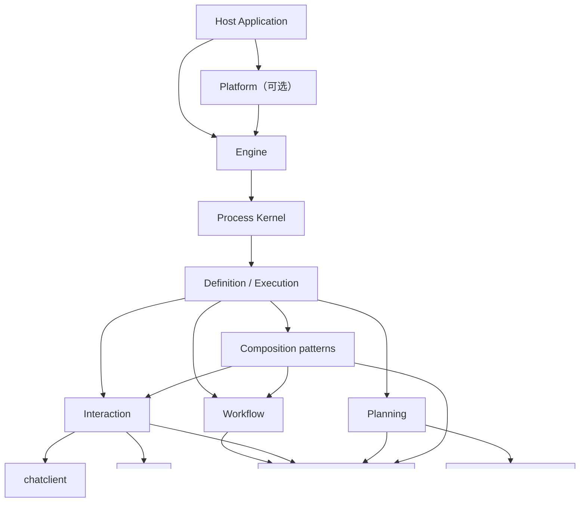

# Agent Framework 绿色重构架构

> 状态：已接受的目标设计基线，生产实现尚未开始
> 建立日期：2026-08-06
> 最后更新：2026-08-06
> 实施范围：重构期间为 `agent2`；最终替换后为唯一的 `agent`

本文只定义新 Agent Framework 的定位、领域语言、边界、目标结构和不可变量，不记录阶段进度、提交或临时实施细节。

- 架构决策及取舍原因见 [`DECISIONS.md`](DECISIONS.md)。
- 工程实施和代码质量标准见 [`ENGINEERING_STANDARDS.md`](ENGINEERING_STANDARDS.md)。
- 阶段任务、当前进度和执行事实见 [`EXECUTION_PLAN.md`](EXECUTION_PLAN.md)。
- 旧能力的归属、裁决和验收见 [`CAPABILITY_LEDGER.md`](CAPABILITY_LEDGER.md)。
- 上位约束见 [`../../CLAUDE.md`](../../CLAUDE.md)、[`../../DESIGN_PHILOSOPHY.md`](../../DESIGN_PHILOSOPHY.md) 和 [`../../REFACTORING.md`](../../REFACTORING.md)。

代码与本文冲突时不得静默迁就：如果实现有误，修改实现；如果设计被事实推翻，先更新决策文档，再修改本文和代码。计划中的能力不能描述成已经交付。

---

## 1. 背景与重构边界

旧 [`agent`](../../agent) 最早移植自 Embabel Agent，保留了 GOAP、Goal、Action、Condition、Blackboard、Planner、Process 和子进程等重要思想。经过多轮 Go 化和产品化改造，它已经成为成熟且较深的 planner-driven framework，并被多个 Host 直接消费。

新的共同 Process 不再以 Planning 为中心。继续在旧模块内改变 Process、snapshot 和执行循环的本质，会让框架验证与应用迁移互相阻塞，因此采用平行模块绿色重构：

1. 在 `agent2` 内从最小执行窄腰开始，不承担旧公开 API 和 snapshot 兼容。
2. 用真实 Interaction、Planning 和 Workflow 实现反向验证共同抽象。
3. 在新模块独立闭合能力和测试之前，不迁移现有 Host consumer。
4. 完成后一次性迁移消费者、删除旧模块并把新模块改回 `agent`。

`agent2` 只是孵化目录，不是永久领域术语或计划长期发布的 v2 产品名。最终仓库只保留一个 `agent` 模块和一套公共 API。

### 1.1 旧模块是现成参考，不是兼容规范

并存期间可以直接阅读旧 `agent` 的生产实现、测试和文档，无需依赖 Git 历史还原已经解决过的问题。重点参考：

- GOAP、HTN、Utility 等算法及其正确性测试。
- Tool loop 的事件顺序、checkpoint/resume 和并发控制。
- Process tree、HITL、budget、usage、snapshot 和恢复中的已验证不变量。
- 旧模块历次边界清洗留下的反例与 architecture tests。

参考不等于复制：

- `agent2` 不 import 旧 `agent`，旧 `agent` 也不 import `agent2`。
- 旧代码不决定新 API、包结构或共同领域模型。
- 每项旧能力都要按“保留思想、重新实现、移除”裁决，并用新合同重新测试。
- 不为减少暂时重复，把旧 `agent` 的混合抽象下沉成所谓共享层。
- 旧模块在切换前保持可用，最终整体删除，不形成永久双轨。

---

## 2. 总体定位

> Agent 是一个可嵌入、可组合、拥有统一执行生命周期的 Go Framework；它允许 Interaction、Planning、Workflow 以及未来被真实推进和恢复语义证明的新执行策略成为平等且可嵌套的 Agent Definition。

### 2.1 从直接能力到完整应用

框架必须允许使用者只支付当前需求所需的复杂度：

```text
直接 AI 能力
    chatclient / embeddingclient / tool
        ↓ 需要模型自主选择工具
本地 Agent 执行
    Engine + Interaction Definition
        ↓ 需要暂停恢复、预算和子任务
托管 Process 执行
    Engine + snapshot + child Process
        ↓ 需要多定义部署、路由和长期治理
完整 Agent 应用
    Platform + Host Application
```

“嵌入式”不是一种 Execution Mode，不建立 `EmbeddedMode`。可嵌入性来自显式依赖、无全局容器、可选持久化，以及同一 Engine 可以在普通 Go 进程内运行。

直接模型调用永远是一等路径。只需要一次或少量明确模型调用的程序应直接使用 `chatclient`，不应被迫创建 Agent、Process 或 Workflow。

### 2.2 能力上限

新架构提高的是系统的表达、组合、恢复和治理上限，而不是模型本身的智力。其关键性质是组合闭包：

> 任意 Agent Definition 可以启动另一个 Agent Definition 对应的子 Process；子 Process 可以使用任意执行策略并继续组合，而所有实例仍服从同一个 Process 生命周期。

---

## 3. 核心设计原则

1. **最小正确抽象优先。** 不为完整感预建 package、接口、配置或扩展点。
2. **一个概念只有一个术语。** 不同时保留 plan/todo、run/execution、sub-agent/child-agent 等近义公共概念。
3. **抽象程度向下递增，具体度向上累积。** 共同 Kernel 不承载 GOAP、ReAct、Workflow 或产品 Session 的专属状态。
4. **Execution Strategy 是主变化轴。** Interaction、Planning 和 Workflow 不是 Extension。
5. **Extension 只表达横切能力。** 事件观察、策略检查、instrumentation 等可以扩展；主控制流不能伪装成扩展。
6. **生命周期只有一个所有者。** Engine 是唯一 Process 驱动循环，具体策略只推进一个有界步骤。
7. **组合优于包装。** Workflow 不编译成伪 GOAP Agent；orchestrator-worker 语义由已成立的 Strategy 和 child Process 组合。
8. **状态归拥有者。** GOAP 状态归 Planning，消息和轮次归 Interaction，游标和分支归 Workflow。
9. **框架状态与应用持久化分层。** Agent 捕获、验证和恢复执行快照；Host 决定何时、在哪里、以何种事务保存。
10. **默认安全且确定。** 不默认重试任意副作用，不默认无限递归，不允许并发完成顺序决定业务结果。
11. **透明胜过魔法。** 不做扫描、注解、全局 DI、隐式策略注册或隐藏模型调用。
12. **简单方案先行。** 只有评测证明需要时，才从直接调用升级到 Workflow、多 Agent 或自主 Agent。
13. **输入、意图和事实严格分离。** Signal 进入 Execution，Transition 表达意图，Event 记录事实；三者不得互相冒充。
14. **状态推进与外部效果分离。** Step 只产生候选状态和 Effect 意图；模型、Tool、Action 和其他 I/O 由策略拥有的 Effect dispatcher 执行。

这些原则与 Anthropic 在 [Building effective agents](https://www.anthropic.com/engineering/building-effective-agents) 中强调的简单、透明、可组合以及重视工具接口设计的方向一致。

---

## 4. 统一领域语言

代码命名利用 package qualifier 避免口吃，例如最终模块中优先 `agent.Definition`，不写 `agent.AgentDefinition`。

| 术语 | 唯一含义 | 明确不表示 |
|---|---|---|
| `Definition` | 不可变的 Agent 行为定义，可创建或恢复 Execution | 运行实例、部署记录 |
| `Descriptor` | Definition 的稳定名称、描述、输入输出契约等静态信息 | 可变配置袋 |
| `Deployment` | 已校验、冻结、可精确恢复的 Definition | Process |
| `DeploymentRef` | Deployment 的稳定身份和值引用 | 指针、可变注册项 |
| `Input` | 创建 Process 时按目标 Descriptor 校验的不可变 wire value | Host request DTO、共享可变对象 |
| `Output` | Process 完成时按目标 Descriptor 校验的最终语义结果 | Delta 拼接、UI 投影 |
| `Execution` | 某个 Process 内、由具体策略拥有的可推进执行状态 | Engine、goroutine |
| `Process` | Engine 管理的运行实例及共同生命周期事实 | GOAP Process 专属状态 |
| `Signal` | Engine 接受并按序交给 Execution 消费的输入 | 已发生事实、状态修改入口 |
| `SignalID` | 一次 Signal 投递的稳定去重身份 | 等待目标身份 |
| `WaitID` | Engine 铸造并暴露给外部回答者的等待目标身份 | Signal 投递身份、策略 payload |
| `Transition` | 一次有界 Step 产生的候选状态和下一生命周期意图 | 任意应用事件集合、已提交事实 |
| `Effect` | Transition 声明的、在 Step 之外由 Engine 或策略 dispatcher 执行的操作意图 | Host transaction、任意业务事件 |
| `Prepared Step` | Effect 执行前由 Engine 原子记录、尚未 finalize 的候选状态与固定意图 | 已提交 Execution state、Host transaction |
| `Event` | 已经发生的框架事实 | Signal、命令、Transition |
| `Delta` | 执行期间产生的临时流式增量 | 完成结果、可恢复状态、权威记录 |
| `Engine` | 驱动 Process、执行状态迁移和父子调度的唯一执行内核 | 产品 Session runtime、部署市场 |
| `Platform` | 可选的多 Definition 部署、目录、路由和治理容器 | Engine 的同义词 |
| `Strategy` | Interaction、Planning、Workflow 等主执行语义 | Extension |
| `Action` | 框架内可组合、具有类型化输入输出的操作 | LLM Tool 的同义词 |
| `Tool` | 暴露给模型选择和调用的 JSON/Schema 能力 | 所有 Action |
| `Child Process` | 由另一个 Process 启动的普通 Process | 独立的 `SubAgent` 类型 |
| `Snapshot` | 可移植的执行状态捕获 | Store、事务或审计日志 |
| `Waiting` | 正在等待已声明的外部条件 | 人工暂停 |
| `Paused` | 由操作者或策略明确停止调度、等待继续 | 子任务尚未完成 |

命名反向约束：

- 不创建 `AgentManager`、`ExecutionService`、`RuntimeHelper`、`Common`、`Utils`、`Impl`。
- 不把 ReAct 命名为 `reactive`；Reactive Planner 和 ReAct 是不同概念。
- 不用 `Mode` 枚举承载本质不同的执行生命周期。
- 不为同一操作同时提供 `StartAgent`、`RunAgent`、`ExecuteAgent` 等含义重叠入口。
- 不创建 `SubAgent` 结构体；父子性存在于 Process relation。
- 不把暂时的 `agent2` 写入领域类型名、事件名或 snapshot kind。
- 不用 `Correlation` 同时表示 SignalID、WaitID、EffectID 或策略内部逻辑 key。

---

## 5. 所有权边界

### 5.1 Agent Framework 拥有

- Definition 校验与 Deployment 冻结。
- Process 状态机和有界执行循环。
- Execution 的创建、推进、捕获和恢复。
- Process tree、子 Process 调度和父级唤醒。
- Signal 接受、排序、去重、等待寻址和成功消费确认。
- Effect 稳定身份、调度顺序和框架内结算事实。
- 通用 usage/budget 限制。
- Waiting、Paused、Completed、Failed、Cancelled、TimedOut、Killed 生命周期。
- Framework event 和通用可观测事实。
- snapshot envelope、校验和恢复协议。
- 执行策略的显式装配。

### 5.2 基础模块拥有

- `core/chat`：provider-neutral 请求、响应和流协议。
- `chatclient`：直接模型调用、middleware 和结构化输出。
- `embeddingclient`：直接 embedding 能力。
- `tool`/`tools`：工具协议、schema、调用和具体工具。
- `chathistory`：独立 history 能力。
- `otel`：官方 OTel API 的组合与 adapter。

Agent 复用这些能力，不复制 Client、Model、Tool、Message、Embedding 或 OTel 抽象。

### 5.3 Host Application 拥有

- 用户、Workspace、Conversation、Session、Turn 等产品身份。
- HTTP/WebSocket/SSE/desktop/CLI 传输协议。
- Store、Repository、数据库 schema、事务和 CAS/lease 策略。
- 产品权限、订阅、计费、审计和 retention。
- UI 文案、展示状态和产品事件映射。
- provider/model 选择、价格表和产品默认预算。
- checkpoint 的提交时机与应用 write-set。
- 使应用自有事实失效的销毁、回滚、替换和恢复策略，以及关联 Process 的生命周期清理。

Host 最终只依赖 Agent 的中性生命周期合同，不解析 Planning、Interaction 或 Workflow 的内部 snapshot payload。

---

## 6. 目标架构与执行窄腰



### 6.1 窄腰

所有 Execution Strategy 只在以下语义上相交：

```text
Definition
  ├─ 描述静态契约
  ├─ 创建新的 Execution
  └─ 从自身状态恢复 Execution

Execution
  ├─ 按序消费 Signal
  ├─ 推进一个有界且无外部副作用的 Step
  ├─ 产生候选状态、Transition 和 Effect
  └─ 捕获自身可移植状态

Engine
  ├─ 创建和拥有 Process
  ├─ 调用 Execution.Step
  ├─ 应用 Transition
  ├─ 为 Effect 建立稳定身份并调用策略 dispatcher
  ├─ 将 Effect 结果重新投递为 Signal
  ├─ 调度子 Process
  └─ 在满足等待条件时恢复父 Process
```

方向性接口如下；P1 只验证候选形态，精确 Go 签名必须经过 P3 真实 Interaction、P4 child composition 和两个 disposable consumer 后才能冻结：

```go
type Definition interface {
	Descriptor() Descriptor
	Start(Input) (Execution, error)
	Restore(ExecutionState) (Execution, error)
}

type Execution interface {
	Step(context.Context, []Signal) (Transition, error)
	Snapshot() (ExecutionState, error)
}
```

公共窄腰使用可移植、类型擦除的 JSON value；泛型只用于边缘 typed adapter，不能把 `Definition[I, O]` 放进 Engine 必须同构保存的根合同。Descriptor 的输入输出 schema 是权威结构合同并进入 Deployment identity；Definition/typed adapter 仍负责 Go 类型和语义不变量。

Strategy Effect payload 和所有 Signal payload 对 Engine 不透明。每个 Strategy 在自己的 package 定义最小 dispatcher/codec，Deployment 冻结并绑定这些能力；Engine 只理解 Framework 自有 Effect、信封身份、路由、顺序、limit 和 settlement，不 import 或 type-switch 具体 Strategy。精确 dispatcher Go 签名与 raw value 封装仍须由 P1–P3 concrete prototypes 证明。

如果子 Process 能力需要注入 Execution，应由真实消费包定义最小接口，不能把完整 `*Engine` 或不断膨胀的 `ExecutionContext` 传给所有策略。子创建、等待、模型调用、Tool 和 Action 都通过 Transition 声明 Effect，使 Engine 继续拥有生命周期顺序，而 Strategy 继续拥有具体执行语义。

### 6.2 Step

`Step` 是单写者 Execution 上一次可调度、可捕获的状态归约，不等同于整个任务：

| Strategy | 一个 Step |
|---|---|
| Interaction | 消费模型/Tool/外部输入 Signal，决定下一 Effect、等待或完成 |
| GOAP | 消费观察/Action 结果，推进 observe → plan → act → reobserve 状态 |
| Workflow | 消费节点/子 Process 结果，推进一个节点、分支或 join |

任何 Strategy 的 Step 都不能执行模型、Tool、Action 或其他外部 I/O，不能永久占有调度线程、隐藏无限循环或启动无所有者 goroutine。外部操作只能由 Effect 表达并由该 Strategy 的 dispatcher 执行；Effect 的成功、失败或不确定结算以 Signal 回到下一 Step。

Engine 在每次 Step 前保留 last-stable ExecutionState。Step 必须是对相同 ExecutionState 与 Signal 序列产生相同候选语义的纯归约；不得读取 clock/random/global state，所需变化必须先成为 Signal。Step 返回 error、Transition 非法或候选 Snapshot 失败时，当前 Execution 实例视为不可信并被丢弃，从 last-stable state 重建用于诊断或显式后续控制；失败 Step 不自动重放。

通用提交分为 prepare/finalize 两个 Engine 内部原子边界：

1. 验证 Transition，捕获候选 ExecutionState，为 Effect 分配稳定 EffectID，并记录只读 prepared step；prepared step 包含 last-stable identity、候选状态、拟消费 Signal 范围、Transition 和冻结 Effect envelope，但尚不推进权威状态或消费游标。
2. 按 prepared EffectID 调度并取得 settlement。
3. 原子 finalize 候选状态、已消费 Signal 游标、Effect settlement、结果 Signal 入队和 Process transition，随后清除 prepared step 并发布 committed Event。

prepared step 是 Framework snapshot 的中性恢复事实，不是 Host transaction。崩溃在 prepare 前发生时不得已有 Effect；prepare 后恢复时沿原 EffectID 和冻结 payload 继续，只按 dispatcher replay contract 重投，未知结算保持可观察、待显式裁决。Effect 执行期间已经发生的 started/delta/finished 属于 attempt facts，不能伪装成提交后的事实。该顺序只描述 Framework 内部一致性；跨进程崩溃只能恢复到 Host 实际持久化的最后一份 snapshot，Framework 不虚构未持久化保证。

### 6.3 Workflow 图与节点边界

Workflow 使用原生 ExecutionState 保存确定性控制流，不编译成 Planning。Definition 是一个 schema 化 DAG：稳定 NodeID 标识节点，入口 schema 必须等于 Definition input，每条边的前后 schema 必须精确一致，每条路径最终都到达符合 Definition output schema 的 terminal。普通边禁止成环；受限重复只由拥有显式迭代上限的 Loop 节点表达。

节点词汇保持唯一：Transform 做本地纯值转换；Gate 做二选一；Switch 在显式 case 表中选路；Call 调用一个 exact child Deployment；Fork/Join 执行固定分支；Map/Reduce 执行动态有界 item；Vote 做稳定多数聚合；Loop 重复一个 child body。Prompt Chaining 是多个 Call 的顺序组合，不新增节点或 Strategy。Router、Parallel、ScatterGather、Consensus、Repeat、SubAgent 都不作为同义公共 API。

Transform/Gate/Switch/Join/Expand/Reduce/Vote key/Until 都是 Step 内的确定性纯函数。需要 I/O 或独立生命周期的工作只能成为 child Process。Fork/Map 按显式并发窗口分批启动真实 child，结果按声明/item 顺序聚合；Map 另有 item 数上限。Execution snapshot 只携带当前值、NodeID、分支或 item 游标、child/wait identity、已结算结果和迭代数，不携带 Engine、Deployment concrete value、callback、goroutine 或 Host 状态。

### 6.4 Process 状态机

共同 Process 只使用以下状态：

```text
NotStarted → Running
Running    → Waiting | Paused | Completed | Failed | Cancelled | TimedOut | Killed
Waiting    → Running | Failed | Cancelled | TimedOut | Killed
Paused     → Running | Cancelled | TimedOut | Killed
```

- `Continue`：仍可立即调度下一 Step。
- `Waiting`：等待工具结果、人类输入、时间、子 Process 或其他已声明条件。
- `Completed`：产生符合 Definition 输出契约的结果。
- 终态由 Engine 已记录的控制意图和 Step 结果共同决定，不能只按 error 文本或 `context.Canceled` 推断。
- Engine 显式 kill 映射为 `Killed`；父 Process 或 Host context 取消映射为 `Cancelled`，并用 cause 区分发起方。
- Process 或被提升为 Process 终止原因的 Effect deadline 映射为 `TimedOut`；deadline 不压成普通 `Failed`。
- 普通 Step error、外部失败、panic 或合同违约映射为 `Failed`，并保留稳定错误分类。
- 已提交终态 first-terminal-wins；迟到取消或 deadline 不能覆盖它。
- `Stuck` 不是共同状态；GOAP 无可行计划属于 Planning 的结果和策略决定。

候选终态矩阵按优先级匹配，P1 必须固化为表驱动合同：

| 已记录原因 | deadline 已到达 | Step/Effect 结果 | 终态 | cause |
|---|---:|---|---|---|
| Engine 显式 kill | 任意 | 任意 | `Killed` | Engine kill reason |
| Process/parent/Host deadline | 是 | 任意 | `TimedOut` | 准确 deadline owner |
| parent 取消 | 否 | 任意 | `Cancelled` | parent cancellation |
| Host context 取消 | 否 | 任意 | `Cancelled` | host cancellation |
| 无控制面取消 | 否 | 合同违约、外部失败或 panic | `Failed` | 稳定错误分类 |
| 无控制面取消 | 否 | 合法完成 | `Completed` | completion |

Effect 自己的取消或 deadline 先作为 settlement Signal 交给 Strategy；只有 Strategy/Engine 决定它终止整个 Process 时，才依据同一矩阵映射，不能把局部调用失败天然提升成 Process 终态。

共同 Process 可以拥有：

- `ProcessID`、`RootProcessID`、`ParentProcessID`
- `DeploymentRef`
- `StartedAt`、`FinishedAt`
- `Status`、准确 terminal cause/failure、当前等待条件
- 通用 usage/budget
- pending Signal 的不透明信封、到达序、投递状态和消费游标
- WaitID 与 Strategy logical wait key 的映射
- 尚未 finalize 的 prepared step envelope，其中唯一保存 pending Effect、稳定 EffectID 和逐项 settlement
- Execution state envelope

共同 Process 不拥有：

- Goal、WorldState、Blackboard、Plan
- Messages、Round、Tool checkpoint
- Workflow cursor、branch、join
- 产品 Session、Conversation、Turn
- provider、model、USD 账本

### 6.5 Execution state envelope

共同 snapshot 只保存可判别的策略状态信封：

```go
type ExecutionState struct {
	Kind          string
	SchemaVersion uint16
	Payload       json.RawMessage
}
```

- Planning payload 拥有 Goal、WorldState、Blackboard、Plan exclusion 等。
- Interaction payload 拥有 WorkingContext、Round、pending tool call 和 checkpoint。
- Workflow payload 拥有 cursor、branch state 和 join state。
- Host 可以持久化 envelope，但不得依据 `Kind` 解析 payload 并参与策略控制流。
- 恢复必须通过精确 `DeploymentRef` 找回 Definition；禁止全局 `kind → factory` 巨型 switch。

### 6.6 Signal、等待与安全消费

Signal 是唯一进入 Execution 的运行时输入。共同信封只包含稳定 SignalID、可选 WaitID 路由、准确接收时间和不透明 JSON payload；Engine 另行记录自身分配的单调序号、投递状态和消费游标。Signal 的 kind/schema 若有需要也必须封装在 owner 自有 payload 内，不能成为共同 Process 可解释的类型。Engine 不依据 payload 决定策略控制流，也不把具体 Signal 类型放进共同 Process。

Signal 投递合同必须满足：

- 同一 SignalID 的重复提交只产生一次逻辑消费。
- Running Process 接受的 Signal 排队到 Strategy 声明的下一安全 Step 边界。
- Waiting Process 只接受当前 WaitID 允许的输入；过期、已结算和错目标输入确定失败。
- Signal 游标只有在候选状态和 Transition 成功提交时推进；失败 Step 不永久吞掉输入。
- pending queue、去重事实和游标均可 snapshot，并受单项/总量 limit。

WaitID 由 Engine 铸造，Execution 不能自行生成外部等待身份。Execution 先通过 Transition 声明 logical wait；Engine 在 Effect settlement/finalize 时原子保存 WaitID 与 logical wait 映射并入队包含 WaitID 的内部 Signal，Execution 在下一 Step 将它写入私有状态并显式进入 Waiting。映射建立后提前到达的回答可以排队，但只能在对应安全边界消费。该往返保持 Execution 单写者，不允许 Engine 回调或直接修改 Strategy state。

不同 Strategy 必须声明自己的安全消费边界并用 contract tests 证明。Interaction 默认在已开始的模型调用和 Tool batch 结算后、下一模型 Effect 前消费 steer；其可观察生效延迟上界是当前不可中断 Effect 的剩余时长加下一 Step 的调度延迟，必须写入公开 GoDoc。通用 Engine 选择“等待结算”，不提供会遗弃不确定副作用的 interrupt-and-restart，也不假装拥有外部补偿语义。

### 6.7 Effect 与结算

Effect 是 Execution 请求 Step 之外操作的唯一方式。候选信封只区分 Framework 自有目标与 Deployment dispatcher 目标，并携带 owner-owned raw payload；Engine 依据 ProcessID、Step sequence 与 effect index 生成 EffectID 并冻结 payload。Engine 只解释 child/wait/timer 等封闭的 Framework Effect，Strategy Effect 整体交给绑定的 dispatcher 解释。dispatcher 不修改 Execution，只产生 Delta 和最终 settlement Signal；不得把模型、Tool、Action kind 提升为 Kernel union。

Engine-owned Effect 必须用 EffectID 保证重复调度不重复创建 child、wait 或其他 Framework 实体。模型、Tool、Action 等外部 Effect 的 dispatcher 必须把 EffectID 作为稳定请求身份并明确其 replay contract：只有已证明同一 EffectID 重放仍是同一逻辑操作时才允许自动重投。无法证明时，未知结算必须停留为可观察、待显式裁决的状态，不得静默重放或假装成功；业务事务、补偿和外部幂等实现仍属于具体 adapter 或 Host。

同一 Transition 的 Effect batch 可以按声明显式有界并发，但 EffectID 和 settlement 按 effect index 确定性归位；所需 settlement 未全部确定前不得提交候选状态。部分已完成、部分未知时保留每项结算事实，只按各自 replay contract 恢复，不能重跑整个 batch 或按完成先后生成协议结果。

### 6.8 输入、输出与 typed adapter

Engine 必须同构保存并运行异构 Definition，因此根窄腰不泛型化。Input、Output、Signal、Effect 和 ExecutionState 的 wire value 均使用被 owner 防御性复制且受大小限制的 JSON 表示，不用 `any` 或共享可变 `json.RawMessage` 绕过合同；严格解码和 payload 版本校验由拥有其 schema 的 Definition、Execution 或 dispatcher 完成。

Descriptor 携带权威 input/output schema；schema 及影响编码语义的配置进入 Deployment digest。Engine 在 start、complete 和 child settlement 边界执行结构校验，Definition 负责语义校验。常用 Go API 由边缘泛型 adapter 提供 `I ↔ raw input`、`raw output ↔ O` 的严格转换，但 Engine 和 catalog 永远只依赖非泛型 Definition。

---

## 7. Execution Strategy

### 7.1 Interaction

Interaction 是模型根据环境反馈自主选择工具的原生 ReAct 类执行策略，适用于编码、研究、聊天和开放式任务。

目标能力包括普通与流式模型调用、稳定 Tool 边界、多轮循环、checkpoint、精确恢复、有界工具并行、HITL、steer、usage 和完整生命周期事件。Interaction 的私有 WorkingContext 是当前 Execution 精确恢复所需的模型工作集，不等同于 Host 拥有的跨 Process 产品历史或 UI 记录。

不长期保留 `toolloop` 与 `interaction` 两套公共概念。工具循环是 Interaction 的实现机制；是否暴露更小的直接 Runner，必须由独立消费者证明，不能仅为了迁移旧代码保留。

### 7.2 Planning

Planning 表达已知 Action 模型上的目标导向选择。`Planner` 是 Planning 内部的真实可替换点：

```text
Planning Definition
    ├─ GOAP Planner
    ├─ HTN Planner
    ├─ Utility Planner
    └─ 后续有真实需求的新 Planner
```

Planning 独占 Goal、Condition、Truth、WorldState、Blackboard、PlannedAction metadata 和 replan/no-plan policy。

GOAP 适合目标可机器验证、存在多条路径、Action 前置条件/效果/成本可声明且环境会变化的场景。GOAP 不作为默认 Agent 语义，也不用于包装固定 Workflow 或开放式 ReAct 循环。

### 7.3 Workflow

Workflow 是预定义代码路径的原生 Execution，不编译回 GOAP。它原生表达 Sequence、Gate、Router/Switch、Fork/Join、Map/Reduce、Vote/Consensus、Loop 和 Agent call node。

节点具有显式输入、输出和失败语义。Sequence、Gate、Router 和单节点推进留在当前 Workflow Execution；Workflow 中命名为 Fork/Map 的每个独立分支以真实 child Process 运行，拥有独立身份、ExecutionState、snapshot 和预算。只需要并行执行一批无独立生命周期操作的节点不得伪称 Fork/Map，应由当前节点声明有界 Effect batch。父 Workflow 只保存 branch identity、等待条件与确定性聚合状态，不在同一 Process 内嵌套或驱动其他 Execution。

并行分支受 fan-out、并发、总 Process 和预算硬限制。结果按定义顺序或明确 key 聚合，不能以 goroutine 完成顺序提交协议结果。branch Definition/Deployment identity 必须稳定可恢复，不能依赖临时 closure 或数组下标碰巧不变。

### 7.4 Orchestrator-worker 组合

旧语境中所谓 Supervisor 当前统一称为 orchestrator-worker 组合：它由 Interaction、Action-to-Tool adapter、typed artifacts、completion validator 和 child Process 构成，不是独立 Strategy、独立 ExecutionState kind 或预建 package。只有未来实现证明它具有 Interaction/Workflow 无法表达的独立推进与恢复语义，才通过新 ADR 重新申请 Strategy 准入。

### 7.5 新策略准入

一个 Process 只有一个顶层 Execution 和一个顶层 ExecutionState envelope。Strategy 不得在同一 Process 内驱动另一个框架 Execution；组合跨越 Strategy 或需要独立暂停、恢复、预算、取消时必须创建 child Process。

只有当新模式拥有与现有 Strategy 本质不同的状态推进和恢复语义时，才增加新的 Definition/Execution。GOAP、HTN、Utility 共享 Planning 生命周期，应实现 Planner，而不是各自创建 Engine。

---

## 8. Action 与 Tool

Action 是框架可组合的类型化操作，表达稳定名称、准确描述、输入输出契约、执行行为以及明确错误和副作用语义。Execution 不在 Step 内直接执行 Action；Strategy dispatcher 按 Effect 执行并把结果作为 Signal 返回。Planning 使用 `PlannedAction` 为 Action 增加 Preconditions、Effects、Cost 和 Value，不污染所有 Action。

Tool 是提供给模型的可调用协议，强调模型可理解的名称、描述、参数 schema 和结果。Action 可以适配成 Tool，但二者不是同义词：

- 普通 Workflow Action 不一定应暴露给模型。
- Tool 可能直接来自 MCP 或 Host，不一定参与 GOAP。
- 权限、sandbox、once-only、产品审批和事务属于 Host 装配策略。

子 Process 是 Engine 原语。在 Interaction 及 orchestrator-worker 组合中，可以把它适配成模型友好的 `delegate_task` Tool；Workflow 和 Planning 直接使用框架组合 API。

模型参数只表达任务语义：

```text
task             子任务的具体目标和边界
expected_output  返回结果和验收要求
agent            可选目标 Definition；省略时由明确路由策略选择
```

Process ID、递归深度、预算、权限、版本和父子关系由 Engine 决定，不泄露给模型填写。

---

## 9. 子 Process 与递归组合

Agent 自递归不是当前 Go 调用栈再次进入同一个函数，而是同一个 Definition 创建一个新的子 Process：

```text
Process A₀
  └─ Process A₁
       └─ Process A₂
```

每个 Process 具有唯一 ID、独立 Execution state、独立 snapshot 和受划拨的预算。Definition 可以相同，Process 永远不同。

只建立两个正交语义：

1. `StartChild`：启动一个或多个子 Process。
2. `WaitForChildren`：按 `all`、`any` 或 `quorum` 条件等待结果。

同步调用是 start + wait-all 的便利组合；并行、竞速和投票由相同原语表达。长时间等待不得阻塞 Step：父 Execution 通过 Effect 请求 child start，捕获等待状态并返回 Waiting，Engine 将 child settlement 作为 Signal 恢复它。

递归和动态委派必须由 Engine 强制约束：

- 最大深度、子 Process 总数、fan-out 和并行度。
- 最大 Step、模型调用、工具调用、token、cost 和 wall time。
- 子预算从父剩余预算中划拨，不能复制完整预算。
- 子能力只能是父能力的子集，不能递归提权。
- 父上下文按任务投影，不默认复制完整消息、Blackboard 或秘密。
- deadline 和 cancellation 向下传播。
- 父 Process 的任意终态都不能遗留活动孤儿；父 deadline 在后代保留准确来源，其他父终态作为 parent cancellation 逐层传播。
- child start 使用稳定请求身份，恢复时不能重复创建。
- 子输出满足目标 Definition 的输出契约。
- 子 Process 不得等待祖先 Process。
- child failure 作为结果进入父 Execution；retry、fallback、部分成功、失败提升和聚合策略由编排显式定义，Engine 不自动猜测。
- 父子创建、等待、恢复和取消产生可观测事件。

Process tree 是执行、取消、预算和恢复的共同单位。如果未来需要多个父级共享结果，应通过显式 artifact/reference 建模，不能让 Process 同时拥有多个 parent。

---

## 10. Anthropic 编排模式覆盖

依据 [Building effective agents](https://www.anthropic.com/engineering/building-effective-agents) 的分类，目标覆盖如下：

| 模式 | 目标实现 | 路径由谁决定 |
|---|---|---|
| Augmented LLM | `chatclient` + retrieval + tools + memory | 单次模型调用 |
| Prompt Chaining | Workflow Sequence + Gate | 代码 |
| Routing | Workflow Router/Switch 或 Platform 路由 | 代码、分类器或模型 |
| Parallel Sectioning | Workflow Fork + Join | 代码 |
| Parallel Voting | Fork + Vote/Reduce | 代码 |
| Orchestrator-workers | Interaction 与 child Process 组合 | 模型 |
| Evaluator-optimizer | Workflow Loop + generator/evaluator Definitions | 代码控制循环，可由模型评估 |
| Autonomous Agent | Interaction + tools +环境反馈 +停止条件 | 模型 |
| Pattern Composition | Agent call node 与 child Process | 代码与模型按边界组合 |

验收不能只证明类型存在，必须为每种模式提供行为测试和最小可运行示例。

---

## 11. Engine 与 Platform

### 11.1 Engine

Engine 是最小托管执行边界：启动、推进、暂停、恢复和终止 Process；接受并投递 Signal；调用有界 Step；验证 Transition；为 Effect 建立稳定身份并调用 Deployment 绑定的 dispatcher；管理 Process tree、等待和取消；捕获/恢复 snapshot；执行通用 limit/policy；发布中性 framework events 和临时 delta。

Engine 不拥有产品 Session、数据库事务、模型 catalog、价格表或 UI 协议。

### 11.2 Platform

Platform 是建立在 Engine 上的可选完整形态，拥有 Deployment catalog、版本/digest、Definition 路由、多 Agent 组合发现和面向 Host 的治理入口。

本地嵌入式使用可以只创建 Engine 并运行显式 Definition；完整应用可以使用 Platform。二者共享 Process 和 Execution 语义，不建立两个 runtime。

### 11.3 Deployment 恢复

- Deployment 冻结 Definition 及影响恢复语义的配置。
- Process snapshot 始终记录精确 DeploymentRef。
- Engine 只依赖由自身消费位置定义的最小 DeploymentResolver，或在 restore 时显式接收已经解析的 Deployment。
- Platform 是 durable catalog、版本路由和治理实现，不在 Engine 内再建立第二份权威目录。
- 不使用 package-global registry。
- 不通过 execution kind 猜测 concrete factory。
- Go 函数地址不能作为可靠实现身份；需要发布或 Host 提供稳定版本身份。

---

## 12. Snapshot、恢复与持久化

Agent Framework 负责捕获一致的 Process/tree 执行状态、校验 schema/DeploymentRef/父子关系/状态机不变量，并从已提供的 snapshot 和精确 Deployment 恢复。不可序列化状态必须显式失败。

Host 负责 Store、transaction、CAS、lease、幂等、retention、产品身份关联、应用 write-set 原子提交，以及崩溃后的调度政策。Agent 不定义 Store/Repository 来假装拥有持久化，也不在 Transition 内回调 Host transaction。

恢复约束：

- 不序列化 goroutine、调用栈、closure、客户端连接或 context。
- Strategy 把恢复所需状态显式放入自己的 ExecutionState。
- Snapshot 只能在 last-stable 或 prepared-step 原子边界捕获；prepared snapshot 必须完整包含候选状态、拟消费 Signal 范围、EffectID、冻结 payload 和已有 settlement。两个边界之间的并发 capture 必须确定等待或拒绝，不能读半提交状态。
- Framework 定义一致 capture 点，Host 决定哪些 capture 被持久化；“已捕获”不等于“已持久化”。
- 单 Process snapshot 只允许恢复从未分配 child budget、没有 child relation 或活动 child wait 的独立 root；一旦形成 Process tree，恢复单位必须是完整 TreeSnapshot，禁止把 child 当新 root 或只恢复父级。
- TreeSnapshot 严格保存每个 Process snapshot 和 Engine-owned 活动 direct-child wait，不保存 dispatcher、resolver 或 Host persistence 对象。capture 使用 Engine 私有的安全边界栅栏：停止新 Step 和新 child 创建，等待 in-flight Effect 依既有 settlement 合同收口，同时继续吸收 child completion 与 parent termination，取得一致 cut 后立即释放；栅栏不是公开 Process 状态或第二执行入口。
- tree restore 先校验 root/parent/depth/ChildKey、预算总和、能力衰减、tree limits、活动 child wait 和每个精确 DeploymentRef，再原子注册完整树；任一校验或解析失败不得留下部分 Process。
- 只有在 Effect dispatch 前已向 Host 暴露 prepared snapshot 且 Host 明确认可该 durability boundary 时，Engine 才能宣称跨进程崩溃可恢复该 Effect；精确握手由 P1–P2 真实消费验证，但不得演变为 Framework Store/transaction SPI。未启用该边界的运行必须诚实标记为只恢复到最后已持久化 snapshot。
- 外部副作用用幂等键、外部事实或显式 checkpoint 协议处理，不能只靠 snapshot 猜测。
- snapshot schema 在开发阶段直接 breaking，不保留长期 dual-read。

Interaction 默认把精确恢复所需的 WorkingContext 自足地保存在私有 ExecutionState；Host 的产品历史不是恢复时可静默重建它的第二真相源。若某个 Strategy 真实依赖可变外部事实，只能在自己的 state 保存不透明 revision/digest，并由该 Strategy 的 provider 校验；外部事实变化时拒绝精确恢复，从新事实开始属于创建新 Process。

Host 对自身事实执行销毁、回滚、替换或恢复时，必须在自己的生命周期/write-set 中终止并清理失效关联的 Process、snapshot 和 continuation。Framework 只提供中性 lifecycle/capture 能力，不认识产品身份、历史水位、删除集合或数据库原子性，这些值不得进入共同 Process snapshot。

---

## 13. Extension、事件与可观测性

Extension 只用于横切行为，并保持一个同质扩展机制。候选能力包括 execution policy、event observation、guardrail 和 instrumentation decorator。只有一个实现且没有外部替换需求的内部依赖直接使用 concrete type。

Event 描述已经发生的框架事实，不承担 Signal、命令、Transition 或产品协议。Event 分为 attempt facts 与 committed facts：前者证明一次模型、Tool 或 Effect 确实尝试过，后者证明状态或 Effect settlement 已由 Engine 提交。

- Process started/status changed/finished
- Step started/finished
- model call started/finished
- tool call started/finished
- child started/settled
- suspension created/resolved
- budget consumed/exhausted

Delta 是与 Event 不同的临时流输出。Delta 缓冲显式有界、按调用内 sequence 排序、恢复后不重放；慢消费者造成的丢弃必须通过 gap/dropped count 可观察。观察型 listener 失败不改变 Step 或 Process 结果，也不得产生无 owner goroutine。完成 Output 必须由最终 Effect settlement/Transition 独立导出，不能由 delta 拼接成为唯一真相。

事件时间字段具有准确语义；duration 从成对时间计算或由同一 owner 生成。Host 可以投影 UI、审计和账本，Agent 不反向依赖投影。

执行边界使用官方 OTel API 或外部 `otel` 模块提供的 decorator，不在 Kernel 重造 tracer/meter/logger 接口，也不以散落日志弥补缺失的生命周期事件。

---

## 14. 依赖与目标包结构

目标依赖方向：

```text
Host Application ──────────┐
                            ▼
                        agent facade
                            ▼
                     Engine / Platform
                            ▼
               Definition / Execution / Process
                  ▲          ▲          ▲
                  │          │          │
           interaction   planning   workflow
                              ▲          ▲
                              │          │
                       goap/htn/utility

interaction ──> chatclient + tool + core/chat
agent2 ──X──> old agent
agent2 ──X──> Host application modules
```

目录只在对应实现出现时创建：

```text
agent2/
├── root package files       公共窄腰、Engine、Process、常用入口
├── interaction/             模型/工具自主交互 Definition
├── planning/                Planning domain 与 Planner contract
│   ├── goap/                GOAP 实现
│   ├── htn/                 HTN 实现（需求验证后）
│   └── utility/             Utility 实现（需求验证后）
├── workflow/                原生确定性编排 Definition
├── hitl/                    有真实独立消费时的 typed helpers
├── internal/                仅用于确需编译器约束的共享实现
├── examples/                验证公共使用路径的可运行示例
└── doc/                     架构、决策与执行记录
```

约束：

- 不预建 `core/`、`runtime/`、`service/`、`manager/`、`common/`、`utils/` 等层次或泛名 package。
- 根 package 承载真正共同且不可再分的公共语义；策略专属类型留在策略 package。
- `internal` 只在两个以上内部 package 需要共享且不能公开时建立。
- 不为“整洁”机械拆包，以独立变化原因、依赖切断和真实消费者作为依据。
- 根 facade 不通过大量 alias 重导出所有高级类型。
- `Process` 的构造权只属于 Engine；公开只读/控制面不能绕过合法状态机创建或改写 Process。

---

## 15. API、实现与验收纪律

### 15.1 Go API

- 接口定义在消费方并保持最小；accept interfaces，return concrete structs。
- config 使用 options struct，不使用 builder 链和大量 variadic `WithXxx`。
- 不用 `any` 掩盖尚未想清楚的领域类型。
- 公共 wire value 使用严格、版本化、owner-copy 的 JSON；泛型只放在类型安全的边缘 adapter，不泛型化 Engine 根合同。
- 构造时校验并取得 slice/map/config 所有权。
- error 是合同；包装保留 `%w` cause，不按字符串分支。
- `context.Context` 只传取消、deadline 和请求范围值，不进入 snapshot。
- 并发有清晰 owner、停止条件和确定提交语义。
- 不为未来可能存在的实现预造接口或注册表。

### 15.2 Definition 与 Execution

- Definition 创建后不可变，并发共享安全。
- 每次 Start 创建独立 Execution。
- Execution 不被多个 Process 并发推进。
- 一个 Process 只拥有一个顶层 Execution/ExecutionState；Strategy 组合通过 child Process。
- Step 只归约状态和声明 Effect，不执行外部 I/O。
- Step 的状态变更可在 snapshot 中完整表达。
- Restore 验证 state kind/schema 和 Definition identity。
- Strategy 不能修改共同 Process 私有状态，只能通过 Transition 表达意图。

### 15.3 Retry 与副作用

- 任意 Action 和 Tool 默认执行一次。
- provider SDK 自有 retry 不在 Agent 重复实现。
- 只有明确幂等或有补偿语义时才配置 retry。
- 子 Process 创建、HITL response 和 checkpoint settlement 必须可去重。
- Engine 为 Effect 提供稳定身份，但不能据此宣称外部业务副作用已具备事务或幂等语义。
- 不以“出错就再跑一次”掩盖状态所有权问题。

### 15.4 验收层次

- 单元测试：值对象、状态机、定义校验、策略算法。
- contract tests：Definition/Execution、Signal/Transition/Event、Effect settlement、Planner、snapshot codec、child composition。
- 集成测试：Engine 驱动真实 Strategy 的完整生命周期。
- 恢复测试：每个合法挂起边界 capture → restore → continue。
- property/fuzz：snapshot、状态转换、wire 解码和畸形 adapter 输出。
- race：Engine、事件、多子 Process 和显式并行路径。
- architecture tests：依赖 DAG、禁止旧 `agent`/Host application import、策略状态和产品外部事实不进入共同 Process、Process 只能由 Engine 构造。
- examples：每一种正式公开编排方式至少一个最小可运行示例。

最终完成必须满足：Interaction、Planning、Workflow 都是原生 Execution；GOAP 真实可重规划；Anthropic 编排模式有行为测试；递归子 Process 可恢复、取消和预算限制；Framework snapshot 与 Host persistence 无交叉；Host 只消费中性合同；旧模块和兼容路径全部删除；临时 `agent2` 路径改回唯一 `agent`。
