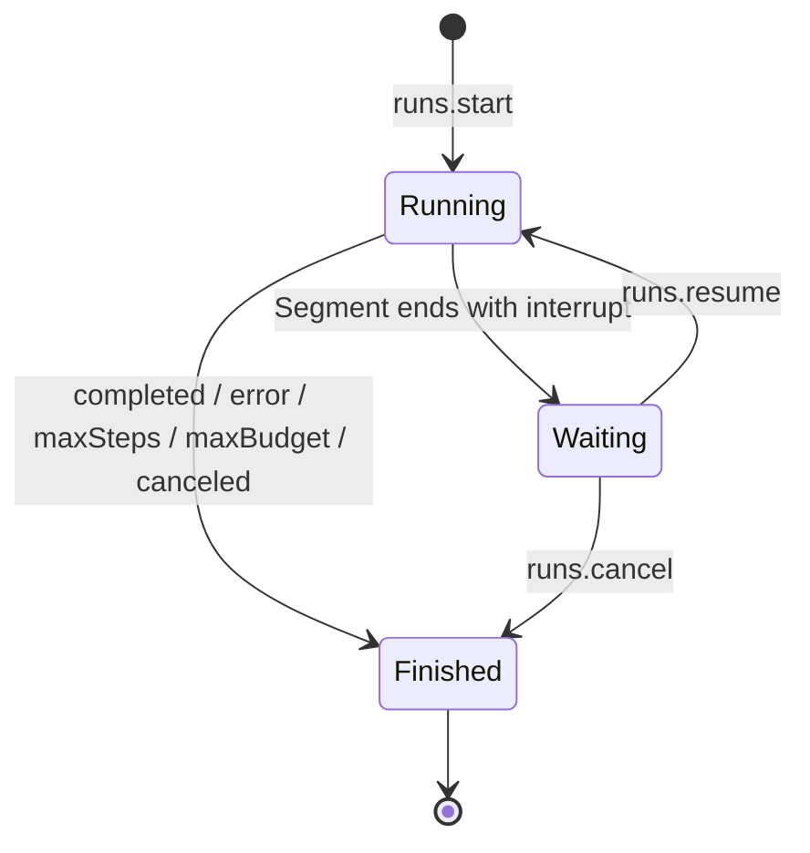

# Lyra Runtime API 设计对照与演进指南

> 作者：Codex  
> 基线日期：2026-07-27  
> 状态：持续演进的独立复核稿，不是当前 wire 的 canonical 规范  
> 适用范围：`app/runtime`、`app/desktop` 及未来 Go / TypeScript / 第三方客户端

## 0. 文档定位

本文基于以下对象的官方文档与 Lyra 当前实现做协议级对照：

- [OpenCode v2 HttpApi](https://opencode.ai/v2/docs/api)
- [Codex App Server](https://learn.chatgpt.com/docs/app-server)
- [Claude Code Agent SDK](https://code.claude.com/docs/en/agent-sdk)
- Lyra 当前协议：
  [`API.md`](../desktop/docs/protocol/API.md)、
  [`AUX_API.md`](../desktop/docs/protocol/AUX_API.md)、
  [`TRANSPORT.md`](../desktop/docs/protocol/TRANSPORT.md)
- Lyra 当前 Go wire：
  [`internal/delivery/protocol`](../runtime/internal/delivery/protocol)
- Lyra 当前前端 RPC：
  [`frontend/src/rpc`](../desktop/frontend/src/rpc)
- 同期收敛稿与唯一决策账本：
  [`PROTOCOL_DESIGN.md`](PROTOCOL_DESIGN.md)

如本文与当前 canonical 协议冲突，当前实现仍以 canonical 协议和代码为准；本文用于指导下一轮经确认的破坏性协议调整。

本文已同步 `PROTOCOL_DESIGN.md` 在提交 `9a06051ba` 的最新收敛结论，并保留独立复核。两份文档的职责明确分开：

- `PROTOCOL_DESIGN.md` 是团队收敛稿，§19 是**唯一决策账本**；
- 本文是 Codex 独立复核稿，负责补证据、挑战结论、提出替代方案；
- 本文不再复制一份待决事项账本；新的正式裁决只登记到收敛稿。

为避免把“仓库现状”和“设计偏好”写成同一种语气，全文按三类结论理解：

- **已核实事实**：能在当前代码、canonical 文档或锁定的上游源码中直接定位；
- **目标决策**：本文推荐的目标语义；breaking change 已获授权，但实现前仍须先把精确 shape 记入唯一决策账本；
- **待决问题**：存在真实取舍，必须先定义语义，不能借实现过程暗中决定。

> **Breaking change 授权（2026-07-27）**：本轮不再为了兼容当前错误 shape、方法名或 TypeScript 导出而保留双机制。每批改动仍须可独立回滚；改 wire 必须 bump `protocolVersion`；Go、前端、生成物、fixtures 和文档必须同批更新并全绿。允许破坏兼容不等于允许跳过语义决策或验证。

外部对照也要区分来源稳定性：公开稳定文档、Experimental 文档与仓库 HEAD 不是同一级契约。尤其 OpenCode 当前公开 `/api/event` 文档与其新版源码中的 durable session event API 不能混写成一个结论。

本文追求的不是“像某一家”，而是：

1. 从 OpenCode 吸收 HTTP API 的可发现性、耐久接收和资源查询能力；
2. 从 Codex 吸收精确状态建模、并发前置条件、机器契约和客户端生命周期经验；
3. 从 Claude Code 吸收 session resume/fork、长时间 HITL defer 和 Agent 控制面的经验；
4. 保留 Lyra 已经更适合本产品的 Streamable HTTP、R 模型、领域中立工具和单事件流；
5. 保留一个判别字段 `type`、真实领域根和 Item / state / custom 三条扩展缝；
6. 删除所有会制造双重真相、非法状态、连接耦合和客户端认知负担的设计。

---

## 1. 总体结论

Lyra 当前的协议方向是正确的，不应改造成 OpenCode 式的大型 REST API，也不应照搬 Codex 的双向连接或 Claude Code 的进程级 SDK 消息联合。

Lyra 应继续坚持：

- JSON-RPC 作为 transport-neutral 的语义层；
- HTTP POST 响应内 SSE 作为桌面端主流式传输；
- Session → Run → Segment → Item 的执行中心模型；
- HITL 先耐久停车、随后恢复同一个 Run；
- completed / snapshot 是权威终态，delta 只是可丢预览；
- 通用 `ToolInvocation`，而不是不断扩大的领域工具联合；
- runtime 无 user / account / multitenancy 概念；
- 业务错误不映射 HTTP status；
- 能力通过 discovery 与开放 feature map 协商。

真正需要优先解决的不是传输形式，而是：

1. **Run 与 Segment 的状态语义矛盾**；
2. **协议 SSOT、机器 schema 和前端类型没有形成闭环**；
3. **event cursor 的作用域与重放保证不清晰**；
4. **steer 等控制命令缺少并发前置条件**；
5. **跨 Segment 的 usage / steps / budget / duration 没有闭合语义**；
6. **重复文档和手写类型已经发生现实漂移**；
7. **现有 `workspace.subscribe` 已混合工作树数据与 runtime 控制面，应在 breaking 版本中收敛为一个职责明确、可过滤的失效订阅**。

一句话目标：

> 用户看到的是“一个对话里发起了一次任务，它可以运行、等待我、继续、完成”；Agent 看到的是“一个逻辑 Run 包含若干执行 Segment 和一条权威 Item 时间线”；客户端不需要理解 transport、goroutine、executor process 或内部 checkpoint。

---

## 2. 顶层设计目标

### 2.1 人体工程学目标

最小客户端应该只需要理解：

1. 创建或选择 Session；
2. 发起 Run；
3. 消费 Item 和 Run 事件；
4. 遇到 Interrupt 时回答；
5. 通过 `items.list` 恢复历史。

高级客户端可以在不改变核心心智模型的前提下增加：

- subagent 树；
- workspace / git；
- MCP；
- provider / model；
- memory；
- schedules / goals；
- usage / cost；
- experimental features。

不允许最小客户端为了发一条消息而理解：

- 连接身份；
- 服务端 goroutine；
- executor process id；
- checkpoint 存储格式；
- 多种并行的消息、步骤、任务、后台作业模型；
- 同一业务操作的 REST 与 RPC 两套入口。

### 2.2 Agent 心智模型目标

Agent 的事实模型应当只有四层：

```text
Session  对话与工作目录的长期容器
  └─ Run  一次用户意图 / 逻辑回合，跨 HITL 保持同一身份
       ├─ Segment  一段连续执行；可因等待人类而结束
       └─ Item     用户、模型、推理、计划、问题、工具等权威时间线单元
```

其中：

- Run 是用户感知的任务；
- Segment 是执行资源的租约，不是用户任务；
- Interrupt 是 Run 的等待状态，不是 Run 的完成结果；
- Item 是可持久化、可回放、可渲染的工作单元；
- tool loop、subagent、compaction 都不能再发明第二套“任务”概念。

### 2.3 协议工程目标

- **语义唯一**：一个概念只允许一种 wire 表达。
- **非法状态不可表达或必须在边界拒绝**。
- **最小核心、开放扩展**：核心生命周期闭合；工具、feature、插件命名空间开放。
- **权威状态优先**：实时流可以降级，冷读必须恢复正确状态。
- **传输可替换**：HTTP、in-process、未来 IPC 共享同一业务协议。
- **机器可验证**：method、schema、event、error、client types 来自一个可执行契约。
- **并发显式**：所有可能命中错误执行实例的命令都带前置条件。
- **失败可行动**：错误告诉客户端发生了什么、用户能做什么，而不是暴露内部异常。
- **判别唯一**：wire 联合只使用 `type`；不允许同层混用 `kind`、`event`、`subtype`。
- **领域根真实**：`workspace.*` 只表达工作树；session、goal、MCP 等不能因已有一条流就寄生在 workspace。
- **扩展缝唯一**：durable 历史产物用 Item；Run 期共享终值用 state；一次性扩展信号用 custom。
- **无隐式全局状态**：不依赖连接级 active project、调用仪式或某个在线客户端。

---

## 3. 四方设计对照

| 维度       | OpenCode v2                                   | Codex App Server                            | Claude Code                            | Lyra 目标                                                 |
| ---------- | --------------------------------------------- | ------------------------------------------- | -------------------------------------- | --------------------------------------------------------- |
| 对外形态   | REST / OpenAPI；当前标为 Experimental HttpApi | 双向 JSON-RPC over stdio / WS / Unix socket | Agent SDK / CLI；进程级 AsyncGenerator | JSON-RPC + Streamable HTTP；同协议支持 in-process         |
| 核心资源   | Session / Message / Part                      | Thread / Turn / Item                        | Session / SDKMessage / Result          | Session / Run / Segment / Item                            |
| 初始化     | HTTP 自描述，无连接握手                       | 每连接 `initialize` → `initialized`         | SDK 启动子进程并初始化                 | `runtime.discover` 可选；请求自描述，不依赖连接状态       |
| 流式       | 全局 `/api/event` SSE                         | 同一双向连接通知                            | `Query extends AsyncGenerator`         | 每个流式调用使用自己的 POST 响应流                        |
| 事件可靠性 | 全局 event 流是 live/experimental；新版源码另有 session durable history/replay | 连接通知 + 持久 thread/item 查询            | session transcript + 当前进程流        | 明确区分权威持久、live replay、ephemeral                  |
| HITL       | REST 资源与应答端点                           | server→client JSON-RPC request              | callback 等待；TypeScript 可 defer     | durable Interrupt + `runs.resume`，不绑定某个连接         |
| steer      | session prompt 支持 steer delivery            | `turn/steer` + `expectedTurnId`             | streaming input / control methods      | `runs.steer` + `expectedSegmentId`                        |
| schema     | OpenAPI 文档和生成客户端                      | 运行中版本生成 TS / JSON Schema             | SDK 自带 TS / Python 类型              | Go 契约注册表生成 OpenRPC / JSON Schema / TS / validators |
| 工具建模   | 消息 part 与工具事件                          | 多种强类型 Item                             | SDKMessage / tool use 联合             | 领域中立 `ToolInvocation` + 展示注册表                    |
| 错误       | HTTP status + body                            | RPC error + turn/item failure               | SDK result/error subtype               | RPC / Run / Tool 三个明确落点，统一 Problem               |
| 多客户端   | HTTP 天然松耦合                               | 请求绑定连接，需处理订阅                    | SDK handle 通常单宿主                  | 任意客户端可查询并恢复，不依赖原连接                      |

---

## 4. 各家应吸收与应拒绝的部分

### 4.1 OpenCode

#### 应吸收

1. **耐久接收、实时推送和 durable replay 分层**  
   OpenCode 的公开全局 event 流是 live/experimental；新版源码又增加了按 aggregate sequence 读取 durable session history、先 replay 后 tail 的 session event API。真正值得吸收的不是某一条 endpoint，而是三件事分开：命令是否已被接收、当前 live 事件是否到达、历史事实是否能从 durable projection/replay 恢复。

2. **资源查询能力完整**  
   Session、message、provider、model、MCP、filesystem 等都有可发现的查询入口，适合调试、第三方集成和生成 SDK。

3. **OpenAPI 可发现性**  
   API 路径、参数、错误和示例可被工具直接消费。Lyra 应通过 OpenRPC + JSON Schema 达到同等可发现性，而不是改成 REST。

4. **client-provided input identity / admitted sequence 的思想**  
   Lyra 已有 Idempotency-Key 和 `userItemId`，应继续保证“输入只被接收一次、客户端可精确对账”。

#### 应拒绝

1. **大型 REST 路由面**  
   `resource/action` 逐步增长后容易形成大量风格不一致的 endpoint，并让 transport 形态侵入业务语义。

2. **全局常开事件总线**  
   它需要连接路由、订阅管理和全局 fan-out；与 Lyra“一次操作一条流”的模型冲突。

3. **以 live 事件承担正确性**  
   无论 live stream 是否支持部分 durable replay，Lyra 都不能让最终 Item、Interrupt 或 Run 状态只能从流中获得。

### 4.2 Codex App Server

#### 应吸收

1. **版本精确的 schema 生成**  
   `generate-ts` 和 `generate-json-schema` 由正在运行的版本生成，避免文档、服务端和客户端各自猜测。

2. **Thread / Turn 状态与持久历史分开**  
   `thread/read` 不需要把 thread 加载进执行内存；`notLoaded / idle / active / systemError` 也不与某个 Turn 的完成原因混为一谈。

3. **控制命令的预期实例校验**  
   `turn/steer.expectedTurnId` 防止延迟命令注入错误 Turn。Lyra 应采用 `expectedSegmentId`。

4. **权威 Item + 专用 delta**  
   `item/completed` 是权威，delta 只用于体验。这与 Lyra 的正确方向一致。

5. **显式 resolved 通知**  
   `serverRequest/resolved` 让另一个动作、超时或取消清理 pending UI。Lyra 不需要 server request，但需要 equivalent 的“Interrupt 已被其他客户端解决”失效通知。

6. **冷读与加载分离**  
   历史查询不能隐式启动 executor、占用 Session admission 或建立订阅。

#### 应拒绝

1. **mandatory connection handshake 进入核心协议**  
   它适合双向长连接，不适合 Lyra 的 stateless HTTP / in-process 一致性目标。

2. **server→client JSON-RPC request**  
   它把 HITL 绑定到某条连接和某个客户端，增加多客户端、断线与恢复复杂度。

3. **把越来越多执行类别提升成一等 Item 联合**  
   Codex 的 first-party command execution、file change、MCP call 等强类型 Item 为客户端提供了明确语义，但新增一等执行类别会联动 wire、审批和 UI。Lyra 应只把真正具有独立生命周期的领域概念提升为 Item；普通新工具继续留在通用 ToolInvocation 窄腰中。

4. **通知 method 数量随 delta 类型增长**  
   Lyra 单一 `notifications.run.event` 更适合统一 reducer 和 transport。

### 4.3 Claude Code

#### 应吸收

1. **Query 是流，也是控制句柄**  
   流式结果与 interrupt、set model、set permission mode、close 等控制能力被组织在同一个高层 SDK 对象中。Lyra 生成的客户端也应提供类似的人体工程学，而不是让 UI 手动拼 JSON-RPC。

2. **session resume / fork 是一等能力**  
   对话身份、恢复和分支清晰；文件 checkpoint 与 session transcript 分离。

3. **短等待与长等待的统一语义**  
   callback 可以一直等待，TypeScript 的 `defer` 可以退出进程后恢复。Lyra 应始终保证 durable resume，同时允许服务端内部短期保温 executor，优化延迟但不改变 wire 语义。

4. **权限规则与本次应答分开**  
   一次批准、参数改写、长期规则是不同概念。Lyra 当前的 `editedArgs` one-shot 与 session/project/global remembered rules 方向正确。

5. **最终 Result 汇总 usage、cost、duration、terminal reason**  
   终态必须自包含，客户端不应从 delta 反推总量。

#### 应拒绝

1. **直接把 SDKMessage 联合当网络协议**  
   其中包含大量进程实现、hook、plugin、auth、local command 和调试细节，不适合作为稳定跨语言 wire。

2. **正确性依赖 callback 进程一直存活**  
   Desktop 休眠、应用退出、网络中断时都不可靠；durable Interrupt 必须是第一性。

3. **把 SDK 控制方法逐一暴露成核心 wire**  
   SDK 是高层便利层；wire 只保留稳定领域命令。

---

## 5. Lyra 的目标心智模型

### 5.1 Run 状态机

目标状态机：



核心不变量：

- `Running`：当前有一个活跃 Segment；
- `Waiting`：没有活跃 Segment，有 durable open Interrupt；
- `Finished`：不可 resume，必须有 terminal RunOutcome；
- Interrupt 不是 RunOutcome；
- 一个 Session 至多有一个非 terminal Run；
- resume 复用同一个 runId，但创建新的 segmentId；
- cancel 对 Running 和 Waiting 都有效；
- 只有 Finished 才有 `finishedAt`。

### 5.2 推荐 wire 分层

以下是本文建议写入唯一决策账本的目标 shape。字段名仍须在
`PROTOCOL_DESIGN.md §19` 正式裁决，但累计语义不应再留给实现阶段决定：

```ts
type RunStatus = "running" | "waiting" | "finished";

type RunOutcome =
  | { type: "completed"; result: RunResult }
  | { type: "error"; result: RunResult }
  | { type: "maxSteps"; result: RunResult; detail?: string }
  | { type: "maxBudget"; result: RunResult; detail?: string }
  | { type: "canceled"; result: RunResult; detail?: string };

interface RunMetricsSnapshot {
  usage?: Usage;
  steps: number;
  activeDurationMs: number;
}

type SegmentOutcome =
  | {
      type: "interrupt";
      interrupts: Interrupt[];
      metrics: RunMetricsSnapshot; // Run 创建至本段停止边界的累计快照
    }
  | RunOutcome;

interface RunRef {
  id: RunId;
  sessionId: SessionId;
  status: RunStatus;
  outcome?: RunOutcome; // 仅 status=finished
  createdAt: string;
  finishedAt?: string;
}
```

`segment.finished` 携带 `SegmentOutcome`；`RunRef.outcome` 只携带真正 terminal 的
`RunOutcome`。terminal `RunOutcome.result` 也包含同一组 `RunMetricsSnapshot`
字段，表示 Run 的最终累计值。

这能一次性消除“Run 已 finished 但仍可 resume/cancel”的非法心智。

本文明确推荐 **Run 累计快照**，不推荐本段 delta。累计快照天然幂等，客户端重放、
重复 fold 或冷恢复时只需替换当前值；本段 delta 则要求客户端精确知道哪些
`segment.finished` 已经计入，一旦重放、丢帧或子树聚合就容易重复计数。

### 5.3 跨 Segment 计量必须闭环

Run 跨 resume 保持身份，因此计量不能在每个 Segment 开始时悄悄归零。目标语义至少应满足：

- `maxTotalTokens` / `maxSteps` / `maxBudgetUsd` 是 **Run 生命周期**的限制；若当前契约定义为包含 subagent 树，则 resume 后仍按同一棵树累计；`params.maxTokens` 只限制单次模型输出；
- 每次 `segment.finished` 都携带停止边界上的 authoritative
  `usage / steps / activeDurationMs` **Run 累计快照**，`interrupt` 也不例外；
- 最终 `RunResult` 是所有 Segment 的累计终值，不能只反映最后一段；
- root Run 的 usage 对整棵 subagent 树做 subtree-inclusive 聚合；若未来把 child Run
  作为独立记录暴露，则 child Run 只报告自己的子树，`usage.summary` 等全局汇总只计
  root Run，不能再把 child Run 相加一次；
- `segment.progress` 可以是近似、节流或丢帧的预览，但不得成为计费与预算判断的唯一来源。

持续时间推荐做一次 breaking 收敛：

- 删除含义含混的 `durationMs`，以 `activeDurationMs` 表示各执行 Segment 活跃时间之和，
  不含 Waiting；
- 不新增 `elapsedDurationMs`：Finished Run 的墙钟耗时可由
  `finishedAt - createdAt` 推导，活跃 Run 则由 `now - createdAt` 推导；
- `segmentDurationMs` 只属于 trace / observability；没有核心协议消费者前，不进入
  Run wire。

这样核心协议只持久化无法从时间戳恢复的执行成本，不用两个近义 duration 字段增加
客户端选择负担。

### 5.4 Session、Run、Segment、Item 的所有权

| 对象      | 身份稳定期              | 拥有的事实                      | 不应拥有               |
| --------- | ----------------------- | ------------------------------- | ---------------------- |
| Session   | 整个对话                | cwd、标题、默认模型、Run 历史   | 当前 executor handle   |
| Run       | 一次用户意图，跨 resume | 状态、终态、累计计量、subagent 树 | transport connection |
| Segment   | 一段连续执行            | stream root、停止原因、段计量边界 | 长期对话身份         |
| Item      | 时间线单元              | 内容、工具调用、权威完成状态    | transport delta buffer |
| Interrupt | Run 的 durable wait     | 待回答内容、关联 item、创建时间 | 原客户端连接           |

---

## 6. 核心控制 API

### 6.1 最小核心面

核心协议应保持窄腰：

```text
runtime.discover

sessions.create
sessions.get
sessions.list
sessions.update
sessions.delete
sessions.fork

runs.start
runs.resume
runs.steer
runs.cancel
runs.subscribe
runs.list

items.list
interrupts.list
```

说明：

- `runtime.discover` 可选调用，不是必须握手；
- breaking 版本直接将 `runs.listOpenInterrupts` 收敛为 `interrupts.list`，并删除旧方法；
  Interrupt 是独立的 durable 待处理资源，“收件箱”不应伪装成 Run 的 list 动作；
- 改名与生命周期 P1 同批完成，不单独为命名制造一个协议版本；
- Interrupt 的解决仍通过 `runs.resume` 原子完成，避免“先 resolve、后 start”形成中间态；
- workspace、MCP、provider、models、memory、schedules、goals 等继续作为 capability-gated 辅助域，不进入最小 profile。

### 6.2 `runs.start`

应保证：

- 成功响应意味着用户输入和 Run admission 已经 durable；
- 同一个 Idempotency-Key + 相同请求只创建一次 Run；
- 返回 `runId`、`segmentId` 和 `userItemId`，支持乐观 UI 精确对账；
- 网络断开不取消 Run；
- 同步 admission 错误在开流前通过 JSON-RPC error 返回；
- 开流后的执行错误通过 `segment.finished` 返回。

### 6.3 `runs.resume`

应保证：

- 只允许 Waiting Run；
- 所有 response 必须对应仍 open 的 Interrupt；
- Interrupt consume、Run Waiting→Running、新 Segment opening 必须原子提交；
- 重复应答返回明确的 `interrupt_not_open` 或幂等结果；
- response 必须支持 approval、answer、client tool result；
- 同一请求成功后返回新的 `segmentId`。

### 6.4 `runs.steer`

目标请求：

```ts
interface SteerRunRequest {
  runId: RunId;
  expectedSegmentId: SegmentId;
  input: ContentBlock[];
}
```

设计理由：

- runId 跨 resume 稳定，不能唯一标识当前执行实例；
- 延迟 UI 请求、重试或并发客户端可能把消息注入新 Segment；
- `expectedSegmentId` 不匹配时必须拒绝，而不是 best-effort 注入；
- 内容应复用 `ContentBlock[]`，不应退化为仅字符串，从而自然支持未来图片等输入。

### 6.5 `runs.cancel`

应同时支持：

- Running → Finished(canceled)；
- Waiting → Finished(canceled)；
- 已 Finished 时返回稳定、可分支的业务错误；
- reason 回流到 terminal outcome detail；
- cancel 的 durable 状态提交必须先于 executor 清理完成的对外确认。

### 6.6 `runs.subscribe`

目标请求至少应绑定：

```ts
interface SubscribeRunRequest {
  runId: RunId;
  segmentId: SegmentId;
}
```

不能只用 runId 自动选择“当前 Segment”，否则 reconnect 与 resume 竞争时可能订阅错流。

当目标 Segment 已结束、不可 replay 或 server 已重启时，应返回可行动错误，客户端转为：

1. `items.list` 重建权威历史；
2. `interrupts.list` 判断是否 Waiting；
3. `sessions.get` / `runs` 状态查询决定下一步。

---

## 7. 流式事件与权威状态

### 7.1 保留单一通知方法

继续使用：

```text
notifications.run.event
```

而不是为每个 Item 或 delta 类型增加 method。

优势：

- 一个 reducer；
- 一个订阅过滤器；
- 一个 run-tree membership 模型；
- transport 不随 Item 类型增长；
- 新事件只扩展 `event.type`，不扩展方法路由。

### 7.2 三类可靠性，不再混用“durable”

建议把当前语义拆成三个独立概念：

1. **Authoritative**  
   进程重启后仍可通过持久读模型恢复的事实。

2. **Replayable**  
   当前流的 journal 在一定窗口内可以从 cursor 重放。

3. **Ephemeral**  
   只改善实时体验，允许丢弃，且必须有 authoritative 落点。

示例：

| 事件               | Authoritative | Replayable | 说明                                |
| ------------------ | ------------: | ---------: | ----------------------------------- |
| `item.delta`       |            否 |       可选 | 丢失不影响最终 Item                 |
| `segment.progress` |            否 |       可选 | 每次 `segment.finished` 的计量快照；Run 终态再给累计 `RunResult` |
| `item.completed`   |            是 |         是 | 时间线权威事实                      |
| `segment.finished` |            是 |         是 | Segment 停止事实                    |
| open Interrupt     |            是 |         是 | 可跨进程恢复                        |
| `state.snapshot`   |    取决于 key |         是 | first-party key 必须声明冷恢复来源  |

“Replayable”不能被文档写成“已持久化”；内存 Journal 与 SQLite projection 是不同保证。

可靠性也不能由发送方在每一帧随意自证：

- first-party 事件的 replay policy 由封闭的 event type 注册表决定；
- `state.snapshot` 是否 authoritative 由 state key 的契约和冷恢复来源决定；
- `custom.durable` 即使保留，也最多表示请求进入 replay buffer，不能自动把任意 payload 变成跨进程 authoritative 事实；
- 真正需要持久化的插件事实必须声明 projection/read model，而不是只在帧上写 `durable:true`。

### 7.3 Ephemeral 不变量

必须继续坚持：

> 丢弃所有 ephemeral 事件，客户端仍能得到正确终态。

对应规则：

- 文本 delta → `item.completed.content`；
- reasoning delta → `item.completed.text`；
- tool arguments delta → `item.completed.tool.arguments`；
- tool output delta → `item.completed.tool.result`；
- plan delta → completed Plan 或 authoritative state snapshot；
- progress usage → 当前 `segment.finished` 的 authoritative 计量快照，最终再落到累计 RunResult；
- 任何新 ephemeral event 在合并前必须写明权威落点。

### 7.4 Event ID 与 replay cursor

当前文档的“eventId 每 Segment 从头”与实现的“进程级单调序列”不一致。推荐目标契约：

- eventId 对客户端是完全 opaque；
- 客户端只做相等去重，不做大小比较；
- `runs.subscribe` 必须显式提交 `{runId, segmentId}`；SSE `Last-Event-Id`
  只承载 transport cursor，不承担资源寻址；
- server-issued cursor 内部使用版本化的 `{epochId, segmentId, sequence}`，编码后仍是
  opaque string；客户端不得解析或自行构造；
- 解码失败、版本不支持或 `segmentId` 与请求不匹配时返回
  `replay_cursor_invalid`；
- cursor 归属正确，但 epoch 已重启或 journal 已超出 retention 时返回
  `replay_unavailable`，客户端转冷恢复；
- 首版保持**当前进程、单 Segment、有限窗口**的 replay，不引入第二套 durable event
  store；事件数、字节数、TTL 与 epoch scope 通过 `runtime.discover.limits`
  明示。

当前进程级计数器只能避免**同一进程内**不同 Segment 直接复用相同数值，不能被描述成已经安全：

- Journal 目前按 cursor 字符串做 `>` 比较，没有验证它是否属于当前 Segment；
- 进程重启后计数器 epoch 重置，旧 cursor 可能大于新段已有 cursor，从而静默跳过 replay；
- `runs.subscribe` 当前只按 runId 选择 live entry，无法证明 `Last-Event-Id` 与响应中的 segmentId 同源。

因此正确结论是“实现比每段裸重置少一种冲突，但目标契约仍未落地”，不是简单把文档改成进程级全局递增。

### 7.5 慢消费者

推荐策略：

- authoritative / terminal 事件不能因背压丢失；
- ephemeral delta 可以合并或丢弃；
- 不能让慢消费者阻塞 Agent 执行；
- 丢弃 delta 后不得发送无法解释的残缺 completed Item；
- stream 断开不取消 Run；
- SDK 应在重连失败时自动切换到冷恢复，而不是无限 retry。

这综合了 OpenCode 的慢消费者现实主义和 Lyra 的终态正确性。

### 7.6 非当前 Run 的控制面推送

现有证据已经足以做目标选择，而不必继续把它留成“先测量再决定”：

- goal 前端已有定时轮询；
- schedule 可触发 headless Run；
- `workspace.subscribe` 已实际承载 `skills.changed`、`mcp.serverChanged`、
  `schedules.fired`；
- 多客户端解决 Interrupt 后需要让旧 UI 及时失效。

推荐在同一个 breaking 版本里用**唯一的、可过滤的 `runtime.subscribe` 替换
`workspace.subscribe`**：

```ts
interface RuntimeSubscribeRequest {
  topics: {
    "workspace.files"?: { watches: WatchSpec[] };
    skills?: true;
    mcp?: true;
    schedules?: true;
    goals?: true;
    runs?: true;
    interrupts?: true;
    [namespacedTopic: string]: true | Record<string, unknown> | undefined;
  };
}
```

上面是语义示意；最终 topic 与 filter shape 由 Registry 固化。关键不变量是：

1. 这是 per-call Streamable HTTP 订阅，不建立 connection identity；
2. `topics` 必须存在且非空，禁止无过滤的“订阅整个 runtime”；core topic 有强类型
   filter，插件 topic 使用统一命名空间；
3. 所有事件只是 domain-qualified invalidation，例如 `goals.changed`、
   `interrupts.changed`；权威事实仍由对应 query 获取；
4. 流提供按 topic/scope 的 `resync`，丢帧后统一 refetch；
5. 不允许插件把任意业务 payload 当作 durable 事实塞进这条流；
6. `files.changed`、skills、MCP、schedules 与新增控制事件一次迁入，
   旧 `workspace.subscribe` 同版本删除，不双发、不保留 shim。

这样既不会继续污染 `workspace.*`，也不会让客户端为了文件、goal、schedule 和
Interrupt 失效各维护一条长流。是否需要某个具体 topic 仍由真实消费者决定，但
统一订阅根不再待决。

---

## 8. Human-in-the-Loop

### 8.1 R 模型继续作为协议基线

Lyra 不应改成 server→client request。正确流程是：

```text
Segment executing
  → durable Interrupt committed
  → segment.finished{type:"interrupt"}
  → Run.status = waiting
  → 任意客户端 interrupts.list
  → runs.resume{responses}
  → 同 Run 新 Segment
```

优势：

- 不依赖原连接；
- 不依赖原客户端；
- 可跨进程重启；
- Desktop 关闭后仍可恢复；
- 多客户端不会争抢一个 JSON-RPC request id；
- executor 可以释放资源。

### 8.2 吸收 Claude Code 的“保温但不依赖保温”

为改善短审批的恢复延迟，server 可以在内部给 parked executor 一个有限 grace period：

- grace period 内 resume 可以复用热 process；
- grace period 后从 durable snapshot 恢复；
- 两条路径的 wire 完全一致；
- 正确性永远不能依赖 process 仍存活。

这兼得 Claude callback 的低延迟与 Lyra defer/R 模型的可靠性。

### 8.3 Interrupt 必须自包含

每个 pending Interrupt 必须足够让新客户端独立渲染：

- runId / sessionId / itemId；
- type；
- human-readable prompt / reason；
- tool name + parsed arguments，或完整 question fields；
- safety class；
- rememberable；
- createdAt；
- 可选 expiration / auto-resolution policy。

客户端不应为了显示审批框再 join 一个可能尚未持久化的 running Item。

### 8.4 多客户端失效通知

当 Interrupt 被另一个客户端 resume、cancel 或自动策略解决时：

- authoritative 状态由 `interrupts.list` 提供；
- 若 §7.6 的控制流有真实需求，由 `runtime.subscribe` 推送
  `interrupt.changed` / `interrupt.resolved` 失效通知；
- 通知只触发 refetch，不承载唯一事实；
- 不引入 server→client request。

这吸收 Codex `serverRequest/resolved` 的 UI 清理价值，但不继承连接耦合。

---

## 9. Item 与 Tool 设计

### 9.1 保留领域中立 ToolInvocation

继续使用：

```ts
interface ToolInvocation {
  name: string;
  arguments: Record<string, unknown>;
  result?: unknown;
}
```

必须保持：

- `arguments` 永远是 JSON object，不双重编码；
- partial arguments 只走文本 delta；
- `result` 在 completed Item 上权威；
- tool failure 走 Item error，不伪装成 result；
- 未知工具能用通用 JSON 树渲染；
- 富渲染由客户端展示注册表按 name 增强。

### 9.2 工具命名必须只有一个规范

当前实现将 MCP wire tool name 组装为 `<server>_<tool>`，再把非 `[A-Za-z0-9_-]` 字符替换成 `_` 并截断到 64；`API.md` 仍有两处写成 `<server>.<tool>`。这是已经核实的 identity 漂移，不只是展示差异。

近期目标应以当前代码的下划线形态为 canonical baseline，并由装配校验、schema 和样本锁定，理由是它能安全进入各 provider 的 tool schema。sanitize / truncate 后发生碰撞时必须 fail-closed；当前“duplicate tool name after prefixing”拒绝整次装配虽然保守，但不会把审批规则静默绑定到错误工具。

选择标准：

- 生成算法必须是协议规则，不是某个 MCP SDK 的临时 sanitation；
- 碰撞必须确定性拒绝，不能静默覆盖；
- 对日志、UI、权限规则和 tool registry 使用同一个 identity；
- plugin / MCP namespace 与内建工具不会冲突。

长期如果确有“provider-safe 名称”和“永久稳定资源身份”分离的消费者，应另行设计 `toolId`，而不是让 `displayName` 承担身份。当前没有这样的消费者，不预先增加字段。展示注册表和审批规则都先使用 canonical `name`：

```ts
interface ToolInvocation {
  name: string; // 当前 canonical、provider-safe identity
  arguments: Record<string, unknown>;
  result?: unknown;
}
```

### 9.3 闭合核心、开放工具

- Item 的生命周期语义是闭合核心；
- Tool name、tool arguments/result、custom event、feature key 是开放扩展面；
- 插件扩展使用统一命名空间；
- 新工具不得要求新增 Item type；
- 只有确实拥有独立生命周期、状态和跨工具语义的概念，才有资格成为新 Item type。

### 9.4 Go wire union 不应长期依赖“flat struct + optional fields”

当前 `StreamEvent`、`Item`、`RunOutcome`、`ItemDelta` 等 Go 类型允许表达非法组合，例如：

- `type:"item.completed"` 但没有 item；
- `type:"completed"` 同时携带 interrupts；
- `type:"toolCall"` 但没有 tool；
- content delta 同时携带 plan steps。

目标至少应满足以下一个条件：

1. 用每变体独立 struct + sealed interface 表达真正 sum type；或
2. 保留 flat DTO，但所有构造都经私有 constructor，并在 delivery encode / decode 边界执行生成的 `Validate()`。

考虑 Go JSON union 的实际成本，务实顺序是：

1. 先建立生成的 schema 与完整边界验证；
2. 再评估是否将高风险 union 改为 per-variant struct；
3. 不为类型“漂亮”而让业务层充满 marshal glue。

---

## 10. Capability 与版本协商

### 10.1 不引入 mandatory initialize

Codex 的 connection-level initialize 适合双向长连接；Lyra 的核心协议应保持请求自描述：

- `runtime.discover` 是无副作用查询；
- 客户端可以缓存 discover；
- `_meta.protocolVersion`、client info 由 SDK 自动注入；
- HTTP、IPC、in-process 不因连接形态得到不同业务语义；
- server 不维护 client connection registry。

### 10.2 简化事件能力声明

当前同时存在 `events` allowlist 和 `excludedEvents`，会增加“省略、空数组、未知事件”的认知负担。

目标建议：

- 定义最小核心事件集，所有支持该 protocolVersion 的客户端必须接受；
- 未知事件必须忽略；
- `excludedEvents` 只允许关闭 ephemeral 事件；
- optional feature 事件由 feature capability 控制；
- Interrupt type 继续显式 allowlist，因为不支持的 Interrupt 会造成永久等待；
- client tool 继续显式协商，因为它要求客户端执行工作。

也就是说：

```text
核心生命周期事件：版本保证
高频预览事件：subscription preference
可选领域事件：feature capability
需要客户端行动的 Interrupt：client capability
```

这比让客户端枚举所有能渲染的事件更符合人体工程学。

### 10.3 Experimental 能力按 feature 精确 opt-in

吸收 Codex experimental gate 的思想，但不采用一个全局 `experimentalApi: true` 解锁全部实验面。

推荐：

```ts
clientCapabilities.features = {
  "codebase.v2": { enabled: true },
  clientTools: { enabled: true },
};
```

规则：

- experimental method / field 必须归属一个 discoverable feature key；
- client 精确 opt-in；
- server 未协商时拒绝该 method/field；
- feature 晋升 stable 后进入版本契约；
- 不使用散落的 `xFoo` 字段制造永久实验垃圾。

### 10.4 版本规则

继续使用 `/v2/` epoch + 日期 protocolVersion，但应由 compatibility 工具执行：

- 加可选响应字段：additive；
- 加 method：additive，但应 capability/discovery 可见；
- 加客户端必须发送的 request 字段：breaking；
- 改字段含义：breaking；
- 改 closed enum / union：breaking；
- 删除/改名：breaking；
- experimental feature 内变化只对 opt-in 客户端负责；
- 开发阶段 bump 后直接更新，不保留 legacy shim。

生成的 schema 必须带：

- current version；
- min supported version；
- feature stability；
- method stability；
- deprecated 信息（只有真有外部兼容期时才使用）。

---

## 11. 错误模型

### 11.1 保留三个物理落点

| 错误发生阶段                            | 落点                      |
| --------------------------------------- | ------------------------- |
| request admission / params / capability | JSON-RPC error            |
| Run 执行失败                            | terminal RunOutcome error |
| 单个工具失败                            | toolCall Item error       |

不能把所有错误都塞进 JSON-RPC error，也不能把 admission 错误伪装成一个已经开始的 Run。

### 11.2 ProblemData 的目标字段

推荐保留：

```ts
interface ProblemData {
  type: string;
  detail?: string;
  docUrl?: string;
  errors?: FieldError[];
  retryAfterSeconds?: number;
}
```

breaking 版本应直接：

- 删除 `channel`：RPC / Run / Tool 三个物理落点已经给出上下文，重复字段会与
  enclosing object 形成第二真相源；
- 删除泛化的 `retryable`，也不改名为 `transient`：错误暂时性不等于 mutation
  可以安全自动重试；
- 保留 `retryAfterSeconds` 作为 backoff 时间提示，但它不授予重试权限；
- 由稳定 `type`、method metadata 与 idempotency 状态共同决定恢复动作。

当前 `RunErrorBanner` 将 `retryable` 缺省值当成 `true`，因此删除字段时必须同步改掉
这条 UI 推断：只有明确映射为可安全重试的 query，或具备同一 Idempotency-Key 的
mutation，SDK/UI 才能自动或显式提供 Retry。

客户端分支必须看稳定 symbolic `type`，不能依赖 message 或数值 code。

### 11.3 并发与恢复错误应可行动

目标错误至少要区分：

- stale segment；
- revision conflict；
- interrupt no longer open；
- replay cursor invalid；
- replay unavailable；
- run waiting / run finished；
- capability not negotiated；
- idempotency in progress / conflict。

每个错误都应对应明确客户端动作，例如 refetch、重新订阅、冷恢复、刷新审批列表，而不是只显示“失败”。

### 11.4 HTTP status 只表示 transport

继续坚持：

- JSON-RPC 业务 error 使用 HTTP 200；
- malformed HTTP、auth gate、content type、body size 等使用 HTTP status；
- 开流后的业务失败在 SSE 内结束；
- sidecar health/info 不进入 JSON-RPC。

---

## 12. 机器契约与生成体系

### 12.1 目标 SSOT

推荐继续以 Go delivery protocol 为工程中心，但必须增加一个可执行 Contract Registry，成为 method 层唯一注册点：

```text
Go DTO / union metadata
       +
Method Registry
  - method name
  - params type
  - result type
  - stream type
  - errors
  - mutation/idempotency
  - capability/stability
       |
       ├─ dispatcher registration
       ├─ OpenRPC
       ├─ JSON Schema
       ├─ TypeScript types
       ├─ precompiled validators
       ├─ canonical sample validation
       └─ human API reference
```

method name 不能在 dispatcher、前端 methods、Markdown 表格和测试中手写四遍。

实现方式推荐**显式、编译期受类型约束的 Go descriptor + 显式 union metadata**，
而不是纯 reflection 或 AST 注解：

```go
RegisterUnary[CreateSessionRequest, CreateSessionResponse](registry, MethodSpec{
    Name:        "sessions.create",
    Mutation:    true,
    Idempotency: IdempotencyRequired,
    Errors:      []ProblemType{SessionBusy, IdempotencyConflict},
    Stability:   Stable,
}, handler)
```

- method name、params/result/event 类型、错误、幂等、capability、stability 显式登记；
- schema 字段可以从 Go 类型 reflection 获得，但 discriminator、closed union 变体和
  first-party state/event policy 必须显式登记，不能靠猜；
- dispatcher 直接从 descriptor 装配，或至少由同一 registry 校验，禁止维护第二份
  switch/table；
- `go generate` 消费 registry 生成 artifacts，构建期测试验证覆盖与唯一性；
- AST 只可用于提取注释，不承载协议语义；字符串注解与注释约定不成为 SSOT。

纯 reflection 无法可靠表达 idempotency、错误集、stability 和 union discriminator；
AST annotation 又把关键契约藏进字符串与构建魔法。显式 descriptor 多写少量 metadata，
换来可搜索、可编译、可评审的协议表，是当前 Go 代码库最务实的选择。

### 12.2 为什么暂不引入 TypeSpec/CUE 作为新 SSOT

Schema-first DSL 理论上很漂亮，但会引入：

- 新语言与工具链；
- 生成 Go 类型的可读性和 `time.Time` / generic / union 适配问题；
- delivery 业务代码与生成类型之间的新映射层；
- 团队同时维护 Go 与 DSL 的认知成本。

在 Go 已经是 runtime 主实现的前提下，优先让 Go 契约可生成更务实。只有当 union/schema 生成被证明无法可靠完成时，再评估 TypeSpec/CUE，而不是预先增加一层。

### 12.3 生成物

第一阶段必须生成或校验：

- OpenRPC method document；
- JSON Schema bundle；
- TypeScript wire types；
- authoritative / terminal shape 的 TypeScript runtime validators；
- protocol version manifest；
- Registry 与 dispatcher 的一致性检查；
- 人工可读 canonical samples 对 schema 和 Go/TS 类型的双侧验证。

后续 SDK 阶段生成：

- typed client methods；
- stream handle / reducer；
- Markdown method reference；
- Go/TS compatibility report；
- mock server / client fixtures。

Canonical sample 不应全部从同一个 Registry 自动产出后再反过来“证明 Registry 正确”，否则只是同源自证。样本应保留少量人工审阅的真实 wire fixture，由生成 schema 与两端类型共同验证；生成器可以维护索引和缺口检查，但不能消除这层独立样本。

### 12.4 前端信任边界

目标不是在高频路径做昂贵的通用 JSON Schema 解释，而是生成预编译 validator：

- 普通 RPC response：完整 result 验证；
- authoritative / terminal event：完整 variant 验证；
- 高频 delta：验证 envelope、type 和该 variant 必需字段；
- 未知响应字段允许；
- 缺失必需字段、错误 type/shape 立即拒绝；
- 单个坏事件应被记录和丢弃，不能杀死整个 Run stream；
- terminal authoritative event 验证失败时必须触发冷恢复，不能静默当作完成。

### 12.5 CI drift gate

CI 至少执行：

1. `go generate` 后 worktree 无 diff；
2. Registry method 集合与 dispatcher 完全一致；
3. OpenRPC 与 JSON Schema 可解析；
4. TS types / validators / client 可编译；
5. Go 与 TS 对 canonical samples 双向验证；
6. 当前 schema 与上一 protocolVersion 做 compatibility diff；
7. 文档中的 protocolVersion 与生成 manifest 一致；
8. backend/frontend error symbolic names 与 numeric code 表一致。

Golden samples 是必要补充，但不能替代 schema 和生成客户端。

---

## 13. SDK 人体工程学

wire 的简洁不等于让每个 UI 手写 transport。生成的 TypeScript / Go SDK 应把复杂性收在客户端层。

理想调用形态：

```ts
const stream = await client.runs.start({
  sessionId,
  input: [{ type: "text", text: "Fix the failing tests" }],
});

for await (const event of stream.events) {
  state = foldRunEvent(state, event);
}
```

SDK 应负责：

- JSON-RPC request id；
- `_meta` 注入；
- Idempotency-Key；
- SSE frame 解析；
- response ack 与 notification 分离；
- event dedupe；
- reconnect / replay；
- replay 不可用时给出 cold-recovery signal；
- typed errors；
- abort 只取消订阅，不误取消 Run；
- `foldRunEvent` 或等价 reducer；
- unknown optional event 的 forward compatibility。

SDK 不应负责：

- 自动替用户批准工具；
- 在没有幂等保证时自动重试 mutation；
- 推断 provider/model；
- 从文本 message 猜 error type；
- 从 delta 重建唯一历史；
- 暴露 transport connection identity 给业务 UI。

这是 Claude Query control handle 的人体工程学优点，与 Lyra 稳定 wire 的结合点。

---

## 14. 当前仓库的主要差距

### 14.1 Run/Segment 语义

当前 domain 已正确建模 `Interrupted` 为非终态：

- [`domain/execution/run.go`](../runtime/internal/domain/execution/run.go)

但 wire 只有 `running | finished`，且把 interrupt 放进 RunOutcome：

- [`delivery/protocol/runs.go`](../runtime/internal/delivery/protocol/runs.go)

presenter 又把 `Interrupted` 映射成 `finished`：

- [`delivery/server/presenter_run.go`](../runtime/internal/delivery/server/presenter_run.go)

这是第一优先级根因。

### 14.2 文档与实现漂移

已观察到的例子：

- `runs.steer` 已实现，`API.md §13` 仍说 mid-run steering 不做；
- `TRANSPORT.md` 残留已移除的 `background.subscribe`；
- `TRANSPORT.md` 将续流路径写成实际不存在的 `/v2/rpc/runs.subscribe`；
- Go / 前端已有 `RunProgress.contextTokens`，API 类型目录漏项；
- Go Todo 有 `blockedReason / nextAction`，文档和前端类型漏项；
- Provider embedding 字段在 Go/前端存在，但 API Provider schema 漏项；
- MCP tool canonical name 文档写点号，实现实际使用 sanitize 后的下划线；
- AUX_API 对 approval persistence 的描述落后于 API 与 SQLite 实现；
- 前端 `rpc/types.ts` 的手写 business-code 镜像导出
  `RPC_IDEMPOTENCY_CONFLICT = -32015`，后端 `protocol/errors.go` 是
  `CodeIdempotencyConflict = -32020`；其余新后端码也未镜像；
- dispatcher 中存在文档 method table 未完整描述的 MCP config/authorize 方法。

这说明当前“canonical, frozen”和“靠 review 保持同步”不能同时成立。

### 14.3 SSOT 未闭环

当前 API 声明 Go → TS / OpenRPC / JSON Schema codegen，但前端仍明确采用手写 per-method payload 类型和 envelope-level 验证。

应把“生成体系完成”作为下一版协议宣布 frozen 的前置条件，而不是后续优化。

### 14.4 Replay 语义

文档说 eventId 每 Segment 从头；实现使用进程级序列。`Last-Event-Id` 又没有显式 segment scope。

进程级序列在同一进程内减少了跨段数值复用，但 Journal 不验证 cursor ownership，进程重启后 epoch 又会重置。因此这不是简单把文档改成“全局递增”能解决的问题，需要先确定目标 cursor 契约，再同步实现、transport、SDK 和文档。

### 14.5 控制命令并发

`runs.steer` 只带稳定 runId，缺少当前 segment precondition。多客户端、延迟请求和 resume race 下存在注入错误执行段的风险。

### 14.6 Flat union 非法状态

Go wire flat struct 可以表达大量 tag/payload 不一致状态，而当前没有覆盖所有 outbound variant 的统一边界验证。

### 14.7 跨 Segment 计量没有定义

当前 interrupt 分支不携带 RunResult；resume 后 usage / steps 是否累计、预算是否跨段延续、最终 duration 是否包含等待时间，都没有形成一套公开且可验证的语义。这会直接影响预算执行、usage 展示、调度和第三方客户端，因此必须与生命周期调整同批修正。本文推荐的闭合语义是：Run 累计 metrics snapshot、root subtree-inclusive usage、跨 resume 的 Run 预算，以及不含 Waiting 的 `activeDurationMs`。

### 14.8 前端业务数字码已经漂移

这张 business-code 镜像没有 production 业务分支消费者，但仍通过 barrel 公开，且 RPC 单测使用了其中的 `RPC_SESSION_NOT_FOUND` 作为 fixture。目标不是只修 `-32015`：保留标准 JSON-RPC 常量，删除无业务消费者的手写 Lyra code 镜像；若未来 SDK 确需暴露 numeric codes，则由 Contract Registry 生成。

### 14.9 控制面没有真实协议根

goal 前端存在定时轮询，schedule/headless Run 也缺少直接状态失效通知；同时当前
`workspace.subscribe` 已承载 files、skills、MCP、schedule 多域广播。继续保留它并
再加 `runtime.subscribe` 会让客户端维护两条职责交叠的长流。本文推荐在同一
breaking 版本中以可过滤、仅承载 invalidation 的 `runtime.subscribe` 完整替换，
并删除旧流。

---

## 15. 推荐实施路线

breaking change 已获授权，后续不再为保留错误兼容面设计双写、双读或 legacy shim。
但每一批仍必须：

- 先把精确语义与 shape 记入 `PROTOCOL_DESIGN.md §19`；
- 独立可回滚；
- 修改 wire 时 bump `protocolVersion`；
- Go、前端、生成物、fixtures、canonical 文档同批更新；
- 全部验证通过后再提交。

### Immediate A：先修已核实的文档漂移

不等待 breaking redesign，先完成纯文档、完全不改变 wire 或 SDK surface 的事实对齐：

- API 补齐 `contextTokens`、Todo 扩展字段和 Provider embedding 字段；
- API 补齐 6 个已实现的 MCP config/authorize 方法；
- MCP tool name 文档改为当前实现的 sanitize 后下划线规则；
- TRANSPORT 删除不存在的 `background.subscribe` 和错误的 `/v2/rpc/runs.subscribe` 路径；
- 删除“steer 尚未实现”的 stale 条目；
- 把尚未落地的 schema/codegen 从“已经要求并完成”改成明确待办。

这些修改不替代后续机器契约；它们只是先停止文档继续传播已知错误。

### Immediate B：清理前端 business-code 镜像（breaking TypeScript API）

推荐保留标准 JSON-RPC 常量，删除 `rpc/types.ts` 与 barrel export 中手写的 Lyra business numeric code 镜像，并把单测 fixture 改成不依赖这份镜像。理由：

- production 客户端按 `ProblemData.type` 分支，没有 business numeric constant 消费者；
- 镜像已经漏掉 `-32017…-32021`，且现有 `idempotency_conflict` 值错误；
- 只修一个数字会继续保留第二真相源；
- 将来确需公开 numeric code 时，应由 Phase 2 的 Registry 生成。

这不是“纯文档 P0”：常量已从 `rpc/index.ts` 导出，删除会改变 TypeScript API。
既然 breaking change 已获授权，应删除手写 business code export、同步修正单测，
但保留五个标准 JSON-RPC 常量。将来确需公开 business numeric code 时再由 Registry
生成，不保留人工镜像。

### Phase 0：先冻结目标语义，不冻结当前 shape

产出：

- Run / Segment / Interrupt 状态机决策；
- 将本文对七个待决项的推荐结论裁决并登记到唯一决策账本；
- authoritative / replayable / ephemeral 术语决策；
- method capability / stability 分类；
- breaking change 清单；
- 新 protocolVersion。

验收：

- 不再出现“finished 但可 resume”；
- 每个状态转换都有唯一 method 和唯一持久化边界；
- 每个事件都能回答“是否权威、是否可 replay、冷恢复从哪里来”；
- 每次 Segment 停止都有 authoritative 计量边界，最终 RunResult 可从各段确定性聚合。

### Phase 1：修正核心生命周期

调整范围：

- RunStatus 增加 waiting；
- RunOutcome 移除 interrupt；
- SegmentOutcome 承载 interrupt，并在该边界落 usage / steps；
- `segment.finished` 使用 Run 累计 metrics snapshot；
- RunResult 采用跨 Segment 累计语义，预算和步数限制跨 resume 延续；
- `durationMs` 收敛为 `activeDurationMs`，墙钟耗时由时间戳推导；
- root Run usage 为 subtree-inclusive，汇总层避免再次叠加 child Run；
- cancel/list/items presenter 与 SessionStatus 对齐；
- `runs.steer` 增加 `expectedSegmentId`；
- `runs.subscribe` 绑定 `segmentId`；
- pending Interrupt 查询面统一为 `interrupts.list`，删除旧方法。

验收：

- domain、application、wire、frontend reducer 使用同一状态机；
- running/waiting/finished 的所有 transition 都有测试；
- Running/Waiting Run 均可 cancel；
- Finished Run 永不可 resume；
- stale steer 确定性拒绝；
- interrupt 前后的计量不丢失、不重复，最终聚合有测试。

### Phase 2：建立可执行契约

调整范围：

- Contract Registry；
- 使用 typed Go descriptor + 显式 union metadata；
- method dispatch 从 Registry 装配或校验；
- JSON Schema / OpenRPC 生成；
- TS wire type 与 authoritative/terminal validator 生成；
- error registry；
- protocol manifest；
- canonical samples 补全并保持独立审阅。

验收：

- 删除前端手写 wire shape 的重复真相源；
- method 增删只改一个注册点；
- CI 能抓字段、method、error、event drift；
- 每个 closed union 都生成 `oneOf + discriminator`。

### Phase 3：重做 replay 契约

调整范围：

- opaque segment-scoped cursor；
- replay retention capability；
- invalid/unavailable error；
- live replay 与 cold recovery；
- process restart 行为；
- slow consumer policy。

验收：

- 同 Segment 断线重连不重不漏 authoritative event；
- resume race 不会使用旧 Segment cursor；
- process restart 后客户端确定性转冷恢复；
- delta 丢失不影响最终状态；
- 慢客户端不阻塞 Run。

### Phase 4：破坏性收敛控制面失效订阅

调整范围：

- 新增非空 topics map、可过滤的 `runtime.subscribe`；
- 只推 domain-qualified invalidation 与 `resync`，不承载唯一事实；
- files、skills、MCP、schedules、goals、runs、interrupts 只按真实消费者开放 topic；
- 将 `workspace.subscribe` 的现有事件一次迁入并删除旧方法；
- 更新 protocolVersion、capability、Registry、samples 与 SDK；
- 不双发、不保留 compatibility shim。

验收：

- 客户端只维护一条非当前 Run 的失效流；
- 未订阅 topic 不会收到事件；
- 任意事件丢失后都能通过 `resync` + query 恢复；
- stream 断开不影响 domain 状态；
- `workspace.*` 恢复为纯工作树命令域，不再承担跨域广播。

### Phase 5：生成高层 SDK

调整范围：

- typed client；
- run stream handle；
- reducer；
- metadata/idempotency 自动注入；
- reconnect/cold-recovery signal；
- typed Problem errors。

验收：

- 最小客户端不直接处理 JSON-RPC/SSE；
- 一个 `runs.start` 示例可以完整展示 start→stream→interrupt→resume→finish；
- transport 替换不改变 UI domain API。

### Phase 6：收敛文档

推荐最终文档结构：

```text
protocol/
  SEMANTICS.md       人写：资源、状态机、不变量、设计理由
  TRANSPORT.md       人写：HTTP / SSE / in-process 映射
  generated/
    openrpc.json
    schema.json
    API_REFERENCE.md
    protocol-manifest.json
```

要求：

- generated reference 不手改；
- 人写文档不重复每个字段；
- AUX 领域由生成 reference 表达 method/schema，人工文档只解释跨域规则；
- 删除过期章节和互相矛盾的重复定义；
- “canonical / frozen”只在 drift gate 全绿后使用。

---

## 16. API 评审检查表

以后任何新增或修改 API，都应逐项回答：

### 资源与状态

- 这是新资源、已有资源的新状态，还是一次动作？
- 它是否创造了第二套 Run/Task/Job 心智模型？
- 状态和 terminal outcome 是否混淆？
- 是否存在“已完成但还可继续”的非法态？
- usage / steps / budget / duration 属于 Run 还是 Segment，跨 resume 如何累计？

### 方法

- method 属于哪个资源？
- 这个协议根是否对应真实领域，还是因为已有一条流而寄生？
- 是 query、mutation 还是 stream？
- 是否需要 Idempotency-Key？
- 是否需要 revision / expectedSegmentId 等并发前置条件？
- admission 成功到底意味着什么已经 durable？

### 流与恢复

- 事件是 authoritative、replayable 还是 ephemeral？
- ephemeral 的权威落点在哪里？
- 断线、慢消费者、进程重启分别怎样恢复？
- cursor 属于哪个 stream/segment？
- 客户端是否需要比较 cursor？正确答案通常是否。

### HITL

- 是否可能等待数小时或跨进程？
- Interrupt 是否自包含？
- 不支持该 Interrupt 的客户端会不会造成死锁？
- 其他客户端解决后，旧 UI 如何失效？
- 失效通知是否只触发 refetch，而没有变成唯一事实？

### 扩展性

- 新工具是否不改核心 wire？
- 新 feature 是否有 capability key？
- closed union 扩展是否需要新 protocolVersion？
- plugin key 是否使用统一命名空间？
- 是否为了假想未来添加了无真实消费者的 hook/字段？

### 错误

- 错误落在 RPC、Run 还是 Tool？
- symbolic type 是否稳定且可行动？
- 客户端下一步是重试、refetch、冷恢复还是提示用户？
- mutation 是否真的可以安全自动重试？

### 契约

- Registry、OpenRPC、JSON Schema、TS、validator 是否由同一改动生成？
- 是否有 canonical sample？
- compatibility diff 如何分类？
- 文档是否只解释语义，而没有复制一份会漂移的字段表？
- canonical sample 是否保持独立审阅，而不是由同一 Registry 生成后同源自证？

### 人体工程学

- 最小客户端是否必须理解这个新概念？
- SDK 能否隐藏 transport 细节？
- 名字是否对应用户/Agent 的真实心智，而非内部实现？
- 一个新工程师是否能从 start→events→interrupt→resume→finish 一条路径理解它？

---

## 17. 最终取舍

### 必须保留

- JSON-RPC + Streamable HTTP；
- Session → Run → Segment → Item；
- durable HITL R 模型；
- 单一 run event method；
- wire 事件是 projection，不是持久化格式；
- completed/snapshot 权威、delta 可丢；
- 领域中立 ToolInvocation；
- 一个判别字段 `type`；
- 真实领域根 + Item / state / custom 三条扩展缝；
- per-request capability、开放 feature map 和插件命名空间；
- transport/business error 分离；
- runtime 无用户与多租户。

### 必须吸收

- OpenCode：耐久 admission、资源可查询、机器 API 文档；
- Codex：schema generation、精确状态、expected execution id、resolved invalidation、冷读不加载；
- Claude Code：高层 stream control handle、resume/fork、defer、权限规则分层。

### 必须修正

- Run waiting 与 finished 混淆；
- SegmentOutcome 与 RunOutcome 混淆；
- cursor scope；
- steer 并发竞态；
- 跨 Segment 计量与预算累计；
- flat union 非法状态；
- 手写多份 schema；
- 前端手写 business numeric code 镜像；
- `workspace.subscribe` 已混入的非工作树事件；
- 文档、dispatcher、Go、TS、error code 漂移；
- capability 中重复且难理解的 event allow/exclude 语义。

### 明确不做

- REST shadow API；
- 全局常开 SSE 总线；
- 把 runtime/session/goal 控制事件塞进 `workspace.subscribe`；
- mandatory connection handshake；
- server→client JSON-RPC request；
- tool-specific Item 联合无限扩张；
- 把进程内部 SDKMessage 直接暴露为 wire；
- 依赖 delta 或 live process 保证正确性；
- 为兼容当前错误 shape 添加 legacy shim。

最终的 Lyra API 应该让三个角色看到同一个世界：

```text
用户：我的任务正在运行、等我回答、继续了、完成了。
Agent：同一个 Run 在若干 Segment 中推进，并产生一条权威 Item 时间线。
客户端：发送 typed command，fold typed events；断线就 replay，失败就冷恢复。
```

当协议达到这一点时，它才同时具备：

- 人体工程学；
- Agent 原生心智；
- 多客户端可靠性；
- 顶级扩展能力；
- 可生成、可验证、可维护的工程质量。

---

## 18. 与收敛稿的同步状态（非决策簿）

正式的已收敛结论和七个待裁决项只维护在
[`PROTOCOL_DESIGN.md`](PROTOCOL_DESIGN.md) §19。本文不复制清单，避免两份“决策真相”再次漂移。

### 最新收敛结果

提交 `9a06051ba` 已吸收上一轮五项独立复核意见：

- OpenCode 的 global live/experimental 流与 per-session durable history/replay 已拆开描述；
- 错误码清理已独立成代码/API 批次，并区分标准 JSON-RPC 常量与 Lyra business 镜像；
- `runtime.subscribe` 迁移被明确为与 protocolVersion 同批的 breaking migration；
- canonical sample 保持人工审阅与独立验证，Registry 只生成索引和缺口检查；
- per-request capability 与 Codex 强类型 Item 成本的绝对化表述已降调。

因此两篇文档在已核实事实和设计原则上已没有实质分歧。

### 基于 breaking 授权的七项推荐答案

下表是本文的**独立裁决建议**，不是第二份状态账本。团队接受、修改或拒绝后，应把
正式“结论 / 理由 / protocolVersion / 被替代方案”只写入
`PROTOCOL_DESIGN.md §19`。

| # | 推荐结论 | 核心理由 |
|---|---|---|
| 1. 计量 shape | 每次 `segment.finished` 携带 Run 累计 `usage / steps / activeDurationMs` snapshot；terminal `RunResult` 使用同口径 | 累计快照幂等，replay/fold 不会重复计数；interrupt 边界也有权威计量 |
| 2. duration | 删除 `durationMs`，改为不含 Waiting 的 `activeDurationMs`；墙钟耗时由时间戳推导；segment 时长留在 observability | 核心 wire 只保存不可推导的成本，一个字段一个含义 |
| 3. cursor | 请求用 `{runId, segmentId}` 寻址；opaque cursor 内含 version/epoch/segment/sequence；有限的当前进程 replay；归属错误与不可 replay 分别报错 | 同时解决跨段误用、重启 epoch、retention 淘汰与冷恢复分支 |
| 4. Interrupt 查询 | 生命周期 P1 同批改为 `interrupts.list` 并删除 `runs.listOpenInterrupts` | durable 待处理项是独立资源；命名符合“收件箱”心智 |
| 5. `ProblemData` | 删除 `channel` 与 `retryable`，不改名 `transient`；保留 `retryAfterSeconds` 作为 backoff hint | 物理落点已表达 channel；暂时性与 mutation 安全重试是两件事 |
| 6. Registry | 显式 typed Go descriptor + 显式 union metadata；schema 字段用 reflection；dispatcher 与生成器消费同一 registry | 比纯 reflection 更完整，比 AST annotation 更显式、可编译、可评审 |
| 7. 控制面 | 以一个非空 topics map、仅 invalidation 的 `runtime.subscribe` 完整替换 `workspace.subscribe`，同版本一次迁移、不双发 | 已有轮询需求和跨域流污染；一条可过滤流比两条交叠长流更符合客户端心智 |

这些建议共同形成一套闭合方案：**持久 domain 状态靠 query/projection，当前 Run
细节靠 segment-scoped stream，非当前 Run 状态只靠一条过滤后的 invalidation
stream；客户端永远不需要猜某个事件是否是唯一事实。**

---

## 附录 A：主要外部参考

- [OpenCode v2 API](https://opencode.ai/v2/docs/api)
- [OpenCode durable session prompt](https://opencode.ai/v2/docs/api/session/v2-session-prompt)
- [OpenCode public global event stream](https://opencode.ai/v2/docs/api/event/v2-event-subscribe)
- [OpenCode source snapshot：global event group](https://github.com/anomalyco/opencode/blob/b62806683eead4a47cc89029ea6085b4cb7a06c1/packages/protocol/src/groups/event.ts)
- [OpenCode source snapshot：session durable history/replay](https://github.com/anomalyco/opencode/blob/b62806683eead4a47cc89029ea6085b4cb7a06c1/packages/protocol/src/groups/session.ts)
- [Codex App Server](https://learn.chatgpt.com/docs/app-server)
- [Claude Code Agent SDK overview](https://code.claude.com/docs/en/agent-sdk)
- [Claude Code TypeScript SDK reference](https://code.claude.com/docs/en/agent-sdk/typescript)
- [Claude Code sessions](https://code.claude.com/docs/en/agent-sdk/sessions)
- [Claude Code approvals and user input](https://code.claude.com/docs/en/agent-sdk/user-input)

## 附录 B：主要本地参考

- [`app/runtime/CLAUDE.md`](../runtime/CLAUDE.md)
- [`app/runtime/doc/EXECUTION_CENTERED_ARCHITECTURE.md`](../runtime/doc/EXECUTION_CENTERED_ARCHITECTURE.md)
- [`app/desktop/docs/protocol/API.md`](../desktop/docs/protocol/API.md)
- [`app/desktop/docs/protocol/AUX_API.md`](../desktop/docs/protocol/AUX_API.md)
- [`app/desktop/docs/protocol/TRANSPORT.md`](../desktop/docs/protocol/TRANSPORT.md)
- [`app/runtime/internal/domain/execution/run.go`](../runtime/internal/domain/execution/run.go)
- [`app/runtime/internal/delivery/protocol`](../runtime/internal/delivery/protocol)
- [`app/runtime/internal/delivery/dispatch`](../runtime/internal/delivery/dispatch)
- [`app/desktop/frontend/src/rpc`](../desktop/frontend/src/rpc)
- [`app/docs/PROTOCOL_DESIGN.md`](PROTOCOL_DESIGN.md)
