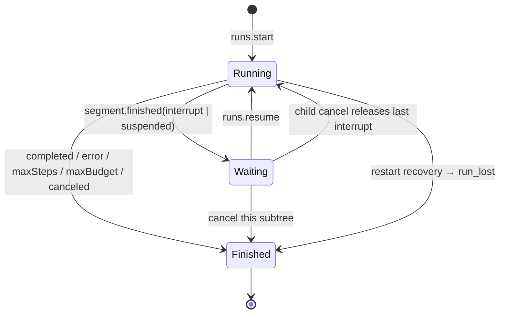

# Lyra Runtime Protocol vNext 定稿

> 作者：Codex
> 定稿日期：2026-07-27
> 目标 `protocolVersion`：`2026-07-27`
> 目标 `SessionArtifactVersion`：`7`
> 状态：第八轮放行 review 后的最终冻结稿；没有遗留的协议设计待决项
> 适用范围：`app/runtime`、`app/desktop`、生成的 Go / TypeScript 客户端与会话导入导出

## 0. 文档地位

本文把以下三份材料收敛为一份可以直接指导实现、一次性切换和验收的 vNext 目标契约：

- [`PROTOCOL_DESIGN.md`](PROTOCOL_DESIGN.md)，同步至提交 `afbc70cd4`；
- [`codex_runtime_api_design_guide.md`](codex_runtime_api_design_guide.md)；
- [`PROTOCOL_VNEXT_REVIEW.md`](PROTOCOL_VNEXT_REVIEW.md)，同步至工作区第八轮放行版本。

三份前置文档继续承担“证据、对照、讨论历史与取舍理由”的职责。本文只回答：

> vNext 最终要长什么样，代码必须满足哪些不变量，怎样证明实现完成。

当前代码只用于发现现状缺口与估算改造面，不约束目标 shape。若实现模型与本契约冲突，
应治本调整 execution/store/SDK/UI，而不是削弱协议、保留旧字段或增加兼容分支。

在 vNext 落地前，当前 wire 仍以
[`API.md`](../desktop/docs/protocol/API.md)、
[`AUX_API.md`](../desktop/docs/protocol/AUX_API.md) 和
[`TRANSPORT.md`](../desktop/docs/protocol/TRANSPORT.md) 为准。完成切换后：

- 本文定义的目标 shape 必须进入 canonical 协议与生成物；
- `PROTOCOL_DESIGN.md §19` 保留为决策历史；
- 本文不是第二份字段目录，字段级真相最终只存在于 Registry 生成的 schema；
- 不保留旧字段、旧方法、旧事件流或兼容 shim。

breaking change 已获授权。目标版本一次切换：

```text
protocol.current      = "2026-07-27"
protocol.minSupported = "2026-07-27"
SessionArtifactVersion = 7
```

旧协议请求确定性返回 `invalid_protocol_version`；旧 Artifact 确定性拒绝导入，不做迁移。

### 0.1 第一轮专项评审裁决

本轮接受了“目标 wire 必须有同构的 durable read model”这一总意见，并作出以下最终裁决：

| 评审项 | 最终裁决 |
|---|---|
| Segment 身份不 durable | 接受；使用语义更准确的 `activeSegmentId`，仅 Running 必有，并与状态同事务持久化 |
| 非终态 metrics 无 durable 来源 | 接受；`runs` projection 持久化 committed metrics |
| `runs.list` 只读 live registry | 接受；`runs.get/list` 一律读取 durable projection |
| `state.snapshot{todos}` 无冷查询 | 接受；新增 `todos.get`，Registry 强制每个 state key 声明 recovery source |
| `headEventId` 用途不明 | 部分接受；保留，但只允许原样保存并作为后续 cursor，禁止比较或解释 |
| runtime sequence 与 coalescing 冲突 | 接受；sequence 在实际投递时分配，coalescing 不消耗序号 |
| interrupt 分页粒度未定 | 接受问题，不接受拆行方案；分页单位定为一个 waiting Run 的完整 interrupt set |
| Batch C 是巨型 commit | 接受；改为一个 release / 一条 cutover 分支，分支内使用可 bisect 的全绿提交 |
| runtime stream 的“唯一”范围 | 接受；唯一性范围是每个 client process |
| `run_lost` metrics | 接受；精确等于最后一次 committed snapshot |
| cursor epoch 复用 `interrupts.process_id` | 不接受；该字段是 Agent process snapshot identity，不是 runtime process identity |
| limits 跨 resume 的 durable 性 | 接受；持久化有效限额，并通过 `RunRef.limits` 对查询者可见 |
| Error Registry recovery action | 接受；使用闭合枚举，不使用自由文本 |

这些裁决已直接写入下文的 shape、不变量、批次和验收项；本表不是另一套契约。

### 0.2 第二轮专项评审裁决

| 评审项 | 最终裁决 |
|---|---|
| child Run 的 `activeSegmentId` 与 stream scope 混淆 | 接受问题，不接受“Segment 只属于 root”的修法；每个 Run 都保留自己的 Segment，事件主体与 root stream scope 分离 |
| 旧 store 无法真实回填新 projection | 接受；dev store 直接丢弃重建，不写 migration、不填伪造零值、不保留旧表兼容 |
| `usage.session/summary` 口径未声明 | 接受；统一从 Run projection 聚合，并计入非终态 Run 已 committed 的部分 |
| plugin state key 没有 recovery query | 接受；删除这条虚假的扩展承诺，vNext 不开放 plugin state key 或 plugin runtime topic |
| child metrics 汇入 root 的提交时机 | 接受；只在下一个 root Segment 边界提交，不在 child 边界半提交 root metrics |

本轮的总原则是：**保留真实扩展缝，删除只有名字、没有查询与 schema 闭环的伪扩展缝；
保留统一领域模型，不让 transport scope 反过来扭曲 Run / Segment。**

### 0.3 第三轮专项评审裁决

| 评审项 | 最终裁决 |
|---|---|
| `sessions.rollback/export/import` 未进入方法全集 | 接受；补回全部九个 `sessions.*`，并精确区分 method gate 与 rollback variant gate |
| frame validator 与跨资源不变量混写 | 接受；拆成 frame-checkable constraints 与 transaction/system invariants，validator 禁止查存储 |
| `items.list` 携带完整 RunRef 导致计量膨胀 | 接受方向；引入共享基础 shape 的轻量 `RunSummary`，保留终态与时间语义，RunRef 只在 `runs.*`/live 使用 |
| RuntimeTopic 增量是否 breaking | 选择闭合联合；新增 topic 必须同时补 query/fixture 并 bump protocolVersion |
| `runs.list` 缺少历史入口 | 接受并扩展；默认列全部 root Run，支持 status 过滤与显式 `includeDescendants` |

这轮不增加兼容层；它只让方法面完整、query 职责单一、validator 的承诺与实际可检查
范围一致。

### 0.4 第四轮专项评审裁决

| 评审项 | 最终裁决 |
|---|---|
| `items.list` 无 child Run 内容入口 | 接受问题并重做请求 shape；使用互斥 `ItemListScope`，不同时携带可冲突的 `sessionId/runId` |
| `Interrupt` 无来源 Run | 接受；`Interrupt.runId` 必填，并与 Item/Run projection 建立事务不变量 |
| 三个 list 的排序不可发现 | 接受并增强；Run/Interrupt 固定方向，Item 显式支持 asc/desc，排序键、默认值、翻页含义与 cursor binding 都成为版本契约 |
| child Run 不可单独取消 | 接受风险，不接受将其冻结为非目标；统一 `runs.cancel` 支持 root 或 child，child 取消只终止其 subtree |
| ancestor summaries 无直接父边 | 主动补正；child 新增不可变 `parentRunId`，与 `rootRunId/spawnedByItemId` 分责 |

本轮继续直接改目标契约：`includeChildren` 改为无深度歧义的
`includeDescendants`，不留旧字段 alias；child cancel 所需的父 tool-call 结构化错误
注入是 Batch C 的执行层交付项，不因当前实现尚未具备就降低协议能力。

相对前三稿，本轮直接替换 `ListItemsRequest`、为 child Run 增加必填
`parentRunId`、为 Interrupt 增加必填 `runId`，并把 `runs.cancel` 返回值改成闭合
root/child union。它们都进入同一次 vNext cutover，不提供旧 decoder、缺省回填或双
shape SDK overload。

### 0.5 第五轮专项评审裁决

| 评审项 | 最终裁决 |
|---|---|
| 挂起树各 Run 的 Interrupt 子集未定义 | 接受问题，不接受祖先聚合复制；来源 Run 发 direct `interrupt`，其余因同一 tree barrier 停止的 Run 发无 payload 的 `suspended` |
| child cancel 可令 Waiting tree 恢复但状态机缺边 | 接受并扩展；补齐 target child → Finished 与全部 surviving suspended Runs → Running 两组同命令转换 |
| `PendingInterruptSet.runId` 含义含混 | 接受并扩大；aggregate 与 query filter 统一改为 `rootRunId` |
| 只有 cancel 下沉到 child 的理由未写 | 接受；从 resume 原子单位、steer 意图所有权、subscribe transport scope 与 cancel subtree 语义推导边界 |

本轮新增 `SegmentOutcome{type:"suspended"}` 是有意的 breaking shape，而不是为了兼容
旧 interrupt 表达叠加的旁路。旧的“祖先也复制完整/部分 Interrupt payload”行为不被
接受，也不在 reducer 保留去重分支。

### 0.6 第六轮专项评审裁决

| 评审项 | 最终裁决 |
|---|---|
| `runs.start` 遇到非终态 root 未定义 | 接受；新增 typed `session_has_active_run`，携带 `activeRun{runId,status}`，绝不隐式 cancel |
| subagent capability 与 Minimal Profile 缺失 | 接受并补闭环；`features.subagents` 显式 opt-in，Run 持久化不可变 `RunProtocolProfile`，恢复/订阅不得按调用临时降级 |
| `includeDescendants:true` 在 capability 关闭时如何处理 | 不接受静默视为 false；显式意图必须返回 `capability_not_negotiated` |
| resume 无法原子表达“批准并补充指示” | 接受并增强；新增 `input?`，同事务写 opening user Item，response 以条件必填 `userItemId` 精确对账 |

本轮仍不引入兼容分支。`RunProtocolProfile`、`ResumeRunRequest.input`、
`ResumeRunResponse.userItemId` 与 typed Problem 字段直接成为 vNext 唯一 shape；旧的
“每次请求临时解释 subagent 能力”、静默降级 query、自动取消再 start，以及
resume 后竞态 steer 都不作为替代路径保留。

### 0.7 第七轮专项评审裁决

| 评审项 | 最终裁决 |
|---|---|
| state key 缺 scope 与投影所有权 | 接受实质并收紧命名；Registry 与 discovery 同时声明 `scope` 和 `writer`，不使用容易与 materializer 组件混淆的 `projector` |
| `todos` 在并行 child 间存在 last-write-wins | 接受；`todos` 是 session-scoped / root-only state，child 不获得 `todo_write`，也不存在自动合并或 child 私有清单的隐式语义 |
| `state.snapshot` 缺 Segment 最终发布边界 | 接受；每次 committed replacement 都触发快照，发生过变化的 key 在 writer Segment 的 `segment.finished` 前建立 final snapshot fence |
| runtime 流没有 state 失效通道 | 不选择二选一；Run stream 的 final snapshot 与新增 `state.changed` 分责，前者保证当前任务 fold，后者保证未订阅该 Run 的窗口/进程能 refetch |
| root / child metrics 跨层计算 | 接受；root 是 as-of-root-boundary 的 subtree snapshot，跨层相加、相减均无定义 |
| `RunProtocolProfile` 容易被误读为 Session 降级 | 接受；profile 明确定义为 per-Run-tree，同一 Session 的后续 Run 重新协商 |

本轮还主动补上一个同源竞态：query 可能已返回较新的 state，随后到达的缓冲旧快照不能
把 reducer 覆盖回去。因此每份 scoped state 增加 JSON-safe、单调的 `revision`；
query 与 event 复用同一 typed state shape，客户端只在同一
`{key, scope identity}` 内比较 revision。

这些变化直接进入尚未发布的同一个 vNext cutover：`state.changed` 作为第九个闭合
RuntimeTopic，与它的 query、fixture 和 exhaustive reducer 同批交付。不存在临时
八值版本、旧的无 scope capability、`Record<string, unknown>` state bag、按
`runId` 错误分桶的兼容 reducer，或 session-level profile。
“新增闭合 topic 必须 bump protocolVersion”由当前协议到目标
`2026-07-27` 的一次切换满足；未发布草稿之间不制造伪版本或过渡兼容。
同理，scoped state 直接进入尚未发布的 Artifact v7；不存在“早期 v7 不含 states”
的 decoder 或迁移分支。

### 0.8 第八轮放行与冻结

第八轮逐项复核了第七轮的 state scope/writer、root-only todos、final snapshot
fence、`state.changed`、metrics 边界与 per-Run-tree profile，结论为**放行**：
没有阻塞项，也没有值得推迟定稿的建议项。本轮不再新增字段、方法、事件或抽象，
避免为了形式上的“继续优化”破坏已经闭合的窄腰。

从此处起，“冻结”具有以下精确含义：

- 本文是 vNext 实现、生成物与验收的唯一目标基线；当前代码与旧文档的差异都是待
  修正项，不构成弱化目标契约的理由；
- 实现阶段发现普通落地困难时，调整 execution/store/SDK/UI，不添加旧 decoder、
  alias、默认回填、dual-read/write 或降级事件流；
- 只有发现安全漏洞、逻辑矛盾或无法满足的正确性不变量，才可重新打开协议设计；
  任何 wire 语义变化必须先修改本契约、compatibility diff 与目标版本，禁止在 handler
  或客户端中静默形成“实际协议”；
- 第八轮指出的 revision 原子提交、并行 fence partial order 与双通道幂等，已固化到
  §14 验收矩阵，不另造实现期口头规则。

---

## 1. 最终心智模型

```text
Session  长期对话与工作目录
  └─ Run  一次用户意图；跨 HITL resume 保持同一身份
       ├─ Segment  一段连续执行；等待人类时结束
       └─ Item     用户、模型、推理、计划、问题、工具的权威时间线单元
```

四个对象各自只拥有一种职责：

| 对象 | 稳定期 | 拥有 | 不拥有 |
|---|---|---|---|
| Session | 整个对话 | cwd、标题、默认模型、Run 历史 | executor handle |
| Run | 一次逻辑任务，跨 resume | lifecycle、累计 metrics、终态、subagent 树 | transport connection |
| Segment | 一段连续执行 | stream scope、停止原因、计量提交边界 | 长期对话身份 |
| Item | 一个时间线工作单元 | 内容、工具调用、完成态 | transport delta buffer |

Interrupt 是 Run 的 durable 等待资源，也是 Segment 的一种停止原因；它不是 Run 的终态。

StateSnapshot 是有明确 scope 的 durable latest-value projection，不是事件 envelope
所属 Run 的私有字段。Run 只说明“谁在本 Segment 产生了这次投影”，state key 的
Registry 声明才决定“这份状态属于哪个资源、谁可以写”。

用户、Agent、客户端必须看到同一个世界：

```text
用户：任务在运行 / 等我 / 继续 / 完成。
Agent：同一个 Run 在若干 Segment 中推进并产出 Item。
客户端：发 typed command，fold typed events；断线 replay，失败 cold recover。
```

---

## 2. 不可破坏的设计法则

1. **一个概念只有一个 wire 表达。**
2. **可在同一 response frame 内无额外 I/O 唯一推导的事实不上 wire；独立资源要自洽所需
   的拓扑、归属与路由键不是冗余。**
3. **权威事实来自 durable projection/query；流只负责低延迟。**
4. **所有 discriminated union 只使用 `type`。**
5. **核心闭合，扩展真实：工具名、feature key、error type 与 ephemeral custom
   namespace 可扩展；没有 read model 的扩展不得伪装成 durable state 或 invalidation。**
6. **HITL 不依赖连接、客户端或 executor process 存活。**
7. **命令命中可变执行实例时必须带并发前置条件。**
8. **ephemeral 事件全部丢失后仍能恢复正确终态。**
9. **request 自描述；不引入 mandatory initialize 或连接级 active project。**
10. **业务失败不映射 HTTP status。**
11. **同一迁移不双写、不双发、不提供旧名 alias。**
12. **没有机器契约和 drift gate 的协议不能声明 frozen。**

---

## 3. vNext 核心方法面

```text
runtime.discover
runtime.subscribe

sessions.create
sessions.get
sessions.list
sessions.update
sessions.delete
sessions.fork
sessions.rollback
sessions.export
sessions.import

runs.start
runs.resume
runs.steer
runs.cancel
runs.subscribe
runs.get
runs.list

items.list
interrupts.list
todos.get
```

旁路域如 workspace、MCP、provider、model、memory、skills、schedules、goals 继续保留自己的真实协议根，并由 feature capability 门控。

明确删除：

```text
runs.listOpenInterrupts
workspace.subscribe
```

不提供 deprecated alias。

### 3.1 查询语义

```ts
interface ListRunsRequest extends PageQuery {
  sessionId?: SessionId;
  statuses?: RunStatus[];
  includeDescendants?: boolean;
}

interface GetRunRequest {
  runId: RunId;
}

type ItemListScope =
  | { type: "session"; sessionId: SessionId }
  | {
      type: "run";
      runId: RunId;
      includeDescendants?: boolean;
    };

interface ListItemsRequest extends PageQuery {
  scope: ItemListScope;
  order?: "asc" | "desc";
}

interface ListInterruptsRequest extends PageQuery {
  sessionId?: SessionId;
  rootRunId?: RunId;
}

interface ApprovalInterruptPayload {
  tool: ToolInvocation;
  risk?: ApprovalRisk;
  reason?: string;
  rememberable?: boolean;
}

interface QuestionInterruptPayload {
  question: Question;
}

interface ToolResultInterruptPayload {
  tool: ToolInvocation;
}

interface InterruptIdentity {
  itemId: ItemId;
  runId: RunId;
}

type Interrupt = InterruptIdentity &
  (
    | {
        type: "approval";
        payload: ApprovalInterruptPayload;
      }
    | {
        type: "question";
        payload: QuestionInterruptPayload;
      }
    | {
        type: "toolResult";
        payload: ToolResultInterruptPayload;
      }
  );

interface PendingInterruptSet {
  rootRunId: RunId;
  sessionId: SessionId;
  interrupts: Interrupt[];
  createdAt: string;
}

interface GetTodosRequest {
  sessionId: SessionId;
}

interface TodoState {
  type: "todos";
  sessionId: SessionId;
  revision: number;
  todos: TodoSnapshot[];
  updatedAt?: string;
}

interface ListItemsResponse extends Page<Item> {
  runs: RunSummary[];
}

type GetRunResponse = RunRef;
type ListRunsResponse = Page<RunRef>;
type ListInterruptsResponse = Page<PendingInterruptSet>;
type GetTodosResponse = TodoState;
```

- `sessions.get/list`、`runs.get/list`、`items.list`、`interrupts.list`、`todos.get`
  必须只读 durable projection；
- 冷读不得启动 executor、占用 Run admission 或隐式建立订阅；
- `runs.get` 按 `runId` 返回准确的当前或终态 root/child Run，不要求调用者先知道
  `sessionId`；
- `runs.list` 默认返回全部状态的 root Run；`statuses` 省略表示全部，若提供则必须
  非空、无重复；`includeDescendants` 默认 `false`，显式为 `true` 时才加入任意深度
  descendant；
- `sessionId` 与 `statuses` 对每个返回行独立过滤；`includeDescendants:true` 不隐式
  补入未命中过滤条件的 ancestor，child 已可通过 `rootRunId` 定位 root；
- active-run recovery 使用 `statuses:["running","waiting"]`，历史/成本查询不再借道
  `items.list`；
- `runs.list` 必须读 durable projection，不能只读 process-local live registry；
- `runs.list` 使用 server-issued opaque keyset cursor，内部稳定排序键为
  `(createdAt DESC, runId DESC)`，不要求上一页 anchor 行继续存在；cursor 同时绑定
  `sessionId/statuses/includeDescendants`；server 在签发 cursor 前按 enum 顺序规范化
  `statuses`，修改过滤条件必须从第一页重新查询。第一页从最新 Run 开始，下一页只向
  更早的 Run 推进；
- `items.list.scope` 是必填闭合联合：session scope 返回整个 Session 时间线；run scope
  返回指定 root/child Run 自己的 Item，`includeDescendants:true` 时再包含它任意深度
  descendant 的 Item。runId 已唯一定位 Session，wire 不再同时携带冗余 sessionId；
- session scope 找不到 Session 返回 `session_not_found`；run scope 找不到 Run 返回
  `run_not_found`，不得用空页掩盖无效 scope；
- `items.list.order` 默认 `"asc"`：按 durable `sequence ASC`，第一页最早、下一页
  更晚，适合 reducer/完整恢复；`"desc"`：按 `sequence DESC`，第一页最新、下一页
  更早，适合长会话首屏和向上加载。cursor 绑定完整 scope 与 order，任一改变后必须
  从第一页重新查询；
- `items.list.runs` 返回轻量 `RunSummary[]`，只包含本页 Item 直接引用的 Run 及其
  ancestor chain（允许 ancestor 位于请求 subtree 之外）；SDK 跨页按 runId 合并，
  用于重建 terminal timeline 与 subagent 树，不携带
  metrics/limits/protocolProfile/activeSegmentId；
- `interrupts.list` 支持 `sessionId?`、`rootRunId?` 和统一分页；两者同时给出时必须
  同时匹配。
- `interrupts.list.rootRunId` 若提供必须是 root Run；child id 返回
  `run_not_root`；
- `interrupts.list` 返回 `Page<PendingInterruptSet>`；分页单位是一个 Waiting Run
  的完整 interrupt set，而不是单个 interrupt；
- 同一 set 不跨页，因为它是 `runs.resume` 一次全量校验、全量 consume 的原子单位；
- interrupt cursor 是 server-issued opaque keyset cursor，内部按
  `(createdAt ASC, rootRunId ASC)` 排序并绑定 `sessionId/rootRunId` filters，不依赖
  JSON 数组下标；第一页是等待最久的 set，下一页只向更新的 set 推进；
- `Interrupt.runId` 是产生该 interrupt 的具体 root/child Run；同一 set 内可以出现
  不同 child Run，但每个都必须属于 `PendingInterruptSet.rootRunId` 指向的 root
  tree；
- PendingInterruptSet 不复制 `RunSummary[]`；需要展示来源详情时，客户端对唯一
  `Interrupt.runId` 去重，并用一次带 waiting/descendant filter 的 `runs.list` hydrate，
  避免在两个响应里同步可变 lifecycle；
- `todos.get` 在 Session 存在但没有 todo row 时返回 `todos: []`；只有 Session
  不存在才返回 `session_not_found`。从未写入时返回
  `{type:"todos",sessionId,revision:0,todos:[]}` 且省略 `updatedAt`；任意成功替换
  （包括清空）后 `revision > 0` 且 `updatedAt` 必填；

排序是 method semantics，不是实现细节；改变固定方向、Item 默认 order、tie-breaker
或“下一页”的时间含义都必须 bump protocolVersion。三种 list 故意不同：Run history
固定最新优先，Interrupt inbox 固定 FIFO；Item 同时服务权威顺序 fold 与最近内容首屏，
因此显式开放两个闭合方向而不让客户端猜。

所有 query cursor 都是与 Run event cursor 不相干的 server-issued opaque token，内部
至少绑定 `formatVersion + method + normalized scope/filters + last sort tuple`，并做
完整性保护。它们不依赖上一页 anchor 行继续存在；malformed、跨方法或跨 filter 复用
统一返回 `invalid_params`。`limit` 不属于 cursor identity，客户端可以在续页时调整，
但仍受该方法的 server max 限制。

Run 的 continuation/steering/stream scope 只属于 root，取消则作用于调用者明确指定的
Run subtree：

- `runs.resume/steer/subscribe` 的 `runId` 必须是 root Run；
- `runs.cancel` 接受 root 或 child：root 表示整棵执行树，child 表示以该 child 为根
  的 subtree；
- child Run 是可查询、可出现在 Item 时间线中的一等 Run，但其生命周期由 root
  executor tree 驱动，不能独立 resume、steer 或 subscribe；
- 将 child Run 传给 resume/steer/subscribe 返回 `run_not_root`，不能伪装成
  `run_not_found`；
- child `RunSummary/RunRef.rootRunId` 给出其 root；客户端随后 `runs.get(rootRunId)` 获取
  root 的当前订阅/并发前置条件。

这个控制面的不对称由领域语义推出，不是实现限制：

- resume 的原子单位是 root-owned 完整 PendingInterruptSet；下沉到 child 会引入已
  禁止的部分 consume；
- subscribe 的 root stream 已覆盖整棵 Run tree；child subscribe 只会重复已有流并
  制造第二套 cursor scope，不产生新能力；
- steer 注入的是用户对当前任务的意图，而子任务意图由 parent tool-call 定义，不是
  独立的用户控制面；
- cancel 才具有真实的 subtree 语义：终止一支、让其余分支继续，并把结果明确落到
  parent tool-call 的 `child_run_canceled`。

### 3.2 Session rollback / export / import

九个 `sessions.*` 都必须进入同一 Registry；下列三项不是隐含旁路：

| 方法 | capability | vNext 约束 |
|---|---|---|
| `sessions.rollback` | 方法始终存在；只有 `restoreType:"files" \| "both"` 要求 `checkpoints` | history 边界与 `messageMark` 读取统一 Run projection；`DroppedRun.run` 使用 RunSummary |
| `sessions.export` | `sessionExport` | `format:"json"` 只产生 Artifact v7；`format:"md"` 仅供人读、不可导入 |
| `sessions.import` | `sessionExport` | 只接受 Artifact v7；原子替换 Session/Run/Item/tool-result/scoped-state projection |

```ts
interface DroppedRun {
  run: RunSummary;
  userInput?: ContentBlock[];
}
```

补充不变量：

- `restoreType` 默认 `"history"`，不因没有 Git/checkpoints 而禁用整个 rollback 方法；
- `restoreType:"files"|"both"` 在 server 未广告 `checkpoints` 时返回
  `capability_not_negotiated`；若 capability 已广告、但目标 checkpoint 在执行时不可用，
  才返回更具体的 `checkpoint_unavailable`；
- `files/both` 必须提供 root `toRunId`；`files` 不截断历史且 `droppedRuns` 为空，
  `both` 维持“文件恢复失败则历史不变”的可观察原子性；
- history rollback 必须在删除 projection 前捕获 DroppedRun summaries 与 opening
  user inputs，成功响应只呈现同一次写事务已经删除的集合；
- export/import/rollback 命中非 idle Session 时确定性返回 `session_busy`；
- import 先完成整份 Artifact 验证，再在一个 durable transaction 中替换；
- 不保留 Artifact v6 decoder、旧 Run payload adapter 或格式迁移；
- JSON export/import 与 `runs.get/list`、`items.list` 使用同一个 Run projection；
- session-scoped state 服从完整 Session 生命周期：delete 删除；fork 复制 fork
  boundary 时的语义值；`history/both` rollback 恢复到目标 history boundary，
  `files` rollback 不改变；JSON export/import 保留语义值。rollback 或 import-over
  是一次新的 state commit，必须分配更大的 live `revision`，不能把历史 revision
  倒拨；
- `sessionExport` 未广告时，export/import 返回 `capability_not_negotiated`，方法不能
  静默降级成其它格式。

---

## 4. Run 生命周期与最终 wire

### 4.1 状态机



不变量：

- `running`：恰有一个 active Segment；
- `waiting`：没有 active Segment；root 拥有非空 PendingInterruptSet，waiting child
  属于该 root tree 的同一 suspended execution boundary；
- `finished`：没有 active Segment、没有 open Interrupt，且有 terminal RunOutcome；
- 一个 Session 最多有一个非终态 root Run；
- root 与 child 都是完整 Run，也都拥有自己的 Segment identity；
- resume 保持 `runId`，创建新 `segmentId`；
- `activeSegmentId` 对所有 Running Run（root 与 child）必须存在，在 Waiting /
  Finished 必须不存在；
- child Run 必须记录 `parentRunId/rootRunId/spawnedByItemId`；root Run 不得记录这些
  child-only edge；
- Segment identity 与 Run state 在同一事务中建立、替换或清除；
- 只有 `finished` 有 `finishedAt`；
- `waiting` 和 `finished` 都不能 steer；
- `finished` 不能 resume；
- Running 与 Waiting 都能 cancel；
- `Waiting → Running` 既可由 root `runs.resume` 触发，也可由
  `runs.cancel(child)` 清除最后一个 Interrupt 后使全部 surviving suspended Runs
  复活；
  后一种情况下被寻址 child 自身走 `Waiting → Finished`，不得把两个角色折叠为一条
  reducer 规则。

### 4.2 将 lifecycle、outcome、metrics 正交化

前置文档已经裁决“Run 累计快照”。最终 shape 再做一步收敛：

> Outcome 只回答“为什么停止”；Metrics 只回答“累计消耗多少”。删除混合两者的 `RunResult`。

```ts
type RunStatus = "running" | "waiting" | "finished";

interface RunMetrics {
  usage?: Usage;
  steps: number;
  activeDurationMs: number;
}

interface RunLimits {
  maxSteps?: number;
  maxBudgetUsd?: number;
}

interface RunProtocolProfile {
  requiredFeatures: string[];
  interruptTypes: InterruptType[];
}

type RunOutcome =
  | { type: "completed" }
  | { type: "error"; error: ProblemData }
  | { type: "maxSteps"; detail?: string }
  | { type: "maxBudget"; detail?: string }
  | { type: "canceled"; detail?: string };

type SegmentOutcome =
  | { type: "interrupt"; interrupts: Interrupt[] }
  | { type: "suspended" }
  | RunOutcome;

interface RunSummary {
  id: RunId;
  sessionId: SessionId;
  spawnedByItemId?: ItemId;
  parentRunId?: RunId;
  rootRunId?: RunId;
  provider?: string;
  model?: string;
  status: RunStatus;
  outcome?: RunOutcome;
  createdAt: string;
  finishedAt?: string;
}

interface RunRef extends RunSummary {
  activeSegmentId?: SegmentId;
  limits?: RunLimits;
  protocolProfile: RunProtocolProfile;
  metrics: RunMetrics;
}
```

frame-checkable 约束（由 schema + Go/TS `Validate()` 生成）：

| 对象 / 条件 | 必须存在 | 必须不存在 |
|---|---|---|
| RunSummary `running` / `waiting` | — | `outcome`、`finishedAt` |
| RunSummary `finished` | `outcome`、`finishedAt` | — |
| RunRef 任意状态 | `protocolProfile`、`metrics` | — |
| RunRef `running` | `activeSegmentId` | — |
| RunRef `waiting` / `finished` | — | `activeSegmentId` |
| root Run | — | `spawnedByItemId`、`parentRunId`、`rootRunId` |
| child Run | `spawnedByItemId`、`parentRunId`、`rootRunId`（且两个 RunId 均不等于 `id`） | — |
| outcome `error` | `error` | `detail` |
| 其它 terminal outcome | 对应可选 `detail` | `error` |
| `segment.finished(interrupt)` | 非空 `outcome.interrupts`、同层 `metrics` | Run terminal outcome |
| `segment.finished(suspended)` | 同层 `metrics` | `interrupts`、Run terminal outcome |

`RunSummary` 与 `RunRef` 不是两套 Run 真相：前者是 Registry 定义的 canonical
identity/lifecycle base，后者只在 `runs.get/list` 与 live `segment.started` 上增加
control/protocol/metering 字段。Go/TS/schema 必须由同一个嵌入/组合定义生成，禁止手工复制两套
同名字段。`RunSummary` 保留 `outcome/createdAt/finishedAt`，因为这些是 lifecycle
本身而非计量负担；若只给一个无法解释为何结束的 `status:"finished"`，客户端仍会被迫
额外查询。真正从冷开热路径移除的是可能随模型和子树膨胀的
`metrics/limits/protocolProfile/activeSegmentId`。

`metrics` 是最近一次 durable commit 后的 Run 累计快照。运行中的
`segment.progress` 可以暂时领先，但不能覆盖 authoritative 值。

`limits` 是这次 Run 实际生效的累计限额；没有任何限额时省略。它不是客户端请求的
回显，而是 resume、跨进程恢复与预算 UI 共用的 durable execution policy 视图。

`protocolProfile` 是 root Run 创建时冻结的客户端可观察协议能力，而不是每次 request
临时重算的偏好：

- `requiredFeatures` 只收录 Registry 标记为“会改变 authoritative Run
  event/resource shape、因此订阅者必须理解”的 feature key；vNext 当前只有
  `subagents`；
- `interruptTypes` 是该 Run 允许产生的 durable Interrupt 类型；
- 两个字段语义都是 set，重复值非法；canonical encoder 分别按 UTF-8 lexical order
  与 Registry enum order 输出。decoder 不把顺序当语义，校验后立即规范化；空数组是
  合法且明确的 Minimal Profile；
- profile 的 scope 是**一个 root Run tree**，不是 Session。每次 `runs.start` 都从
  该请求重新协商新 profile；同一 Session 的后续 Run 可以使用不同 profile。因而
  Minimal client 创建过空 profile Run，不会永久降低该 Session 的能力；
- profile 由 root 拥有且全生命周期不可变；child `RunRef` 物化继承同一 profile，
  不拥有可独立修改的副本；不可变性只防止同一 Run tree 中途换语义；
- `excludedEphemeralEvents` 不进入 profile，它只是单次订阅的可丢预览偏好；
- server composition 后续变化不得悄悄改写既有 Run 的 profile；无法继续满足时明确
  返回 `capability_not_negotiated`，不得降级执行语义。

三个 child edge 都由 RunSummary 定义并由 RunRef 继承，但职责不同：

- `parentRunId` 是直接树拓扑，使独立查询、页级 summary 和 subtree query 不依赖父
  spawning Item 恰好已加载；
- `rootRunId` 是 O(1) 控制/订阅路由，使 `runs.get(childId)` 可直接找到 root；
- `spawnedByItemId` 是 child 在父 Run 时间线中的语义锚点，用于把 subagent 卡片挂回
  具体 tool-call Item。

三者不互为兼容 alias，也不得在 presenter 临时反查拼装；child 创建事务一次写全，
后续不可变。

所有 metrics 数值必须非负；同一 Run 后续 committed snapshot 的
`steps`、token usage、cost 与 `activeDurationMs` 不得回退。`usage` 尚未产生时可以
省略；一旦出现，后续 snapshot 不得再次省略。

### 4.3 `segment.finished`

```ts
interface SegmentFinishedEvent {
  type: "segment.finished";
  outcome: SegmentOutcome;
  metrics: RunMetrics;
}
```

每次 Segment 停止都必须携带 `metrics`，包括 interrupt 与 suspended。客户端永远从
同一个字段读取计量，不再按 terminal / non-terminal 分支寻找 `result`。

一次 tree interrupt boundary 会先把同一 root tree 收敛到 quiescent 状态；边界开始时
仍 active 的每个 Segment 都恰好发布一条
`segment.finished`，但 outcome 只陈述该 Run 自己停止的直接原因：

- 真正产生 Interrupt 的 source Run 发布
  `outcome:{type:"interrupt",interrupts:[...]}`；数组只含该 Run 直接产生的
  Interrupt，且每个 `Interrupt.runId` 必须等于 RunEvent envelope 的 `runId`；
- 没有直接产生 Interrupt、仅因同一 root tree 的 interrupt barrier 而停止的 Run
  发布 `outcome:{type:"suspended"}`，不复制其它 source Run 的 Interrupt；这既包括
  source 的 ancestor，也包括并行分支上被 barrier 暂停的 Run；
- 若一个 Run 同时直接产生 Interrupt 且拥有产生 Interrupt 的 descendant，它仍只
  发布一条 `interrupt` outcome，并且只携带自己直接产生的那一批；descendant 各自
  发布自己的 direct batch；
- root-owned PendingInterruptSet 是所有 direct batch 按 `itemId` 的不相交并集。
  它通过 `interrupts.list` / resume query 表达，不要求 root 的
  `segment.finished` payload 重复整棵树 aggregate；该等式描述 tree interrupt
  commit 时的 boundary snapshot，后续 child cancel 可把当前 open set 收窄为其未解决
  子集，但不会改写已经发布的 finished event。

因此忽略 transport replay 后，同一 Interrupt 在逻辑 root stream 中恰好出现一次。
客户端按 event envelope
即可把它挂到正确 Run，不做祖先聚合去重；`suspended` 则让每个受 barrier 影响的
Run 都能确定地从 Running 收敛到 Waiting。

提交顺序：

```text
durable Item / Interrupt / Run state / metrics transaction commit
  → 按 child-before-parent 顺序 publish 各 Run 的 segment.finished
  → release 各 Run 的 Segment executor
  → root segment.finished 发布后关闭 root stream，并释放 root admission
```

客户端不得观察到尚未被 query 层支持的 authoritative event。
同一事务影响多个 Run 时，发布顺序必须是确定性的 postorder：descendant 先于
ancestor，兄弟分支按 `runId ASC`；root 最后。child 的 `segment.finished` 只结束
child Segment；承载整棵树的 root stream 继续，直到 root 自己的
`segment.finished` 发布。即使 root 的 outcome 是 `suspended`，它仍是该 active root
Segment 的正常结束边界。

### 4.4 duration 的唯一含义

`activeDurationMs` 是已提交 Segment 活跃时间之和：

- 包含模型调用、工具执行与 Segment 内调度；
- 不包含 Run 处于 Waiting 的时间；
- 正常 interrupt / terminal 边界都累计；
- process crash 导致的未提交尾段不伪造时长；
- Run 墙钟时间由 `finishedAt - createdAt` 推导；
- 单 Segment duration 只进入 trace/observability，不进入 core wire。

删除所有 live wire、portable Artifact 和前端 projection 中含义旧的 `durationMs`。

### 4.5 usage、steps、budget 与 subagent

- `usage`、`steps`、`activeDurationMs` 全部是 Run 累计值；
- `steps` 精确定义为已进入 execution budget/accounting authority 的模型调用数，
  与 `maxSteps` 使用同一单位；一次模型响应即使产生多个并行工具调用也只增加一步，
  tool/action lifecycle 不得自行推算或改写 `steps`；
- `segment.progress` 中出现的计量也是累计预览，不是 delta；
- `maxSteps`、`maxBudgetUsd` 跨 resume 延续；
- limit 判断始终使用持久化的有效限额与 committed cumulative metrics，resume
  不得恢复成无上限或重新从零计数；
- root Run 的 metrics 包含整棵 subagent subtree；
- child Run 的 metrics 包含该 child 自己的 subtree；
- child 在自己的 Segment 边界提交 child metrics；它产生的消耗只在下一个 root
  Segment 边界汇入 root committed metrics，期间只可出现在 root
  `segment.progress` 预览中；
- root metrics 是 **as-of-root-boundary** 的整棵 subtree 累计快照；child metrics
  是各自最近 child boundary 的 subtree 快照，两者的提交时刻可以不同；
- 跨层 metrics 不可加减：不得把 child metrics 再加到 root，不得把
  `root - Σchildren` 解释为 parent 自身消耗。若产品需要 parent-self metrics，它是
  必须由服务端定义并直接提供的新口径，不能由客户端从现有字段推导；
- `usage.session` / `usage.summary` 只汇总 root Run，绝不再次叠加 child Run；
- 单段指标由相邻两个 authoritative 快照相减获得，不新增 segment delta wire。

### 4.6 Durable Run projection

vNext 的 `runs` read model 不再只是 root admission 锁。它为每个 root/child Run
保存一行，是 `runs.get/list`、`items.list` 中 RunSummary、restart recovery、
`usage.session/summary` 与 Artifact 导出的共同权威来源，至少持久化：

```text
run identity / session / spawned_by_item_id / parent_run_id / root_run_id
status / active_segment_id
provider / model
effective max_steps / max_budget_usd
root-only immutable protocol_profile
committed steps / usage / active_duration_ms
terminal outcome / created_at / updated_at / finished_at
rollback/fork message_mark
```

实现可选择 JSON 或规范化列，但下列事务边界不可改变：

| 边界 | 同事务写入 |
|---|---|
| start | Running、首个 `active_segment_id`、零值 metrics、有效 limits、不可变 protocol profile、opening Item |
| tree interrupt | 同一 root tree 先达到 quiescent；source Run 与其余被 barrier 暂停的 active Run 全部 Waiting，各自清空 `active_segment_id` 并提交本段累计 metrics；写入带直接来源 `run_id` 的 Interrupt 与 root-owned 完整 PendingInterruptSet |
| resume | 校验并 consume 完整 Interrupt set；可选写入一个 root-owned opening user Item；所有 surviving suspended Runs 转 Running，各写自己的新 `active_segment_id`；metrics、limits 与 protocol profile 原值保留 |
| child segment boundary | 只提交 child 自己的 state/metrics；不得提前改写 root committed metrics |
| child cancel | target subtree Finished(canceled)、清理其 Interrupt、父 tool-call 写 `child_run_canceled`；Running tree 的 surviving Runs 保留当前 Segment，Waiting root 的 set 非空则全树保持 Waiting、为空则所有 surviving suspended Runs 各写新 Segment 并 Running |
| terminal | Finished、清空 `active_segment_id`、最终 metrics、RunOutcome、`finished_at`；root terminal 同事务清空 Interrupt set |
| restart lost | root 与所有不可恢复的非终态 descendants 同事务 Finished(error:`run_lost`) 并清空 `active_segment_id`；各自 metrics 保持最后 committed snapshot |

以下是 system invariants，不属于 RunSummary/RunRef frame validator：

- `waiting_root_has_interrupt_set`：Waiting root 必须拥有非空 PendingInterruptSet；
- `pending_set_is_root_owned`：`PendingInterruptSet.rootRunId` 必须引用同一 Session
  的 root Run，不得引用 child；
- `waiting_tree_is_quiescent`：Waiting root 的所有非终态 descendants 都必须是
  Waiting，不得仍有 Running Segment；
- `finished_root_has_no_interrupt_set`：Finished root 不得拥有 open Interrupt；
- `finished_subtree_has_no_interrupt`：Finished Run 及其 descendants 不得是当前
  PendingInterruptSet 中任何 open Interrupt 的 source；
- `interrupt_source_matches_item`：每个 Interrupt 的 `runId` 必须等于其
  `itemId` 所指 Item 的 `runId`；
- `interrupt_belongs_to_root_tree`：每个 Interrupt 的来源 Run 必须是
  `PendingInterruptSet.rootRunId` 或其 descendant；
- `interrupt_event_owns_direct_sources`：`segment.finished(interrupt)` 中每个
  Interrupt 的 `runId` 必须等于 RunEvent envelope 的 `runId`，不得包含 descendant
  来源；
- `interrupt_boundary_set_equals_direct_union`：tree interrupt commit 后的
  `PendingInterruptSet.interrupts` 必须等于各 source Run direct interrupt batch
  按 `itemId` 的不相交并集；忽略 replay，每个 Interrupt 在逻辑 root stream 中恰好
  发布一次；后续 child cancel 只把当前 set 变换为仍 open 的子集；
- `suspended_run_belongs_to_tree_boundary`：`segment.finished(suspended)` 只能由
  没有 direct Interrupt、且因同一 root tree interrupt boundary 被暂停的 Run 发布；
- `child_lineage_is_consistent`：child、parent 与 root 必须属于同一 Session；
  `spawnedByItemId` 所指 Item 必须属于 `parentRunId`；`parentRunId` 必须形成无环直接
  父边，沿父边最终恰好到达 `rootRunId`；
- `run_tree_profile_is_uniform`：root 的 `RunProtocolProfile` 在创建后不可变；所有
  descendant RunRef 必须物化同一 profile，store 不得给 child 建可分叉副本；profile
  不含 `subagents` 时不得创建 child Run 或发布 `suspended`；
- `interrupt_type_is_negotiated`：PendingInterruptSet 中每个 Interrupt 的 type 必须
  属于 root `protocolProfile.interruptTypes`；列表为空时不得创建 Interrupt 或进入
  Waiting；
- `canceled_child_resolves_parent_call`：Finished(canceled) child subtree 不得留下
  open Interrupt，且 spawning parent tool-call 必须有 committed
  `child_run_canceled` 结果；
- projection 事务、restart recovery 与 §14 集成测试负责证明这些关系；
- DTO/schema `Validate()` 必须是纯内存检查，禁止查询 store、dispatcher 或 executor。

`usage.session` 与 `usage.summary` 直接折叠该 projection：

- 计入 terminal Run；
- 也计入 Running / Waiting Run 的 committed metrics；
- root 汇总已经包含 subtree，session/summary 只折叠 root 行，绝不再次加 child 行；
- 未提交的 `segment.progress` 不进入跨页面/跨进程总额。

vNext 直接删除旧 `history_runs` 表；rollback/fork 所需的 `message_mark` 与排序字段并入
同一 `runs` projection。不得保留旧 `payload`、兼容 view、双写或“暂时不再读取”的
墓碑字段。

Segment 在 vNext 中是 durable concurrency identity，但不是历史资源：

- 每个 Run projection 只保存自己的当前 active Segment；
- Waiting / Finished 不保留可订阅的“最后 Segment”；
- 不增加 segment history 表或 `segments.list`；
- 用户可回看的历史仍由 Item 时间线表达。

---

## 5. 控制命令的最终契约

`runs.start` 创建 root；`runs.resume/steer` 只接受 root；`runs.cancel` 接受任意
root/child Run，并以被寻址 Run 的 subtree 为取消边界。订阅规则在 §6 定义。

### 5.1 `runs.start`

```ts
interface StartRunRequest {
  sessionId: SessionId;
  input: ContentBlock[];
  provider?: string;
  model?: string;
  maxSteps?: number;
  maxBudgetUsd?: number;
  params?: GenerationParams;
}

interface StartRunResponse {
  runId: RunId;
  segmentId: SegmentId;
  userItemId: ItemId;
}
```

成功 ack 表示以下事实已经 durable：

- Run admission；
- Run 与第一 Segment identity；
- opening user Item；
- initial Run projection；
- 由 server composition 与本次 `_meta.clientCapabilities` 共同协商出的不可变
  `RunProtocolProfile`；
- 实际生效的 cumulative limits 与零值 committed metrics。

admission 必须与“一 Session 最多一个非终态 root”在同一串行化边界内判断。若 Session
已经存在 Running 或 Waiting root：

- 返回 `session_has_active_run`，`ProblemData.activeRun` 必带其 `runId` 与当时
  `status`；
- 不创建 opening Item/Run/Segment，也绝不隐式取消、完成或覆盖已有 Run；
- `activeRun` 是错误发生点的同步 snapshot；客户端执行下一步前仍可用
  `runs.get` 刷新。

推荐的客户端动作由状态推出：Running 时将新输入作为显式 `runs.steer`，或让用户先
cancel；Waiting 时展示 resume、cancel，以及“取消挂起 Run 后再发送”三种明确选择。
最后一种是 `runs.cancel(activeRun.runId)` 成功后再 `runs.start`；两调用之间若其它
客户端抢先创建 Run，新的 start 仍由 admission gate 返回
`session_has_active_run`，客户端不得自动取消那个新 Run。

断开调用流不取消 Run。Idempotency-Key + 相同请求只能创建一次。失败的
`session_has_active_run` 不占用该 key 的成功结果槽；使用同一 key 重试时仍重新执行
admission 检查，且一旦成功便遵循通常的幂等结果缓存。
已存在的同 key 成功结果必须在 admission 检查前返回，否则一次成功但丢 ack 的重放会
被自己创建的 active Run 错误挡住。
start 的 idempotency fingerprint 必须包含规范化业务 params，以及会进入
`RunProtocolProfile` 的 client feature/interrupt 声明；`clientInfo` 与
`excludedEphemeralEvents` 不参与。相同 key 改变 profile 意图返回
`idempotency_conflict`。

### 5.2 `runs.resume`

```ts
interface ResumeRunRequest {
  runId: RunId;
  responses: InterruptResponse[];
  input?: ContentBlock[];
}

interface ResumeRunResponse {
  runId: RunId;
  segmentId: SegmentId;
  userItemId?: ItemId;
}
```

一个事务内完成：

```text
validate all responses
  → consume all addressed open Interrupts
  → if input exists, append one root-owned opening user Item
  → all surviving suspended Runs: waiting → running
  → preserve cumulative metrics and budgets
  → 为每个恢复的 Run 创建并持久化自己的 next active Segment
```

`responses[].itemId` 必须与该 Run 当前完整 Interrupt set 一一对应：不得遗漏、重复或
夹带其它 item。请求自身遗漏/重复返回带字段错误的 `invalid_params`；引用已经关闭或
不属于该 Run 的 item 返回 `interrupt_not_open`。不允许部分 consume。
`maxSteps`、`maxBudgetUsd` 以及 continuation 必需的 execution policy 来自 durable
Run projection，不从进程内 start request 或 executor handle 反推。

`input` 若存在必须是非空 `ContentBlock[]`，并在同一事务中作为新 Segment 起点的一条
root-owned user Item 持久化；它在模型上下文中位于全部 Interrupt response 之后、下一次
模型推进之前。任一 response 或 input 校验失败时，Interrupt、user Item 与新 Segment
全部不写。这样“批准，但先 dry-run”是一条原子用户意图，不需要在 resume 后竞态
steer。ContentBlock 使用与 `runs.start.input` 相同的 capability/size 校验；例如 image
仍要求 `multimodal`，不能借 resume 绕过。

`ResumeRunResponse.userItemId` 在且仅在 request 带 `input` 时必填，并精确标识这条
opening user Item；没有 input 时禁止出现。该条件跨 request/response frame，由 method
contract fixture 验证；response schema 与 Go/TS validator 负责拒绝存在但为空的 ID。
同一 Idempotency-Key 重放同一 resume request 必须返回同一个 segmentId 与
userItemId，不得再次 consume 或追加第二条 user Item。

`ResumeRunResponse.segmentId` 只返回新的 root Segment；恢复出的 child Segment ID
通过随后各自的 `segment.started` 事件发布，包括并行分支中由 tree barrier 暂停的
surviving child。它们不能复用 root segmentId。

### 5.3 `runs.steer`

```ts
interface SteerRunRequest {
  runId: RunId;
  expectedSegmentId: SegmentId;
  input: ContentBlock[];
}
```

- `expectedSegmentId` 必填；
- 不匹配返回 `stale_segment`；
- 收到 `stale_segment` 后客户端调用 `runs.get{runId}`；只有返回 Running
  且带新的 `activeSegmentId` 时才可基于用户的新意图重试，不自动重放原 steer；
- 只允许 Running；
- Waiting 返回 `run_waiting`；
- Finished 返回 `run_finished`；
- 不做 best-effort 注入。

### 5.4 `runs.cancel`

```ts
interface CancelRunRequest {
  runId: RunId;
  reason?: string;
}

type CancelRunResponse =
  | {
      type: "root";
      run: RunRef;
    }
  | {
      type: "child";
      run: RunRef;
      rootRun: RunRef;
    };
```

frame-checkable response 约束：

| variant | 必须满足 |
|---|---|
| `root` | `run` 是 root RunRef |
| `child` | `run` 是 child RunRef；`rootRun` 是 root RunRef；`run.rootRunId == rootRun.id` |

`run` 是被寻址且已经 Finished(canceled) 的 Run；child 分支额外返回同一提交边界后的
root snapshot，使客户端无需猜测 root 是继续 Running、仍在 Waiting，还是被执行策略
进一步终止。若 Waiting tree 因此恢复，`rootRun.activeSegmentId` 给出新的 root
Segment；其余 surviving child 的新 Segment 仍通过各自
`segment.started` 事件发布。这里的 Running `rootRun` 是
`Waiting → Running` 已提交的同步证明；reducer 必须接受该转换由
`runs.cancel(child)` 触发，而不能把 `runs.resume` 当作唯一合法来源。

- 取消 root：先赢得 tree cancellation boundary，停止并 join 所有 active descendant
  Segment，确认不会再发布新事件后，将 root 与仍非终态 descendants 在同一 durable
  transaction 收敛为 canceled；
- 取消 Running child：只停止并 join 该 child subtree；目标 subtree 全部提交
  Finished(canceled) 后，在 `spawnedByItemId` 对应的父 tool-call 上提交
  `ProblemData{type:"child_run_canceled"}`，父执行路径继续；
- 取消 Waiting child：在一个事务中关闭该 subtree 的 Interrupt、提交 canceled
  subtree 并向父 tool-call 注入同一结构化错误；若 root set 仍有其它 Interrupt，
  整个 suspended tree 保持 Waiting，若已为空则所有 surviving suspended Runs 都从
  durable continuation 创建自己的新 Segment 并恢复 Running；隐式恢复沿用该 root
  不可变 `RunProtocolProfile`，不得按 cancel caller 的临时 capabilities 改写；
  同一个 command boundary 中 target child 走 Waiting → Finished，而 surviving
  suspended Runs 可走 Waiting → Running；
- 取消 Waiting root：原子关闭完整 Interrupt set 并提交整棵树 canceled，再释放可能
  仍保温的 parked executor；
- child cancel 对 PendingInterruptSet 的修改是一个整体事务变换，不改变
  `runs.resume` “完整 set 一次 consume、禁止部分响应”的规则；
- Finished：返回 `run_finished`；
- 同一 root tree 的 resume/cancel/terminal boundary 必须串行化；root cancel 与 child
  cancel 竞态中只有一个提交方案获胜；
- 对外成功必须晚于 subtree terminal commit、父 tool-call 结果 commit 与关键 executor
  teardown，不等待标题生成等非关键维护任务。

不新增 `runs.cancelChild`：取消是 Run 的统一能力，差异由被寻址 Run 是 root 还是
child 决定。也不把 child cancel 实现成“只改状态”；没有父 tool-call 结构化错误注入
就不算交付完成。

---

## 6. Run 事件、cursor 与恢复

### 6.1 一个 Run 事件方法

继续只使用：

```text
notifications.run.event
```

```ts
interface RunEvent {
  runId: RunId;
  segmentId: SegmentId;
  eventId: string;
  timestamp: string;
  event: StreamEvent;
}
```

- 一条 root Segment 流承载整棵 subagent tree；
- envelope `{runId, segmentId}` 始终标识**具体产生该事件的 root/child Run
  及其自己的 Segment**；
- root stream 的订阅 scope 来自 `runs.start/resume/subscribe` 返回的
  `{runId, segmentId}`，由 SDK run handle 持有，不在每个 child event 上重复；
- 因此 child Run 保留独立 `runId` 与 `segmentId`，不会把 root segmentId 冒充为
  child 的 active Segment；
- 客户端用事件主体的 `runId`、`segmentId` 与 RunRef 的
  `spawnedByItemId/parentRunId/rootRunId` 还原 subagent 树；
- `eventId` 对客户端完全 opaque，只用于相等去重和 replay；
- 客户端不得比较、递增、解析或自行构造 `eventId`；
- SSE `id:` 与 JSON `eventId` 相同；in-process 继续使用 JSON 字段。

这是对当前 canonical “child Run 有自己的 Segment”语义的明确保留。vNext 改变的是
订阅必须显式绑定 root Segment 并校验 cursor scope，不是取消 child Segment。

### 6.2 可靠性分类

| 事件 | Authoritative | Replayable | 冷恢复 |
|---|---:|---:|---|
| `item.delta` | 否 | 否 | `item.completed` / `items.list` |
| `segment.progress` | 否 | 否 | RunRef.metrics / `segment.finished.metrics` |
| `item.completed` | 是 | 窗口内 | `items.list` |
| `segment.finished` | 是 | 窗口内 | RunRef / Interrupt query |
| `state.snapshot` | 是 | 窗口内 | Registry 登记的 query/projection |
| `custom` | 否 | 否 | 无；仅改善实时体验 |

`segment.finished` 的 live fold 与冷恢复必须同义：

- `interrupt` 只把 direct Interrupt 按 `itemId` 加入其 source Run；
- `suspended` 只把该 non-source Segment 收敛为 Waiting，不产生或复制 Interrupt；
- root PendingInterruptSet query 是整棵树待响应事项的唯一 authoritative aggregate；
- terminal outcome 只终结 envelope 标识的 Run；tree 级连由同一事务产生的其它
  Run event 与最终 projection 表达。

删除 `custom.durable`。第三方需要 durable 事实时必须：

- 使用已有的领域中立 Item（例如 namespaced ToolInvocation）；或
- 定义有 read model 的 capability-gated 领域资源。

一个 payload 自称 durable 不能替代 projection。

每个 first-party `state.snapshot` key 必须在 Registry 中声明唯一 recovery method、
resource scope 与合法 writer；任一缺失都使构建失败：

```ts
type StateSnapshotKey = "todos";
type StateSnapshotScope = "session" | "run";
type StateSnapshotWriter = "rootRun" | "anyRun";

type StateSnapshot = TodoState;

interface StateSnapshotEvent {
  type: "state.snapshot";
  state: StateSnapshot;
}

interface StateSnapshotCapability {
  key: StateSnapshotKey;
  recoveryMethod: string;
  scope: StateSnapshotScope;
  writer: StateSnapshotWriter;
}
```

`StateSnapshotCapability` 是 Registry descriptor，不是以 `key` 冒充 discriminator 的
wire union；每个 key 的合法四元组由生成 schema 的条件约束固定。当前唯一合法值为
`{key:"todos",recoveryMethod:"todos.get",scope:"session",writer:"rootRun"}`。

`StreamEvent` 的 `state.snapshot` branch 精确等于 `StateSnapshotEvent`。`state` 是以
自身 `type` 判别的闭合联合；`todos.get` 直接返回同一个 `TodoState`，不再使用
`Record<string, unknown>`、一次混装多个 key，或为 event/query 复制两份 shape。

| state key | scope | writer | recovery method | 首次空状态 |
|---|---|---|---|---|
| `todos` | `session` | `rootRun` | `todos.get{sessionId}` | `revision:0, todos:[]` |

scope 决定 state identity，writer 决定哪个 Agent Run 有权改变它：

- `scope:"session"` 的 reducer key 是 `{state.type, state.sessionId}`；
  `scope:"run"` 的未来 state 必须在 typed payload 与 recovery request 中携带
  `runId`，reducer key 是 `{state.type, state.runId}`；
- RunEvent envelope 的 `runId` 只是 writer provenance 与 stream routing，绝不替代
  state identity。客户端尤其不得把 session-scoped `todos` 按 envelope `runId`
  分桶；
- `writer:"rootRun"` 要求产生 event 的 envelope `runId` 是 root；
  `writer:"anyRun"` 才允许 child 写入。vNext 拒绝
  `scope:"session" + writer:"anyRun"`，因为没有显式 conflict/merge policy 的共享
  last-write-wins 不是合法扩展；
- `todos` 是用户可见的 Session 工作清单，只向 root Agent 提供 `todo_write`。child
  toolset 不包含该工具；child 的计划或发现通过自己的 Item/tool result 回到 parent，
  是否合入 Session 清单由 root 决定。误配或陈旧工具注册导致的 child 写入必须失败且
  零 state 写入，server 不自动合并，也不悄悄创建 child 私有 todos；
- session-scoped state 不因 root terminal 或下一个 Run start 自动清空；它只被合法
  replacement、Session lifecycle command 或 Session delete 改变。

lifecycle 是 scope 的闭合函数，不再给每个 key 一个可能互相矛盾的开关：
session scope 自动参与 Session delete/fork/history rollback/export/import；未来的
run scope 自动跟随其 Run 的保留、删除与 Artifact lineage。若某种数据不应服从所属
资源生命周期，它不是该 scope 的 state，应建独立领域资源。Session lifecycle
command 是资源管理事务，不被伪装成 Agent writer；没有 active Run 时只发布
`state.changed`，不制造虚假的 RunEvent。

`revision` 是 state 正确恢复的一部分，不是展示时间：

- 它是 `0..9_007_199_254_740_991`（JSON / JavaScript safe integer）的整数，只能在同一个
  `{key, scope identity}` 内比较；
- 首次空状态为 `0`；每个成功的 full replacement 原子分配一个更大的 revision，
  包括清空、rollback 恢复与 import-over；失败或幂等重放不消耗 revision；
- event 与 recovery query 返回同一个 committed revision。reducer 只应用更大的
  revision，相等视为重复，更小视为 replay/query 竞态产生的旧快照并忽略；
- `updatedAt` 不参与顺序判断；revision 为 `0` 时禁止出现，revision 大于 `0` 时必填。

共享状态仍只传播整份快照，不提供 delta。发布边界为：

1. Run 内 full replacement 与新 projection/revision 在一个事务中 commit；
2. 每次 Run 内 committed replacement 都在 writer Run stream 触发一份 post-commit
   `state.snapshot`；无 active Run 的 lifecycle replacement 只走 runtime
   invalidation；
3. 若一个 writer Segment 内该 key 发生过变化，则该 Segment 的
   `segment.finished` 发布前，流上必须已经发布该 key 最新 committed revision；
   已经发布最新 revision 时不强制重复帧；
4. state snapshot 与 `segment.finished` 都是 authoritative，不能通过丢帧或
   coalescing 越过上述 final snapshot fence。慢消费者仍按 §6.5 终止并 cold recover，
   不能阻塞 Agent。

对应的 transaction/system invariant 稳定命名为：

- `state_scope_matches_payload`：typed state identity 与 Registry scope 一致；
- `state_writer_matches_registry`：Run-originated write/event 的 root/child 角色合法；
- `state_revision_is_monotonic`：projection replacement 不倒拨或复用 revision；
- `state_snapshot_matches_projection`：event 与 recovery query 指向同一 committed
  revision/value；
- `state_final_before_segment_finished`：发生变更的 writer Segment 不越过 final
  snapshot fence。

这条 fence 保证订阅当前 Run 的客户端在每个 Segment 边界持有最终状态；第七章的
`state.changed` 则服务没有订阅该 Run 的观察者，以及 rollback/import 等无 active
Run 的 Session 变更。两者职责不同，不互为兼容旁路。

新增 state key 必须 bump protocolVersion，并同批提供 typed state branch、scope、
writer、query/projection、revision/lifecycle policy、capability、`state.changed`
invalidation 与 canonical hot/cold recovery fixture。vNext 的 state key 是
build-time Registry 中的 first-party 闭合集，不开放 dynamic plugin 顶层 key。插件
只能发送 namespaced ephemeral `custom`；若未来需要 durable plugin state，必须先
设计真实的 namespaced query/schema 注册机制并做 protocolVersion breaking change，
不能用无 query 或无 ownership 的 state key 占位。

### 6.3 `runs.subscribe`

```ts
interface SubscribeRunRequest {
  runId: RunId;
  segmentId: SegmentId;
}

interface SubscribeRunResponse {
  runId: RunId;
  segmentId: SegmentId;
  headEventId?: string;
}
```

params 的 `{runId, segmentId}` 必须标识当前 active root Segment；child Run 即使
Running 也不可作为订阅根，返回 `run_not_root`。replay cursor 继续放在 transport
metadata：

```text
HTTP: Last-Event-Id
in-process / future IPC: 等价 metadata
```

最终订阅语义：

| Last-Event-Id | 行为 |
|---|---|
| 存在且有效 | replay 该 cursor 之后的窗口事件，再 tail live |
| 不存在 | 原子捕获当前 head、只 tail 之后的新事件 |

`headEventId` 是订阅原子建立时的流 head。无 header 的 tail-only 语义用于无竞态冷恢复：

```text
1. runs.subscribe（无 Last-Event-Id）并开始缓冲 live event
2. runs.get
   + items.list{scope:{type:"session",sessionId},order:"asc"}
   + interrupts.list + sessions.get
   + 已广告 state key 的 recovery query（当前为 todos.get）
   重建 authoritative snapshot
3. fold snapshot
4. 按 eventId 去重并 fold 已缓冲及后续 live event
```

这样 query 与 subscribe 之间没有丢事件窗口。`runs.subscribe` 不再把“无 cursor”解释为“从 Segment 开头重放”；历史属于 `items.list`。
对于 state，步骤 3 先记录 query 返回的 scoped `revision`；步骤 4 只应用更大的
revision。这样 query 已包含某次更新、但该更新的较旧 event 仍在缓冲区时不会把状态
倒退。不能用 `updatedAt`、event arrival order 或 envelope `runId` 猜测新旧。

`headEventId` 的合法用途只有两个：

1. 与收到的 eventId 做相等去重；
2. 不经解析或改写地保存，并在下一次重连时作为 `Last-Event-Id`。

尤其禁止把它当作可排序水位、拿它与事件做大小比较或推导 sequence。若 ack
时流尚无 head，该字段省略；客户端没有 cursor 时重新执行 tail-first cold recovery。

### 6.4 cursor 内部构成与错误

server-issued opaque cursor 内部必须包含：

```text
formatVersion + processEpoch + scopeRunId + scopeSegmentId + sequence
```

具体编码不属于 wire 契约，但必须可由 server 无状态解码并验证。

`processEpoch` 是 runtime server process 启动时生成的高熵随机 identity，同一进程
内固定、重启必换。它不得复用 `interrupts.process_id`：后者是可跨 runtime 重启恢复
的 Agent process snapshot identity，两者生命周期相反。

| 情形 | 错误 | 客户端动作 |
|---|---|---|
| 格式/版本非法 | `replay_cursor_invalid` | 丢弃 cursor，tail subscribe + cold recover |
| cursor 与 params 的 root Run/Segment scope 不同源 | `replay_cursor_invalid` | 刷新 Run 状态，禁止猜测重绑 |
| cursor sequence 超过当前 head | `replay_cursor_invalid` | 丢弃 cursor并记录客户端状态错误 |
| process epoch 已变化 | `replay_unavailable` | tail subscribe + cold recover |
| cursor 早于 retained window | `replay_unavailable` | tail subscribe + cold recover |
| Run 正在 Waiting | `run_waiting` | `interrupts.list` |
| Run 已 Finished | `run_finished` | `items.list{scope:{type:"run",runId}}` |
| Run 存在但 Segment 已更换 | `stale_segment` | `runs.get`；按其 status 决定重订或查询 Interrupt |
| `runId` 指向 child Run | `run_not_root` | 使用 `RunRef.rootRunId` 获取 root scope |
| Run 不存在 | `run_not_found` | 停止重试 |

### 6.5 replay retention 定稿

replay 不是第二套 durable event store。默认限制：

```ts
runReplay: {
  scope: "processRootSegment";
  maxEvents: 2048;
  maxBytes: 16_777_216; // 16 MiB
}
```

规则：

- 当前 runtime process、当前 active root Segment 内有效；
- 达到事件数或序列化字节数任一上限时，从最旧 replayable event 开始淘汰；
- 不设独立 TTL；Segment 生命周期已经给出时间边界；
- Segment 结束后 live journal 释放，历史从 query 恢复；
- 实际限制由 `runtime.discover.capabilities.limits.runReplay` 返回，客户端不得写死默认值；
- 调整数值不需要 protocolVersion bump，改变 scope/语义需要。

慢消费者规则：

- ephemeral backlog 超限可以合并或丢弃；
- authoritative event 不能静默丢弃；
- 单订阅 authoritative backlog 达到同一事件/字节硬上限时，server 终止该流；
- 客户端把异常 EOS 当成 reconnect/cold-recovery 信号；
- 慢客户端永远不能阻塞 Agent。

---

## 7. 唯一 runtime 失效流

### 7.1 为什么必须只有一条

loopback 明文 HTTP 在浏览器/WebView 上使用 HTTP/1.1，每 origin 约六条并发连接；一条流在整个生命周期内独占一条连接。

因此 vNext 使用每个 client process 至多一条 app-wide、可过滤的
`runtime.subscribe`，完整替换 `workspace.subscribe`。同一桌面进程中的窗口与视图
复用这条流；不同浏览器标签、独立 CLI 或另一个桌面进程各自拥有一条是正确行为。
同时保留两类 runtime 流会永久占掉额外连接，并继续制造职责重叠。

它与“全局常开事件总线”的边界是：

- 每次调用自带非空 topics；
- 只发 invalidation；
- 不承载唯一事实；
- 不维护 client connection identity；
- 丢失后统一 refetch。

### 7.2 请求与 topic 最终集

topic 与它唯一对应的变更事件使用同一个名字，避免维护第二份映射。vNext topic
是九值闭合联合；每个 topic 都有 core query，不预留没有查询面的 plugin branch：

```ts
type CoreRuntimeTopic =
  | "files.changed"
  | "skills.changed"
  | "mcp.changed"
  | "schedules.changed"
  | "sessions.changed"
  | "runs.changed"
  | "state.changed"
  | "goals.changed"
  | "interrupts.changed";

type RuntimeTopic = CoreRuntimeTopic;

interface WatchSpec {
  watchId: string;
  cwd?: string;
}

interface RuntimeSubscribeRequest {
  topics: RuntimeTopic[];
  watches?: WatchSpec[];
}

interface RuntimeSubscribeResponse {}
```

规则：

- `topics` 必填、非空、不得重复、最多 32 项；
- 不支持通配符或“订阅全部”；
- `watches` 只在包含 `files.changed` 时合法；
- `watchId` 在本次订阅内唯一；
- `watches` 最多 32 项；
- 删除当前未使用的 `WatchSpec.path`；
- server 只接受 discovery 已广告的 topic；
- unsupported topic 返回 `capability_not_negotiated`；
- 新增 core topic 必须同时增加对应 query/fixture 并 bump protocolVersion；
- 即便新增 topic 对旧订阅在传输上天然安全，它仍改变 closed union 与 exhaustive
  reducer，因此 compatibility policy 明确将其视为 breaking；
- 修改 topics/watch 集合通过关闭并重订完成，不增加动态 subscribe/unsubscribe 命令。

### 7.3 RuntimeEvent 最终联合

```ts
type RuntimeEvent =
  | {
      type: "files.changed";
      sequence: number;
      watchId?: string;
      cwd?: string;
      paths: string[];
    }
  | {
      type: "skills.changed";
      sequence: number;
      names?: string[];
    }
  | {
      type: "mcp.changed";
      sequence: number;
      serverIds?: string[];
    }
  | {
      type: "schedules.changed";
      sequence: number;
      scheduleIds?: string[];
    }
  | {
      type: "sessions.changed";
      sequence: number;
      sessionIds?: SessionId[];
    }
  | {
      type: "runs.changed";
      sequence: number;
      runIds?: RunId[];
      sessionIds?: SessionId[];
    }
  | {
      type: "state.changed";
      sequence: number;
      key: StateSnapshotKey;
      sessionIds?: SessionId[];
      runIds?: RunId[];
    }
  | {
      type: "goals.changed";
      sequence: number;
      sessionIds?: SessionId[];
    }
  | {
      type: "interrupts.changed";
      sequence: number;
      runIds?: RunId[];
      sessionIds?: SessionId[];
    }
  | {
      type: "resync";
      sequence: number;
      topics: RuntimeTopic[];
      watchIds?: string[];
    };
```

通知方法：

```text
notifications.runtime.event
```

notification params 固定为 `{ event: RuntimeEvent }`；stream 首帧是
`RuntimeSubscribeResponse` 的空 ack。

事件约束：

- `sequence` 从 1 开始，按单次订阅严格连续递增；
- sequence 在事件即将投递给该订阅时分配；事件生成、过滤、去重或 coalescing
  均不消耗 sequence；
- 事件无 SSE id、不 replay；
- sequence gap → refetch 本次订阅的全部 topics；
- 重订成功 → 在消费任何增量前执行一次全部 topics resync；
- `resync.topics` 必须非空，只重拉给定 scope；
- scope 数组存在时必须非空；省略表示该 topic 全量失效；
- ID/path 只用于缩小 refetch 范围，不是资源事实本身；
- `state.changed` 一次只失效一个 `key`，客户端从
  `ServerCapabilities.stateSnapshots` 找到 recovery method；Registry 声明为
  session scope 的 key 禁止 `runIds`，run scope 的 key 禁止 `sessionIds`。对应 ID
  数组省略表示该 key 的全部资源失效；
- `resync{topics:["state.changed"]}` 要求客户端对本地已 materialize 的所有 advertised
  state key/scope identity 执行 recovery；它不要求无界枚举从未加载的 Session；
- state commit 后同时满足两条互不依赖的发布路径：active writer Run stream 按
  §6.2 发布 typed snapshot，订阅了 `state.changed` 的 runtime stream 发布
  invalidation。后者可合并、丢失后 refetch，不携带 state 真值；
- `files.changed.paths` 必须非空；无法确定具体路径时发
  `resync{topics:["files.changed"]}`；
- `watches` 非空时，git resync 与 agent 文件变更只投递到匹配 cwd 的 watch scope，
  并回显对应 `watchId` / `watchIds`；
- 事件必须在对应状态 commit 后发布；
- 服务端可在分配 sequence 前合并相邻 invalidation；
- subscriber queue 接近上限时，server 必须把未投递 invalidation 合并成 scope
  尽可能精确的 `resync`；不得靠丢号制造 gap，也不得静默丢失 invalidation；
- 因 transport/client 丢帧观察到的真实 gap 仍触发全部 topics refetch；
- 异常 EOS 后重订，并按规则先做一次全部 topics resync。

删除旧的 payload 真相：

- `mcp.serverChanged.status/toolCount/error` 不迁入新流，客户端 refetch MCP query；
- `schedules.fired` 被 `schedules.changed` + `sessions.changed` / `runs.changed` 取代；
- goal 的 4 秒轮询在新流落地后删除；
- Interrupt 被其他客户端解决后发 `interrupts.changed` 与 `runs.changed`；
- Run start/wait/resume/finish 发 `runs.changed`；影响 SessionStatus 时同时发
  `sessions.changed`；
- root `todo_write`、state-aware rollback/import/fork 按其实际受影响 Session 发布
  `state.changed{key:"todos"}`；Session delete 使 scope 消失时同样发布。

`files.changed.paths` 是合法的 invalidation scope：文件内容仍由 workspace query 读取。

---

## 8. Capability 最终 shape

### 8.1 ClientCapabilities

删除“客户端枚举所有可理解事件”的 `events`。同一 protocolVersion 的核心生命周期
事件是版本契约，不能因 capability 声明被 server 静默省略；optional feature 可以
决定某类领域事实是否产生，但一旦产生，authoritative event 不得针对订阅者过滤或
改写。

```ts
interface ClientCapabilities {
  features?: Record<string, { enabled: boolean }>;
  interruptTypes?: InterruptType[];
  excludedEphemeralEvents?: Array<"item.delta" | "segment.progress">;
}
```

规则：

- `features.subagents` 是 stable optional feature，也必须由 client 显式
  `enabled:true`；server 支持但 client 未声明时仍视为关闭；
- `interruptTypes` 继续显式协商，避免产生客户端无法处理的 durable wait；省略与空
  数组同义；
- `excludedEphemeralEvents` 只能包含 Registry 标记为 ephemeral 的事件；
- 试图排除 authoritative/terminal event 返回 `invalid_params`；
- 未提供 capabilities 时只启用 stable core，不产生 optional Interrupt/client tool/experimental feature；
- experimental feature 必须按 feature key 精确 opt-in，不设全局 experimental 开关。

`runs.start` 在 admission 时把会改变 Run authoritative shape 的协商结果冻结为
`RunProtocolProfile`。当前规则：

- client 请求、server 未广告的 feature/Interrupt type 返回
  `capability_not_negotiated`，并列出 `requiredCapabilities`；不得静默删掉显式请求；
- profile 含 `subagents` 时才允许创建 child Run；不含时不得产生 child Run 或
  `suspended`；
- `runs.resume` 与 `runs.subscribe` 的 caller capabilities 必须覆盖目标 root 的完整
  profile，否则返回 `capability_not_negotiated`，不能给同一 Run 生成降级事件流；
- `runs.cancel(root)` 始终允许，保证任何客户端都能安全停止任务；
  `runs.get(child)`、`runs.cancel(child)`、`runs.list{includeDescendants:true}` 与
  `items.list` 的 child scope / `includeDescendants:true` 要求
  `features.subagents`；
- `interrupts.list` 只有在 caller capabilities 覆盖每个返回 root 的 profile 时才可
  返回该 set；否则以 `capability_not_negotiated` 列出缺口，不隐藏部分 Interrupt；
- 显式 `includeDescendants:true` 在 capability 缺失时必须报错，绝不静默当作
  `false`；省略/false 才是 root-only query；
- `items.list` session scope 始终返回完整 durable 时间线。Minimal client 可以只消费
  Item 并忽略 `runs` enrichment，但 server 不得篡改历史 `runId` 或把 child 假装成
  root。

### 8.2 ServerCapabilities

```ts
interface FeatureCapability {
  enabled: boolean;
  stability: "stable" | "experimental";
  clientOptIn: boolean;
  requiredByRunProtocol: boolean;
}

interface ServerCapabilities {
  runEvents: StreamEventType[];
  runtimeTopics: RuntimeTopic[];
  stateSnapshots: StateSnapshotCapability[];
  streamingMethods: string[];
  features: Record<string, FeatureCapability>;
  limits: {
    maxConcurrentRuns?: number;
    runReplay: {
      scope: "processRootSegment";
      maxEvents: number;
      maxBytes: number;
    };
    runtimeSubscription: {
      maxTopics: 32;
      maxWatches: 32;
    };
  };
}
```

`runEvents` 取代含义含混的 `events`。capabilities 与实际 dispatcher/feature gates 必须由同一个 Registry 和 composition facts 生成。
`stateSnapshots` 只广告本次 composition 真正启用、且已经有 recovery query 的 key；
客户端只对广告项建立 projection。每个广告项必须原样携带 Registry 的
`scope/writer`，SDK 由它选择 reducer identity 与 recovery request，不能内建
“所有 state 都属于当前 Run”的假设。
`runtimeTopics` 只有在 `stateSnapshots` 非空时才广告 `state.changed`；两者由同一
Registry composition fact 生成。没有已启用 recovery key 却接受 state topic，或已有
state key 却不提供该 topic，均为构建错误。

Feature Registry 还必须生成 `clientOptIn` 与 `requiredByRunProtocol`，两者不是人工
维护的旁路字段。`subagents` 在 vNext 中固定为
`{stability:"stable", clientOptIn:true, requiredByRunProtocol:true}`；只有
`requiredByRunProtocol` 的已协商 key 才进入 `RunProtocolProfile.requiredFeatures`。
未来 feature 若引入新的 authoritative Run shape，也必须标记该属性，并按 closed-union
规则 bump protocolVersion。`requiredByRunProtocol:true` 必须同时
`clientOptIn:true`；否则它不是 optional feature，而应进入 stable core。

`features.sessionExport` 只门控 `sessions.export/import`；`features.checkpoints` 只门控
`sessions.rollback` 的 `files/both` 变体，不得被生成器误解成整个 rollback 方法的
feature gate。方法 Registry 与参数变体约束必须能分别表达这两层能力。

### 8.3 Minimal Profile

只实现“发消息、看流式回复、重开后补历史”的客户端，最少需要：

| 面 | 最小职责 |
|---|---|
| `runtime.discover` | 可选；只用于展示 server capability，不建立连接状态 |
| `sessions.create` | 创建 Session |
| `runs.start` | 创建 root Run |
| `notifications.run.event` | 接受 core authoritative event（含 advertised `state.snapshot`）、所需 `item.delta` 与 terminal `segment.finished`；可以不渲染 state，但必须能验证并安全 fold/忽略 |
| `items.list` session scope | 按 durable sequence 补完整历史 |

Minimal client 在每个 request 的 `_meta.clientCapabilities` 中省略 optional feature，
并发送 `interruptTypes:[]`；需要更低带宽时可排除 `segment.progress`，但不能排除
authoritative event。由此创建的 Run 具有空 `RunProtocolProfile`：

- 不创建 child Run，不发布 `suspended`；
- 不创建任何 open Interrupt，因此不会永久停在 Waiting；
- `segment.finished` 只出现 terminal RunOutcome；
- server composition 启用 todos 时仍可能发布 typed `state.snapshot`；Minimal UI 可以
  不显示任务面板，但 SDK/decoder 不能把合法 authoritative frame 当未知事件；
- `runs.get/list`、`interrupts.list`、`todos.get`、`runtime.subscribe` 与 subagent
  控制面不是 Minimal client 的实现前置条件，但仍是 vNext stable core 的合法方法。

Minimal client 若尝试订阅另一个具有非空 `RunProtocolProfile` 的 active Run，server
返回带缺失能力列表的 `capability_not_negotiated`，不得按客户端能力删掉 child event
或 Interrupt。terminal/history Item 仍可通过 `items.list` 完整读取。

Minimal Profile 只约束它创建的那个 Run tree。同一 Session 的下一次 `runs.start`
可以由完整客户端重新协商 `subagents` 与 Interrupt，不读取、不继承前一个 Run 的空
profile。

---

## 9. 错误模型定稿

### 9.1 三个落点

| 阶段 | 落点 |
|---|---|
| admission / params / capability / concurrency | JSON-RPC error |
| Run 整体执行失败 | `RunOutcome{type:"error", error}` |
| 单个工具失败 | toolCall Item 的 `error` |

### 9.2 ProblemData

```ts
interface ActiveRunConflict {
  runId: RunId;
  status: "running" | "waiting";
}

type CapabilityRequirement =
  | { type: "feature"; name: string }
  | { type: "interruptType"; name: InterruptType }
  | { type: "runtimeTopic"; name: RuntimeTopic }
  | { type: "stateSnapshot"; name: StateSnapshotKey };

interface ProblemData {
  type: string;
  detail?: string;
  docUrl?: string;
  errors?: Array<{ field: string; detail: string }>;
  retryAfterSeconds?: number;
  activeRun?: ActiveRunConflict;
  requiredCapabilities?: CapabilityRequirement[];
}
```

删除：

```text
channel
retryable
```

也不增加 `transient`。

规则：

- 物理落点已经表达 channel；
- 不建立通用“暂时 / 永久”分类；Error Registry 为具体 `type` 登记明确恢复动作，
  例如 refetch、cold recover、重新认证、等待 `retryAfterSeconds` 或仅提示用户；
- `retryAfterSeconds` 只是 backoff hint，不表示 mutation 可以安全重试；
- 自动重试 query 由 SDK policy 决定；
- mutation 只有在 method 标记可幂等且复用同一 Idempotency-Key 时才能自动重试；
- terminal Run error 不自动重新发送用户意图，避免重复工具副作用；
- UI 分支只看 symbolic `type`，不匹配 message/detail；
- 已知 core error 的 structured 字段由 Registry 按 `type` 生成 required/forbidden
  约束，不把 `activeRun` 或 `requiredCapabilities` 塞进 detail；
- 保留五个标准 JSON-RPC 数字常量；
- 删除前端所有手写 Lyra business numeric code 常量和 barrel export；
- business numeric code 若需对外，只能由 Registry 生成。

### 9.3 新增或收敛的可行动错误

```text
stale_segment
run_not_root
run_waiting
run_finished
session_has_active_run
child_run_canceled
interrupt_not_open
replay_cursor_invalid
replay_unavailable
capability_not_negotiated
idempotency_in_progress
idempotency_conflict
```

core Problem frame 约束：

| `ProblemData.type` | 必须存在 | 必须不存在 |
|---|---|---|
| `session_has_active_run` | `activeRun` | `retryAfterSeconds`、`requiredCapabilities` |
| `capability_not_negotiated` | 非空 `requiredCapabilities` | `activeRun`、`retryAfterSeconds` |
| 其它已知 core type | Registry 按各自 metadata 生成 | 不属于该 type 的 structured 字段 |

`requiredCapabilities` 按 `{type,name}` 去重，canonical encoder 按 Registry
kind order + name 排序；必须一次列全当前请求的全部已知缺口，禁止让客户端逐个撞错。

`session_has_active_run` 只允许由 `runs.start` 返回，默认 recovery action 是
`promptUser`。`activeRun.status` 是 admission boundary 的 snapshot，不是永久断言；
SDK 可以据此直接呈现 steer/resume/cancel 选项，并在执行前用 `runs.get` 刷新。

每个 error type 在 Registry 中必须声明：

- 允许出现的方法；
- 一个闭合的客户端默认恢复动作；
- 可选 `retryAfterSeconds` 是否有意义。

```ts
type RecoveryAction =
  | "refetch"
  | "coldRecover"
  | "resubscribe"
  | "reauthenticate"
  | "waitRetryAfter"
  | "promptUser"
  | "stop";
```

恢复动作不是自由文本；Registry 必须拒绝未知值，SDK 生成 exhaustive 分支。动作只给出
安全默认值，不覆盖 method idempotency policy，也不授权 SDK 自动重放用户意图。
需要精确查询目标时由该 error type 的 typed SDK policy 决定，例如
`run_waiting → interrupts.list`、`stale_segment → runs.get`、
`run_not_root → runs.get(child).rootRunId`、
`session_has_active_run → activeRun + runs.get`。

`child_run_canceled` 只落在 spawning parent tool-call Item 的 `error`，不作为
JSON-RPC admission error，也不替代 child 自己的
`RunOutcome{type:"canceled"}`。

---

## 10. Portable Artifact 同步收敛

前置文档只明确裁决了 live `ProblemData` 与 `RunResult`，但当前 Artifact 仍复制
`durationMs` 和 `retryable`。若不同时调整，会立即产生第二套旧语义。

Artifact v7 使用与 live wire 相同的概念分层：

```ts
interface ArtifactRun {
  id: RunId;
  sessionId: SessionId;
  spawnedByItemId?: ItemId;
  parentRunId?: RunId;
  rootRunId?: RunId;
  provider?: string;
  model?: string;
  limits?: ArtifactRunLimits;
  protocolProfile?: RunProtocolProfile;
  metrics: ArtifactRunMetrics;
  outcome: ArtifactOutcome;
  createdAt: string;
  finishedAt: string;
  updatedAt: string;
  messageMark: number;
}

interface ArtifactRunLimits {
  maxSteps?: number;
  maxBudgetUsd?: number;
}

interface ArtifactRunMetrics {
  usage?: ArtifactUsage;
  steps: number;
  activeDurationMs: number;
}

type ArtifactOutcome =
  | { type: "completed" }
  | { type: "error"; error: ArtifactProblem }
  | { type: "maxSteps"; detail?: string }
  | { type: "maxBudget"; detail?: string }
  | { type: "canceled"; detail?: string };

interface ArtifactProblem {
  type: ArtifactProblemType;
  detail?: string;
  docUrl?: string;
  retryAfterSeconds?: number;
}

type ArtifactState =
  | {
      type: "todos";
      todos: TodoSnapshot[];
    };
```

删除：

```text
ArtifactRunResult
ArtifactRunResult.durationMs
ArtifactProblem.retryable
```

domain transcript 同步使用 `Limits`、`Metrics.ActiveDuration` 与 typed Problem kind
metadata，不能在内部继续保留已从 wire 删除的第二真相源。
ArtifactRun 的 `spawnedByItemId/parentRunId/rootRunId` 服从与 RunSummary 完全相同的
root/child 变体约束；导入时拒绝自指、断链、跨 Session 或 root 不一致的 child。
`protocolProfile` 在 root ArtifactRun 上必填、child 上禁止出现；child 经
`rootRunId` 继承。它必须原样 round-trip；Artifact v7 不允许把缺失的 root profile
缺省为空、从 child/Interrupt 事实反推或按 import client 的 capabilities 改写。

Artifact v7 的每个 Session record 还必须带 `states: ArtifactState[]`。数组按
`type` canonical 排序，同一 type 最多一个；只保存 portable semantic value，不保存
process-local `revision/updatedAt`。import 若遇到 composition 未广告的 state key，
在任何写入前返回列出该 key 的 `capability_not_negotiated`，不得忽略。import-over
为导入值分配大于目标 Session 现值的新 revision；新建 Session import 从自己的
revision 空间开始。这样 export/import 保留用户状态，又不会把源 runtime 的排序令牌
错误带到目标 runtime。

---

## 11. Contract Registry 定稿

### 11.1 唯一方法注册点

采用：

> 显式 typed Go descriptor + 显式 union metadata + struct 字段 reflection。

概念形态：

```go
type MethodMeta struct {
    Name            string
    Kind            MethodKind
    Idempotency     IdempotencyPolicy
    Errors          []ProblemType
    CapabilityRules []CapabilityRule
    Stability       Stability
}

type CapabilityRule struct {
    When     []FieldCondition
    Requires []string
}

func Unary[Params, Result any](
    registry *Registry,
    meta MethodMeta,
    handler func(context.Context, Params) (Result, error),
)

func Stream[Params, Ack, Event any](
    registry *Registry,
    meta MethodMeta,
    handler func(context.Context, Params) (Ack, iter.Seq[Event], error),
)
```

工厂使用类型参数生成 decode/invoke/encode closure；dispatcher 直接消费 Registry，不保留第二份 method table。

`CapabilityRule.When` 为空表示整个方法需要对应 capability；非空表示仅当 request
满足条件时才需要。因而 export/import 分别声明无条件 `sessionExport`，rollback
分别为 `restoreType == files` 与 `restoreType == both` 声明 `checkpoints`，默认
history 不命中任何 feature rule。dispatcher、discovery 与 SDK preflight 必须消费
同一规则，禁止 handler 再维护一份 capability switch。

### 11.2 Union 与跨字段约束 metadata 不降级

flat Go DTO 可以暂时保留，但每个 union 与条件字段对象都必须显式登记：

```go
type UnionSpec struct {
    GoType        reflect.Type
    Discriminator string
    Variants      []VariantSpec
}

type VariantSpec struct {
    Tag      string
    Required []string
    Optional []string
}

type ObjectConstraintSpec struct {
    GoType reflect.Type
    Rules  []PresenceRule
}

type FieldCondition struct {
    Field      string // dotted path into the same frame is allowed
    Operator   ConditionOperator // present / absent / equals / notEqualsField
    Value      string
    OtherField string
}

type PresenceRule struct {
    When      []FieldCondition
    Required  []string
    Forbidden []string
}

type StateKeySpec struct {
    Key            string
    RecoveryMethod string
    Scope          StateSnapshotScope
    Writer         StateSnapshotWriter
    Feature        string
    Stability      Stability
}

type SystemInvariantSpec struct {
    Key        string
    Boundaries []TransactionBoundary
}
```

Registry 必须为这些高风险 union 生成并验证：

- `RunOutcome`
- `SegmentOutcome`
- `ItemListScope`
- `CapabilityRequirement`
- `CancelRunResponse`
- `StreamEvent`
- `Item`
- `ItemDelta`
- `Interrupt`
- `InterruptResponse`
- `StateSnapshot`
- `RuntimeEvent` 的九个 core variant 与 `resync`
- Artifact 中所有 closed union

Registry 还必须为以下对象生成 JSON Schema `if/then` 与等价 `Validate()`：

- `RunSummary` 的 lifecycle 与 root/child lineage 约束；
- `RunRef` 的 protocol profile / metrics / active Segment 附加约束；
- `RunProtocolProfile` 两个集合的 `uniqueItems` 与合法 key/type 约束；generated
  encoder 负责 canonical order；
- `FeatureCapability.requiredByRunProtocol:true` 蕴含 `clientOptIn:true`；
- `RunEvent` 内 `SegmentFinishedEvent` 的 outcome 分支、metrics，以及 interrupt
  payload `runId == envelope.runId` 的同帧约束；
- `CancelRunResponse` variant 与 nested RunRef 角色/identity 约束；
- `ArtifactRun` 的 root/child lineage 与 root-only protocol profile 约束；
- `RunLimits` / `ArtifactRunLimits` 的“存在时至少一个正数 limit”约束；
- `PendingInterruptSet.interrupts` 非空且 itemId 唯一；
- 已知 core `ProblemData.type` 对 `activeRun/requiredCapabilities` 的 presence
  constraints，以及 requirements 的 non-empty/uniqueItems；
- `TodoState` 的 `revision/updatedAt` 条件、JSON-safe revision 范围；
- state key、typed state branch、recovery method、scope、writer 与
  `state.changed` payload scope 的闭合配对；
- Artifact `states` 的 closed union、type 唯一性与 canonical order。

`ResumeRunResponse.userItemId` 与 request `input` 的 iff 关系不是单 DTO
constraint，必须登记为 method contract fixture；response 自身的 schema/validator
仍拒绝存在但为空的 ID。

交付标准是 union 生成正确的 `oneOf + discriminator`，条件对象生成正确的
`if/then`，并在 Go/TS 边界执行等价 `Validate()`。不存在“失败则只生成字段
schema”的降级方案；生成不了就说明 Contract Registry 尚未完成。

`ObjectConstraintSpec` 只描述同一 DTO 内可判定的 frame constraint。跨
Run/Interrupt/store 的 system invariant 不得塞入该结构，也不得让
`Validate()` 获得 repository dependency；它们登记在 transaction policy，并由
integration fixture 验证。`SystemInvariantSpec` 只给不变量稳定命名并声明哪些事务
边界负责维护它，不假装自动执行跨资源校验；integration fixture 显式登记覆盖的 key，
CI 拒绝没有 fixture 的不变量或没有声明责任边界的 fixture。

纯 reflection 不负责猜：

- method name；
- mutation/idempotency；
- errors；
- feature/stability；
- discriminator；
- variant required/forbidden fields；
- event reliability；
- error recovery metadata；
- state key 的 recovery method、scope、writer 与 feature gate；lifecycle 由 scope
  规则生成，不由 reflection 或 handler 自行选择。

AST 只可读取 godoc，不承载协议语义。

### 11.3 Registry 输出

必须生成：

```text
OpenRPC
JSON Schema bundle
TypeScript wire types
authoritative/terminal runtime validators
method constants and typed client stubs
protocol manifest
error registry
capability gate policy
run event policy
state snapshot recovery policy
state scope/writer/lifecycle policy
runtime topic capability list
system invariant manifest
human-readable API reference
```

Canonical samples保持人工编写和审阅：

- Registry 只生成 sample 索引与缺口检查；
- Go、TS validator、JSON Schema 分别验证同一批独立 fixtures；
- 禁止生成 fixture 再用同源 schema 证明自己正确。

### 11.4 CI drift gate

CI 必须同时通过：

1. `go generate` 后 worktree 无 diff；
2. Registry method 集合等于 dispatcher 集合；
3. capability rules 在 dispatcher、discovery、SDK preflight 三方等价，且条件门控
   fixtures 覆盖 rollback 的 history/files/both、subagent opt-in 与
   RunProtocolProfile mismatch；
4. OpenRPC / JSON Schema 可解析；
5. 所有 closed union 具有 discriminator 与完整 variant；
6. 所有 object presence/lineage 约束在 schema、Go、TS 三方等价；
7. DTO validator 无 repository/dispatcher/executor dependency；
8. 每个 transaction system invariant 有跨 projection integration fixture；
9. TS types、validators、client stubs 可编译；
10. Go / TS / schema 三方通过 canonical samples；
11. list query fixtures 覆盖固定排序、scope/filter cursor binding 与下一页方向；
12. protocol manifest、canonical 文档、代码版本一致；
13. business error type/code/metadata 只有 Registry 一个源；
14. 每个 first-party state key 有 typed event/query 同形、可调度 recovery method、
    scope、writer、revision/lifecycle policy 与 `state.changed` fixture；
15. Artifact v7 round-trip；
16. compatibility diff 将本轮整体标为 breaking；
17. compatibility diff 将新增 closed `RuntimeTopic` 判为 breaking，并要求同步
    protocolVersion bump；
18. state fixture 证明 query/event reducer 不倒退、session/root ownership 不越界、
    Segment final snapshot fence 与 runtime invalidation 都成立。

---

## 12. SDK 的最终恢复模型

wire 保持窄，SDK 提供高层句柄：

```ts
const run = await client.runs.start(input);

for await (const event of run.events) {
  state = foldRunEvent(state, event);
}

const child = run.child(childRunId);
const timeline = await child.items();
await child.cancel({ reason: "no longer needed" });

await run.resume(responses, {
  input: [{ type: "text", text: "可以执行，但先 dry-run" }],
});
```

SDK 必须负责：

- request id 与 `_meta`；
- Idempotency-Key；
- SSE parsing；
- authoritative event 验证；
- event equality dedupe；
- cursor 保存；
- replay；
- `replay_unavailable` 后的 tail-first cold recovery；
- 按 `ServerCapabilities.stateSnapshots` 调用 state recovery query；
- 按 state `scope` 建 reducer key、按 `revision` 合并 query 与 buffered event；
  session-scoped state 不得按 event envelope `runId` 分桶；
- RuntimeEvent sequence gap 与 resync；
- 收到 `state.changed` 后按 key 对应的 recovery method 与 scope IDs 精确 refetch；
- typed Problem；
- 根据 `RunRef.protocolProfile` 做 subscribe/resume capability preflight，绝不请求
  server 过滤 authoritative child/interrupt event；
- 将 `session_has_active_run.activeRun` 暴露为 typed conflict，交由 UI 明确选择
  steer/resume/cancel；SDK 不自动 cancel-and-start；
- `resume(input)` 将 `userItemId` 与 optimistic user Item 精确对账；
- reducer；
- 将 root/child Run 都投影成同一种 Run handle；child handle 暴露 query/items/cancel，
  但不伪造独立 events/resume/steer；
- 把 `CancelRunResponse{type:"child"}.rootRun` 合并回 root handle，并在 waiting child
  cancel 自动恢复 root 时使用新的 `activeSegmentId` 重订；
- 对 Interrupt source runId 去重并批量 hydrate，不要求 UI 自己做 N+1 查询；
- abort 订阅但不误取消 Run。

SDK 不得：

- 自动批准工具；
- 自动重放 terminal Run；
- 在没有同一 Idempotency-Key 时重试 mutation；
- 从 detail 推断 error type；
- 从 delta 构建唯一历史；
- 暴露 transport connection identity 给 UI。

---

## 13. 实施批次

### Batch A：事实对齐

只修当前 canonical 文档中的已核实漂移：

- steer stale 描述；
- MCP method table；
- MCP tool identity；
- `background.subscribe` 残留；
- 错误续流 URL；
- 遗漏字段。

零 wire 变化。

### Batch B：生成基础设施

- 建 Registry；
- 接管 dispatcher method 表，并证明全部九个 `sessions.*` 均已登记；
- 建 union metadata；
- 分离 frame constraint 与 system invariant manifest；
- 生成 OpenRPC / schema / TS / validators / manifest；
- 建 drift gate；
- canonical samples 继续独立维护。

保持当前 wire，给最终切换建立机器护栏。

### Batch B′：权威读面对齐

在不广告 vNext、不暴露新字段/方法的前提下，先切到全新的 dev store schema 与内部
query substrate。这里**不是 migration**：

- bump internal store schema epoch；
- cutover 时删除旧本地 dev store 并从空库重建；
- runtime 若仍遇到旧 schema epoch，确定性拒绝启动并提示重建，不在后台静默删用户文件；
- 不执行 `ALTER TABLE` 回填，不读取旧行，不把未知 metrics/limits 伪造成零值；
- 不提供旧 schema reader、compatibility view、dual-read 或 dual-write；
- Artifact v6 继续按顶层规则确定性拒绝，不借 Artifact 绕回旧数据。

- 将 `runs` 从 root admission row 重建为 §4.6 的 root/child typed durable projection；
- 在 start / interrupt / resume / terminal / restart recovery 的既有事务中维护
  `spawned_by_item_id`、`parent_run_id`、`root_run_id`、`active_segment_id`、metrics、
  limits、root-only 不可变 `protocol_profile` 与 `message_mark`；
- 删除 `history_runs` 表及其 `payload`；rollback/fork 与 usage 全部改读 `runs`；
- 建立供 `runs.get/list` 使用的 application query port，旧 wire handler 在切换前
  仍按当前 canonical 契约呈现；
- 建立按 Session 或 Run subtree 读取 Item 的 application query port；保留 durable
  sequence 作为唯一时间线排序键，并为 `run_id/sequence` 与 lineage traversal 建索引；
- 为 todos 建 session-scoped latest-value projection、单调 revision、root-only write
  policy、按 history boundary 的 lifecycle substrate，以及只读 application query /
  presenter；在 Batch C 才注册 `todos.get` wire method；
- 为 `interrupts.list` 建按 waiting Run aggregate 的稳定 keyset query；不拆散
  Interrupt set，以 `root_run_id` 标识 aggregate，并在每个 Interrupt 中持久化直接
  来源 `run_id`；
- 让 terminal transcript / Artifact adapter 读取同一个 typed Run projection，
  消除只在 finished payload 中存在的 metrics/outcome 第二真相。

Batch B′ 的每个提交必须保持当前测试全绿；它可以改变内部 schema 和 read source，
但不能提前声称支持 vNext。Batch B′ 完成的门槛是：fresh store schema 中不存在
`history_runs`，旧 schema fixture 被明确拒绝，且代码库中没有旧 Run payload
decoder、回填零值或兼容读路径。

### Batch C：vNext 原子切换

Batch C 是**一个 release、一条 cutover 分支**，不是一个巨型 commit。分支内按依赖
顺序使用小而可审查、每个都全绿的栈式提交；只有分支整体合并时才切版本并暴露
vNext，因此 main 上不存在半套 vNext。

该 release 一次完成：

- `protocolVersion` 切到 `2026-07-27`；
- 生命周期、metrics、outcome shape；
- `RunSummary` / `RunRef` 分层，typed `ItemListScope`、`items.list` 页级 summary 与
  `runs.list` 全历史/status/descendant 查询；
- `session_has_active_run` typed admission conflict、无隐式 cancel 的 start 语义；
- `runs.resume.input` 原子 user Item 与条件返回 `userItemId`；
- durable `RunProtocolProfile`、`features.subagents` gate、Minimal Profile 与
  capability preflight；
- root/child 各自 Segment identity、`activeSegmentId`、`parentRunId`、`rootRunId`、
  `runs.get` 与 root-only steer/subscribe concurrency；
- 统一 `runs.cancel` 的 root/tree 与 child/subtree 语义，以及父 tool-call
  `child_run_canceled` 注入通道；
- tree interrupt boundary 的 direct `interrupt` / non-source `suspended` outcome、
  child-before-parent 发布顺序与 Waiting reducer；
- cursor/replay；
- 带来源 `Interrupt.runId` 的 aggregate-paged `interrupts.list`，以及 typed
  session-scoped/root-only `todos.get` / `state.snapshot` / revision reducer；
- `sessions.rollback/export/import` 的精确 capability 规则与 Artifact v7 路径；
- ProblemData；
- capability shape；
- 九值闭合 RuntimeTopic（含 `state.changed`）与 `runtime.subscribe` 替换
  `workspace.subscribe`；
- Artifact v7；
- 高层 run handle 与 tail-first cold recovery；
- 删除 goal polling、旧方法、旧字段、旧 fixtures 与旧导出；
- Go、前端 reducer、SDK、fixtures、canonical 文档与生成物同批。

cutover 分支可整体 revert；不要求也不允许把这些变化压成一个无法 bisect 的提交。
不允许中间态对外宣称支持 vNext。

### Batch D：切换后的数值调优

- slow-consumer 与 replay memory benchmark；
- 在不改变 scope/语义的前提下调整 discover 返回的 replay 数值上限；
- 优化 event coalescing、subscriber queue 与生成速度；
- 用真实桌面负载验证一条 runtime stream + 多条 active Run stream 的连接占用。

Batch D 不得重新引入 Batch C 已删除的兼容层。

---

## 14. 验收矩阵

### 14.1 生命周期

- idle Session start → running，并持久化不可变 `RunProtocolProfile`；
- Running/Waiting Session start → `session_has_active_run`，`activeRun` 精确指向冲突
  root，且 Run/Segment/Item 零写入、旧 Run 零状态变化；
- cancel 冲突 Run 后再 start 的竞态由同一 admission gate 拦截；不得自动取消竞态中
  新出现的 Run；
- interrupt → 同一 root tree 先达到 quiescent，再同事务写 Waiting 与非空
  root-owned PendingInterruptSet；全部非终态 descendants 都是 Waiting，不得留下
  Running Segment；
- 单一 source child 产生 Interrupt 时，该 child 的 `segment.finished(interrupt)`
  只含自己的 direct batch；没有 direct Interrupt、但被同一 barrier 暂停的 Run 各
  发布一次 `segment.finished(suspended)`，顺序为 child-before-parent、root 最后；
- 同一边界存在多个 source Run 时，root PendingInterruptSet 精确等于全部 direct
  batch 按 `itemId` 的不相交并集；任一 Interrupt 在 root stream 中只出现一次；
- 同一 Run 同时是 source 与 ancestor 时只发布一次 `segment.finished(interrupt)`，
  且只携带自己的 direct batch；
- resume → 同 runId、新 segmentId、metrics/budget/profile 延续；
- resume 带 input → response 全量校验、Interrupt consume、root user Item 与新
  Segment 原子提交，`userItemId` 必返且可对账；不带 input 时该字段禁止出现；
- `runs.get/list` 从 durable projection 返回 Waiting Run，status 不得硬编码为 Running；
- 每个 Running root/child Run 都有自己的 `activeSegmentId`；Waiting / Finished
  不携带该字段；
- root `activeSegmentId` 与当前订阅 scope 一致；child event 的 `segmentId` 与该
  child 的 `activeSegmentId` 一致；
- child RunRef 必带不可变 `spawnedByItemId/parentRunId/rootRunId`，三条边语义正确且
  lineage 无环；对 child 调用 resume/steer/subscribe 确定性返回 `run_not_root`；
- stale steer/subscribe → `stale_segment`，随后 `runs.get` 可发现新的
  `activeSegmentId`；
- cancel root → root 与非终态 descendants 全部 finished(canceled)；
- cancel Running child → 仅其 subtree finished(canceled)，父 tool-call 得到
  `child_run_canceled`，root 保持可继续执行；
- cancel Waiting child → 原子移除其 subtree Interrupt；仍有其它 Interrupt 时 root
  tree 保持 waiting，没有剩余 Interrupt 时所有 surviving suspended Runs 各以新
  segmentId 恢复 running；响应中的 Running `rootRun.activeSegmentId` 是该
  Waiting → Running 转换的同步证明；
- cancel Waiting root → 完整 Interrupt set 关闭且整棵树 finished(canceled)；
- 任意 terminal transaction 后 Finished root 不拥有 open Interrupt，Finished Run
  subtree 不得是任何 open Interrupt 的 source；
- Finished resume/steer/cancel 均确定性拒绝；
- process restart 将 active root 与不可恢复的非终态 descendants 收敛为
  finished(error:run_lost)，各自 metrics 精确等于最后一次 committed snapshot；
  waiting Run tree 仍可发现和 resume。

### 14.2 查询

- `runs.list{}` 分页返回全部状态的 root Run，包括 terminal history；
- `statuses` 对 running/waiting/finished 的任意非空组合过滤准确，重复或空数组被拒绝；
- `includeDescendants` 省略/false 时不返回 child，true 时 root 与任意深度 descendant
  共用同一稳定排序；
- `runs.list` 显式 `includeDescendants:true`，或 `items.list` 使用 child scope /
  `includeDescendants:true`，但未协商 `subagents` 时返回
  `capability_not_negotiated`，不得静默降级；
- `runs.list` cursor 与规范化后的 `sessionId/statuses/includeDescendants` 绑定，跨
  过滤条件复用被拒绝；
- `runs.list` 第一页最新、下一页更早，顺序严格为
  `(createdAt DESC, runId DESC)`；
- `items.list` 必须且只能提供 session/run 两种 scope 之一；run scope 对 root 与
  child 都可用，descendant 开关只在 run scope 合法；
- `items.list` 默认 asc 时第一页最早、下一页更晚；desc 时第一页最新、下一页更早；
  两者都严格使用 durable sequence，cursor 与完整 scope/order 绑定；
- `items.list.runs` 每页只返回该页 Item 直接引用的 Run 及 ancestor
  `RunSummary`，不包含 metrics/limits/protocolProfile/activeSegmentId；
- 多页 `items.list` 的 summaries 按 runId 合并后能稳定重建 terminal timeline 与
  subagent 树；即使 spawning Item 不在本页，也能仅靠 `parentRunId` 连接直接父节点；
  历史计量查询只走 `runs.list`。
- `interrupts.list` 第一页等待最久、下一页更新，严格按
  `(createdAt ASC, rootRunId ASC)`；`rootRunId` 只接受 root，cursor 与全部 filters
  绑定；
- `interrupts.list` 不得向 profile 不匹配的 caller 返回删减 set；必须返回包含全部
  capability 缺口的 `capability_not_negotiated`；
- 三种 list cursor 跨 method/scope/filter 复用或篡改均返回 `invalid_params`；删除
  上一页最后一行后，合法 cursor 仍按内嵌 sort tuple 正确续页；

### 14.3 计量

- 每个 segment.finished（包括 `interrupt` 与 `suspended`）都有 metrics；
- replay 同一 finished event 不重复计量；
- interrupt 前后的 steps/usage/duration 单调不减；
- Waiting Run 跨进程冷读的 metrics 与 interrupt 边界 committed snapshot 完全一致；
- resume 后仍按原 `maxSteps` / `maxBudgetUsd` 判定，不得变成无上限或重新计数；
- root usage 包含 child subtree；
- child 完成只提交 child metrics；root committed metrics 到下一个 root interrupt
  或 terminal 边界才包含它，不允许在 child 边界额外提交 root；
- 并行 child 边界期间允许 `Σchildren.metrics > root.metrics`；UI 与 SDK 不执行任何
  root/child 跨层加减，也不从差值伪造 parent-self cost；
- usage.summary 不重复叠加 child；
- usage.session/summary 包含所有非终态 root Run 已 committed 的部分，不包含 progress
  预览；
- Waiting 时间不进入 activeDurationMs；
- Artifact v7 与 live metrics 一致。

### 14.4 replay

- 正确 cursor：不重不漏 authoritative event；
- wrong segment / malformed / future cursor：`replay_cursor_invalid`；
- old epoch / evicted cursor：`replay_unavailable`；
- 无 cursor：tail-only；
- `headEventId` 只被原样持久化/回传，从不排序或解析；
- tail-first cold recovery 在 query/subscribe 竞态下不漏 terminal；
- `state.snapshot{todos}` 全部丢失后，`todos.get` 可恢复相同 committed state；
- query 已返回 revision N、缓冲区随后到达 revision `< N` / `== N` / `> N` 时，
  reducer 分别忽略 / 去重 / 应用，最终状态不倒退；
- revision 由 state writer 在 projection replacement 的同一 durable transaction
  中分配；同一次变更经 `todos.get` 与 `state.snapshot` 观察到完全相同的
  revision/value，结果与两者到达顺序无关；
- root Segment 内多次替换 todos 时，`segment.finished` 之前已发布最新 committed
  revision；没有发生 state change 的 Segment 不要求冗余 snapshot；
- 并行 child 触发 tree barrier 且 root 本段改过 todos 时，同时满足两条 partial
  order：每个 child `segment.finished` 早于 root `segment.finished`，root 最新
  state snapshot 也早于 root `segment.finished`；协议不额外规定 child finished 与
  root snapshot 两者之间的先后；
- 并行 child 均无法获得或成功调用 `todo_write`；Session todos 只有 root writer，
  live state 与 `todos.get` 永远只有一份，不存在 per-child last-write-wins；
- Segment 结束后 query 可完整恢复；
- 丢失所有 delta 后 completed Item 仍完整。

### 14.5 runtime.subscribe

- topics 过滤准确；
- unsupported / empty / duplicate / over-limit topics 被拒绝；
- watches 不带 files topic 被拒绝；
- coalescing 不消耗 sequence，客户端看到的 server 投递序列连续；
- slow consumer queue overflow 收敛为 `resync`，不静默丢失、也不伪造 sequence gap；
- transport/client 真实丢帧产生 gap 时，客户端全量 refetch；
- 重订先 resync；
- mcp/skills/schedules/session/run/state/goal/interrupt/files 各有对应
  commit-before-publish 测试；
- `state.changed{key:"todos"}` 只携带 sessionIds 或全量 scope，收到后可由
  discovery 映射到 `todos.get`；不订阅 active Run 的第二 client process 仍能刷新；
- 同一次 state commit 分别覆盖四种投递：只收到 Run snapshot、只收到
  `state.changed` 并 refetch、先 snapshot 后 invalidation、先 invalidation/refetch
  后 snapshot；四者都以 revision 幂等收敛到同一值，不重复应用或倒退；
- RuntimeTopic schema 只有九个 core topic，不生成 plugin catch-all branch；
- 新增任何 core RuntimeTopic 时，缺 query、fixture 或 protocolVersion bump 任一项均
  使 CI 失败；
- 每个 client process 至多建立一条 runtime stream，同进程窗口/视图复用；
- 旧 `workspace.subscribe` 不存在；
- goal active 状态不再轮询。

### 14.6 契约

- 所有生成物无 drift；
- 每个 closed union 非法 field/tag 组合被 Go 与 TS 拒绝；
- RunSummary/RunRef 的 frame constraint 由 schema、Go、TS 等价拒绝，validator
  的依赖图不包含 store/dispatcher/executor；
- `RunProtocolProfile` 数组规范化且 root/child 全树相同；profile 不含
  `subagents` 时不存在 child/suspended，`interruptTypes` 为空时不存在
  Interrupt/Waiting；
- `RunProtocolProfile` 只存 root Run projection，不存 Session；同一 Session 的相邻
  Run 可分别为空 profile 与完整 profile，互不继承；
- `ResumeRunResponse.userItemId` 与 request.input 的 iff 关系由 method contract
  fixture 验证；
- `session_has_active_run` 必带非终态 `activeRun`，
  `capability_not_negotiated` 必带非空 `requiredCapabilities`；
- discovery 中 `subagents` 精确广告
  `stable/clientOptIn/requiredByRunProtocol`；任何
  `requiredByRunProtocol:true` 且 `clientOptIn:false` 的 feature 使 Registry 构建失败；
- Waiting/Finished 的跨 Run/Interrupt system invariant 由事务级 integration
  fixture 验证，不伪装成单帧校验；
- `segment.finished(interrupt)` 的每个 `Interrupt.runId` 都等于 envelope
  `runId`；`segment.finished(suspended)` 不携带 Interrupt；
- tree interrupt commit 的 PendingInterruptSet snapshot 是所有 direct interrupt
  event 的不相交并集，non-source suspended event 不参与聚合；后续 child cancel
  只移除已关闭的子集；
- 每个 Interrupt 必带来源 `runId`；它与 Item.runId 不一致或不属于 set 的 root tree
  时，写入和导入都被拒绝；
- authoritative frame 校验失败触发 cold recovery；
- ephemeral frame 校验失败只记录并丢弃；
- 每个 first-party state snapshot key 都有 Registry 声明且可调用的 recovery
  method、scope、writer、revision/lifecycle policy；event/query 共用同一 closed
  state shape；
- `stateSnapshots` 非空当且仅当 `runtimeTopics` 广告 `state.changed`；两者不可能
  从不同 composition switch 漂移；
- plugin state key 与 plugin runtime topic 均被 schema/validator 拒绝；plugin custom
  只允许 ephemeral；
- `interrupts.list` 的一页永不拆分同一 Run 的 Interrupt set，cursor 不依赖数组下标；
- Error Registry recovery action 对 Go / TS 都是 exhaustive closed union；
- 前端不存在 business numeric code 镜像；
- `channel`、`retryable`、`durationMs`、`RunResult`、`custom.durable` 在 live wire 与 Artifact 中均不存在。

### 14.7 Store cutover

- 只支持 fresh vNext store schema，旧 schema epoch 确定性拒绝；
- fresh schema 不存在 `history_runs` 表或旧 Run payload decoder；
- `message_mark`、spawn/parent/root lineage、metrics、limits、outcome 只有 `runs`
  projection 一个 typed 来源；`protocolProfile` 也只有 root projection 一个不可变
  来源，child wire view 只按 `rootRunId` 物化继承；
- todos 只有一份 session-scoped projection；每个 committed replacement 的 revision
  严格增加，child 不存在写路径，rollback/import-over 不倒拨 revision；
- 不存在 migration、历史 metrics 零值回填、compatibility view、dual-read 或
  dual-write；
- 空库 start → child → interrupt → resume → terminal 后，Run/Item/usage/rollback/
  Artifact 所见事实一致。

### 14.8 Session rollback / export / import

- Registry 与 dispatcher 的 `sessions.*` 集合均精确为九个方法；
- 没有 `checkpoints` capability 时，`sessions.rollback` 的默认/history 模式仍可用；
- `restoreType:"files"|"both"` 在没有 `checkpoints` 时返回
  `capability_not_negotiated`，不能退化成 history-only；
- files-only rollback 不改变 Run/Item/history 且返回空 droppedRuns；both 的文件恢复
  失败不截断历史；
- fork 复制 boundary 时的 session-scoped state；history/both rollback 恢复 boundary
  值并产生新 revision，files-only 保持 state 与 revision 不变；
- 没有 `sessionExport` capability 时 export/import 均返回
  `capability_not_negotiated`；
- rollback/export/import 命中非 idle Session 均返回 `session_busy`；
- JSON export 只生成 Artifact v7，v7 import round-trip 保持 Session/Run/Item/
  tool-result identity、RunProtocolProfile 与 scoped state semantic value，v6 与
  未知版本均确定性拒绝；
- Artifact `states` 不携带 live revision/updatedAt；import 遇到未广告 state key
  原子失败，合法 import 分配目标 runtime 的新 revision；
- 非法 Artifact 在任何写入前被拒绝；合法 import-over 在一个事务中完整替换，
  注入中途失败时原 Session 保持不变。

### 14.9 Minimal Profile

- 未声明 optional feature 且 `interruptTypes:[]` 的 start 生成空
  `RunProtocolProfile`；
- 同一 Run 只产生 root 事件、Item 与 terminal `segment.finished`，不产生 child、
  Interrupt、Waiting 或 `suspended`；
- composition 启用 todos 时，Minimal SDK 能验证 typed `state.snapshot`；UI 即使不
  materialize 任务面板也不把它当未知 authoritative event；
- 丢失全部 ephemeral event 后，仅凭 `items.list` session scope 仍可恢复完整终态；
- Minimal client 订阅非空 profile 的 active Run 返回列出缺失项的
  `capability_not_negotiated`，server 不生成删减版 authoritative stream；
- 同一 Session 随后的完整 client start 可协商非空 profile 并创建 child，不受前一
  Minimal Run 影响；
- root cancel 对 Minimal client 始终可用。

---

## 15. 明确不做

- REST shadow API；
- mandatory connection handshake；
- server→client JSON-RPC request；
- 无过滤全局 SSE 广播；
- `workspace.subscribe` 与 `runtime.subscribe` 双流并存；
- per-tool Item union；
- event sourcing 与 per-event version；
- Segment history resource / `segments.list`；
- `runs.start` 在冲突时隐式 cancel/finish/replace 非终态 Run；
- 把 `session_has_active_run` 降格成无 structured context 的 `session_busy` 或自由文本；
- 按每次 resume/subscribe 的临时 capability 改写既有 RunProtocolProfile，或为低能力
  订阅者过滤 authoritative child/Interrupt event；
- 把 `RunProtocolProfile` 存在 Session 上，或让前一个 Run 的 profile 影响后一个
  Run 的协商；
- 将显式 `includeDescendants:true` 静默当作 false；
- 独立 `runs.cancelChild` 方法或兼容 alias；统一使用 subtree-aware `runs.cancel`；
- 只把 child Run 标成 canceled、却不给父 tool-call 注入结构化结果的半取消；
- 在 non-source Run 的 `segment.finished` 中复制其它 Run 的 Interrupt，或发送空
  `interrupt` outcome；因 tree barrier 停止的 non-source Run 统一使用 `suspended`；
- `PendingInterruptSet.runId`、`interrupts.list.runId` 旧名或双字段 decoder；root
  aggregate 一律使用 `rootRunId`；
- root 缺失 `RunProtocolProfile` 时按空 profile 回填，或从 child/Interrupt 历史反推；
- `includeChildren` 旧名、flat `items.list{sessionId}` 旧请求或双 shape decoder；
- 在 presenter 临时由 Item 反查缺失的 `Interrupt.runId/Run.parentRunId`；
- V1/V2 并存或 legacy shim；
- 业务错误映 HTTP status；
- 前端手写 business numeric code；
- generic `retryable` / `transient`；
- wall-clock `durationMs`；
- 将 child metrics 加到已含 subtree 的 root metrics，或用跨层差值估算 parent-self；
- sender-declared `custom.durable`；
- 没有 recovery query 的 first-party `state.snapshot` key；
- 无 scope/writer/revision 的 state key、`Record<string, unknown>` 多 key state bag、
  或把 session-scoped state 按 RunEvent envelope `runId` 建多个副本；
- 向 child 下发 session-scoped `todo_write`、在并行 child 间 last-write-wins，或服务端
  猜测性合并 child 清单；
- 只依赖 Segment final snapshot 而不给非 Run 观察者 `state.changed`，或反过来只发
  invalidation 而让当前 Run fold 在 Segment 结束时持有旧 state；
- dynamic plugin state key / plugin runtime topic catch-all；
- 只有 namespace、没有 query/schema 注册闭环的“插件扩展”；
- 为分页拆散同一 Waiting Run 的 Interrupt set；
- 将 Agent `process_id` 当作 runtime replay epoch；
- 从 delta 推断权威终态；
- 客户端比较或构造 eventId；
- 为了实现方便降低 union schema/validator 标准。

---

## 16. 最终结论

vNext 的窄腰是：

```text
typed commands
  → Session / Run / Segment / Item
  → authoritative projection + scoped live stream
  → replay when possible, cold recovery always possible
```

三类流量各有唯一职责：

| 流量 | 机制 | 正确性来源 |
|---|---|---|
| 当前 Run 树细节 | root-segment-scoped tree stream | Item/Run/Interrupt/state projection |
| 非当前 Run 失效 | 单条 filtered runtime stream | 对应 domain query |
| 历史恢复 | query | SQLite durable projection |

这份设计不要求客户端理解 executor、goroutine、连接身份或 checkpoint 格式；也不要求 Agent 理解 transport。它只暴露用户和 Agent 都能自然理解的任务生命周期，并把扩展、恢复、并发与机器契约放在各自正确的层。

八轮评审收敛并放行的关键闭环是：每个 wire 上可观察的 durable 事实，现在都有明确的
projection、query 与事务提交点；每个流上可能丢失的状态，也都有 Registry 可验证的
冷恢复来源。root stream scope 与 root/child 领域身份已经分离，durable/失效类
扩展承诺也只保留真正具有 schema、query 与 capability 闭环的部分。全部 Session
方法已纳入同一 Registry，Run 冷开与计量查询已经分责，frame constraint 与跨资源
system invariant 也分别落到真正有能力证明它们的机制。child Run 现在不仅可查询
身份和计量，也有直接内容 scope、Interrupt 来源归属与 subtree cancellation；一等资源
不再只有“看得见”而缺少“读得到、停得住”。tree interrupt 也已经区分 direct
`interrupt` 与 non-source `suspended`：不复制事实、不让被 barrier 暂停的 Run 卡在
Running，并使 live fold 与 root-owned query aggregate 各司其职。Run admission
冲突现在有可行动的 typed context；Minimal Profile 与 subagent feature 也通过
durable RunProtocolProfile 分层，不再依赖调用者或实现者临时猜测。resume 可以在段
起点原子携带补充用户指示，无需制造一次多余且有竞态的 steer。

第七轮把 state 也纳入同一套资源纪律：scope 决定归属、writer 决定写权限、
revision 解决 hot/cold 合并、Segment fence 保证当前任务终值、`state.changed` 保证
其它观察者失效恢复。`todos` 因而明确是一份 root 管理的 Session 工作清单，不再是
若干 child Run 可以互相覆盖的模糊 event bag。root metrics 的 as-of boundary 与
per-Run-tree profile scope 也已写成不可误算、不可误存的契约。

第八轮没有继续扩张协议面，而是完成放行复核并把三处高风险并发行为固化为验收
fixture。冻结后的标准不是“实现大致相似”，而是 Registry、projection、事务、
Go/TypeScript SDK 与 reducer 对本文给出同一个可机器验证的答案。

至此，语义、shape、durable read model、默认 limits、topics、Registry 形式、Artifact
版本、store cutover 纪律和验收标准全部定稿。实现阶段只允许用测量调整 capability 中的数值上限，
不再借实现过程改变协议语义。

---

## 附录：参考

- [`PROTOCOL_DESIGN.md`](PROTOCOL_DESIGN.md)
- [`PROTOCOL_VNEXT_REVIEW.md`](PROTOCOL_VNEXT_REVIEW.md)
- [`codex_runtime_api_design_guide.md`](codex_runtime_api_design_guide.md)
- [`API.md`](../desktop/docs/protocol/API.md)
- [`AUX_API.md`](../desktop/docs/protocol/AUX_API.md)
- [`TRANSPORT.md`](../desktop/docs/protocol/TRANSPORT.md)
- [`EXECUTION_CENTERED_ARCHITECTURE.md`](../runtime/doc/EXECUTION_CENTERED_ARCHITECTURE.md)
- [OpenCode v2 API](https://opencode.ai/v2/docs/api)
- [Codex App Server](https://learn.chatgpt.com/docs/app-server)
- [Claude Code Agent SDK](https://code.claude.com/docs/en/agent-sdk)
