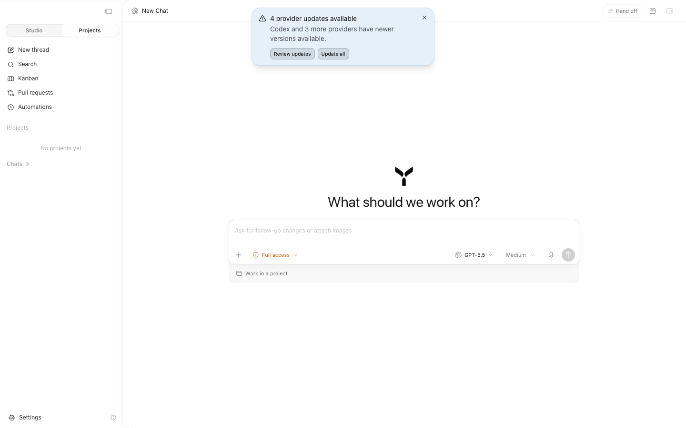
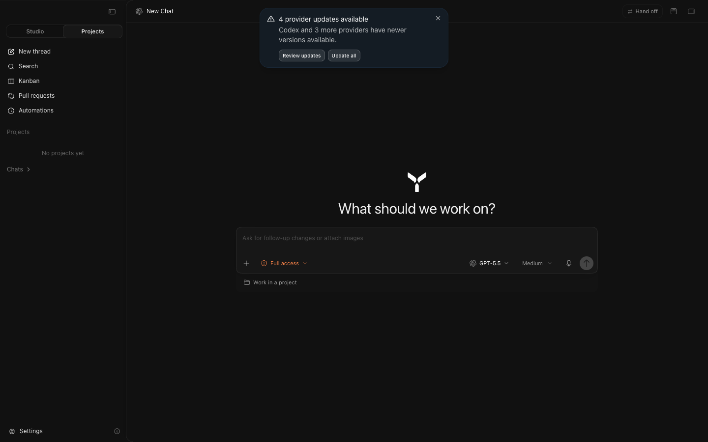
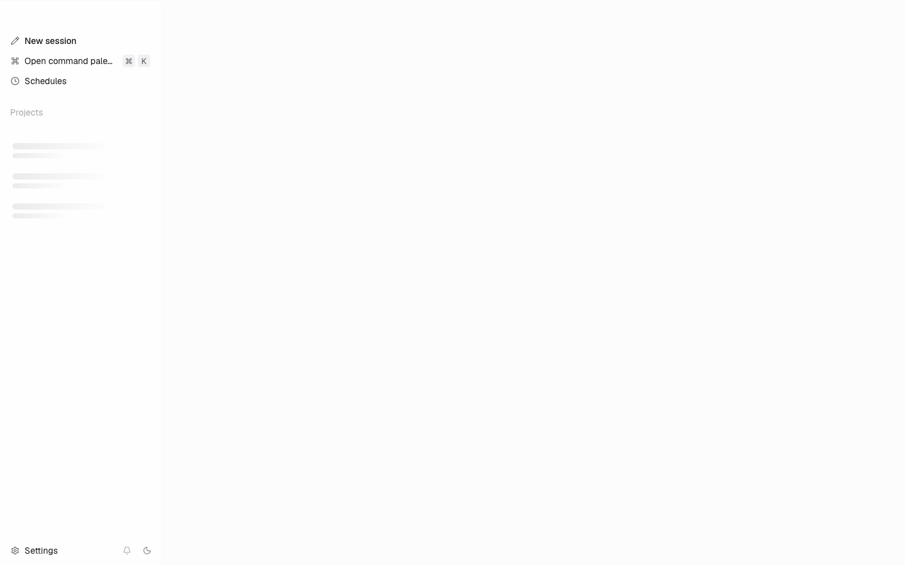

# Lynx Desktop × Synara 视觉基线与执行计划

> 作者：Codex
> 状态：`W7.0 BASELINE FROZEN`
> 审计日期：2026-07-31
> Lynx 基线：`cecc0510955ad39b31e5ec7cc16ee488d75c08c3`
> Synara 基线：`54dff37d91aabf74e85dd42bb47e1a237a02f106`
> 下一执行卡：`W7.1 — visual foundation`
> 关联总账：
> [`codex_architecture_execution_master_plan.md`](codex_architecture_execution_master_plan.md)

## 0. 文档职责

本文冻结 W7 的视觉目标、产品语义映射、验收矩阵、执行顺序和进度口径，回答：

1. Synara 哪些设计应当复刻；
2. 哪些业务结构、状态管理和平台实现不得复制；
3. Lynx 当前与目标相差什么；
4. 每个差异由哪个后续原子 slice 根治；
5. 后续如何证明“像素级、可访问、稳定、没有架构倒退”。

本文不是新的产品协议，也不修改已经冻结的 Agent / Runtime API。领域事实仍以
`Session → Run → Segment → Item` 为准；视觉工作只能消费权威 read model，不能在
presentation 层发明第二套运行状态。

W7.0 只完成只读审计、实拍、决策和计划冻结，**没有修改 production UI**。

---

## 1. 最终目标

### 1.1 一句话目标

以 Synara 当前桌面界面为视觉和交互品质基准，把 Lynx 打磨成：

```text
Work Index       → 用户定位工作、Session 与注意力
Agent Narrative  → 用户理解 Agent 正在做什么、为什么、做到哪一步
Context Dock     → 用户检查文件、差异、时间线和运行证据
```

同时保持 Lynx 已经建立的 Clean Architecture、DDD 限界上下文、插件边界和
`Session → Run → Segment → Item` 心智模型，不复制 Synara 的领域模型、协议、
store、路由或组件组织。

### 1.2 成功标准

最终实现必须同时满足：

- **像素级统一**：固定 viewport 下，shell 几何、surface、文字梯度、密度、边界、
  阴影和动效与冻结目标一致；
- **Agent 心智模型清晰**：root / delegated Run、等待输入、计划、工具、错误和终态
  在 Narrative 中有稳定位置，不依赖颜色猜状态；
- **人体工程学可靠**：高频操作路径短，视觉命中区紧凑而 desktop 真实命中区不小于
  40px、pointer-coarse 不小于 44px，键盘、focus、reduced motion 与屏幕阅读器完整；
- **架构不倒退**：feature UI 不直连 RPC，不复制 domain 状态，不用视觉需求反向污染
  Runtime；
- **可持续扩展**：视觉 token 有唯一作者，Base UI 提供交互原语，agent ring 表达
  产品语义，插件只能通过既有 extension point 贡献内容；
- **没有历史债务**：允许 breaking change，旧 token、旧组件、旧 CSS 路径与新路径
  在同一 slice 内完成替换和删除，不保留 alias、dual path 或临时兼容层。

### 1.3 非目标

- 不把 Synara 的 `Studio / Projects / Threads / Environment` 业务分类原样搬进 Lynx；
- 不复制 Synara 的 Zustand/store、query、router、WebSocket 或 Electron 边界；
- 不为了截图相似而牺牲 Wails window chrome、可访问性或最小窗口稳定性；
- 不把全部视觉规则塞进一个大组件或一个无限增长的全局 CSS 文件；
- 不在没有测量的情况下做渲染性能“优化”；
- 不用一张理想空状态截图替代 Running、Waiting、error、长内容和窄窗验收。

---

## 2. 基线证据与复现条件

### 2.1 权威来源

本轮同时使用了三类证据：

1. 两个仓库在上述 commit 的源码与设计文档；
2. Synara 隔离实例和 Lynx standalone frontend 的真实 DOM、computed style 与交互树；
3. 1440×900 固定 CSS viewport 的 light / dark 实拍。

Synara 使用独立临时 home、非默认端口和未登录配置启动；没有读取或改写用户现有
Synara 数据。Lynx 使用独立 Vite 端口启动。两边截图均为 1× CSS viewport，动态通知
只作为当前状态证据，不作为后续 pixel-diff 的稳定 golden。

### 2.2 当前实拍

Synara 当前 light：



Synara 当前 dark：



Lynx standalone 当前 light：



Lynx standalone 截图只能证明 shell 首屏和 loading 行为；没有 Wails / Runtime 时，
主 Agent 面板不会形成可验收的完整状态。因此它是审计证据，不是目标 golden。W7.1
必须建立 deterministic visual fixture，后续不能继续依赖“本机正好有一条 Session”。

### 2.3 实测几何

Synara 在 1440×900、sidebar 展开时：

| 项目             | 实测值                                |
| ---------------- | ------------------------------------- |
| Sidebar          | `x=0, width=256px, height=900px`      |
| Main content     | `x=256px, width=1184px, height=900px` |
| Content seam     | 左上/左下 `14.4px`，右侧 `0`          |
| Content shadow   | `-6.5px 0 12px -10px rgba(0,0,0,.10)` |
| Header           | `46px`                                |
| Reading column   | `736px`                               |
| Chat gutters     | `12px`；宽屏 `20px`                   |
| Composer radius  | `19.2px`                              |
| Sidebar default  | `256px`                               |
| Sidebar minimum  | `208px`                               |
| Main width floor | `640px`                               |

Lynx 当前已与参考同轴的几何：

- sidebar default `256px`、minimum `208px`；
- main floor `640px`；
- header `46px`；
- reading column `736px`；
- chat gutters `12px / 20px`；
- composer radius `19.2px`；
- drawer motion `300ms cubic-bezier(0.32, 0.72, 0, 1)`。

这部分不应重写，只需删除与目标冲突的第二套解释。

### 2.4 后续固定验收矩阵

每个 W7 production slice 至少覆盖：

| Viewport | DPR | Theme       | 用途                           |
| -------- | --- | ----------- | ------------------------------ |
| 1440×900 | 1   | light, dark | 主 golden、布局与 surface 对齐 |
| 1280×800 | 1   | light, dark | 常见笔记本窗口                 |
| 1120×720 | 1   | light, dark | 当前最小窗口，不允许裁切或重叠 |
| 1440×900 | 2   | light, dark | Wails / Retina hairline 与文字 |
| 1280×800 | 1   | high zoom   | 文字放大、长文与滚动稳定性     |

视觉 diff 必须：

- 使用 deterministic fixture、固定 locale、固定时钟和稳定字体；
- 屏蔽光标、动态时间、随机 ID、系统 traffic lights 与非目标通知；
- 对几何、颜色和 raster diff 分别报告，不能只用一个宽松的全图百分比；
- 失败时保留 baseline、actual、diff 三张图；
- 有意分歧必须写入本文 §7，不得以更新 golden 掩盖回归。

---

## 3. 产品语义映射

### 3.1 页面与表面

| Synara 视觉表面           | Lynx 产品表面                          | 复刻内容                                      | 不复制内容                             |
| ------------------------- | -------------------------------------- | --------------------------------------------- | -------------------------------------- |
| Projects / thread sidebar | Work Index                             | drawer、分组、行密度、选中/悬停、折叠、resize | Studio/Projects 领域分类、thread store |
| Chat surface              | Agent Narrative                        | header、reading column、composer、scroll      | Synara message / provider lifecycle    |
| Subagent activity         | delegated Run tree                     | compact disclosure、状态层级、动效节奏        | Synara subagent 数据结构               |
| Environment / right dock  | Context Dock                           | full-height split、header、tabs、resize       | Environment 业务字段和路由             |
| Diff / terminal / browser | Workspace view plugins                 | 容器几何、surface、toolbar 语言               | Electron panel implementation          |
| Settings                  | Settings plugin contexts               | list、section、表单密度、键盘提示             | Synara settings schema                 |
| Toast / dialogs / menus   | Base UI overlays                       | surface、edge、motion、placement              | 业务命令与副作用                       |
| Kanban / PR / Automations | 可选 workspace / schedule capabilities | 导航层级与信息密度                            | 未进入 Lynx 产品模型的功能             |

### 3.2 状态归属

UI 只翻译下列权威事实，不补造事实：

| 用户看到的状态            | 唯一事实来源                                     | Presentation 责任                  |
| ------------------------- | ------------------------------------------------ | ---------------------------------- |
| Session 是否存在/选中     | Agent application projection                     | Work Index 排序、选中与空状态      |
| Run Running/Waiting/终态  | normalized `runsById`                            | 状态点、文案、disclosure、可用操作 |
| delegated lineage         | Runtime durable Run lineage projection           | 按 parent item 嵌入 Narrative      |
| plan / progress / metrics | source-owned Run projection                      | 摘要、详情和 tabular number        |
| approval / question       | Pending Interrupt Set                            | HITL 卡片、输入与提交结果          |
| cancel 是否成功           | committed cancel response + refreshed projection | 禁用、反馈、对账                   |
| replay 丢失/重连          | Runtime error + authoritative refresh            | 非破坏性恢复提示，不伪造事件       |
| file / diff / timeline    | workspace plugin application ports               | Context Dock 展示与导航            |
| theme / density / motion  | Desktop appearance preference                    | token 发布，不影响领域状态         |

### 3.3 必须有稳定 fixture 的状态

后续 visual harness 必须具名覆盖：

1. bootstrap loading；
2. 无 project / 无 Session；
3. 新 Session 空 Narrative；
4. idle conversation；
5. optimistic send 与 acknowledged send；
6. root Running；
7. delegated child、sibling、nested child Running；
8. child Waiting approval；
9. child Waiting question；
10. root / child finished、failed、canceled、limit；
11. 精确取消进行中与取消失败；
12. reconnect、replay unavailable、authoritative refresh；
13. long markdown、长代码、长路径、长标题、CJK 与 mixed text；
14. Context Dock light density、review density、empty、loading、error；
15. sidebar expanded、collapsed、minimum、resized；
16. settings list、表单、dialog、menu、tooltip、toast；
17. reduced motion、keyboard-only、focus-visible；
18. 1120×720 最小窗口与 2× DPR。

---

## 4. 已冻结的视觉决策

下面是 W7 的目标，不再把 Synara 当前值、Lynx 当前值和历史文档并列为三种“可选答案”。

### V-01：参考边界

复制 Synara 的视觉语言、交互节奏和信息密度；保留 Lynx 的产品语义、状态作者、插件
边界和 Wails 平台实现。视觉相似不授权跨限界上下文取数。

### V-02：Shell 与主卡片

目标：

- sidebar default `256px`、minimum `208px`；
- header `46px`；
- content card 左侧 seam radius `14.4px`；
- 左侧方向性阴影 `-6.5px 0 12px -10px`；
- seam 由 card 自己绘制，resize rail 只扩大命中区和增强同一条 edge；
- sidebar collapse 后 seam 与 shadow 同步消失；
- drawer、gap、card edge 使用同一个 `300ms` motion token。

当前 Lynx production 把 seam 写成全高直线，并在注释中宣称圆角是坏设计；同一文件的
上层说明又宣称“rounded on the seam side”。这是明确的坏味道。以用户要求和当前 Synara
实测为准：**W7.1/W7.2 改为 14.4px 圆角 seam，并删除方角解释，不保留开关。**

### V-03：Typography

默认 UI base 改为 `12px`，目标梯度：

| Token   | Target |
| ------- | ------ |
| UI 2xs  | 9px    |
| UI xs   | 10px   |
| UI sm   | 11px   |
| UI base | 12px   |
| UI lg   | 13px   |
| code    | 11px   |

字体使用原生系统 UI stack；代码使用稳定的 mono stack。几何不随字体 preference 一起
缩放，用户仍可在受控范围内独立调节字体和 density。

Lynx 当前默认是 `11/12/13/14/15px`，code `13px`，相对参考明显偏大。后续直接替换
默认 ladder，不增加 `synara density` 之类的兼容 preset。

### V-04：Density

comfortable 默认目标：

| 项目            | Synara / 目标      | Lynx 当前   |
| --------------- | ------------------ | ----------- |
| Sidebar row     | 28px               | 30px        |
| Row gap         | 8px                | 8px         |
| Chat gutter     | 12px / 20px        | 12px / 20px |
| Composer editor | 12 / 8 / 12 / 14px | 相同        |
| Composer footer | 6px / 8px          | 8px / 10px  |

可见行可以保持 28px，但独立 desktop icon action 的真实命中区不得小于 40px，
pointer-coarse 不得小于 44px；使用 pseudo hit area 或容器布局扩展命中区，不能把
所有视觉行强行放大。

### V-05：Composer

目标：

- max width `736px`；
- radius `19.2px`；
- 空状态 hero 与 composer 组成同一个光学居中组；
- active transcript 中 composer 是正常流 sibling，以 `-20px` 上提覆盖 transcript；
- editor 与 footer 分别拥有 padding；
- stacked activity 与 composer 共用 column frame，header rail 使用内缩宽度；
- edge 使用**真实 1px border**，shadow 只表达 depth；
- focus 只增强 edge，不让整个 surface 上跳；
- footer 使用 `6px / 8px` 目标 inset。

Lynx 当前 `AgentComposerSurface` 说明“无 border、用 shadow ring 画边”，而全局 shadow
system 又说明 raised surface 应使用真实 border、shadow 只管 depth。这是第二个明确冲突。
W7.1 必须选择单一机制：**真实 border + 单层方向性 depth shadow**，删除 shadow ring
及其相反注释。

### V-06：Surface 与层级

- light：主内容保持白色，shell/drawer 用极轻 material 差异；
- dark：主内容接近 `#0e0e0e`，drawer 通过透明度和 seam 区分，不使用大面积高对比边框；
- outer seam 强于内部 header / pane divider；
- popup、dialog、composer、selected chip 分别只使用与角色匹配的一层 edge 和 depth；
- 不叠加 border、ring、outline、两层同方向 shadow 制造脏边；
- 只有 raised / floating 元素有 shadow，普通分组优先依靠间距和背景层级。

### V-07：Motion

| 角色                  | 目标                                        |
| --------------------- | ------------------------------------------- |
| Sidebar / dock 大表面 | `300ms cubic-bezier(0.32, 0.72, 0, 1)`      |
| Disclosure            | `220ms ease-out`                            |
| 普通颜色/focus        | `150–200ms ease-out`                        |
| Press                 | `scale(.96)`，释放可被中断                  |
| Reduced motion        | 移除位移/缩放，只保留必要的即时或短 opacity |

禁止 `transition: all`，禁止同一交互的 rail、gap、card 各用不同 duration，禁止 exit
动画结束前让不可见元素继续拦截 pointer。

### V-08：Context Dock

- 是 content card 内部真实列，不是盖住 Narrative 的 overlay；
- light view 默认约 `420px`，review view 可保留 Lynx 的 `720px` 语义宽度；
- dock 不超过 row 的 50%，Narrative 保留至少 `420px`；
- header、tab、divider 与主 chrome 共用 token；
- Synara 的右侧面板只提供几何和交互参考，内容仍由 Lynx workspace plugins 提供；
- 每种 density 分别持久化 width，不用一个 width 同时服务 list 和 diff。

### V-09：Work Index

- 高频入口最多占第一视觉层：New session、command/search、Schedules；
- Projects / Sessions 按真实产品层级组织，不能为了像 Synara 增加无领域意义的
  Studio/Projects switch；
- row、section header、badge、disclosure、拖拽、选中、hover、attention 形成一套
  状态语法；
- terminal 状态不铺满彩色背景；颜色优先集中在小型 status dot / badge；
- sidebar footer 保持 Settings、notifications、theme 等低频全局入口；
- resize 时只写 shell custom property，release 后一次持久化，不在 pointermove 触发
  React render。

### V-10：Agent Narrative

- transcript 是阅读主轴，工具、计划、delegated Run 必须挂在其真实 source item；
- Waiting 默认展开，其他 delegated Run 默认 compact summary；
- root 与 child 的 Running/Waiting/terminal 不互相覆盖；
- 计划、工具、HITL、错误和恢复提示共享同一宽度、间距和状态语言；
- status 文案必须由 lifecycle + reason 精确翻译，不能只显示 `failed`、`error` 等无上下文
  词；
- 长内容使用 wrapping、clamp、disclosure 和 dock，而不是横向撑破主列。

### V-11：Platform 与 accessibility

以下是有意保留的 Lynx 差异：

- Wails traffic-light gutter、window drag region 与 `--wails-draggable`；
- Runtime endpoint / desktop bridge 边界；
- Context Dock 的 Lynx plugin semantics；
- CJK locale、中文错误和 mixed-text 排版；
- keyboard / ARIA / focus-visible / pointer-coarse 命中区；
- reduced motion 与用户 appearance preference。

这些差异不降低视觉目标；它们是平台和产品语义的正确实现。

---

## 5. 当前差异审计

### 5.1 已经正确或接近目标

| 原则             | 当前状态                                                     | 后续动作               |
| ---------------- | ------------------------------------------------------------ | ---------------------- |
| Shell geometry   | 256 / 208 / 640、46 header 已对齐                            | 保持唯一 token 作者    |
| Reading rhythm   | 736 max、12/20 gutter、active composer `-20px` 已对齐        | 加 fixture 防回归      |
| Drawer material  | light 64%、dark 72%、blur/saturate 已存在                    | 用实拍微调，不改所有权 |
| Resize model     | custom property live write、release persist                  | 保持                   |
| Context Dock     | real column、per-density width、50% cap                      | 补视觉与状态           |
| Motion control   | 有全局 scale、reduced motion、drawer curve                   | 收口散落 duration      |
| Agent projection | normalized Run tree、source ownership、authoritative refresh | 只做 presentation      |

### 5.2 必须根治的坏味道

| 原则                 | Before（当前）                                                | After（冻结目标）                                      |
| -------------------- | ------------------------------------------------------------- | ------------------------------------------------------ |
| 单一视觉真相         | DESIGN、CSS 注释和 component 注释对 seam 方/圆互相矛盾        | 14.4px 圆角 seam，一个 token、一个解释                 |
| 单一 edge 机制       | composer component 用 shadow ring；全局系统宣称 real border   | real border 画 edge，shadow 只画 depth                 |
| Typography hierarchy | 默认 14px base，相对参考整体膨胀                              | 默认 12px，9/10/11/12/13 + code 11                     |
| Density              | row 30、footer 8/10                                           | row 28、footer 6/8                                     |
| Determinism          | standalone frontend 无 Runtime 时主区无法形成视觉基线         | deterministic visual fixture 覆盖所有权威状态          |
| CSS ownership        | structural globals 与 Tailwind utility 的职责边界仍有冲突说明 | globals 只保留跨节点结构；视觉 token/atom 归明确 owner |
| Error legibility     | 部分 UI 仍可能只给通用 error / failed                         | operation + subject + actionable reason                |
| Motion consistency   | 局部存在独立 120/150/200ms 与自写 transition                  | 按角色使用少量 token，禁止 `all`                       |
| Surface cleanliness  | 边、ring、shadow 的注释与实现不一致，容易继续叠加             | 每个 surface 只允许一个 edge + 一个 depth role         |

### 5.3 不应“顺手重构”的部分

- Agent / Runtime wire、capability、Run tree projection；
- Runtime endpoint anti-corruption boundary；
- workspace plugin registry 与 public ports；
- latest-request-wins、view revision、authoritative refresh；
- per-density dock width 的产品语义；
- source-owned timeline / tool / plan / interrupt。

视觉实现若要求修改这些边界，应先提交可复现的语义缺口证据；否则视为架构倒退。

---

## 6. 分阶段执行计划

每个 slice 都是 breaking、原子、可验证的提交。一个 slice 内删除旧路径；不建立
`legacy`、`v2`、`synaraMode` 或双 token。

### W7.0 — 基线与状态映射

状态：`DONE`

产物：

- 本文；
- 固定 viewport 当前实拍；
- 页面、组件、状态和 token 映射；
- V-01–V-11 决策；
- W7.1–W7.5 爆炸半径与验收矩阵。

退出标准：

- production code 无变化；
- 参考 commit、复现条件和有意分歧可追溯；
- seam、typography、density、composer edge 不再有待选方案；
- 下一 slice 可直接动工，不需要重新做产品裁决。

### W7.1 — Visual foundation

状态：`READY`

目标：

- 冻结 typography、density、radius、surface、edge、shadow、motion token；
- 建立 deterministic visual fixture / route；
- 清除已知 CSS 构建告警与互相冲突的注释/规则；
- 让 primitive、atom、agent ring 的职责可由检查脚本证明。

主要爆炸半径：

```text
app/desktop/frontend/src/styles/globals.css
app/desktop/frontend/src/lib/typography.ts
app/desktop/frontend/src/lib/density.ts
app/desktop/frontend/src/lib/motion.ts
app/desktop/frontend/src/lib/shellGeometry.ts
app/desktop/frontend/src/ui/**
app/desktop/frontend/src/ui/agent/**
app/desktop/frontend/scripts/check-design-tokens.mjs
app/desktop/frontend/scripts/check-interactive-chrome.mjs
visual fixture / screenshot harness
```

行为不变量：

- appearance preference 仍可调字体、density、radius、motion；
- window min、resize、drag region、plugin boundary 不变；
- 一个 token 只有一个 writer；
- no `transition-all`、no raw production visual constants outside approved token source；
- no invalid Tailwind shadow utility 或未知 CSS selector warning。

提交建议：

1. `test(desktop): establish deterministic visual fixtures`
2. `refactor(desktop): unify visual foundation tokens`
3. `fix(desktop): close css and token hygiene gates`

### W7.2 — Shell 与 Work Index

状态：`TODO`

目标：

- 落地 14.4px rounded seam、backing corner、drawer sheen 和 collapse 动画；
- Work Index 的 header、primary action、section、row、badge、empty/loading/error 对齐；
- sidebar resize、collapsed、min viewport、traffic lights 完整验收。

主要爆炸半径：

```text
src/ui/agent/app-shell.tsx
src/ui/agent/sidebar.tsx
src/ui/agent/content-card.tsx
src/ui/agent/surface-header.tsx
src/plugins/builtin/sidebar/**
src/pages/AgentClientPage.tsx
shell visual fixtures and interaction tests
```

行为不变量：

- Work Index 只消费 application/public selectors；
- pointermove 不触发业务 store 高频 render；
- collapse 后所有页面都有恢复 sidebar 的入口；
- Settings 接管窗口时不残留 seam / drawer 占位；
- 不复制 Studio/Projects 业务切换。

### W7.3 — Agent Narrative、Composer、Run tree 与 HITL

状态：`TODO`

目标：

- composer real border + depth shadow、footer 6/8、empty/active 布局对齐；
- transcript typography、message rhythm、tool/plan/Run tree 状态语法统一；
- Running、Waiting、terminal、error、cancel、recovery 和长内容全部实拍通过。

主要爆炸半径：

```text
src/plugins/builtin/chat/**
src/plugins/builtin/agent/**/ui/**
src/plugins/builtin/shell/kernel/panel/ChatStream.tsx
src/plugins/builtin/shell/kernel/panel/MessageStream.tsx
src/plugins/builtin/shell/kernel/panel/*Banner.tsx
src/ui/agent/composer-surface.tsx
Narrative/HITL visual fixtures and interaction tests
```

行为不变量：

- 不改变 normalized Run projection；
- exact child cancel、parent item locate、HITL settlement 语义不变；
- optimistic item 必须与 ack exact ID 对账；
- Waiting disclosure 默认展开，终态不制造持续动画或大面积状态色；
- stream 高频路径不因视觉状态订阅重新引入全树 render。

### W7.4 — Context Dock、Workspace Views 与 Settings

状态：`TODO`

目标：

- dock header、tabs、resizer、light/review density、empty/error 对齐；
- file、diff、timeline、plan、settings 表面使用同一 typography / surface / edge 语言；
- dialog、menu、tooltip、toast 与 keyboard shortcut presentation 收口。

主要爆炸半径：

```text
src/ui/agent/context-dock.tsx
src/plugins/builtin/workspace/**
src/plugins/builtin/settings/**
src/plugins/builtin/shell/kernel/panel/Dock*.tsx
src/ui overlay primitives
dock/settings visual fixtures
```

行为不变量：

- view content 仍由 plugin contribution 提供；
- light/review width 分别持久化；
- dock close / promote / reopen 不丢 active view identity；
- overlay focus trap、return focus、escape 与 pointer dismissal 正确。

### W7.5 — Responsive、Accessibility 与 Visual Closure

状态：`TODO`

目标：

- 完成 viewport/DPR/theme 全矩阵；
- Wails 真机截图、drag、resize、scroll、IME、Retina hairline；
- keyboard-only、focus-visible、ARIA、screen reader、reduced motion；
- 性能测量、全量门禁与 visual diff closure。

主要爆炸半径：

```text
visual baselines and diff reports
accessibility tests
Wails integration / smoke tests
interaction and performance measurements
final design/architecture docs
```

退出标准：

- 关键状态在全部固定 viewport/theme 下无未知 diff；
- 有意分歧只剩 §7 已接受项；
- no unknown build warning；
- frontend 全门禁、Wails build/smoke、keyboard/focus/ARIA/reduced-motion 全部通过；
- 删除 fixture-only bypass、debug hook、旧 golden 和临时 CSS。

---

## 7. 有意分歧登记

只有本表中的差异可以不与 Synara 相同；新增差异必须先更新本文并给出产品或平台理由。

| ID   | 分歧                           | 理由                                            | 状态     |
| ---- | ------------------------------ | ----------------------------------------------- | -------- |
| D-01 | Wails window chrome            | Lynx 平台边界，不复制 Electron API              | ACCEPTED |
| D-02 | Work Index 信息架构            | Lynx 使用 Project / Session，不复制 Studio 分类 | ACCEPTED |
| D-03 | Context Dock 内容              | 由 Lynx workspace plugins 与 Run evidence 驱动  | ACCEPTED |
| D-04 | Run tree / HITL 语义           | 以 Runtime 权威模型为准，Synara 只提供视觉参考  | ACCEPTED |
| D-05 | CJK、中文错误和 mixed text     | Lynx locale 与可读性要求                        | ACCEPTED |
| D-06 | 可访问性命中区可能大于可见控件 | 人体工程学和 pointer-coarse 要求                | ACCEPTED |
| D-07 | Review dock 默认宽度 720px     | diff + navigator 的真实可读宽度                 | ACCEPTED |

以下不是有意分歧：

- 方角 seam；
- 14px 默认 UI base；
- 30px 默认 sidebar row；
- 8/10px composer footer；
- composer shadow ring；
- 缺少 deterministic state fixture；
- 通用、不可操作的错误文案。

它们必须在 W7.1–W7.3 中被删除。

---

## 8. 质量门与完成定义

### 8.1 每个 slice 的最低门禁

```text
npm run typecheck
npm run lint
npm run format:check
npm run test
npm run knip
npm run check:circular
npm run check:contexts
npm run check:published-boundaries
npm run check:layers
npm run check:tokens
npm run check:chrome
npm run check:locales
npm run check:bootstrap
npm run check:bundle
```

另加：

- targeted browser interaction tests；
- 本 slice 涉及状态的 baseline / actual / diff；
- `git diff --check`；
- generic filename、receiver、TODO/FIXME/HACK、compatibility residue 扫描；
- 改动前后的 render / subscription 测量，只有证据证明退化时才优化。

### 8.2 视觉审查问题

每次 review 必须逐项回答：

1. surface 的 edge 和 depth 是否各只有一个机制？
2. 相邻圆角是否满足同心关系，内层 radius 是否扣除真实 inset？
3. 图标与文字是光学对齐还是只做几何居中？
4. 数字、时间、diff stats 是否使用 tabular numbers？
5. heading/body 是否使用 `text-balance` / `text-pretty` 防止孤词？
6. motion 是否可中断、可逆，并尊重 reduced motion？
7. invisible exit element 是否还拦截 pointer 或 focus？
8. visible density 紧凑时，desktop 真实命中区是否仍达 40px、pointer-coarse 44px？
9. 颜色是否表达语义，而不是替代文案和结构？
10. 长英文、CJK、代码、路径和 1120×720 是否都不破版？
11. production component 是否越过 application/public port 读取 RPC / wire？
12. 是否删除了被替换的 token、注释、组件、golden 和测试路径？

### 8.3 W7 最终完成定义

只有同时满足以下条件，W7 才能标记 `DONE`：

- W7.1–W7.5 全部完成并独立提交；
- §3.3 全部状态有 deterministic fixture；
- §2.4 全 viewport/DPR/theme 矩阵通过；
- §7 之外没有未知视觉差异；
- Wails 真机交互、keyboard、focus、ARIA、reduced motion 通过；
- 没有 compatibility layer、dual token、旧组件、临时 fixture bypass；
- 文档、实现、测试、golden 和 Git 进度一致；
- 全量 frontend、Wails 与仓库级质量门通过。

---

## 9. 进度台账

| Workstream                   | 状态    | 当前事实                                   | 下一动作               |
| ---------------------------- | ------- | ------------------------------------------ | ---------------------- |
| W2 Agent ownership           | `DONE`  | Framework / App 边界已收口                 | 仅防回归               |
| W3 Runtime conformance       | `DONE`  | Run tree、recovery、stream/query 已收口    | 仅防回归               |
| W4 Desktop Run tree          | `DONE`  | normalized projection、HITL、cancel 已实现 | 只做 presentation      |
| W5 capability cutover        | `DONE`  | negotiated production Run trees 已启用     | 仅防回归               |
| W6 architecture/hygiene      | `DONE`  | consumer ports、命名、全门禁已收口         | 仅防回归               |
| W7.0 visual baseline         | `DONE`  | 本文、实拍、映射、决策、执行卡已冻结       | 进入 W7.1              |
| W7.1 visual foundation       | `READY` | 爆炸半径与不变量已明确                     | 建 fixture，统一 token |
| W7.2 shell / Work Index      | `TODO`  | 依赖 W7.1                                  | 等待                   |
| W7.3 Narrative / Run / HITL  | `TODO`  | 依赖 W7.1                                  | 等待                   |
| W7.4 Dock / Views / Settings | `TODO`  | 依赖 W7.1，可与 W7.3 在文件边界明确后安排  | 等待                   |
| W7.5 final closure           | `TODO`  | 依赖 W7.2–W7.4                             | 等待                   |

当前唯一主任务：

```text
W7.1 — 先建立 deterministic visual fixtures，
       再以 breaking change 统一 typography / density / edge / shadow / motion，
       同一 slice 删除冲突规则和历史解释。
```

---

## 10. 提交纪律

- 一个提交只完成一个可独立验证的视觉/交互闭环；
- 每个提交前记录 Before / After、状态 fixture 和行为不变量；
- 视觉修改与必要的 test/golden/doc 同提交；
- 不提交 Synara 参考仓库、临时 home、node_modules、浏览器 profile 或运行日志；
- 不用 bulk format 掩盖真实 diff；
- 不提交与当前 slice 无关的用户改动；
- 完成门禁后及时 commit、push，并回填本文与总执行台账。

该纪律的目的不是减少提交数量，而是让每次 breaking change 都能回答：

> 哪个坏味道被永久删除了，哪个权威行为保持不变，我们用什么证据证明？
