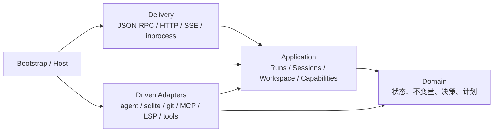
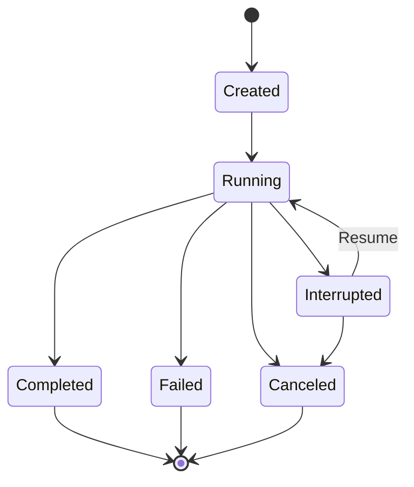
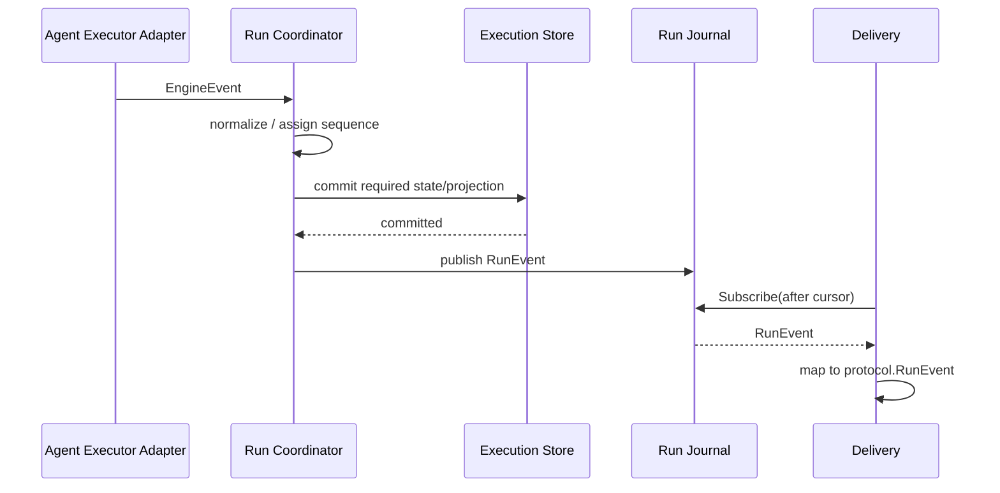

# Execution-Centered Architecture — `app/runtime` 架构基准

> **日期**：2026-07-10（设计）/ 2026-07-12（落地）
>
> **状态**：**现行唯一架构基准**。§18 的 8 批重写 + 收尾批（§20 所有权反转的最后一公里）已全部落地：run 生命周期归 `application/runs` + `bootstrap.Host`，executor/turn-control 归 `adapter/agentexec/turn`,读投影归 `application/queries`,`internal/runtime` facade 已彻底解散、config 折入 `bootstrap`;§16 全部 fitness 规则(含 rule 5 delivery 无 run-lifecycle state)由 `internal/arch` 机器强制。本文原为"从零设计提案",现为实现基准 —— 描述的是已建成的结构,不是设想。
>
> **命题**：如果不考虑现有目录与 API 包袱，只吸收领域驱动设计、整洁架构和六边形架构的思想，`app/runtime` 应该如何从零设计？
>
> **立场**：采用 DDD 与 Clean Architecture 的边界、依赖和建模方法，但不复制 `Entity/Repository/ApplicationService/DomainEventBus` 等样板。

---

## 0. 结论

Lyra Runtime 不应以 `kernel.Engine` 或 agent loop 为架构中心，而应以 **Run 的完整生命周期**为中心：

```text
Session → Run → RunEvent → durable state / live stream / workspace effects
```

系统最核心的复杂度不是“怎么调用一次 LLM”，而是：

1. 一个 Session 同一时刻只能有一个可写 Run；
2. Run 必须脱离启动它的 HTTP request 继续执行；
3. Running、Interrupted、Resumed、Canceled、Completed 必须构成合法状态机；
4. 中断必须先持久化，客户端才能观察并恢复；
5. Run、Transcript、Conversation、Usage 与 agent ProcessSnapshot 不能互相矛盾；
6. live event、durable projection、workspace checkpoint 必须有明确的顺序和一致性语义；
7. 组件关闭必须拒绝新工作、取消已有工作并等待其退出；
8. MCP 持久配置与实时连接状态必须明确区分 source of truth 和 live projection。

因此，从零设计时采用以下职责划分：

- **Domain**：表达状态、不变量、状态转换和决策结果；
- **Application**：拥有完整用例、事务边界、并发控制、事件顺序和生命周期；
- **Driven adapters**：用 agent SDK、SQLite、Git、MCP、LSP 等技术实现 application 定义的 port；
- **Delivery**：只把 JSON-RPC/HTTP/SSE 转换为 application command/query 和返回值；
- **Bootstrap**：只负责配置投影、装配、启动和逆序关闭。

agent loop 是“执行一个 Run”的核心机制，但不是 Lyra 产品领域本身。它应作为一个强耦合、内部焊死的 agent-execution adapter，而不是统领全部业务的架构环。

---

## 1. 为什么需要重新定义中心

### 1.1 当前系统真正的应用层已经存在，只是没有统一名字

当前应用职责分散在三个位置：

- `internal/delivery/server`：live run registry、event hub、cancel、run pump、checkpoint、后台任务；
- `internal/kernel`：agent SDK 防腐、turn 状态机、HITL、run segment effects、跨 store lifecycle；
- `internal/runtime`：业务 facade、MCP 一致性、provider/model role、schedule/indexing、事务、资源生命周期和组合根。

这不是“缺少一个教科书 application 目录”的形式问题，而是同一个 Run 用例需要跨三处阅读才能还原：

```text
delivery.StartRun
  → runtime.PlanTurnStart / ClaimRunSlot / StartTurn
    → kernel.turn.Dispatcher
      → agent runtime
  → delivery.openSegment / pumpRun
    → kernel.runsegment.Effects
      → runtime stores / checkpoint / maintenance
```

从零设计不应继续接受这种职责分布。应把已存在的应用逻辑收进一个明确的 application 边界，而不是继续用 `kernel`、`runtime`、`server` 三个名称分别承载其中一段。

### 1.2 是否需要 Application，不取决于 transport 数量

“只有一个 delivery，所以不需要 application 层”不是合适的判据。

是否需要独立应用边界，取决于是否存在需要脱离协议独立表达的用例和生命周期。Lyra 已经有多种 driver：

- HTTP/JSON-RPC；
- inprocess transport；
- scheduler；
- startup recovery；
- post-run maintenance；
- MCP registry reconciliation。

更重要的是，Start、Resume、Cancel、Rollback、Fork、Delete、Import 等用例本身就应当可以在不启动协议栈的情况下测试和执行。

### 1.3 源码依赖与运行时调用必须分开画

SQLite、Git、MCP 等不是“domain 下面的底层”。它们是位于最外侧的 driven adapters。

Application 在运行时会调用它们，但源码不能 import 它们；具体 adapter 反向 import application/domain 并实现其 port。



图中的箭头表示**源码依赖**，不是运行时调用方向。

---

## 2. 设计原则

### 2.1 按不变量与语言切 bounded context，不按名词切包

一个名词不等于一个 bounded context。若多个类型总是在同一事务、同一状态机和同一用例中变化，它们通常属于同一个上下文。

反过来，仅仅因为两类数据都存在 SQLite 中，也不代表它们属于同一个领域。

### 2.2 Domain 只表达代码真正需要保护的规则

Domain 可以包含：

- value object；
- entity / aggregate；
- 状态转换；
- policy；
- 纯算法；
- mutation plan。

但不为每个 CRUD 表制造聚合根，也不因为某个能力有名字就强行放进 `domain/`。

例如 AGENTS.md、Skills、Recipes 的文件发现若主要是 I/O 能力，可以直接是 workspace/context adapter；只有 precedence、merge、validation、render 等纯规则值得下沉为 domain 函数。

### 2.3 Application 拥有副作用顺序

Domain 决定“允许什么”和“应该变成什么”，Application 决定：

- 什么时候加载状态；
- 什么时候打开事务；
- 先写哪一部分；
- 何时发布事件；
- 哪些错误可以补偿；
- 哪些后台操作属于 component lifetime；
- 哪些工作必须等待完成。

### 2.4 Port 放在消费方

- `application/runs` 消费 Executor、Store、Checkpoint，就由 `application/runs` 定义这些接口；
- delivery 消费 Runs、Sessions，就由 delivery 定义窄接口；
- adapter 隐式满足接口；
- bootstrap 注入具体实现。

接口用于真实边界、替换和测试，不为单一内部算法制造仪式。

### 2.5 一个显式管线优于全局事件总线

Lyra 需要强类型 RunEvent，但不需要 EventBus、Mediator 或 CQRS 框架。

Run 事件通过一个显式 pipeline 完成：

```text
executor event → normalize → durable commit → live journal → delivery projection
```

### 2.6 组合根不能同时是业务 facade

Bootstrap 可以 import 全部具体包，但不得拥有业务规则、跨组件锁和 80 个业务方法。

Application facade 可以汇总用例入口，但不得负责创建 SQLite、MCP client、LSP process 或 telemetry exporter。

---

## 3. 目标目录

```text
app/runtime/
├── cmd/lyra/
│   └── main.go
│
├── internal/
│   ├── domain/
│   │   ├── execution/
│   │   │   ├── session.go
│   │   │   ├── run.go
│   │   │   ├── event.go
│   │   │   ├── timeline.go
│   │   │   ├── rollback.go
│   │   │   └── usage.go
│   │   ├── capability/
│   │   ├── workspace/
│   │   ├── modelconfig/
│   │   ├── automation/
│   │   └── indexing/
│   │
│   ├── application/
│   │   ├── runs/
│   │   │   ├── commands.go
│   │   │   ├── queries.go
│   │   │   ├── coordinator.go
│   │   │   ├── supervisor.go
│   │   │   ├── stream.go
│   │   │   └── ports.go
│   │   ├── sessions/
│   │   ├── workspace/
│   │   ├── capabilities/
│   │   └── schedules/
│   │
│   ├── adapter/
│   │   ├── agentexec/
│   │   ├── persistence/sqlite/
│   │   ├── workspace/
│   │   ├── toolset/
│   │   ├── modelclient/
│   │   ├── mcp/
│   │   ├── lsp/
│   │   └── maintenance/
│   │
│   ├── delivery/
│   │   ├── protocol/
│   │   ├── rpc/
│   │   └── transport/{http,inprocess}/
│   │
│   ├── bootstrap/
│   │   ├── config.go
│   │   ├── wire.go
│   │   └── host.go
│   │
│   ├── component/
│   │   └── scope.go
│   └── arch/
│       └── arch_test.go
│
└── doc/
```

这棵树表达的是边界，不是要求所有上下文复制相同模板：

- 没有领域规则的能力不建 domain 包；
- 没有 outbound dependency 的用例不建 adapter；
- 小而内聚的上下文保持一个包；
- 只有出现真实复用时才提取技术型 `platform/*` 包。

**落地采用了单列 `infra` 环**（`internal/infra/{storage/sqlite,git,lsp,mcp,exec,a2a}`）：SQLite、Git、MCP、LSP 是 driven adapters，把它们与 capability adapters（`internal/adapter/*`）分环，让"实现 domain port 的纯技术设施"与"实现 application port + 包外部能力的适配器"各自成环、依赖规则更清晰（`arch_test` 强制 `infra ↛ application/adapter/delivery/composition`,只 import domain）。这是 §3 从零设计里"不单列 infra"理想化的一个有意偏离 —— 单列 infra 是合法的整洁架构选择,不是债。`platform/*` 抽象仍按"出现真实复用再提"的原则,不提前建立。

---

## 4. Bounded Context

### 4.1 Execution：核心域

Execution 初始包含：

- Session；
- Run；
- Transcript；
- Conversation；
- Interrupt；
- Usage / Budget；
- 与 Session 生命周期严格绑定的 Todo。

这些概念属于一个上下文，但不必属于同一个 aggregate。

**落地偏离（有意）**：`Run`/`Transcript`/`Conversation`/`Interrupt`/`Usage(accounting)` 落在 `domain/execution/{run,transcript,conversation,interrupts,accounting}` 子包；但 **`Session` 与 `Todo` 保留为各自独立的 `domain/session`、`domain/todo` 包，不物理归入 `execution`**。理由：二者的 aggregate store 有真实跨环 feature 消费者（session 被 sessions 协调器 + 多适配器消费,todo 被 agentexec + toolset 消费）,port 须落在最内公共点(自身 domain 包);把它们塞进 execution 子包不增内聚、只增耦合。"属于同一执行上下文"是概念归属,不强制同一 Go 包 —— 这与本节"一个上下文但不必同一 aggregate"的精神一致。

#### Session aggregate

Session 负责：

- 工作区绑定；
- 标题与默认模型；
- fork/subtask lineage；
- relocate；
- 创建、删除和分支规则；
- 是否允许接纳新 Run 的领域判断。

#### Run aggregate

Run 负责：

- model selection；
- budget；
- lifecycle state；
- interrupt state；
- terminal outcome；
- usage accumulation；
- parent/segment relationship（若产品确实需要）。

推荐状态机：



关键约束：

- `RunID` 在 start、interrupt、resume、terminal 生命周期内稳定；
- 如果一次 resume 会开启新的流式执行段，使用 `SegmentID` 表达，不复用“新的 Run”概念；
- `Turn` 只保留给一次模型/tool round，或从产品语言中删除；
- agent `ProcessID` 是 adapter recovery handle，不是领域身份；
- Pending Interrupt 是 Run 的状态，不是独立 bounded context。

#### Transcript 与 Conversation

二者是 Execution 内不同用途的 projection：

| Projection | 用途 | 消费者 |
|---|---|---|
| Transcript | Item + Run 时间线 | 客户端、rollback/fork |
| Conversation | 发给模型的 message context | agent executor |

它们可以使用不同表和不同读取优化，但必须由 Execution application use case 统一提交，不应由 delivery 各自写入。

### 4.2 Capability Governance

初始候选包括：

- Tool catalog；
- Approval mode/rule；
- Tool safety；
- MCP server configuration；
- effective MCP ToolPolicy；
- capability enablement。

是否最终拆成 Approval 与 Integration 两个上下文，应根据语言、事务和变化原因决定，而不是为了目录平衡。

MCP 实时连接池不属于 domain；它是持久配置的 live projection。

### 4.3 Workspace

Workspace domain 只保存真正的规则和值：

- WorkspaceID / Worktree identity；
- checkpoint/restore 语义；
- edit safety verdict；
- mutation plan；
- rollback 与 active Run 的互斥规则。

以下属于 adapter：

- path canonicalization；
- symlink 解析；
- 文件 hash 和读取；
- Git diff/checkpoint；
- fsnotify；
- shell process。

### 4.4 Model Configuration

包含：

- Provider 配置值；
- provider/model 显式配对不变量；
- utility/embedding role；
- usage 与 pricing 所需的值对象。

凭证来源、provider SDK、HTTP client 和 client cache 属于 modelclient adapter。

### 4.5 Automation、Indexing 与 Prompt Sources

- Schedule spec 与 next-fire 规则可以属于 Automation domain；ticker worker 属于 application；
- Index scoring/reconcile 是 Indexing domain；embedding、Git scanning 和向量存储属于 adapter；
- Agent docs、skills、recipes、knowledge 的 precedence/render 规则可作为纯模型；文件发现和写入属于 adapter。

---

## 5. Application 设计

### 5.1 按完整用例分包

Application 不是一个 `Service` 类型大全，而是按对用户有意义的用例组织：

| Package | 主要命令/查询 |
|---|---|
| `application/runs` | Start、Subscribe、Resume、Cancel、Steer、ListOpenInterrupts |
| `application/sessions` | Create、Update、Delete、Fork、Rollback、Import、Export |
| `application/workspace` | Files、Diff、Restore、Hooks、Skills、Recipes、Memory |
| `application/capabilities` | Providers、Models、Approval、MCP、Tools |
| `application/schedules` | CRUD、RunNow、后台触发 |

少量纯读查询可以直接使用 query port，但 delivery 仍不直接拿 Store。

### 5.2 Runs Coordinator

建议形态：

```go
type Coordinator struct {
	store      Store
	executor   Executor
	supervisor *Supervisor
	streams    *Journal
	clock      Clock
}

func (c *Coordinator) Start(ctx context.Context, cmd Start) (execution.RunID, error)
func (c *Coordinator) Resume(ctx context.Context, cmd Resume) error
func (c *Coordinator) Cancel(ctx context.Context, cmd Cancel) error
func (c *Coordinator) Subscribe(ctx context.Context, id execution.RunID, after Cursor) (iter.Seq2[execution.Event, error], error)
```

`Coordinator` 是内部焊死的具体类型，不为它抽没人实现的 SPI。

`Store`、`Executor`、`Checkpoint`、`Clock` 等接口由 `application/runs` 定义，因为该包是消费者。

### 5.3 Application facade

组合后的应用入口是一个纯结构。**落地为 `bootstrap.Stack`**（+ 承载 executor/turn-control 的 adapter、workspace 事件 notifier 等交付面所需的引用）：

```go
// internal/bootstrap
type Stack struct {
	Coordinator  *runs.Coordinator      // run 生命周期
	Sessions     *sessions.Coordinator
	Capabilities *capabilities.Coordinator
	Queries      *queries.Coordinator   // 读投影(§5.4)
	TurnControl  *turn.Control           // turn-start adapter(用 agent-SDK turn 类型,故在 adapter 环)
	Workspace    *workspace.Coordinator
	Schedules    *schedules.Coordinator
	FileChanges  *filechanges.Notifier   // §2.5 显式管线:run→delivery hub
	MCPStatus    *mcpstatus.Notifier
}
```

它只用于发现和交付,**不拥有资源 closer**：资源关闭由 `bootstrap.Host` 持有（`Host{Stack; dispatcher; effectsTasks; engine; resources}`,`Host.Close` 按反依赖序关闭,§10.3/§13.2）,所以 Stack 保持无 closer、无业务方法。**注意**:turn-control（`turn.Control`）签名用 `turn.StartTurnRequest`/`TurnHandle`（agent-SDK 类型）,application ↛ adapter,故它是 adapter 而非 application coordinator —— 交付面驱动它,但它不进 Stack 的"application coordinator"语义（Stack 只是把交付所需引用聚在一处）。

Delivery 按自己的消费面直接持具体 Coordinator/adapter 指针驱动(runs/sessions/queries/turnControl/…),不再经任何 facade —— `internal/runtime` facade 已删除。

### 5.4 Query 不必机械经过 aggregate

列表、分页、状态查看等读取可以使用 application-owned query port，直接读取 SQLite projection。

这不是引入 CQRS 框架，只是避免为了展示数据加载完整 aggregate，也避免把 command store 做成包含所有读取的胖接口。

---

## 6. Agent Execution Adapter

### 6.1 agent SDK 是被 Lyra 消费的执行框架

Application 定义它真正需要的 executor port，例如：

```go
type Executor interface {
	Start(ctx context.Context, req ExecuteRequest) (Handle, error)
	Events(ctx context.Context, handle Handle) (iter.Seq2[EngineEvent, error], error)
	Resume(ctx context.Context, handle Handle, resolution Resolution) error
	Restore(ctx context.Context, snapshot SnapshotRef, resolution Resolution) (Handle, error)
	Cancel(ctx context.Context, handle Handle) error
}
```

`adapter/agentexec` 使用 lynx `agent`、`core/model/chat` 和 `toolloop` 实现该接口。

### 6.2 agentexec 的职责

- 构造 system prompt；
- 解析 per-run model client；
- 组装 ToolResolver；
- 驱动 agent process；
- 处理底层 park/resume；
- 把 agent event 翻译为 transport-neutral `EngineEvent`；
- 管理 ProcessSnapshot adapter handle。

它不负责：

- Session admission；
- wire RunID；
- transcript persistence；
- SSE replay；
- workspace rollback；
- MCP registry mutation；
- application terminal ordering。

### 6.3 焊死不等于放在内层

agentexec 可以是 Lyra 永远只有一个实现的内部焊死组件，但它仍是 application port 的 adapter。

“不会有第三方替换实现”不代表 Application 应直接依赖 agent framework。隔离框架类型、控制依赖方向和提供确定性测试本身就是有效边界。

---

## 7. Run Event Pipeline

### 7.1 唯一规范事件

Application 定义 transport-neutral Event：

```text
RunStarted
OutputDelta
ReasoningDelta
ToolStarted
ToolCompleted
UsageChanged
RunInterrupted
RunCompleted
RunFailed
RunCanceled
FilesChanged
```

每个事件带：

- RunID；
- SegmentID（若需要）；
- monotonic sequence/cursor；
- timestamp；
- typed payload。

**落地偏离（有意，见 B5.1）**：application 的 `runs.Event` 是 transport-neutral **信封**（RunID / Seq / Timestamp / IsDurable / IsTerm / **opaque Payload**）,pump 是"纯导管"逐个转发 opaque payload,**不**另立一套 typed `RunStarted/OutputDelta/…` application 事件族。理由:agent 适配器的 `turn.Event` 已是 Lyra 的中立中间事件(dispatcher 把 `core.*` 译成 `turn.Event`);再造一套 typed `runs.EngineEvent` 会是它的 lockstep DRY 孪生(双重维护,比 opaque 导管更糟),除非能消灭 `turn.Event` —— 而它经不可导出的 `stamp` 与 dispatcher emit 机制紧耦合,无法干净分离。§19 的三层仍在:agent event(`turn.Event`)→ application event(`runs.Event` 信封)→ protocol event(`protocol.RunEvent`,delivery 的 Projector 做 rich→wire 翻译)。monotonic cursor 由 `runs.Coordinator` 自持(§11.2 opaque 递增),delivery 只在两端做 `evt_` framing。

Protocol adapter 只能把它映射为 `protocol.RunEvent`，不能反向生成持久化事实。

### 7.2 事件处理顺序



顺序规则：

- delta：live-only，可直接发布；
- completed item：持久化后发布；
- interrupt：Run state、interrupt payload、ProcessSnapshot reference 提交后发布；
- terminal：Run outcome、usage、Transcript/Conversation projection 提交后发布；
- 发布后会解锁新命令的事件，必须 commit-before-publish；
- terminal 发布后，立即查询应看到一致结果。

### 7.3 Journal 所有权

per-run replay journal/hub 属于 Application，不属于 HTTP delivery：

- HTTP 与 inprocess 共享同一事件源；
- request 断开只取消 subscriber，不取消 Run；
- Journal 可以只在 Run 生命周期内保留 durable event backlog；
- 是否跨进程持久化完整事件流由协议重连要求决定，不默认上 event sourcing。

---

## 8. Persistence 与事务

### 8.1 不按表设计 application port

不要求统一改名 `Repository`。`Store`、`Registry`、`Catalog` 只要符合本质即可。

但 application port 应围绕原子决策，而不是暴露一组表级 CRUD：

```go
type Store interface {
	AdmitRun(ctx context.Context, draft execution.Run) error
	CommitEvent(ctx context.Context, commit EventCommit) error
	ApplyRollback(ctx context.Context, plan execution.RollbackPlan) error
}
```

Domain/Application 决定 `RollbackPlan`；SQLite adapter 只原子执行计划。

**落地**：上例的单一 `Store` 是示意 —— 实际按 ISP + 消费者拆分：`runs.RunStore.Admit`（admission）、`runs.Effects.CommitEvent`（run-event 原子提交）、`sessions.WriteSets.{ApplyFork,ApplyRollback,ApplyRestore,ApplyDelete,ApplyCancel}` + `SessionStore.Patch`（会话生命周期写集），各由其 bounded consumer 定义。每个 `Apply*`/`CommitEvent` 方法 = 一个原子决策 = 一个事务,事务边界在 method 语义上可见。`context.Context` 里确实藏了 tx handle 让 sqlite 子 store 经 `conn(ctx)` join,但那**封装在单个 Apply\* 方法内部**（组合根的持久化适配器,§8.4）,协调器从不跨 table-CRUD 调用拼事务 —— 可见边界仍是 `Apply*` 这一个方法,与本节精神一致。

### 8.2 Run admission 由 durable constraint 保底

“一个 Session 一个 active/interrupted Run”最终应由 SQLite 约束保证：

- `runs.state` 明确区分 Running/Interrupted/Terminal；
- partial unique index 或 admission row 保证一个 Session 只有一个非 terminal Run；
- Supervisor 只持有当前进程的 live instance，不是 admission 的最终事实源。

这样重启、rehydrate 和 scheduler 不会形成多套真相。

### 8.3 Interrupt 属于 Run

Interrupt 可以独立建表，但领域上属于 Run：

- `run_id` 唯一；
- 与 Run 状态在同一事务提交；
- Resume/Cancel 以 RunID 定位；
- ProcessSnapshot reference 是恢复字段，不是新 aggregate。

### 8.4 Transcript 与 Conversation 是 projection

Run event commit 可以同时更新：

- Run state；
- transcript item/run projection；
- conversation message projection；
- usage projection；
- open interrupt state。

同一个 SQLite backend 下应在同一事务提交需要强一致的部分。

### 8.5 数据库与工作区不能假装原子

SQLite 事务不能和 Git/文件系统 restore 组成真正 ACID 事务。

对于 rollback/import 这类跨资源破坏操作，采用针对性的 operation intent：

1. 在 SQLite 记录 PendingWorkspaceMutation；
2. 执行可重入的 workspace restore；
3. 应用 durable rollback plan；
4. 标记 mutation completed；
5. 启动时恢复未完成操作。

不需要通用 Saga 框架，只需要为真实存在的跨资源一致性建立小型、可恢复的操作日志。

---

## 9. MCP 与其他 Live Projection

MCP 有两套状态：

| 状态 | 含义 | Source of truth |
|---|---|---|
| Registry | 用户希望配置什么 | SQLite |
| Connection pool | 当前实际连接了什么 | process-local adapter |

正确流程：

1. 验证 domain configuration；
2. 提交 durable registry；
3. 在 component-owned context 中幂等 reconcile；
4. 更新 immutable ToolPolicy snapshot；
5. 连接失败表现为 degraded status，可由显式 reconnect 或下次启动修复。

不要把网络连接和 SQLite commit 描述成一个“原子更新”。

同样的模式适用于：

- provider client cache；
- embedding/model role 的 runtime cache；
- codebase index state；
- workspace watcher。

---

## 10. 并发与生命周期

### 10.1 RunSupervisor

RunSupervisor 统一拥有 active instance：

```text
RunID
  ├── component-owned context
  ├── cancel
  ├── executor handle
  ├── current application state
  ├── event journal
  └── join signal
```

不再把同一 Run 的状态分散在 delivery `runHandle`、domain generic registry、kernel Dispatcher 和 runtime task group 中。

Supervisor 的约束：

- Start/Attach 与 Close 在线性化边界内；
- Close 开始后拒绝新 instance；
- Cancel 幂等；
- 每个 instance 只有一个 terminalization owner；
- Run 结束后先完成必要 commit，再关闭 Journal；
- Supervisor.Close 并发 cancel 全部实例并 join。

### 10.2 三类 Context

| Context | 生命周期 | 用途 |
|---|---|---|
| Request context | 一次入站调用 | decode、validation、admission、首次 commit |
| Run context | 一个 Run/Segment | agent execution、event pump |
| Component context | 一个进程组件 | post-commit reconcile、maintenance、shutdown ownership |

规则：

- Run 不继承 request cancellation；
- Request span/metadata 可以保留，但 deadline 不得逃逸；
- post-commit 工作不受客户端断线影响，但必须受 component shutdown 控制；
- 每个 goroutine 都必须有 owner、cancel 和 join point。

### 10.3 关闭顺序

```text
transport stop accepting
  → application reject new commands
  → RunSupervisor cancel + join
  → scheduler/reconciler stop + join
  → agent/MCP/LSP/tool adapters close
  → persistence close
  → telemetry shutdown
```

Bootstrap Host 负责进程级逆序关闭；每个组件只关闭自己启动和拥有的资源。

---

## 11. Delivery 与 Protocol

### 11.1 Delivery 只做三件事

```text
decode wire → call one application use case → present wire
```

允许：

- JSON/protocol validation；
- wire error mapping；
- protocol/domain/application DTO 翻译；
- SSE framing；
- request metadata 注入；
- capability projection。

禁止：

- live Run registry；
- application cancel state；
- durable transcript 写入；
- interrupt persistence；
- workspace checkpoint；
- admission lock；
- background maintenance；
- 跨多个 application service 拼一个完整用例。

### 11.2 Protocol 类型不进入 Application

Application Event、Command、Result 不引用：

- `protocol.RunEvent`；
- JSON-RPC error code；
- SSE event id 格式；
- HTTP header；
- wire content block。

Delivery 映射 application cursor 到协议需要的 EventID。若协议要求全局递增，application 可以提供 opaque monotonic Cursor，但不生成 `evt_000...` 格式字符串。

### 11.3 Server 方法多不是问题

协议有多少方法，Server 就可能有多少 method。方法数量本身不构成 god object。

真正的判据是 Server 是否只做协议适配。一个 70 方法但每个方法都是 decode/call/present 的 Server，比一个只有 10 个方法却持有 Run 生命周期的 Server 更健康。

---

## 12. Adapter 与扩展机制

### 12.1 Internal port 与 Public SPI 要区分

Internal port 用于：

- 依赖倒置；
- framework 隔离；
- application deterministic testing；
- 具体 adapter 替换。

它不自动等于公开给第三方实现的 Go SPI。`internal/` 下的接口本就不能成为仓库外稳定契约。

真正的外部扩展优先使用：

- MCP；
- A2A；
- HTTP；
- provider protocol。

只有出现真实仓库外 Go 消费者时，才将最小契约提取为 public package。

### 12.2 ToolResolver 仍是窄腰

code intelligence、shell、MCP、A2A、skills、todo 等能力仍应归约到一个 ToolResolver/ToolCatalog 机制，再由 agentexec 消费。

不要为每种工具能力给 Runs Coordinator 新开一个 port。

### 12.3 Optional capability 只在装配边界归一化

构造阶段可以用 nil 表达“未注入”，但进入 application 以后应归一化成：

- 明确的 disabled implementation；或
- 明确不存在的 application capability。

避免在核心执行路径反复 nil-check。

---

## 13. Configuration 与 Bootstrap

### 13.1 配置分三类

| 类型 | 示例 | 所有者 |
|---|---|---|
| process config | listen address、storage home、telemetry | bootstrap |
| adapter config | MCP dial、LSP command、provider client | 对应 adapter |
| runtime mutable config | provider registry、model role、MCP servers、approval mode | application/domain + persistence |

YAML/env 只在 bootstrap/config 解析，随后投影成各组件的 typed config。

### 13.2 Host

`bootstrap.Host` 负责：

- 打开 persistence；
- 构造 concrete adapters；
- 构造 application coordinators；
- 构造 delivery/transport；
- 启动 scheduler/reconciler；
- 保存进程级关闭顺序。

Host 不提供 Sessions、Runs、MCP 等业务方法。

### 13.3 构造失败的所有权

每个构造阶段必须明确资源所有权何时转移：

- 构造函数失败时关闭自己已创建但未转移的资源；
- 成功返回后，由接收方拥有；
- Host 收到完整组件后才加入进程级 close stack；
- cleanup error 与原始构造 error 使用 `errors.Join` 保留。

---

## 14. Observability

- Domain 不直接创建 span、metric 或 log；
- Application 在 use-case、state transition、transaction、background task 边界记录；
- Adapter 在数据库、模型、MCP、LSP、Git、进程等外部调用边界记录；
- Delivery 记录 transport/request 指标；
- trace context 从 request 关联到 Run，但 Run lifetime 不继承 request cancel；
- post-commit component work 使用 link/保留 trace metadata，同时受 component context 控制；
- 继续遵守项目 OTel traces + metrics + logs 约定，不在业务代码散落 `slog`。

---

## 15. 测试策略

### 15.1 Domain tests

纯表驱动测试：

- Run transition matrix；
- Session fork/relocate；
- Timeline rollback plan；
- approval/tool policy；
- model role pairing；
- budget/usage；
- schedule next-fire。

不启动 SQLite、HTTP、agent 或 goroutine。

### 15.2 Application tests

使用手写 fake port，不提供生产 in-memory backend：

- Start admission 与 failure cleanup；
- interrupt commit-before-publish；
- cancel/interrupt 竞态；
- resume/rehydrate compensation；
- terminal commit 与 Journal close 顺序；
- request cancel 不杀死 Run；
- component close 必须 join；
- rollback plan 的 transaction/write ordering；
- MCP registry commit 与 live reconcile。

Clock、ID generator、Executor 由测试注入，确保确定性。

### 15.3 Adapter contract tests

- SQLite 使用真实临时 DB；
- Store 契约测试覆盖事务、约束和快照隔离；
- agentexec 用 stub model/tool；
- MCP/LSP/exec 用可控 fake process/server；
- Git/checkpoint 使用临时仓库。

### 15.4 Delivery tests

- protocol golden；
- JSON-RPC error mapping；
- SSE replay/cursor；
- HTTP auth/CORS/sidecar；
- inprocess 与 HTTP 对相同 application event 得到相同 wire projection。

### 15.5 Concurrency tests

- 为具体交错时序建立 barrier，不依赖随机 sleep；
- 高重复运行关键测试；
- `go test -race ./...`；
- 每个修复必须说明违反了哪个状态不变量。

---

## 16. Architecture Fitness Tests

建议机器强制：

1. `domain` 不 import application/delivery/adapter/bootstrap；
2. `domain/execution` 不 import `os`、SQL、HTTP、OTel、agent SDK；
3. `application` 不 import concrete adapter/delivery/bootstrap；
4. `delivery` 不 import agent、SQLite、Git、MCP、LSP；
5. `delivery/server` 不得持有 Run registry、cancel func、task group 或 checkpoint；
6. `adapter` 可以 import application/domain 并实现其 port；
7. 只有 `bootstrap` 可以同时 import delivery、application 与 concrete adapters；
8. `bootstrap` 不允许 exported 业务方法；
9. application Event 不允许引用 protocol type；
10. protocol type 不允许进入 domain/application；
11. domain package 间必须保持 DAG，跨 context 通过稳定值类型或 application 协调；
12. 测试文件可使用跨层 fixture，但生产文件不能。

**落地：由 `internal/arch` 机器强制**（`go/parser`/`go/ast` 走查）,承载业务逻辑的 `runtime` 包已删除,composition 环退化为纯 `bootstrap/config/cmd`。精确覆盖(诚实分档,均以 inject-and-revert 证过非空):

- **1/3/7/12 由 `TestDependencyRule` 的环矩阵强制**(向内边合法、向外/向上边禁);
- **2** `TestExecutionDomainStaysPure` + `TestDomainStaysFrameworkFree`(禁 os/SQL/HTTP/OTel/agent-SDK **及 `internal/component/*` 并发原语** —— component 因 `layerOf` 不分类、环规则不覆盖,故显式禁 domain 环 import 它);
- **4** `TestDeliveryStaysAdapterOnly`(外部 SDK);
- **5** `TestDeliveryHoldsNoRunLifecycleState`(禁 `component/taskgroup` import + 禁 `taskgroup.Group`/`workspace.Checkpoints`/`runs.Registry`/`context.CancelFunc` 字段 —— 覆盖"registry/cancel func/task group/checkpoint"四类);
- **8** `TestBootstrapExposesNoBusinessMethod`(exported bootstrap 类型只许 `Close`);
- **9** `TestApplicationEventFreeOfProtocol`(application ↛ protocol,专属守卫,叠加环规则);
- **10** `TestProtocolStaysWireOnly`(protocol 子包 ↛ domain/application);
- **11** domain package DAG 由 **Go 编译器**(import cycle 不通过)强制;"跨 context 只经稳定值类型"这半条无法机械判定(区分 value-type import 与 service import 需人判),靠 review + 上述环矩阵兜底 —— 这是唯一非"专属测试"覆盖项,如实标注。

---

## 17. 明确不做

| 不做 | 原因 |
|---|---|
| 全局 `domain/entities` | 破坏 bounded context 内聚 |
| `AggregateRoot` marker/interface | 不增加语义，只增加仪式 |
| 所有 Store 改名 Repository | 名字按本质，Store/Registry/Catalog 可以更准确 |
| DI container | 手写 bootstrap 更透明 |
| 全局 EventBus/Mediator | 显式 Run pipeline 更容易推理顺序 |
| CQRS 框架 | 仅按需区分 command port 与 query projection |
| 通用 Saga 框架 | 只为真实跨资源操作建立 operation intent |
| 每个能力一个 kernel port | 工具能力统一归约到 ToolResolver |
| agent loop 插件化 | agentexec 是内部焊死机制，只隔离框架依赖 |
| 为测试提供生产 in-memory 存储 | 测试使用 fake，生产保持单 SQLite backend |
| 为目录对称拆包 | 只有真实边界和变化理由才拆 |
| 让 wire DTO 贯穿系统 | protocol 只存在于 delivery |

---

## 18. 从当前实现演化的批次

本节不是要求立即执行；每批都应独立评审、测试和提交。协议 wire 与 SQLite schema 是否变化，应在批次开始前单独确认。

### Batch 1：统一语言和状态机

- 明确 Session、Run、Segment、Step、Process；
- 裁决 RunID 是否跨 resume 稳定；
- 建立 Run transition matrix；
- 明确 durable/live event 分类与 commit-before-publish 规则。

不移动目录，先建立后续重构的语义基准。

### Batch 2：建立 `application/runs`

- 把 delivery 的 live Registry、runHandle、run hub、run pump 生命周期迁入 application；
- 定义 transport-neutral Event/Journal；
- delivery translator 只处理 application event → protocol event；
- 保持 wire 不变。

这是整个重构的支点。

### Batch 3：收拢 Execution 用例

- `kernel/lifecycle`、`kernel/runsegment`、`runtime/turn*` 归入 Runs/Sessions application；
- Transcript、Conversation、Interrupt 作为 Execution context 的 aggregate/projection；
- 收敛 Start、Resume、Cancel、Rollback、Fork 的事务和锁边界。

### Batch 4：拆开 `runtime`

- 业务方法迁入对应 application Coordinator；
- 删除 80+ method Runtime facade；
- `runtime/startup` 改为 `bootstrap`；
- 资源关闭进入 Host；
- application facade 只汇总具体 Coordinator。

### Batch 5：agent kernel 归位为 adapter

- 把 agent SDK ACL、prompt、tool loop、process restore 迁为 `adapter/agentexec`；
- application 只依赖 Executor port；
- `kernel` 若不再表达独立架构概念则删除；
- 不改变 agent SDK 和 toolset 的内部行为。

### Batch 6：Domain 重划与净化

- 合并 execution 内明显共同演化的小 context；
- agentdoc/skills/recipes 的文件发现移 adapter；
- schedule worker 移 application；
- OTel 移 application/adapter 边界；
- SQLite interfaces 移到真实消费方。

### Batch 7：Persistence 语义收敛

- active Run durable constraint；
- Interrupt 作为 Run 状态统一提交；
- EventCommit/ApplyRollback 等原子 port；
- 取消隐式 context transaction joining；
- 为 workspace rollback 建立可恢复 operation intent。

### Batch 8：收紧 Architecture Fitness Tests

- 删除 composition blanket exemption；
- 禁止 delivery 持有 application lifecycle；
- 禁止 application event 引用 protocol；
- 禁止 domain 引入 I/O/framework；
- 全量 build/vet/test/lint/race。

---

## 19. 完成判据

重写架构达到目标时，应满足：

- 阅读 `application/runs` 即可理解 Run 从 Start 到 Terminal 的完整流程；
- delivery 中不存在 Run lifecycle state；
- application 不 import agent SDK、SQLite、Git、MCP、LSP 或 protocol；
- agent event、application event、protocol event 三层清晰且单向翻译；
- terminal/interrupt 的 durable commit 与 live publication 顺序可由单元测试证明；
- Session admission 在重启后仍有唯一事实源；
- rollback 的数据库与工作区一致性拥有可恢复语义；
- Bootstrap 只装配和关闭，不提供业务 API；
- 每个 goroutine 都能回答 owner、cancel、join；
- 架构规则由 `internal/arch` 机器强制；
- 不引入 DI container、EventBus、CQRS/Saga 框架或模板化 DDD 目录。

---

## 20. 最终裁决

如果从零设计，Lyra Runtime 的核心结构应当是：

```text
Domain Execution Model
        ↑
Application Run Lifecycle
        ↑                 ↑
Delivery Adapters     Driven Adapters
        \                 /
          Bootstrap Host
```

最重要的一步不是改包名，而是改变所有权：

> 将 live Run registry、hub、pump、cancel、interrupt persistence、terminal commit 与 component lifetime，从 delivery/runtime/kernel 三处收回到一个 transport-neutral 的 `application/runs`。

完成这一步以后，Domain、agent adapter、SQLite adapter、Delivery 和 Bootstrap 的边界才会自然清晰；否则无论目录叫 Clean Architecture、DDD 还是 Microkernel，都只是在现有职责分布上换名字。
