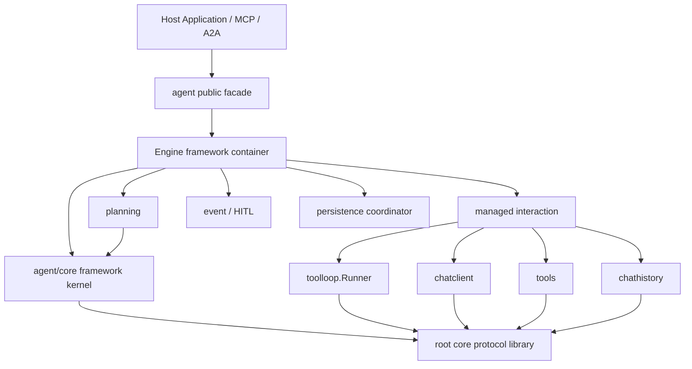
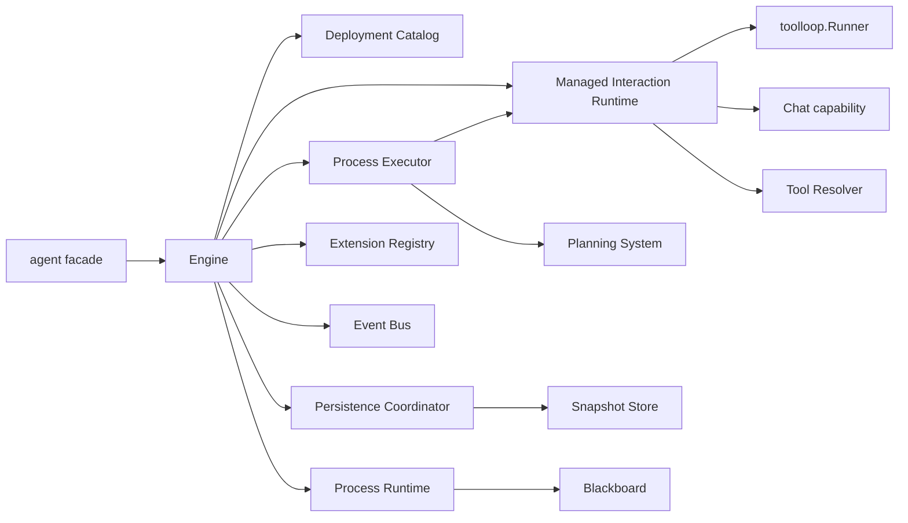
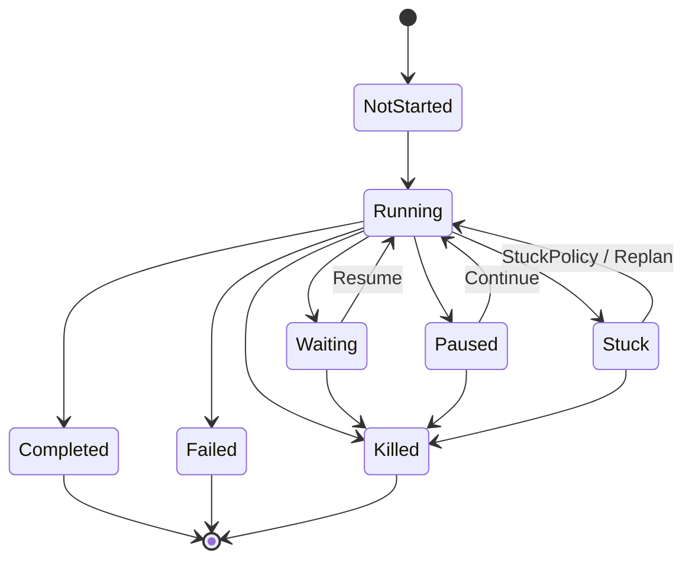
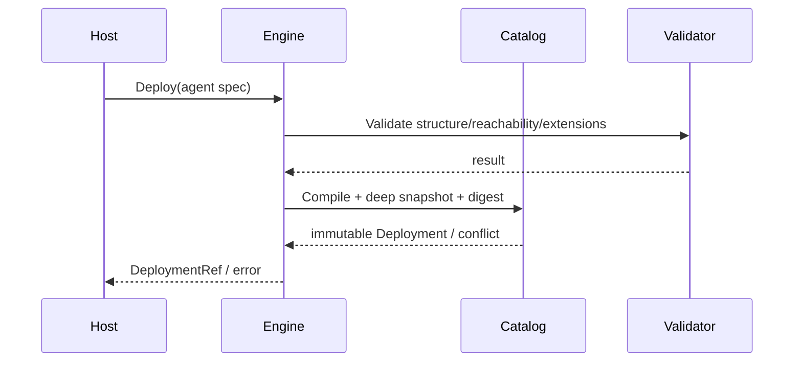
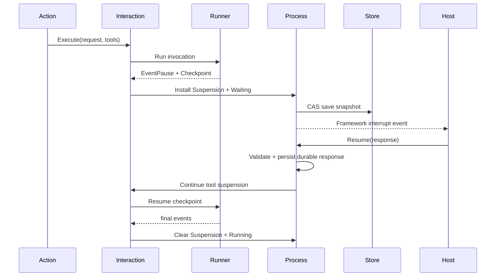

# Agent Framework 架构演进执行计划

> 状态：已完成（P13 Session 生命周期与持久化边界，113/113）
> 建立日期：2026-07-15
> 最后更新：2026-07-17
> 维护者：Lynx 仓库维护者
> 适用范围：`agent`、直接支撑它的基础模块，以及 `app/runtime`、MCP/A2A 等直接消费者
> Core 基线：`8ae840171`（Core 架构计划 73/73 关闭）

本文档是 Agent Framework 后续架构调整的唯一执行基准，负责记录目标定位、边界、目标架构、阶段任务、验收标准、进度、风险和设计决策。实施过程中如果代码便利性与本文冲突，以本文为准；如果事实证明本文的方向不成立，必须先更新第 17 节决策记录，再修改代码。

上位约束是 [`../CLAUDE.md`](../CLAUDE.md)、[`../DESIGN_PHILOSOPHY.md`](../DESIGN_PHILOSOPHY.md) 和 [`../REFACTORING.md`](../REFACTORING.md)。Core 的稳定协议边界以 [`CORE_ARCHITECTURE_EXECUTION_PLAN.md`](./CORE_ARCHITECTURE_EXECUTION_PLAN.md) 与 [`../core/CLAUDE.md`](../core/CLAUDE.md) 为准。本文只规划 Agent Framework，不重新打开已经关闭的 Core 架构重构。

维护者已于 2026-07-16 明确授权 BB-01 至 BB-08、P9 命名/API 收敛与 P10 receiver 深挖的全部 breaking change：直接迁移，不保留兼容层；旧 ProcessSnapshot 按第 12.4.2 节策略丢弃。2026-07-17 又授权 P11 按第一法则直接修正并发、恢复和规划正确性，允许形成并推送开发提交；授权仍不包含 tag、release 或对外部数据库的即时操作。

---

## 1. 背景与问题定义

Lynx Agent 最初移植自 Embabel Agent。移植已经完成了大量 Go 化工作：去掉 Spring 扫描和注解，建立显式 Engine、Planner、Blackboard、Extension、HITL、workflow 和 tool-loop。最近一轮 Core 重构又把 provider-neutral 协议、模型调用 SPI 和运行时控制流彻底分离。

当前问题已经不再是“如何把 Java 代码翻译成 Go”，而是：

> 如何把已经成立的执行原语收拢成一个真正拥有生命周期的 Go Agent Framework，同时继续保持 Core 的库属性、Go 的显式装配和标准库式 API 质量。

目前 Agent 已有可靠的执行内核，但框架所有权还没有闭环：

1. `toolloop.Runner` 已经事件化并支持 checkpoint/resume，框架便利面却把它压缩为 `(string, error)`。
2. `app/runtime` 仍自行编排 Runner、checkpoint、HITL、usage、budget 和 Process 状态。
3. Agent 部署以名称覆盖，ProcessSnapshot 虽记录版本，恢复时却不校验版本或定义摘要。
4. ProcessStore 直接覆盖旧 snapshot，却宣称可用于跨节点恢复。
5. Blackboard 序列化失败会静默丢值，Waiting 恢复还依赖重新执行 action 重建闭包。
6. Action 默认重试 5 次，框架无法证明任意业务 action 幂等。
7. 并发 action 共享写 Blackboard，线程安全不等于结果确定。
8. 根 `agent` 包仍只是薄 convenience surface，最小使用路径需要同时理解 `agent/core` 和 `agent/runtime`。
9. 治理文档仍混用“SDK 库”和“框架”，会让后续重构采用互相冲突的判断标准。

这些不是局部代码味道，而是框架生命周期、持久化真相和公开编程模型尚未统一的问题。

---

## 2. 最新 Core 基线及其对 Agent 的约束

### 2.1 Core 当前事实

截至 `8ae840171`，Core 架构计划已以 73/73 关闭，最终基线是：

- 11 个公共 package；
- 319 行 exported API 基线；
- 47 项 JSON DTO；
- 17 个 wire root；
- 478 行 wire golden；
- 生产代码只依赖标准库和 Core 自身 package；
- Model 默认只保留最小 `Call`，真实流能力使用独立 `Streamer`；
- Request/Response 在 I/O 和 JSON 边界递归校验；
- Metadata/Extensions 必须 JSON-safe；
- Core 不拥有 ChatClient、history、tool runtime、agent control flow、OTel 或 provider SDK。

### 2.2 Agent 必须继承的硬边界

Core 的最终状态对 Agent 形成以下不可逆约束：

- `core/chat.Request` 只持有消息、ToolDefinition、Options 和 JSON-safe Extensions；可执行 Tool、registry、Process 和闭包不得回流。
- `core/chat.Response` 只表达 provider 输出；ToolResult、pause/resume、round、budget 和进程状态不得塞入 Response。
- `chat.Model` 与 `chat.Streamer` 是基础调用能力；默认配置、history、guardrails 和 framework lifecycle 属于外圈。
- `tools.Tool` 只定义可执行工具能力；retry、pause、abort 和普通错误反馈由消费它的 runtime 决定。
- Agent 的 snapshot、deployment、suspension 和 event 是 Agent Framework 自己的协议，不得要求 Core 为它增加专属字段。

### 2.3 Core 在本计划中的变更政策

本计划默认不修改 Core exported API。实施过程中如果发现 Agent 无法在现有 Core 契约上正确实现，必须：

1. 证明问题是所有 Core 消费方都必须遵守的普适契约，而不是 Agent 特有需求；
2. 单独更新 Core API/wire 影响清单；
3. 获得破坏性 Core 变更授权；
4. 重新执行 Core release gate；
5. 同步 Core 的 API baseline、wire golden、migration 和 release docs。

Agent 特有能力默认留在 Agent，不向 Core 倾倒。

---

## 3. 当前能力基线

### 3.1 已经成立的基础

| 能力 | 当前状态 | 事实依据 | 目标处理 |
|---|---|---|---|
| Agent 编程模型 | 已有 | Agent/Action/Goal/Condition/Blackboard | 保留并冻结部署态语义 |
| Planner runtime | 已有 | GOAP、HTN、reactive、utility | 保留策略包和按名选择 |
| Engine 生命周期 | 已有 | Deploy、Run、Continue、Resume、Kill、child process | 保留 Engine 作为框架入口 |
| Extension 微内核 | 已有 | Extension + capability interface + type assertion | 保留单一扩展机制 |
| Event Runner | 已有 | model/tool/pause/resume 六类事件 | 作为托管交互的叶子执行器 |
| Tool checkpoint | 已有 | JSON-safe Checkpoint，pending tool 精确恢复 | 纳入 Process Suspension |
| HITL | 已有 | JSON-safe Suspension、typed Interrupt、Waiting/Resume | 保持 Human/Tool 两类统一恢复协议 |
| workflow | 已有 | Sequence、Parallel、Loop、Supervisor 等编译回 Agent | 保持“组合回核” |
| agent-as-tool/child process | 已有 | Engine 子进程与 tool adapters | 绑定 DeploymentRef 和父子预算 |
| 基础 snapshot | 部分成立 | ProcessSnapshot、ProcessStore、AutoSnapshot | 加强为严格、并发安全的持久化契约 |
| session/history | 已有 | SessionStore、chathistory middleware | 保持为独立外圈能力 |
| OTel | 已有 | runtime/planner/event 直接使用官方 API | 保持 vendor-neutral，不进入根 Core |

### 3.2 当前质量基线

2026-07-15 在 Core 最终调整后重新执行：

```bash
cd agent
go test ./...
go vet ./...

cd app/runtime
go test ./internal/adapter/agentexec
```

以上全部通过。当前基线约为 22 个 `go list ./...` package（含 examples/internal）、231 个 Go 文件和 24,965 行 Go 源码。数字只用于判断变化量，不作为“越少越好”的指标。

### 3.3 当前依赖事实

当前主要依赖方向是：

```text
agent/core       -> core/chat + tools + chatclient + chathistory + OTel
agent/planning   -> agent/core
agent/toolloop   -> core/chat + tools
agent/runtime    -> agent/core + planning + event + toolloop
                   + chatclient + chathistory + tools + OTel
agent/workflow   -> agent/core + agent/runtime
agent facade     -> agent/core + agent/runtime + built-in planners
app/runtime      -> agent facade/runtime/core/toolloop/hitl
```

其中 `agent/toolloop` 保持叶子依赖。`agent/core` 承载编程原语、ProcessContext 和 provider-neutral Chat/Interaction capability；具体 chatclient、history 和 OTel 装配留在 runtime。

---

## 4. 定位决策

### 4.1 一句话定位

> Root Core 是 provider-neutral AI protocol library；Agent 是显式装配、可嵌入、拥有生命周期的 Go Agent Framework；app/runtime 是使用该框架实现产品策略的 Host Application。

### 4.2 本文所说的“Framework”

Agent 只有实际拥有以下职责，才算 Framework：

- 部署和冻结 Agent Definition；
- 为每次运行创建并拥有 Process；
- 驱动 plan → observe → act 的主循环；
- 驱动模型/工具交互并将事件映射到 Process；
- 管理 Waiting/Paused/Resume/Kill 等状态迁移；
- 协调 checkpoint、snapshot、usage、budget 和事件发布；
- 定义扩展生命周期、顺序和 scope；
- 为 Host 提供稳定、可发现的公开编程模型。

Framework 不等于 DI 容器。Lynx Agent 仍必须满足：

- 没有 classpath scan、annotation scan 或反射式 Bean 生命周期；
- 没有全局 Engine 单例，一个进程可创建多个 Engine；
- 所有依赖通过普通构造、config struct、interface 和函数显式装配；
- user action 是普通 Go 函数或实现小接口的普通类型；
- context cancellation、errors、iterator 和并发语义遵守 Go 约定；
- Engine 可以被 CLI、HTTP server、desktop runtime、测试和其他库嵌入。

### 4.3 与“库优先”的关系

“基础能力优先库化”和“Agent 是框架”并不冲突：

- Core、tools、chatclient、chathistory 等提供可独立使用的基础能力；
- toolloop.Runner 仍是可独立使用的叶子执行器；
- Agent Framework 在这些库之上拥有跨能力生命周期；
- 只有必须统一生命周期才能保证正确性的行为进入 Engine；
- 普通转换、provider 适配和产品策略不因“框架化”被吸入 Engine。

### 4.4 对 Embabel 的取舍

继续保留 Embabel 中已经被证明有价值的框架思想：

- AgentPlatform 是有状态部署和运行容器；
- Agent/Engine 都可以形成可组合的 Agent scope；
- Process、child process、HITL、events 和 persistence 由框架统一管理；
- workflow 和 agent-as-tool 复用同一运行模型。

明确不移植：

- Spring classpath/annotation scanning；
- ApplicationContext 和隐式 bean lookup；
- ThreadLocal/current process 作为主要依赖传递方式；
- 巨大的 PlatformServices 构造依赖集合；
- 反射驱动的 action/schema 生命周期；
- 为 Java 继承层次逐一复制 Go interface。

### 4.5 向 Go 标准库和成熟三方库学习什么

- Engine 像 `http.Server`、`sql.DB` 一样成为清晰的主要对象，而不是全局函数集合。
- 常用路径从一个根 package 可发现，高级能力进入具名 subpackage。
- config struct 有可用零值；构造错误返回 error，需要 panic 语义时显式使用 Must。
- `context.Context` 只负责取消、deadline 和 request scope，不进入持久化值。
- 流式使用 `iter.Seq2`，不为异步外观引入无所有者 goroutine/channel。
- interface 在消费方定义并保持最小；公开 SPI 有多实现或真实外部实现需求才成立。
- error 是稳定契约，支持 `errors.Is/As`，不依赖字符串解析。
- 多实例、并发安全、可测试，不使用 package-global registry。
- examples、GoDoc、table-driven contract tests 和 race tests 与 API 同等重要。

---

## 5. 总目标与成功指标

### 5.1 总目标

> 把现有 Agent 执行原语收敛成一个 Engine 托管、定义可冻结、进程可持久化、挂起可精确恢复、扩展可组合、公开 API 可发现的 Go Agent Framework。

### 5.2 成功指标

| 指标 | 当前基线 | 目标状态 |
|---|---|---|
| Core 反向依赖 Agent | 0 | 永久保持 0 |
| app 内通用 ToolLoop 编排 | `turnloop.go` 约 160 行 | 0；应用只保留产品策略和 UI 映射 |
| ToolLoop 事件在框架内可见性 | 便利面只返回 `(string, error)` | model/tool/pause/resume 全部进入 Process/Event/usage/budget |
| Agent 部署身份 | name → mutable pointer | `DeploymentRef{Name, Version, Digest}` → immutable deployment |
| 同名部署 | 静默替换 | 显式 conflict/replace 语义 |
| Snapshot 恢复绑定 | 只检查 AgentName | 精确检查 DeploymentRef；不匹配拒绝或显式 migration |
| ProcessStore 写入 | blind overwrite | revision/CAS；跨节点时另有 claim/lease |
| Blackboard 序列化失败 | 静默丢值 | 返回错误，或只忽略显式 transient 值 |
| Waiting 恢复 | 先 re-tick 重建闭包才能接收响应 | Resume 可直接校验并记录 durable response；下一次 action re-entry 消费响应 |
| Action 默认 retry | 5 次 | 1 次；retry 必须显式且有幂等语义 |
| 并发 Action | 共享写 Blackboard | runtime action 串行；workflow 使用隔离 branch + 稳定 join |
| Process 接口 | 名为 read surface，实际混合读写控制 | 按消费者拆 View/Control/Usage 能力 |
| 常见用户路径 | 需要 agent/core/runtime 三个主要 import | 根 `agent` 门面覆盖 80% 路径 |
| Engine 构造错误 | panic | `NewEngine(...)(*Engine,error)` + `MustNewEngine` |
| 架构术语 | library/framework 混用 | Core library / Agent framework 统一 |

### 5.3 完成定义

只有同时满足以下条件，本计划才可关闭：

- app/runtime 不再实现框架通用的 ToolLoop/HITL/checkpoint 编排；
- paused process 可在进程重启后不重调模型、不重跑已完成工具地恢复；
- deployment drift、snapshot write conflict 和不可序列化状态都显式失败；
- 默认 retry 和并发行为对副作用安全；
- 根 agent 包有完整的标准使用路径；
- 公开 API、snapshot wire、Extension 顺序和并发语义都有自动守卫；
- agent 与直接消费者的 build/vet/test/lint/race 全绿；
- 文档、examples 和代码不再保留旧架构描述或兼容层。

---

## 6. 非目标

本计划明确不做：

- 不把 planner-driven Agent 改造成单一 ReAct runtime；ToolLoop 是 Action 内部交互，不取代 planner。
- 不复制 Spring 的注解、扫描、ApplicationContext、AOP 或自动装配。
- 不建立 `domain/application/infrastructure/repository/service` 目录模板。
- 不为了 DDD 名词完整性创建无独立消费者的新 package 或 interface。
- 不把 provider SDK、模型 catalog、pricing、OAuth 或 tokenizer 塞入 Agent Kernel。
- 不让 Engine 负责产品 System Prompt、UI 文案、桌面事件协议或供应商价格表。
- 不重新实现 chatclient、chathistory、tools 或 Core 已有能力。
- 不把 snapshot 演进成完整 event sourcing 系统；除非未来有真实 replay/audit 需求。
- 不尝试序列化 goroutine、Go 调用栈或任意 closure。普通 Go action 在 HITL 后仍从 action 入口重入；框架只保证重入前缀可通过 durable response/checkpoint 避免重复模型和已完成工具副作用。需要任意位置续跑的 action 必须显式建模为可恢复状态机。
- 不在没有数据的前提下做性能优化或 worker pool。
- 不为旧 Agent API、旧 snapshot 或旧 store contract 长期保留 shim、alias、dual-read/dual-write。
- 不在本计划内发布 Core tag；Agent 发布另走独立 release 决策。

---

## 7. 不可违反的架构约束

### 7.1 依赖方向



反向 import 一律视为架构缺陷：

- Root Core 不 import Agent 或任何 framework module。
- `agent/core` 不 import `agent/runtime`、workflow 或具体 planner。
- planning、event、hitl、toolloop 不 import runtime。
- runtime 不 import root agent façade、workflow、examples 或 app。
- app 可以依赖 Agent，但 Agent 不得知道 Lyra Turn、SSE 或 desktop 类型。

目标上，`agent/core` 应逐步移除对具体 `chatclient`、`chathistory` 和 OTel 的依赖；需要的调用能力由消费方最小接口或 Root Core 能力表达，history 和 instrumentation 由 runtime 装配。该项必须以真实调用点切片实施，不为追求“纯度”机械造接口。

### 7.2 Engine 是框架门面，不是 god object

Engine 对外维持一个连贯入口；对内按职责拥有子系统。判断是否拆分以变化原因和可测试性为准，不以字段数为准。

Engine 可以拥有：

- deployment catalog；
- process registry/runtime；
- executor；
- managed interaction；
- extension registry；
- event multicast；
- persistence coordinator。

Engine 不直接实现每个子系统的全部算法，也不把内部子系统无条件暴露成公共 API。

### 7.3 一个扩展机制

- 公开可插拔能力继续统一实现 `Extension{Name() string}`。
- capability interface 由消费它的 package 定义。
- 多值扩展必须有确定顺序；singleton 扩展必须有明确优先级。
- 稳定构造依赖（ProcessStore、SessionStore、Chat capability）可以留在 EngineConfig，不为“可替换”全部塞进 Extension。
- 不新增与 Extension 重叠的 Plugin/Hook/Advisor/Interceptor 注册体系。

### 7.4 持久化状态必须说真话

- Blackboard 默认代表可恢复的 Process 状态，不允许静默丢弃值。
- 不可持久化对象必须放到 Dependencies、Context 或显式 transient scope，而不是混入 durable Blackboard。
- Snapshot 必须标明 schema、revision、deployment identity 和 suspension。
- 恢复必须精确验证，不以“尽量恢复”掩盖定义漂移。
- 跨节点语义必须由 CAS/lease 证明；否则文档只能宣称单节点重启恢复。

### 7.5 默认不重试任意副作用

- Action 默认只执行一次。
- Provider retry 属于 provider SDK/chat adapter。
- Tool retry 属于明确 ToolMiddleware，并要求调用语义允许。
- Action retry 必须显式配置，并能说明幂等性或补偿语义。
- 不在 action、tool、chatclient、provider 多层同时叠 retry。

### 7.6 并发必须确定

- 锁只解决 race，不解决业务写冲突。
- 默认顺序执行；并发是显式能力。
- 并发 action 必须声明安全条件，或在隔离 snapshot 上产生 patch 后确定提交。
- 冲突必须返回可诊断错误或触发 replan，不允许最后写入者随机获胜。

### 7.7 workflow 必须编译回 Agent

Sequence、Parallel、Loop、Supervisor、routing 等高阶能力最终产生普通 Agent 或调用普通 Engine/Process，不建立第二套 runtime、状态机、event bus 或 persistence。

---

## 8. 目标内部架构

### 8.1 目标组件



### 8.2 Engine 内部职责

#### Deployment Catalog

- 接收可构建的 Agent 描述；
- 执行结构验证、goal reachability 和 AgentValidator；
- 深拷贝或编译成不可变 Deployment；
- 计算稳定 digest；
- 维护 Name/Version/Digest 索引；
- 提供显式 Deploy、Replace、Undeploy 和 Lookup 语义。

#### Process Runtime

- 创建 Process 并绑定 DeploymentRef；
- 持有状态机、Blackboard、父子关系、usage 和 budget；
- 处理 Waiting/Paused/Resume/Kill/terminal gate；
- 暴露只读查询和明确控制能力。

#### Process Executor

- observe world；
- 请求 planner；
- 执行 action；
- 应用 retry/concurrency policy；
- 记录 action history；
- 在 tick 边界检查 termination、budget 和 snapshot。

#### Managed Interaction Runtime

- 构造/接收普通 `chat.Request` 和邻接 ToolResolver；
- 驱动 `toolloop.Runner`；
- 将 toolloop.Event 映射为 process-scoped framework event；
- 记录模型 usage 和工具调用；
- 在模型轮次、工具结果和终态检查 budget；
- 把 pause/HITL 转成 durable Suspension；
- 持久化 checkpoint，并在 resume 时精确继续；
- 为 ProcessContext.Prompt、workflow Supervisor 和 app turn 提供同一条执行路径。

#### Persistence Coordinator

- 统一 capture、validate、save、load 和 restore；
- 维护 schema/revision；
- 执行 deployment rebind 校验；
- 协调 auto snapshot 和 suspension snapshot；
- 将 CAS conflict 暴露给调度者，不吞错继续运行。

### 8.3 包结构策略

本计划不预先建立一组 DDD package。优先保留当前领域命名结构：

```text
agent/
├── facade files          常用类型、构造和 Engine 入口
├── core/                 Framework Kernel：Agent/Action/Goal/Blackboard/稳定 SPI
├── planning/             Planner contract、Planning System、算法
├── toolloop/             可独立复用的 Event Runner
├── event/                Framework event 与 multicast
├── hitl/                 typed interrupt/response helper
├── runtime/              Engine、Deployment、Process、Executor、Interaction、Persistence
├── routing/     基于普通 Engine 的 routing 组合
├── workflow/             编译回普通 Agent 的组合器
└── examples/             当前公开路径的可运行示例
```

Deployment、Interaction、Persistence 先作为 `runtime` 内聚子系统，以具名类型和文件组织。只有在出现独立消费者、可切断依赖且不会形成循环时，才升级为独立 package。DDD 边界先通过所有权和不变量表达，不通过目录仪式表达。

### 8.4 可选集成的位置

- MCP/A2A/HTTP/CLI 是 Host adapter，不进入 `agent/core`。
- 如果某个 adapter 需要 Agent 特有组合，优先放到已有 `mcp`/`a2a` module 或明确的 Agent 外圈 package。
- runtime 可以暴露最小能力让 adapter 组合，但不 import adapter SDK。
- examples 可以依赖集成模块，不能反过来成为生产代码依赖。

---

## 9. 目标领域模型与关键契约

本节 API 形态是方向基准，具体 exported 名称和签名在对应 breaking batch 开始前确认。

### 9.1 Agent 描述、Deployment 与 DeploymentRef

历史 `*core.Agent` 同时扮演 builder 产物、部署定义和运行时引用，且 slice 按引用保存。当前实现已经区分：

```text
Agent Spec/Definition  --Deploy-->  immutable Deployment  --bind-->  Process
```

方向性值对象：

```go
type DeploymentRef struct {
    Name    string
    Version string
    Digest  string
}
```

规则：

- `AgentConfig`/`GoalConfig` 是透明构造输入；`Agent`/`Goal` 构造后只读，caller 修改原 slice 或 accessor 快照不会改写定义。
- Deploy 是编译和冻结边界；Deployment 必须拥有 action/goal/condition 集合的独立快照。
- Digest 覆盖会影响恢复正确性的可序列化定义：action/goal/condition 名称与 schema、planner 选择、关键 policy 等。
- Framework 不能可靠哈希 Go 函数语义或用函数地址代表代码版本；durable deployment 必须要求维护者更新语义 Version，或由 Host 提供稳定 Build/Implementation ID。当前默认 `1.0.0` 不能被当作自动检测实现变化的安全保证。
- Process 永久绑定 DeploymentRef，不通过 mutable `*Agent` 漂移。
- 同名同版本同 digest 的重复 deploy 可以定义为幂等。
- 同名同版本不同 digest 必须冲突。
- Replace 必须显式；旧 Process 仍绑定旧 Deployment，除非执行显式 migration。
- Undeploy 不得让仍在运行或可恢复的 Process 失去定义；需要引用计数、保留历史 Deployment 或明确拒绝。

### 9.2 Process 聚合

Process 是框架主要运行聚合，拥有：

- Process ID、Parent ID、Depth；
- DeploymentRef；
- status 和 terminal gate；
- Blackboard durable state；
- 当前 goal、world state 和 action history；
- usage/budget；
- 当前 Suspension；
- process-scope extensions 和 session binding。

状态机目标：



每个状态迁移必须有：

- 唯一拥有者；
- 明确允许的源状态；
- framework event；
- snapshot 时机；
- 重复调用语义；
- 并发冲突语义。

### 9.3 Managed Interaction

Interaction 不是第二个 Agent runtime，而是 Process 内一次模型/工具交互的托管边界。

输入包含：

- `chat.Request`；
- 邻接 ToolResolver/Registry；
- process identity；
- max rounds/budget policy；
- streaming/observation hooks；
- 可选 resume payload。

输出不是简单字符串，而是由 framework 消费的事件序列和终态：

```text
model_request
model_response
tool_call
tool_result
pause / suspension
resume
final
```

`toolloop.Event` 保持唯一的 ToolLoop 协议；Managed Interaction 不复制一份同义 Event，而是增加 Process ID、DeploymentRef、usage、timestamp 等 framework context，并发布对应的 framework lifecycle event。

### 9.4 Suspension

当前 ToolLoop Checkpoint 与 ProcessSnapshot 分离是正确的领域划分，错误在于组合责任留给 app。目标使用一个 Process 级 envelope：

```go
type Suspension struct {
    ID            string
    Kind          string
    SchemaVersion int
    Prompt        json.RawMessage
    ResumeSchema  json.RawMessage
    Payload       json.RawMessage
}
```

具体字段以实现批次为准，但必须满足：

- 完全 JSON-safe；
- 能表达 approval、question、typed gather 和 tool pause；
- 能携带或引用 ToolLoop Checkpoint；
- resume input 不限制为 string，应支持受 schema 约束的 JSON 值；
- 不持有闭包、ToolResolver、Process 指针或任意 app 对象；
- Waiting snapshot 直接携带 JSON-safe Suspension；Resume 不要求先 re-tick 一次重建 handler；
- HITL Interrupt 与 ToolLoop Pause 使用同一个挂起模型，不通过 Blackboard 暂存 executable continuation。

Suspension 不承诺恢复任意 Go 调用栈。普通 typed HITL 的恢复顺序是：Resume 直接验证并持久化 response，然后 Continue 从 action 入口重入，`Interrupt` 在同一 stable ID 处读取 durable response。ToolLoop 场景则由 Checkpoint 跳过模型轮次和已完成工具，避免重放有副作用的交互前缀。

### 9.5 Snapshot 与 Store

目标 ProcessSnapshot 至少包含：

- SchemaVersion；
- Revision；
- Process identity/tree；
- DeploymentRef；
- status/goal/history/usage；
- strict Blackboard snapshot；
- Suspension；
- captured timestamp。

Store 能力按消费者拆分，方向性接口为：

```go
type SnapshotReader interface {
    Load(context.Context, string) (ProcessSnapshot, error)
}

type SnapshotWriter interface {
    Save(context.Context, ProcessSnapshot) error
}
```

`ProcessSnapshot.Revision` 表示 expected revision；成功提交持久化为下一 revision。Delete、
List、Claim/Lease 只在有真实消费者时作为独立能力加入，不强迫所有 store 实现管理面功能。

跨节点恢复需要额外满足：

- 同一 Process 同一时刻只有一个 owner；
- owner 有可过期 lease 或等价 fencing token；
- 每次 save 使用 revision/fencing token；
- lease 丢失后旧 worker 不得继续提交状态。

在这些能力完成前，公开文档只承诺单节点重启恢复，不承诺 cross-node handoff。

### 9.6 Blackboard durable/transient 语义

目标规则：

- 普通 Blackboard binding 默认 durable；
- durable 值无法编码时 Snapshot 返回错误；
- runtime dependency、client、function、reader、cancel func 等只进入 ProcessContext/Dependencies；
- 如果确有 transient state 需求，必须通过显式 API 标记，并在 restore contract 中说明缺失后的行为；
- 不允许“marshal 失败就变 nil”的隐式降级；
- restore 时未知类型或 decode 失败必须返回可诊断错误，不静默退化成错误形状的 `map[string]any` 后继续执行 typed action。

### 9.7 ProcessContext 能力

当前 `Process` 被称为 read surface，但混合了查询、Terminate、Suspend、usage record 等写操作。目标按真实消费者拆分：

- `ProcessView`：ID、status、goal、usage、history、blackboard read；
- `ProcessControl`：terminate、await/suspend、tool cancellation；
- `UsageRecorder`：LLM/embedding usage；
- `ActionContext`/`ProcessContext`：组合 action 真正需要的能力；
- listener、condition、policy 只接收它们需要的最小 view。

不要求每个接口都成为新 package，也不为单一内部调用机械抽象。拆分的目标是避免所有消费者被迫获得控制能力，并让 app adapter 可依赖窄能力。

### 9.8 Dependency scope

Dependency registry 在 framework 中有真实用途：动态 Agent、声明式 action 和 host-injected domain dependency 不能总靠闭包捕获。但当前 string key + `any` 仍需约束。

目标方向：

- Engine scope → Process scope → Action scope 分层查找；
- typed key/helper，类型不匹配返回明确错误；
- Engine 启动或首次运行后冻结 platform registrations；
- runtime-owned service 使用显式 typed field，不全塞进 registry；
- 普通静态 action 仍优先通过闭包/struct 字段注入；
- Dependency scope 不成为隐式全局 DI 容器。

### 9.9 Engine 构造

目标 API 采用 config struct，不增加 fluent builder：

```go
func NewEngine(EngineConfig) (*Engine, error)
func MustNewEngine(EngineConfig) *Engine
```

- 动态配置错误通过 error 返回；
- `MustNewEngine` 只服务编译期/启动期固定装配；
- zero config 继续提供合理 defaults；
- 默认 planner 的装配仍在根 agent composition root；
- config validation 必须原子完成，构造失败不返回半初始化 Engine。

---

## 10. 关键端到端流程

### 10.1 部署流程



定义构造后，调用方修改原 config/slice 或 accessor 返回值不得改变 Agent/Goal；部署完成后，外部 Action/Condition SPI 的 metadata 改动也不得改变 Deployment。

### 10.2 普通执行流程

```text
Engine.Run
  -> bind DeploymentRef
  -> create Process + Blackboard
  -> observe world
  -> plan
  -> execute Action
  -> Action invokes Managed Interaction when needed
  -> publish events / record usage / enforce budget
  -> apply output to Blackboard
  -> snapshot at configured boundary
  -> re-observe or terminate
```

### 10.3 Tool/HITL 挂起与恢复



恢复必须保证：

- 不重新调用已经产生 checkpoint 的模型轮次；
- 不重跑 checkpoint 中已完成的工具；
- resume ID 和 schema 匹配；
- tool set/deployment digest 未漂移；
- snapshot revision 仍由当前 owner 持有。

对不在 ToolLoop 内的普通 typed HITL，框架保证 Resume 不需要一次额外的“重建 closure tick”；Continue 仍从普通 Go action 入口重入。action 在 interrupt 之前的前缀必须无副作用、幂等，或自行使用 Blackboard 状态跳过已完成步骤。

#### 10.3.1 崩溃、挂起与重试矩阵

| 边界 | Framework 行为 | 恢复/重试保证 |
|---|---|---|
| 首个 model response 前失败或取消 | 尚无可观察模型结果 | 可由显式 Action retry 重新进入；在 model request observer 取消时不会调用 provider |
| model response 已产生 | 先记录 framework usage，再发布完整边界 | 后续错误带 `interaction.ErrCommitted`，禁止整 Action retry，避免重复计费 |
| ToolLoop 发出 pause | Checkpoint 保存 request、response、已完成 results、pending call、round policy 和 toolset digest；Suspension envelope 额外绑定 owner 与 DeploymentRef | JSON snapshot 可在新 Engine 精确恢复；模型轮次和已完成工具不重跑 |
| `Resume` 记录回答 | 校验 process 状态、Suspension ID 和 JSON Schema | 相同回答幂等；不同回答 conflict；过期 ID stale；未回答不能 Continue |
| pending tool 返回 result | 清除已消费的 responded Suspension，并把 tool result 视为已提交边界 | 后续错误禁止整 Action retry；旧 checkpoint 不可再次执行 |
| 任意外部工具副作用完成、但结果边界尚未持久化时宿主硬崩溃 | Framework 无法与任意外部系统建立原子事务 | 不承诺 exactly-once；有副作用的工具必须使用业务幂等键、事务或补偿。Framework 只承诺 checkpoint 内已确认步骤不重放 |

取消、observer early-stop、pause/resume 事件顺序和跨 JSON snapshot 的恢复均由 P2 contract/integration tests 锁定。P3 在此基础上增加 snapshot revision、CAS 和 owner/fencing，不回退上述边界语义。

### 10.4 应用与框架的最终分工

| 关注点 | Framework | Host Application |
|---|---|---|
| Agent deploy/process lifecycle | 拥有 | 调用、展示、授权 |
| ToolLoop Run/Resume/checkpoint | 拥有 | 不自行编排 |
| Process waiting/pause | 拥有 | 收集用户响应 |
| usage 原始记录 | 拥有 | 提供可选 pricing policy |
| budget enforcement | 拥有通用边界 | 提供产品额度/套餐值 |
| System Prompt | 不拥有 | 拥有 |
| UI reasoning/message delta | 发布通用事件 | 映射为产品协议 |
| provider pricing catalog | 通过可选 port 消费 | 拥有具体实现 |
| idle timeout | 提供取消边界 | 决定产品 policy |
| SSE/desktop event | 不知道 | 拥有 |
| tool approval policy | 提供 HITL/Suspension 机制 | 决定哪些工具需批准 |

---

## 11. 当前职责迁移表

| 当前实现 | 当前问题 | 目标所有者 | 迁移结果 |
|---|---|---|---|
| `runtime.runInteraction` | 消费 leaf Runner 完整事件并投影稳定 framework boundary | Managed Interaction | 返回完整 terminal event/stop reason/Suspension |
| `core.InteractionRunner` | process-aware port | ProcessContext capability | request、resolver、limits、observer、attribution 显式输入 |
| app `agentexec.runTurn` | 构造 request、observer 和 pricing attribution | Host adapter | 不创建 Runner、不保存 checkpoint、不累计 framework usage |
| Process Suspension payload | Tool checkpoint 与 owner/deployment identity 的 opaque envelope | Persistence Coordinator | Suspension 已纳入 ProcessSnapshot |
| app interrupt projection | 将 Suspension prompt 映射成产品 approval/question | Host delivery | 不保存 executable callback 或框架 continuation |
| name-keyed agentRegistry | redeploy 漂移 | Deployment Catalog | DeploymentRef + explicit replace |
| Restore 只按 AgentName | 版本字段形同虚设 | Persistence Coordinator | 精确 DeploymentRef 校验 |
| Snapshot 返回值、tagValue 吞错 | 状态损坏不可见 | Snapshot capture | 返回 error，显式 transient |
| ProcessStore.Save overwrite | lost update | Store contract | revision/CAS |
| Waiting re-tick 重建 closure | 响应前必须先重跑 action | Suspension | Resume 直接记录 durable response；Continue 再从 action 入口重入 |
| DefaultActionQoS=5 | 任意副作用被隐式重试 | Executor policy | `RetryPolicy` 默认 1；显式 safety |
| tickConcurrent 共享 Blackboard | 业务冲突非确定 | Executor/Blackboard | 删除 process-wide 并发；结构化 branch 隔离后稳定 join |
| Process 胖接口 | listener/action 都拿控制权 | agent/core | capability split |
| string-key Dependencies | 弱类型且可随时变更 | Engine dependency scope | typed/hierarchical/frozen |
| root agent 薄 façade | 入门需三包 | root agent | 常用 API 单门面 |
| NewEngine panic | 动态配置难处理 | root agent/runtime | error + Must variant |
| runtime 内 history convenience | 内核与具体外圈耦合 | runtime composition | 保留装配，kernel 只见最小能力 |

---

## 12. 公开 API 演进策略

### 12.1 根 agent 包是标准入口

根包最终应覆盖：

- Agent/Action/Goal/Condition 的常用构造；
- Engine/EngineConfig；
- ProcessOptions、Process/Result 常用类型；
- status、sentinel error；
- built-in GOAP/reactive defaults；
- 常见 Run/Deploy/Resume 路径。

高级消费者继续显式导入：

- `planning` 和具体 planner；
- `workflow`；
- `toolloop`；
- `hitl`；
- `event`；
- routing。

门面可以通过 type alias/re-export 提升可发现性，内部仍维持 package DAG。不能复制类型或维护两份 enum。

### 12.2 不承诺立即重命名 agent/core

`agent/core` 当前已有大量公开消费者。目标先通过根 façade 降低普通用户对它的直接依赖，再判断是否值得重命名为 kernel 或逐步 internalize。仅为了术语漂亮进行 package path 迁移不成立。

### 12.3 Breaking 策略

项目仍处 pre-1.0，批准后的 breaking batch 直接切换：

- 不保留 deprecated wrapper；
- 不建立 v1/v2 双类型；
- 不兼容读取错误语义的旧 snapshot；
- 同一批迁移全部 workspace consumer；
- 每批保持 workspace 可构建和可测试；
- 每批一个独立可回滚 commit。

但进入每个 breaking batch 前，必须列明：

- exported symbol 变化；
- snapshot/store wire 变化；
- agent/app/MCP/A2A 消费文件；
- 数据丢弃或一次性迁移策略；
- 推荐方案和备选方案；
- 验证命令。

### 12.4 P0-08 Breaking Batch 裁决单

状态：**已批准并完成（2026-07-16）**。维护者授权 BB-01 至 BB-08 全部 breaking change；不为旧 API 增加 deprecated wrapper、双写 wire 或兼容读取分支。若后续证据推翻某项决策，必须先回到本节和第 17 节更新 ADR。

#### BB-01：Agent、Deployment 与 DeploymentRef 命名

已采用并实现：

- 保留 `core.Agent`，它表示可构建、可验证、尚未部署的 Agent 描述；不为术语纯度把它整体重命名成 `AgentSpec`。
- 在 `agent/core` 增加纯值对象 `DeploymentRef`，因为 Process、Snapshot、Event 都需要它，而 `core` 不能反向依赖 `runtime`。
- 在 `agent/runtime` 增加不可变 `Deployment`；它拥有 deploy-time deep snapshot，公开只读 accessor，不暴露内部 slice/map。
- `Engine.Deploy` 返回 Deployment handle；Process 只持有 `DeploymentRef` 和内部 Deployment 引用，不再持有会随同名 redeploy 漂移的 caller `*core.Agent`。
- 首次部署用 `Deploy`；替换 active deployment 必须显式调用 `Replace`。同 ref 重复部署幂等；同 name/version 不同 digest 返回 `ErrDeploymentConflict`。
- `Undeploy` 只取消 active 路由，历史 Deployment 继续留在 catalog，保证已存在 Process 和可恢复 Snapshot 仍能按 ref 解析。真正清理历史定义是以后有真实管理面消费者时再增加的独立能力。

目标公开形态：

```go
// agent/core
type DeploymentRef struct {
    Name    string `json:"name"`
    Version string `json:"version"`
    Digest  string `json:"digest"`
}

// agent/runtime
type Deployment struct { /* opaque immutable state */ }
func (d *Deployment) Ref() core.DeploymentRef

func (p *Engine) Deploy(*core.Agent) (*Deployment, error)
func (p *Engine) Replace(*core.Agent) (*Deployment, error)
func (p *Engine) ActiveDeployment(name string) (*Deployment, bool)
func (p *Engine) Deployment(ref core.DeploymentRef) (*Deployment, bool)
func (p *Engine) Deployments() []*Deployment
func (p *Engine) Undeploy(name string) error
```

删除/替换的旧面：`Agents() []*core.Agent`、`FindAgent(string) (*core.Agent, bool)`，以及 `Deploy(*core.Agent) error`。内部 agent-as-tool、child、session dispatch 和 restore 统一经 Deployment catalog 查找。

备选但不采用：

- 把 `core.Agent` 重命名成 `AgentSpec`：会制造大面积 package API 迁移，但不会额外强化 deploy-time freeze。
- 只给现有 `*core.Agent` 增加 digest：仍无法阻止 caller 修改 slice/map，也无法保存同名历史定义。
- 让 `DeploymentRef` 位于 runtime：会迫使 `core.ProcessSnapshot` 依赖外层或复制第二个 wire DTO。

#### BB-02：Engine 构造与配置错误

推荐并拟采用：

```go
// agent/runtime
func NewEngine(EngineConfig) (*Engine, error)
func MustNewEngine(EngineConfig) *Engine

// 根 agent façade，继续注入默认 GOAP/reactive planner
func NewEngine(runtime.EngineConfig) (*runtime.Engine, error)
func MustNewEngine(runtime.EngineConfig) *runtime.Engine
```

- nil、空名、重复 Extension，非法持久化组合和未来的 lifecycle 配置均通过 error 返回。
- 构造先验证并编译完整 config，再发布 Engine；失败时不返回半初始化对象。
- `MustNewEngine` 只用于测试、example 和启动期固定装配，panic 内容保留原始 error。
- 不引入 Engine fluent builder，也不接受 `*EngineConfig`；zero value config 继续有效。

备选但不采用：保留 panic-only `NewEngine`。它让动态 Host 配置无法以普通 error 处理，也会把未来更多验证错误塞进 panic。

#### BB-03：Deployment digest 与实现身份

推荐并拟采用：

- digest 使用版本化 canonical encoding，覆盖 planner、action/goal/condition 名称与 schema、pre/effect、retry/concurrency policy、tool requirement 等影响恢复的声明式定义。
- map key 排序；slice 保留有语义的顺序；不包含函数地址、pointer 地址、注册顺序噪声或时间戳。
- `EngineConfig` 增加稳定 `BuildID string`。durable Engine（配置 ProcessStore）要求每个 Agent 显式 Version，或 Host 提供非空 BuildID；二者至少一个成立。
- `core.Agent.Version == nil` 明确表示 caller 未提供语义版本；不再伪造默认 `1.0.0`，因此无需第二个隐藏布尔状态，DeploymentRef 中对应 Version 为空。
- BuildID 进入 digest 输入；显式 Version 进入 `DeploymentRef.Version`。维护者若只用 Version 标识实现，就必须在实现语义变化时 bump Version。

备选但不采用：哈希 Go 函数指针或反射出来的函数名。它们既不能表达闭包捕获，也不能保证重编译/跨进程稳定。

#### BB-04：Snapshot v1、严格序列化与 ProcessStore CAS

推荐并拟采用：

```go
type ProcessSnapshot struct {
    SchemaVersion uint16      `json:"schema_version"`
    Revision      uint64      `json:"revision"`
    ID            string      `json:"id"`
    ParentID      string      `json:"parent_id,omitempty"`
    Depth         int         `json:"depth,omitempty"`
    Deployment    DeploymentRef    `json:"deployment"`
    // status/goal/history/usage/blackboard...
    Suspension    *Suspension `json:"suspension,omitempty"`
    CapturedAt    time.Time   `json:"captured_at"`
}

type SnapshotReader interface {
    Load(context.Context, string) (ProcessSnapshot, error)
}

type SnapshotWriter interface {
    Save(context.Context, ProcessSnapshot) error
}

type ProcessStore interface {
    SnapshotReader
    SnapshotWriter
}

type SnapshotDeleter interface {
    Delete(context.Context, string) error
}

type SnapshotLister interface {
    List(context.Context) ([]string, error)
}
```

- `ProcessSnapshot.Revision` 是 `Save` 的 expected revision；新记录从 revision=0 写入 revision=1。
  冲突返回可 `errors.Is(err, ErrRevisionConflict)` 且可 `errors.As` 取得 expected/actual 的 typed error。
- `Process.Snapshot()` 改为 `(core.ProcessSnapshot, error)`；无法编码 durable Blackboard、未知 tagged type、无效 Suspension 或不一致 DeploymentRef 时直接失败。
- `Engine.Save` 返回新 revision；Process 在成功 CAS 后原子更新本地 revision。AutoSnapshot 不能吞掉持久化错误并继续宣称 durable。
- `Delete/List` 不再强迫所有 runtime store 实现；Engine 只依赖 reader/writer，管理面按需断言窄能力。
- snapshot v2 的 status 使用稳定字符串；`ModelCall`、`EmbeddingCall`、`Session` 全部使用显式 snake_case JSON tag；usage ledger 存储当前 Process 的直接值，恢复后再按父子关系聚合。
- 缺失/未知 `schema_version` 直接返回 `ErrSnapshotSchema`，不猜测旧格式。

旧数据策略：不兼容读取当前无版本 snapshot。Agent InMemory store 直接清空；app SQLite 迁移只丢弃 `process_snapshots`，保留 Session、消息和 terminal Run 历史。依赖旧 snapshot 的 non-terminal Run 标记为失败/中止并记录 `snapshot_schema_incompatible`，不得删除整个应用数据库。

备选但不采用：

- 在 `ProcessSnapshot.Revision` 已有 revision 时仍让 Store 从 snapshot 自行推测 expected revision：无法区分 caller 的读取版本与拟写入版本，容易丢失更新。
- 继续让 `ProcessStore` 强制 Delete/List：远程 KV/append-only store 会被迫伪造管理能力。
- 为 schema=0 写兼容 reader：当前格式本身包含静默丢 Blackboard、定义漂移和 closure 重建问题，兼容会延长错误语义。

#### BB-05：统一 Suspension 与恢复 API

推荐并拟采用：

```go
type SuspensionKind string

const (
    SuspensionHuman SuspensionKind = "human"
    SuspensionTool  SuspensionKind = "tool"
)

type Suspension struct {
    SchemaVersion uint16          `json:"schema_version"`
    ID            string          `json:"id"`
    Kind          SuspensionKind  `json:"kind"`
    Prompt        json.RawMessage `json:"prompt,omitempty"`
    ResumeSchema  json.RawMessage `json:"resume_schema,omitempty"`
    Payload       json.RawMessage `json:"payload,omitempty"`
    Response      json.RawMessage `json:"response,omitempty"`
    CreatedAt     time.Time       `json:"created_at"`
    RespondedAt   time.Time       `json:"responded_at,omitempty"`
}

func (p *Process) Suspension() *core.Suspension
func (p *Engine) Resume(processID, suspensionID string, response any) error
```

- `Payload` 对 human suspension 保存 typed gather 所需数据，对 tool suspension 保存版本化 ToolLoop Checkpoint；resolver、closure、Process pointer 不进入 wire。
- Resume 校验 process 状态、stable suspension ID、response schema 和重复响应。相同响应幂等；不同的第二次响应返回 `ErrSuspensionConflict`；过期 ID 返回 `ErrSuspensionStale`。
- Resume 只持久化 response 并把 Process 变为可继续状态，不执行任意业务 handler。Host 再调用 Continue；普通 HITL action 从入口重入，`hitl.Interrupt[R]` 在同一 ID 读取并解码 durable response。
- ToolLoop 恢复由 Checkpoint v2 的 `CallStates` / `NextResult` 跳过 model 和已完成工具；
  toolset/deployment/policy digest 不匹配时拒绝。
- Suspension 只携带 JSON-safe data，不允许 callback、handler、Process pointer 或其他 executable state。
- `ProcessWaiting` event 携带 Suspension；app 不使用 Blackboard key 保存 checkpoint 或 continuation error。

备选但不采用：把 ToolLoop Checkpoint 直接摊平进 ProcessSnapshot。这样会把 tool protocol 字段固定到 Process 聚合，并阻止未来其他 Suspension kind 复用 envelope。

#### BB-06：Process capability split

推荐并拟采用：

```go
type ProcessView interface {
    ID() string
    ParentID() string
    Deployment() DeploymentRef
    StartedAt() time.Time
    Status() ProcessStatus
    Goal() *Goal
    Blackboard() BlackboardReader
    Failure() error
    Suspension() *interaction.Suspension
    WorldState() WorldState
    Usage() (cost float64, tokens int, actions int)
    ModelCalls() []ModelCall
    EmbeddingCalls() []EmbeddingCall
}

type ProcessControl interface {
    TerminateAgent(string)
    TerminateAction(string)
    TerminateToolCall()
    Suspend(context.Context, interaction.Suspension) (ActionStatus, error)
}

type UsageRecorder interface {
    RecordUsage(context.Context, float64, int) error
    RecordModelCall(context.Context, ModelCall) error
    RecordEmbeddingCall(context.Context, EmbeddingCall) error
}
```

- 删除名不副实的宽 `core.Process`。Condition、listener、GoalApprover、ToolMiddleware、StopPolicy 和 `ChatProvider` 只接收 `ProcessView`。
- `ProcessContext` 显式组合 View、私有 Control/Usage、可写 Blackboard 和 action-local services；action 仍只接收一个 `*ProcessContext`，不会把多个能力参数散落到每个函数签名。
- consumer 审计证明 ambient context 只有只读需求，因此只保留 `WithProcessView` / `ProcessViewFrom`；Control 和 Usage 不进入 context，也不增加无消费者的 `ProcessControlFrom` / `UsageRecorderFrom`。
- 删除 `ProcessContext.Options` 和 `Process.Options()`；action 只能取得不可变 `SessionInfo`，Lyra observer 等 Host runtime dependency 通过 typed process dependency 注入。Blackboard 写入继续通过 ProcessContext 的 action surface。

备选但不采用：保留 `Process` 作为三个接口的匿名组合。那只会新增名字，不会阻止 listener/policy 继续获得控制和写能力。

#### BB-07：Action retry 命名与默认值

已采用并实现：

```go
type RetryPolicy struct {
    MaxAttempts int
    BaseDelay   time.Duration
    MaxDelay    time.Duration
    Safety      RetrySafety
}

func DefaultRetryPolicy() RetryPolicy // MaxAttempts == 1

type ActionConfig struct {
    // ...
    Retry RetryPolicy
}
```

- 删除含糊的 `ActionQoS`、`ActionConfig.QoS`、`ActionMetadata.QoS` 和 `DefaultActionQoS`；它们目前只表达 retry，不是通用 QoS。
- zero RetryPolicy 和默认策略都只执行 1 次。显式 `MaxAttempts > 1` 才启用 retry；非法负数或 delay 组合在 deploy compile 阶段报错。
- Waiting、Paused、replan、context cancel、panic 和明确 termination 永不 retry；只有普通 ActionFailed/error 进入显式 retry。
- 不引入 transient/permanent error 类型体系。`MaxAttempts > 1` 必须选择 `RetrySafetyIdempotent` 或 `RetrySafetyCompensated`，否则 deploy 拒绝。

app 当前两个 LLM action 已显式 `MaxAttempts:1`，迁移后可删除冗余配置；只有 retry contract test 显式使用 3 次。

备选但不采用：只把 `DefaultActionQoS` 从 5 改成 1 而保留 QoS 命名。行为风险会消失，但公开模型仍错误暗示它承载更广泛质量策略。

#### BB-08：并发执行语义

已裁决并实现：不提供 process-wide candidate-action 并发。删除 `ProcessType`、
`ProcessSequential`、`ProcessConcurrent` 和 `tickConcurrent`；planner 的 action 序列由 runtime
稳定串行执行。仓库审计确认 app 与其他生产消费者均未使用该能力，因此不为零消费者建立
`ParallelSafe` 声明或 Blackboard patch/commit 事务系统。

并发只通过 workflow 的结构化 fan-out 和独立 child Process 表达：

- `ScatterGather` / `Consensus` / `Parallel` 在 fan-out 前为每个 branch 预建 Blackboard 与 Service 子作用域；同 key、同 type artifact 和 condition 写入只存在于 branch，永不提交到父 action。
- branch 结果写入预分配 index，join 永远按声明顺序，不按 goroutine 完成顺序。
- branch 的 Suspend、Terminate 和 framework-managed Interact 返回 `ErrParallelBranchControl`；需要独立控制生命周期时必须创建 child Process。
- errgroup 首错取消其余 branch，并等待全部退出后才返回；channel barrier 与 race 测试证明无 sleep-based 猜测和 goroutine 遗留。

如果未来出现必须并行提交多个 planner action 的真实消费者，必须以新 ADR 证明需求，再选择
完整 snapshot/patch + deterministic commit；不得恢复共享 Blackboard 的 last-writer-wins。

#### 12.4.1 Workspace 迁移影响

基于 2026-07-16 的仓库检索，影响面如下；数字是包含引用的 Go 文件数，不等于调用次数：

| 契约 | Agent | app/runtime | MCP/A2A | 主要生产迁移点 |
|---|---:|---:|---:|---|
| `NewEngine` 返回 error | 38 | 1 | 0 | 5 个 agent example；`agentexec/chat_pipeline.go`；其余主要为 Agent tests |
| Deployment API | 28 | 1 | 0 | 5 个 agent example；`agentexec/engine.go`；agent-as-tool/child/session 内部 catalog |
| ProcessSnapshot/Store | 6 | 9 | 0 | Agent InMemory store/runtime；app `agentexec` fixture/HITL；SQLite process/runs/bootstrap tests |
| Suspension/Resume | 多个 core/runtime/hitl/event 文件 | 11 个 agentexec 文件 | 0 | `agentexec/hitl.go`、turn/turnrun/turnprocess、agent_runtime port、observer |
| Process capability | 17 | 4 | 0 | Agent extension SPI；app HITL/observer/turnctx/turnrun |
| Retry rename/default | 7 | 1 | 0 | Agent action config/executor；app 两个显式 no-retry action |
| 并发策略 | 8 | 0 | 0 | Agent executor/tests；blog example 注释/显式 sequential |

MCP 和 A2A module 当前没有直接 import Agent Framework，因此没有生产编译迁移；`agent/examples/mcpagent` 作为 example 跟随 Engine/Deployment 新签名。后续 adapter contract test 仍需证明 MCP tool 暴露、child Agent 和 Suspension 不泄漏 runtime pointer。

app SQLite 的重点不是简单改接口：`ProcessStore.Save` 必须使用单条原子 CAS SQL；旧 snapshot 的处置必须只影响 process snapshot/non-terminal run，不能借 schema bump 清空 Session 或其他历史数据。

#### 12.4.2 Batch 顺序、数据政策与验证

| 批次 | 覆盖决策 | 数据变化 | 最低验证 |
|---|---|---|---|
| B1 Deployment/Engine | BB-01、BB-02、BB-03 | ProcessSnapshot 身份直接切换为 Deployment DeploymentRef；本批不操作外部数据库，旧 row 不兼容并在 B3 定向丢弃 | Agent unit/arch/race；5 examples build；app agentexec test |
| B2 Interaction/Suspension | BB-05 | 新 Suspension 只先在内存和新 snapshot shape 中使用 | ToolLoop protocol、HITL、crash/resume integration；app turn contract |
| B3 Snapshot/Store | BB-04 | 启用 snapshot v1；旧 process snapshot 丢弃；相关 non-terminal run 终止 | Agent wire/store contract/race；SQLite CAS/迁移/recovery tests |
| B4 Action/Process | BB-06、BB-07、BB-08 | 无 wire 数据迁移，API 和默认行为 breaking | Agent unit/race；default side-effect once；并发 determinism；app adapter tests |
| B5 Façade/Consumers | 第 P5/P6 阶段已接受方向 | 删除旧 API 和 app 临时编排 | workspace direct-consumer build/vet/test/race；examples |

维护者确认口径：批准 BB-01 至 BB-08 即表示同时批准上述 exported API 直接切换、snapshot v1 数据政策和同一 workspace consumer 迁移；不包含 git push、tag、release 或外部数据库的即时执行。

---

## 13. 执行策略

### 13.1 总体顺序


顺序理由：

1. 先冻结 DeploymentRef，后续 snapshot 和 interaction checkpoint 才有稳定身份。
2. Managed Interaction 先建立框架托管路径，Durable Process 再把它持久化。
3. retry/concurrency/Process capability 在生命周期闭环后调整，避免同时改变过多轴。
4. façade 在核心语义稳定后收口，避免重复暴露过渡 API。
5. app 最终迁移证明框架边界成立，再删除旧面。

### 13.2 提交纪律

- 每个任务开始前记录 scope、影响面、是否 breaking 和验证命令。
- 每个逻辑批次一个 commit，不混入无关格式化。
- 先写不变量测试，再改实现，再迁消费者，最后删旧面。
- 任务只有代码、测试、文档和消费者全部完成后才能勾选。
- 不因为测试绿就自动扩大 scope。
- 遇到设计不成立时停止扩散，先写 ADR/决策更新。
- 未经明确授权，不创建 tag、release、PR 或推送架构批次。

### 13.3 进度状态

任务只使用：`未开始`、`进行中`、`阻塞`、`完成`、`取消`。

- `完成`：实现、测试、消费迁移和文档全部满足验收。
- `阻塞`：必须记录阻塞原因、已尝试方案和解除条件。
- `取消`：必须记录为什么目标不再成立，不能直接删除历史。

---

## 14. 分阶段任务与验收标准

### P0：基线、治理与破坏性决策

目标：在修改 Framework exported API 和 snapshot wire 前建立可复现事实、安全网和决策门。

- [x] **P0-01 重新确认 Core 最终基线**（完成：2026-07-15）
  - Core 计划 73/73；11 package、319 API 行、47 DTO、17 wire root、478 golden。
  - 确认 Agent 不得向 Core 回灌控制流或 runtime object。
- [x] **P0-02 完成 Agent 当前结构审计**（完成：2026-07-15）
  - 检查 facade、core、planning、runtime、event、hitl、toolloop、workflow、routing。
  - 记录当前 package、依赖和主要生命周期。
- [x] **P0-03 完成 app/agentexec 边界审计**（完成：2026-07-15）
  - 确认 Runner/checkpoint/HITL/usage/budget 的通用编排仍泄漏在 app。
- [x] **P0-04 建立本执行计划**（完成：2026-07-15）
  - 记录目标、阶段、进度、风险、ADR 和验收。
- [x] **P0-05 固化当前测试基线**（完成：2026-07-15）
  - `agent` 的 `go test ./...`、`go vet ./...` 全绿。
  - `app/runtime/internal/adapter/agentexec` 测试全绿。
- [x] **P0-06 统一 framework/library 治理术语**（完成：2026-07-15）
  - Core 是协议库；Agent 是显式生命周期框架；基础能力继续优先库化。
  - 同步根设计哲学、Agent CLAUDE、文档索引和架构测试说明。
- [x] **P0-07 建立 Agent exported API 与 wire baseline**（完成：2026-07-16）
  - 导出根 agent、agent/core、runtime、toolloop、hitl、event 的公共 API。
  - 为 ProcessSnapshot、ToolLoop Event/Checkpoint、Session 建立聚合 wire fixture。
  - 增加新增 wire struct 未登记即失败的守卫。
  - 证据：430 条可外部命名的 API 声明、7 个受管 JSON struct、4 个聚合 wire root、312 行 wire golden；`go test ./internal/arch` 全绿。API 扫描器排除 unexported receiver 的内部接口实现方法，避免把内部重构误报成公共契约变化。
- [x] **P0-08 确认 breaking batches**（完成：2026-07-16；维护者授权 BB-01 至 BB-08 全部 breaking change）
  - 至少裁决 Deployment 命名、NewEngine 签名、ProcessStore CAS、Suspension wire、Process capability split、default retry 和并发策略。
  - 列出 app/runtime、examples、MCP/A2A 的迁移影响。

退出标准：API/wire baseline 可机械比较；所有 breaking 决策有授权；没有互相冲突的治理文档。

### P1：不可变 Deployment 与定义身份

目标：把“构建中的 Agent 描述”和“运行中的不可变部署”分开，使 Process 恢复有稳定身份。

- [x] **P1-01 冻结 Agent/Deployment 术语和公开 shape**（完成：2026-07-16）
  - 裁决保留 `Agent` 作为 spec 还是引入 `AgentSpec/Definition`。
  - 裁决 `Deployment` 和 `DeploymentRef` 的公开位置。
  - 结果：保留 `core.Agent` 作为 caller-owned 部署前描述；新增 `core.DeploymentRef` 纯值身份与 `runtime.Deployment` 不可变 handle。
- [x] **P1-02 实现 deploy-time compile/deep snapshot**（完成：2026-07-16）
  - slice、map、Goal、ActionMetadata 和 schema 不引用 caller 可变内存。
  - Build 不再虚假宣称产物天然不可变，或 Build 本身真正 deep freeze。
  - 证据：runtime `Deployment` 独立持有冻结定义；Agent、ActionMetadata、Goal/Tool schema、Condition name/cost、nested Tool permissions 均 defensive snapshot；deploy 后修改 source 不改变运行；race 门禁全绿。
- [x] **P1-03 建立稳定 definition digest**（完成：2026-07-16）
  - 规范化后确定性计算；同定义跨进程得到相同 digest。
  - 不把函数地址、map 遍历顺序或 runtime pointer 纳入 digest。
  - 裁决 durable Engine 的显式 Agent Version / Host BuildID 规则，避免误以为 digest 能识别函数实现变化。
  - canonical format 不直接嵌入外部 struct 的默认 JSON；Retry 使用 runtime 自有字段名与显式纳秒单位。AgentConfig、ActionMetadata/Retry、Goal/Tool、Binding、ToolGroupRequirement 新增声明字段时 inventory 测试强制重新裁决 digest 覆盖。
  - 结果：`core.Agent.Version == nil` 保持未版本化事实；durable Engine 强制 Agent Version 或 Engine BuildID 至少一个非空；BuildID 进入 canonical digest，函数地址不进入 digest。
- [x] **P1-04 重构 deployment catalog**（完成：2026-07-16）
  - Name/Version/Digest 索引；duplicate、conflict、replace、undeploy 语义明确。
  - list 顺序稳定，错误支持 errors.Is/As。
  - 结果：`Deploy` 同 ref 幂等、同名异 ref 返回 typed conflict；`Replace` 显式切换 active route；`Undeploy` 只撤销 route，历史定义仍可按 ref 查找。
- [x] **P1-05 Process 绑定 DeploymentRef**（完成：2026-07-16）
  - 新建、child、agent-as-tool、background tool、session run、snapshot 和 restore 的内部链路均从同一 compiled deployment 取定义身份。
  - caller `*core.Agent` 是部署前描述输入；进入 runtime/tool construction 后立即解析为冻结 Deployment，Replace 不改变既有 Process 或已构造 Tool。
  - 内部 process starter 直接传递 `*Deployment`；agent-as-tool/background tool 在构造时从 catalog 解析并捕获 exact active deployment，调用时不按名称或 source pointer 二次解析。
- [x] **P1-06 Restore 强制 definition match**（完成：2026-07-16）
  - 版本/digest 不匹配显式失败；不再只按名称重绑。
  - 如保留旧 Deployment，恢复可精确查找历史版本。
- [x] **P1-07 完成不变量、并发与迁移测试**（完成：2026-07-16）
  - deploy 后修改源 slice 不影响运行；同名冲突；显式 replace；旧进程绑定不漂移；restore mismatch。

退出标准：运行中的 Process 不可能因调用方修改或 redeploy 静默换定义。

### P2：Managed Interaction 与统一挂起模型

目标：Engine 完整托管模型/工具交互，把 app 中的通用 ToolLoop 控制流收回 Framework。

- [x] **P2-01 定义 Managed Interaction 输入、结果和所有权**（完成：2026-07-16）
  - 明确 request、resolver、process、budget、observer、resume 的边界。
  - leaf `toolloop.Event` 一对一投影到稳定 `interaction.Event`，不复制控制状态机，也不把 ToolLoop 私有 checkpoint 泄漏给 Kernel/Host。
- [x] **P2-02 让 runtime 消费完整 ToolLoop Event**（完成：2026-07-16）
  - model request/response、tool call/result、pause/resume/final 全部处理。
  - 删除 `(string,error)` 造成的语义压缩。
- [x] **P2-03 建立 process-scoped interaction event**（完成：2026-07-16）
  - 携带 Process ID、DeploymentRef、round、tool identity、timestamp。
  - 事件顺序、listener 错误和取消语义有测试。
- [x] **P2-04 统一 HITL Interrupt 与 ToolLoop Pause**（完成：2026-07-16）
  - 一个 Suspension 模型；不再用 AbortError + Blackboard pending pointer 接力。
  - approval/question/typed gather 共享稳定 ID 和 resume schema。
- [x] **P2-05 扩展 checkpoint 恢复不变量**（完成：2026-07-16）
  - 记录 schema version、runner policy 和必要的 tool/deployment digest。
  - resolver 变化时拒绝恢复，而不是调用同名不同实现的 tool。
- [x] **P2-06 Framework 记录 usage**（完成：2026-07-16）
  - 每个成功模型响应只记录一次；stream cumulative usage 不重复累计。
  - provider pricing 通过可选外圈 policy 转换，不硬编码在 framework kernel。
- [x] **P2-07 Framework 执行 budget/round/step 边界**（完成：2026-07-16）
  - 明确检查时点和超限终态；父子进程预算保持聚合。
- [x] **P2-08 ProcessContext.Prompt/PromptCondition/Supervisor 接入托管路径**（完成：2026-07-16）
  - 不再各自形成不完整调用路径。
  - 逐步移除 agent/core 对具体 chatclient/history 的不必要依赖。
- [x] **P2-09 完成 crash/pause/resume 测试矩阵**（完成：2026-07-16）
  - pause 前后 crash；completed tool 不重跑；model 不重调；resume mismatch；ctx cancel；observer early-stop。

完成结果：Framework 独立完成带工具、HITL、usage、budget 和 checkpoint 的交互生命周期；app 不再构造 ToolLoop Runner 或保存框架 checkpoint。跨 Engine JSON snapshot 恢复证明已完成模型/工具不重跑；已提交边界后的错误禁止整 Action retry。硬崩溃跨外部副作用的 exactly-once 限制见 10.3.1。

退出标准：Framework 能独立完成一次带工具和 HITL 的交互生命周期，Host 无需手工保存 checkpoint 或转换 pause。

### P3：Durable Process 与并发安全持久化

目标：让 ProcessSnapshot 成为严格、可并发控制、可恢复的框架真相。

- [x] **P3-01 定义 Snapshot SchemaVersion/Revision/DeploymentRef/Suspension**（完成：2026-07-16）
  - 更新 wire fixture 和 migration 决策。
- [x] **P3-02 让 Snapshot capture 返回 error**（完成：2026-07-16）
  - 不可序列化 durable state、未知类型、无效 Suspension 都显式失败。
- [x] **P3-03 建立 durable/transient Blackboard 语义**（完成：2026-07-16）
  - runtime objects 全部移出 durable Blackboard。
  - 如需 transient，提供显式 API 和 restore contract。
- [x] **P3-04 拆分 Store 消费能力并加入 CAS**（完成：2026-07-16）
  - reader/writer/delete/list 按真实消费者拆分。
  - revision conflict 有 sentinel/typed error。
- [x] **P3-05 统一 AutoSnapshot 错误策略**（完成：2026-07-16）
  - 不再仅记录 span 后继续假装 durable；按配置 fail run、pause 或报告 degraded durability。
- [x] **P3-06 Waiting/Paused 精确恢复**（完成：2026-07-16）
  - Resume 不依赖一次额外 action tick 重建 closure；response 直接按 Suspension schema 记录。
  - Continue 可从普通 Go action 入口重入；ToolLoop checkpoint 必须跳过已完成模型/工具步骤。
  - Resume 幂等、重复响应和过期响应语义明确。
- [x] **P3-07 裁决并实现 cross-node owner 语义**（完成：2026-07-16）
  - 推荐 claim/lease + fencing token；如暂不实现，收窄公开承诺。
- [x] **P3-08 完成 store contract suite**（完成：2026-07-16）
  - InMemory reference 与外部 store 可复用同一套一致性测试。
  - CAS、delete、load/restore、schema mismatch、serialization failure 覆盖；lease expiry 因 P3-07 明确不属于当前公开能力，不伪造测试。

完成结果：`ProcessSnapshot` v1 成为严格聚合，携带 revision、exact DeploymentRef、稳定字符串 status、JSON-safe Suspension 和显式 snake_case invocation/session wire；capture 与 restore 对未知类型、非法 aggregate 和不可编码 durable state fail closed。Engine 在 tick、resume、snapshot 间建立一致 checkpoint 边界，同一进程的本地并发保存串行推进 revision；Store 使用 CAS 防 lost update。AutoSnapshot 的 fail/pause/report-only 策略均有恢复测试。公开承诺明确限定为单 active owner 的本机/单节点重启恢复；跨节点 handoff 必须由 Host 另加 lease/fencing。

迁移结果：app SQLite schema 升至 v4；从 v3 只重建 `process_snapshots`、把依赖旧 snapshot 的 non-terminal run 终止为 `snapshot_schema_incompatible` 并清理 interrupt，不删除 Session、消息或 terminal run 历史。其他旧 dev schema 仍按既有开发期策略整体丢弃。

退出标准：框架不会静默丢状态、覆盖新状态或在定义漂移后恢复；公开 durability 承诺与实现一致。

### P4：Action、并发与 Process 能力语义

目标：消除默认副作用风险，并把宽 ProcessContext 收敛为可理解的 framework capability。

- [x] **P4-01 Action 默认 MaxAttempts 改为 1**（完成：2026-07-16）
  - 更新默认、文档、测试和全部依赖旧默认的消费者。
  - 结果：zero/default 都是一次；app 删除冗余 `MaxAttempts:1`。
- [x] **P4-02 定义显式 retry policy**（完成：2026-07-16）
  - 只在 action 明确选择时启用；replan/wait/pause/cancel 永不 retry。
  - 记录幂等性或补偿约束，不新增 Transient/NonTransient 分类框架。
  - 结果：`RetrySafetyIdempotent/Compensated` deploy-time 强校验；committed interaction 同样禁止 replay。
- [x] **P4-03 裁决并发模型**（完成：2026-07-16）
  - 结果：真实消费者为 0，删除 process-wide 并发；不引入 ParallelSafe 或 patch 事务半成品。
- [x] **P4-04 实现并发冲突检测和确定结果**（完成：2026-07-16）
  - 同 key、同 type artifact、condition、termination、await 冲突均有规则。
  - 结果：workflow branch 状态隔离且丢弃，结果固定 index join；termination/suspend/interact 明确拒绝。
- [x] **P4-05 拆分 ProcessView/Control/UsageRecorder**（完成：2026-07-16）
  - listener、condition、policy、action、adapter 各依赖实际能力。
  - 结果：删除宽 `Process`/`ProcessFrom`/Options；ambient context 只传播 `ProcessView`。
- [x] **P4-06 收窄 ProcessContext 外圈依赖**（完成：2026-07-16）
  - 评估 chatclient/chathistory/OTel 从 agent/core 向 runtime composition 移动。
  - 不为单实现机械造接口；优先复用 chat.Model/Streamer 等已存在能力。
  - 结果：core 只见 `ChatCapability{Model,Streamer}`；聊天装配和 tracer 分别下沉 runtime/event。
- [x] **P4-07 重构 Dependencies scope**（完成：2026-07-16）
  - typed key、hierarchical scope、freeze、错误语义。
  - 结果：Engine/Process/Action/branch scope、single-assignment、typed mismatch 与 app observer 消费完成。
- [x] **P4-08 完成 race/side-effect/concurrency 测试**（完成：2026-07-16）
  - 默认失败 action 只执行一次；显式 retry 次数正确；并发写冲突确定；kill/cancel 不泄漏 goroutine。
  - 结果：channel barrier 锁定并发重叠与首错 join；Agent/app 选定 race 全绿。

完成结果：Action zero/default policy 只执行一次；显式 retry 必须声明幂等或补偿 safety，且
wait/pause/replan/cancel/termination/committed boundary 永不重试。删除无消费者的
process-wide 并发，workflow branch 使用隔离状态、稳定 index join 和受限 control；首错取消
后等待全部 goroutine 退出。宽 `Process`、ambient control/usage、`ProcessContext.Options`、
core OTel/chatclient/chathistory 依赖全部删除。Dependencies 改为 typed key、Engine →
Process → Action 层级、single-assignment、freeze 和可判别错误，并由 app observer 真实消费。

退出标准：已满足。Agent exported API baseline 519 行、14 个 JSON struct、wire golden 456 行；
Agent/app 全量 build/vet/test、选定 race、两模块 tidy 与 diff check 全绿。

### P5：Framework 公共门面与可发现性

目标：让根 `agent` 包成为标准入口，同时保留高级 package 的清晰边界。

- [x] **P5-01 设计根 agent façade 清单**（完成：2026-07-16）
  - 基于真实 app、examples 和第二外部消费者统计，不无脑 re-export 全部 core/runtime。
  - 结果：定义/运行高频符号进入根包；tool/planner/event/store/provider 等高级面留在 owner package；预算 50。
- [x] **P5-02 暴露常用类型和构造**（完成：2026-07-16）
  - 使用 type alias，不复制 enum/value。
  - 结果：Agent/Action/Goal/Process/Engine/Deployment/Session/Retry 等均为 alias，标准 Action 构造签名不再泄漏 `core`。
- [x] **P5-03 调整 Engine 构造错误模型**（完成：2026-07-16）
  - `NewEngine(...)(*Engine,error)` + `MustNewEngine`。
  - 配置 validation 原子、zero config 可用。
  - 结果：P1 已完成原子 error constructor；P5 通过 façade 固化并复验。
- [x] **P5-04 收敛 Run/Deploy/Resume 标准路径**（完成：2026-07-16）
  - 命名遵循 Go，不添加 Get/Manager/Service 或 fluent command builder。
  - 结果：`Engine.Run/Start` 取代冗余 `RunAgent/StartAgent`；Deploy、Resume、Continue 保持各自清晰语义。
- [x] **P5-05 整理高级 package 边界**（完成：2026-07-16）
  - planning/toolloop/hitl/event/workflow/routing 只暴露高级消费者真正需要的 API。
  - 结果：删除 runtime 的伪 `MCPResolver`，通用 loader 归 `core.DynamicToolGroupResolver`；生产 Framework 禁止 import MCP/A2A SDK。
- [x] **P5-06 更新最小示例和 package docs**（完成：2026-07-16）
  - 常见 Agent 主要只 import 根 agent；协议/tool 类型按实际需要导入基础包。
  - 结果：hello 只 import 根 agent；blog/LLM/MCP/supervisor 只为实际高级能力导入 owner package；Guide/package docs 同步。
- [x] **P5-07 建立 exported API guard**（完成：2026-07-16）
  - 防止 facade 无限膨胀、重复类型和已删除旧 API 回流。
  - 结果：根 façade 48/50 declaration；required/forbidden symbol fitness test + 全 Agent API baseline 双重锁定。

完成结果：根 `agent` 成为标准定义与生命周期入口，同时保持 type identity 和内部 package
DAG。Engine 标准方法为 Deploy、Run、Start、Resume、Continue；高级协议不被
拍平。Agent exported API baseline 544 行，其中根 façade 48 条；14 个 JSON struct、wire
golden 456 行。Agent/app 全量 build/vet/test、选定 race、两模块 tidy 与 diff check 全绿。

退出标准：已满足。新用户可只从根 agent 完成最小生命周期，高级用户仍直接组合叶子能力。

退出标准：新用户能从根 agent 包发现并完成标准生命周期，高级用户仍可直接组合叶子能力。

### P6：Workspace 消费迁移与旧编排删除

目标：用真实 Host 证明 Framework 闭环，并删除所有旧控制流和兼容债。

- [x] **P6-01 迁移 app/runtime agentexec**（完成：2026-07-16）
  - 删除直接 NewRunner、checkpointStore、pending interrupt Blackboard handoff 和通用 budget loop。
  - 保留 SystemPrompt、pricing、UI observer、turn protocol 等产品职责。
  - 结果：`runTurn` 只调用 `ProcessContext.Interact`；app 不创建 Runner/Invocation、不记录 Framework usage、不解释 ProcessSnapshot continuation；App 架构测试以 import + AST guard 锁定该边界。
- [x] **P6-02 迁移 turn resume/persistence**（完成：2026-07-16）
  - Host 只提交 response，Framework 完成 Suspension 恢复。
  - 结果：删除 app 的 HITL 转发 shim 和 snapshot payload validator；Host 直接提交 `hitl.Interrupt` response，再显式选择 continuation context；新增 `runtime.ValidateResumableSnapshot` 供 store/orphan reconciliation 校验 opaque Framework continuation。
- [x] **P6-03 迁移 examples**（完成：2026-07-16）
  - hello/blog/toolloop/supervisor/MCP examples 使用最终 façade 和托管路径。
  - 结果：所有示例 build/test 全绿；supervisor 经 `ProcessContext.Prompt → Interact` 进入托管路径；toolloop 示例明确标为 leaf protocol，不能作为 Host 自建 Agent loop 的模板。
- [x] **P6-04 迁移 workflow/routing/agent-as-tool**（完成：2026-07-16）
  - 统一 DeploymentRef、usage、budget、suspension 和 child inheritance。
  - 结果：child/RunFresh/CreateChildProcess 高级 API 统一接受同 Engine 的 exact `*Deployment`；workflow 构造时部署并捕获 handle；agent tool 等待态不再被 defer 清除；routing candidate/ranker/run 保持 exact DeploymentRef；Blackboard、Session、budget、listener、dependency/extension 继承矩阵已文档化并有测试。
- [x] **P6-05 审计 MCP/A2A adapters**（完成：2026-07-16）
  - adapter 只依赖公开窄能力；Agent runtime 不 import transport SDK。
  - 结果：Agent 生产包无 MCP/A2A SDK；App transport SDK 只在 `internal/infra`；A2A 不再 alias/re-export `lynxa2a.Endpoint`；新增 adapter transport-import fitness test。
- [x] **P6-06 删除旧 API、旧 wire 和临时兼容**（完成：2026-07-16）
  - 无 alias、shim、dual-read、旧 checkpoint 黑板 key 或过期文档。
  - 结果：删除 `AsChatToolFromAgent`、app HITL shim、observer extension 反查残留和 source-pointer child path；标准 `Run/Start` 首次执行幂等进入 Deployment Catalog，避免生成无法 restore 的 uncataloged DeploymentRef；高级 API 拒绝 foreign Deployment；最终指南只描述 managed interaction、exact deployment 和明确 child scope。
- [x] **P6-07 运行全 workspace 消费门禁**（完成：2026-07-16）
  - build/vet/test/lint；高风险模块 race；go mod tidy -diff。
  - 证据：Agent 与 app 全量 `go build ./...`、`go vet ./...`、`go test ./...`、`golangci-lint run` 全绿；Agent core/event/planning/routing/workflow/arch 与 app agentexec/runsegment/sqlite/bootstrap/arch race 全绿；两模块 `go mod tidy -diff`、仓库 `git diff --check` 全绿。Agent API baseline 544 行（root 48），14 个 JSON struct、wire golden 456 行。

退出标准：真实 Lyra Runtime 只消费 Framework，不再补齐 Framework 自己的生命周期。

### P7：稳定性、文档与发布准备

目标：冻结 Agent Framework 的公开行为和可复现质量证据。

- [x] **P7-01 最终架构审查**（完成：2026-07-16）
  - DAG、ownership、public API、snapshot、extension、concurrency、error contract。
  - 结果：依赖梯级无反向边；新增“所有 public production package 必须分类”守卫；确认 Engine/Deployment/Process/Managed Interaction/Persistence 所有权闭环；修正 Run/Start catalog 不变量和 Extension error/Must 文档；snapshot/suspension/checkpoint 均由版本、exact identity 和 typed validation 保护；child/branch/service/budget 并发边界与 sentinel/typed error 合同闭合。发现 API baseline 仅覆盖 8 个主包，已扩展为整个 module 的全部公开包并增加 package discovery guard，最终快照留 P7-03 冻结。
- [x] **P7-02 完成测试矩阵**（完成：2026-07-16）
  - unit/integration/arch/wire/race；必要的 fuzz/synctest；无 sleep-based 并发测试。
  - 结果：unit/integration 按 owner package 分层，Agent/App architecture fitness 与 wire golden 独立执行，高风险 core/interaction/toolloop/runtime/workflow/agentexec 进入 race；新增 ProcessSnapshot、Suspension、Interaction Event、ToolLoop Checkpoint 四组 fuzz target，2 秒实际 fuzz 均通过并扩展 corpus；workflow 并发上限和 app turn watchdog 使用 channel/`testing/synctest`，Agent 测试与 app agentexec 高风险测试不再使用短 `time.Sleep` 推测 goroutine 状态。最终全量 release gate 留 P7-06 执行。
- [x] **P7-03 冻结 API/wire baseline**（完成：2026-07-16）
  - exported API、ProcessSnapshot、Suspension、ToolLoop checkpoint/event、Session。
  - 结果：API guard 从历史 8 个主包扩展并冻结为全部 17 个非 `internal`/`examples` 公开包，共 652 行，根 façade 保持 48/50；wire inventory 固定 14 个 exported JSON struct、456 行 golden，覆盖 ProcessSnapshot、Suspension、Interaction Event、ToolLoop Checkpoint/Event、Session。版本化 Suspension/Checkpoint 改为拒绝未知顶层字段和 trailing value，失败不修改 receiver；两次生成 SHA-256 一致，完整 arch/API/wire gate 全绿。
- [x] **P7-04 完成 store/provider/adapter contract suites**（完成：2026-07-16）
  - 外部实现者可复用，不依赖内部 test helper。
  - 结果：保留公开 `storetest.TestProcessStore`，新增公开 `providertest.VerifyChatProvider` 和 `providertest.VerifyToolGroupResolver`；套件返回普通 error，并由 external-package tests 证明库外调用不依赖 `internal` 或 Lynx fixture。Lyra SQLite/ChatProvider/toolset 由独立行为与集成测试覆盖；对新 test package 的直接 import 留到 Agent 正式版本先发布后的 App 依赖波次，避免用本地 replace 掩盖 module DAG。Framework dispatch 对 nil group/metadata、miss 携带 group、role mismatch、unknown permission、Streamer-without-Model 全部 fail closed。
- [x] **P7-05 完成 docs/examples/migration/release notes**（完成：2026-07-16）
  - 文档只描述最终 API，不保留历史兼容叙事。
  - 结果：新增 `AGENT_FRAMEWORK_ARCHITECTURE_REVIEW.md`、`AGENT_FRAMEWORK_MIGRATION.md`、`AGENT_FRAMEWORK_RELEASE_NOTES.md`，分别固定最终架构/所有权、一次性 breaking 迁移和对外发布内容；Agent Guide/Extension Design/两级 README 索引同步，补充 strict durable wire 与公开 conformance；用户文档/examples 无旧符号，全部 examples vet/test 通过。版本、tag 和 release 状态保留给 P7-07 裁决，未伪称已发布。
- [x] **P7-06 执行确定性 release gate**（完成：2026-07-16）
  - agent 和直接消费者 build/vet/test/lint/race/tidy 全绿。
  - Core 未变化则引用既有 Core release evidence；若变化则重新跑 Core gate。
  - 结果：Agent/App 全量 build、vet、`go test -count=1 ./...`、golangci-lint 全绿；Agent 全 package race，全绿；App agentexec/toolset/runsegment/sqlite/bootstrap/arch 高风险 race 全绿；四个 fuzz target 最终再跑，API/wire/arch、无 sleep-based Agent concurrency、两模块 tidy 和仓库 diff 全绿。Core 目录无变更，引用既有 73/73 release evidence。App 不提前 import 尚未发布的新 conformance package，避免 `go mod tidy` 用旧 Agent pseudo-version 解析失败；直接接入安排到 Agent tag 后的依赖波次。
- [x] **P7-07 完成版本与发布裁决**（完成：2026-07-16）
  - SemVer、module DAG、tag 顺序、rollback；发布动作需单独授权。
  - 结果：首个稳定版本裁决为 `v1.0.0`，submodule tag 为 `agent/v1.0.0`，v1 module path 不加 `/v1`；当前 tag inventory 为空。新增 `AGENT_FRAMEWORK_V1_RELEASE_RUNBOOK.md`，按真实 go.mod 固定 Core/pkg/skills → chatclient/chathistory/tools → MCP → Agent → App 波次；Agent tag 前必须将内部 pseudo-version 更新为精确 tag 并通过 GOWORK=off 全门禁，App 只在 Agent tag 后直接接入新 conformance package。回滚禁止移动 tag/混读 wire；发布、commit、push 和外部数据库操作均未执行。

退出标准：所有成功指标满足，0 个未解决 P0/P1 风险，维护者确认进入稳定维护期。

---

### P8：公共模型收敛、富领域化与克制 API

P8 不是继续增加 Framework 能力，而是对 P0–P7 已成立的生命周期做第二轮公共模型审计。目标是把“配置输入”“领域对象”“扩展 SPI”“durable wire”“内部引擎协作”严格区分，删除因跨包实现方便而误暴露的符号，同时避免把 Go 代码改造成 getter/builder 泛滥的 Java 模型。

本阶段采用以下判断顺序：

1. 配置 struct 可以公开字段；它是构造输入，不伪装成有身份的领域实体。
2. `Agent`、`Goal`、`planning.Domain`、`planning.Plan` 等有身份或不变量的对象持有私有状态，通过 owner method 暴露只读行为；返回 slice/map 时做防御性复制。
3. `ProcessSnapshot`、`interaction.Event` 等 wire DTO 保持数据形态；不会为了“充血”破坏 JSON 协议的透明性。
4. Planner、Store、Provider、Extension 等真实外部替换点保留窄 SPI；单实现内部协作不新增 interface。
5. 仅被 sibling implementation package 使用的 constructor、hook bundle、scratch method 和排序/拼装 helper 默认不属于公共 API；能内收就内收，无法在当前包 DAG 下隐藏的必须记录原因和后续 package-boundary 决策。
6. API 行数不是唯一指标，但每个 exported symbol 都必须能回答“外部谁需要、为什么必须命名”；不以新增一组 getter 抵消删除一个数据袋。

与 Embabel 的关系：保留其 `Agent → Domain → Plan → Process` 的领域语义和 owner behavior；不移植 Kotlin data-class copy、Spring auto-registration、annotation metadata、Java convenience builder 或宽 SPI 层级。Go 侧以 options/config struct、显式构造、不可变快照、具体内部实现和根 façade 为准。

- [x] **P8-01 完成 652 行公共 API 与真实消费者审计**（完成：2026-07-16）
  - 将公开面分成标准入口、领域对象、扩展 SPI、wire DTO、测试契约和内部装配泄漏六类；确认 `core` 251 行、`runtime` 90 行、`event` 74 行是主要审计面。
  - 识别首批高价值问题：根 Fluent Builder 与 options-struct 原则冲突；`Agent` 嵌入可变 `AgentConfig`；`Goal`、`planning.Domain`、`planning.Plan` 可被任意改写；`ProcessContext` 暴露状态字段和四个 runtime scratch method；`ProcessScope`/`PlatformHooks` 及五个 hook func type 只服务 sibling runtime；`KnownConditions`、`ConversationID`、`BuildScopeAgent`、`SortByNetValueDesc`、两个 `ApplyDefaults` 存在 owner 或可见性错位。
  - 对照 Embabel 当前 `Agent`/`Goal`/`Domain`/`Plan`/`ProcessContext`：只采纳领域行为归属，不采纳其 data class、DSL builder 与 Spring 形态。
- [x] **P8-02 以 config struct 取代根 Fluent Builder**（完成：2026-07-16）
  - 删除 `Builder` 及链式 `Description/Version/StuckPolicy/Actions/Goals/Conditions/PlannerName/Build`；根 `agent.New` 接受单一 `AgentConfig`，新增且仅新增必要的 `AgentConfig`/`GoalConfig` façade alias 与 `NewGoal`。
  - 所有 examples、workflow、runtime tests 和 app consumer 一次性迁移；不保留 deprecated builder 或兼容重载。
- [x] **P8-03 将 `core.Agent` 收敛为只读领域聚合**（完成：2026-07-16）
  - `AgentConfig` 只作为输入；`Agent` 私有持有规范化、防御性复制后的定义。
  - 名称、描述、版本、planner、actions、goals、conditions、stuck policy 通过 owner method 读取；`Validate`、`CheckGoalsReachable` 继续属于聚合，known-condition cache 归真正消费它的 `planning.Domain`。
  - 构造后 caller 不能通过原 config、返回 slice 或版本 pointer 改写 Agent；Deployment 仍冻结外部 Action/Condition 实现的可变 metadata。
- [x] **P8-04 将 `core.Goal` 收敛为只读值对象**（完成：2026-07-16）
  - 新增 `GoalConfig` 作为普通 Go 配置输入；Goal 私有化 pre/input/value/tag/example/export 状态。
  - `NewOutputGoal[T]` 接受 `GoalConfig` 并返回完整 Goal；满足判断、precondition 合成、value 计算与 export metadata 读取归 Goal 所有。
  - 删除仓库内 Goal struct literal 和字段改写，不引入 Goal builder/WithXxx 链。
- [x] **P8-05 让 `planning.Domain` 拥有能力集合不变量**（完成：2026-07-16）
  - 私有化 actions/goals/conditions，构造时复制并计算 known conditions；只读 accessor 返回快照。
  - planner/runtime 不再直接改写集合；筛选行为由 System 或 planning 包内具名行为承担。
- [x] **P8-06 让 `planning.Plan` 成为不可变 planner 输出**（完成：2026-07-16）
  - 增加唯一构造路径，私有化 action chain 与 goal；保留 `IsComplete/Cost/Value/ActionsValue/NetValue` 行为。
  - planner implementation 只能构造完整 Plan，runtime 只能读取，不能在选择后改写执行链。
- [x] **P8-07 收敛 `ProcessContext` 为 action capability object**（完成：2026-07-16）
  - 将 Process/Blackboard/Output/Dependencies 公共字段改成只读方法；action 只看到能力，不看到装配形态。
  - 最终没有保留 take/consume scratch：`Action.Execute` 与 `ActionMiddleware` 显式返回 `(ActionStatus,error)`，`Suspend` 同样显式返回 error；删除 `lastErr/LastError/ResetError/TakeError/ExecuteSafely`，panic recovery 回到 runtime executor，`suspended` 只作 core typed-action 内部状态。
  - `ForParallelBranch` 仅在 workflow 确有跨包消费者时保留，并明确它是隔离 capability，不是通用 clone。
- [x] **P8-08 删除 runtime 装配类型和 helper 泄漏**（完成：2026-07-16）
  - 内联 `ProcessScope`/`PlatformHooks` 到唯一 runtime wiring config；删除只为字段命名存在的 Chat/Event/Tool/Interaction/Cancel hook func type，真实 public attribution/interaction 协议除外。
  - 内收 `KnownConditions`、`ConversationID`、`BuildScopeAgent`、`SortByNetValueDesc`、`ActionConfig.ApplyDefaults`、`ProcessOptions.ApplyDefaults` 等无外部职责符号。
  - 若 `NewProcessContext`/wiring config 因 `core ↔ runtime` 包 DAG 暂时无法隐藏，必须在 P8-12 审查中单列，不用不可导入参数、`go:linkname` 或假 interface 掩盖设计问题。
  - 额外删除零真实消费者的 `OutputChannel`/`ProcessOptions.OutputChannel`；用户投影统一走 framework event/interaction observer。
- [x] **P8-09 收敛 routing 的候选领域模型**（完成：2026-07-16）
  - Candidate 私有持有 exact DeploymentRef、只读 Agent definition 和 Goal；Ranker 通过方法读取，不能漂移候选身份。
  - Choice/Config 继续作为边界结果和配置 struct，不机械私有化。
- [x] **P8-10 迁移所有模块内消费者并删除旧契约**（完成：2026-07-16）
  - 覆盖 Agent module、examples、workflow、routing 与 `app/runtime`；禁止 alias、shim、dual path。
  - 更新 architecture tests，保证 app 标准路径优先根 façade，高级 SPI 才导入 owner package。
- [x] **P8-11 增加领域不变量与防御性复制测试**（完成：2026-07-16）
  - 覆盖 config/slice/map/version string mutation、Goal export metadata、System/Plan 返回值 mutation、Action 显式 error 和 routing candidate identity。
  - 保留 deployment digest、snapshot restore、planner、workflow、managed interaction 的原行为回归。
- [x] **P8-12 重新审计 exported API 与包边界**（完成：2026-07-16）
  - 逐条解释剩余 exported symbol，更新 API baseline；根 façade 预算不放宽，公共 package 不新增。
  - 记录因当前物理包 DAG 仍必须 export 的最小 runtime bridge，并裁决是否值得在下一 major 物理内收 `core/runtime`；本轮不为隐藏符号制造循环或间接反射。
  - 新 baseline 为 17 public package、657 条声明、root 43/50；根面从 48 收到 43。模块总声明比旧 652 多 5 条，来源是不可变领域对象必要的只读行为与 config constructor；与此同时删除 Builder、可变字段、hook typedef、scratch/default/helper 和 dead OutputChannel。评审按“可写能力与符号职责”而非追逐行数通过，每个新增 owner method 均有跨包真实消费者。
  - API snapshot 改为忽略 exported opaque type 的 private representation；私有字段布局不再被误判成 SemVer API，wire 仍由独立 golden 管理。
  - 当前必须保留两条物理包缝：`core.ProcessContextConfig/NewProcessContext` 供 sibling runtime 构造 Action 所需 context；`planning.NewPlan` 供子 package/第三方 planner 构造不可变结果。不用假 interface、反射或循环隐藏它们；只有未来移动 Action/Context/Planner package ownership 时再重审。
- [x] **P8-13 同步架构、迁移和发布文档**（完成：2026-07-16）
  - 更新本计划、最终架构审查、migration、release notes、Guide/examples；撤销“caller-owned 可编辑 Agent”旧表述。
  - v1 冻结状态回到“待第二轮 release gate”；不得继续引用 652 行旧 baseline 作为最终合同。
- [x] **P8-14 执行完整 release gate 与逐条目标审计**（完成：2026-07-16）
  - Agent/App build、vet、test、lint；Agent 全 race 与 App 高风险 race；API/wire/arch、tidy、diff；wire 未变也要复验 golden。
  - 逐条回答富领域化、Framework ownership、less is more、最小暴露、无兼容债五项目标；有未解决项时不得关闭 P8。
  - Agent `go build ./...`、`go vet ./...`、`go test -count=1 ./...`、`golangci-lint run ./...`、`go test -race -count=1 ./...`、`go mod tidy -diff` 和 `go test -count=1 ./internal/arch` 全绿；App 对应 build/vet/test/lint/tidy 全绿，高风险 adapter/bootstrap/architecture race 全绿；根目录 `git diff --check` 全绿。
  - API baseline 冻结为 17 public package、657 条声明、root 43/50，SHA-256 `034d187758ef2b6f79fd166816c2670ef285f9b9c0a0753d15c5f98a24963d07`；wire golden 复验为 SHA-256 `669aa8a75a70790bf9783f328882dee250cc02fb7a8d87c56716b1214ecdea17`。
  - 五项目标审计通过：富领域化由只读 Agent/Goal/System/Plan 与 owner behavior 证明；Framework ownership 由 Deployment/Process/executor/interaction/persistence 闭环证明；less is more 由删除 Builder、hook bundle、error scratch、default/helper 与 dead OutputChannel 证明；最小暴露由 43 条根 façade、opaque representation guard 和两条有真实跨包职责的物理包缝证明；旧符号扫描与单路径消费者迁移证明无 alias、shim、dual path 或兼容债。

退出标准：领域对象不再是可变 data bag；配置和 wire 仍保持 Go 式透明；可写/装配公共面净收敛，每个新增只读行为都有真实跨包消费者，没有为了“充血”增加 builder/getter/interface 仪式；全部消费者和 release gate 通过。

### P9：Go 语义化命名与人体工学 API 收口

目标：在开发期不保留兼容债的前提下，对所有公共标识符、关键内部名字、目录/文件职责和调用形态做一次整体裁决，使最终 API 像 Go 标准库或成熟第三方 framework，而不是 Embabel/Java 模型的逐词移植。

命名判断顺序：先判断领域含义与 owner，再判断 package qualification 下是否冗余，最后判断长度。接收者、`ctx`、`err`、`ok` 和短循环 index 继续遵守 Go 惯例；不会把“语义化”误做成机械长变量化。

- [x] **P9-01 重新生成并逐条审计全部 exported API**（完成：2026-07-16）
  - 覆盖根 façade、core、planning、routing、runtime、workflow、event、hitl、interaction、toolloop、toolpolicy 和 storetest；同时审计 app/runtime 直接消费者。
  - 分类移植残留、含糊缩写、Java service/builder/handler 味道、冗余 getter、危险零值和具体实现泄漏。
- [x] **P9-02 将框架主角色统一为 Engine / Process / DeploymentRef**（完成：2026-07-16）
  - 删除旧容器、运行进程和定义引用角色名；方法收敛为 `Run/Start/Continue/Resume/Kill/Remove/Prune/Save/Restore`。
  - 进程状态、事件、快照和 app consumer 使用同一语言。
- [x] **P9-03 收敛定义、规划与世界状态词汇**（完成：2026-07-16）
  - 三值判定统一为 `Truth`，I/O slot 统一为 `Binding`，planner capability set 统一为 `Domain`，canonical world state 统一为 `State`；planner helper 使用 `PlanGoals/BestPlan/ValidatePlanInputs`。
  - `Plan.Complete`、`Goal.SatisfiedBy`、`ActionMetadata.Applicable/RunCondition` 使用行为语义，不保留 Java bean 风格。
- [x] **P9-04 重构 Action/Goal 构造 API**（完成：2026-07-16）
  - typed Action 返回 `*FuncAction`；`ActionConfig` 使用 `Preconditions/Effects/Repeatable/ClearWorkingState`。
  - 删除冗余 `InputBinding/OutputBinding` 捷径；自定义 binding 统一使用 `Inputs/Outputs + NewBinding[T]`。
  - 旧 goal export metadata 收敛为 `GoalTool`，`NewOutputGoal` 表达产出目标。
- [x] **P9-05 将 service locator 词汇重构为 typed Dependencies**（完成：2026-07-16）
  - `Dependencies/DependencyKey/RegisterDependency/LookupDependency` 表达层级依赖；Engine/Process/Action scope 明确 freeze 和 shadow 规则。
  - app observer 等动态能力迁移到新契约；静态依赖仍优先构造/字段/闭包注入。
- [x] **P9-06 简化 ToolGroup 公共模型**（完成：2026-07-16）
  - 删除只为 getter 存在的 metadata interface，改为不可变读取语义的 `ToolGroupInfo` 值。
  - lazy/static resolver 与 permission 检查使用 `Info/Role/Ref/Permissions`，并保留 defensive copy。
- [x] **P9-07 收敛 reference store 与 ID generator 命名**（完成：2026-07-16）
  - `MemoryProcessStore`、`MemorySessionStore`、`UUIDGenerator` 采用 Go 常见命名；constructor 返回具体类型。
  - 删除无真实生产职责的公开 Counter generator；reference store list 保持确定顺序。
- [x] **P9-08 重构 agent-as-tool API 与文件职责**（完成：2026-07-16）
  - `NewAgentTool`、`NewStandaloneAgentTool`、`NewAgentTaskTools`、`GoalToolsFor` 明确同步、独立、后台和 goal fan-out 语义。
  - child API 统一为 `RunChildWithState/RunChild/RunChildIsolated/StartChild`，参数使用 `input`。
  - task tool 文件重命名为 `agent_task_tools.go`，测试文件同步角色命名。
- [x] **P9-09 让 Engine Chat 配置接受协议能力**（完成：2026-07-16）
  - `runtime.Config.Chat` 接受 `core.ChatCapability{Model, Streamer}`，不要求调用方传具体 `*chatclient.Client`。
  - 根 façade 暴露 `ChatCapability` 标准路径；app adapter 负责把具体 client 适配成能力值。
- [x] **P9-10 简化 HITL 调用并修复 StuckPolicy 零值**（完成：2026-07-16）
  - `hitl.Interrupt[R]` 返回 `(R, error)`，删除成功路径恒为 true 的 `resumed bool`；app callback 同步改为 `interrupts.Func`。
  - `StuckDecision` 的零值改为 `StuckStop`，显式 `StuckReplan` 才重规划，避免空结果导致无限循环。
- [x] **P9-11 明确运行记录字段与 wire 对应**（完成：2026-07-16）
  - Go struct 使用 `ActionName`，JSON 继续使用稳定的 `action`；覆盖 ActionRun、snapshot、ModelCall、EmbeddingCall 与 ReplanRequested。
  - action-run condition 使用 `ActionRunConditionPrefix` 与 `action_ran_`，不保留 `hasRun_` Java 式内部键。
- [x] **P9-12 重组根包和 runtime 文件职责**（完成：2026-07-16）
  - 根入口拆为 `definition.go`、`engine.go`、`prompt.go`、`interaction.go`、`facade.go`。
  - runtime process composition 拆为 extensions/dependencies/chat；termination 从 tool_group 文件移出；事件按 deployment/action/interaction/usage 归档。
- [x] **P9-13 迁移 app/runtime 与全部 examples/tests**（完成：2026-07-16）
  - ToolResolver 注入改为 `UseTaskTool`；公开 config/回调参数使用 `config/request/process/input` 等语义名。
  - 不保留 alias、deprecated wrapper、dual-read 或兼容 package。
- [x] **P9-14 同步文档、API baseline 与 wire fixture**（完成：2026-07-16）
  - 重写 Guide/Extension Design/package docs，更新本计划、架构审查、migration、release notes 和 runbook。
  - 更新 exported API、deployment canonical golden、wire fixture，并扫描旧词汇。
  - 结果：公开面收敛为 16 package、626 条声明、root 46/50；API SHA-256 为 `119e3e754688a922918e7fb257495e58aee9542a5d88382508f9f9ad8a6ef5af`。wire inventory 仍为 14 个 struct、456 行，SHA-256 为 `324d63d70cc6f7bb613028f7c470ba089ecbec4fcd8b1ff04fe91bfd7bb3a5ea`。deployment canonical golden 同步 `ClearWorkingState` / `GoalTool` 语义。删除 ToolLoop `Invocation` carrier，调用改为 `Runner.Run(ctx, request, resolver)`；文档不再把 `providertest` 或旧公共语言描述为当前 API。
- [x] **P9-15 执行完整 Agent/App gate**（完成：2026-07-16）
  - Agent/App build、vet、test、race、lint、tidy；Agent API/wire/arch；App architecture tests；`git diff --check`。
  - 记录确切结果；任何失败未解释前不得重新冻结 API。
  - 结果：Agent `go build ./...`、`go vet ./...`、`go test -count=1 ./...`、`go test -race -count=1 ./...`、`golangci-lint run ./...`、`go mod tidy -diff` 全绿；API/wire/architecture tests 随全量测试通过。App `go build ./...`、`go vet ./...`、`go test -count=1 ./...`、`golangci-lint run ./...`、`go mod tidy -diff` 全绿；agentexec、toolset、runsegment、SQLite、bootstrap、architecture 高风险 race 全绿。旧符号生产代码扫描与根目录 `git diff --check` 无输出。

退出标准：代码、文件、文档与 consumer 使用同一领域语言；公开 API 接受接口/能力、返回具体实现，零值安全且调用点无冗余状态；旧命名扫描为空（仅 migration/history/denylist 可保留）；全部门禁通过。

### P10：Owner Receiver 与充血模型精修

目标：以 [`DESIGN_PHILOSOPHY.md`](../DESIGN_PHILOSOPHY.md) §2.5/§2.6 和 [`REFACTORING.md`](../REFACTORING.md) §5/§5.1 为裁决依据，把无 I/O 的不变量、派生值和单一 owner 策略收回领域对象或框架对象，同时保留构造器、跨类型组装、wire DTO 与多态泛型自由函数。

- [x] **P10-01 审计自由函数与调用方散落规则**（完成：2026-07-16）
  - 覆盖 core、planning、runtime、interaction、toolloop、workflow 与 app consumer。
  - 明确跳过构造器、跨包类型 helper、对称 wire codec 内部函数、请求/响应 DTO、结果记录与多类型泛型算法；不以函数数量作为指标。
- [x] **P10-02 收回 core 聚合和值对象行为**（完成：2026-07-16）
  - durable blackboard codec 由 `core.Agent` 拥有；ActionMetadata、GoalTool、Session 的私有 clone/projection 行为回到 receiver。
  - `ToolGroupRequirement` 拥有声明校验与权限集合判断，`ToolGroupInfo` 拥有 resolver 合同校验；Agent deploy 与 runtime dispatch 复用同一规则。
- [x] **P10-03 收回 planning 与 runtime 框架行为**（完成：2026-07-16）
  - `planning.Domain` 拥有 `Plans/BestPlan/Prune/ValidatePlanInputs`；`runtime.Engine` 拥有 `GoalTools/GoalToolsFor/StandaloneGoalTools`。
  - `planning.State` 自己派生稳定 key，`runtime.Process` 自己判断 continuation 是否可进入。
  - 独立修复 `RunInSession` 在无 SessionStore 时不刷新 runtime-owned `UpdatedAt` 的语义错误；后续入口改为按值接收并 clone Session，Session mutator 不再静默接受 nil receiver。
- [x] **P10-04 迁移消费者并刷新 API/文档基线**（完成：2026-07-16）
  - Agent、workflow、tests、Guide、migration、release notes 与架构审查全部使用 receiver 形态，不保留 wrapper。
  - API 仍为 16 public package、628 条 declaration、root façade 46/50；SHA-256 `b141e3b420575e9b5f3fd9c03a3539b5bbc55ff6754c5ed60a614ceafae24a39`。wire 仍为 14 struct/456 行，SHA-256 `324d63d70cc6f7bb613028f7c470ba089ecbec4fcd8b1ff04fe91bfd7bb3a5ea`。
- [x] **P10-05 执行完整 Agent/App gate**（完成：2026-07-16）
  - Agent/App build、vet、test、lint、tidy；Agent 全 race、API/wire/arch；App 高风险 race；旧自由函数生产扫描与 `git diff --check`。
  - 完整门禁未全部通过前，不关闭 P10、不提交本批次。
  - 结果：Agent build/vet/test/lint/tidy/full race/API/wire/arch 全绿；App build/vet/test/lint/tidy 全绿，agentexec/toolset/runsegment/SQLite/bootstrap/architecture 高风险 race 全绿；旧自由函数生产扫描与 `git diff --check` 无输出。
- [x] **P10-06 深挖私有函数与文件职责**（完成：2026-07-16）
  - `FuncAction[In,Out]` 自己读取 `In`，`DependencyKey[T]` 自己校验并判断对应类型的 nil；`AgentConfig`、`ProcessStatus`、`ModelCall`、`EmbeddingCall`、`ProcessSnapshot` 与 durable wire projection 回到各自 receiver。
  - GOAP/Reactive planner、HTN Method、routing Candidate、event Multicast 的私有策略从 owner 出发；runtime 的 action/tool middleware、goal approval、child extension、chat scope、interaction owner、agent-tool/task result 与 ToolLoop continuation 收回 `Engine`、`Process`、`agentTool`、`taskToolset`、`runnerState`。
  - 将 deployment canonical snapshot/digest 聚合为持有 `buildID` 的私有 `deploymentCompiler`，文件同步改为 `deployment_compiler.go`；不新增公开 service/interface。
  - 生产包级私有自由函数从 140 降至 92，减少 48 个；该数字只作为审计证据，不作为继续方法化的 KPI。剩余项逐个归类为构造器、wire decode、跨类型投影、slice/map 共享算法、对称 codec、外部 SPI guard 或多类型泛型。
- [x] **P10-07 复验完整 Framework gate**（完成：2026-07-16）
  - Agent `MODULE=agent scripts/check.sh build vet test lint` 与 full race 全绿；workspace `FAST=1 scripts/check.sh build vet test lint` 84 项全绿。
  - App agentexec/toolset/runsegment/SQLite/bootstrap/architecture 高风险 race 全绿；Agent/App `go mod tidy -diff`、旧符号扫描与 `git diff --check` 无输出。
  - public API 保持 16 package / 628 declaration / root 46，SHA-256 仍为 `b141e3b420575e9b5f3fd9c03a3539b5bbc55ff6754c5ed60a614ceafae24a39`；wire 保持 14 struct / 456 行，SHA-256 仍为 `324d63d70cc6f7bb613028f7c470ba089ecbec4fcd8b1ff04fe91bfd7bb3a5ea`。

退出标准：领域实体和值对象拥有自身无 I/O 规则，Engine/Domain 的调用从 owner 出发；自由函数只保留无法或不应归属单一 receiver 的行为；公共面不因“充血”引入 builder、getter、伪对象或宽接口；全部门禁通过。

### P11：确定性并发、恢复与规划正确性

目标：恢复 ToolLoop 与子 Agent 的真实并发能力，同时把执行完成顺序和协议提交顺序彻底分离；消除旧 snapshot 聚合猜测，并修正 GOAP 对启发式可采纳性的错误假设。

- [x] **P11-01 对照 Spring AI / Embabel 与历史实现定位能力差异**（完成：2026-07-17）
  - 形成 [`AGENT_VS_EMBABEL.md`](./AGENT_VS_EMBABEL.md) 与
    [`CORE_VS_SPRING_AI.md`](./CORE_VS_SPRING_AI.md)。
  - 确认旧 conflict-aware tool concurrency 在 Managed Interaction 重写时丢失；
    process-wide action concurrency 的删除则是正确决策，两者不能混同。
- [x] **P11-02 实现 ToolLoop 有界 resource-key 并发与 checkpoint v2**（完成：2026-07-17）
  - 工具默认独占，`ConcurrentTool` 显式声明并发与冲突 key；
    `MaxConcurrentCalls` 限制执行宽度。
  - `CallStates` / `NextResult` 支持同一批次多个 completed/paused call；
    event、continuation 与 cache 输入按模型 tool-call 顺序提交。
  - 工具 `Call` panic 收敛为 recoverable error ToolResult；并发 sibling 不丢失，
    插件 goroutine 不得击穿 Host。
- [x] **P11-03 将同步 AgentTool 单 child 链升级为 ToolCall 关联的 child forest**（完成：2026-07-17）
  - 每次调用拥有隔离 child Process，以 exact `ToolCall.ID` 区分同名同参数调用。
  - 多 child pause 按调用顺序持久化；恢复只推进当前分支，siblings 保持 parked。
- [x] **P11-04 升级 ProcessSnapshot v2 为 direct-ledger wire**（完成：2026-07-17）
  - `OwnCost` / `OwnTokens` / `OwnModelCalls` / `OwnEmbeddingCalls` 只记录当前 Process。
  - Restore 通过 parent-child budget linkage 重建聚合，删除 suffix subtraction。
- [x] **P11-05 修正 GOAP 最优性合同**（完成：2026-07-17）
  - 采用确定性 uniform-cost search；动态 cost 在 transition 源 WorldState 上求值，
    ScoreFunc 要求纯且确定。
  - 删除无法感知动态 cost 依赖的 relevance pruning 与搜索后 action removal；
    返回原始 predecessor path，保留只用于改变后续成本的动作。
  - 有限非负 cost 下保证最小成本；负数、NaN、Inf 明确返回
    `goap.ErrInvalidActionCost`。
- [x] **P11-06 同步全部 consumer、API/wire baseline 与架构文档**（完成：2026-07-17）
  - Managed Interaction 暴露 `MaxConcurrentToolCalls`；App fixture 和 wire inventory
    迁移到 v2。
  - Guide、migration、release notes、architecture review 和两份对照文档只描述当前事实。
  - 最终 baseline 为 16 public package / 645 exported declaration / root façade 47/50；
    16 个 exported JSON struct / 490 行 wire fixture。API/wire SHA-256 分别为
    `5d7c9ac2eed7f546642b65f433c6a653160e90d0e1389752e2194b02269f97c4` 与
    `6e6ba3b76c9f4c06093984d8c897585de95e2e19b550690ec349ddd6c18b793b`。
- [x] **P11-07 执行完整 Agent/App/workspace gate 并形成里程碑提交**（完成：2026-07-17）
  - Agent/App build、vet、test、lint、tidy；Agent full race、API/wire/arch；
    App 高风险 race；`git diff --check`。
  - 门禁全绿后记录最终 API/wire 数量与 hash，提交并 push；不创建 tag/release。
  - Agent 常规四门禁与 full race 全绿；App 常规四门禁与
    agentexec/toolset/runsegment/SQLite/bootstrap/architecture race 全绿；
    workspace 84 项 build/vet/test/lint 全绿；两模块 tidy、API/wire/arch 与 diff
    审计通过。

退出标准：并发只在隔离或显式声明安全的边界发生；所有可观察协议按稳定顺序提交；
pause/restart 不重放已完成工作；snapshot 不保存跨进程聚合猜测；planner 的最优性合同与
算法一致；全部门禁通过。

### P12：构造所有权与 Session reference store

目标：把公开配置 DTO 与运行中聚合彻底分开，消除 caller 通过 slice/pointer/map 别名
改写 Engine/Process 的可能，并让内存 SessionStore 与公开的 JSON persistence 合同一致。

- [x] **P12-01 审计 Engine/Process 构造边界与 Session reference store**（完成：2026-07-17）
  - 定位 `Process` 直接保留 `*core.ProcessOptions`、Engine 直接保留 Guardrails pointer、
    process extension typed-nil 在 `Name()` panic，以及 MemorySessionStore Metadata Save/Load
    双向别名四类真实问题。
- [x] **P12-02 将 ProcessOptions 投影为私有运行配置并 fail closed**（完成：2026-07-17）
  - Process 只保留私有 `processOptions`；Session 只投影 identity/audit，opaque Metadata
    留在 SessionStore；Extensions 与 Guardrails middleware slice 防御性复制。
  - caller-supplied typed-nil Blackboard/Extension 和负数 MaxToolRounds 在构造边界返回归因
    error；Engine Guardrails 同样验证并快照。
- [x] **P12-03 修复 MemorySessionStore 的持久化所有权**（完成：2026-07-17）
  - Save/Load 两侧通过 JSON snapshot 递归隔离 nested map/slice，并拒绝不可 JSON 编码的
    Metadata；补 caller mutation、load mutation 与 race-isolation 测试。
- [x] **P12-04 执行完整 Agent/App/workspace gate 并形成独立提交**（完成：2026-07-17）
  - Agent build/vet/test/lint/full race/tidy/API/wire/arch；App 常规门禁与高风险 race；
    workspace 全门禁、diff check、独立 commit/push。API/wire 无意改变，必须由 baseline
    guard 证明，而不是凭 diff 推断。

退出标准：长生命周期对象不保留调用方 config 数据袋；调用方在构造返回后复用或修改
容器不影响运行中语义；reference SessionStore 不泄漏 Metadata 别名；非法 capability 在
边界返回错误而非 panic；完整门禁通过。

### P13：Session 生命周期与持久化边界

目标：让 Session 成为自校验的 conversation identity，把 root multi-turn 与 delegated
child 两种持久化生命周期拆开，并保证 Lyra product store 对 child runtime identity 的
完整、确定性 round-trip。

- [x] **P13-01 审计 Runtime/App Session ownership 与恢复路径**（完成：2026-07-17）
  - 定位胖 `SessionStore` 迫使 child adapter 伪造 List/Delete、root/child 共用 Config 字段、
    child Save 丢失 UserID/AgentName/Metadata/时间、`RunInSession` 文档与 dispatch 不一致，
    以及 canceled context 使 final save 失效五类根因。
- [x] **P13-02 收敛 Session aggregate 与最小持久化合同**（完成：2026-07-17）
  - Session 新增 `Validate` / `BindAgent` 与 `ErrInvalidSession`；`SessionStore` 只组合
    reader/writer，delete/list 成为可选 capability。
  - 新增 `storetest.TestSessionStore`，覆盖 validation、replace、metadata ownership、
    并发 Save、not-found 和声明的管理能力。
- [x] **P13-03 分离 Engine root/child 生命周期并修正 RunInSession**（完成：2026-07-17）
  - Config 明确 `SessionStore` 与 `ChildSessionStore`；child create/restore 只使用后者。
  - `RunInSession(nil agent, session, ...)` 按 Session.AgentName 解析 active Deployment；
    显式 Agent identity 冲突在部署副作用前失败；post-save 脱离 cancel 并保留双错误。
- [x] **P13-04 完成 Lyra typed child identity 与 SQLite v5 迁移**（完成：2026-07-17）
  - App domain 新增 `Subtask` 与 identity conflict contract，adapter 只消费 Get/SaveSubtask；
    完整 round-trip UserID、AgentName、时间和 Metadata。
  - SQLite v5 添加 session identity 字段；v3/v4 定向迁移保留产品 Session/history，清除
    不可安全恢复的 continuation；同 ID 不得换 parent/user/Agent/StartedAt。
- [x] **P13-05 同步 API/文档，执行完整门禁并独立提交**（完成：2026-07-17）
  - API baseline 已审查更新为 16 package / 654 declaration / root 48；wire 仍为
    16 struct / 490 行。
  - Agent build/vet/test/lint/full race/tidy、App build/vet/test/lint/high-risk race/tidy、
    workspace 105 项统一门禁与 diff 审计全绿；独立 commit/push，不创建 tag/release。

退出标准：Runtime 不混淆 root/child store ownership；Session identity 在所有 persistence
adapter 完整 round-trip；恢复不接受漂移 identity；request cancel 不跳过 final audit save；
公开 contract suite、迁移测试和完整门禁通过。

---

## 15. 当前进度

### 15.1 总览

| 阶段 | 状态 | 完成 | 说明 |
|---|---|---:|---|
| P0 基线与决策 | 完成 | 8/8 | Core/Agent/app 审计、治理与 Agent API/wire baseline 完成；BB-01 至 BB-08 已全部授权 |
| P1 Deployment 身份 | 完成 | 7/7 | DeploymentRef/Deployment、canonical digest、显式 Version/BuildID、历史 catalog、exact restore、原子 Engine 构造和 workspace consumer 迁移完成 |
| P2 Managed Interaction | 完成 | 9/9 | Framework 托管完整事件、usage/budget、统一 Suspension 与跨 crash checkpoint resume；app 只保留 Host policy/projection |
| P3 Durable Process | 完成 | 8/8 | Snapshot v1、strict durable/transient、CAS、明确 autosnapshot policy、精确恢复和 storetest 完成；承诺收窄为单 active owner |
| P4 执行语义 | 完成 | 8/8 | safe retry、结构化并发、窄 Process capability、core 边界和 typed dependency scope 完成 |
| P5 Public Facade | 完成 | 7/7 | 根 façade 48/50、Run/Start 标准路径、示例/docs/API guard 完成 |
| P6 Consumer 迁移 | 完成 | 7/7 | Lyra Host 只保留产品策略/投影；resume validation、child/tool/workflow/routing 与 transport adapter 均收口到最终 Framework 边界 |
| P7 稳定与发布 | 完成 | 7/7 | 架构、测试、契约、冻结、文档、最终门禁与 v1 发布裁决全部完成 |
| P8 公共模型收敛 | 完成 | 14/14 | config/只读聚合/显式 Action error/API 内收/消费者/文档与完整 release gate 全部完成 |
| P9 Go API 语义化收口 | 完成 | 15/15 | 代码、consumer、文档、API/wire/deployment baseline 与完整 Agent/App gate 全部统一 |
| P10 Owner Receiver 精修 | 完成 | 7/7 | 公私有 owner method、deployment compiler、文件职责、API/文档与完整 Agent/App gate 全部完成 |
| P11 确定性并发与恢复 | 完成 | 7/7 | 并发、恢复、snapshot、GOAP、consumer、文档与完整门禁全部收口 |
| P12 构造所有权与 Session store | 完成 | 4/4 | 私有 process options、Guardrails/extension snapshot、typed-nil guard、Session metadata defensive store 与完整门禁全部完成 |
| P13 Session 生命周期与持久化边界 | 完成 | 5/5 | Session self-validation、root/child ownership、typed App round-trip、SQLite v5 与完整门禁全部完成 |
| **总计** | **完成** | **113/113（100%）** | **P0–P13 全部关闭；tag/release 仍是独立授权动作** |

### 15.2 当前焦点

- 当前阶段：P13 Session 生命周期与持久化边界，5/5，已关闭。
- 下一任务：无；tag/release 仍是独立授权动作，本批不创建。
- 当前决策门：已解除；按 BB-01 至 BB-08 直接迁移，不保留兼容层。
- 最近完成：Engine/Process 私有构造快照、Session metadata defensive store、typed-nil
  capability fail-closed，以及完整 Agent/App/workspace gate。

### 15.3 进度更新规则

每完成一个任务必须同步更新：

1. 文档头部状态和完成计数；
2. 第 14 节任务 checkbox、完成日期和证据；
3. 第 15.1 节阶段表；
4. 第 15.2 节当前焦点；
5. 第 18 节变更日志；
6. 第 19 节执行日志；
7. 如改变架构方向，先更新第 17 节 ADR。

没有测试/迁移证据的任务不得标记完成。commit 存在但工作树未验证，也不得标记完成。

---

## 16. 风险与控制

| 风险 | 影响 | 控制 |
|---|---|---|
| Process/Action exported API 爆炸半径大 | 全 Agent 和 app 编译失败 | P0 API inventory；按纵向批次迁移；先咨询 breaking |
| Snapshot wire 改变 | 旧持久化数据不可恢复 | pre-1.0 直接切换；明确一次性丢弃/迁移；wire golden |
| Suspension 设计过度抽象 | 引入新的通用工作流引擎 | 只覆盖已存在 approval/question/tool pause；无消费者不扩展 |
| Managed Interaction 变成 god object | 吸入 prompt/pricing/UI | 严格遵守第 10.4 分工；产品策略以 port/hook 留在 Host |
| Deployment digest 不稳定 | 相同定义无法跨进程匹配 | canonical encoding；排除函数地址/map 顺序；golden/property test |
| Digest 无法识别函数实现变化 | 同 shape 的新二进制错误恢复旧进程 | durable deployment 要求显式语义 Version 或 Host BuildID；文档禁止把默认 1.0.0 当安全保证 |
| 误以为 Framework 能恢复任意 Go 调用栈 | 为保存 closure/goroutine 引入不可行设计 | Suspension 只保存数据；普通 action 从入口重入；需要细粒度 continuation 时显式建模状态机 |
| CAS 仍无法阻止双 worker | 跨节点状态分叉 | claim/lease + fencing；未完成前不宣称 cross-node |
| 重开 process-wide 并发 | 重新引入共享写非确定性或过早事务系统 | 当前只保留结构化 fan-out；有真实消费者后另开 ADR |
| façade 过度 re-export | 根包膨胀、API 难稳定 | 只覆盖 80% 标准路径；API baseline；高级包保留 |
| Extension 能力继续增长 | 隐式 DI 和顺序复杂 | 新 capability 门槛；稳定依赖留 config；一个机制 |
| Core 又被 Agent 需求污染 | 破坏已经冻结的窄腰 | Core 变更单独 ADR/授权/release gate |
| OTel 侵入 Kernel | domain test 和依赖变重 | instrumentation 留 runtime/adapter；Kernel 只传播 context/事件 |
| app 迁移改变 UI 行为 | reasoning/usage/HITL 回归 | consumer contract tests；先并行验证事件序列，后删旧路径 |

---

## 17. 架构决策记录

### ADR-AF-001：Agent 是 Framework，Core 是 Library

- 状态：已接受。
- 决策：Core 保持 provider-neutral 协议库；Agent 拥有 deployment/process/interaction/persistence 生命周期。
- 理由：正确恢复和状态迁移必须由一个 owner 统一保证，仅靠若干独立 helper 会把控制流泄漏给 Host。
- 限制：Framework 仍显式装配、可嵌入、无扫描、无全局单例。

### ADR-AF-002：Engine 保持公共框架容器

- 状态：已接受。
- 决策：不把 Engine 为了“库化”拆成多个互不相关的公共对象；内部按子系统分解。
- 理由：部署、进程和恢复共享生命周期不变量，单一门面比 Host 手工协调更可靠。

### ADR-AF-003：保留统一 Extension 微内核

- 状态：已接受。
- 决策：Extension + capability interface 是唯一插件发现机制；稳定构造依赖可留 EngineConfig。
- 理由：符合 Go optional interface 模式，避免 Spring Bean/Hook 泛滥。

### ADR-AF-004：ToolLoop Runner 保持叶子执行器

- 状态：已接受。
- 决策：Runner 不 import Process，不记录业务 budget，不持久化 Process；Managed Interaction 在上层接入。
- 理由：Runner 可独立测试和复用，Process 生命周期仍由 Framework 托管。

### ADR-AF-005：Deploy 是不可变边界

- 状态：已接受并实现。
- 决策：Process 绑定 `DeploymentRef{Name, Version, Digest}` 和内部不可变 Deployment，不绑定可漂移的同名 pointer；Replace 不改变已存在 Process。标准 `Run/Start` 为便利性继续接收 Agent 定义，但首次执行必须幂等进入 Deployment Catalog，不能创建无法按 ref 恢复的 catalog 外 Process；child、workflow 和 agent-as-tool 等高级入口接受或捕获同一 Engine 所有的 exact `*Deployment`，拒绝 foreign handle。

### ADR-AF-006：HITL 与 Tool Pause 使用统一 Suspension

- 状态：已接受并实现。
- 决策：ProcessSnapshot 组合 JSON-safe Suspension；Human/Tool 共用 exact ID/schema/response 语义；Tool checkpoint 作为 framework-owned opaque payload，绑定 interaction owner、DeploymentRef、toolset digest 和 runner policy。app 只投影 prompt 与收集 response。
- 重试边界：模型响应或工具结果产生后，后续错误匹配 `interaction.ErrCommitted`，Action executor 不进行整 action retry；任意外部副作用的 exactly-once 仍由工具幂等键/事务保证。

### ADR-AF-007：默认 Action 不 retry

- 状态：已接受并实现。
- 决策：删除 QoS；`RetryPolicy` 默认 MaxAttempts=1；显式 action retry 必须选择幂等/补偿 safety。

### ADR-AF-008：并发不允许共享写随机胜出

- 状态：已接受并实现。
- 决策：删除 process-wide action 并发；workflow fan-out 使用隔离 branch、稳定 index
  join，禁止 branch 控制父 Process。ToolLoop 并发不共享 Blackboard：只有工具显式
  实现 `ConcurrentTool` 才可重叠，同 resource key 串行，结果仍按模型调用顺序提交。
  未来并行提交 action 必须另开 snapshot/patch ADR。

### ADR-AF-009：持久化先说真话，再扩展能力

- 状态：已接受并实现。
- 决策：Snapshot v2 与 CAS 已实现，但 CAS 只防 lost update，不授予执行所有权。
  Snapshot 只保存当前 Process 的 direct ledger，聚合由恢复后的 child linkage 计算。
  本批不增加没有真实多节点调度消费者的 claim/lease SPI；Engine 明确假设一个 Process
  同时只有一个 active owner，并只承诺单 active owner 下的本机/单节点重启恢复。Host
  要做跨节点 handoff，必须先在框架外提供 lease 或 fencing token，并在失去所有权后
  阻止旧 worker 继续执行/提交。不可序列化 durable state 必须失败，transient state
  必须显式标记。

### ADR-AF-010：根 agent 是用户门面，内部 DAG 保留

- 状态：已接受。
- 决策：常见路径通过 alias/re-export 收敛；不物理拍平全部实现 package。

### ADR-AF-011：首个稳定版本是 Agent v1.0.0

- 状态：已接受。
- 决策：当前冻结合同以 `github.com/Tangerg/lynx/agent` v1.0.0 首次稳定发布，tag 为 `agent/v1.0.0`；不以 v0 延迟兼容承诺。
- 前置：先完成 Core/pkg/skills、chatclient/chathistory/tools、MCP 正式 tag，并让 Agent go.mod 使用精确版本；GOWORK=off 全门禁通过后才可在单独授权下创建 tag。
- 回滚：已推送 tag 不移动；兼容修复发 patch，破坏性修复发新 major；旧/新 ProcessSnapshot 不混读。

### ADR-AF-012：配置是输入，领域对象不是数据袋

- 状态：已接受、实现并通过 P8-14 完整验证。
- 决策：公开 config struct 保持字段透明和零值友好；`Agent`、`Goal`、`planning.Domain`、`planning.Plan` 构造后只读并拥有不变量/行为；wire DTO 保持公开字段。
- 理由：Go 的 options struct 与富领域模型不冲突。前者解决显式构造，后者阻止有身份对象在部署、规划和恢复之间漂移。把所有字段私有化不是目标，只私有化会破坏领域不变量的状态。
- 限制：不引入 Fluent Builder、WithXxx 链、机械 getter、wide repository interface 或反射式封装；外部 Action/Condition SPI 仍由 Deployment 边界冻结其声明快照。

### ADR-AF-013：公共语言以 Go 调用点为准，不保留移植兼容层

- 状态：已接受、实现并通过 P9-15 完整验证。
- 决策：框架主对象统一为 `Engine`、`Deployment`、`Process`；规划语言统一为 `Truth`、`Binding`、`Domain`、`State`；动态依赖统一为 `Dependencies`。公开名字必须在 package qualification 后仍然准确，不以 Embabel/Java 原名或历史兼容为约束。
- API 原则：接受消费方协议能力，返回具体类型；config struct 零值可用；危险枚举零值选择停止/失败而不是隐式重试；删除冗余 bool、getter interface、builder 和 convenience 字段。
- 兼容策略：当前开发阶段一次性迁移所有 consumer、docs、API baseline 与 wire fixture，不保留 alias、deprecated wrapper、dual path 或旧 test package。
- 克制边界：短接收者、`ctx`、`err`、`ok`、循环 index 属于地道 Go，不因“语义化”机械扩写；provider 与 `storetest` 等有明确领域含义的词不做表面替换。只承载相邻参数且增加构造负担的 carrier（如旧 ToolLoop Invocation）直接删除。

### ADR-AF-014：无 I/O 的单一 owner 行为优先进入 receiver

- 状态：已接受并通过 P10-07 完整验证。
- 决策：实体和值对象拥有自身不变量、派生值、纯状态判断与防御性 projection；Engine、Domain 等框架对象拥有以自身状态为入口的框架操作。调用点不再把 owner 作为自由函数首参。
- 例外：构造器、从 wire 无中生有的 decode、跨多个类型共享的组装、跨包类型 helper、请求/响应 DTO、运行结果记录，以及需要按多种类型实例化的泛型算法继续保留自由函数。
- 克制边界：不把 receiver 数量、自由函数数量或“充血程度”当指标；没有真实 owner 的行为不制造伪对象，不为挂方法新增 service/manager/context carrier。

### ADR-AF-015：并发完成顺序不能成为协议提交顺序

- 状态：已接受并在 P11 实现。
- 决策：ToolLoop 可以并发执行显式声明安全的调用，但 ToolResult event、下一轮 model
  request、checkpoint cursor 和 nested child relation 必须按模型原始 tool-call 顺序提交。
  同一 model round 的 AgentTool child 用 exact `ToolCall.ID` 关联并持久化为有序 forest。
- 理由：goroutine 完成顺序受调度和外部延迟影响，若直接写入 history/cache/checkpoint，
  同一请求会产生不稳定 cache key、不可复现 replay 和错误的 child resume 关联。
- 限制：有序提交不等于外部副作用有序。工具若对同一资源存在顺序依赖，必须保持独占
  或返回同一 resource key；框架不伪造 exactly-once。

---

## 18. 变更日志

| 日期 | 变更 | 作者 |
|---|---|---|
| 2026-07-21 | 完成 Agent runtime 深层硬化：取消后自动快照独立收尾、terminal parent 子树 Kill、active Remove 拒绝、Session 值所有权、Team durable schema、usage/budget/limits 校验与溢出保护、workflow 隐式 fallback 清除；Agent/App build/vet/test、相关 race 与 App `GOWORK=off` 全绿，四批提交均已推送 | Codex |
| 2026-07-17 | 完成 P13-05 并关闭 113/113：Agent/App 常规门禁、Agent full race、App 高风险 race、两模块 tidy、API/wire/arch、两次 workspace 105 项完整门禁与 diff 审计全绿；P13 形成独立提交并推送，不创建 tag/release | Codex |
| 2026-07-17 | 启动并完成 P13-01 至 P13-04：Session 自校验、SessionStore ISP、Engine root/child lifecycle、RunInSession identity dispatch/finalization、Lyra typed Subtask 与 SQLite v5 定向迁移完成；API baseline 更新为 654 declaration，待完整门禁 | Codex |
| 2026-07-17 | 完成 P12-04 并关闭 108/108：Agent build/vet/test/lint/full race/tidy、App 常规门禁与 agentexec/toolset/runsegment/SQLite/bootstrap/arch 高风险 race、workspace 105 项完整门禁、API/wire/arch baseline 和 diff 审计全绿；P12 形成独立提交并推送，不创建 tag/release | Codex |
| 2026-07-17 | 启动并完成 P12-01 至 P12-03：Process 不再持有公开 ProcessOptions 数据袋，Engine/Process 快照 Guardrails、extension slice 与 Session identity，typed-nil capability/负数工具轮数构造期失败；MemorySessionStore Save/Load 递归隔离 JSON Metadata；Agent 全量 test/vet、core/runtime race 与 App agentexec/bootstrap/arch 定向门禁通过，待完整 release gate | Codex |
| 2026-07-17 | 完成 P11-07 并关闭 104/104：最终复核发现 state-dependent cost 下 relevance pruning/post-search action removal 不安全，删除两类剪枝并补“只影响后续成本”反例；随后 Agent 常规/full race、App 常规/高风险 race、workspace 84 项门禁、tidy、API/wire/arch 和 diff 审计全绿；形成并推送里程碑提交，不创建 tag/release | Codex |
| 2026-07-17 | 完成 P11-06：迁移 App consumer 与 fixture，刷新 16 package / 645 declaration / root 47 的 API baseline 和 16 struct / 490 行 wire fixture；Guide、migration、release notes、architecture review、模块维护规则及 Spring AI/Embabel 对照统一到“显式安全并发、模型顺序提交、checkpoint 固定执行宽度”的当前事实 | Codex |
| 2026-07-17 | 启动并完成 P11-01 至 P11-05：对照 Spring AI/Embabel 与历史实现，恢复 ToolLoop 有界 resource-key 并发和 checkpoint v2，将同步 AgentTool 单链升级为 ToolCall 关联 child forest，ProcessSnapshot 升级为 direct-ledger v2，GOAP 改为确定性 uniform-cost search；待 API/wire/docs 与完整门禁收口 | Codex |
| 2026-07-16 | 完成 P10-06/P10-07：深挖生产私有函数，把泛型重复类型参数、单 owner 策略、状态派生和结果编码收回 receiver；引入私有 `deploymentCompiler` 并重命名文件；生产包级私有自由函数 140→92，API/wire 不变，Agent/App/workspace 完整门禁全绿；P10 7/7、总计 97/97 关闭 | Codex |
| 2026-07-16 | 完成 P10-05：Agent 全量 build/vet/test/lint/tidy/race/API/wire/arch、App 全量常规门禁与高风险 race、旧函数扫描和 diff check 全绿；P10 5/5、总计 95/95 关闭 | Codex |
| 2026-07-16 | 完成 P10-01 至 P10-04：按 owner 审计收回 Agent durable codec、Domain planning templates、Engine goal tools、ToolGroup 合同与若干私有派生行为；迁移全部 consumer/docs/API baseline；当前 94/95，待完整 gate | Codex |
| 2026-07-16 | 修复无 SessionStore 时 `RunInSession` 不刷新 Session.UpdatedAt；独立提交 `40cc00765` | Codex |
| 2026-07-16 | 提交 P9 framework-first 完整基线 `c1ea6219f`，未 tag、push 或 release | Codex |
| 2026-07-16 | 完成 P9-15：Agent 全量 build/vet/test/lint/tidy/race、App 全量 build/vet/test/lint/tidy 与高风险 race、API/wire/architecture、旧符号扫描和 diff check 全绿；P9 15/15、总计 90/90 关闭；未执行 commit/tag/push/release | Codex |
| 2026-07-16 | 完成 P9-14：重写当前架构审查、迁移、开发版变更说明与 v1 runbook；Guide/Extension Design/索引同步；ToolLoop 删除 Invocation carrier 并改为直接 Run 参数，补充 GoalFirst/ModelConfig/GoalToolsFor 等 API 收口；更新 API、wire、deployment golden，当前基线 16 package/626 declaration/root 46、14 wire struct/456 行；进度 89/90，待最终门禁 | Codex |
| 2026-07-16 | 启动 P9 Go API 语义化收口：完成 Engine/Process/DeploymentRef、Truth/Binding/Domain、Dependencies、ToolGroup、Memory store、ChatCapability、HITL、StuckPolicy、agent-tool API、ActionName/wire 对应、文件职责与 app consumer 迁移；新增 ADR-AF-013；进度 88/90，待文档/基线与完整 gate | Codex |
| 2026-07-16 | 完成 P8-14：Agent/App build、vet、test、lint、race、tidy、API/wire/arch 与 diff 全绿；完成富领域化、Framework ownership、less is more、最小暴露、无兼容债五项目标审计；API 657 条/root 43，wire golden 不变；计划 75/75 关闭，未执行发布动作 | Codex |
| 2026-07-16 | 完成 P8-02 至 P8-13：删除 Fluent Builder、可变 Agent/Goal/System/Plan、runtime hook/default/helper 泄漏、ProcessContext error scratch 与 dead OutputChannel；Action/ActionMiddleware 改为显式 `(status,error)`；全部 Agent/App 消费者迁移；API guard 忽略 private representation，新 baseline 657 条、root 43/50；文档同步；进度 74/75，待最终 gate | Codex |
| 2026-07-16 | 启动 P8 第二轮公共模型收敛：完成 652 行 API/消费者/Embabel 对照审计，新增 14 项任务与 ADR-AF-012；P0–P7 保留为历史，v1 冻结结论暂停；进度 62/75 | Codex |
| 2026-07-16 | 完成 P7-07：裁决首个稳定版本 `v1.0.0`、tag `agent/v1.0.0`；新增真实 module DAG/GOWORK=off/tag/App/rollback runbook 与 ADR-AF-011；未执行 commit/tag/push/release/外部 DB；计划 61/61 关闭 | Codex |
| 2026-07-16 | 完成 P7-06：最终 Agent/App build/vet/test/lint、Agent 全 race、App 高风险 race、四 fuzz、两 tidy、API/wire/arch、sleep scan、diff 全绿；Core 无变更引用 73/73；识别并避免 App 在 Agent tag 前 import 新 package 的 module DAG 假绿；进度更新为 60/61 | Codex |
| 2026-07-16 | 完成 P7-05：新增最终架构审查、breaking migration、release notes；同步 Agent Guide/Extension Design 与两级索引；examples 与用户文档只描述最终 API，全部 examples vet/test 通过；进度更新为 59/61 | Codex |
| 2026-07-16 | 完成 P7-03：API baseline 扩为整个 module 的 17 个公开包并冻结 652 行（root 48/50）；14 个 JSON struct、456 行 wire golden 保持稳定；Suspension/Checkpoint 拒绝未知字段；重复生成哈希一致；进度更新为 58/61 | Codex |
| 2026-07-16 | 完成 P7-04：新增外部可复用 `providertest`，与既有 `storetest` 共同覆盖 ChatProvider、ToolGroupResolver、ProcessStore；external-package tests 证明无 internal fixture 依赖；Lyra 三类 adapter 保持独立行为/集成验证，正式版本发布后再直接接入新 package；Framework dispatch 对畸形 adapter 结果 fail closed；进度更新为 57/61 | Codex |
| 2026-07-16 | 完成 P7-02：形成 unit/integration/arch/wire/race/fuzz/synctest 分层矩阵；新增 ProcessSnapshot、Suspension、Interaction Event、ToolLoop Checkpoint fuzz target 并完成实际 fuzz；workflow 并发和 app watchdog 改用确定性同步，进度更新为 56/61 | Codex |
| 2026-07-16 | 完成 P7-01：按 DAG、ownership、public API、snapshot、extension、concurrency、error contract 七维最终审查；新增所有 public package 必须进入依赖梯级与 API guard 的发现测试，将冻结范围从 8 个主包扩到整个 Agent module；修正 Extension error/Must 文档；进度更新为 55/61 | Codex |
| 2026-07-16 | 完成 B6/P6：Lyra agentexec 只保留 prompt/pricing/UI/turn policy，Framework 托管 interaction/usage/checkpoint/suspension；app resume shim 与 snapshot payload validator 删除，统一使用 runtime resumability validation；child/tool/workflow/routing 全部绑定 exact Deployment 并固化继承矩阵；A2A config type 不再泄漏 transport module；删除旧 API、dead extension 与过期文档；Agent/app build/vet/test/lint、选定 race、tidy/diff 全绿；进度更新为 54/61 | Codex |
| 2026-07-16 | 完成 B5/P5：按 app/examples 调用频率设计根 façade，使用 alias 暴露标准定义与生命周期；根 API 48/50；`Engine.Run/Start` 删除冗余 Agent 后缀；动态 tool source 从 runtime 的伪 MCP API 移至 core；生产 Framework 禁止 transport SDK；最小示例只 import 根 agent，高级示例按需导入 owner package；进度更新为 47/61 | Codex |
| 2026-07-16 | 完成 B4/P4：Action 默认一次且显式 retry 要求 idempotent/compensated safety；删除无消费者的 process-wide 并发，以隔离 branch + 稳定 join 固化 workflow 并发；拆除宽 Process/ambient control/Options；core 不再依赖 chatclient/chathistory/OTel；Dependencies 完成 typed/hierarchical/frozen scope 并由 app observer 真实消费；进度更新为 40/61 | Codex |
| 2026-07-16 | 完成 B3/P3：ProcessSnapshot v1、strict capture/restore、durable/transient Blackboard、checkpoint 一致性锁、ProcessStore CAS 与 storetest、AutoSnapshot 三策略、Waiting/Paused 精确恢复、Session/invocation snake_case wire、SQLite v4 定向迁移；承诺收窄为单 active owner；进度更新为 32/61 | Codex |
| 2026-07-16 | 完成 B2/P2：新增 interaction kernel protocol 与 process-scoped boundary；runtime 托管 ToolLoop 全事件、usage、budget、round/step、checkpoint resume；Human/Tool 统一 JSON-safe Suspension；删除 closure continuation 和 app 手工 Runner/checkpoint；加入 committed-boundary retry guard 与 crash/resume matrix；进度更新为 24/61 | Codex |
| 2026-07-16 | 完成 B1/P1：公开 DeploymentRef/Deployment 与显式 Deploy/Replace；NewEngine 改为 error constructor；引入 Version/BuildID durable identity；ProcessSnapshot/部署事件携带 exact ref；恢复支持历史定义且拒绝 mismatch；全 workspace 消费者直接迁移，无 wrapper/dual-read；进度更新为 15/61 | Codex |
| 2026-07-16 | 维护者授权 BB-01 至 BB-08 全部 breaking change；P0-08 完成，进度更新为 9/61，进入 B1/P1 直接迁移 | 维护者 / Codex |
| 2026-07-16 | 推进 P1-03/P1-05/P1-07：增加 canonical definition/digest golden 与声明字段 inventory；QoS canonical JSON 改由 runtime 明确字段名和纳秒单位；Process、tool、child/session/snapshot/restore 绑定 compiled deployment；内部 starter 传递 exact handle；补齐 identity non-drift 与并发 catalog 测试；公共 API 计数仍为 430 | Codex |
| 2026-07-16 | 完成 P1-02：实现内部 compiled deployment、deep planner snapshot、canonical definition digest 基础和 defensive registry；进度更新为 8/61 | Codex |
| 2026-07-16 | 完成 P0-08 裁决材料（未完成授权）：新增 BB-01 至 BB-08、workspace 影响、旧 snapshot 数据政策与分批验证门 | Codex |
| 2026-07-16 | 完成 P0-07：建立 Agent API/wire 自动守卫；进度更新为 7/61 | Codex |
| 2026-07-15 | 建立 Agent Framework 架构执行计划；基于 Core `8ae840171` 重新审计 agent/app 边界，记录 8 阶段 61 项任务、成功指标、风险和 10 项 ADR；P0 进度 6/8 | Codex |

---

## 19. 执行日志

| 日期 | 任务 | 结果与证据 | 下一步 |
|---|---|---|---|
| 2026-07-17 | P13-05 | Agent `build/vet/test/lint` 与 full race；App `build/vet/test/lint`、agentexec/toolset/runsegment/SQLite/bootstrap/arch 高风险 race；两模块 tidy；API 654/root 48、wire 490、arch/diff；workspace 两次 `all green (105 checks)` | 无；113/113 关闭。当前批独立 commit/push，不 tag/release |
| 2026-07-17 | P13-01 至 P13-04 | Session Validate/BindAgent、最小 reader/writer store 与 Session conformance；root/child store 分离、按 stored Agent dispatch、cancel-safe final save；App Subtask 完整 identity、SQLite v5 与 v3/v4 migration tests；Agent core/runtime/storetest、App session/sqlite/bootstrap/agentexec/server 定向测试和 API/wire/arch 通过 | P13-05 完整 Agent/App/workspace gate、提交并 push |
| 2026-07-17 | P12-04 | Agent `build/vet/test/lint` 与 full race 全绿；App `build/vet/test/lint`、agentexec/toolset/runsegment/SQLite/bootstrap/architecture race 全绿；workspace `all green (105 checks)`；Agent/App tidy、API/wire/arch baseline 与 `git diff --check` 通过 | 无；108/108 关闭。当前批独立 commit/push，不 tag/release |
| 2026-07-17 | P12-01 至 P12-03 | 新增私有 `processOptions` ownership boundary；Process 不保留 Blackboard/Dependencies 之外的公开 config DTO，Session Metadata 不进入执行聚合，Extensions/Guardrails slice 复制；typed-nil Blackboard/Extension 与负数 MaxToolRounds fail closed。MemorySessionStore 使用递归 JSON snapshot，caller/load mutation 测试通过。Agent `go test -count=1 ./...`、`go vet ./...`、`go test -race ./core ./runtime` 与 App agentexec/bootstrap/arch 定向测试全绿；Agent API/wire/arch guard 随全量测试通过 | P12-04 完整 Agent/App/workspace gate、提交并 push |
| 2026-07-17 | P11-07 | 最终算法复核删除动态 cost 下不安全的 relevance/post-search pruning，并由反例固定 predecessor path 合同。Agent `build/vet/test/lint` 与 full race 全绿；App `build/vet/test/lint`、agentexec/toolset/runsegment/SQLite/bootstrap/architecture race 全绿；workspace 84 项常规门禁全绿；Agent/App tidy、API/wire/arch、`git diff --check` 通过 | 无；104/104 关闭。仅执行授权的 commit/push，不 tag/release |
| 2026-07-17 | P11-06 | Managed Interaction/App consumer、API/wire inventory 与 fixture 全部迁移到新语义；模块 CLAUDE、Guide、migration、release notes、architecture review 和两份对照文档同步。API baseline 为 16 package/645 declaration/root 47，SHA-256 `5d7c9ac2eed7f546642b65f433c6a653160e90d0e1389752e2194b02269f97c4`；wire 为 16 struct/490 行，SHA-256 `6e6ba3b76c9f4c06093984d8c897585de95e2e19b550690ec349ddd6c18b793b`；`internal/arch` 全绿 | P11-07 完整 Agent/App/workspace gate、提交并 push |
| 2026-07-17 | P11-01 至 P11-05 | 新增两份对照分析；ToolLoop 工具默认独占、显式并发、resource-key 冲突和最大宽度均有确定性 channel 测试，完成乱序但 event/continuation 按调用顺序；checkpoint v2 支持多个 completed/paused call。AgentTool 用 exact ToolCallID 并发启动同名同参 child，child forest 跨 snapshot/new Engine 恢复并依次 resume。ProcessSnapshot v2 只保存 Own* ledger。GOAP 多 effect counterexample、state-dependent transition cost 与 invalid-cost table tests 通过 | P11-06 更新 consumer/API/wire/docs；P11-07 跑完整 gate、提交并 push |
| 2026-07-16 | P10-06/P10-07 | `FuncAction`、`DependencyKey`、Agent/durable DTO、planner/HTN/routing/event、Process/Engine extension dispatch、agent tools 与 ToolLoop state 的单 owner 私有行为完成 receiver 化或内联；deployment canonical 编译聚合为私有 `deploymentCompiler`，文件改为 `deployment_compiler.go`。生产包级私有自由函数 140→92；剩余项均有保留分类。Agent build/vet/test/lint/full race、workspace 84 项常规门禁、App 高风险 race、两模块 tidy、API/wire/arch、旧符号扫描和 diff check 全绿；API/wire hash 不变 | 无；97/97 关闭。tag/push/release 仍需维护者单独授权 |
| 2026-07-16 | P10-05 | Agent `go build ./...`、`go vet ./...`、`go test -count=1 ./...`、`golangci-lint run ./...`、`go mod tidy -diff`、`go test -race -count=1 ./...` 与 `internal/arch` 全绿；App build/vet/test/lint/tidy 全绿，agentexec/toolset/runsegment/SQLite/bootstrap/architecture race 全绿；API/wire hash 稳定，旧自由函数生产扫描和 `git diff --check` 无输出 | 无；95/95 关闭。tag/push/release 仍需维护者单独授权 |
| 2026-07-16 | P10-01 至 P10-04 | 删除以 Agent/Domain/Engine/permission slice 为首参的 10 个自由函数，新增 12 个明确 owner method；ActionMetadata/GoalTool/Session/State/Process 私有行为同步收回。Agent/planning/runtime/workflow 定向测试通过；API 为 16 package/628 declaration/root 46，SHA-256 `b141e3b420575e9b5f3fd9c03a3539b5bbc55ff6754c5ed60a614ceafae24a39`；wire 未变 | P10-05 完整 Agent/App gate、旧符号扫描、diff check 后提交 |
| 2026-07-16 | P9-01 至 P9-15 | 公共语言统一为 Engine/Process/DeploymentRef、Truth/Binding/Domain/State、Dependencies；Chat 配置接受 ChatCapability；HITL 与 StuckPolicy 零值收敛；ToolGroup、agent tools、运行记录与文件职责完成 Go 化。进一步删除 ToolLoop Invocation carrier，采用 `Runner.Run(ctx, request, resolver)`；GoalFirst、ModelConfig、GoalToolsFor、event.Header 等名称消除 package qualification 后的冗余或继承味道。当前 API 为 16 package/626 declaration/root 46，SHA-256 `119e3e754688a922918e7fb257495e58aee9542a5d88382508f9f9ad8a6ef5af`；wire 为 14 struct/456 行，SHA-256 `324d63d70cc6f7bb613028f7c470ba089ecbec4fcd8b1ff04fe91bfd7bb3a5ea`。Agent 全量 build/vet/test/lint/tidy/race 与 App 全量常规门禁/高风险 race 全绿；旧符号扫描和 `git diff --check` 无输出 | 无；90/90 关闭。commit/tag/push/release 仍需维护者单独授权 |
| 2026-07-16 | P8-14 | Agent 全量 build/vet/test/lint/race/tidy 与 `internal/arch` 全绿；App 全量 build/vet/test/lint/tidy 和高风险 race 全绿；`git diff --check` 全绿。API baseline 为 17 package/657 declaration/root 43，SHA-256 `034d187758ef2b6f79fd166816c2670ef285f9b9c0a0753d15c5f98a24963d07`；wire golden SHA-256 `669aa8a75a70790bf9783f328882dee250cc02fb7a8d87c56716b1214ecdea17`。逐项审计确认富领域对象、Framework 生命周期 owner、公共可写面净收敛、最小必要跨包缝和零兼容层均成立；P8 14/14、总计 75/75 关闭 | 后续变更按 SemVer/API/wire 治理重新立项；tag/release 仍需单独授权 |
| 2026-07-16 | P8-02 至 P8-13 | 根 Builder 删除，`agent.New(AgentConfig)`/`GoalConfig` 成为唯一透明构造输入；Agent/Goal/System/Plan/Candidate 私有持有不变量并返回防御性快照；Version 从第三方 pointer 收为 string；Deployment 继续冻结外部 Action/Condition metadata；ProcessContext 改 capability method，Action/ActionMiddleware/Suspend 显式传 `(status,error)`，删除 error scratch、hook bundle、helper/default public method 和 OutputChannel；Agent/App 全量普通测试通过。API baseline 覆盖 17 public package、657 条声明、root 43/50，snapshot 忽略 opaque type private representation；保留并解释 ProcessContext construction 与 Plan construction 两条物理包缝；Guide/architecture/migration/release notes 同步 | P8-14 完整 build/vet/test/lint/race/tidy/API/wire/arch/diff 与五项目标审计 |
| 2026-07-16 | P7-07 | 实际检查确认仓库无历史 tag、Agent module path 为 `github.com/Tangerg/lynx/agent`、直接内部依赖为 chatclient/chathistory/core/mcp/pkg/tools 且仍使用 pseudo-version、App 仍依赖旧 Agent pseudo-version；基于已经冻结的 17 package/652 API/14 wire struct/456 golden 和完整 release gate，裁决首个稳定版本为 v1.0.0，submodule tag `agent/v1.0.0`；runbook 固定 Wave A 上游精确 tag、Wave B Agent go.mod + GOWORK=off、Wave C 经授权 tag/clean consumer、Wave D App 更新与 conformance/data migration；回滚禁止移动 tag、旧新 snapshot 混读或双 owner；未执行任何不可逆动作 | 无；61/61 关闭。实际发布需维护者单独授权并从 Wave A 开始 |
| 2026-07-16 | P7-06 | 最终状态执行 Agent/App `go build ./...`、`go vet ./...`、`go test -count=1 ./...`、`golangci-lint run ./...` 全绿；Agent `go test -race -count=1 ./...` 全 package 通过；App agentexec/turn/toolset 全子包、runsegment、SQLite、bootstrap、arch 选定 race 全绿；最终 fuzz ProcessSnapshot 135,870、Suspension 108,911、Interaction Event 140,685、Checkpoint 124,343 次，无失败；两模块 `go mod tidy -diff`、完整 API/wire/arch、Agent `time.Sleep/time.After` scan、app agentexec sleep scan、`git diff --check` 全绿；Core 目录 status/diff 为空，引用既有 Core 73/73。App 若在 tag 前直接 import 新 `storetest/providertest`，tidy 会用旧 pseudo-version 正确失败；已保持发布 DAG 诚实并将直接接入安排到 Agent 发布后的 App 波次 | P7-07 版本、module DAG、tag 顺序与 rollback 裁决 |
| 2026-07-16 | P7-05 | `AGENT_FRAMEWORK_ARCHITECTURE_REVIEW.md` 记录 Framework 定位、依赖梯级、Deployment/Process/Interaction/Persistence ownership、扩展/并发/error contract、无兼容债和冻结规则；`AGENT_FRAMEWORK_MIGRATION.md` 给出 Engine/Deployment、retry/capability、managed interaction/HITL、ProcessStore/snapshot v1、adapter 与旧数据一次性迁移；`AGENT_FRAMEWORK_RELEASE_NOTES.md` 汇总公开面、breaking、wire、消费者、风险和未授权发布边界；Guide/Extension Design/Agent README/doc README 互链并补 strict decoder/conformance；用户文档与 examples 无旧 API 符号，`go vet ./examples/...`、`go test ./examples/...` 全绿 | P7-06 最终确定性 release gate |
| 2026-07-16 | P7-03 | API inventory 从主包子集纠正为全部 17 个 non-internal/non-example package；最终 baseline 652 行，根 façade 48/50，包含 planning/planners、routing、toolpolicy、workflow、storetest、providertest 等所有可命名 surface；wire inventory 14 个 exported JSON struct、golden 456 行，代表根为 ProcessSnapshot/Suspension、Interaction Event、ToolLoop Checkpoint/Event、Session；Suspension/Checkpoint 顶层 `DisallowUnknownFields` + trailing 检查并验证失败原子性；重复生成 API/wire SHA-256 分别稳定为 `46792f7a...f50`、`669aa8a7...e17`；完整 `go test ./internal/arch` 全绿 | P7-05 最终 docs/examples/migration/release notes |
| 2026-07-16 | P7-04 | `storetest.TestProcessStore` 继续验证 schema/defensive load/CAS/list/delete；新增 `providertest.ChatProviderCase`/`VerifyChatProvider` 与 `ToolGroupResolverCase`/`VerifyToolGroupResolver`，验证 extension identity、defer/model/stream shape、resolver miss/match、metadata/coordinates/permissions、两次加载 definition 稳定性及 tool registry 合法性；两套 conformance 均由 `_test` 外部包调用；runtime 对 miss 携带 group、nil group/metadata、role mismatch、unknown permission、orphan Streamer 返回归因 error；Lyra SQLite/ChatProvider/toolset 保持自身普通/race/集成验证。App 直接 import 新 conformance package 被安排到 Agent tag 后的依赖更新波次，以保持 `go mod tidy -diff` 可独立解析 | P7-03 最终 API/wire baseline |
| 2026-07-16 | P7-02 | unit/integration 由 owner package 承载；Agent 完整 public-package architecture guard 与 wire golden、App architecture guard 单独复验；core/interaction/toolloop/runtime/workflow 与 app agentexec 普通测试及 race 全绿；新增 `FuzzProcessSnapshotJSON`、`FuzzSuspensionJSON`、`FuzzInteractionEventJSON`、`FuzzCheckpointJSON`，各 2 秒 fuzz 分别约执行 36.6 万、30.5 万、31.0 万、23.8 万次并生成新 corpus；Agent test 无 `time.Sleep/time.After`，app agentexec 无 sleep-based concurrency assertion，workflow concurrency cap 与 turn watchdog 使用 channel/`testing/synctest` | P7-04 外部可复用 contract suites，随后 P7-03 冻结最终 API/wire baseline |
| 2026-07-16 | P7-01 | 审查所有 16 个非 internal/example 公共包及 Agent/App 边界；新增 public package 分类 guard 和完整 module API discovery guard；dependency ladder、transport/app import guard、Host managed-execution AST guard、root façade budget、exact Deployment ownership、strict snapshot/Suspension/checkpoint validation、Dependency scope、structured concurrency 与 typed/sentinel errors 均复验；目标架构测试全绿（API snapshot 待 P7-03 按扩大后的完整范围更新） | P7-02 确定性测试矩阵与 fuzz/synctest |
| 2026-07-16 | B6 / P6-01 至 P6-07 | app `runTurn` 统一经 `ProcessContext.Interact`，架构 AST guard 禁止 Host 重建 Runner/Invocation、解释 ProcessSnapshot 或直接记 Framework usage；删除 app HITL forwarding/validator，SQLite orphan reconciliation 使用 `runtime.ValidateResumableSnapshot`；waiting agent-tool 保留 child registry/snapshot 供 process_id 恢复；删除 `AsChatToolFromAgent`，child/CreateChild/RunFresh/async/workflow/routing 使用 exact owned Deployment，foreign handle 测试拒绝；标准 Run/Start 首次调用幂等 Deploy，快照始终可从 catalog exact restore；A2A infra 使用 local config 并在包内映射 transport Endpoint，adapter transport SDK fitness guard 通过；examples/Guide 更新为 managed/leaf 分层与 child inheritance matrix；API baseline 544 行（root 48）、14 个 JSON struct、wire 456 行；Agent/app 全量 build/vet/test/golangci-lint、选定 race、两模块 tidy 与 diff check 全绿 | P7-01 最终架构审查 |
| 2026-07-16 | B5 / P5-01 至 P5-07 | 根 façade 基于真实高频符号收敛 Agent/Action/Goal/Process/Engine/Deployment/Session/Retry/Suspension，全部 alias 到 owner type；标准构造签名不再泄漏 core/runtime；`RunAgent/StartAgent` 直接改为 `Run/Start`；删除 runtime `MCPResolver`，新增 transport-neutral `core.DynamicToolGroupResolver`；架构测试禁止生产包 import MCP/A2A SDK；hello 只 import 根 agent，其余示例只因实际高级能力导入叶子包；root required/forbidden symbols + 50 declaration budget；Agent exported API 544 行（root 48）、14 个 JSON struct、wire 456 行；Agent/app 全量 build/vet/test、选定 race、两模块 tidy、diff check 全绿 | P6-01 重审 app agentexec framework ownership |
| 2026-07-16 | B4 / P4-01 至 P4-08 | 删除 `ActionQoS` 与隐式五次 retry；`RetryPolicy` 默认一次，>1 强制 safety，cancel/wait/pause/replan/committed 不重试；删除 `ProcessType`/`tickConcurrent`，ScatterGather branch 预隔离 Blackboard/Dependencies、固定 index join、拒绝 lifecycle/Interact，channel barrier 证明首错取消后全部退出；删除宽 `Process`/`ProcessFrom`/`ProcessContext.Options`，只传播 `ProcessView` 与 immutable `SessionInfo`；core chat 只见 Model/Streamer，OTel 下沉 runtime/event；Dependencies typed key、父链、freeze、single-assignment、sentinel errors，并将 app observer 从 extension 反查迁到 typed process dependency；Agent API baseline 519 行、14 个 JSON struct、wire golden 456 行；Agent/app 全量 build/vet/test、选定 race、两模块 tidy 与 diff check 全绿 | P5-01 根 façade 清单与 API budget |
| 2026-07-16 | B3 / P3-01 至 P3-08 | Snapshot v1 携带 schema/revision/exact deployment/suspension，status 与 Session/invocation 使用稳定 snake_case wire；Snapshot/Blackboard capture/restore 全部 fail closed；显式 transient API；Engine checkpoint lock 保证 tick/resume/save 聚合一致；Store reader/writer/delete/list 按能力拆分并以 typed CAS conflict 防 lost update；AutoSnapshot fail/pause/report-only 与 store recovery、Waiting/Paused 跨 JSON 精确恢复、并发保存 revision 1/2 均有测试；新增公开 `storetest.TestProcessStore`；SQLite v4 从 v3 定向清 snapshot/interrupt、终止 non-terminal run 并保留 Session/历史；Agent exported API baseline 503 行、14 个 JSON struct、wire golden 456 行；Agent/app 全量 build/vet/test、选定 race、两模块 tidy 与 diff check 全绿 | P4-01 默认 MaxAttempts=1，并定义显式 retry policy |
| 2026-07-16 | B2 / P2-01 至 P2-09 | 新增 `agent/interaction`；删除 `(string,error)` ToolLoop 压缩和 closure-based continuation；runtime 发布并处理 model/tool/pause/resume/final 全边界，模型 usage 只记一次，app 只提供 streaming/UI/pricing policy；Tool checkpoint 固化 schema/round policy/toolset/deployment/owner；跨 JSON snapshot 新 Engine 恢复验证 model 与 completed tool 不重跑；Resume stale/schema/idempotent/conflict、取消、observer failure 和 committed no-retry 均有测试；Agent exported API/wire baseline 已刷新；Agent/app 全量 build/vet/test、选定 race、两模块 tidy 与 diff check 全绿 | P3-01 Snapshot v1 |
| 2026-07-16 | B1 / P1-01 至 P1-07 | Agent exported API baseline 由 430 更新为 452 条，受管 JSON struct 由 7 增至 8，wire golden 315 行；删除 `Agents/FindAgent` 和 panic-only `NewEngine` 旧签名；app chat/task Agent 增加显式 Version，ProcessSnapshot fixture 全量切换 Deployment ref；`go build ./...`、`go vet ./...`、Agent 全测、Agent core/event/planning/runtime/workflow/arch race、app agentexec/runsegment/sqlite/bootstrap/arch、两模块 `go mod tidy -diff` 与 `git diff --check` 全绿；未操作外部数据库 | P2-01 定义 Managed Interaction 所有权与最终公开 shape |
| 2026-07-16 | P0-08 | 维护者明确授权一切 breaking change；采用 BB-01 至 BB-08 推荐方案，不保留旧 API、双写 wire 或旧 snapshot reader；授权不含 push/tag/release/外部数据库操作 | 执行 B1 Deployment/Engine |
| 2026-07-16 | P1-03/P1-07（部分） | 建立覆盖 Agent/Action/QoS/Goal/Tool/IO/tool requirement/Condition/StuckPolicy 的 canonical JSON golden 与 SHA-256 golden；QoS 不再依赖 `core.ActionQoS` 默认 JSON 字段名，显式编码 `max_attempts/base_delay_ns/max_delay_ns`；新增 exported declaration field inventory，未来增加影响规划/恢复的字段不能静默绕过 digest | BB-03 授权后加入 BuildID 与 caller-explicit Version 事实，完成 durable identity 规则 |
| 2026-07-16 | P1-05/P1-07（部分） | `Process` 直接持有 `compiledDeployment`；内部 starter 传递 exact handle，agent tool 捕获构造时的 catalog deployment；child 派生 session 从 child deployment 取 AgentName；覆盖 source mutation 后 snapshot identity、child/session、tool redeploy、并发 catalog snapshot 与 restore 绑定；Agent 全测/vet、app agentexec、core/planning/runtime/arch race、API/wire guard、`git diff --check` 全绿 | 等 BB-01/03/04 授权后发布 `DeploymentRef` 并让 snapshot 精确记录/恢复 Deployment identity |
| 2026-07-16 | P1-02；P1-03/P1-04/P1-07（部分）；BB-02 内核 | `Deploy`/直接 Run 均编译 caller Agent；registry 保存 active + Name/Version/Digest 历史定义并返回稳定顺序 defensive snapshot；digest 对 map 顺序、默认 planner、set-like pre/permission 归一化且明确排除函数体；redeploy 不改变旧 Process；Engine 已有原子 `(*Engine,error)` 内部构造路径且旧公开 panic 行为不变；source mutation、Agent 全测、app agentexec、core/planning/runtime/arch race 全绿 | 等 BB-01/02/03 授权后公开 Deployment/DeploymentRef、error constructor 和 conflict/replace 语义 |
| 2026-07-16 | P0-08（进行中） | 完成 8 项 breaking 决策提案；仓库检索确认 NewEngine 影响 39 个文件、Deploy 29 个、Snapshot 15 个、Process capability 21 个；MCP/A2A 当前无直接生产依赖 | 维护者确认 BB-01 至 BB-08；确认后执行 B1/P1 |
| 2026-07-16 | P0-07 | 新增 Agent API snapshot、wire type inventory 和 golden fixture；锁定 430 条外部可命名 API 声明、7 个 JSON struct、4 个 wire root；`go test ./internal/arch`、`git diff --check` 全绿 | P0-08 列 breaking scope、备选方案和迁移影响，提交维护者裁决 |
| 2026-07-15 | P0-01 至 P0-06 | Core 最终计划 73/73；Agent 22 个 package（含 examples/internal）、231 个 Go 文件、24,965 行；`agent go test ./...`、`go vet ./...` 与 `app/runtime go test ./internal/adapter/agentexec` 全绿；确认 ToolLoop 托管、DeploymentRef、Suspension、CAS、retry、concurrency 和 façade 为主要调整轴 | P0-07 建 API/wire baseline；P0-08 列 breaking scope 并确认 |

---

## 20. 阶段验收命令

日常 Agent 批次至少执行：

```bash
cd agent
go test ./...
go vet ./...
```

涉及 app agent adapter 时执行：

```bash
cd app/runtime
go test ./internal/adapter/agentexec/...
```

阶段退出前执行仓库统一门禁：

```bash
MODULE=agent scripts/check.sh build vet test lint
MODULE=agent scripts/check.sh race
FAST=1 scripts/check.sh build vet test lint
```

涉及 module 依赖变化时，对相关 module 执行：

```bash
go mod tidy -diff
```

涉及 Core exported API 或 wire 时，额外遵循 Core 执行计划和 release runbook；不能以 Agent 测试通过代替 Core gate。

并发测试优先使用 channel、明确同步或 `testing/synctest`，禁止用短 `time.Sleep` 猜测 goroutine 状态。性能不是本计划主目标；只有真实基准显示 Managed Interaction、snapshot codec 或 planner 出现瓶颈时才增加 benchmark 和优化任务。
