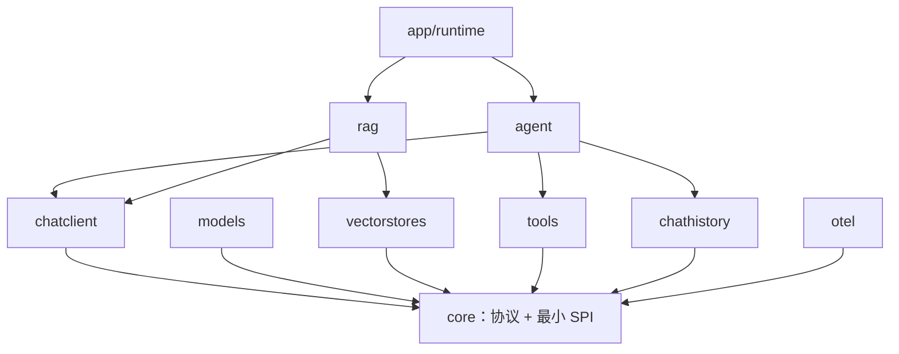
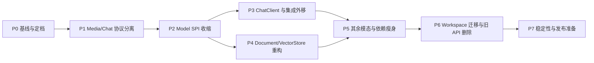

# Core 架构演进执行计划

> 状态：完成（P9 最终语义收口关闭，73/73）
> 建立日期：2026-07-13
> 最后更新：2026-07-15
> 维护者：Lynx 仓库维护者
> 适用范围：`core` 及所有直接消费其公开 API 的 workspace 模块

本文档是 Core 长期架构演进的唯一执行基准，负责同时记录目标、边界、阶段、任务、验收标准、进度、风险和设计决策。实施过程中如发现本文与临时代码便利性冲突，以本文为准；如确需改变方向，必须先更新“决策记录”，再修改代码。

治理原则以 [`../CLAUDE.md`](../CLAUDE.md)、[`../DESIGN_PHILOSOPHY.md`](../DESIGN_PHILOSOPHY.md) 和 [`../REFACTORING.md`](../REFACTORING.md) 为上位约束。本文负责把这些原则落实为 Core 的具体执行路径。P0-05 裁决前，现有上位文档继续有效；本文提出但与现行规则冲突的目标只能视为提案，必须在 P0-06 一次性同步治理文档后才能实施，禁止选择性忽略任一规则。

---

## 1. 背景与问题定义

Lynx Core 最初参考并移植 Spring AI。领域抽象本身大多成立，但移植过程中发生了两类结构性偏移：

1. Spring AI 的 `model`、`client-chat`、`vector-store` 等独立层被部分压入同一个 Go `core`。
2. Java 默认方法、Builder、继承式接口、`Object` 扩展点和运行时框架能力被翻译为 Go 的强制接口、`WithXxx` 链、`any` 字段和 Core 内置行为。

由此产生的主要问题：

- Core 同时承担协议、SPI、客户端门面、工具运行时、历史、评估、安全和可观测性。
- provider 实现必须满足 Call、Stream、DefaultOptions、Metadata 等复合能力。
- Chat Request 混合可序列化模型协议、middleware 状态和不可序列化工具闭包。
- Chat Response 混合 provider 响应与 tool-loop 合成事件，并丢弃多 choice 数据。
- Document 同时承担数据、检索结果、ID 生成和格式化行为。
- VectorStore 有高层语义价值，但公共能力接口仍偏胖，且暴露 `NativeClient any`。
- Core 直接依赖 OTel、tokenizer、cast、UUID 等上层或实现型依赖。
- Filter 将 lexer、token、parser、visitor 等实现细节暴露为公共包。

本次演进不是机械拆目录，而是重新建立协议、运行时和集成层之间的稳定边界。

---

## 2. 总目标

### 2.1 一句话目标

> Core 成为 Go 世界里的 AI protocol library；`chatclient`、`documentpipeline`、`rag`、`agent`、`tools`、`otel` 等模块成为按需组合的 framework 层。

### 2.2 目标状态

Core 只保留以下三类内容：

1. 跨 provider 稳定共享的领域词汇和可序列化协议。
2. 消费方真正需要的最小调用能力接口。
3. 无全局状态、无外部 I/O 策略的纯组合与语义操作。

最终应达到：

- Core 不知道 ChatClient、Agent、RAG pipeline、Tool loop、History backend 或 OTel SDK。
- provider adapter 只实现自己真实支持的能力。
- Request/Response 可独立 JSON round-trip，不携带闭包和运行时对象。
- 高层能力通过小接口、函数组合和独立模块形成，不通过继承式框架形成。
- Core 生产代码默认只依赖 Go 标准库；任何例外必须有明确 ADR。
- 公开包扁平、领域命名明确，不出现 `core/model/chat` 这类无必要层级。
- 所有破坏性变更一次完成并删除旧实现，不长期维护双轨 API。

其中“Core 仅标准库、OTel 埋点全部外移”是本计划的推荐目标，但它改变了当前根 `CLAUDE.md` 和 `doc/OBSERVABILITY.md` 要求 Core 直接 import OTel API 的治理决策。该项必须在 P0-05 明确选择，在 P0-06 同步全部治理文档；未裁决前不得进入 P1。

### 2.3 成功指标

| 指标 | 当前基线 | 目标 |
|---|---:|---:|
| Core 生产代码直接外部依赖 | 9 个左右 | 0；例外必须 ADR |
| Chat provider 强制能力 | Call + Stream + DefaultOptions + Metadata | Call；其他能力独立 |
| Request 中不可序列化运行时字段 | 存在 | 0 |
| Core 内具体 middleware/integration | history/logger/safeguard/OTel 等 | 0 |
| Core 内 tool-loop/control-flow 类型 | 存在 | 0 |
| Filter 公共实现子包 | lexer/parser/token/visitors 等 | 仅稳定语义门面 |
| 公开包层级 | `core/model/<modality>` | `core/<modality>` |
| Workspace 全量测试 | 当前可通过 | 每阶段持续通过 |

指标中的“外部依赖”按生产代码 import 统计，测试专用依赖单独记录，不以 `go.mod` 行数直接判断。

---

## 3. 非目标

以下事项不属于本计划，除非通过决策记录正式扩展范围：

- 不重写所有 provider SDK 或底层 HTTP client。
- 不把公共 VectorStore 降级为只处理原始向量的数据库驱动。
- 不引入 DI 容器、自动扫描、注解、反射式生命周期或 Spring 风格 Bean 系统。
- 不建立 `service/repository/controller/domain` 等横向分层包。
- 不为了抽象完整性提前设计尚无消费方的接口。
- 不在本轮同时改变仓库品牌、Git 历史或所有 module path。
- 不把 retry、circuit breaker、OAuth、缓存等策略重新塞入 Core。
- 不以性能优化为主要目标；没有基准数据时不做性能驱动的复杂化。

---

## 4. 不可违反的设计约束

### 4.1 协议与运行时分离

- 通过 `Validate` 的 Core DTO 必须能稳定序列化；所有 Model/VectorStore Call 边界先验证请求，不能把编码失败推迟到 provider SDK 内部。
- 协议 Metadata 统一使用 `metadata.Map`（底层为 `map[string]json.RawMessage`）；写入时立即编码并返回错误，不允许任意运行时对象滞留到 Marshal 时才失败；所有 DTO 的 `Validate` 必须沿对象树验证其持有的每个 Metadata。
- 工具执行函数、provider native client、logger、tracer、registry 等运行时对象不得进入协议 DTO。
- `context.Context` 负责取消、截止时间、trace 和请求范围值，不进入持久化结构。
- 需要跨 middleware 修改的状态使用上层明确的 Invocation/Event 类型，不污染 provider Request。

### 4.2 接口由消费方需求决定

- 一个接口默认保持 1–3 个方法。
- Call、Stream、DeleteByID 等真实调用能力分别建模；需要发起请求的维度探测属于消费工作流，不伪装成 Core SPI。
- 不通过胖 `Store` 或胖 `Model` 强迫实现者提供不支持的能力。
- 接收小接口，返回具体类型。

### 4.3 泛型只用于算法复用

- 删除用于模拟 Java 泛型层次的 `Model[Request, Response]`、`StreamingModel[...]` 名义基类。
- 泛型可用于 Call/Stream middleware 的公共组合算法、slice/iterator 处理等真实重复算法。
- 不建立泛型 base service、repository、manager 或 builder。

### 4.4 零值与错误

- `Options{}` 表示使用 model/provider 默认配置，是合法值。
- Request 在 I/O 边界显式 `Validate`，非法配置返回错误，不静默忽略。
- 非 Chat 成功响应的 result/response metadata 指针必须存在，provider 未报告字段时使用其零值；`Validate` 递归拒绝 nil、非法 Extra 与非法数值。
- 错误使用 `errors.New`、`errors.Is/As` 和 `fmt.Errorf("...: %w", err)`；不把异常式控制流放在 Core。

### 4.5 扩展机制收敛

- 跨调用行为统一使用函数式 middleware/decorator。
- provider 特有请求字段只保留一个受控、可序列化的 Extensions 逃生舱。
- 不同时引入 Advisor、Hook、Interceptor、Listener、Plugin 等多套同义机制。

### 4.6 严格依赖 DAG



任何 Core 对上述上层模块的反向 import 都视为架构缺陷。

---

## 5. 目标包结构

本轮保留 `github.com/Tangerg/lynx/core` module path，避免把 module 发布策略与语义重构混为一件事；包路径从 `core/model/<modality>` 扁平为 `core/<modality>`。

```text
core/
├── model/          仅保留跨模态的纯调用/流组合算法和真正共享值
├── chat/           Message/Part、Request/Response、Model/Streamer
├── embedding/      embedding 协议和最小 Model
├── image/          image 协议和最小 Model
├── transcription/  audio-to-text 协议和最小 Model
├── speech/         text-to-speech 协议和最小 Model
├── moderation/     moderation 协议和最小 Model
├── metadata/       JSON-safe metadata.Map 及编码/解码 helper
├── media/          明确建模的媒体引用/字节载荷
├── document/       纯 Document 数据与校验
├── vectorstore/    高层语义索引/检索能力和 SearchRequest/Match
│   └── filter/     单一 Predicate AST；同包私有递归下降前端；公开 Visitor
└── internal/arch/  DAG、依赖预算和公共面守卫
```

Core 中不得存在以下目录或等价职责：

- `chat/client*`
- `chat/history`
- `chat/middleware/logger`
- `chat/middleware/safeguard`
- `evaluation`
- tool executor/schema reflection
- agent/tool-loop control flow
- OTel tracer/meter 实现
- provider pricing/catalog/registry
- tokenizer 实现

---

## 6. 目标公共契约

本节是方向性 API 基准。实施时允许调整具体字段名，但不得改变职责边界；任何职责变化必须先写入第 15 节决策记录。

### 6.1 模型能力

每个 modality 在自己的包中声明最小接口：

```go
type Model interface {
    Call(context.Context, *Request) (*Response, error)
}

type Streamer interface {
    Stream(context.Context, *Request) iter.Seq2[*Response, error]
}
```

规则：

- `Model` 不强制嵌入 `Streamer`。
- `DefaultOptions` 不属于 Model；provider 构造函数和上层 client 分别持有自己的默认值。
- provider 名称不通过 `Metadata()` 强迫实现；观测 wrapper 在构造时显式接收属性。
- Embedding dimensions 不属于 `embedding.Model` 能力；需要探测时由 `embeddingclient.Client.Dimensions` 发起显式请求，缓存与失效策略由消费方拥有。

阶段归属只有一种解释：P2 只在 `core/chat` 落地上述 SPI；其余 modality 的目标包/API 由 P5 建立与迁移，P9 再删除没有端到端闭环的可选能力。P2 不提前创建这些 top-level modality 包。

### 6.2 Chat Request

```go
type Request struct {
    Messages   []Message
    Tools      []ToolDefinition
    Options    Options
    Extensions map[string]json.RawMessage
}
```

规则：

- 不包含 `Params map[string]any`。
- 不包含可执行 Tool、registry 或闭包。
- `Options{}` 合法，model 字段只是可选 per-request override。
- `ToolDefinition.InputSchema` 使用明确 JSON 表达，不存执行函数。
- Extensions 必须 namespaced、可序列化，并由 provider adapter 验证。

### 6.3 Metadata 与 Media

跨协议对象共享的 metadata 使用已经编码的 JSON value：

```go
type Map map[string]json.RawMessage
```

- `metadata.Set(m, key, value)` 在写入时执行 JSON 编码并返回错误。
- `metadata.Decode` 负责按目标具体类型读取，不通过 `any` 延迟类型判断。
- 直接 map 赋值只能接受 `json.RawMessage`，因此函数、reader 和 SDK client 无法误入 DTO。
- `metadata.Map.Validate` 遍历每个 key/value，并用 `json.Valid` 验证整段 RawMessage（包括其嵌套 JSON 语法）；`MarshalJSON` 必须先调用 `Validate`。持有 Metadata 的 DTO `Validate` 还要递归验证 Message、Part、Media 等子对象，不能只验证顶层 map。
- Round-trip 保证指 JSON wire 语义稳定，不承诺不同 Go 数值类型之间的动态类型等价。

Media 使用显式 tagged source，不再承诺任意 Go 对象：

```go
type Media struct {
    MIME     string
    Source   MediaSource
    ID       string
    Name     string
    Metadata metadata.Map
}

type MediaSource struct {
    Kind  SourceKind
    Bytes []byte
    URI   string
    Ref   string
}
```

- `Kind` 决定 Bytes、URI、Ref 中唯一有效字段；`Validate` 拒绝多值或缺值。
- `io.Reader`、文件句柄和 SDK 对象由调用方在进入协议前读取/转换。
- Bytes 使用明确的 JSON 编码，URI 和 provider reference 保持字符串语义。
- Media 与 Chat golden fixture 同阶段冻结，避免 Message wire format 二次破坏。

### 6.4 Message 与 Part

目标采用显式 tagged value，而不是依赖 sealed interface + 自定义多态反序列化：

```go
type Message struct {
    Role     Role
    Parts    []Part
    Metadata metadata.Map
}
```

- `Role` 和 `Part.Kind` 是显式 discriminator。
- User、System、Assistant、ToolResult 通过构造 helper 创建普通值。
- provider adapter 对未知 role/part 返回可诊断错误。
- Metadata 在跨 provider 边界前验证为约定的 JSON-safe 值。

### 6.5 Chat Response

```go
type Response struct {
    ID         string
    Model      string
    Choices    []Choice
    Usage      Usage
    Extensions map[string]json.RawMessage
}
```

- 保留 provider 返回的全部 choice，不静默丢弃。
- 提供 `First`、`Text` 等 nil/empty-safe 便利函数。
- Tool execution result、pause/resume、round boundary 不混入 Chat Response。
- 流式和非流式共享同一语义模型；聚合器是纯函数/显式 accumulator。

### 6.6 Tool 定义与执行

Core/chat 只保留模型可见的 `ToolDefinition`、`ToolCall`、`ToolResult` 消息词汇。

`tools` 持有：

- Executor
- typed input decode/output encode
- JSON Schema 生成
- Registry

`agent/toolloop` 持有：

- approval/HITL
- 普通错误回传、return-direct 和 loop policy；禁止增加自动 retry layer
- pause/resume/control-flow error

上层 `Invocation` 将 `chat.Request` 与工具 registry 组合，但二者不互相嵌套。

### 6.7 Document

```go
type Document struct {
    ID       string
    Text     string
    Media    *media.Media
    Metadata metadata.Map
}
```

- Score 从 Document 移到 vectorstore.Match。
- Formatter 是外部纯函数/策略，不是 Document 字段。
- ID generator 是 ingestion/indexing helper，不是 DTO 隐式行为。
- 文本/媒体组合规则由 `Validate` 明确，不依赖构造器副作用。

### 6.8 VectorStore

VectorStore 保持“输入 Document/查询文本、内部组合 embedding”的 AI 应用级语义，不降级成 raw vector 公共 API。

```go
type Indexer interface {
    Add(context.Context, []*document.Document) error
}

type Searcher interface {
    Search(context.Context, SearchRequest) ([]Match, error)
}

type IDDeleter interface {
    DeleteIDs(context.Context, []string) error
}

type FilterDeleter interface {
    DeleteWhere(context.Context, filter.Predicate) error
}
```

- 不要求所有实现满足胖 `Store`。
- SearchRequest 使用普通 struct + Validate，不使用会吞掉非法输入的 fluent With 链。
- 删除 `NativeClient any`；provider-specific 操作由具体实现类型或 provider 包显式暴露。
- Filter 对外暴露语义 AST、Predicate/Selector、构造函数、Parse/Validate 和完整树 Visitor；scanner/token/递归下降 parser 保持同包私有。

### 6.9 Middleware

- 保留 `func(next) next` 的 Go 装饰器形态。
- Core 只提供类型和纯 `ChainCall/ChainStream` 组合算法。
- 不保留带 Clone/With 状态的 MiddlewareChain builder，除非消费代码证明其必要性。
- concrete history/safeguard/OTel middleware 位于上层模块。
- 不保留通用 request/response Logger middleware：调用观测由 `otel` wrapper 的 span/metric 承担，应用只在生命周期、显式审计或无法归属到 span 的边界事件写日志。未来如需审计日志，必须以独立语义和 ADR 建模，不能复用调试型 Logger middleware。

---

## 7. 职责迁移表

| 当前职责 | 目标位置 | 处理方式 |
|---|---|---|
| `core/model/chat/Client*` | 新 `chatclient` module | 重写为直接调用 + 少量便利 API |
| PromptTemplate / StructuredParser | `chatclient` | 作为高层请求/输出便利能力，不进入协议层 |
| Chat history 接口与实现 | `chathistory` | 消费方声明最小接口 |
| History middleware | `chathistory` 集成包 | 包装 chatclient/core handler |
| request/response Logger middleware | 删除 | 观测统一由 `otel` wrapper 的 span/metric 承担，不与 `slog` logger 形成双轨 |
| Safeguard middleware | `chatclient/middleware/safeguard` | 作为可选 ChatClient decorator；Agent 可消费但不拥有定义 |
| Evaluation | `rag/evaluation` | 当前事实性/相关性评估属于 RAG，不属于模型协议 |
| 可执行 Tool / schema reflection | `tools` | Core 只留 Definition/Call/Result 词汇 |
| Tool loop / Halt / ControlFlowError | `agent/toolloop` | 作为运行时 Event/状态机 |
| Chat/Embedding tracing 与 metrics | `otel` | 显式 wrapper/middleware |
| tokenizer/tiktoken | 新 `tokenizer` module；tiktoken 为其实现包 | Core 不绑定 tokenizer 实现 |
| pricing/catalog/capabilities registry | `models/catalog` | provider/model 特有信息不属于 provider-neutral SPI |
| APIKey 动态抽象 | 各 `models/<provider>` 配置 | Core 不统一密钥刷新或认证策略 |
| Document formatter/transformer/batcher/ID generator 实现 | 新 `documentpipeline` module | Core DTO 保持纯数据；`rag`、`vectorstores` 等消费方各自声明所需窄接口 |
| VectorStore implementation | `vectorstores` | Core 只留能力契约 |
| Filter scanner/token/parser | `vectorstore/filter` 私有实现文件 | 直接构造唯一公共语义 AST，不形成第二套 internal AST |

---

## 8. 执行策略

### 8.1 总体顺序



### 8.2 提交纪律

- 每个可独立验证的迁移批次一个逻辑提交；禁止混入无关格式化。一个任务可以包含多个批次，只有全部批次完成后才勾选任务。
- provider/backend/workspace 全量任务在标记“进行中”前，必须从 P0 清单展开逐项子清单；每个子项记录 commit、测试证据和剩余数量。
- 先建立新契约和测试，再迁移实现，最后删除旧 API。
- 不新增 alias、bridge、shim、dual-read/dual-write、兼容字段或旧 wire 解码；历史数据需要迁移时由应用在升级前显式执行一次性数据迁移。
- package path 变化时，新旧实现只允许因“仍有真实消费者尚未迁移”而同时存在；新代码不得反向依赖旧路径，最后一个消费者迁移的同一批次必须删除旧实现。
- package path 不变的原地类型变更必须做直接纵向切换：同一逻辑批次迁移全部消费者并删除旧字段/行为，不为维持旧调用面增加兼容代码。
- Reference implementation 用于先证明新契约；是否全量迁移由第 8.3 节按路径类型裁决，不能一概推迟到 P6。
- 每次修改 exported API 前更新本文进度和影响面。
- 阶段完成前运行该阶段规定的全部验证命令。
- 如果发现目标设计不成立，停止扩散修改，记录决策和证据后再继续。

### 8.3 两种直接迁移模式

| 模式 | 适用范围 | 执行方式 | 删除截止点 |
|---|---|---|---|
| 新路径直接切换 | `core/model/chat → core/chat`、其他 modality 扁平化、独立 `chatclient` | 先证明新包，再逐个迁真实消费者；不建 bridge，最后一个消费者迁移时直接删除旧包 | 最后消费者迁移批次 |
| 同路径原子纵向切片 | `core/media`、`core/document`、`core/vectorstore` 等 import path 不变的结构修改 | 在一个保持 workspace 绿色的逻辑批次中迁完消费者并删除旧面，不增加兼容字段 | 所属阶段 |

执行者在开始任务前必须标明使用哪种模式。若无法判断，按同路径原子纵向切片处理；P6 是剩余消费者的计划批次，不是兼容层或删除债务的默认延期点。

---

## 9. 分阶段任务与验收标准

状态词：`未开始`、`进行中`、`阻塞`、`完成`、`取消`。只有满足任务证据和阶段退出标准才能标记完成。

### P0：基线、决策与安全网

目标：在修改公开 API 前冻结可验证基线，明确破坏性变更边界。

- [x] **P0-01 建立本执行计划**（完成：2026-07-13）
  - 证据：本文档及 `doc/README.md` 索引。
- [x] **P0-02 完成 Core/Spring AI 结构差分审计**（完成：2026-07-13）
  - 证据：本文第 1、7、15 节记录 Model、ChatClient、Advisor、Document、VectorStore、Tool、Filter 的来源、目标归属与决策。
- [x] **P0-03 导出公共 API 清单和外部消费清单**（完成：2026-07-14）
  - 证据：[`CORE_API_INVENTORY.md`](./CORE_API_INVENTORY.md)；24 个公共 package、1,205 个 exported identifiers、501 个唯一消费文件/830 条 direct-import 关系、38 个 model provider 和 27 个 vectorstore backend 均已登记。
- [x] **P0-04 固化测试与依赖基线**（完成：2026-07-14）
  - 证据：[`CORE_BASELINE.md`](./CORE_BASELINE.md)；17 个 workspace module 的 68 项 build/vet/test/lint 全绿，6 个目标 module race 全绿，coverage 与 16 个 direct non-stdlib import path 已记录。
  - `scripts/check.sh` 已移除过期 `chatmemory`/`lyra`，改为以 `go.work` 主 module 为事实来源，并拆分普通 test/race 语义。
- [x] **P0-05 确认破坏性变更批次**（完成：2026-07-14）
  - 授权证据：维护者要求按本文持续推进直到全部完成；采用本文推荐的协调 v0 breaking batch 与 ADR-006 OTel 外移方案。
  - 发布事实：仓库当前没有 tag，Core 由 `v0.0.0-*` pseudo-version 消费；推荐执行一次协调的 v0 breaking batch，不引入无意义的 `/v2` module path，也不维护长期双轨。
  - 破坏范围：Media/Document/VectorStore 同路径类型变更；`core/model/<modality>` 扁平化；ChatClient/history/tool runtime/evaluation/tokenizer/OTel 职责外移；删除旧 builder、胖接口、任意 `any` 扩展和具体 middleware。
  - Workspace 影响：501 个唯一文件、830 条 Core package direct-import 关系；重点包括 38 个 model provider、27 个 vectorstore backend 和 9 个直接消费旧 `core/model/*` 的 module。迁移由本计划分阶段完成，不把兼容责任推给调用方。
  - 破坏策略备选：
    1. 推荐：批准上述一次协调的 v0 breaking batch；新路径限时并存到 P6，同路径纵向切片在所属阶段删除旧面。
    2. 不推荐：逐项 deprecate/长期 shim；会与仓库“不留历史债务”规则及本计划退出标准冲突，若选择必须先重写计划。
  - 同时裁决可观测性边界，二选一并记录到 ADR-006：
    1. 推荐：Core 生产代码仅标准库；`otel` module 直接使用 OTel API 并包装 Core handler，不增加自造 tracer/meter 抽象。
    2. 保守：Core 保留 OTel API 依赖；先修订本文的依赖指标、P3/P5/P6 任务和退出标准，再开始实现。
  - 必须由维护者明确确认后才能进入 P1 实现。
- [x] **P0-06 建立架构守卫并同步治理规则**（完成：2026-07-14）
  - Core 不得 import 上层模块。
  - 记录生产依赖预算。
  - 为目标包结构建立 allowlist 测试。
  - 在进入 P1 前同步更新根 `CLAUDE.md`、`core/CLAUDE.md`、`doc/OBSERVABILITY.md` 与相关 README：移除 sealed Message、泛型名义骨架和旧包路径等冲突，并按 ADR-006 统一 Core/OTel 依赖边界。
  - 若选择推荐 OTel 方案，文档必须明确 `otel` wrapper 直接使用官方 OTel API、不建立 `core/observation` 或自造 tracer/meter 接口，并删除“Core 直接 import OTel”的旧结论。
  - 若选择保守 OTel 方案，先让本文所有“仅标准库/零外部依赖/OTel 全外移”指标与任务改为一致口径；不得留下互斥验收标准。
  - 标明“新路径并存 / 同路径纵向切片”规则及各自删除截止点。
  - 证据：根/core/otel `CLAUDE.md`、`doc/OBSERVABILITY.md` 与 README 已同步；`core/internal/arch` 对上层反向 import、临时外部依赖预算和公共 package allowlist 建立自动守卫。
  - 验证：`MODULE=core scripts/check.sh build vet test lint` 与 `MODULE=core scripts/check.sh race` 全绿。

退出标准：

- 当前测试基线有可复现记录。
- 所有高影响 exported API 有消费方清单。
- 破坏性变更授权已确认。
- 架构守卫在旧结构上可运行，并允许逐阶段收紧。
- 根 `CLAUDE.md`、`core/CLAUDE.md`、`doc/OBSERVABILITY.md` 与本文一致，实施者不会同时面对互相冲突的治理规则。

### P1：Media/Chat 协议与运行时分离

目标：先切开最核心的协议/执行边界，避免后续迁移继续依赖混合模型。

- [x] **P1-01 定义新的 `core/metadata` 与 `core/media` 叶子协议**（完成：2026-07-14）
  - Metadata 使用 `map[string]json.RawMessage`，写入 helper 在边界立即返回编码错误。
  - 明确 bytes、URI 和 provider reference 的互斥关系与 JSON discriminator。
  - 删除协议层对任意 `Data any` 和 `io.Reader` 的承诺。
  - 这是同路径纵向切片：本任务必须迁移全部 Media 消费方，并在 P1 退出前删除旧 `Data any`。
  - 证据：新增 `core/metadata.Map`、写时编码/typed decode/递归 JSON 校验与 `core/media` tagged source；bytes 构造和读取均防御性复制，URI 要求绝对资源标识，provider reference 保持独立语义。
  - 迁移：Core tokenizer/transcription、运行时 wire 入站边界、OpenAI/Anthropic/Google/Bedrock/Ollama 及全部 audio provider 已切换；全 workspace 检索确认 `NewMedia`、`DataAsBytes`、`DataAsString`、`MimeType`、Media `Data any` 均为 0。
  - 验证：metadata/media coverage 分别为 91.7%/92.9%；`scripts/check.sh build vet test lint` 68/68 全绿。
- [x] **P1-02 定义新的 `core/chat` Message/Part tagged value**（完成：2026-07-14）
  - 覆盖 system/user/assistant/tool result、text/media/reasoning/tool call。
  - 明确 Validate 和 JSON discriminator。
  - 采用新路径并存模式：本任务只建立无运行时对象的值协议与测试；旧 `core/model/chat` 冻结到 P6，provider reference mapping 在 P1-07 完成。
  - 证据：`Message{Role, Parts, Metadata}` 和普通 `Part` tagged value 覆盖 4 种 role、5 种 part kind；role/part 兼容矩阵、payload 互斥、嵌套 Media/Metadata 与未知 discriminator 均递归校验。
  - ToolCall Arguments 保留 provider JSON 文本语义，使流式片段与模型产生的 malformed JSON 仍可无损序列化；可信解码留给 `tools` 运行时边界。
  - 验证：`core/chat` coverage 94.9%；Core build/vet/test/lint 与 race 全绿。
- [x] **P1-03 定义新的 Chat Request/Options**（完成：2026-07-14）
  - 移除 Params 和可执行 Tool。
  - Options 零值合法。
  - 仅保留一个 JSON-safe Extensions。
  - Extensions key 使用 `namespace/name` 格式；provider adapter 只读取自己的 namespace，写入通过即时 JSON 编码 helper 完成。
  - 证据：`Request` 仅含 Messages、ToolDefinition、Options 和 `metadata.Map` Extensions；公开 DTO 字段反射守卫确认无 interface，ToolDefinition 的 InputSchema 在边界校验为 JSON object。
  - Options 零值合法并从 Request wire 省略；显式采样参数执行范围/NaN/Inf 校验，model 仅为可选 per-request override。
  - 验证：`core/chat` coverage 93.8%；Core build/vet/test/lint 与 race 全绿。
- [x] **P1-04 定义新的 Chat Response/Choice**（完成：2026-07-14）
  - 保留多 choice。
  - 提供 First/Text 等便利函数。
  - 不含 tool-loop synthetic result。
  - Response 零值可表示流中的无内容/仅 usage chunk；Choice 用 Index 保持 provider 顺序身份，Message 可空以承载仅 finish reason 的终止 chunk。
  - 证据：Response 公开字段守卫锁定为 ID/Model/Choices/Usage/Extensions；Choice 递归限制为 assistant Message，finish reason 归一化，provider-native 值进入 namespaced extension。
  - Usage 使用 input/output 词汇和可选 reasoning/cache breakdown，无 `OriginalUsage any`；First/Text/Message.Text 对 nil 和空 choice 安全。
  - 验证：多 choice 顺序/索引及完整 JSON round-trip 已覆盖，`core/chat` coverage 94.4%；Core build/vet/test/lint 与 race 全绿。
- [x] **P1-05 建立 serialization golden/fuzz tests**（完成：2026-07-14）
  - 覆盖 metadata 非法 RawMessage、media、全部 message/part、未知 discriminator、空值和 extensions。
  - Golden fixture 直接冻结 metadata、三种 Media source、完整 Request 和多 Choice Response 的可读 JSON；fuzz 使用“成功解码后 Validate + Marshal + 再解码的 canonical wire 必须达到 fixed point”属性。
  - 证据：新增 metadata、三种 Media source、覆盖全部 role/part 的完整 Request 和多 Choice Response golden fixtures；分别为 `metadata.Map`、`media.Media`、Part、Message、Request、Response 建立 6 个 JSON fixed-point fuzz 入口。
  - 验证：6 个 fuzz 入口分别运行 2 秒并通过；metadata/media/chat coverage 分别为 91.7%/92.9%/94.4%；Core build/vet/test/lint 与 race 全绿。
- [x] **P1-06 在 `agent/toolloop` 建立 Invocation/Event 原型**（完成：2026-07-14）
  - 同一任务批次先在 `tools` 建立最小可执行 `Tool` 契约和具体 `Registry`，在 `agent/toolloop` 声明消费方窄 `ToolResolver` 接口；`tools.Registry` 满足该接口，依赖方向只能是 Agent → Tools → Core。
  - Invocation 组合 Request 与 `ToolResolver`，不直接依赖 registry 具体类型。
  - Event 表达 model/tool/pause/resume，不污染 Chat Response。
  - 证据：根 `tools` 包新增两方法 `Tool` 与实例级 `Registry`；注册批次全有或全无、拒绝 nil/重复/非法 definition，Definitions 防御性复制并稳定排序，无全局 registry。
  - 边界：`agent/toolloop.ToolResolver` 只有 Resolve；编译期断言确认 `tools.Registry` 满足接口，`go list` 确认新路径为 Agent → Tools → Core。Invocation 验证 advertised tool 均可执行并主动拒绝 JSON 序列化。
  - 事件：serializable tagged Event 覆盖 model request/response、tool call/result、pause/resume 六类边界，严格限制单一 payload；Chat Response 反向守卫确认无运行时字段。
  - 验证：根 tools coverage 92.3%，agent/toolloop coverage 77.4%；Tools/Agent build/vet/test/lint 与目标 race 全绿。
- [x] **P1-07 选择四个差异 provider 做映射验证**（完成：2026-07-14）
  - OpenAI、Anthropic、Google、Ollama。
  - 证明新协议不丢失当前支持能力。
  - 证据：新增 [`CORE_CHAT_PROVIDER_MAPPING.md`](CORE_CHAT_PROVIDER_MAPPING.md) 与 `models/internal/chatconformance` 的 8 份 request/response golden fixtures；覆盖多 choice/candidate、reasoning signature、redacted reasoning、audio/media、tool error、确定性 synthetic tool-call ID、cache/reasoning usage 和四家 namespaced extensions。
  - 边界：本任务冻结迁移后的 Core wire 和 loss policy，不提前切换生产 adapter；P2-06 必须让四家真实 SDK fixture 产出与本基线等价的 Core 值。
  - 验证：四 provider mapping conformance 与 race 通过；Models build/vet/test/lint 全绿。

退出标准：

- 新 Media/Chat DTO 可独立 round-trip。
- 全 workspace 已切换新 Media；旧 `Data any` 和临时兼容字段已删除。
- 新 `core/chat.Request` 中无闭包、registry、native client 或 middleware context；冻结旧 Request 登记到 P6。
- 四个基准 provider 可无损映射。
- tool-loop 事件不再要求扩展 Chat Response。

阶段验收（完成：2026-07-14）：`scripts/check.sh build vet test lint` 全 workspace 68/68 通过；metadata/media/Part/Message/Request/Response 六个 fuzz 入口各运行 30 秒通过；Core、Agent、Tools 全模块 race 通过。

### P2：Chat Model SPI 收缩与调用组合

目标：先让 Chat provider 只实现真实能力，移除 Java 默认方法造成的强制接口；其余 modality 明确留到 P5，避免阶段重叠。

- [x] **P2-01 在 `core/chat` 定义单方法 Model 接口**（完成：2026-07-14）
  - 证据：新增 `Model`，唯一方法为 `Call(context.Context, *Request) (*Response, error)`；文档明确实现必须在 provider I/O 前验证 Request，stream/default configuration/provider identity 均不属于该接口。
  - 守卫：compile-time case 证明只实现 Call 的 provider 可满足 Model；反射测试锁定单方法及完整签名，防止接口重新变胖。
  - 验证：Core build/vet/test/lint 与 race 全绿。
- [x] **P2-02 将 Chat Streamer 拆为独立可选能力**（完成：2026-07-14）
  - 证据：新增独立单方法 `Streamer`，签名为 `Stream(context.Context, *Request) iter.Seq2[*Response, error]`；不嵌入 Model，Model 也不嵌入 Streamer。
  - 守卫：stream-only provider 编译满足 Streamer；反射测试锁定方法数量和完整签名，证明同步/流式能力可独立实现。
  - 验证：Core build/vet/test/lint 与 race 全绿。
- [x] **P2-03 从 Chat Model SPI 移除 DefaultOptions/Metadata 强制方法**（完成：2026-07-14）
  - 证据：目标 Model/Streamer 均无 DefaultOptions、Metadata 或嵌入接口；新增 AST 架构守卫，禁止两个 SPI 增加非白名单方法、嵌入其他接口或在目标包重新引入 `ModelMetadata`。
  - 冻结：新增 [`CORE_LEGACY_REMOVAL.md`](CORE_LEGACY_REMOVAL.md)，登记旧复合 Model、混合 Request/Response 与 Core Chat framework 表面的替代路径、迁移任务和 P6 删除验收。
  - 验证：Core build/vet/test/lint 与 race 全绿。
- [x] **P2-04 让 `core/chat` 停止使用泛型 Model/StreamingModel 名义层次**（完成：2026-07-14）
  - 只冻结旧 `core/model/chat` 包并登记 P6 删除；P2 不创建 embedding/image/audio/moderation 目标包。
  - 证据：目标 `core/chat` 的 Model/Streamer 为具体 Request/Response 契约，无 type parameter、无 embedded interface、无 `core/model` import；架构测试对三项建立自动守卫。
  - 范围：旧 `core/model` 和 `core/model/chat` 继续只为 workspace 迁移保留，已由 `CORE_LEGACY_REMOVAL.md` 登记 P6-05 删除；本任务未提前创建 P5 modality 包。
  - 验证：Core build/vet/test/lint 与 race 全绿。
- [x] **P2-05 保留并简化 Chat 的泛型 Call/Stream middleware 组合算法**（完成：2026-07-14）
  - 证据：新增 stdlib HandlerFunc 风格的 `ModelFunc`/`StreamerFunc`、函数型 CallMiddleware/StreamMiddleware 与 `Wrap`/`WrapStream`；删除目标用户面上的泛型 Chain builder。
  - 泛型边界：唯一泛型是未导出的 `compose` 包装算法，真实复用 Call/Stream 的 outermost-first 组合，不建立名义层次或公共泛型 API。
  - 验证：覆盖 adapter 委托、错误透传、call/stream 顺序、nil middleware、输入 slice 变更隔离和空链；`core/chat` coverage 94.5%，Core build/vet/test/lint/race 全绿。
- [x] **P2-06 为四个 reference provider 建立 compile-time 和行为 conformance suite**（完成：2026-07-14）
  - Harness 位于 `models/internal/conformance`，由各 provider 测试传入具体构造函数；Core 不 import provider。
  - 结果：provider-neutral ChatSuite 覆盖 Call/Stream 的构造、请求/响应递归校验、非空 yield 和 Request 不可变性；OpenAI、Anthropic、Google、Ollama 的新 `Chat` adapter 均直接实现目标 Core SPI，对应 legacy adapter 保持冻结。
  - OpenAI 证据：真实 `openai-go` mock wire conformance 覆盖多 choice、native extension、多模态、reasoning/usage 映射和流式 tool-call 稳定身份。
  - Anthropic 证据：真实 SDK mock wire 覆盖 content block 保序、thinking signature/redacted replay、image/PDF、tool error、自动 cache breakpoint 与 SSE 多事件状态；原生 fresh/cache-read/cache-create 三段输入归一化为 Core 总输入，原始计数留在 extension。
  - Google 证据：真实 `genai` mock wire 覆盖全部 candidates、Thought/ThoughtSignature、safety、bytes/URI media、FunctionResponse 与 snake_case native extension；Call/Stream 对无原生 ID 的 tool call 都生成确定性 `google/<choice>/<part>`，prompt/tool-use 与 candidate/thought 分段 usage 归一化为 Core 总量。
  - Ollama 证据：真实 native SDK NDJSON mock wire 覆盖 reasoning → text → tool 的规范顺序、bytes image、tool/result、`keep_alive`/`format`/`think`/原生 options、created_at/duration/metrics；Call/Stream 对无原生 ID 的 tool call 生成稳定 `ollama/<choice>/<part>`，并在 provider I/O 前显式拒绝 reasoning signature、URI image 和非对象 tool arguments。
  - 验证：Models build/vet/test/lint 全绿；四 provider conformance 及 Ollama/internal conformance 目标 race 全绿。
- [x] **P2-07 固化 Chat Call/Stream 行为契约**（完成：2026-07-14）
  - 覆盖 context cancel、调用方提前停止、首个错误终止、无 goroutine 泄漏和流式聚合语义。
  - Core 契约：Model/Streamer godoc 明确 context error identity、单一终止错误、调用方停止时同步释放资源、禁止 detached goroutine，以及 Usage 为累计快照而非增量。
  - 聚合：新增零值可用的显式 `ResponseAccumulator`；按 choice index 保留首次出现顺序，合并相邻 text/reasoning，并按稳定 tool-call ID 聚合并行参数 delta；identity/finish 取最后非空值，metadata last-write-wins，最后一份非零 Usage 快照生效。Add 先复制再合并，失败原子回滚，输入 chunk 与输出 snapshot 均不别名。
  - 行为 conformance：四 provider 的真实 SDK transport 均验证进行中 Call/Stream 取消、读一个 chunk 后提前停止、首个 malformed event 后终止；测试同步等待消费 goroutine 和服务端 request context 退出，以证明无遗留执行单元。
  - 聚合 conformance：四家 happy stream 自动进入同一 accumulator 并断言最终 reasoning/text/signature/tool/usage；由此发现并修正 OpenAI/Anthropic mock tool-arguments 多转义一层的问题，adapter 不做猜测性反转义。
  - 验证：`core/chat` coverage 95.1%；Core/Models build/vet/test/lint 和全模块 race 全绿。

退出标准：

- 只支持 Call 的 provider 无需实现 Stream。
- 目标 Core Model SPI 不携带默认配置和观测身份；冻结的旧包只为迁移保留。
- `core/chat` 新 API 无全局状态；旧 Chat helper 有明确的 P6 删除记录。
- 四个 reference provider conformance tests 通过；剩余 provider 在 P6 迁移。

阶段验收（完成：2026-07-14）：`scripts/check.sh build vet test lint` 全 workspace 68/68 通过；metadata/media/Part/Message/Request/Response 六个 fuzz 入口各运行 30 秒通过；Core、Models 全模块 race 通过。

### P3：ChatClient、middleware 实现和工具运行时外移

目标：把框架便利层从协议核心中拔出，并保持用户面可发现性。

- [x] **P3-01 建立独立 `chatclient` module**（完成：2026-07-14）
  - 模式：采用“新路径并存”；新 module 先建立稳定依赖方向，旧 `core/model/chat/client.go` 继续冻结并在 P6-05 删除。
  - 边界：`chatclient` 生产代码只允许标准库与 `core`，不得反向依赖 Models、Tools、History、Agent 或应用层；自动架构测试扫描全部非测试 Go 文件并拒绝越界 import。
  - 设计：本任务只建立真实 module 节点、包定位和依赖守卫，不提前发布无语义的占位 Client 接口；P3-02 在该边界内一次性形成直接调用面。
  - 验证：`chatclient` build/vet/test/lint 全绿；加入 `go.work` 后全 workspace 18 个 module 的 build/vet/test/lint 共 72 项全绿。
- [x] **P3-02 设计直接调用优先的 Client API**（完成：2026-07-14）
  - 不复制 Spring 嵌套 spec/builder。
  - 简单请求使用普通值；复杂初始化才用 functional options。
  - 目标公开面收敛为不可变 `Client` 的 `New`、`Call`、`Stream`；普通路径直接 `New(model)`，只有默认 Options、middleware 或分离的 Streamer 能力通过构造期 option 注入。
  - Client 在调用边界深拷贝 Request 并执行“调用值覆盖 client 默认值”的 Options 合并，不修改调用方拥有的消息、媒体、schema、metadata 或 options；构造完成后自身无可变配置，并发语义由底层能力决定。
  - `Stream` 仅在底层真实实现 `chat.Streamer` 时可用；不提供 synthetic streaming，缺少能力时返回可由 `errors.Is` 识别的单一终止错误。
  - 证据：`Client` 仅公开 `Call`/`Stream` 两个方法，反射架构守卫阻止重新引入 fluent 面；`New(model)` 自动发现同一值的 Streamer，`WithStreamer` 支持能力分离，defaults 与 call/stream middleware 仅在构造期组合。
  - 行为：覆盖全部 Options 字段合并、每一层 Request 引用值防御性复制、非法请求 I/O 前失败、context error identity、中间件顺序、显式 Streamer 优先、提前停止同步释放、nil sequence 单错终止及并发调用。
  - 验证：`chatclient` coverage 96.5%，build/vet/test/lint 与全模块 race 全绿；workspace 72/72 门禁全绿。
- [x] **P3-03 将 prompt/template/structured output 迁入 `chatclient`**（完成：2026-07-14）
  - Template 使用标准库 `text/template` 一次解析、只读复用，变量作为每次 Render 的普通 data 传入；不保留 Spring/旧 Core 式可变变量 map 和 fluent builder，并以 missing-key error 及 AST 必需变量检查尽早失败。
  - Template 只负责渲染以及显式构造 system/user Message；`core/chat.Request` 继续作为 prompt 的唯一协议值，不另建与 Request 重叠的 Prompt 富对象。
  - structured output 使用“instructions 字符串 + decode 函数”的普通泛型值和包级 `CallStructured[T]`；不在 Client 上复制 Java `entity/responseEntity` 重载或建立 converter 类层次。
  - 内置 stdlib JSON、带调用方 schema 的 JSON 和 comma-separated 输出；chatclient 不依赖 `pkg/json` 生成 schema，需自动 schema 的 Agent/Tools 等上层调用方自行生成后注入，保持 P3-01 的 stdlib + Core 边界。
  - Template 证据：Parse 时拒绝空值/语法错，Render 使用 `missingkey=error`；Require 遍历标准库 parse AST；SystemMessage/UserMessage 输出递归验证的 Core tagged value，支持 media-only user；不可变实例并发渲染通过 race。
  - structured 证据：`Output[T]` 是可由字符串与函数字面量直接构造的普通值；`JSON[T]`/`JSONSchema[T]`/`CommaSeparated` 覆盖常见解码，Markdown fence 仅作为输入容错；`CallStructured[T]` 不修改原 Request，并在 decode/call 失败时保留原 Response。
  - 验证：chatclient coverage 94.1%，build/vet/test/lint 与全模块 race 全绿；workspace 72/72 门禁全绿。
- [x] **P3-04 迁移 history contract 与 middleware 到 `chathistory`**（完成：2026-07-14）
  - 模式：`chathistory` 同路径纵向切片；根包承接基于新 `core/chat.Message` 的 Reader/Writer/Clearer/Store、内存参考实现、窗口装饰器和可选能力，六个持久化 backend 在本任务内同步切换，不保留 module 内双协议。
  - conversation ID 是运行时请求作用域，不写入 Core Request Extensions；由 `context.Context` 显式携带并在 history 边界验证，缺失 ID 时 middleware 透明透传。
  - middleware 在 `chathistory/middleware` 声明消费方 Read+Write 窄接口；同步调用按 live system → stored non-system → fresh non-system 拼接，只持久化 fresh + 无 tool call 的完整 assistant；stream 仅自然完成且全部 chunk 可聚合时写入。
  - codec 只读写 `core/chat.Message` 当前 tagged wire；旧 `core/model/chat` wire 兼容分支已按 ADR-008 删除，历史数据由应用升级前显式迁移。
  - 证据：根契约/参考实现、六 backend/current-wire codec、call/stream middleware 分别落在 `f9b09b289`、`c1f75109a`、`00270d8bf`，兼容清理落在 `f0762ad73`；所有存储边界做递归 validation 与 defensive snapshot，tool-call 回合延迟到完整 assistant-call/tool-result/final-assistant 交换后一次写入。
  - 验证：根包、codec、snapshot、middleware coverage 分别为 90.3%/90.4%/95.1%/91.4%；chathistory 全模块 race 通过，workspace build/vet/test/lint 72/72 全绿。
- [x] **P3-05 迁移 safeguard/evaluation 并删除 Logger middleware**（完成：2026-07-14）
  - safeguard 进入 `chatclient/middleware/safeguard`。
  - fact/relevancy evaluation 进入 `rag/evaluation`。
  - 删除通用 request/response Logger middleware；不在 `chatclient` 复制同等能力。
  - safeguard 证据：目标路径采用显式 `New`、可失败 Matcher、同步 OnBlock 与 errors.Is/As 兼容的 UnsafeError；nil matcher/非法 scope 提前失败，stream 在 yield 前聚合检查并能识别跨 chunk 违规词，不再泄露触发违规的 chunk。
  - evaluation 证据：使用最小 `core/chat.Model` 和普通 Query/Answer/Context 值，不依赖旧 Client/PromptTemplate 或 Document 富对象；Fact/Relevance、Composite、JSON-safe Result 和 scored reply parser 均已迁入，`core/evaluation` 与无生产消费者的通用 Logger 已删除。
  - 验证：safeguard/evaluation coverage 90.4%/93.6%，两者 race 通过；workspace build/vet/test/lint 72/72 全绿。实现提交为 `9fabd460e`、`96c709324`、`f8b705dab`，旧 Core safeguard 删除于 `f0762ad73`。
- [x] **P3-06 迁移 tracing/metrics 到 `otel` wrapper**（完成：2026-07-14）
  - 按已采纳 ADR-006/ADR-008 执行：目标新包不 import OTel，`otel` 直接包装 handler；不复制旧 client tracing 或增加兼容 adapter，迁移真实消费者后直接删除旧观测代码。
  - 新 `otel.ChatMiddleware` 以构造时显式 Provider + 可选官方 TracerProvider/MeterProvider 包装 `core/chat.Model` 与独立 `Streamer`；Call/Stream 能力不合并，stream 延迟开始、提前停止同步结束，跨 chunk accumulator 仅服务观测且失败不改变业务结果。
  - 语义直接采用 OTel v1.41 当前 `gen_ai.provider.name`，不双写旧 `gen_ai.system`；发射 operation duration/token usage，错误与部分响应原样透传。根包 coverage 93.4%，普通/race/vet/lint 全绿。
  - `core/model/chat`、`core/model/embedding` 旧 tracing、Core 通用 metrics 及五项 OTel requirement 已直接删除；架构预算不再允许任何 OTel import。目标 `core/embedding` 按阶段边界仍由 P5 建立，其 decorator 同步归入 P5-01，不为旧 embedding API 建 adapter。
  - 提交：`08071a046`（Chat wrapper/测试）、`97fe92005`（workspace import 门禁修正）、`b4d76334e`（Core 旧观测与依赖删除）；workspace build/vet/test/lint 72/72 全绿，Core 与 otel race 全绿。
- [x] **P3-07 完成 Tool executor/schema/runtime helper 向 `tools` 的迁移**（完成：2026-07-14）
  - 沿用 P1-06 已建立的 `tools.Tool`/`Registry` 和 `agent/toolloop.ToolResolver` 边界，不再建立第二套 registry。
  - 旧 Core 可执行 Tool 表面冻结，随剩余 provider/consumer 在 P6 删除。
  - `tools.New[In, Out]` 用普通 typed function 构造不可变 Tool：`In` 仅允许 struct/`*struct`，输入 schema 与 decoder 同源，unknown field、非 object 和 trailing JSON fail-fast；string 原样返回，其余结果用 stdlib JSON，不再复制 cast 或空结果提示语义。
  - `tools.Registry` 继续是唯一目标 registry；新架构守卫锁定 Tool 只有 Definition/Call 两个方法，并禁止根包反向 import 旧 `core/model`、agent 或 chatclient。
  - 旧 `chat.NewTool` 仍有 21 个文件/38 个真实调用点、12 个具体 tools package 仍消费旧协议，按 P3-08/P6 直接迁移后删除；没有增加 alias、bridge 或转发构造器。
  - 验证：tools 根包 coverage 92.7%，全 module race 通过，workspace build/vet/test/lint 72/72 全绿；实现提交 `e8749bc36`。
- [x] **P3-08 将 tool-loop/Halt/control-flow 迁入 `agent/toolloop`**（完成：2026-07-14）
  - 新 `Runner` 只消费最小 `core/chat.Model`、runtime-only `Invocation/ToolResolver` 与两方法 `tools.Tool`；以 lazy `iter.Seq2[Event, error]` 逐边界表达 model request/response、tool call/result、pause/resume，Request/Response/Event 快照互不别名。
  - 默认串行执行是保守正确策略；普通 tool error 转为 `IsError` ToolResult，context/`AbortError` 原样终止，不增加自动 retry；只有整个 round 都由 `Direct` tool 组成时才以最后一个 ToolResult 完成。
  - `PauseError` 生成包含当前 Request、模型 Response、已完成结果、pending call 位置和 round 的 JSON-safe `Checkpoint`；`Resume` 校验稳定 ID，把 operator input 放入待执行工具的 context，并证明不重调模型、不重跑已完成工具。
  - 多 choice 中只有首 choice 可作为可执行分支；其余 choice 带 tool call 或同一分支出现重复 call ID 时 fail-fast，避免运行时隐式猜测。模型幻觉工具名和普通工具失败仍作为可恢复反馈返回模型。
  - `core/model.Halt`、`ControlFlowError` 与 helper 已直接删除；agent HITL 与 app runtime 最后两个真实消费者切到 agent 所有的 `toolloop.Halt`，Core 架构守卫禁止控制流类型回流。
  - 旧 `NewMiddleware`/park/stream/concurrency 路径仍有真实旧 Chat 消费者，已与新 Runner 完全分离冻结并登记 P6 删除；没有 alias、bridge 或双协议分支。
  - 证据：实现 `ab30d8943`、Core 所有权清理 `7ecf915e5`；目标新路径 coverage 91.2%，Core/Agent module race 与 workspace build/vet/test/lint 72/72 全绿。
- [x] **P3-09 更新用户示例和最小上手路径**（完成：2026-07-14）
  - 新增 `CORE_GETTING_STARTED.md`，从包选择、同步/流式 Chat、typed Tool、Event Runner、pause/resume 到 structured output 只展示目标路径；四家 reference provider 的目标 `NewChat` 作为 Model/Streamer 注入点，不展示旧 Client/Tool builder。
  - 新增无需凭证、可直接 `go run ./examples/toolloop` 的完整示例，输出和第二轮 tool-result continuation 由测试锁定；agent 文档结构和示例索引同步加入新 Runner 路径。
  - `chatclient` 增加 Call、Stream、Template、CallStructured 四个可执行 GoDoc example；`tools` 增加 typed function + Registry example，避免把集成方式只埋在单元测试中。
  - P3 阶段验收：目标 `core/chat` 无 Client/Tool/tool-loop 职责，`chatclient` 常见路径与 `agent/toolloop` Event pause/resume 均有自动测试；旧运行时仅因真实消费者冻结在 P6 台账，没有兼容转发。
  - 证据：`22acec1e9`；Agent/ChatClient/Tools 全模块 race、示例实跑和 workspace build/vet/test/lint 72/72 全绿。

退出标准：

- 目标 `core/chat` 中不存在 ClientRequest fluent builder、具体 middleware、可执行 Tool 或 tool-loop。
- OTel 新实现已完全位于 `otel`；冻结旧 client 表面如仍存在，必须登记为 P6 删除项。
- `chatclient` 能完成同步、流式、模板、structured output 的常见路径。
- agent/toolloop 能通过 Event 表达工具执行和暂停恢复。
- 旧 Client/Tool runtime 表面可以在新路径迁移窗口内保留，但已冻结且登记为 P6 删除项。

### P4：Document、VectorStore 与 Filter 重构

目标：保留 AI 应用级语义，同时清除富对象和胖接口。

- [x] **P4-01 将 Document 收缩为纯数据**（完成：2026-07-14）
  - 移除 Score、Formatter、EnsureID 行为。
  - 建立 `documentpipeline` module，承接 formatter、transformer、batcher 和 ID generator 实现；`rag`/`vectorstores` 在消费包声明窄 Formatter/Batcher 接口。
  - 这是同路径原子纵向切片：不增加兼容字段，P4-01 同一逻辑批次迁完全部消费者并删除旧行为。
  - `Document` 现只保留 `ID`、`Text`、`Media`、`Metadata` 与数据校验；Metadata 统一为 JSON-safe `metadata.Map`。
  - Core 中的 formatter/transformer/batcher/ID generator、文本/JSON reader 已分别迁至 `documentpipeline`、`documentreaders`，旧实现和 `core/document/id` 已删除。
  - 证据：`de6f778ee`；workspace 19/19 模块门禁以及 Core、documentpipeline、documentreaders、RAG、全部 vectorstore 包 race 全绿。
- [x] **P4-02 增加 vectorstore.Match**（完成：2026-07-14）
  - `vectorstore.Match` 显式承载 `Document` 与 `Score`；27 个 backend 的搜索结果全部迁移。
  - RAG 使用自己的 `Candidate`，由 vectorstore retriever 显式映射，避免通用 RAG 契约反向依赖具体检索实现。
  - 证据：`16332a7d0`；全 workspace 门禁及 RAG/vectorstores race 全绿，`Document.Score` 与替代性的 metadata score 均不存在。
- [x] **P4-03 用 Indexer/Searcher/IDDeleter/FilterDeleter 替代胖 Store 要求**（完成：2026-07-14）
  - 四个能力接口各只含一个方法；不支持某能力的 backend 不再提供伪实现，Bedrock KB 只实现 `Searcher`。
  - 证据：`8531c022e`；Core 架构测试锁定接口方法数，全部 adapter 有精确 compile-time assertion。
- [x] **P4-04 简化 Add/Delete 单字段 request wrapper**（完成：2026-07-14）
  - 多参数搜索保留 SearchRequest。
  - `Add(ctx, documents)`、`DeleteIDs(ctx, ids)`、`DeleteWhere(ctx, expr)` 直接接收唯一逻辑输入；`CreateRequest`/`DeleteRequest` 已删除。
  - 证据：`8531c022e`；workspace 中无旧 wrapper 构造或调用。
- [x] **P4-05 删除 NativeClient any**（完成：2026-07-14）
  - `StoreMetadata`、`Metadata()` 与 `NativeClient()` 已从 Core 和全部 backend 删除，不增加类型断言替代面。
  - 证据：`8531c022e`；Core 公共面和 adapter 实现均无 native-client 探测 API。
- [x] **P4-06 重写 SearchRequest 配置方式**（完成：2026-07-14）
  - 普通 struct + Validate；非法值不静默忽略。
  - 删除 constructor/fluent `With*`；`Search` 在 I/O 前校验 query、TopK、MinScore 和 Filter。
  - 证据：`8531c022e`；Core 与 backend 测试覆盖非法值拒绝。
- [x] **P4-07 收敛 Filter 公共门面**（完成：2026-07-14）
  - `Expr` 节点、可执行根 `Predicate`、路径 `Selector` 和稳定构造函数公开。
  - scanner/token/递归下降 parser 保持同包私有，直接构造唯一语义 AST；旧 internal AST 与转换层已删除，后续仅以根包私有 analyzer/optimizer visitor 承担校验和 Parse 规范化。
  - 根门面完全使用语义 `Operator`/`LiteralKind`，不暴露 token；`Parse` 统一 parse + validate 且保留显式逻辑结构，手工树通过 `Validate` 校验且残缺输入不 panic。
  - `Visitor` 作为完整树处理契约公开，所有 backend compiler 与 inmemory interpreter 显式满足；selector 使用不丢 base identifier 的完整 metadata 路径。
  - 证据：`e49928f04`；旧五个公共子包路径无引用，Core/RAG/全部 vectorstore build、vet、lint、race 及 workspace 19/19 门禁全绿。
- [x] **P4-08 迁移全部 vectorstore adapters**（完成：2026-07-14）
  - 先以 `inmemory`、`pgvector`、`mongodb`、`qdrant` 作为 reference，再分批迁移其余实现。
  - 每个实现使用相同 conformance suite。
  - Harness 位于 `vectorstores/internal/conformance`，由各 backend 测试实例化；开始前从 `doc/CORE_API_INVENTORY.md` 展开完整 backend 子清单。
  - 27 个目录均验证精确能力集合和 I/O 前输入契约；Bedrock KB 只实现 Searcher，七个无 ID 删除能力的 backend 不伪造 `IDDeleter`。
  - 证据：`c970a3343`；全部 backend compile-time assertion、统一 conformance、原测试、filter visitor 测试以及 vectorstores build/vet/lint/race 全绿。
- [x] **P4-09 迁移全部 RAG、vectorstore 和 document pipeline 消费方**（完成：2026-07-14）
  - RAG 只依赖 `Searcher` 并把 `Match` 映射为自身 `Candidate`；当时 document pipeline 通过 `NewDocumentWriter(Indexer)` 组合（该无消费者 adapter 已在 P9 删除）；全部 backend 和文档使用 Add/Search/Delete 能力术语。
  - 旧 Store/Creator/Retriever/Deleter、request wrapper、Filter 编译器公共路径和 `Document.Score` 均无生产引用或兼容面。
  - 证据：`0921d67c8`、`4a4df484e`；Filter 根 package 覆盖率 93.5%，FuzzParse 30 秒约 971 万次通过；全 workspace 76 项 build/vet/test/lint 与 Core/RAG/documentpipeline/vectorstores race 全绿。

阶段验收（完成：2026-07-14，Filter 设计于 2026-07-15 再收敛）：P4 九项任务和 27 个 backend 子清单全部完成；Document 仅承载数据，VectorStore 保持 Document/查询文本的 AI 语义并按能力拆分。Filter 前端不可导出、AST 只有一份，provider 编译能力通过公开 Visitor 扩展；旧公共实现路径和兼容层均已删除。

退出标准：

- Document 不携带检索关系和运行时行为。
- VectorStore 仍以 Document/查询文本为公共语义。
- 不支持某能力的 backend 不需要伪实现。
- Filter 实现细节不再成为用户依赖面。
- 全部 vectorstore adapters 与 RAG/document pipeline tests 通过。
- Document/VectorStore/Filter 的同路径临时兼容面已删除，不推迟到 P6。

### P5：其余模态、包扁平化与依赖瘦身

目标：把 Chat 中验证过的模式一致地应用到其余 Core 包，不做无需求抽象。

- [x] **P5-01 建立并迁移 embedding API、Dimensioner 和 batching/helper 归属**（完成：2026-07-14）
  - 目标 API 不引入全局 dimensions cache；已知维度由 provider 显式能力提供。
  - 未知维度探测由调用方 helper 管理并返回错误，不以 0 吞错。
  - `Model` 只保留 `Call`，可选 `Dimensioner` 独立为返回 `(int, error)` 的单方法能力；删除 provider `DefaultOptions`/`Metadata`/递归 `Dimensions` 伪能力。
  - `Client` 收缩为无状态的 Call/Text/Texts/Documents helper；删除 fluent request/caller、middleware/handler/chain 和全局 dimensions cache，不保留旧 API 转发。
  - 证据：`7cd3865c3`；8 个原生 embedding provider、5 个品牌 facade、全部 vectorstore 与 runtime 消费点完成原子切换；Core/Models/Vectorstores/Runtime 的 build、vet、lint、test、race 全绿。
- [x] **P5-02 迁移 image/transcription/speech/moderation API**（完成：2026-07-14）
  - Image、Transcription、Moderation 的 `Model` 均只保留 `Call`；Speech 将同步 `Model` 与可选 `Streamer` 拆为两个互不嵌入的单方法能力，并提供函数 adapter。
  - 四个 package 的 Client/fluent request/caller、handler/middleware/chain、`ModelMetadata` 直接删除；provider defaults 只由 provider 构造与 `Call` 内合并持有。
  - 证据：`c27886f59`；25 个具体 provider 实现和 6 个品牌 facade 完成迁移，Core/Models build、vet、lint、test、race 全绿，架构守卫锁定最小方法集和禁止表面。
- [x] **P5-03 将 pricing/catalog/capabilities 迁入 `models/catalog`，APIKey 配置迁回各 provider**（完成：2026-07-14）
  - `models/catalog` 公开拥有 Model/Pricing/Usage/Reasoning/Limits/Modality、查询与计价；loader 只依赖标准库并返回防御性副本，Core 旧 catalog 类型和 provider constructor 的 catalog lookup 已删除。
  - `core/model.APIKey`/`NewAPIKey` 直接删除，所有 provider 配置统一持有普通字符串；Azure AD、Google Vertex/ADC 和 Ollama 无密钥行为由各 adapter 显式处理，App 的 wire/log 脱敏独立归入 runtime secret helper。
  - 架构守卫禁止 catalog 类型与 credential 抽象回流 Core；实现提交 `18d2e7a50`、`a68df8bd2`，Core/Models/App build、vet、lint、test、race 全绿。
- [x] **P5-04 建立独立 `tokenizer` module 并迁移 tiktoken 实现**（完成：2026-07-14）
  - 新 module 根包只保留单方法 `TextEstimator`/`Encoder`/`Decoder` 与两方法 `Tokenizer`；tiktoken 位于独立实现子包，根协议不依赖 Core 或第三方库。
  - 删除无生产消费者且错误捆绑文本/媒体能力的 `Estimator`/`MediaEstimator`；DocumentPipeline 只接收实际使用的 `TextEstimator`，Anthropic/Google 直接实现新接口。
  - 先发布 module，再以真实伪版本迁完消费者并同批删除 `core/tokenizer` 与 Core tiktoken 依赖；提交 `687df9b60`、`6953b45da`、`c0b679029`，20 个 workspace module 的 80 项 build/vet/test/lint 及四个受影响 module race 全绿。
- [x] **P5-05 扁平化 `core/model/<modality>` 包路径**（完成：2026-07-14）
  - P5 才创建 `core/embedding`、`core/image`、`core/transcription`、`core/speech`、`core/moderation`；旧路径冻结并登记 P6 删除。
  - 按 ADR-008 直接移动五个 package 并同步迁移全部真实 import；旧路径物理删除，未建立冻结副本、alias 或 bridge，因此不再把路径债务推迟到 P6。
  - 证据：`444dfd3bc`；164 个文件原子切换，Core、models、vectorstores、app/runtime 测试全绿，旧五条 import path 检索为 0。
- [x] **P5-06 清除 Core 对 pkg helper 的非必要依赖**（完成：2026-07-14）
  - Core 生产代码对 `pkg/*` 与 `cast` 的 import 已清零；clone、slice、template 和标量编码等简单操作改用标准库或包内私有实现，不复制公共 helper framework。
  - 公共 MIME 字段统一为普通字符串：`image.Options.OutputFormat` 在合并边界用标准库解析、规范化并拒绝非图片类型/参数，`embedding.ResultMetadata.MIMEType` 使用空字符串表达 provider 未返回。
  - 冻结旧 Chat 的 schema 推导直接声明唯一第三方依赖 `invopop/jsonschema`，不再经 `pkg/json` 转发；该代码和依赖登记到 P6-05/P6-06 删除，不构成目标 API 例外。
  - 证据：`fda80088d`、`38d18de01`；Core/Models build、vet、lint、test、race 及 Models standalone test 全绿。
- [x] **P5-07 让所有目标新包达到标准库依赖目标**（完成：2026-07-14）
  - 冻结旧包造成的残余依赖登记到 P6 删除清单。
  - 任何计划保留的最终依赖必须写 ADR、用途、替代方案和退出条件。
  - `chat`、`document`、`embedding`、`image`、`media`、`metadata`、`moderation`、`speech`、`transcription`、`vectorstore` 及其实现子包的生产 import 已由架构测试锁定为标准库或 Core 自身；外部 module 与 sibling module 均 fail-fast。
  - 证据：`20017833f`；全 workspace 20 module 的 build/vet/test/lint 80/80 全绿。

阶段验收（完成：2026-07-14）：P5 七项任务全部完成；五个 modality 使用一致的最小能力模式，provider reference data/credential/tokenizer 已移出 Core，目标 package path 已直接扁平且无兼容层，目标包不存在第三方或 sibling 生产依赖。冻结旧 Chat 的唯一 JSON Schema 依赖已明确登记到 P6-05/P6-06，不能成为最终例外。

退出标准：

- 所有 modality 遵循相同的最小能力原则。
- 目标新包无 `cast`、tiktoken、UUID、OTel API 等实现依赖；冻结旧包残余有完整删除清单。
- 目标包路径已经建立且无无意义 stutter；冻结旧路径有完整 P6 迁移清单。
- 针对目标新包的 dependency budget test 通过。

### P6：Workspace 全量迁移和旧 API 删除

目标：完成一次性切换，消除双轨和历史债务。

- [x] **P6-01 迁移 `models` 全部 provider 到新 modality 包路径**（完成：2026-07-14）
  - 开始前从 `doc/CORE_API_INVENTORY.md` 展开 provider 子清单，逐批记录 commit 和 conformance 结果。
  - 四个 reference adapter、19 个 OpenAI/Anthropic/Azure/Vertex facade、Bedrock Converse 和 OpenAI Responses 均直接实现目标 `core/chat`；30 个公开构造器由 `models/internal/arch` 编译矩阵锁定。
  - Bedrock 保留 ordered reasoning/tool/media、provider extension、usage 与流式 tool identity；Responses 保留 ordered output、reasoning signature、media/tool input 和累计 usage，均不包装旧 Chat 类型。
  - 非 Chat 模态和 embedding usage 已无旧 Chat 类型借用；冻结旧 provider 实现只服务待迁 consumer，P6-05 与旧 Core 包同批删除。
  - 证据：`d47445e52`、`14f80a8d4`、`ffc7736d2`；Models build、vet、lint、test 全绿，Bedrock/OpenAI/constructor matrix race 全绿。
- [x] **P6-02 迁移 `vectorstores`、`rag`、`tools`、`mcp`、`a2a` 的剩余新路径消费点**（完成：2026-07-14）
  - `vectorstores` 已在 P4/P5 直接使用目标 VectorStore/Embedding 契约，本任务复核无旧 Chat 消费。
  - 12 个具体 Tools package 直接返回 `core/chat.ToolDefinition` 并满足消费方 `tools.Tool`；A2A 与 MCP 直接消费该执行能力，不保留旧 Tool 构造器或 schema bridge。
  - MCP prompts/sampling 直接使用目标 tagged Message、`chatclient.Client` 与 JSON-safe schema；RAG middleware、LLM query components 和 chat history formatting 全部直接使用目标 Chat/Template，不保留旧 request/response 适配。
  - `vectorstores`、`rag`、`tools`、`mcp`、`a2a` 对 `core/model/chat` 的 import 为零；受影响模块 build/test/vet/lint/race 全绿，RAG 关闭 workspace 的独立模块测试通过。
  - 证据：`253adec40`、`12174d3be`、`7e4eb1a33`、`a57b2dfd6`。
- [x] **P6-03 迁移 `agent`、`chathistory`、`documentreaders` 的剩余新路径消费点**（完成：2026-07-14）
  - `chathistory` 已直接持久化目标 tagged Message 并通过 context 绑定会话；`documentreaders` 已直接产出目标纯 `document.Document`，两者复核无旧 Core import。
  - Agent 删除整套冻结旧 Chat middleware tool-loop、park/resume、concurrency marker、loop detection、boolean Halt 及其旧协议测试，共净删约 3,500 行；唯一保留的 tool-loop 是目标 Event Runner/Checkpoint/Resume。
  - `PromptRunner` 构造普通 `core/chat.Request`，可执行工具由 `tools.Registry` 邻接持有；Runtime 通过消费方 `ToolLoopRunner` 窄端口注入 Event Runner，Agent Core 不反向依赖具体策略。
  - 会话 ID 只经 context 进入 `chathistory` middleware；删除 `AgentTool`/`ChatClient` alias，Agent API 直接使用 `tools.Tool`、`*chatclient.Client` 和目标 middleware。
  - 证据：`f147ed7b2`；Agent test/vet/lint/race 与 standalone test 全绿，Chathistory test/vet/lint/race 及 Documentreaders 全部子 module test/vet/lint 全绿；三模块旧 Core import 为零。
- [x] **P6-04 迁移 `app/runtime` 和示例程序**（完成：2026-07-14）
  - `app/runtime` 的 provider 装配、角色解析、maintenance、history、SQLite 消息存储、MCP/A2A 和全部工具直接使用目标 `core/chat`、`chatclient`、`chathistory` 与 `tools`；不保留旧类型适配或 wire 兼容分支。
  - Turn runtime 以普通 `chat.Request` 和邻接 `tools.Registry` 驱动唯一 `agent/toolloop.Event Runner`；真实 provider stream 经同步 Model 端口汇聚，同时保留 UI delta、usage 与 served-model 记账。
  - HITL 直接持久化目标 `toolloop.Checkpoint`，恢复时从 pending tool 精确继续，不重调模型、不重跑已完成工具；恢复前文本、累计 usage 和 `MaxSteps` 轮次继续沿用 checkpoint 状态。
  - `app/runtime` 与示例程序对 `core/model/chat` 的 import 为零；App build/test/vet/lint/race 全绿，未引入 alias、bridge、双读写或历史 wire 解码。
  - 证据：`4f4fb5651`。
- [x] **P6-05 删除旧 `core/model/<modality>` 包、path bridge 和 deprecated API**（完成：2026-07-14）
  - 以 [`CORE_LEGACY_REMOVAL.md`](CORE_LEGACY_REMOVAL.md) 为冻结旧表面的删除台账；开始前与实际 import/identifier 清单重新核对。
  - 物理删除 `core/model/chat` 46 个文件、79 个冻结 provider/旧契约文件，以及 `core/model` 中仅服务旧 Chat 的泛型 Model/Handler/Middleware 名义层；未保留 deprecated package、type alias 或构造器 wrapper。
  - Azure 跨模态 request options 与 Ollama OpenAI base URL 解析从旧 Chat 文件中提取为职责明确的小实现；`core/model` 仅保留 embedding 仍共享的 Usage/RateLimit 值。
  - workspace Go 源码对旧 Chat import 为零，旧 `NewChatModel`/复合 Model/Client/Tool/History API 定义为零；20 个 module build 全绿，Core/Models test/vet/lint/race 全绿。
  - 证据：`f178f20ec`，净删 13,518 行。
- [x] **P6-06 删除冻结旧包带来的残余依赖并整理所有 go.mod**（完成：2026-07-14）
  - Core 删除 `invopop/jsonschema` 及全部间接依赖，`core/go.mod` 只保留 module/go 声明；架构门禁删除临时外部依赖和临时公共包白名单，改为整个 Core 生产 import 只能是标准库或 Core 自身。
  - 对 20 个 workspace module 统一执行 tidy，删除旧冻结图带来的 303 行依赖噪声；App 补齐 `chatclient`、`chathistory` 直接依赖并整理 direct/indirect 分组。
  - 所有内部依赖统一钉到已包含 P6-05 删除和本任务清理基线的 `v0.0.0-20260714110600-0abc7c70a85d`，不依赖未发布工作区源码才能解析。
  - 20/20 module 的 `go mod tidy -diff` 为空，workspace 40 项 build/test 全绿；关闭 go.work 后 20/20 module 独立 `go test ./...` 全绿。
  - 证据：`0abc7c70a`、`badb63e8b`。
- [x] **P6-07 更新所有 CLAUDE/README/架构文档**（完成：2026-07-14）
  - Core/Agent/Models/Tools/MCP/A2A/Vectorstores 与 Runtime 的 CLAUDE、README、架构和 Go package 文档已统一到当前扁平 Core、最小 Model/Streamer、`chatclient.Client`、`tools.Tool/Registry` 与唯一串行 Event Runner。
  - 直接删除已被当前架构取代且整篇依赖旧 ChatClient/并行 ToolLoop 的 Spring/Embabel 对比、greenfield 草案、旧架构体检与 prior-art 文档，不用免责声明继续保存错误用户入口；Runtime 唯一架构基准重写为真实 Domain/Application/Adapter/Infra/Delivery/Bootstrap 五环。
  - 重构前 API/验证清单明确标记为不可变历史快照；当前上手、provider mapping、观测文档与 30 个 provider/facade GoDoc 构造器说明完成校准。维护文档外的旧 Core import/构造器/Tool/并行 Runner 引用检索为零，受影响六个 module 的 test/vet 全绿。
  - 证据：`7e73185c8`。
- [x] **P6-08 执行全 workspace 测试、race、vet 和静态检查**（完成：2026-07-14）
  - `FAST=1 scripts/check.sh build vet test lint race` 对 20 个 workspace module 的 100/100 项检查全绿；全部架构/依赖/conformance 测试包含在普通与 race 两轮中。
  - 20/20 module 的 `go mod tidy -diff` 为空；workspace Go 源码旧五类 Core import 和旧 Chat 构造器/类型定义检索为零。
  - 验证期间工作树仅保留用户原有的 `app/runtime` 未提交修改，本任务没有改写或暂存这些文件。

阶段验收（完成：2026-07-14）：P6 八项任务全部完成；workspace 已原子切换到当前 Core/Chat/VectorStore/模态契约，旧包、兼容面、残余依赖和错误文档均已删除。全部 module 的 build/vet/test/lint/race、架构测试、tidy 与旧符号审计通过，可进入 P7 稳定性与发布准备。

退出标准：

- workspace 中不存在旧 Core API import。
- 不存在为迁移保留的双轨 wrapper。
- Core 生产 import 只依赖标准库；任何例外均有已采纳 ADR。
- 所有 workspace 主 module 的测试、目标 race、vet 和架构测试全部通过。
- 文档描述与真实代码一致。

### P7：Core 稳定性与发布准备

目标：把重构后的 Core 边界转化为可长期维护的 v1 库契约；`chatclient` 等上层模块只验证兼容性，不在本计划中冻结为 v1。

- [x] **P7-01 建立 exported API diff 守卫**（完成：2026-07-14）
  - `core/internal/arch/testdata/exported_api.txt` 建立机械导出 API 快照；P8 结束时阶段值为 11 个公共 package/334 行，P9 最终语义收口后重新评审并冻结为 319 行。function body 与注释不进入基线，包含 exported 名称的 const/var 声明组整体记录以保留 iota 顺序和隐式类型变化。
  - 普通 Core test 默认比较基线并输出增删 delta；只有完成 API 评审、迁移/release notes 与版本裁决后才允许显式 `-update-api` 重建。
  - CI workspace matrix 随后续职责外移更新为实际 21 module，并为 Core 增加不可忽略的 blocking API guard step；本地 Core test/vet/lint 与独立 guard 全绿。
  - 证据：`395913f00`。
- [x] **P7-02 建立 provider/vectorstore conformance 发布门禁**（完成：2026-07-14）
  - CI 为 Models 增加独立 blocking gate：30 个公开 Chat provider/facade 构造器、共享映射/行为 suite，以及 Anthropic、Bedrock、Google、Ollama、OpenAI 五类参考协议实现均在 race 下执行，不受 workspace 普通测试的 advisory 设置影响。
  - Vectorstores 增加发布 backend 集合守卫：自动发现顶层实现包并与 27 项显式清单比较，逐项通过 AST 验证其 conformance test 导入共享 suite 并调用 `conformance.Run`；新增 backend 无法静默绕过门禁。
  - CI 独立在 race 下执行 27/27 backend conformance；本地复现 provider 与 vectorstore 两条发布命令、相关 vet/lint 全绿。
  - 证据：`b8323f07e`。
- [x] **P7-03 完善 serialization compatibility fixtures**（完成：2026-07-15）
  - 建立聚合 wire golden，冻结 Metadata、Media、Chat、Document、Embedding、Image、Moderation、Speech、Transcription 与 VectorStore Search/Match 的代表性完整 JSON；P8 阶段值为 49 项 DTO/487 行，P9 删除重复 DTO 后最终为 47 项/478 行。`SearchRequest.Filter` 以非空值参与 fixture 构造并确认不会泄漏到 wire。
  - 架构测试自动发现 11 个公共 package 中全部带 JSON tag 的导出 struct，并与 fixture coverage 清单精确比较；新增 DTO 无法只加 tag 而绕过 compatibility review。
  - 更新 fixture 只能通过显式 `-update-wire-fixtures`，并要求先完成兼容性/版本裁决；CI 将 wire inventory、golden 和 exported API 一并作为独立 blocking Core gate。
  - Core test/race/vet/lint 及 CI 等价 compatibility gate 全绿；证据：`158de60b7`。
- [x] **P7-04 补齐公开 API examples 和 package docs**（完成：2026-07-15）
  - 11 个公共 package 全部统一为唯一 package comment，明确职责、构造/验证方式、最小能力、可选能力和外圈边界；清理重复 package comment 与指向具体源码文件的脆弱 provider 路径描述。
  - 为 Chat、Document、Embedding、Image、Media、Metadata、Moderation、Speech、Transcription、VectorStore 与 Filter 各增加 package-level runnable Example，全部带 checked Output 并覆盖各包首要用户路径。
  - 架构测试自动核对公共 package allowlist 的 11/11 文档与可执行示例；CI 增加独立 blocking docs/examples gate，不受 broad advisory test 影响。
  - Core 全量 test/vet/lint 及 CI 等价 example gate 全绿；证据：`1f22a87b5`。
- [x] **P7-05 按第 11.4 节复核 coverage、race、fuzz 和 dependency budget**（完成：2026-07-15）
  - 新增逐包 blocking coverage budget；建立时 17 个 Core package 全部不低于 P0 基线，Filter 收敛单 AST 后清理 5 个已删除 internal 子包，当前 12 个生产 package 继续全部受守卫。Embedding/Image/Moderation/Speech/Transcription 通过边界、clone/merge 和聚合行为测试分别提升到 90.1%/96.3%/97.2%/96.9%/97.1%。
  - Core、ChatClient、Agent、ChatHistory、RAG、Tools 与 27 个 VectorStore backend 的全量 race 通过；Metadata、Media、Filter 及 Chat Part/Message/Request/Response 共 7 个 fuzz target 各独立执行 5 分钟，累计 609,846,214 次执行且无失败语料。
  - Core 生产依赖保持标准库-only，目标 package 外部依赖守卫与 20/20 module `go mod tidy -diff` 通过；CI 增加 blocking coverage/dependency gate。
  - Go toolchain 从 1.26.4 升至 1.26.5，清除可达的标准库 TLS 漏洞；Ollama 升至当时最新 v0.32.0 后仍有 8 个上游公告且均标记 `Fixed in: N/A`，作为 P7-06 release risk 明示，不建立豁免 API 或兼容层。
  - 升级后 `FAST=1 scripts/check.sh build vet test lint` 对 20 module 的 80/80 项检查全绿，Core 全量 race 复验通过；证据：`e5c94d25e`。
- [x] **P7-06 编写 Core 破坏性变更迁移说明、dependent module 发布顺序和 release notes**（完成：2026-07-15）
  - `CORE_V1_MIGRATION.md` 按旧路径、职责、调用语义和持久化数据四个维度给出直接切换指南；明确旧类型只能由升级前二进制一次性导出转换，新库不增加 alias、shim、双读或旧 decoder。
  - `CORE_V1_RELEASE_NOTES.md` 当前记录 11 个 v1 公共 package、319 行冻结 API 快照、47 项 DTO/478 行 wire、主要破坏面、自动门禁、Go 1.26.5 与 Ollama 无修复版本风险。
  - `CORE_V1_RELEASE_RUNBOOK.md` 从当前 `go.mod` 重建真实 module DAG，规定 Core/基础模块、直接 adapter、组合模块、协议桥、Agent、App 六个发布波次，并将 `embeddingclient` 置于 Core 之后、VectorStores 之前；子 module tag 为 `core/v1.0.0` 且 P7-07 前不得创建。
  - 三份文档加入文档地图，Core API/wire/docs/dependency CI 等价架构门禁通过；证据：`0b7c70ec5`。
- [x] **P7-07 完成最终架构审查并冻结 Core v1 契约**（完成：2026-07-15）
  - 新增 `CORE_V1_ARCHITECTURE_REVIEW.md`，逐项审查职责边界、协议安全、最小接口、provider/backend 扩展、无兼容债、依赖方向、安全裁决与 SemVer 冻结规则；结论为通过，`core/v1.0.0` tag 尚未创建。
  - P8 结束时的阶段冻结规模为 11 个公共 package、334 行 exported API、49 项 JSON DTO、17 个 wire root 和 487 行 golden；P9 经 ADR-025/ADR-026 再次打开并最终重冻为 319/47/17/478。Core 生产依赖为标准库-only，旧 package、旧 wire decoder、alias/bridge/shim、兼容字段与双轨读写均为零。
  - `783df3ee9`、`229e06c8e`、`04a37a9fe` 完成第一轮 tag 前协议收口；`3f7af1a3a`、`3938d179f` 完成 Embedding Client 外移与远端 pseudo-version DAG 闭合。21/21 module 在 `GOWORK=off` 下独立 test/vet/tidy-diff 通过且不再解析旧依赖基线。
  - `FAST=1 scripts/check.sh build vet test lint race` 的 105/105 项、`scripts/check.sh vuln` 的 21/21 module、逐包 coverage 和 provider/27 backend conformance 全部通过；P7-05 的 7 个五分钟 fuzz target 累计 609,846,214 次且无失败语料。tag 前精修只重跑 `FUZZ_TIME=0` 的确定性 release gate，按维护者要求不再重复模糊测试。

退出标准：

- Core 所有公开契约有文档、示例和兼容性测试。
- provider 扩展不需要修改 Core 接口。
- 新增 integration 可在不反向依赖 Core 的前提下完成。
- 发布门禁自动化，并完成维护者最终确认。

阶段验收（完成：2026-07-15）：P7 七项任务全部完成；Core v1 的 API、wire、文档、依赖、安全与质量门禁已冻结，最终架构审查通过。正式创建 tag 是按协调发布手册执行的独立不可逆发布动作，不属于本重构计划的兼容性实现范围。

### P8：Tag 前协议不变量与适配边界收口

目标：不再拆分 Core 或增加框架抽象，只修复最终审视中有明确证据的协议校验、适配边界和 Filter 编译合同缺口。

- [x] **P8-01 加固 Core 请求协议不变量**（完成：2026-07-15）
  - Embedding/Image/Moderation/Speech/Transcription 的显式模型标识拒绝首尾空白，直接构造的 Options 与构造器保持相同语义。
  - Moderation 拒绝空文本子项；Speech 拒绝非有限速度；Transcription 温度限定为有限的 `[0,1]`，时间戳粒度拒绝空值和首尾空白；VectorStore 拒绝 `NaN` 最低分数。
  - 影响面：不改变 exported declaration 或 JSON shape，只收紧此前会延迟到 provider/JSON 层失败的非法输入；Core API/wire baseline 不更新。
  - 证据：六个受影响 package 定向测试、Core API/wire 守卫及 `MODULE=core scripts/check.sh build vet test lint` 全绿。
- [x] **P8-02 统一 InMemory VectorStore 的 embedding 公开边界**（完成：2026-07-15）
  - `StoreConfig` 与其余 embedding-backed backend 一致接收 `embedding.Model`，在 `NewStore` 内构造 `embeddingclient.Client`。
  - 删除不可能由值参数构造器返回的 `ErrNilConfig`，以 `ErrMissingEmbeddingModel` 替换泄漏便利层词汇的 `ErrMissingEmbeddingClient`；不保留 alias 或兼容字段。
  - 影响面：`vectorstores/inmemory` 的 `StoreConfig` 和 sentinel 是破坏性公开 API；workspace 唯一消费者为该包测试，原子迁移。
  - 证据：InMemory 定向测试、VectorStores build/vet/test/lint 及 21 module 的 105 项 build/vet/test/lint/race 确定性门禁全绿。
- [x] **P8-03 固化 Filter compiler 生命周期与解释语义**（完成：2026-07-15）
  - 23 个 backend compiler 统一满足“每次 `Visit` 替换旧结果、失败不污染下一次调用”；跨 backend 表驱动合同覆盖成功复用和失败恢复，MongoDB/S3 Vectors 原有返回值式实现无需状态补丁。
  - `internal/filterhelp` 重命名为职责明确的 `filtercompile`；删除无生产调用的泛型返回值 dispatch，只保留 backend 真实消费的单一 error dispatch 与精确 literal/path 转换。
  - InMemory AST 求值行为收回 `evaluator` receiver；缺失字段参与 ordering/LIKE 时稳定返回不匹配，不再让一条异构文档中断整个查询。
  - 影响面：不改变 Core exported declaration、wire shape 或 backend 公开签名；API 基线保持 330。
  - 证据：`013321df6`；`filtercompile` coverage 93.2%，Parser 基线为简单表达式 243–261ns/8 alloc、复合表达式 835–849ns/25 alloc，未发现值得复杂化的性能热点；workspace 84 项 build/vet/test/lint、Core/VectorStores race、两模块 tidy-diff 和 VectorStores 最新 5 项门禁全绿，未运行 fuzz。
- [x] **P8-04 让公开 Visitor 成为可组合的扩展协议**（完成：2026-07-15）
  - 新增 `filter.Visit(predicate, visitors...)`：先统一校验 Predicate 与 visitor 列表，再按传入顺序分派完整语义树；首个 visitor 错误原样返回，后续 visitor 不执行。
  - 保留 backend 直接调用 `Visitor.Visit` 的低层逃生舱；不引入 Walk/Accept 层次、通用 visitor 基类或函数 adapter。
  - 影响面：只增加一个公开函数，无破坏性迁移，wire 与 backend 公开签名不变；API baseline 从 330 增至 331 行。
  - 证据：顺序、首错、无效 Predicate 与 plain/typed nil visitor 的确定性测试；全 workspace 84 项 build/vet/test/lint、Core 与 VectorStores race、API/wire/docs/examples 守卫和两模块 tidy-diff 全绿，未运行 fuzz。
- [x] **P8-05 收敛 Filter 内部 visitor 职责并消除数值编译失真**（完成：2026-07-15）
  - `Validate` 仅作为门面，完整语义分析由同包私有 `analyzer` visitor 承担；私有 `optimizer` 在 `Parse` 校验后执行双重否定、幂等与吸收律收敛，不改写调用方直接构造并交给 `Validate`/`Visit` 的树。
  - 新增零值可用、可复用的公开 `Formatter` visitor，按当前优先级和转义规则稳定输出文本 DSL；旧 internal visitor 子包、第二套 AST 与公开 Analyzer/Optimizer 不恢复。
  - 统一 provider 数字转换策略：文本 DSL 保留精确数字文本，只接受整数的 SDK 拒绝小数，float32/float64 SDK 在整数会被舍入时显式报错；Bedrock/Cassandra 保留 int64/uint64，Qdrant 不再把小数等值或 IN 静默截断。
  - 影响面：Core 只新增 `Formatter` 及其 `Visit`/`String` 两个方法，API baseline 331→334；wire 与 backend 公开签名不变。
  - 证据：Formatter 优先级/转义/round-trip/复用，optimizer 恒等式与 Validate 不改写，以及八个 backend 数值边界的确定性测试；Core/VectorStores build/vet/test/lint、完整 race、两模块 tidy-diff 和全 workspace 84/84 门禁全绿。修复单 AST 删除后 coverage 脚本残留的 5 个旧 internal package，当前 12 个生产 package budget 全部通过，Filter 86.8%；`FUZZ_TIME=0` 的 Core API/wire/docs/examples/coverage/provider/backend 发布门禁通过，按维护者要求未运行 fuzz。
- [x] **P8-06 加固 Filter AST 不变量与布尔规范化**（完成：2026-07-15）
  - 私有 `analyzer` 以当前递归路径检测循环 AST，允许合法共享子树；非法 operator 在操作数形状之前确定失败，数值索引用精确有理数判断非负整数与 `int64` 上界，不再依赖 `float64` 舍入结果。
  - 复合节点只返回自身保存的 source position；parser 节点携带位置，程序化节点保持零值，不再沿子节点递归猜测位置或因畸形环失控。
  - 私有无状态 `optimizer` 只消费 `Validate` 已接受的 Predicate，不重复承担错误校验；在双重否定基础上增加同运算符扁平去重、任意层吸收、交换顺序的子句吸收与公共因子提取。重写不修改输入，一次达到稳定树，未变化的节点直接复用。
  - 影响面：不新增或删除 exported declaration，Core API baseline 保持 334，wire 与 backend 公开签名不变；比较、IN、LIKE、IS 等非逻辑叶子的顺序和值保持可观察，不以“语义等价”为由改写 adapter 输入。
  - 证据：`fa561fb06`；循环树、operator 优先级、索引边界、位置归属、输入不可变和优化幂等均有确定性测试，布尔规则逐项枚举三值逻辑的 27 组赋值。Filter coverage 88.3%，race/vet/lint 全绿；Core 与全部 VectorStores package 测试通过。Parser 基准为简单表达式 353–378ns/10 alloc、复合表达式 1.34–1.44µs/35 alloc，未引入缓存、池化或 parser 特判；按维护者要求未运行 fuzz。

退出标准：六批分别可独立回滚；Core API/wire 守卫、Core 与 VectorStores 模块门禁、21 module 全仓确定性门禁全部通过；按维护者要求不重复 fuzz。

阶段验收（完成：2026-07-15）：P8 六项任务全部完成；Core 请求不变量在协议边界收口，InMemory 与其余 embedding-backed backend 使用相同公开依赖方向，Filter compiler 生命周期、解释语义、Visitor 扩展入口、AST 不变量、内部分析/布尔规范化职责、文本出口与数值编译边界由确定性合同锁定。未增加新模块、通用校验框架、Store 基类或兼容层。

### P9：最终语义闭环与公共面再收敛

目标：以“只有真实消费者、真实 provider 闭环和可验证不变量才进入 Core”为准绳，删除 tag 前仍残留的移植型表面，并让成功输出与输入拥有对称合同。

- [x] **P9-01 修复协议值与构造器正确性**（完成：2026-07-15）
  - `metadata.Map.Values` 使用 `json.Decoder.UseNumber` 并递归归一化数字，整数在 `int64/uint64` 范围内保持精确，不再先经 `float64`。
  - 五个 modality 的 `Options.Merged` 校验最终合并值；`document.NewDocument` 对非法嵌套 Media 恢复标准构造器合同，只返回 `nil, error`。
  - 不增加 fallback、隐式纠正或兼容分支。
- [x] **P9-02 收敛 Image 与 Embedding 的真实协议**（完成：2026-07-15）
  - Image 删除重复的 URL/base64 DTO，结果统一复用 `media.Media`；Response 改为有序 `Results` 并保留 provider 返回的全部图片，`First` 仅作 nil-safe 快捷入口。
  - Embedding 删除没有端到端实现的多模态、编码格式、`Dimensioner` 与 Core 探测 helper；`ResultMetadata` 只保留 provider Extra。
  - 维度探测移到 `embeddingclient.Client.Dimensions`，16 个需要建索引的 VectorStore 由消费工作流显式探测，不缓存结果。
- [x] **P9-03 删除无消费者表面并收敛领域语义**（完成：2026-07-15）
  - 删除 Core `document.Reader/Writer`、`vectorstore.NewDocumentWriter`、`AcceptAllScores` 与 `metadata.New`；零值 `metadata.Map` 保持可写。
  - Image Options 只保留跨 provider 稳定的负向提示、尺寸、种子和输出 MIME；Transcription Options 只保留稳定的语言提示，其余 provider 参数进入 `<provider>/options`。
  - Moderation 分类由封闭 struct 改为开放 `map[string]Verdict`，保留 provider 原始分类键并严格校验分数；Filter `Literal.AsNumber` 返回精确 `json.Number`。
- [x] **P9-04 建立非 Chat 成功响应合同与 provider option 失败语义**（完成：2026-07-15）
  - Embedding/Image/Moderation/Speech/Transcription Response 全部提供递归 `Validate`；构造器复制调用方 slice/bytes/map 并委托同一不变量实现。
  - Model GoDoc 统一要求请求先验证、不可表达的显式通用选项在 I/O 前报错、context error 保持 `errors.Is` 身份、成功响应必须通过 Validate。
  - Models 使用单一 internal helper 生成稳定 unsupported-options 错误；不建立公开 capability registry 或第二套 options 层。
- [x] **P9-05 闭合 VectorStore 成功输出**（完成：2026-07-15）
  - `SearchRequest.ValidateMatches` 统一校验文档、有限 `[0,1]` 分数、MinScore、TopK 与降序。
  - 25 个真实 Search 实现均在成功出口执行该 receiver，错误进入同一 tracing 结果；alias backend 复用真实实现。
  - 输出校验不排序、不截断、不替 backend 掩盖错误。
- [x] **P9-06 同步 API/wire/迁移/发布文档与架构守卫**（完成：2026-07-15）
  - 更新执行计划、API inventory、migration、release notes、architecture review、Core/documentreaders 治理文档与 package docs。
  - 审阅后显式更新 exported API baseline、wire DTO inventory 与 golden；历史执行日志保留当时事实，但当前状态不得继续引用已删除表面。
  - 最终机械基线为 11 个公共 package、319 行 exported API、47 项 JSON DTO、17 个 wire root 与 478 行 golden；新增守卫禁止被删除的便利表面和 Embedding 假能力回流。
- [x] **P9-07 执行全仓确定性门禁并提交推送**（完成：2026-07-15）
  - 运行 Core release 的确定性部分、Models/VectorStores 全量 test/vet、workspace build/vet/test/lint/race 及 tidy-diff；按维护者要求不重复 fuzz。
  - 每批提交可独立回滚，最终推送当前分支；不创建 tag。
  - 证据：`FUZZ_TIME=0 scripts/check-core-release.sh` 全绿并确认跳过 fuzz；12 个 Core 生产包覆盖率预算通过；`FAST=1 scripts/check.sh build vet test lint race` 对 21 module 的 105/105 项全绿；21/21 `go mod tidy -diff` 为空；实现提交 `ef7b8e010`。

退出标准：P9 七批全部完成；当前 API/wire/docs 与代码事实一致，全部确定性门禁通过，无旧标识符、无静默丢弃选项、无成功输出绕过验证。

阶段验收（完成：2026-07-15）：P9 七项全部完成；Core 最终冻结为 11 个公共 package、319 行 exported API、47 项 JSON DTO、17 个 wire root 与 478 行 golden。实现、官方 provider、25 个真实 VectorStore Search 出口、迁移文档和全 workspace 消费方已原子对齐；未创建 tag，未重复 fuzz。

---

## 10. 当前进度

### 10.1 总览

| 阶段 | 状态 | 已完成/任务数 | 当前说明 |
|---|---|---:|---|
| P0 基线与定档 | 完成 | 6/6 | 决策、基线、治理文档和架构守卫全部完成 |
| P1 Media/Chat 协议分离 | 完成 | 7/7 | 协议、运行时边界、四 provider 映射与阶段门禁完成 |
| P2 Chat Model SPI 收缩 | 完成 | 7/7 | 最小 SPI、纯组合、四 provider 与流行为契约全部完成 |
| P3 高层运行时外移 | 完成 | 9/9 | ChatClient/History/Tool/OTel/Runner 已外移并有目标用户入口 |
| P4 Document/VectorStore | 完成 | 9/9 | 纯数据、能力接口、Filter 门面、27 backend 和阶段门禁全部完成 |
| P5 其余模态与依赖 | 完成 | 7/7 | 最小模态、扁平路径、职责外移与目标依赖预算全部完成 |
| P6 Workspace 切换 | 完成 | 8/8 | 旧 API、兼容面、残余依赖和错误文档清零；100 项 workspace 门禁全绿 |
| P7 稳定与发布 | 完成 | 7/7 | 最终架构审查通过，Core v1 契约与发布门禁已冻结 |
| P8 Tag 前精修 | 完成 | 6/6 | 请求不变量、公开边界、Filter AST/visitor/规范化职责与数值编译合同均已收口 |
| P9 最终语义收口 | 完成 | 7/7 | 代码、文档、兼容基线、全仓门禁、提交与推送全部完成 |
| **总计** | **完成** | **73/73** | **100%** |

### 10.2 当前焦点

- 当前阶段：计划关闭，进入稳定契约维护期。
- 下一任务：无；正式 tag 与多 module 协调发布按 release runbook 单独授权执行。
- 当前阻塞：无。
- 最近完成：P9-07 通过 Core release 确定性门禁、21 module 的 105 项 workspace 门禁与 21 项 tidy-diff，并提交最终实现。

### 10.3 进度更新规则

完成任何任务后必须同步更新：

1. 对应 checkbox。
2. 任务完成日期和证据。
3. 本节阶段计数和总计。
4. “当前焦点”的下一任务与阻塞项。
5. 如改变设计，更新第 15 节决策记录和第 17 节变更日志。

禁止仅凭“代码基本完成”标记任务完成；测试、迁移或删除旧路径缺一项都仍为进行中。

非完成状态在任务标题后追加 `（进行中：日期）`、`（阻塞：原因）` 或 `（取消：ADR-xxx）`。取消任务只有在 ADR 正式缩减范围后才从总任务分母中移除；因困难而停止不能标记取消。

### 10.4 中断后恢复协议

每次经过长时间中断、切换执行者或开启新任务后，按以下顺序恢复：

1. 阅读本文第 1–8 节，确认目标和边界没有被后续决策替代。
2. 阅读第 10、12、15、18 节，找到当前阶段、下一任务、风险、ADR 和最近执行证据。
3. 检查 `git status`、相关 package 和测试结果，验证文档进度与代码事实一致。
4. 如果文档失真，先修正文档和证据，不直接继续编码。
5. 只领取“当前焦点”任务或其明确前置任务；不得越过阶段退出标准。
6. 完成后同步 checkbox、进度统计、执行日志、风险/ADR 和变更日志。

恢复时不得根据聊天记忆推断进度，仓库代码、测试证据和本文记录才是事实来源。

---

## 11. 验证矩阵

### 11.1 每个任务最小验证

- 修改代码的 package 单测通过。
- 受影响的直接消费者编译并测试通过。
- `gofmt`、`go build`、`go vet` 和现有 lint 规则通过。
- 新增 exported identifier 有 Go doc。
- 修改 wire DTO 时更新 golden/fuzz fixtures。

### 11.2 每个阶段验证

仓库根目录不是 module root，不能直接用根目录下的 `go test ./...` 代表全 workspace。阶段验收必须逐个执行 `go.work` 中的主 module：

```bash
go list -m -f '{{if .Main}}{{.Dir}}{{end}}' all \
  | sed '/^$/d' \
  | xargs -n1 sh -c 'cd "$1" && go test ./...' sh

go list -m -f '{{if .Main}}{{.Dir}}{{end}}' all \
  | sed '/^$/d' \
  | xargs -n1 sh -c 'cd "$1" && go vet ./...' sh
```

在涉及并发、stream、tool-loop、history 或缓存的阶段，对受影响 module 增加：

```bash
(cd <module-dir> && go test -race ./...)
```

开发中的单个任务可以只测受影响 module，但阶段退出必须覆盖所有 workspace 主 module。

P0-04 修复 `scripts/check.sh` 后，它成为全 workspace 的规范入口：

```bash
scripts/check.sh build vet test lint
```

P7 发布准备额外执行 `govulncheck`；日常阶段不要求每次联网运行漏洞数据库检查。

### 11.3 专项门禁

- API：exported API diff，无未记录破坏。
- 架构：Core import allowlist 和反向依赖测试。
- 依赖：Core 生产 import dependency budget。
- 协议：JSON golden + fuzz + unknown discriminator。
- Provider：OpenAI/Anthropic/Google/Ollama conformance。
- VectorStore：统一 Add/Search/Delete/Filter conformance。
- Stream：提前停止、context cancel、首个错误终止、无 goroutine 泄漏。
- Tool loop：多轮、失败、return-direct、pause/resume、usage 聚合。

### 11.4 量化标准

- Coverage：任何被修改 package 不低于 P0 基线；新建协议 validation/serialization、filter 纯逻辑 package 行覆盖率不低于 85%。
- Fuzz：Media、Message/Part、Chat Request/Response、Filter Parse 各有稳定 fuzz target；阶段退出每个目标至少运行 30 秒，P7 每个目标至少运行 5 分钟。
- Race：涉及并发或共享状态时，至少覆盖 `core`、`chatclient`、`agent`、`chathistory`、`rag`、`tools`、`vectorstores` 中存在且受影响的 module；P6 对这些已存在 module 全跑。
- Build/Vet/Lint：所有 workspace 主 module 全量通过，不允许用排除 package 的方式绕过失败。
- Dependency：目标新包生产 import 只依赖标准库；P6 后整个 Core 生产 import 达标，例外必须有已采纳 ADR。
- API：P7 建立 Core exported API baseline；之后任何差异必须关联 ADR、迁移说明和版本决策。

---

## 12. 风险登记

| 风险 | 概率 | 影响 | 缓解措施 | 状态 |
|---|---|---|---|---|
| 公共 API 爆炸式迁移导致 workspace 长期不可编译 | 高 | 高 | 按第 8.3 节拆成可验证的直接切换批次；不以兼容层换取暂时编译 | 已验证并关闭（P6/P7） |
| Message tagged value 无法表达个别 provider 能力 | 中 | 高 | 四个差异 provider 已完成映射验证，并以生产 adapter 接入同一 conformance | 已验证（4/4） |
| ChatClient 外移后用户体验下降 | 中 | 中 | 直接调用为主，保留常见 Text/Template/Structured Output 便利 API | 已验证并关闭（示例、Call/Stream 与 structured output 门禁） |
| Tool 运行时拆分破坏 Agent pause/resume | 高 | 高 | P1/P3 建立唯一 Event Runner，P6-04 以真实 App HITL checkpoint/restore/resume 和 race 测试完成迁移 | 已验证并关闭（P6-04） |
| VectorStore 小接口迁移量过大 | 高 | 中 | 建立 conformance suite，按 backend 批次迁移 | 已验证并关闭（P4） |
| Core 标准库依赖目标过严 | 中 | 中 | 目标包与整个 Core 的生产 import 门禁逐步收紧；P6-06 删除最后临时例外和 go.mod 残依赖 | 已验证并关闭（P6-06） |
| Core/OTel 目标与现行治理文档互相冲突 | 高 | 高 | P0-05 已裁决 OTel 外移；P0-06 已同步根/core/otel CLAUDE、OBSERVABILITY 和本文 | 已解除 |
| 只改目录不改职责，形成新名字的旧架构 | 中 | 高 | 每阶段以退出标准和 forbidden responsibilities 验收 | 已验证并关闭（P7-07） |
| 新旧实现同时存在演变成长期双轨 | 高 | 高 | 禁止 bridge/dual-read；每批迁真实消费者，最后消费者迁移后按台账整批删除旧实现 | 已验证并关闭（P6-05） |
| 进度文档失真 | 中 | 高 | 每个逻辑提交同步更新本文；review 必查进度和证据 | 已验证并关闭（60/60 与最终证据复核） |

---

## 13. 防跑偏检查表

开始任何 Core 任务前逐项检查：

- [ ] 这个类型是否属于跨 provider 的稳定协议？
- [ ] 它是否能独立序列化，还是携带运行时对象？
- [ ] 这个接口是否由真实消费方需要，且只有 1–3 个方法？
- [ ] 能否通过普通 struct、函数或 decorator 解决，而不增加 Builder/SPI？
- [ ] 是否正在用泛型模拟继承或类型层次？
- [ ] 这个能力是否应位于 `chatclient`、`agent`、`tools`、`rag`、`otel` 或 provider module？
- [ ] 是否新增了第二套扩展机制？
- [ ] 是否让非法输入被静默忽略？
- [ ] 是否引入全局 registry/cache/state？
- [ ] 是否增加 Core 外部依赖；若是，ADR 在哪里？
- [ ] 是否有明确测试、迁移和旧代码删除步骤？
- [ ] 是否更新了本文进度、风险或决策？

出现任意无法回答的问题时，先停止实现并澄清边界。

---

## 14. 阻塞与升级规则

以下情况必须暂停当前阶段并由维护者裁决：

- 需要改变本计划的协议/运行时边界。
- 需要让 Core import 新的上层模块或实现型 SDK。
- P0-05 尚未裁决 Core 是否保留 OTel API，或相关治理文档尚未同步一致。
- 需要增加第二套 middleware/plugin/hook 机制。
- 四个基准 provider 无法映射到目标 Chat 协议。
- 破坏性变更超出 P0 消费清单记录的范围。
- 直接切换无法在所属批次删除旧面，或必须新增 bridge/dual-read 才能继续。
- 全 workspace 无法在合理拆分下保持可验证状态。

阻塞记录必须包含：问题、证据、已尝试方案、可选决策、推荐方案和影响面，不能只写“待讨论”。

---

## 15. 决策记录

### ADR-001：Core 定位为协议库，而不是总框架

- 日期：2026-07-13
- 状态：已采纳
- 决策：Core 只保留稳定协议、最小 SPI 和纯组合；ChatClient/RAG/Agent/Tool runtime/OTel 位于上层。
- 原因：避免 Spring AI 多层能力在 Go Core 中坍缩，降低依赖和 API 变更半径。

### ADR-002：保留高层语义 VectorStore

- 日期：2026-07-13
- 状态：已采纳
- 决策：公共 VectorStore 继续接收 Document/查询文本，并允许实现内部组合 embedding；不公开统一 raw-vector driver。
- 原因：Lynx 面向 AI 应用与 RAG，高层语义能减少重复编排；通过小能力接口解决耦合问题。

### ADR-003：流式 API 使用 `iter.Seq2`

- 日期：2026-07-13
- 状态：已采纳
- 决策：继续使用 Go range-over-func，不引入 Reactor 风格抽象或自定义 Next/HasNext iterator。
- 原因：符合现代 Go 标准库方向，并支持调用方提前停止。

### ADR-004：函数式 Middleware 是唯一跨调用扩展机制

- 日期：2026-07-13
- 状态：已采纳
- 决策：不引入 Advisor/Ordered/Hook 等并行机制；具体 middleware 外移，Core 只留组合算法。
- 原因：与 `net/http` 模式一致，组合直接且依赖透明。

### ADR-005：本轮保留 Core module path，只扁平 package path

- 日期：2026-07-13
- 状态：已采纳
- 决策：本轮目标是 `core/chat`、`core/embedding` 等，不同时把 Core 改成仓库 root module。
- 原因：module 发布策略与语义边界重构是两个独立问题，合并会扩大风险和验证面。

### ADR-006：Core 生产依赖默认仅标准库，包括 OTel 埋点外移

- 日期：2026-07-14
- 状态：已采纳
- 决策：第三方依赖和 sibling helper 依赖默认外移；Core 不 import OTel API，`otel` module 直接使用官方 API 包装 Core handler，不增加自造观测抽象；保留例外必须新增 ADR。
- 原因：Core 是整个 workspace 的窄腰，依赖成本会传递到所有消费者；官方 OTel API 仍是 vendor-neutral 层，但由外圈 decorator 使用才能保持正确依赖方向。

### ADR-007：按路径类型选择迁移模式

- 日期：2026-07-13
- 状态：已被 ADR-008 取代
- 决策：package path 变化时，目标新包与冻结旧包可在 P1–P5 并存并于 P6 删除；同 import path 的类型变更必须在所属阶段迁移全部消费者并删除临时兼容面。
- 原因：新路径可以依靠 Go package 边界安全并存，同路径的同名类型无法同时表达两套契约；分类处理同时保证 workspace 可编译和删除截止点真实可执行。

### ADR-008：迁移不保留兼容层或历史债务

- 日期：2026-07-14
- 状态：已采纳（维护者明确要求）
- 决策：禁止 alias/bridge/shim、兼容字段、dual-read/dual-write 和旧 wire 解码；新旧路径只能因尚有真实消费者而短期同时存在，最后消费者迁移的同一批次直接删除旧实现；历史持久化数据由应用升级前做显式一次性迁移。
- 原因：目标是一次彻底的 v0 架构切换，兼容分支会永久扩大测试矩阵、掩盖未迁消费者并把重构债务带入稳定 API。

### ADR-009：Document 纯数据与检索结果分离作为同一原子切片

- 日期：2026-07-14
- 状态：已采纳
- 决策：P4-01/P4-02 在同一逻辑批次完成；`Document` 不通过字段或 metadata 暂存 score，vectorstore 使用 `Match`，RAG 使用自己的 `Candidate` 并在 adapter 边界显式映射。
- 原因：先删除 Score 会迫使中间提交引入隐式传值协议，先保留 Score 又无法证明纯数据边界；两个独立结果类型也避免通用 RAG 契约耦合 vectorstore。

### ADR-010：Filter 公共树只表达语义，不表达编译过程

- 日期：2026-07-14；2026-07-15 修订
- 状态：已采纳
- 决策：公开 AST 使用 token-free 稳定节点与语义 `Operator`；`Predicate` 限定可执行根，`Selector` 限定完整 metadata 路径。`Parse` 由同包私有 scanner/token/递归下降 parser 直接构造这唯一一份 AST，随后 `Validate`，不做隐式代数化改写。公开 `Visitor` 只约束“处理一棵完整 Predicate 并返回首错”，遍历顺序和目标状态由 compiler/interpreter 自己拥有。
- 原因：provider 只需要查询语义，不应依赖词法 token 或 parser 状态；第二套 internal AST 与显式转换没有形成稳定边界，只制造同步成本和单元素 IN/path 等漂移。保留一棵树、私有前端与小 Visitor 契约，让 parser 可独立替换而不会复制语义模型，也允许 SQL/JSON/SDK compiler 按各自输出顺序递归。

### ADR-011：Embedding 维度是可选能力，探测是调用方显式操作

- 日期：2026-07-14；2026-07-15 由 ADR-025 修订
- 状态：已采纳（维度探测的最终归属由 ADR-025 收敛）
- 决策：`embedding.Model` 只包含 `Call`；Core 不公开 `Dimensioner` 或探测 helper。需要维度的消费工作流调用 `embeddingclient.Client.Dimensions` 发起一次明确 embedding 请求，缓存与失效策略由调用方拥有。
- 原因：输出维度并非 provider-neutral 的无 I/O 能力；原独立 `Dimensioner` 没有形成 provider/consumer 端到端闭环，反而让 Core 维护两条维度路径。显式工作流让错误、成本与生命周期都可见。

### ADR-012：其余模态只保留真实调用能力，不保留 Core Client framework

- 日期：2026-07-14
- 状态：已采纳
- 决策：Image、Transcription、Moderation 只公开单方法 `Model`，Speech 公开互不嵌入的单方法 `Model` 与 `Streamer`；四个 package 删除 Client/fluent builder/middleware/identity 表面。没有 workspace 生产消费者的便利 API 不因历史存在而保留。
- 原因：这些 Client 仅由各自 Core 单元测试使用，未承载跨 provider 的稳定用户需求；provider 已在构造时持有 defaults，调用方可直接构造普通 Request。Speech 流式能力确有七个 provider 实现，但不应迫使只做同步调用的实现伪造 Stream。

### ADR-013：Provider reference data 与 credential 均不属于 Core

- 日期：2026-07-14
- 状态：已采纳
- 决策：模型目录、能力、限制和计价由公开 `models/catalog` 拥有；具体 provider 的静态 API key 直接作为其 config 的字符串字段，特殊认证由对应 adapter 建模；credential 的持久化、刷新和脱敏由应用/runtime 层负责。Core 不公开 catalog、pricing、provider registry、APIKey 接口或 secret formatter。
- 原因：catalog 是随 provider 发布节奏变化的 reference data，credential lifecycle 是集成或应用策略，两者都不构成跨 provider 稳定协议。将动态 token 与静态 key 塞进统一 Core 接口既没有真实实现，也让日志安全、刷新和 provider SDK 选项的所有权含混。

### ADR-014：Tokenizer 是独立能力模块，接口按消费能力拆分

- 日期：2026-07-14
- 状态：已采纳
- 决策：tokenizer 根 module 只定义文本计数、编码、解码的小接口，具体 tiktoken 词表位于实现子包；Core 不定义或实现 tokenization。删除把 TextEstimator 与 MediaEstimator 强制并集的 Estimator，消费方只要求自己调用的方法。
- 原因：tokenization 是模型词表或 provider endpoint 的实现细节，不是 AI wire protocol；旧 MediaEstimator 没有生产消费者，tiktoken 对任意媒体原始字节计数也不代表真实多模态计费。独立 module 保留可组合能力，同时避免 Core 向实现 SDK 和伪精确媒体语义扩张。

### ADR-015：Core 不用 sibling helper 类型塑造公共契约

- 日期：2026-07-14
- 状态：已采纳
- 决策：Core 的公共 MIME 值使用经过边界校验的标准字符串；clone、slice、template、标量格式化等简单操作使用标准库或就地私有代码，禁止为复用少量代码重新依赖 `pkg` 或 `cast`。冻结旧 Chat 的 JSON Schema 推导直接声明具体实现依赖，并在 P6 随旧包删除，不建立 wrapper。
- 原因：把 sibling helper 的自定义类型放进 DTO 会把辅助包变成所有 Core 消费方的传递契约；隐藏第三方依赖的 wrapper 也不会降低真实依赖成本。普通字符串更符合 `net/http` 等标准库边界风格，而验证责任仍明确留在接收该值的 API 边界。

### ADR-016：以最小、可验证、无兼容债的协议面冻结 Core v1

- 日期：2026-07-15
- 状态：已采纳（最终架构审查）
- 决策：经 ADR-017 至 ADR-019、tag 前 Filter ADR-010、ADR-022/ADR-023 以及最终语义闭环 ADR-025/ADR-026 修订后，冻结 11 个公共 package、319 行 exported API 快照、47 项 JSON DTO、17 个代表性 wire root 与 478 行 golden；序列化 DTO 禁止任意 `any`/`interface{}` 字段、Request `Params` 与原始 SDK payload，扩展值必须经 `metadata.Map` 写入时编码，所有 modality 请求与成功响应均在边界验证。Core 保持标准库-only，不恢复旧路径、旧 wire、alias、bridge、shim、兼容字段或双读写。
- 原因：这组契约已经由真实 provider/backend、21 个独立 module 与完整 release gate 证明可实现、可消费、可序列化；继续保留 Spring AI 移植期动态参数袋或运行时职责只会扩大稳定 API 和依赖半径。显式 baseline 与 SemVer 裁决比兼容壳更适合 Go 库长期演进。

### ADR-017：Metadata 合并由值对象 receiver 统一承担

- 日期：2026-07-15
- 状态：已采纳（v1 tag 前加法式精修）
- 决策：为 `metadata.Map` 增加 `Merge` receiver；合并前验证 target/source，成功时对 source 的 `json.RawMessage` 深拷贝并按末值覆盖，失败时不修改 receiver。五个 modality Options 与 Chat 流式聚合统一复用该行为，不再各自维护 map 初始化、复制和别名隔离代码。
- 原因：JSON 安全、深拷贝和覆盖策略是 `metadata.Map` 的不变量，不属于 Embedding/Image/Moderation/Speech/Transcription/Chat 任一调用方。将行为放回值对象能消除六份易漂移实现，并让零值可写、错误原子性和别名隔离在一个测试边界内冻结。该变更只新增一个方法，不改变现有签名或 wire；exported API baseline 从 346 调整为 347。

### ADR-018：模态 Options 与结果快捷语义归回 receiver

- 日期：2026-07-15
- 状态：已采纳（v1 tag 前破坏性精修）
- 决策：Embedding/Image/Moderation/Speech/Transcription 删除包级 `MergeOptions(base, ...)`，统一为 `base.Merged(...)`；方法返回深拷贝，不修改 receiver。Embedding/Moderation 的首结果方法从 `Result` 改为 `First`，与 Chat 多 choice 响应一致。Speech 将 `ResponseFormat/response_format` 改为 `OutputFormat/output_format`，将 `Speech/speech` 改为 `Audio/audio`。全部 workspace provider 在同一批次直接迁移，不保留 wrapper、旧字段或双 wire。
- 原因：Options 是合并行为的自然所有者，`Merged` 比命令式 `Merge` 更准确表达不可变结果；`Result()` 与同名类型产生歧义，`First()` 明确多结果集合语义；Speech 的旧词汇分别混淆“响应形态”和“领域名称”，无法准确表达音频容器与字节载荷。该批次替换十条公开声明但净数量仍为 347，wire inventory/root/行数仍为 49/17/487，仅 Speech 两个字段的契约内容改变。

### ADR-019：Embedding 向量便利层属于独立 Client module

- 日期：2026-07-15
- 状态：已采纳（v1 tag 前破坏性精修）
- 决策：从 `core/embedding` 删除 `Client`、`NewClient` 及其五个公开方法，把真实生产消费者需要的 `EmbedText`、`EmbedTexts`、`EmbedDocuments` 收敛到独立 `embeddingclient` module。新 Client 只返回深拷贝向量，不复制 `Model.Call`，也不附带无人消费的 `*embedding.Response`；需要 response metadata/usage 的调用方直接使用 Core Model。23 个 VectorStore backend 与 App Runtime 同批直接迁移，Core 增加架构守卫禁止 Client 回流。
- 原因：`core/embedding.Client` 是五个模态完成最小 SPI 化后唯一残留的运行时便利对象，与“Core 是协议窄腰而非 Client framework”的边界冲突。49 个生产调用点全部丢弃原始 Response，证明三返回值和重复 Call 入口不是有效需求；把便利层独立发布可让 Core 协议稳定演进，也让向量工作流按真实消费面保持三个方法。Core API baseline 因此从 347 收缩为 341，wire 仍为 49/17/487，workspace module 从 20 增至 21。

### ADR-020：请求在 Core 边界拒绝确定非法的格式与非有限数值

- 日期：2026-07-15
- 状态：已采纳（维护者确认 tag 前精修）
- 决策：Core 的请求 `Validate` 统一拒绝带首尾空白的显式模型标识、空的列表元素以及 `NaN`/无穷等无法形成合法 JSON 或稳定比较语义的数值；Transcription 的公共温度契约明确为 `[0,1]`。不对普通 prompt/text/query 做隐式 trim，也不增加共享校验框架。
- 原因：这些值此前能通过 Core，却只在 provider SDK、JSON 编码或排序比较阶段失败；根因属于协议不变量。显式逐包校验保持错误归属清晰，并避免为少量字段建立跨领域抽象。

### ADR-021：Embedding-backed Store 的公开配置接收 Core Model

- 日期：2026-07-15
- 状态：已采纳（维护者确认破坏性调整）
- 决策：`vectorstores/inmemory.StoreConfig` 与其余 backend 一致公开 `embedding.Model`，具体 `embeddingclient.Client` 只由 Store 内部持有和构造。删除不可能返回的 `ErrNilConfig`，错误词汇改为 `ErrMissingEmbeddingModel`，不保留旧字段或 sentinel alias。
- 原因：`embeddingclient` 是向量提取便利层而非 Store 的调用方 SPI；只有 InMemory 要求调用者预先构造 Client 会泄漏内部工作流并制造不一致。接受最小 Core 接口、返回具体 Store 更符合 Go 库边界。

### ADR-022：Visitor 是 Filter adapter 的公开扩展逃生舱

- 日期：2026-07-15
- 状态：已采纳（维护者确认 tag 前加法式精修）
- 决策：保留完整树 `Visitor` SPI，并新增 `filter.Visit(predicate, visitors...)` 作为公共消费入口。入口先校验 Predicate 与 visitor 列表，再按传入顺序执行；首个 visitor 错误原样返回，后续 visitor 不执行。已经完成校验且需要直接控制 compiler 生命周期的 backend 仍可调用具体 `Visit` 方法。
- 原因：不同 vector database 与外部 adapter 必须保留独立遍历、编译和解释策略，`Visitor` 是真实扩展点而非内部名义接口；公共变长入口让 Core 自身消费该 SPI，并把校验、顺序和失败语义冻结在一个边界内。只增加一个函数，不引入 GoF 层次、基类或第二套 AST，API baseline 从 330 增至 331 行，wire 不变。

### ADR-023：Filter 只公开可复用格式化 visitor，分析与优化保持私有

- 日期：2026-07-15
- 状态：已采纳（维护者确认 tag 前加法式精修）
- 决策：`Formatter` 作为日志、持久化和第三方文本 adapter 的公共 visitor，零值可用并输出可再次解析的稳定 DSL；语义分析由私有 `analyzer` 承担并继续只通过 `Validate` 暴露，布尔规范化由私有 `optimizer` 在 `Parse` 内执行。公共 `Visit` 不优化调用方传入的树。provider adapter 通过内部精确数字转换器按 SDK 能力选择原文、int、float32 或 float64，无法无损表达时返回错误。
- 原因：格式化是仓库外实现真实需要的扩展能力，分析策略与布尔重写则是包内不变量，公开会形成第二套校验/优化协议。把三类遍历分别收回 receiver 可保持职责单一；精确数字转换消除 Qdrant 小数截断和浮点 SDK 大整数舍入。Core 只增加 `Formatter` 的三行声明，API baseline 从 331 增至 334，wire 不变。

### ADR-024：Filter 校验是唯一非法树边界，优化只作用于已验证布尔 IR

- 日期：2026-07-15
- 状态：已采纳（维护者确认 tag 前深度精修）
- 决策：`Validate` 的私有 `analyzer` 完整负责节点形状、operator、循环引用和精确数值索引不变量；私有无状态 `optimizer` 信任该前置条件，只在 `Parse` 内对 `NOT/AND/OR` 做三值逻辑下成立的缩减式重写。优化保持输入不可变并达到幂等稳定树，不改变比较、IN、LIKE、IS 等叶子的顺序或重复项。source position 是节点自身数据，parser 节点显式保存，程序化节点保持零值。
- 原因：公开 AST 可由调用方直接组装，循环引用和不完整节点必须由统一边界可靠拒绝；让优化器再次校验会产生两套错误策略和无效状态。布尔去重、吸收与公共因子提取能减少 adapter 接收的冗余结构，且可用三值逻辑穷举证明；叶子改写虽然可能语义等价，却会改变 adapter 已经依赖的可观察 AST 数据。该决策不增加公共概念，API baseline 保持 334，wire 不变。

### ADR-025：Core 只建模有真实多实现闭环的 modality 语义

- 日期：2026-07-15
- 状态：已采纳（维护者确认最终破坏性收口）
- 决策：Image 复用 `media.Media` 并以复数 Results 表达 provider 输出；Embedding 删除多模态/编码/Dimensioner 假能力；Image Options 删除只服务少数 provider 的 style/quality/response shape，Transcription Options 删除 provider 语义不一致的 prompt/temperature/response/timestamp。Moderation 分类保留 provider 原始字符串键，不冻结为某一家 taxonomy。provider-only 参数进入既有 `<provider>/options`，不可表达的剩余通用选项在 I/O 前报错。
- 原因：稳定 Core 不是所有 provider 字段的并集，更不是 Spring AI DTO 的翻译层。只有多个真实实现共享、消费方能够以同一语义理解的字段才值得形成长期公共协议；其余能力留在 adapter 可避免 Core 随 provider 发布节奏膨胀。

### ADR-026：成功输出与输入拥有对称验证合同

- 日期：2026-07-15
- 状态：已采纳（维护者确认最终语义收口）
- 决策：五个非 Chat Response 公开递归 `Validate`，构造器委托同一实现；`embeddingclient` 在消费前复用该 receiver。`SearchRequest.ValidateMatches` 验证所有成功搜索输出，25 个真实 backend 在返回前统一调用。验证只报告错误，不排序、截断、补默认值或修复 provider 数据。
- 原因：仅验证请求会允许 provider 的 nil、非有限向量、越界分数、无效 metadata 和乱序结果进入上层，迫使每个消费者重复防御。由拥有领域不变量的值对象验证，并让 adapter 在边界调用，既保持充血模型又不引入框架基类。

### ADR-027：协议值深拷贝由值对象自身拥有

- 日期：2026-07-16
- 状态：已采纳（维护者确认开发期直接调整）
- 决策：`media.Media` 与 `chat.Part`、`Message`、`Options`、`Request` 提供逐层委派的 `Clone`；`Request.Clone` 与 `Media.Clone` nil-safe。ChatClient、ChatHistory 与 App Runtime 的所有权边界只决定何时克隆，不再逐字段维护协议内部结构。ResponseAccumulator 复用同一 Part/Message 克隆行为，但不为尚无第二个通用消费者的 Response/Choice 扩大公开表面。
- 原因：同一协议值此前在 ChatClient 与 ChatHistory 各维护一套逐字段深拷贝，新增引用字段时漏改任一副本都会静默别名 caller 内存。把无 I/O 的所有权行为收回值对象可形成唯一修改点，同时避免建立通用 copy framework 或空壳 receiver。

### ADR-028：五个 modality 在 JSON 边界强制领域不变量

- 日期：2026-07-16
- 状态：已采纳（维护者确认开发期直接调整）
- 决策：Embedding、Image、Speech、Transcription、Moderation 为 Options、Request 及全部具有领域不变量的成功输出值实现失败原子的 `MarshalJSON`/`UnmarshalJSON`；Moderation 的 `Verdict`/`Categories` 与 Embedding 的 `Usage` 同样纳入。每个包公开 `ErrInvalidOptions`、`ErrInvalidRequest`、`ErrInvalidResponse` 三类 sentinel，构造、合并、extension 写入、Validate 与 JSON 边界均保持 `errors.Is` 分类。新增架构测试锁定这些值必须持续实现双向 JSON 边界，wire 字段与 golden 不变。
- 原因：此前五个 modality 只有显式构造/Validate 路径守住不变量，直接 JSON 编解码可以绕过校验并把非法 DTO 送入 provider 或上层；同时调用方只能解析错误字符串。让值对象拥有 wire 边界行为，与 Chat/Media/Metadata 的既有合同一致，也避免在每个 adapter 重复防御。该加法式 API 调整把 exported baseline 从 325 行更新为 396 行，不增加新领域类型或 wire 字段。

### ADR-029：modality Options 统一为值语义和命名空间扩展

- 日期：2026-07-16
- 状态：已采纳（维护者确认开发期直接调整）
- 决策：Embedding、Image、Speech、Transcription、Moderation 的 `Options` 与 Chat 一致采用合法零值和显式值语义：`NewOptions`、`Clone`、`Merged` 返回值，`Request.Options` 为 `omitzero` 值字段，`Validate` 公开；删除 nil Options 状态和 nil receiver 合并合同。provider 的 `DefaultOptions` 与内部持有字段同步改为值，构造时深拷贝，Models 架构测试禁止重新引入 `*Options` 并要求所有权字段来自 `Clone()`。provider-only 配置统一命名为 `Extensions`/`SetExtension`，wire 字段改为 `extensions`，key 强制 `<namespace>/<name>`；Chat 与五个 modality 复用同一个 Core internal key policy。结果/响应 metadata 的开放附加信息仍命名为 `Extra`，不混淆“协议扩展”和“观测 metadata”。
- 原因：Request 中 nil Options 与 `Options{}` 的合并结果、校验结果和 provider 行为完全相同，双状态只增加 nil 分支；provider 保存调用方传入的 Options 指针还允许构造完成后被外部静默改写。值语义使零值、所有权和合并合同更接近标准库；`Set`/`Extra` 则无法表达命名空间扩展约束。该破坏性调整不增加领域类型，API baseline 396→401；wire inventory/root 保持 47/17，reviewed golden 478→488 行。

---

## 16. 长期完成定义

本计划只有同时满足以下条件才能关闭：

- Core 公开职责与第 2、5、6 节一致。
- 所有 workspace 模块完成迁移，旧 API 和 shim 被删除。
- Core 生产依赖预算达标。
- 架构、API、协议、provider、vectorstore、stream 和 tool-loop 门禁全部自动化。
- 全量测试、race、fuzz 和静态检查达到约定标准。
- README、CLAUDE、示例和 package docs 与实际结构一致。
- 维护者完成最终架构审查并确认公开契约可进入稳定期。

当前确认（2026-07-15）：P9-01 至 P9-07 已全部完成，本计划以 73/73 再次关闭。按维护者要求本轮未重复 fuzz，历史 P7 长时间 fuzz 证据继续保留。

---

## 17. 变更日志

| 日期 | 变更 | 作者 |
|---|---|---|
| 2026-07-16 | 采纳 ADR-029：五个 modality Options 改为零值可用的完整值语义，Request/provider 默认配置移除无意义 nil 状态并在所有权边界 Clone；provider 配置统一为 namespaced `Extensions/SetExtension`，API 396→401、wire golden 478→488 | Codex |
| 2026-07-16 | 采纳 ADR-028：五个 modality 的全部不变量值在 JSON 编解码边界递归校验，新增三类可 `errors.Is` 的 sentinel、失败原子测试与架构守卫；wire golden 不变，API baseline 325→396 | Codex |
| 2026-07-16 | 采纳 ADR-027：Media/Chat 协议值建立分层 Clone 所有权，ChatClient、ChatHistory、App Runtime 与 ResponseAccumulator 委派 Core，删除两套逐字段拷贝实现并增加全引用字段隔离测试 | Codex |
| 2026-07-15 | 完成 P9-06/P9-07：API/wire 重冻为 319/47/17/478，迁移与架构文档同步；Core release 确定性门禁、21 module 105 项门禁及 21 项 tidy-diff 全绿，计划 73/73 关闭 | Codex |
| 2026-07-15 | 启动并完成 P9-01 至 P9-05：修复 metadata 精度与构造器合同，Image/Embedding 真实协议收口，删除无消费者表面，开放 Moderation 分类，建立非 Chat 响应与全部 VectorStore 成功输出验证；进入文档/兼容基线收尾 | Codex |
| 2026-07-15 | 完成 P8-06：Filter analyzer 增加循环 AST、operator 顺序与精确索引不变量，复合节点位置回归自身数据；optimizer 收敛为只消费已验证 IR 的无状态布尔重写器，增加关联去重、深层/交换吸收和公共因子提取，并以三值逻辑、不可变与幂等测试锁定；API/wire 不变 | Codex |
| 2026-07-15 | 完成 P8-05：按维护者决策恢复私有 analyzer/optimizer visitor、增加公开 Formatter，并收紧八个 backend 的数字编译边界；API 331→334，12 个生产 package coverage、全仓 84 项、Core/VectorStores race 与确定性发布门禁全绿，未运行 fuzz | Codex |
| 2026-07-15 | 完成 P8-04：确认 Visitor 为外部 adapter 扩展逃生舱，新增一次校验、顺序分派、首错停止的公开变长入口；API baseline 330→331 行，wire 不变 | Codex |
| 2026-07-15 | 完成 P8-03 与 P8 再验收：23 个 backend compiler 固化可复用/失败恢复合同，内部 helper 收敛为单一 `filtercompile` 分派层，InMemory 解释行为归回 receiver 并将缺失 ordering/LIKE 字段视为不匹配；API/wire 不变 | Codex |
| 2026-07-15 | 完成 tag 前 Filter 编译器精修：双 AST/转换层收敛为唯一 Predicate AST 与同包私有递归下降前端，公开 Visitor，统一完整 selector 路径和精确整数语义；API 基线由 341 收缩为 330 | Codex |
| 2026-07-15 | 完成 P8-02 与 P8 阶段验收：InMemory 公开配置改为依赖 `embedding.Model`，Client 构造收回 Store 内部，删除不可达/泄漏实现层词汇的 sentinel；21 module 的 105 项确定性门禁全绿 | Codex |
| 2026-07-15 | 完成 P8-01：五个模态统一显式 model id 空白约束，Moderation 列表元素、Speech 速度、Transcription 温度/时间戳粒度及 VectorStore `MinScore` 在 Core 边界拒绝确定非法值；API/wire shape 不变 | Codex |
| 2026-07-15 | 收敛 Runtime MCP transport 领域词汇：持久态 `Server` 与运行态 `LiveConfig` 共享强类型 `Transport`，删除值不同但含义重复的 `LiveTransport`；字符串/SDK 映射只发生在 delivery、persistence 与 infra 边界 | Codex |
| 2026-07-15 | 完成 Embedding 便利层职责外移：Core 删除最后一个 Client 并以架构守卫锁定协议边界，新增三方法 `embeddingclient` module，迁移 23 个 VectorStore backend 与 App Runtime；API 收缩为 341，wire 不变 | Codex |
| 2026-07-15 | 完成五个模态 Options receiver 化、Embedding/Moderation `First` 统一与 Speech `OutputFormat/Audio` 语义收口；33 个 provider 调用点直接迁移，API 数量保持 347、wire 规模保持 49/17/487 | Codex |
| 2026-07-15 | 完成 Core receiver/语义精修：Metadata 合并收敛为值对象行为，Chat 私有克隆归回 Response receiver，Speech 错误前缀与包名一致；API 基线更新为 347 条且 wire 不变 | Codex |
| 2026-07-15 | 完成 tag 前协议词汇、API/wire、coverage 与文档收口，以两跳提交重建远端 module DAG；最终确定性门禁全绿，按维护者要求不重复整组长时间 fuzz | Codex |
| 2026-07-15 | 完成 P7-07；最终架构审查通过，当时冻结 346 条 API、49 项 DTO/487 行 wire、标准库-only 依赖和无兼容债规则；完整 release gate 与 20 module 独立验证通过，计划 60/60 关闭 | Codex |
| 2026-07-15 | 完成 P7-06；新增 Core v1 直接迁移指南、release notes 与六波次多 module 发布手册，明确旧 wire 一次性迁移和无兼容层发布规则 | Codex |
| 2026-07-15 | 完成 P7-05；逐包覆盖预算与 CI dependency gate 生效，7 个 fuzz target 各跑满 5 分钟并在最终复验累计 609,846,214 次，升级 Go/Ollama 并记录仍无修复版本的上游安全风险 | Codex |
| 2026-07-15 | 完成 P7-04；11 个公共 package 统一职责文档并新增 checked runnable Example，架构测试与 CI blocking gate 自动锁定覆盖 | Codex |
| 2026-07-15 | 完成 P7-03；以当时 49 项导出 JSON struct inventory 和 487 行聚合 golden 冻结全部 Core wire DTO，CI 增加 blocking wire compatibility guard；P9 后由 47/478 基线接替 | Codex |
| 2026-07-14 | 完成 P7-02；provider 构造/协议和 27 个 vectorstore backend conformance 从 advisory suite 中提升为独立 blocking release gate，并增加 backend 集合/注册结构守卫 | Codex |
| 2026-07-14 | 完成 P7-01；建立并在当时协议收口后更新为 346 条 Core exported API baseline、默认 diff 测试和 CI blocking guard，并把 CI matrix 校准到实际 20 module | Codex |
| 2026-07-14 | 完成 P6-08 与 P6 阶段验收；20 module 的 build/vet/test/lint/race 共 100 项全绿，tidy 和旧 API/构造器审计清零，进入 P7 | Codex |
| 2026-07-14 | 完成 P6-07；全量同步 CLAUDE/README/架构/GoDoc，删除依赖旧 ChatClient 与并行 ToolLoop 的过时草案和移植对比，Runtime 基准重写为真实五环与唯一 Event Runner | Codex |
| 2026-07-14 | 完成 P6-06；Core 外部依赖与临时白名单清零，20 个 module 统一 tidy/pseudo-version，并在关闭 go.work 后逐模块测试通过 | Codex |
| 2026-07-14 | 完成 P6-05；删除旧 Core Chat、冻结 provider adapter/测试和泛型名义层共 13,518 行，workspace 旧 Chat import 与兼容表面清零 | Codex |
| 2026-07-14 | 完成 P6-04；app/runtime 与示例直接切换目标 Chat/Client/History/Tool/Event Runner，HITL 使用可序列化 checkpoint 精确恢复，旧 Chat import 清零 | Codex |
| 2026-07-14 | 完成 P6-03；删除 Agent 冻结旧 Chat middleware/tool-loop 与历史 alias，以消费方端口接入唯一 Event Runner；三模块旧 Core import 清零 | Codex |
| 2026-07-14 | 完成 P6-02；Vectorstores/RAG/Tools/MCP/A2A 的剩余消费点切到目标 Chat/Tool/Template 契约，旧 Chat import 清零 | Codex |
| 2026-07-14 | 完成 P6-01；全部 provider 目标 Chat 构造器和直接 Bedrock/Responses 映射建立，30 项 constructor matrix 自动化 | Codex |
| 2026-07-14 | 完成 P5-07 与 P5 阶段验收；目标新包外部依赖预算自动化，workspace 80 项门禁全绿；进入 P6 | Codex |
| 2026-07-14 | 完成 P5-06；清除 Core 全部 pkg helper/cast import，以标准 MIME 字符串和标准库/私有小实现替代，并采纳 ADR-015 | Codex |
| 2026-07-14 | 完成 P5-04；建立独立 tokenizer module/tiktoken 实现包，按真实消费能力删除 Estimator/MediaEstimator，并从 Core 移除 tokenizer 路径与依赖；采纳 ADR-014 | Codex |
| 2026-07-14 | 完成 P5-03；模型目录/能力/计价迁入公开 models/catalog，provider credential 回归具体配置，删除 Core catalog/APIKey 并采纳 ADR-013 | Codex |
| 2026-07-14 | 完成 P5-02；四个模态收缩为单方法能力，Speech 独立 Model/Streamer，删除无生产消费者的 Core Client framework 并采纳 ADR-012 | Codex |
| 2026-07-14 | 完成 P5-01；Embedding 收缩为单方法 Model、独立 Dimensioner 与无状态 helper，删除 fluent/middleware/metadata/global-cache 表面并采纳 ADR-011 | Codex |
| 2026-07-14 | 提前完成 P5-05；五个 modality 包直接扁平到 Core 顶层并同步切换全部消费者，旧路径和临时 allowlist 已删除 | Codex |
| 2026-07-14 | 完成 P4-09 与 P4 阶段验收；消费方、旧术语和观测示例完成切换，Filter 覆盖率/fuzz、workspace 与 race 门禁达标；进入 P5 | Codex |
| 2026-07-14 | 完成 P4-08；27 个 vectorstore backend 全部接入统一能力与前置校验 conformance，完整 backend 子清单逐项验收 | Codex |
| 2026-07-14 | 完成 P4-03 至 P4-07；VectorStore 改为四个小能力接口和普通 SearchRequest，删除 wrapper/native client；Filter 收敛为 token-free 语义门面并采纳 ADR-010 | Codex |
| 2026-07-14 | 完成 P4-01/P4-02；Document 收缩为纯数据，pipeline/reader 策略移出 Core，检索关系由 vectorstore.Match 与 RAG Candidate 显式承载；采纳 ADR-009 | Codex |
| 2026-07-14 | 完成 P3-09 与 P3 阶段验收；新增只使用目标 API 的 quick start、无凭证可运行 tool-loop 示例和 ChatClient/Tools GoDoc examples；进入 P4 | Codex |
| 2026-07-14 | 完成 P3-08；建立基于新 Chat/Tool 契约的 lazy Event Runner 与可序列化 checkpoint/resume，删除 Core Halt/ControlFlowError 并迁完真实消费者；旧 middleware 不做 bridge、按 P6 直接删除 | Codex |
| 2026-07-14 | 完成 P3-07；在唯一 `tools.Tool/Registry` 目标面增加 strict typed-function helper 与反向依赖守卫，冻结仍有真实消费者的旧 Core Tool 构造器，不增加兼容转发 | Codex |
| 2026-07-14 | 完成 P3-06；新增基于当前 GenAI semconv 的 Chat Call/Stream wrapper，删除 Core Chat/Embedding 旧 tracing、通用 metrics 与全部 OTel 依赖；目标 Embedding decorator 随 P5 新协议建立 | Codex |
| 2026-07-14 | 采纳 ADR-008；后续迁移禁止 bridge、兼容字段和 dual-read，删除 P3-04 旧 history wire 解码及已无消费者的旧 Core safeguard | Codex |
| 2026-07-14 | 完成 P3-05；新 safeguard 改为跨 chunk、yield 前 fail-closed 检查，RAG evaluation 改为最小 Model + 普通上下文值，并删除 Core Logger/evaluation framework | Codex |
| 2026-07-14 | 完成 P3-04；以 context 会话作用域、消费方窄 Store、显式 Window decorator 和自然完成才提交的 stream middleware 替代 Core history framework，持久化只接受当前 wire | Codex |
| 2026-07-14 | 完成 P3-03；保留 Spring AI 的渲染/格式说明/解码职责分离，改用不可变 Go Template、普通泛型 Output 值和包级 structured call，未移植 converter/builder 层次 | Codex |
| 2026-07-14 | 完成 P3-02；以不可变 New + Call/Stream 直接调用面替代 Spring 风格嵌套 builder，固化请求所有权、默认值合并与真实 Streamer 边界 | Codex |
| 2026-07-14 | 完成 P3-01；建立独立 chatclient module 与 stdlib + Core 自动依赖守卫；workspace 扩展为 18 个 module、72 项门禁 | Codex |
| 2026-07-14 | 完成 P2-07 与 P2 阶段验收；新增无别名 ResponseAccumulator，四 provider 固化取消/提前停止/首错终止/资源释放契约；进入 P3 | Codex |
| 2026-07-14 | 完成 P2-06 四 provider adapter/conformance；Ollama native adapter 保留 reasoning/tool/native metadata，稳定合成 tool ID，并拒绝无法表达的输入 | Codex |
| 2026-07-14 | P2-06 完成 Google reference adapter/conformance；保留全部 candidates、稳定合成 tool ID，并修正 tool-use/thought token 的 Core 总量归一化 | Codex |
| 2026-07-14 | P2-06 完成 Anthropic reference adapter/conformance；修正缓存输入归一化语义并同步 Core Usage 注释、provider golden 与 loss policy | Codex |
| 2026-07-14 | P2-06 完成 OpenAI reference adapter/conformance；新 `Chat` 直接实现 Core Model/Streamer，保留多 choice 与 namespaced native 数据，并冻结 legacy `ChatModel` | Codex |
| 2026-07-14 | 完成 P2-05；以 stdlib 风格函数 adapter/包装器替代泛型 Chain 用户面，仅保留私有 compose 算法复用；进入 P2-06 | Codex |
| 2026-07-14 | 完成 P2-04；禁止目标 Chat SPI import 旧 `core/model`、使用 type parameter 或嵌入名义接口；进入 P2-05 | Codex |
| 2026-07-14 | 完成 P2-03；用 AST 门禁锁定 Model/Streamer 不含默认值/身份，并建立冻结旧 API 的 P6 删除台账；进入 P2-04 | Codex |
| 2026-07-14 | 完成 P2-02；新增与 Model 平级、不互相嵌入的可选 Streamer 能力及形状守卫；进入 P2-03 | Codex |
| 2026-07-14 | 完成 P2-01；新增仅含 Call 的 `core/chat.Model` 与公开形状守卫；进入 P2-02 | Codex |
| 2026-07-14 | 完成 P1-07 与 P1 阶段验收；冻结 OpenAI/Anthropic/Google/Ollama 映射 fixture 和 loss policy，全 workspace、30 秒 fuzz 与阶段 race 全绿；进入 P2 | Codex |
| 2026-07-14 | 完成 P1-06；建立根 tools Tool/Registry、消费方 ToolResolver、runtime-only Invocation 与 model/tool/pause/resume tagged Event；进入 P1-07 | Codex |
| 2026-07-14 | 完成 P1-05；冻结 metadata/media/chat 代表性 wire fixtures，增加 6 个 JSON fixed-point fuzz 门禁；进入 P1-06 | Codex |
| 2026-07-14 | 完成 P1-04；建立保留全部 choice 的 Response/Usage，锁死 provider 响应边界并移除 tool-loop synthetic result 位置；进入 P1-05 | Codex |
| 2026-07-14 | 完成 P1-03；建立纯数据 Request/Options/ToolDefinition 与 namespaced Extensions，移除新协议中的执行对象和 Params；进入 P1-04 | Codex |
| 2026-07-14 | 完成 P1-02；建立新 `core/chat` Message/Part 普通 tagged value、ToolCall/ToolResult 值与递归 wire 校验；进入 P1-03 | Codex |
| 2026-07-14 | 完成 P1-01；新增 JSON-safe metadata 与 tagged media，迁移全部消费者并删除旧 Media 任意载荷 API；进入 P1-02 | Codex |
| 2026-07-14 | 完成 P0-05/P0-06；采纳协调 v0 breaking 与 ADR-006，统一 Core/OTel 治理边界，增加外部依赖预算和公共 package allowlist 架构守卫；进入 P1 | Codex |
| 2026-07-14 | 完成 P0-03/P0-04；登记 1,205 个 exported identifiers、501 个唯一消费文件/830 条 import 关系及 provider/backend 子清单；固化 coverage/race/依赖基线；将当前焦点推进到 P0-05 | Codex |
| 2026-07-13 | 建立执行计划；两轮独立规格审查后前置 Media 与全局治理同步，明确 OTel 决策门、P2/P5 唯一阶段边界、Tool Registry 依赖方向、documentpipeline 归属及两类迁移策略；共 8 个阶段、60 项任务 | Codex |

---

## 18. 执行日志

执行日志记录“实际做了什么”，不同于第 17 节的文档变更日志。每次工作会话至少增加一行；测试证据应包含命令及结果，代码变更应包含 commit 或文件链接。

| 日期 | 任务 | 结果与证据 | 下一步 |
|---|---|---|---|
| 2026-07-15 | P9-06/P9-07 文档、兼容基线与最终验收 | `ef7b8e010` 原子提交 Core/provider/VectorStore/consumer 迁移与 319/47/17/478 基线；`FUZZ_TIME=0 scripts/check-core-release.sh` 的 test/race/vet/lint/tidy、12 包 coverage、Models provider 和 27 backend gate 全绿；21 module 的 build/vet/test/lint/race 105/105 与 tidy-diff 21/21 全绿；按维护者要求未运行 fuzz；任务计数 73/73 | 计划关闭；正式 tag/协调发布需单独授权 |
| 2026-07-15 | P9-01 至 P9-05 最终语义闭环 | Metadata 整数精度、Options 最终校验、Document 构造器错误合同完成；Image 统一 `media.Media`/复数结果，Embedding 维度探测外移；删除 Reader/Writer 等无消费者表面，Moderation 使用开放分类，Filter 数字出口精确；五模态 Response 递归验证，provider unsupported options 显式失败，25 个 VectorStore Search 成功出口统一 `ValidateMatches`。Core 定向、Models 全量与 VectorStores 全量测试通过，未运行 fuzz；任务计数 71/73 | P9-06 文档/API/wire，P9-07 全仓门禁与提交推送 |
| 2026-07-15 | P8-06 Filter AST 不变量与布尔规范化 | `fa561fb06` 在 `core/vectorstore/filter` 内完成循环路径校验、非法 operator 先验失败、精确 `int64` 索引判断和节点自有 position；optimizer 只处理已验证逻辑树，支持关联去重、任意层/交换吸收与公共因子提取，保留全部非逻辑叶子。三值逻辑 27 组赋值、不可变/幂等、Filter race/vet/lint、Core 与全部 VectorStores package 测试全绿；coverage 88.3%，Parser 基准简单 353–378ns/10 alloc、复合 1.34–1.44µs/35 alloc，未运行 fuzz；任务计数 66/66 | 正式 tag/协调发布按运行手册单独执行 |
| 2026-07-15 | P8-05 Filter visitor 职责与数值边界 | 公开零值 Formatter；私有 analyzer/optimizer 分别承接 Validate 与 Parse 规范化；八个 backend 消除大整数舍入和 Qdrant 小数截断；API 331→334，当前 12 个 Core 生产 package coverage、全 workspace 84 项、Core/VectorStores race、两模块 tidy-diff 与 `FUZZ_TIME=0` 发布门禁全绿；任务计数 65/65 | 正式 tag/协调发布按运行手册单独执行 |
| 2026-07-15 | P8-04 Filter Visitor 公开组合入口 | 新增 `filter.Visit` 并冻结校验一次、按序执行、首错原样返回、plain/typed nil visitor 在分派前失败的合同；API baseline 330→331 行，wire 不变；全 workspace 84 项 build/vet/test/lint、Core/VectorStores race、两模块 tidy-diff 和 API/wire/docs/examples 守卫全绿，未运行 fuzz；任务计数 64/64 | 正式 tag/协调发布按运行手册单独执行 |
| 2026-07-15 | P8-03 Filter compiler 生命周期与解释语义 | `013321df6` 修复 21 个状态型 backend Visitor 的结果累积/错误毒化，23 backend 统一合同测试全绿；`filterhelp` 收敛为 `filtercompile` 并删除无生产消费者的泛型 dispatch；InMemory evaluator receiver 化，缺失 ordering/LIKE 字段不再中断查询。`filtercompile` coverage 93.2%；Parser 基线简单 243–261ns/8 alloc、复合 835–849ns/25 alloc，未做无证据的性能复杂化；workspace 84 项 build/vet/test/lint、Core/VectorStores race、两模块 tidy-diff 和 VectorStores 最新 5 项门禁全绿，未运行 fuzz；任务计数 63/63 | 正式 tag/协调发布按运行手册单独执行 |
| 2026-07-15 | Filter 单 AST/Visitor tag 前精修 | `4037e1765` 删除 internal AST、转换层、builder、precedence 和无测量收益的自动 optimizer；同包私有 scanner/token/递归下降 parser 直接构造 `Predicate`，`Selector` 保留完整 metadata 路径，23 个 backend Visitor 与 inmemory interpreter 满足公开契约。API 341→330，Filter coverage 86.5%；三个受影响 module tidy-diff 为空；workspace 84 项 build/vet/test/lint + 21 项 race 全绿，Core/VectorStores 最新增量 10 项门禁再次全绿。按维护者要求未运行 fuzz | 正式 tag/协调发布按运行手册单独执行 |
| 2026-07-15 | P8-02、P8 阶段验收 | `inmemory.StoreConfig` 改为接收 `embedding.Model`，内部构造 Client；typed-nil 归一到 `ErrMissingEmbeddingModel`，删除旧字段、旧 sentinel 与不可达 `ErrNilConfig`。VectorStores 模块门禁及 `FAST=1 scripts/check.sh build vet test lint race` 的 105/105 项全绿，未运行 fuzz；任务计数 62/62 | 正式 tag/协调发布按运行手册单独执行 |
| 2026-07-15 | P8-01 Core 请求协议不变量 | 五个模态显式 model id、Moderation 文本项、Speech 非有限速度、Transcription 温度/时间戳粒度及 VectorStore `NaN` 分数均在请求边界校验；六包定向测试、API/wire 守卫及 Core build/vet/test/lint 全绿，未运行 fuzz | P8-02 InMemory embedding 公开边界统一 |
| 2026-07-15 | tag 前深度精修最终验收 | `FUZZ_TIME=0 scripts/check-core-release.sh` 通过 Core test/race/vet/lint/tidy、17 包 coverage、Models provider 与 27 backend conformance；`FAST=1 scripts/check.sh build vet test lint race` 对 21 module 的 105/105 项全绿；21/21 module 关闭 go.work 后 test/vet/tidy 全绿；21/21 精确漏洞策略通过。按维护者要求未启动 fuzz | 正式 tag/协调发布按运行手册单独执行 |
| 2026-07-15 | Runtime MCP transport 语义收口 | 删除 `LiveTransport("http"/"stdio")`，以强类型 `mcpserver.Transport("streamableHttp"/"stdio")` 同时塑造持久与运行配置；SQLite 与 delivery 显式做 string 转换，infra adapter 唯一负责映射 MCP SDK enum。新增同词汇/投影深拷贝测试，App build/vet/test/lint/race 5/5 全绿 | 执行 21 module 最终确定性门禁 |
| 2026-07-15 | Embedding Client 职责外移 | `3f7af1a3a` 删除 Core 最后一个 Client，新增只含三个向量方法的 `embeddingclient`，迁移 23 个 VectorStore backend 与 App；`3938d179f` 闭合 Core/EmbeddingClient/Models 远端依赖。Core API 347→341、wire 49/17/487 不变；受影响四模块 20/20 build/vet/test/lint/race 及关闭 go.work 的三模块 test/vet/tidy 全绿 | 收敛 Runtime 重复 transport 词汇 |
| 2026-07-15 | Core 模态公开语义精修 | 五个包级 `MergeOptions` 直接替换为 `Options.Merged`，Embedding/Moderation `Result` 替换为 `First`，Speech Go/wire 统一为 `OutputFormat/output_format` 与 `Audio/audio`；33 个 Models provider 调用点同批迁移，无 wrapper/旧字段/双 wire。Core 与 Models 的 build/vet/test/lint/race 共 10 项全绿；API baseline 仍为 347，wire inventory/root/golden 仍为 49/17/487 | 将 Core 残留 `embedding.Client` 外移到独立 module |
| 2026-07-15 | Core receiver/语义精修 | `metadata.Map.Merge` 统一六处深拷贝、末值覆盖与错误原子语义；Chat 响应头克隆归回 `Response` receiver；Speech 构造/合并错误前缀清除旧 `tts` 包名。API 基线评审后从 346 更新为 347，wire 无变化；`FUZZ_TIME=0 scripts/check-core-release.sh` 的 Core 全量 test/race/vet/lint/tidy、17 包覆盖预算、Models provider 与 27 backend conformance 全绿，按维护者要求未启动 fuzz | 继续评审需维护者确认的破坏性命名与模块边界候选 |
| 2026-07-15 | tag 前最终收口 | `783df3ee9` 将 embedding 用量统一为 `InputTokens/input_tokens`，补齐 `internal/ptr` 100% coverage 并校准当时的 11 package/346 API/49 DTO/17 root/487 行基线；`229e06c8e` 与 `04a37a9fe` 闭合远端依赖图。20/20 standalone test/vet/tidy、100/100 workspace gate、20/20 漏洞策略以及 Core 确定性 release gate 全绿；Metadata fuzz 5 分钟 98,942,554 次无失败，按维护者要求停止重复整组长时间 fuzz | 正式 tag/协调发布按运行手册单独执行 |
| 2026-07-15 | P7-07、计划验收 | `43c2876c4` 完成协议/安全边界硬化，`b968e20dd` 与 `a1dd21f4f` 闭合远端依赖图；最终审查当时冻结 11 package/346 API/49 DTO/17 root/487 行 wire。20/20 module 独立 test/vet/tidy、100/100 workspace gate、20/20 精确漏洞门禁、17 package coverage、provider/27 backend race conformance 全绿；7 个 fuzz target 各 5 分钟，累计 609,846,214 次无失败；任务计数 60/60 | 计划完成；正式 tag/协调发布按运行手册单独执行 |
| 2026-07-15 | P7-06 | `0b7c70ec5` 新增 256 行直接迁移指南、148 行 v1 release notes 与 194 行协调发布手册；从当前 `go.mod` 重建六波次 DAG，明确 `core/v1.0.0` tag、GOWORK=off 验证、一次性历史数据迁移、回滚与 Ollama 风险裁决；三份文档加入索引，Core API/wire/docs/dependency 等价门禁通过；任务计数 59/60 | P7-07 最终架构审查与 v1 契约冻结 |
| 2026-07-15 | P7-05 | `e5c94d25e` 新增 17 个 Core package 的 blocking coverage budget，补齐五个低覆盖模态行为测试；Core/ChatClient/Agent/ChatHistory/RAG/Tools/27 backend race 全绿，7 个 fuzz target 各 5 分钟无失败；Core 标准库-only、20/20 tidy-diff 和升级后 80/80 workspace build/vet/test/lint 通过。Go 1.26.5 清除 TLS 漏洞，Ollama v0.32.0 仍有 8 个 `Fixed in: N/A` 上游公告；任务计数 58/60 | P7-06 迁移说明、发布顺序和 release notes |
| 2026-07-15 | P7-04 | `1f22a87b5` 为公共 package 统一唯一 package comment 并新增带 checked Output 的 package-level Example；tag 前最终收口为 11/11，架构守卫与 CI blocking docs/examples gate 生效，Core 全量 test/vet/lint 全绿；任务计数 57/60 | P7-05 coverage/race/fuzz/dependency budget |
| 2026-07-15 | P7-03 | `158de60b7` 建立导出 JSON struct 自动 inventory、代表性 wire root 与 aggregate golden；当时 fixture 收口为 49 项 DTO、17 个 root、487 行并覆盖全部 Core wire DTO；显式 update flag 与 CI blocking gate 生效；任务计数 56/60 | P7-04 公开 API examples 和 package docs |
| 2026-07-14 | P7-02 | `b8323f07e` 新增 Models blocking provider gate，race 执行 30 构造入口、共享 suite 与五类参考协议；新增 Vectorstores backend 发现/显式清单/AST 注册守卫，并在 race 下执行 27/27 backend conformance；相关 vet/lint 全绿；任务计数 55/60 | P7-03 serialization compatibility fixtures |
| 2026-07-14 | P7-01 | `395913f00` 建立 Core exported API 生成基线与增删 diff 测试，当时收口为 11 package/346 条；更新命令受显式 flag 控制，CI 实际 20 module matrix 有 blocking Core API step；任务计数 54/60 | P7-02 provider/vectorstore conformance 发布门禁 |
| 2026-07-14 | P6-08、P6 阶段验收 | `FAST=1 scripts/check.sh build vet test lint race` 对 20 module 的 100/100 检查全绿；20/20 tidy-diff 为空，Go 源码旧五类 Core import 与旧 Chat 构造器/类型定义为零；任务计数 53/60，P6 8/8 完成 | P7-01 exported API diff 守卫 |
| 2026-07-14 | P6-07 | `7e73185c8` 将全部维护文档与 package docs 校准到扁平 Core、最小 SPI、ChatClient/Tool/Event Runner 和 Runtime 五环；删除 7 份整体过时的移植对比/greenfield/prior-art 文档，历史基线显式归档；旧结构引用审计为零，Agent/Models/MCP/A2A/Tools/App test+vet 全绿；任务计数 52/60 | P6-08 全 workspace 最终门禁与 P6 验收 |
| 2026-07-14 | P6-06 | `0abc7c70a` 清掉 Core 最后一个第三方依赖、临时 dependency/package 白名单，并对 20 module tidy；`badb63e8b` 将全部内部依赖统一钉到清理基线 `v0.0.0-20260714110600-0abc7c70a85d`。20/20 tidy-diff 为空，workspace 40 项 build/test 及关闭 go.work 后 20/20 module 独立 test 全绿；任务计数 51/60 | P6-07 全量文档同步 |
| 2026-07-14 | P6-05 | `f178f20ec` 物理删除 `core/model/chat` 46 个文件、79 个冻结 provider/旧契约文件和旧泛型 Model/Handler/Middleware，不保留 package/type/constructor bridge；两个跨模态私有 helper 迁回正确职责；20 module build、Core/Models test/vet/lint/race 全绿；任务计数 50/60 | P6-06 清理残余依赖与全部 go.mod |
| 2026-07-14 | P6-04 | `4f4fb5651` 将 App provider/client/tool/history/storage/maintenance 全面切到目标契约，并以 streaming adapter 驱动唯一 Event Runner；HITL 持久化目标 Checkpoint、恢复 pending tool 且延续文本/usage/step budget；App 与示例旧 Chat import 为零，build/test/vet/lint/race 全绿；任务计数 49/60 | P6-05 物理删除冻结旧 Core/API |
| 2026-07-14 | P6-03 | `f147ed7b2` 删除 Agent 整套冻结旧 Chat middleware/tool-loop、历史 alias 和旧协议测试，`PromptRunner` 以普通 Request + 邻接 Registry 调用 Runtime 注入的唯一 Event Runner；会话 scope 改走 context/chathistory；Agent test/vet/lint/race/standalone、Chathistory test/vet/lint/race、Documentreaders 各子 module test/vet/lint 全绿；任务计数 48/60 | P6-04 app/runtime 与剩余示例迁移 |
| 2026-07-14 | P6-02 | `253adec40` 将 12 个具体 Tools package 迁到目标 ToolDefinition/执行接口；`12174d3be` 将 A2A 直接切到消费方 Tool；`7e4eb1a33` 将 MCP Tools、prompts、sampling 切到目标 Chat/ChatClient；`a57b2dfd6` 将 RAG middleware 与 LLM 组件切到 tagged Message/Template。五个范围模块旧 Chat import 为零；受影响模块 build/test/vet/lint/race 及 RAG standalone test 全绿；任务计数 47/60 | P6-03 agent、chathistory、documentreaders 迁移 |
| 2026-07-14 | P6-01 | `d47445e52` 为 19 个兼容 facade 建立直接 Core Chat 构造器；`14f80a8d4` 实现 Bedrock Converse/Stream tagged-protocol 映射；`ffc7736d2` 将 OpenAI Responses API 直接迁入目标协议、移除 embedding 对旧 Chat Usage 的借用并锁定 30 构造器矩阵；Models build/vet/lint/test 及 Bedrock/OpenAI/arch race 全绿；任务计数 46/60 | P6-02 基础设施模块旧 Chat 消费迁移 |
| 2026-07-14 | P5-07、P5 阶段验收 | `20017833f` 新增目标包 dependency budget，递归禁止十个稳定 Core package 根引入第三方或 sibling module；冻结旧 Chat 的 schema 依赖继续由 P6 deadline 单独约束；`scripts/check.sh build vet test lint` 对 20 个 workspace module 的 80 项检查全绿；任务计数 45/60，P5 7/7 完成 | P6-01 全 provider 旧 Chat 迁移 |
| 2026-07-14 | P5-06 | `fda80088d` 用 stdlib/包内私有实现替代 Core 的 ptr/slices/text/json/mime helper 与 cast，公共图片/embedding MIME 改为标准字符串并迁完 Models；冻结旧 Chat 只显式保留 `invopop/jsonschema` 到 P6；`38d18de01` 固化 Models 可独立解析的新 Core 伪版本；Core/Models build、vet、lint、test、race 与 Models standalone test 全绿；任务计数 44/60 | P5-07 目标新包 dependency budget 与 P5 阶段验收 |
| 2026-07-14 | P5-04 | `687df9b60` 建立无 Core 依赖的小能力 tokenizer module 与独立 tiktoken 实现/架构守卫；`6953b45da` 将 DocumentPipeline、Anthropic、Google 迁到新协议，删除无消费者的 Estimator/MediaEstimator、`core/tokenizer` 和 Core tiktoken 依赖；`c0b679029` 固化可脱离 go.work 解析的真实伪版本图；20 module 的 80 项 build/vet/test/lint、四个受影响 module race 及 Models/DocumentPipeline standalone test 全绿；任务计数 43/60 | P5-06 清除 Core pkg helper/cast 依赖 |
| 2026-07-14 | P5-03 | `18d2e7a50` 将 catalog 配置、生成器、模型卡/能力/限制/价格和 stdlib loader 从 internal/Core 迁入公开 `models/catalog`，删除 provider constructor 的 catalog lookup；`a68df8bd2` 将 38 个 provider/facade 及 runtime 的 APIKey 改为普通字符串，删除 `core/model.APIKey`，新增 App secret 脱敏与 Core 架构守卫；Core/Models/App build、vet、lint、test、race 全绿；任务计数 42/60 | P5-04 独立 tokenizer module 与 tiktoken 实现迁移 |
| 2026-07-14 | P5-02 | `c27886f59` 将 Image/Transcription/Moderation 收缩为单方法 Model，将 Speech 拆为独立 Model/Streamer；删除四个包仅由 Core 自测使用的 Client/fluent/middleware/metadata framework，迁完 25 个具体 provider 与 6 个 facade；Core/Models build、vet、lint、test、race 全绿；任务计数 41/60 | P5-03 catalog/capabilities/APIKey 归属迁移 |
| 2026-07-14 | P5-01 | `7cd3865c3` 建立单方法 `embedding.Model`、独立 `Dimensioner`/函数 adapter 与显式无缓存维度探测，Client 仅保留无状态批量 helper；直接删除 fluent builder、middleware、默认值/身份能力和全局 cache，迁完 8 个原生 provider、5 个品牌 facade、全部 vectorstore 与 runtime；四模块 build/vet/lint/test/race 全绿；任务计数 40/60 | P5-02 image/transcription/speech/moderation 最小 SPI |
| 2026-07-14 | P5-05 | `444dfd3bc` 将 embedding/image/transcription/tts/moderation 从 `core/model/*` 直接移动为 `core/{embedding,image,transcription,speech,moderation}`，机械迁移 models/vectorstores/app 全部 import，不保留旧路径或 bridge；Core、models、vectorstores、app/runtime 测试全绿；任务计数 39/60 | P5-01 embedding 最小 SPI、Dimensioner 与 helper 归属 |
| 2026-07-14 | P4-09、P4 阶段验收 | `0921d67c8` 清理全部 backend 与观测文档的旧 Create/Retrieve 语义；`4a4df484e` 新增 Filter 公共门面全词汇测试和稳定 FuzzParse，并修正 documentpipeline import 门禁；Filter 覆盖率 93.5%，30 秒 fuzz 约 971 万次通过，全 workspace 76 项 build/vet/test/lint 与 Core/RAG/documentpipeline/vectorstores race 全绿；任务计数 38/60，P4 9/9 完成 | P5-01 `core/embedding` 最小 SPI |
| 2026-07-14 | P4-08 | `c970a3343` 新增 `vectorstores/internal/conformance`，由 25 个实现和 2 个 alias 全部实例化，验证精确能力集合、空 Add、非法 Search、空 ID 删除和 nil Filter 的统一 I/O 前契约；全部原 backend/visitor 测试及 vectorstores build、vet、lint、race 全绿；任务计数 37/60 | P4-09 消费方迁移与阶段退出审计 |
| 2026-07-14 | P4-03 至 P4-07 | `8531c022e` 将 Store 拆为 `Indexer`/`Searcher`/`IDDeleter`/`FilterDeleter`，删除单字段 request wrapper、metadata/native client 探测面并以普通 `SearchRequest.Validate` 取代 fluent 配置；`e49928f04` 将 Filter 编译器五个公共子包移入 internal，以显式树转换提供 token-free 根语义门面并迁完 RAG/25 个实现；workspace 19/19 与 Core/RAG/vectorstores build、vet、lint、race 全绿；任务计数 36/60 | P4-08 全 backend 统一 conformance |
| 2026-07-14 | P4-01、P4-02 | `16332a7d0` 将 27 个 vectorstore backend 返回值迁为 `Match`，并以 RAG `Candidate` 隔离通用契约；`de6f778ee` 将 Document 收缩为 `ID/Text/Media/Metadata`，新增 `documentpipeline`、迁移 text/JSON reader 到 `documentreaders`，删除 Core runtime policy 与 `document/id`；workspace 19/19 及 Core/documentpipeline/documentreaders/RAG/vectorstores race 全绿；任务计数 31/60 | P4-03 小能力接口替代胖 Store |
| 2026-07-14 | P3-09、P3 阶段验收 | `22acec1e9` 新增目标 API quick start、可运行并有输出测试的 `agent/examples/toolloop`、ChatClient Call/Stream/Template/Structured 与 Tools typed-function GoDoc examples；旧路径未进入新用户入口；Agent/ChatClient/Tools race、示例实跑与 workspace 72/72 全绿；任务计数 29/60，P3 9/9 完成 | P4-01 Document 纯数据与 documentpipeline 原子纵向切片 |
| 2026-07-14 | P3-08 | `ab30d8943` 新增新协议 `Runner`、保守串行工具策略、普通错误反馈、all-direct、六类边界 Event 与 JSON-safe checkpoint/resume；`7ecf915e5` 删除 Core Halt/ControlFlowError 并把 agent HITL/app runtime 直接迁到 agent 所有权；目标 coverage 91.2%，Core/Agent race 与 workspace 72/72 全绿；任务计数 28/60，P3 8/9 | P3-09 用户示例、最小上手路径与 P3 阶段验收 |
| 2026-07-14 | P3-07 | `e8749bc36` 在 `tools` 根包增加 struct-only schema 推导、strict JSON decode、string/JSON 输出的 typed function Tool，并以 AST/reflect 守卫锁定唯一两方法 Tool/Registry 边界；未桥接仍有 21 文件/38 调用点的旧 `chat.NewTool`；coverage 92.7%、tools race 与 workspace 72/72 全绿；任务计数 27/60，P3 7/9 | P3-08 tool-loop/Halt/control-flow 迁移 |
| 2026-07-14 | P3-06 | `08071a046` 新增显式 provider、能力分离、lazy stream 的 `otel.ChatMiddleware`，coverage 93.4%；`b4d76334e` 直接删除 Core Chat/Embedding tracing、通用 metrics 与 OTel module graph/架构预算，未建立旧 API wrapper；Core/otel race 和 workspace 72/72 全绿；任务计数 26/60，P3 6/9 | P3-07 Tool executor/schema/runtime helper 外移 |
| 2026-07-14 | P3-05 | `9fabd460e` 新增 fail-closed safeguard，`96c709324` 新增不依赖 Document/旧 Chat Client 的 fact/relevance/composite evaluation，`f8b705dab` 删除 Core Logger 与旧 evaluation，`f0762ad73` 删除旧 Core safeguard；coverage 90.4%/93.6%，目标 race 与 workspace 72/72 全绿；任务计数 25/60，P3 5/9 | P3-06 tracing/metrics 外移到 otel wrapper |
| 2026-07-14 | P3-04 | `f9b09b289` 建立新 Message history contract/内存参考实现/window/context scope，`c1f75109a` 迁移六 backend/current codec，`00270d8bf` 增加 immutable call/stream middleware 与 shared snapshot，`f0762ad73` 删除旧 wire 解码；coverage 90.3%/90.4%/95.1%/91.4%，chathistory race 与 workspace 72/72 全绿；任务计数 24/60，P3 4/9 | P3-05 safeguard/evaluation/Logger 收口 |
| 2026-07-14 | P3-03 | 新增只读 `Template`（missing-key/AST Require/system-user-media）、普通 `Output[T]`、stdlib JSON/调用方 schema/comma-separated decoder 及 `CallStructured[T]`；原 Request 无改写，解析/调用错误保留 Response；chatclient coverage 94.1%、race 及 workspace 72/72 全绿；任务计数 23/60，P3 3/9 | P3-04 history contract/middleware 迁移 |
| 2026-07-14 | P3-02 | 新增不可变 `Client`、sealed constructor options、全量 Request 深拷贝与 Options 合并；Call/Stream 直接接收普通 Request，自动或显式使用真实 Streamer，无能力/非法输入/nil sequence 均单错终止；公开方法反射守卫、96.5% coverage、chatclient race 和 workspace 72/72 全绿；任务计数 22/60，P3 2/9 | P3-03 prompt/template/structured output |
| 2026-07-14 | P3-01 | 新增独立 `chatclient` module并接入 `go.work`；生产文件自动扫描只允许 stdlib + Core，未提前发明占位 Client API；模块门禁及 workspace 72/72 全绿；任务计数 21/60，P3 1/9 | P3-02 直接调用优先的 Client API |
| 2026-07-14 | P2-07、P2 阶段验收 | 新增零值可用、失败原子、输入/快照无别名的 `ResponseAccumulator`，支持多 choice、相邻 text/reasoning、交错并行 tool delta 与累计 Usage 快照；共享 behavior suite 让四家真实 SDK 验证 Call/Stream cancel、调用方早停、首错终止和 transport context 退出，并让所有 happy stream 通过统一聚合；修正两处双重转义 mock wire；chat coverage 95.1%，workspace 68/68、六个 fuzz 各 30 秒、Core/Models 全 race 通过；任务计数 20/60，P2 7/7 | P3-01 建立独立 chatclient module |
| 2026-07-14 | P2-06（批次 5，Ollama 4/4，任务完成） | 新增 `ollama.Chat`/`ChatConfig` 与独立 native request/response mapper；覆盖 reasoning/text/tool 规范顺序、bytes image、tool/result、native request 逃生舱、created_at/duration/metrics 和 Call/Stream 稳定位置 ID；无法表达的 signature、URI image、非对象 arguments 在 I/O 前失败；Models 全门禁及 Ollama/internal conformance race 全绿；任务计数 19/60 | P2-07 Chat Call/Stream 行为契约 |
| 2026-07-14 | P2-06（批次 4，Google 3/4） | 新增 `google.Chat`/`ChatConfig` 与独立 request/response mapper；保留全部 candidates 和 part 顺序，映射 Thought/signature、safety、media、FunctionResponse，并为缺失 ID 的 Call/Stream tool call 生成稳定位置 ID；将 prompt 20 + tool-use 3、candidate 9 + thoughts 4 归一化为 Core 23/13，原始分项留在 extension；Models 全门禁与目标 race 全绿；任务计数保持 18/60 | P2-06 Ollama adapter/conformance |
| 2026-07-14 | P2-06（批次 3，Anthropic 2/4） | 新增 `anthropic.Chat`/`ChatConfig` 与独立 request/response/stream mapper；覆盖 block 保序、signature/redacted replay、多模态、tool error、自动缓存断点和稳定流式 tool identity；依据 provider 原生 usage 定义将 100 fresh + 40 read + 20 write 归一化为 Core 总输入 160，并同步 golden/loss policy；Models/Core build/vet/test/lint 与目标 race 全绿；任务计数保持 18/60 | P2-06 Google adapter/conformance |
| 2026-07-14 | P2-06（批次 2，OpenAI 1/4） | 新增 `openai.Chat`/`ChatConfig` 目标 SPI adapter；provider request extension 与 Core options 两级合并，显式拒绝不兼容能力；Call 保留全部 choice、reasoning/audio/native metadata/usage，Stream 维持 delta 语义和稳定 tool-call 身份；真实 SDK mock-wire conformance、Models build/vet/test/lint 与目标 race 全绿；任务计数保持 18/60 | P2-06 Anthropic adapter/conformance |
| 2026-07-14 | P2-06（批次 1） | 建立 provider-neutral `models/internal/conformance.ChatSuite`；Call/Stream 验证合法 Response、非空 stream、Request 不变；harness race 与 Models build/vet/test/lint 全绿；任务计数保持 18/60 | P2-06 OpenAI adapter/conformance |
| 2026-07-14 | P2-05 | 新增 ModelFunc/StreamerFunc、函数型 middleware 与 Wrap/WrapStream；组合顺序、nil、slice 隔离和错误透传已覆盖；chat coverage 94.5%，Core 门禁/race 全绿；任务计数 18/60 | P2-06 provider conformance |
| 2026-07-14 | P2-04 | 架构守卫确认新 Chat Model/Streamer 无旧 `core/model` import、无 type parameter、无 embedded interface；旧名义层冻结到 P6；Core build/vet/test/lint/race 全绿；任务计数 17/60 | P2-05 middleware 组合 |
| 2026-07-14 | P2-03 | 新增目标 Chat SPI AST 门禁与 `CORE_LEGACY_REMOVAL.md`；禁止非白名单/嵌入接口/ModelMetadata，登记三类旧 Chat 表面 P6 删除责任；Core build/vet/test/lint/race 全绿；任务计数 16/60 | P2-04 清除泛型名义层次 |
| 2026-07-14 | P2-02 | 新增独立单方法 Streamer；stream-only provider 编译满足接口，反射锁定 Stream 签名；Core build/vet/test/lint/race 全绿；任务计数 15/60 | P2-03 移除强制默认值/身份 |
| 2026-07-14 | P2-01 | 新增单方法 `core/chat.Model`；call-only provider 编译满足接口，反射锁定 Call 签名；Core build/vet/test/lint/race 全绿；任务计数 14/60 | P2-02 独立 Streamer |
| 2026-07-14 | P1-07、P1 验收 | 新增四 provider 映射文档、8 份 golden fixture 与 provider 特性断言；Models 门禁全绿；全 workspace 68/68，六个 fuzz 各 30 秒，Core/Agent/Tools race 全绿；任务计数 13/60，P1 7/7 | P2-01 单方法 Chat Model |
| 2026-07-14 | P1-06 | 新增根 tools Tool/Registry 与 agent/toolloop ToolResolver/Invocation/Event；Registry 原子注册且无全局状态，Event 覆盖六类运行时边界；coverage 92.3%/77.4%；Tools/Agent build/vet/test/lint 与目标 race 全绿；任务计数 12/60 | P1-07 四 provider 映射验证 |
| 2026-07-14 | P1-05 | 新增 metadata/media/request/response golden fixtures 与 Map/Media/Part/Message/Request/Response 六个 JSON fixed-point fuzz 入口；fuzz 各运行 2 秒通过；coverage 91.7%/92.9%/94.4%；Core build/vet/test/lint/race 全绿；任务计数 11/60 | P1-06 Invocation/Event 原型 |
| 2026-07-14 | P1-04 | 新增多 Choice Response、Usage、FinishReason 与 nil-safe First/Text；Response 字段守卫排除 tool-loop 状态；coverage 94.4%；Core build/vet/test/lint/race 全绿；任务计数 10/60 | P1-05 serialization golden/fuzz |
| 2026-07-14 | P1-03 | 新增纯数据 Request/Options/ToolDefinition；Options 零值合法，Extensions 强制 namespace/name 并即时编码，DTO 无 interface 字段；coverage 93.8%；Core build/vet/test/lint/race 全绿；任务计数 9/60 | P1-04 Response/Choice |
| 2026-07-14 | P1-02 | 新增 `core/chat` 的 4 role/5 part tagged value、ToolCall/ToolResult、role/part 兼容矩阵和递归 JSON 校验；coverage 94.9%；Core build/vet/test/lint/race 全绿；任务计数 8/60 | P1-03 Request/Options |
| 2026-07-14 | P1-01 | 新增 `core/metadata` 与 tagged `core/media`；迁移 Core/Models/App 全部消费者；旧 Media API 全 workspace 清零；metadata/media coverage 91.7%/92.9%；全量 build/vet/test/lint 68/68 通过；任务计数 7/60 | P1-02 Message/Part |
| 2026-07-14 | P0-05、P0-06 | 采纳推荐 breaking/OTel 方案；同步 4 份治理入口；新增 Core dependency/package allowlist 测试；Core build/vet/test/lint/race 全绿；任务计数 6/60 | P1-01 metadata/media |
| 2026-07-14 | P0-03、P0-04 | 新增 `CORE_API_INVENTORY.md`、`CORE_BASELINE.md`；`scripts/check.sh build vet test lint` 68/68 通过；core/agent/chathistory/rag/tools/vectorstores race 通过；任务计数 4/60 | P0-05 维护者决策 |
| 2026-07-13 | P0-01、P0-02 | 建立本文；完成 Core 与 Spring AI 的模块/API 差分审计；任务计数核对为 2/60 | P0-03 公共 API 与消费清单 |
