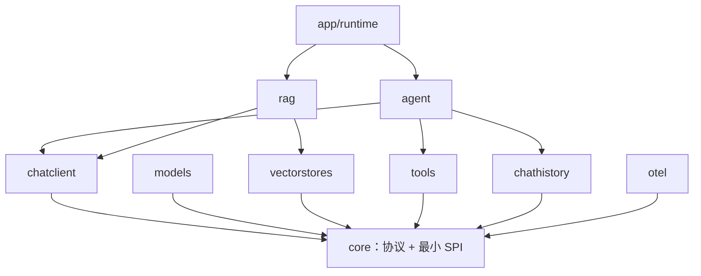
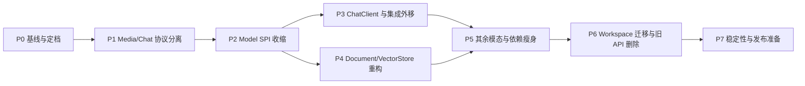

# Core 架构演进执行计划

> 状态：执行中（P3 高层运行时外移）
> 建立日期：2026-07-13
> 最后更新：2026-07-14
> 维护者：Lynx 仓库维护者
> 适用范围：`core` 及所有直接消费其公开 API 的 workspace 模块

本文档是 Core 长期架构演进的唯一执行基准，负责同时记录目标、边界、阶段、任务、验收标准、进度、风险和设计决策。实施过程中如发现本文与临时代码便利性冲突，以本文为准；如确需改变方向，必须先更新“决策记录”，再修改代码。

治理原则以 [`../CLAUDE.md`](../CLAUDE.md)、[`../DESIGN_PHILOSOPHY.md`](../DESIGN_PHILOSOPHY.md) 和 [`../REFACTORING.md`](../REFACTORING.md) 为上位约束。本文负责把这些原则落实为 Core 的具体执行路径。P0-05 裁决前，现有上位文档继续有效；本文提出但与现行规则冲突的目标只能视为提案，必须在 P0-06 一次性同步治理文档后才能实施，禁止选择性忽略任一规则。

---

## 1. 背景与问题定义

Lynx Core 最初参考并移植 Spring AI。领域抽象本身大多成立，但移植过程中发生了两类结构性偏移：

1. Spring AI 的 `model`、`client-chat`、`vector-store` 等独立层被部分压入同一个 Go `core`。
2. Java 默认方法、Builder、继承式接口、`Object` 扩展点和运行时框架能力被翻译为 Go 的强制接口、`WithXxx` 链、`any` 字段和 Core 内置行为。

由此产生的主要问题：

- Core 同时承担协议、SPI、客户端门面、工具运行时、历史、评估、安全和可观测性。
- provider 实现必须满足 Call、Stream、DefaultOptions、Metadata 等复合能力。
- Chat Request 混合可序列化模型协议、middleware 状态和不可序列化工具闭包。
- Chat Response 混合 provider 响应与 tool-loop 合成事件，并丢弃多 choice 数据。
- Document 同时承担数据、检索结果、ID 生成和格式化行为。
- VectorStore 有高层语义价值，但公共能力接口仍偏胖，且暴露 `NativeClient any`。
- Core 直接依赖 OTel、tokenizer、cast、UUID 等上层或实现型依赖。
- Filter 将 lexer、token、parser、visitor 等实现细节暴露为公共包。

本次演进不是机械拆目录，而是重新建立协议、运行时和集成层之间的稳定边界。

---

## 2. 总目标

### 2.1 一句话目标

> Core 成为 Go 世界里的 AI protocol library；`chatclient`、`documentpipeline`、`rag`、`agent`、`tools`、`otel` 等模块成为按需组合的 framework 层。

### 2.2 目标状态

Core 只保留以下三类内容：

1. 跨 provider 稳定共享的领域词汇和可序列化协议。
2. 消费方真正需要的最小调用能力接口。
3. 无全局状态、无外部 I/O 策略的纯组合与语义操作。

最终应达到：

- Core 不知道 ChatClient、Agent、RAG pipeline、Tool loop、History backend 或 OTel SDK。
- provider adapter 只实现自己真实支持的能力。
- Request/Response 可独立 JSON round-trip，不携带闭包和运行时对象。
- 高层能力通过小接口、函数组合和独立模块形成，不通过继承式框架形成。
- Core 生产代码默认只依赖 Go 标准库；任何例外必须有明确 ADR。
- 公开包扁平、领域命名明确，不出现 `core/model/chat` 这类无必要层级。
- 所有破坏性变更一次完成并删除旧实现，不长期维护双轨 API。

其中“Core 仅标准库、OTel 埋点全部外移”是本计划的推荐目标，但它改变了当前根 `CLAUDE.md` 和 `doc/OBSERVABILITY.md` 要求 Core 直接 import OTel API 的治理决策。该项必须在 P0-05 明确选择，在 P0-06 同步全部治理文档；未裁决前不得进入 P1。

### 2.3 成功指标

| 指标 | 当前基线 | 目标 |
|---|---:|---:|
| Core 生产代码直接外部依赖 | 9 个左右 | 0；例外必须 ADR |
| Chat provider 强制能力 | Call + Stream + DefaultOptions + Metadata | Call；其他能力独立 |
| Request 中不可序列化运行时字段 | 存在 | 0 |
| Core 内具体 middleware/integration | history/logger/safeguard/OTel 等 | 0 |
| Core 内 tool-loop/control-flow 类型 | 存在 | 0 |
| Filter 公共实现子包 | lexer/parser/token/visitors 等 | 仅稳定语义门面 |
| 公开包层级 | `core/model/<modality>` | `core/<modality>` |
| Workspace 全量测试 | 当前可通过 | 每阶段持续通过 |

指标中的“外部依赖”按生产代码 import 统计，测试专用依赖单独记录，不以 `go.mod` 行数直接判断。

---

## 3. 非目标

以下事项不属于本计划，除非通过决策记录正式扩展范围：

- 不重写所有 provider SDK 或底层 HTTP client。
- 不把公共 VectorStore 降级为只处理原始向量的数据库驱动。
- 不引入 DI 容器、自动扫描、注解、反射式生命周期或 Spring 风格 Bean 系统。
- 不建立 `service/repository/controller/domain` 等横向分层包。
- 不为了抽象完整性提前设计尚无消费方的接口。
- 不在本轮同时改变仓库品牌、Git 历史或所有 module path。
- 不把 retry、circuit breaker、OAuth、缓存等策略重新塞入 Core。
- 不以性能优化为主要目标；没有基准数据时不做性能驱动的复杂化。

---

## 4. 不可违反的设计约束

### 4.1 协议与运行时分离

- 通过 `Validate` 的 Core DTO 必须能稳定序列化；所有 Model/VectorStore Call 边界先验证请求，不能把编码失败推迟到 provider SDK 内部。
- 协议 Metadata 统一使用 `metadata.Map`（底层为 `map[string]json.RawMessage`）；写入时立即编码并返回错误，不允许任意运行时对象滞留到 Marshal 时才失败；所有 DTO 的 `Validate` 必须沿对象树验证其持有的每个 Metadata。
- 工具执行函数、provider native client、logger、tracer、registry 等运行时对象不得进入协议 DTO。
- `context.Context` 负责取消、截止时间、trace 和请求范围值，不进入持久化结构。
- 需要跨 middleware 修改的状态使用上层明确的 Invocation/Event 类型，不污染 provider Request。

### 4.2 接口由消费方需求决定

- 一个接口默认保持 1–3 个方法。
- Call、Stream、Dimensions、DeleteByID 等能力分别建模。
- 不通过胖 `Store` 或胖 `Model` 强迫实现者提供不支持的能力。
- 接收小接口，返回具体类型。

### 4.3 泛型只用于算法复用

- 删除用于模拟 Java 泛型层次的 `Model[Request, Response]`、`StreamingModel[...]` 名义基类。
- 泛型可用于 Call/Stream middleware 的公共组合算法、slice/iterator 处理等真实重复算法。
- 不建立泛型 base service、repository、manager 或 builder。

### 4.4 零值与错误

- `Options{}` 表示使用 model/provider 默认配置，是合法值。
- Request 在 I/O 边界显式 `Validate`，非法配置返回错误，不静默忽略。
- provider 响应允许 metadata 缺失，不要求为了构造对象伪造非空 metadata。
- 错误使用 `errors.New`、`errors.Is/As` 和 `fmt.Errorf("...: %w", err)`；不把异常式控制流放在 Core。

### 4.5 扩展机制收敛

- 跨调用行为统一使用函数式 middleware/decorator。
- provider 特有请求字段只保留一个受控、可序列化的 Extensions 逃生舱。
- 不同时引入 Advisor、Hook、Interceptor、Listener、Plugin 等多套同义机制。

### 4.6 严格依赖 DAG



任何 Core 对上述上层模块的反向 import 都视为架构缺陷。

---

## 5. 目标包结构

本轮保留 `github.com/Tangerg/lynx/core` module path，避免把 module 发布策略与语义重构混为一件事；包路径从 `core/model/<modality>` 扁平为 `core/<modality>`。

```text
core/
├── model/          仅保留跨模态的纯调用/流组合算法和真正共享值
├── chat/           Message/Part、Request/Response、Model/Streamer
├── embedding/      embedding 协议和最小 Model
├── image/          image 协议和最小 Model
├── transcription/  audio-to-text 协议和最小 Model
├── speech/         text-to-speech 协议和最小 Model
├── moderation/     moderation 协议和最小 Model
├── metadata/       JSON-safe metadata.Map 及编码/解码 helper
├── media/          明确建模的媒体引用/字节载荷
├── document/       纯 Document 数据和最小 reader/writer 词汇
├── vectorstore/    高层语义索引/检索能力和 SearchRequest/Match
│   └── filter/     稳定 Expr 门面；解析实现放 internal
└── internal/arch/  DAG、依赖预算和公共面守卫
```

Core 中不得存在以下目录或等价职责：

- `chat/client*`
- `chat/history`
- `chat/middleware/logger`
- `chat/middleware/safeguard`
- `evaluation`
- tool executor/schema reflection
- agent/tool-loop control flow
- OTel tracer/meter 实现
- provider pricing/catalog/registry
- tokenizer 实现

---

## 6. 目标公共契约

本节是方向性 API 基准。实施时允许调整具体字段名，但不得改变职责边界；任何职责变化必须先写入第 15 节决策记录。

### 6.1 模型能力

每个 modality 在自己的包中声明最小接口：

```go
type Model interface {
    Call(context.Context, *Request) (*Response, error)
}

type Streamer interface {
    Stream(context.Context, *Request) iter.Seq2[*Response, error]
}
```

规则：

- `Model` 不强制嵌入 `Streamer`。
- `DefaultOptions` 不属于 Model；provider 构造函数和上层 client 分别持有自己的默认值。
- provider 名称不通过 `Metadata()` 强迫实现；观测 wrapper 在构造时显式接收属性。
- Embedding dimensions 是可选 `Dimensioner` 能力或纯 helper，不得同时强制接口实现并维护全局探测缓存。

阶段归属只有一种解释：P2 只在 `core/chat` 落地上述 SPI；`embedding` 的 `Dimensioner`、dimensions cache 和其余 modality 的目标包/API 全部由 P5 建立与迁移。P2 不提前创建这些 top-level modality 包。

### 6.2 Chat Request

```go
type Request struct {
    Messages   []Message
    Tools      []ToolDefinition
    Options    Options
    Extensions map[string]json.RawMessage
}
```

规则：

- 不包含 `Params map[string]any`。
- 不包含可执行 Tool、registry 或闭包。
- `Options{}` 合法，model 字段只是可选 per-request override。
- `ToolDefinition.InputSchema` 使用明确 JSON 表达，不存执行函数。
- Extensions 必须 namespaced、可序列化，并由 provider adapter 验证。

### 6.3 Metadata 与 Media

跨协议对象共享的 metadata 使用已经编码的 JSON value：

```go
type Map map[string]json.RawMessage
```

- `metadata.Set(m, key, value)` 在写入时执行 JSON 编码并返回错误。
- `metadata.Decode` 负责按目标具体类型读取，不通过 `any` 延迟类型判断。
- 直接 map 赋值只能接受 `json.RawMessage`，因此函数、reader 和 SDK client 无法误入 DTO。
- `metadata.Map.Validate` 遍历每个 key/value，并用 `json.Valid` 验证整段 RawMessage（包括其嵌套 JSON 语法）；`MarshalJSON` 必须先调用 `Validate`。持有 Metadata 的 DTO `Validate` 还要递归验证 Message、Part、Media 等子对象，不能只验证顶层 map。
- Round-trip 保证指 JSON wire 语义稳定，不承诺不同 Go 数值类型之间的动态类型等价。

Media 使用显式 tagged source，不再承诺任意 Go 对象：

```go
type Media struct {
    MIME     string
    Source   MediaSource
    ID       string
    Name     string
    Metadata metadata.Map
}

type MediaSource struct {
    Kind  SourceKind
    Bytes []byte
    URI   string
    Ref   string
}
```

- `Kind` 决定 Bytes、URI、Ref 中唯一有效字段；`Validate` 拒绝多值或缺值。
- `io.Reader`、文件句柄和 SDK 对象由调用方在进入协议前读取/转换。
- Bytes 使用明确的 JSON 编码，URI 和 provider reference 保持字符串语义。
- Media 与 Chat golden fixture 同阶段冻结，避免 Message wire format 二次破坏。

### 6.4 Message 与 Part

目标采用显式 tagged value，而不是依赖 sealed interface + 自定义多态反序列化：

```go
type Message struct {
    Role     Role
    Parts    []Part
    Metadata metadata.Map
}
```

- `Role` 和 `Part.Kind` 是显式 discriminator。
- User、System、Assistant、ToolResult 通过构造 helper 创建普通值。
- provider adapter 对未知 role/part 返回可诊断错误。
- Metadata 在跨 provider 边界前验证为约定的 JSON-safe 值。

### 6.5 Chat Response

```go
type Response struct {
    ID         string
    Model      string
    Choices    []Choice
    Usage      Usage
    Extensions map[string]json.RawMessage
}
```

- 保留 provider 返回的全部 choice，不静默丢弃。
- 提供 `First`、`Text` 等 nil/empty-safe 便利函数。
- Tool execution result、pause/resume、round boundary 不混入 Chat Response。
- 流式和非流式共享同一语义模型；聚合器是纯函数/显式 accumulator。

### 6.6 Tool 定义与执行

Core/chat 只保留模型可见的 `ToolDefinition`、`ToolCall`、`ToolResult` 消息词汇。

`tools` 持有：

- Executor
- typed input decode/output encode
- JSON Schema 生成
- Registry

`agent/toolloop` 持有：

- approval/HITL
- 普通错误回传、return-direct 和 loop policy；禁止增加自动 retry layer
- pause/resume/control-flow error

上层 `Invocation` 将 `chat.Request` 与工具 registry 组合，但二者不互相嵌套。

### 6.7 Document

```go
type Document struct {
    ID       string
    Text     string
    Media    *media.Media
    Metadata metadata.Map
}
```

- Score 从 Document 移到 vectorstore.Match。
- Formatter 是外部纯函数/策略，不是 Document 字段。
- ID generator 是 ingestion/indexing helper，不是 DTO 隐式行为。
- 文本/媒体组合规则由 `Validate` 明确，不依赖构造器副作用。

### 6.8 VectorStore

VectorStore 保持“输入 Document/查询文本、内部组合 embedding”的 AI 应用级语义，不降级成 raw vector 公共 API。

```go
type Indexer interface {
    Add(context.Context, []*document.Document) error
}

type Searcher interface {
    Search(context.Context, SearchRequest) ([]Match, error)
}

type IDDeleter interface {
    DeleteIDs(context.Context, []string) error
}

type FilterDeleter interface {
    DeleteWhere(context.Context, filter.Expr) error
}
```

- 不要求所有实现满足胖 `Store`。
- SearchRequest 使用普通 struct + Validate，不使用会吞掉非法输入的 fluent With 链。
- 删除 `NativeClient any`；provider-specific 操作由具体实现类型或 provider 包显式暴露。
- Filter 对外只暴露语义 Expr、构造函数和 Parse；lexer/parser/token/analyzer/optimizer 进入 `internal`。

### 6.9 Middleware

- 保留 `func(next) next` 的 Go 装饰器形态。
- Core 只提供类型和纯 `ChainCall/ChainStream` 组合算法。
- 不保留带 Clone/With 状态的 MiddlewareChain builder，除非消费代码证明其必要性。
- concrete history/safeguard/OTel middleware 位于上层模块。
- 不保留通用 request/response Logger middleware：调用观测由 `otel` wrapper 的 span/metric 承担，应用只在生命周期、显式审计或无法归属到 span 的边界事件写日志。未来如需审计日志，必须以独立语义和 ADR 建模，不能复用调试型 Logger middleware。

---

## 7. 职责迁移表

| 当前职责 | 目标位置 | 处理方式 |
|---|---|---|
| `core/model/chat/Client*` | 新 `chatclient` module | 重写为直接调用 + 少量便利 API |
| PromptTemplate / StructuredParser | `chatclient` | 作为高层请求/输出便利能力，不进入协议层 |
| Chat history 接口与实现 | `chathistory` | 消费方声明最小接口 |
| History middleware | `chathistory` 集成包 | 包装 chatclient/core handler |
| request/response Logger middleware | 删除 | 观测统一由 `otel` wrapper 的 span/metric 承担，不与 `slog` logger 形成双轨 |
| Safeguard middleware | `chatclient/middleware/safeguard` | 作为可选 ChatClient decorator；Agent 可消费但不拥有定义 |
| Evaluation | `rag/evaluation` | 当前事实性/相关性评估属于 RAG，不属于模型协议 |
| 可执行 Tool / schema reflection | `tools` | Core 只留 Definition/Call/Result 词汇 |
| Tool loop / Halt / ControlFlowError | `agent/toolloop` | 作为运行时 Event/状态机 |
| Chat/Embedding tracing 与 metrics | `otel` | 显式 wrapper/middleware |
| tokenizer/tiktoken | 新 `tokenizer` module；tiktoken 为其实现包 | Core 不绑定 tokenizer 实现 |
| pricing/catalog/capabilities registry | `models/catalog` | provider/model 特有信息不属于 provider-neutral SPI |
| APIKey 动态抽象 | 各 `models/<provider>` 配置 | Core 不统一密钥刷新或认证策略 |
| Document formatter/transformer/batcher/ID generator 实现 | 新 `documentpipeline` module | Core DTO 保持纯数据；`rag`、`vectorstores` 等消费方各自声明所需窄接口 |
| VectorStore implementation | `vectorstores` | Core 只留能力契约 |
| Filter lexer/parser/analyzer/optimizer | `vectorstore/filter/internal` | 保留公共 Expr 门面 |

---

## 8. 执行策略

### 8.1 总体顺序



### 8.2 提交纪律

- 每个可独立验证的迁移批次一个逻辑提交；禁止混入无关格式化。一个任务可以包含多个批次，只有全部批次完成后才勾选任务。
- provider/backend/workspace 全量任务在标记“进行中”前，必须从 P0 清单展开逐项子清单；每个子项记录 commit、测试证据和剩余数量。
- 先建立新契约和测试，再迁移实现，最后删除旧 API。
- 对于 package path 变化的能力，P1–P5 允许目标新包与旧包限时并存；旧 API 冻结，只接受迁移所需修复，不增加能力。
- 对于 package path 不变的原地类型变更，必须在所属阶段完成全 workspace 纵向迁移，并在该阶段退出前删除临时字段/bridge，不能拖到 P6。
- 临时 bridge/shim 必须登记来源、消费方和删除阶段；不得成为对外承诺，也不得超过对应截止点。
- Reference implementation 用于先证明新契约；是否全量迁移由第 8.3 节按路径类型裁决，不能一概推迟到 P6。
- 每次修改 exported API 前更新本文进度和影响面。
- 阶段完成前运行该阶段规定的全部验证命令。
- 如果发现目标设计不成立，停止扩散修改，记录决策和证据后再继续。

### 8.3 两种迁移模式

| 模式 | 适用范围 | 执行方式 | 删除截止点 |
|---|---|---|---|
| 新路径并存 | `core/model/chat → core/chat`、其他 modality 扁平化、独立 `chatclient` | 先建新包并迁 reference；旧包冻结，P6 迁剩余消费者 | P6 |
| 同路径纵向切片 | `core/media`、`core/document`、`core/vectorstore` 等 import path 不变的结构修改 | 可短暂增加兼容字段/bridge 维持编译，但所属阶段必须迁完所有消费者并删除旧面 | 所属阶段 |

执行者在开始任务前必须标明使用哪种模式。若无法判断，按同路径纵向切片处理，不能默认把债务推迟到 P6。

---

## 9. 分阶段任务与验收标准

状态词：`未开始`、`进行中`、`阻塞`、`完成`、`取消`。只有满足任务证据和阶段退出标准才能标记完成。

### P0：基线、决策与安全网

目标：在修改公开 API 前冻结可验证基线，明确破坏性变更边界。

- [x] **P0-01 建立本执行计划**（完成：2026-07-13）
  - 证据：本文档及 `doc/README.md` 索引。
- [x] **P0-02 完成 Core/Spring AI 结构差分审计**（完成：2026-07-13）
  - 证据：本文第 1、7、15 节记录 Model、ChatClient、Advisor、Document、VectorStore、Tool、Filter 的来源、目标归属与决策。
- [x] **P0-03 导出公共 API 清单和外部消费清单**（完成：2026-07-14）
  - 证据：[`CORE_API_INVENTORY.md`](./CORE_API_INVENTORY.md)；24 个公共 package、1,205 个 exported identifiers、501 个唯一消费文件/830 条 direct-import 关系、38 个 model provider 和 27 个 vectorstore backend 均已登记。
- [x] **P0-04 固化测试与依赖基线**（完成：2026-07-14）
  - 证据：[`CORE_BASELINE.md`](./CORE_BASELINE.md)；17 个 workspace module 的 68 项 build/vet/test/lint 全绿，6 个目标 module race 全绿，coverage 与 16 个 direct non-stdlib import path 已记录。
  - `scripts/check.sh` 已移除过期 `chatmemory`/`lyra`，改为以 `go.work` 主 module 为事实来源，并拆分普通 test/race 语义。
- [x] **P0-05 确认破坏性变更批次**（完成：2026-07-14）
  - 授权证据：维护者要求按本文持续推进直到全部完成；采用本文推荐的协调 v0 breaking batch 与 ADR-006 OTel 外移方案。
  - 发布事实：仓库当前没有 tag，Core 由 `v0.0.0-*` pseudo-version 消费；推荐执行一次协调的 v0 breaking batch，不引入无意义的 `/v2` module path，也不维护长期双轨。
  - 破坏范围：Media/Document/VectorStore 同路径类型变更；`core/model/<modality>` 扁平化；ChatClient/history/tool runtime/evaluation/tokenizer/OTel 职责外移；删除旧 builder、胖接口、任意 `any` 扩展和具体 middleware。
  - Workspace 影响：501 个唯一文件、830 条 Core package direct-import 关系；重点包括 38 个 model provider、27 个 vectorstore backend 和 9 个直接消费旧 `core/model/*` 的 module。迁移由本计划分阶段完成，不把兼容责任推给调用方。
  - 破坏策略备选：
    1. 推荐：批准上述一次协调的 v0 breaking batch；新路径限时并存到 P6，同路径纵向切片在所属阶段删除旧面。
    2. 不推荐：逐项 deprecate/长期 shim；会与仓库“不留历史债务”规则及本计划退出标准冲突，若选择必须先重写计划。
  - 同时裁决可观测性边界，二选一并记录到 ADR-006：
    1. 推荐：Core 生产代码仅标准库；`otel` module 直接使用 OTel API 并包装 Core handler，不增加自造 tracer/meter 抽象。
    2. 保守：Core 保留 OTel API 依赖；先修订本文的依赖指标、P3/P5/P6 任务和退出标准，再开始实现。
  - 必须由维护者明确确认后才能进入 P1 实现。
- [x] **P0-06 建立架构守卫并同步治理规则**（完成：2026-07-14）
  - Core 不得 import 上层模块。
  - 记录生产依赖预算。
  - 为目标包结构建立 allowlist 测试。
  - 在进入 P1 前同步更新根 `CLAUDE.md`、`core/CLAUDE.md`、`doc/OBSERVABILITY.md` 与相关 README：移除 sealed Message、泛型名义骨架和旧包路径等冲突，并按 ADR-006 统一 Core/OTel 依赖边界。
  - 若选择推荐 OTel 方案，文档必须明确 `otel` wrapper 直接使用官方 OTel API、不建立 `core/observation` 或自造 tracer/meter 接口，并删除“Core 直接 import OTel”的旧结论。
  - 若选择保守 OTel 方案，先让本文所有“仅标准库/零外部依赖/OTel 全外移”指标与任务改为一致口径；不得留下互斥验收标准。
  - 标明“新路径并存 / 同路径纵向切片”规则及各自删除截止点。
  - 证据：根/core/otel `CLAUDE.md`、`doc/OBSERVABILITY.md` 与 README 已同步；`core/internal/arch` 对上层反向 import、临时外部依赖预算和公共 package allowlist 建立自动守卫。
  - 验证：`MODULE=core scripts/check.sh build vet test lint` 与 `MODULE=core scripts/check.sh race` 全绿。

退出标准：

- 当前测试基线有可复现记录。
- 所有高影响 exported API 有消费方清单。
- 破坏性变更授权已确认。
- 架构守卫在旧结构上可运行，并允许逐阶段收紧。
- 根 `CLAUDE.md`、`core/CLAUDE.md`、`doc/OBSERVABILITY.md` 与本文一致，实施者不会同时面对互相冲突的治理规则。

### P1：Media/Chat 协议与运行时分离

目标：先切开最核心的协议/执行边界，避免后续迁移继续依赖混合模型。

- [x] **P1-01 定义新的 `core/metadata` 与 `core/media` 叶子协议**（完成：2026-07-14）
  - Metadata 使用 `map[string]json.RawMessage`，写入 helper 在边界立即返回编码错误。
  - 明确 bytes、URI 和 provider reference 的互斥关系与 JSON discriminator。
  - 删除协议层对任意 `Data any` 和 `io.Reader` 的承诺。
  - 这是同路径纵向切片：本任务必须迁移全部 Media 消费方，并在 P1 退出前删除旧 `Data any`。
  - 证据：新增 `core/metadata.Map`、写时编码/typed decode/递归 JSON 校验与 `core/media` tagged source；bytes 构造和读取均防御性复制，URI 要求绝对资源标识，provider reference 保持独立语义。
  - 迁移：Core tokenizer/transcription、运行时 wire 入站边界、OpenAI/Anthropic/Google/Bedrock/Ollama 及全部 audio provider 已切换；全 workspace 检索确认 `NewMedia`、`DataAsBytes`、`DataAsString`、`MimeType`、Media `Data any` 均为 0。
  - 验证：metadata/media coverage 分别为 91.7%/92.9%；`scripts/check.sh build vet test lint` 68/68 全绿。
- [x] **P1-02 定义新的 `core/chat` Message/Part tagged value**（完成：2026-07-14）
  - 覆盖 system/user/assistant/tool result、text/media/reasoning/tool call。
  - 明确 Validate 和 JSON discriminator。
  - 采用新路径并存模式：本任务只建立无运行时对象的值协议与测试；旧 `core/model/chat` 冻结到 P6，provider reference mapping 在 P1-07 完成。
  - 证据：`Message{Role, Parts, Metadata}` 和普通 `Part` tagged value 覆盖 4 种 role、5 种 part kind；role/part 兼容矩阵、payload 互斥、嵌套 Media/Metadata 与未知 discriminator 均递归校验。
  - ToolCall Arguments 保留 provider JSON 文本语义，使流式片段与模型产生的 malformed JSON 仍可无损序列化；可信解码留给 `tools` 运行时边界。
  - 验证：`core/chat` coverage 94.9%；Core build/vet/test/lint 与 race 全绿。
- [x] **P1-03 定义新的 Chat Request/Options**（完成：2026-07-14）
  - 移除 Params 和可执行 Tool。
  - Options 零值合法。
  - 仅保留一个 JSON-safe Extensions。
  - Extensions key 使用 `namespace/name` 格式；provider adapter 只读取自己的 namespace，写入通过即时 JSON 编码 helper 完成。
  - 证据：`Request` 仅含 Messages、ToolDefinition、Options 和 `metadata.Map` Extensions；公开 DTO 字段反射守卫确认无 interface，ToolDefinition 的 InputSchema 在边界校验为 JSON object。
  - Options 零值合法并从 Request wire 省略；显式采样参数执行范围/NaN/Inf 校验，model 仅为可选 per-request override。
  - 验证：`core/chat` coverage 93.8%；Core build/vet/test/lint 与 race 全绿。
- [x] **P1-04 定义新的 Chat Response/Choice**（完成：2026-07-14）
  - 保留多 choice。
  - 提供 First/Text 等便利函数。
  - 不含 tool-loop synthetic result。
  - Response 零值可表示流中的无内容/仅 usage chunk；Choice 用 Index 保持 provider 顺序身份，Message 可空以承载仅 finish reason 的终止 chunk。
  - 证据：Response 公开字段守卫锁定为 ID/Model/Choices/Usage/Extensions；Choice 递归限制为 assistant Message，finish reason 归一化，provider-native 值进入 namespaced extension。
  - Usage 使用 input/output 词汇和可选 reasoning/cache breakdown，无 `OriginalUsage any`；First/Text/Message.Text 对 nil 和空 choice 安全。
  - 验证：多 choice 顺序/索引及完整 JSON round-trip 已覆盖，`core/chat` coverage 94.4%；Core build/vet/test/lint 与 race 全绿。
- [x] **P1-05 建立 serialization golden/fuzz tests**（完成：2026-07-14）
  - 覆盖 metadata 非法 RawMessage、media、全部 message/part、未知 discriminator、空值和 extensions。
  - Golden fixture 直接冻结 metadata、三种 Media source、完整 Request 和多 Choice Response 的可读 JSON；fuzz 使用“成功解码后 Validate + Marshal + 再解码的 canonical wire 必须达到 fixed point”属性。
  - 证据：新增 metadata、三种 Media source、覆盖全部 role/part 的完整 Request 和多 Choice Response golden fixtures；分别为 `metadata.Map`、`media.Media`、Part、Message、Request、Response 建立 6 个 JSON fixed-point fuzz 入口。
  - 验证：6 个 fuzz 入口分别运行 2 秒并通过；metadata/media/chat coverage 分别为 91.7%/92.9%/94.4%；Core build/vet/test/lint 与 race 全绿。
- [x] **P1-06 在 `agent/toolloop` 建立 Invocation/Event 原型**（完成：2026-07-14）
  - 同一任务批次先在 `tools` 建立最小可执行 `Tool` 契约和具体 `Registry`，在 `agent/toolloop` 声明消费方窄 `ToolResolver` 接口；`tools.Registry` 满足该接口，依赖方向只能是 Agent → Tools → Core。
  - Invocation 组合 Request 与 `ToolResolver`，不直接依赖 registry 具体类型。
  - Event 表达 model/tool/pause/resume，不污染 Chat Response。
  - 证据：根 `tools` 包新增两方法 `Tool` 与实例级 `Registry`；注册批次全有或全无、拒绝 nil/重复/非法 definition，Definitions 防御性复制并稳定排序，无全局 registry。
  - 边界：`agent/toolloop.ToolResolver` 只有 Resolve；编译期断言确认 `tools.Registry` 满足接口，`go list` 确认新路径为 Agent → Tools → Core。Invocation 验证 advertised tool 均可执行并主动拒绝 JSON 序列化。
  - 事件：serializable tagged Event 覆盖 model request/response、tool call/result、pause/resume 六类边界，严格限制单一 payload；Chat Response 反向守卫确认无运行时字段。
  - 验证：根 tools coverage 92.3%，agent/toolloop coverage 77.4%；Tools/Agent build/vet/test/lint 与目标 race 全绿。
- [x] **P1-07 选择四个差异 provider 做映射验证**（完成：2026-07-14）
  - OpenAI、Anthropic、Google、Ollama。
  - 证明新协议不丢失当前支持能力。
  - 证据：新增 [`CORE_CHAT_PROVIDER_MAPPING.md`](CORE_CHAT_PROVIDER_MAPPING.md) 与 `models/internal/chatconformance` 的 8 份 request/response golden fixtures；覆盖多 choice/candidate、reasoning signature、redacted reasoning、audio/media、tool error、确定性 synthetic tool-call ID、cache/reasoning usage 和四家 namespaced extensions。
  - 边界：本任务冻结迁移后的 Core wire 和 loss policy，不提前切换生产 adapter；P2-06 必须让四家真实 SDK fixture 产出与本基线等价的 Core 值。
  - 验证：四 provider mapping conformance 与 race 通过；Models build/vet/test/lint 全绿。

退出标准：

- 新 Media/Chat DTO 可独立 round-trip。
- 全 workspace 已切换新 Media；旧 `Data any` 和临时兼容字段已删除。
- 新 `core/chat.Request` 中无闭包、registry、native client 或 middleware context；冻结旧 Request 登记到 P6。
- 四个基准 provider 可无损映射。
- tool-loop 事件不再要求扩展 Chat Response。

阶段验收（完成：2026-07-14）：`scripts/check.sh build vet test lint` 全 workspace 68/68 通过；metadata/media/Part/Message/Request/Response 六个 fuzz 入口各运行 30 秒通过；Core、Agent、Tools 全模块 race 通过。

### P2：Chat Model SPI 收缩与调用组合

目标：先让 Chat provider 只实现真实能力，移除 Java 默认方法造成的强制接口；其余 modality 明确留到 P5，避免阶段重叠。

- [x] **P2-01 在 `core/chat` 定义单方法 Model 接口**（完成：2026-07-14）
  - 证据：新增 `Model`，唯一方法为 `Call(context.Context, *Request) (*Response, error)`；文档明确实现必须在 provider I/O 前验证 Request，stream/default configuration/provider identity 均不属于该接口。
  - 守卫：compile-time case 证明只实现 Call 的 provider 可满足 Model；反射测试锁定单方法及完整签名，防止接口重新变胖。
  - 验证：Core build/vet/test/lint 与 race 全绿。
- [x] **P2-02 将 Chat Streamer 拆为独立可选能力**（完成：2026-07-14）
  - 证据：新增独立单方法 `Streamer`，签名为 `Stream(context.Context, *Request) iter.Seq2[*Response, error]`；不嵌入 Model，Model 也不嵌入 Streamer。
  - 守卫：stream-only provider 编译满足 Streamer；反射测试锁定方法数量和完整签名，证明同步/流式能力可独立实现。
  - 验证：Core build/vet/test/lint 与 race 全绿。
- [x] **P2-03 从 Chat Model SPI 移除 DefaultOptions/Metadata 强制方法**（完成：2026-07-14）
  - 证据：目标 Model/Streamer 均无 DefaultOptions、Metadata 或嵌入接口；新增 AST 架构守卫，禁止两个 SPI 增加非白名单方法、嵌入其他接口或在目标包重新引入 `ModelMetadata`。
  - 冻结：新增 [`CORE_LEGACY_REMOVAL.md`](CORE_LEGACY_REMOVAL.md)，登记旧复合 Model、混合 Request/Response 与 Core Chat framework 表面的替代路径、迁移任务和 P6 删除验收。
  - 验证：Core build/vet/test/lint 与 race 全绿。
- [x] **P2-04 让 `core/chat` 停止使用泛型 Model/StreamingModel 名义层次**（完成：2026-07-14）
  - 只冻结旧 `core/model/chat` 包并登记 P6 删除；P2 不创建 embedding/image/audio/moderation 目标包。
  - 证据：目标 `core/chat` 的 Model/Streamer 为具体 Request/Response 契约，无 type parameter、无 embedded interface、无 `core/model` import；架构测试对三项建立自动守卫。
  - 范围：旧 `core/model` 和 `core/model/chat` 继续只为 workspace 迁移保留，已由 `CORE_LEGACY_REMOVAL.md` 登记 P6-05 删除；本任务未提前创建 P5 modality 包。
  - 验证：Core build/vet/test/lint 与 race 全绿。
- [x] **P2-05 保留并简化 Chat 的泛型 Call/Stream middleware 组合算法**（完成：2026-07-14）
  - 证据：新增 stdlib HandlerFunc 风格的 `ModelFunc`/`StreamerFunc`、函数型 CallMiddleware/StreamMiddleware 与 `Wrap`/`WrapStream`；删除目标用户面上的泛型 Chain builder。
  - 泛型边界：唯一泛型是未导出的 `compose` 包装算法，真实复用 Call/Stream 的 outermost-first 组合，不建立名义层次或公共泛型 API。
  - 验证：覆盖 adapter 委托、错误透传、call/stream 顺序、nil middleware、输入 slice 变更隔离和空链；`core/chat` coverage 94.5%，Core build/vet/test/lint/race 全绿。
- [x] **P2-06 为四个 reference provider 建立 compile-time 和行为 conformance suite**（完成：2026-07-14）
  - Harness 位于 `models/internal/conformance`，由各 provider 测试传入具体构造函数；Core 不 import provider。
  - 结果：provider-neutral ChatSuite 覆盖 Call/Stream 的构造、请求/响应递归校验、非空 yield 和 Request 不可变性；OpenAI、Anthropic、Google、Ollama 的新 `Chat` adapter 均直接实现目标 Core SPI，对应 legacy adapter 保持冻结。
  - OpenAI 证据：真实 `openai-go` mock wire conformance 覆盖多 choice、native extension、多模态、reasoning/usage 映射和流式 tool-call 稳定身份。
  - Anthropic 证据：真实 SDK mock wire 覆盖 content block 保序、thinking signature/redacted replay、image/PDF、tool error、自动 cache breakpoint 与 SSE 多事件状态；原生 fresh/cache-read/cache-create 三段输入归一化为 Core 总输入，原始计数留在 extension。
  - Google 证据：真实 `genai` mock wire 覆盖全部 candidates、Thought/ThoughtSignature、safety、bytes/URI media、FunctionResponse 与 snake_case native extension；Call/Stream 对无原生 ID 的 tool call 都生成确定性 `google/<choice>/<part>`，prompt/tool-use 与 candidate/thought 分段 usage 归一化为 Core 总量。
  - Ollama 证据：真实 native SDK NDJSON mock wire 覆盖 reasoning → text → tool 的规范顺序、bytes image、tool/result、`keep_alive`/`format`/`think`/原生 options、created_at/duration/metrics；Call/Stream 对无原生 ID 的 tool call 生成稳定 `ollama/<choice>/<part>`，并在 provider I/O 前显式拒绝 reasoning signature、URI image 和非对象 tool arguments。
  - 验证：Models build/vet/test/lint 全绿；四 provider conformance 及 Ollama/internal conformance 目标 race 全绿。
- [x] **P2-07 固化 Chat Call/Stream 行为契约**（完成：2026-07-14）
  - 覆盖 context cancel、调用方提前停止、首个错误终止、无 goroutine 泄漏和流式聚合语义。
  - Core 契约：Model/Streamer godoc 明确 context error identity、单一终止错误、调用方停止时同步释放资源、禁止 detached goroutine，以及 Usage 为累计快照而非增量。
  - 聚合：新增零值可用的显式 `ResponseAccumulator`；按 choice index 保留首次出现顺序，合并相邻 text/reasoning，并按稳定 tool-call ID 聚合并行参数 delta；identity/finish 取最后非空值，metadata last-write-wins，最后一份非零 Usage 快照生效。Add 先复制再合并，失败原子回滚，输入 chunk 与输出 snapshot 均不别名。
  - 行为 conformance：四 provider 的真实 SDK transport 均验证进行中 Call/Stream 取消、读一个 chunk 后提前停止、首个 malformed event 后终止；测试同步等待消费 goroutine 和服务端 request context 退出，以证明无遗留执行单元。
  - 聚合 conformance：四家 happy stream 自动进入同一 accumulator 并断言最终 reasoning/text/signature/tool/usage；由此发现并修正 OpenAI/Anthropic mock tool-arguments 多转义一层的问题，adapter 不做猜测性反转义。
  - 验证：`core/chat` coverage 95.1%；Core/Models build/vet/test/lint 和全模块 race 全绿。

退出标准：

- 只支持 Call 的 provider 无需实现 Stream。
- 目标 Core Model SPI 不携带默认配置和观测身份；冻结的旧包只为迁移保留。
- `core/chat` 新 API 无全局状态；旧 Chat helper 有明确的 P6 删除记录。
- 四个 reference provider conformance tests 通过；剩余 provider 在 P6 迁移。

阶段验收（完成：2026-07-14）：`scripts/check.sh build vet test lint` 全 workspace 68/68 通过；metadata/media/Part/Message/Request/Response 六个 fuzz 入口各运行 30 秒通过；Core、Models 全模块 race 通过。

### P3：ChatClient、middleware 实现和工具运行时外移

目标：把框架便利层从协议核心中拔出，并保持用户面可发现性。

- [x] **P3-01 建立独立 `chatclient` module**（完成：2026-07-14）
  - 模式：采用“新路径并存”；新 module 先建立稳定依赖方向，旧 `core/model/chat/client.go` 继续冻结并在 P6-05 删除。
  - 边界：`chatclient` 生产代码只允许标准库与 `core`，不得反向依赖 Models、Tools、History、Agent 或应用层；自动架构测试扫描全部非测试 Go 文件并拒绝越界 import。
  - 设计：本任务只建立真实 module 节点、包定位和依赖守卫，不提前发布无语义的占位 Client 接口；P3-02 在该边界内一次性形成直接调用面。
  - 验证：`chatclient` build/vet/test/lint 全绿；加入 `go.work` 后全 workspace 18 个 module 的 build/vet/test/lint 共 72 项全绿。
- [ ] **P3-02 设计直接调用优先的 Client API**
  - 不复制 Spring 嵌套 spec/builder。
  - 简单请求使用普通值；复杂初始化才用 functional options。
- [ ] **P3-03 将 prompt/template/structured output 迁入 `chatclient`**
- [ ] **P3-04 迁移 history contract 与 middleware 到 `chathistory`**
- [ ] **P3-05 迁移 safeguard/evaluation 并删除 Logger middleware**
  - safeguard 进入 `chatclient/middleware/safeguard`。
  - fact/relevancy evaluation 进入 `rag/evaluation`。
  - 删除通用 request/response Logger middleware；不在 `chatclient` 复制同等能力。
- [ ] **P3-06 迁移 tracing/metrics 到 `otel` wrapper**
  - 按已采纳 ADR-006 执行：目标新包不 import OTel，`otel` 直接包装 handler；冻结旧 client tracing 随旧包在 P6 删除。
- [ ] **P3-07 完成 Tool executor/schema/runtime helper 向 `tools` 的迁移**
  - 沿用 P1-06 已建立的 `tools.Tool`/`Registry` 和 `agent/toolloop.ToolResolver` 边界，不再建立第二套 registry。
  - 旧 Core 可执行 Tool 表面冻结，随剩余 provider/consumer 在 P6 删除。
- [ ] **P3-08 将 tool-loop/Halt/control-flow 迁入 `agent/toolloop`**
- [ ] **P3-09 更新用户示例和最小上手路径**

退出标准：

- 目标 `core/chat` 中不存在 ClientRequest fluent builder、具体 middleware、可执行 Tool 或 tool-loop。
- OTel 新实现已完全位于 `otel`；冻结旧 client 表面如仍存在，必须登记为 P6 删除项。
- `chatclient` 能完成同步、流式、模板、structured output 的常见路径。
- agent/toolloop 能通过 Event 表达工具执行和暂停恢复。
- 旧 Client/Tool runtime 表面可以在新路径迁移窗口内保留，但已冻结且登记为 P6 删除项。

### P4：Document、VectorStore 与 Filter 重构

目标：保留 AI 应用级语义，同时清除富对象和胖接口。

- [ ] **P4-01 将 Document 收缩为纯数据**
  - 移除 Score、Formatter、EnsureID 行为。
  - 建立 `documentpipeline` module，承接 formatter、transformer、batcher 和 ID generator 实现；`rag`/`vectorstores` 在消费包声明窄 Formatter/Batcher 接口。
  - 这是同路径纵向切片：允许阶段内短暂兼容字段，但 P4 退出前必须迁完全部消费者并删除旧行为。
- [ ] **P4-02 增加 vectorstore.Match**
- [ ] **P4-03 用 Indexer/Searcher/IDDeleter/FilterDeleter 替代胖 Store 要求**
- [ ] **P4-04 简化 Add/Delete 单字段 request wrapper**
  - 多参数搜索保留 SearchRequest。
- [ ] **P4-05 删除 NativeClient any**
- [ ] **P4-06 重写 SearchRequest 配置方式**
  - 普通 struct + Validate；非法值不静默忽略。
- [ ] **P4-07 收敛 Filter 公共门面**
  - Expr 和稳定节点/构造函数公开。
  - lexer/parser/token/analyzer/optimizer 进入 internal。
- [ ] **P4-08 迁移全部 vectorstore adapters**
  - 先以 `inmemory`、`pgvector`、`mongodb`、`qdrant` 作为 reference，再分批迁移其余实现。
  - 每个实现使用相同 conformance suite。
  - Harness 位于 `vectorstores/internal/conformance`，由各 backend 测试实例化；开始前从 `doc/CORE_API_INVENTORY.md` 展开完整 backend 子清单。
- [ ] **P4-09 迁移全部 RAG、vectorstore 和 document pipeline 消费方**

退出标准：

- Document 不携带检索关系和运行时行为。
- VectorStore 仍以 Document/查询文本为公共语义。
- 不支持某能力的 backend 不需要伪实现。
- Filter 实现细节不再成为用户依赖面。
- 全部 vectorstore adapters 与 RAG/document pipeline tests 通过。
- Document/VectorStore/Filter 的同路径临时兼容面已删除，不推迟到 P6。

### P5：其余模态、包扁平化与依赖瘦身

目标：把 Chat 中验证过的模式一致地应用到其余 Core 包，不做无需求抽象。

- [ ] **P5-01 建立并迁移 embedding API、Dimensioner 和 batching/helper 归属**
  - 目标 API 不引入全局 dimensions cache；已知维度由 provider 显式能力提供。
  - 未知维度探测由调用方 helper 管理并返回错误，不以 0 吞错。
- [ ] **P5-02 迁移 image/transcription/speech/moderation API**
- [ ] **P5-03 将 pricing/catalog/capabilities 迁入 `models/catalog`，APIKey 配置迁回各 provider**
- [ ] **P5-04 建立独立 `tokenizer` module 并迁移 tiktoken 实现**
- [ ] **P5-05 扁平化 `core/model/<modality>` 包路径**
  - P5 才创建 `core/embedding`、`core/image`、`core/transcription`、`core/speech`、`core/moderation`；旧路径冻结并登记 P6 删除。
- [ ] **P5-06 清除 Core 对 pkg helper 的非必要依赖**
- [ ] **P5-07 让所有目标新包达到标准库依赖目标**
  - 冻结旧包造成的残余依赖登记到 P6 删除清单。
  - 任何计划保留的最终依赖必须写 ADR、用途、替代方案和退出条件。

退出标准：

- 所有 modality 遵循相同的最小能力原则。
- 目标新包无 `cast`、tiktoken、UUID、OTel API 等实现依赖；冻结旧包残余有完整删除清单。
- 目标包路径已经建立且无无意义 stutter；冻结旧路径有完整 P6 迁移清单。
- 针对目标新包的 dependency budget test 通过。

### P6：Workspace 全量迁移和旧 API 删除

目标：完成一次性切换，消除双轨和历史债务。

- [ ] **P6-01 迁移 `models` 全部 provider 到新 modality 包路径**
  - 开始前从 `doc/CORE_API_INVENTORY.md` 展开 provider 子清单，逐批记录 commit 和 conformance 结果。
- [ ] **P6-02 迁移 `vectorstores`、`rag`、`tools`、`mcp`、`a2a` 的剩余新路径消费点**
- [ ] **P6-03 迁移 `agent`、`chathistory`、`documentreaders` 的剩余新路径消费点**
- [ ] **P6-04 迁移 `app/runtime` 和示例程序**
- [ ] **P6-05 删除旧 `core/model/<modality>` 包、path bridge 和 deprecated API**
  - 以 [`CORE_LEGACY_REMOVAL.md`](CORE_LEGACY_REMOVAL.md) 为冻结旧表面的删除台账；开始前与实际 import/identifier 清单重新核对。
- [ ] **P6-06 删除冻结旧包带来的残余依赖并整理所有 go.mod**
- [ ] **P6-07 更新所有 CLAUDE/README/架构文档**
- [ ] **P6-08 执行全 workspace 测试、race、vet 和静态检查**

退出标准：

- workspace 中不存在旧 Core API import。
- 不存在为迁移保留的双轨 wrapper。
- Core 生产 import 只依赖标准库；任何例外均有已采纳 ADR。
- 所有 workspace 主 module 的测试、目标 race、vet 和架构测试全部通过。
- 文档描述与真实代码一致。

### P7：Core 稳定性与发布准备

目标：把重构后的 Core 边界转化为可长期维护的 v1 库契约；`chatclient` 等上层模块只验证兼容性，不在本计划中冻结为 v1。

- [ ] **P7-01 建立 exported API diff 守卫**
- [ ] **P7-02 建立 provider/vectorstore conformance 发布门禁**
- [ ] **P7-03 完善 serialization compatibility fixtures**
- [ ] **P7-04 补齐公开 API examples 和 package docs**
- [ ] **P7-05 按第 11.4 节复核 coverage、race、fuzz 和 dependency budget**
- [ ] **P7-06 编写 Core 破坏性变更迁移说明、dependent module 发布顺序和 release notes**
- [ ] **P7-07 完成最终架构审查并冻结 Core v1 契约**

退出标准：

- Core 所有公开契约有文档、示例和兼容性测试。
- provider 扩展不需要修改 Core 接口。
- 新增 integration 可在不反向依赖 Core 的前提下完成。
- 发布门禁自动化，并完成维护者最终确认。

---

## 10. 当前进度

### 10.1 总览

| 阶段 | 状态 | 已完成/任务数 | 当前说明 |
|---|---|---:|---|
| P0 基线与定档 | 完成 | 6/6 | 决策、基线、治理文档和架构守卫全部完成 |
| P1 Media/Chat 协议分离 | 完成 | 7/7 | 协议、运行时边界、四 provider 映射与阶段门禁完成 |
| P2 Chat Model SPI 收缩 | 完成 | 7/7 | 最小 SPI、纯组合、四 provider 与流行为契约全部完成 |
| P3 高层运行时外移 | 进行中 | 1/9 | chatclient module 与依赖守卫已建立；当前设计直接调用 API |
| P4 Document/VectorStore | 未开始 | 0/9 | 依赖 P2 |
| P5 其余模态与依赖 | 未开始 | 0/7 | 依赖 P3/P4 |
| P6 Workspace 切换 | 未开始 | 0/8 | 依赖 P5 |
| P7 稳定与发布 | 未开始 | 0/7 | 依赖 P6 |
| **总计** | **进行中** | **21/60** | **35%** |

### 10.2 当前焦点

- 当前阶段：P3。
- 下一任务：执行 P3-02，在 `chatclient` 内实现直接调用优先、复杂初始化才使用 functional options 的 Client API。
- 当前阻塞：无。
- 最近完成：P3-01；独立 `chatclient` module、stdlib + Core 生产依赖守卫及扩展后的 72 项 workspace 门禁均已通过。

### 10.3 进度更新规则

完成任何任务后必须同步更新：

1. 对应 checkbox。
2. 任务完成日期和证据。
3. 本节阶段计数和总计。
4. “当前焦点”的下一任务与阻塞项。
5. 如改变设计，更新第 15 节决策记录和第 17 节变更日志。

禁止仅凭“代码基本完成”标记任务完成；测试、迁移或删除旧路径缺一项都仍为进行中。

非完成状态在任务标题后追加 `（进行中：日期）`、`（阻塞：原因）` 或 `（取消：ADR-xxx）`。取消任务只有在 ADR 正式缩减范围后才从总任务分母中移除；因困难而停止不能标记取消。

### 10.4 中断后恢复协议

每次经过长时间中断、切换执行者或开启新任务后，按以下顺序恢复：

1. 阅读本文第 1–8 节，确认目标和边界没有被后续决策替代。
2. 阅读第 10、12、15、18 节，找到当前阶段、下一任务、风险、ADR 和最近执行证据。
3. 检查 `git status`、相关 package 和测试结果，验证文档进度与代码事实一致。
4. 如果文档失真，先修正文档和证据，不直接继续编码。
5. 只领取“当前焦点”任务或其明确前置任务；不得越过阶段退出标准。
6. 完成后同步 checkbox、进度统计、执行日志、风险/ADR 和变更日志。

恢复时不得根据聊天记忆推断进度，仓库代码、测试证据和本文记录才是事实来源。

---

## 11. 验证矩阵

### 11.1 每个任务最小验证

- 修改代码的 package 单测通过。
- 受影响的直接消费者编译并测试通过。
- `gofmt`、`go build`、`go vet` 和现有 lint 规则通过。
- 新增 exported identifier 有 Go doc。
- 修改 wire DTO 时更新 golden/fuzz fixtures。

### 11.2 每个阶段验证

仓库根目录不是 module root，不能直接用根目录下的 `go test ./...` 代表全 workspace。阶段验收必须逐个执行 `go.work` 中的主 module：

```bash
go list -m -f '{{if .Main}}{{.Dir}}{{end}}' all \
  | sed '/^$/d' \
  | xargs -n1 sh -c 'cd "$1" && go test ./...' sh

go list -m -f '{{if .Main}}{{.Dir}}{{end}}' all \
  | sed '/^$/d' \
  | xargs -n1 sh -c 'cd "$1" && go vet ./...' sh
```

在涉及并发、stream、tool-loop、history 或缓存的阶段，对受影响 module 增加：

```bash
(cd <module-dir> && go test -race ./...)
```

开发中的单个任务可以只测受影响 module，但阶段退出必须覆盖所有 workspace 主 module。

P0-04 修复 `scripts/check.sh` 后，它成为全 workspace 的规范入口：

```bash
scripts/check.sh build vet test lint
```

P7 发布准备额外执行 `govulncheck`；日常阶段不要求每次联网运行漏洞数据库检查。

### 11.3 专项门禁

- API：exported API diff，无未记录破坏。
- 架构：Core import allowlist 和反向依赖测试。
- 依赖：Core 生产 import dependency budget。
- 协议：JSON golden + fuzz + unknown discriminator。
- Provider：OpenAI/Anthropic/Google/Ollama conformance。
- VectorStore：统一 Add/Search/Delete/Filter conformance。
- Stream：提前停止、context cancel、首个错误终止、无 goroutine 泄漏。
- Tool loop：多轮、失败、return-direct、pause/resume、usage 聚合。

### 11.4 量化标准

- Coverage：任何被修改 package 不低于 P0 基线；新建协议 validation/serialization、filter 纯逻辑 package 行覆盖率不低于 85%。
- Fuzz：Media、Message/Part、Chat Request/Response、Filter Parse 各有稳定 fuzz target；阶段退出每个目标至少运行 30 秒，P7 每个目标至少运行 5 分钟。
- Race：涉及并发或共享状态时，至少覆盖 `core`、`chatclient`、`agent`、`chathistory`、`rag`、`tools`、`vectorstores` 中存在且受影响的 module；P6 对这些已存在 module 全跑。
- Build/Vet/Lint：所有 workspace 主 module 全量通过，不允许用排除 package 的方式绕过失败。
- Dependency：目标新包生产 import 只依赖标准库；P6 后整个 Core 生产 import 达标，例外必须有已采纳 ADR。
- API：P7 建立 Core exported API baseline；之后任何差异必须关联 ADR、迁移说明和版本决策。

---

## 12. 风险登记

| 风险 | 概率 | 影响 | 缓解措施 | 状态 |
|---|---|---|---|---|
| 公共 API 爆炸式迁移导致 workspace 长期不可编译 | 高 | 高 | 按第 8.3 节分类：新路径限时并存，同路径按阶段完成纵向切片 | 监控中 |
| Message tagged value 无法表达个别 provider 能力 | 中 | 高 | 四个差异 provider 已完成映射验证，并以生产 adapter 接入同一 conformance | 已验证（4/4） |
| ChatClient 外移后用户体验下降 | 中 | 中 | 直接调用为主，保留常见 Text/Template/Structured Output 便利 API | 未验证 |
| Tool 运行时拆分破坏 Agent pause/resume | 高 | 高 | P1 已建立并验证 Invocation/Event 原型，P3 再迁移现有 tool-loop | 原型已验证，迁移待执行 |
| VectorStore 小接口迁移量过大 | 高 | 中 | 建立 conformance suite，按 backend 批次迁移 | 未验证 |
| Core 标准库依赖目标过严 | 中 | 中 | 允许 ADR 例外，但必须证明 stdlib 不足和退出条件 | 监控中 |
| Core/OTel 目标与现行治理文档互相冲突 | 高 | 高 | P0-05 已裁决 OTel 外移；P0-06 已同步根/core/otel CLAUDE、OBSERVABILITY 和本文 | 已解除 |
| 只改目录不改职责，形成新名字的旧架构 | 中 | 高 | 每阶段以退出标准和 forbidden responsibilities 验收 | 监控中 |
| 限时新旧包并存演变成长期双轨 | 高 | 高 | P0 登记旧 API/bridge；旧面冻结；同路径在所属阶段删除，新路径最迟 P6 删除 | 监控中 |
| 进度文档失真 | 中 | 高 | 每个逻辑提交同步更新本文；review 必查进度和证据 | 监控中 |

---

## 13. 防跑偏检查表

开始任何 Core 任务前逐项检查：

- [ ] 这个类型是否属于跨 provider 的稳定协议？
- [ ] 它是否能独立序列化，还是携带运行时对象？
- [ ] 这个接口是否由真实消费方需要，且只有 1–3 个方法？
- [ ] 能否通过普通 struct、函数或 decorator 解决，而不增加 Builder/SPI？
- [ ] 是否正在用泛型模拟继承或类型层次？
- [ ] 这个能力是否应位于 `chatclient`、`agent`、`tools`、`rag`、`otel` 或 provider module？
- [ ] 是否新增了第二套扩展机制？
- [ ] 是否让非法输入被静默忽略？
- [ ] 是否引入全局 registry/cache/state？
- [ ] 是否增加 Core 外部依赖；若是，ADR 在哪里？
- [ ] 是否有明确测试、迁移和旧代码删除步骤？
- [ ] 是否更新了本文进度、风险或决策？

出现任意无法回答的问题时，先停止实现并澄清边界。

---

## 14. 阻塞与升级规则

以下情况必须暂停当前阶段并由维护者裁决：

- 需要改变本计划的协议/运行时边界。
- 需要让 Core import 新的上层模块或实现型 SDK。
- P0-05 尚未裁决 Core 是否保留 OTel API，或相关治理文档尚未同步一致。
- 需要增加第二套 middleware/plugin/hook 机制。
- 四个基准 provider 无法映射到目标 Chat 协议。
- 破坏性变更超出 P0 消费清单记录的范围。
- 同路径纵向切片无法在所属阶段删除临时兼容面，或新路径 bridge 无法在 P6 删除。
- 全 workspace 无法在合理拆分下保持可验证状态。

阻塞记录必须包含：问题、证据、已尝试方案、可选决策、推荐方案和影响面，不能只写“待讨论”。

---

## 15. 决策记录

### ADR-001：Core 定位为协议库，而不是总框架

- 日期：2026-07-13
- 状态：已采纳
- 决策：Core 只保留稳定协议、最小 SPI 和纯组合；ChatClient/RAG/Agent/Tool runtime/OTel 位于上层。
- 原因：避免 Spring AI 多层能力在 Go Core 中坍缩，降低依赖和 API 变更半径。

### ADR-002：保留高层语义 VectorStore

- 日期：2026-07-13
- 状态：已采纳
- 决策：公共 VectorStore 继续接收 Document/查询文本，并允许实现内部组合 embedding；不公开统一 raw-vector driver。
- 原因：Lynx 面向 AI 应用与 RAG，高层语义能减少重复编排；通过小能力接口解决耦合问题。

### ADR-003：流式 API 使用 `iter.Seq2`

- 日期：2026-07-13
- 状态：已采纳
- 决策：继续使用 Go range-over-func，不引入 Reactor 风格抽象或自定义 Next/HasNext iterator。
- 原因：符合现代 Go 标准库方向，并支持调用方提前停止。

### ADR-004：函数式 Middleware 是唯一跨调用扩展机制

- 日期：2026-07-13
- 状态：已采纳
- 决策：不引入 Advisor/Ordered/Hook 等并行机制；具体 middleware 外移，Core 只留组合算法。
- 原因：与 `net/http` 模式一致，组合直接且依赖透明。

### ADR-005：本轮保留 Core module path，只扁平 package path

- 日期：2026-07-13
- 状态：已采纳
- 决策：本轮目标是 `core/chat`、`core/embedding` 等，不同时把 Core 改成仓库 root module。
- 原因：module 发布策略与语义边界重构是两个独立问题，合并会扩大风险和验证面。

### ADR-006：Core 生产依赖默认仅标准库，包括 OTel 埋点外移

- 日期：2026-07-14
- 状态：已采纳
- 决策：第三方依赖和 sibling helper 依赖默认外移；Core 不 import OTel API，`otel` module 直接使用官方 API 包装 Core handler，不增加自造观测抽象；保留例外必须新增 ADR。
- 原因：Core 是整个 workspace 的窄腰，依赖成本会传递到所有消费者；官方 OTel API 仍是 vendor-neutral 层，但由外圈 decorator 使用才能保持正确依赖方向。

### ADR-007：按路径类型选择迁移模式

- 日期：2026-07-13
- 状态：已采纳
- 决策：package path 变化时，目标新包与冻结旧包可在 P1–P5 并存并于 P6 删除；同 import path 的类型变更必须在所属阶段迁移全部消费者并删除临时兼容面。
- 原因：新路径可以依靠 Go package 边界安全并存，同路径的同名类型无法同时表达两套契约；分类处理同时保证 workspace 可编译和删除截止点真实可执行。

---

## 16. 长期完成定义

本计划只有同时满足以下条件才能关闭：

- Core 公开职责与第 2、5、6 节一致。
- 所有 workspace 模块完成迁移，旧 API 和 shim 被删除。
- Core 生产依赖预算达标。
- 架构、API、协议、provider、vectorstore、stream 和 tool-loop 门禁全部自动化。
- 全量测试、race、fuzz 和静态检查达到约定标准。
- README、CLAUDE、示例和 package docs 与实际结构一致。
- 维护者完成最终架构审查并确认公开契约可进入稳定期。

---

## 17. 变更日志

| 日期 | 变更 | 作者 |
|---|---|---|
| 2026-07-14 | 完成 P3-01；建立独立 chatclient module 与 stdlib + Core 自动依赖守卫；workspace 扩展为 18 个 module、72 项门禁 | Codex |
| 2026-07-14 | 完成 P2-07 与 P2 阶段验收；新增无别名 ResponseAccumulator，四 provider 固化取消/提前停止/首错终止/资源释放契约；进入 P3 | Codex |
| 2026-07-14 | 完成 P2-06 四 provider adapter/conformance；Ollama native adapter 保留 reasoning/tool/native metadata，稳定合成 tool ID，并拒绝无法表达的输入 | Codex |
| 2026-07-14 | P2-06 完成 Google reference adapter/conformance；保留全部 candidates、稳定合成 tool ID，并修正 tool-use/thought token 的 Core 总量归一化 | Codex |
| 2026-07-14 | P2-06 完成 Anthropic reference adapter/conformance；修正缓存输入归一化语义并同步 Core Usage 注释、provider golden 与 loss policy | Codex |
| 2026-07-14 | P2-06 完成 OpenAI reference adapter/conformance；新 `Chat` 直接实现 Core Model/Streamer，保留多 choice 与 namespaced native 数据，并冻结 legacy `ChatModel` | Codex |
| 2026-07-14 | 完成 P2-05；以 stdlib 风格函数 adapter/包装器替代泛型 Chain 用户面，仅保留私有 compose 算法复用；进入 P2-06 | Codex |
| 2026-07-14 | 完成 P2-04；禁止目标 Chat SPI import 旧 `core/model`、使用 type parameter 或嵌入名义接口；进入 P2-05 | Codex |
| 2026-07-14 | 完成 P2-03；用 AST 门禁锁定 Model/Streamer 不含默认值/身份，并建立冻结旧 API 的 P6 删除台账；进入 P2-04 | Codex |
| 2026-07-14 | 完成 P2-02；新增与 Model 平级、不互相嵌入的可选 Streamer 能力及形状守卫；进入 P2-03 | Codex |
| 2026-07-14 | 完成 P2-01；新增仅含 Call 的 `core/chat.Model` 与公开形状守卫；进入 P2-02 | Codex |
| 2026-07-14 | 完成 P1-07 与 P1 阶段验收；冻结 OpenAI/Anthropic/Google/Ollama 映射 fixture 和 loss policy，全 workspace、30 秒 fuzz 与阶段 race 全绿；进入 P2 | Codex |
| 2026-07-14 | 完成 P1-06；建立根 tools Tool/Registry、消费方 ToolResolver、runtime-only Invocation 与 model/tool/pause/resume tagged Event；进入 P1-07 | Codex |
| 2026-07-14 | 完成 P1-05；冻结 metadata/media/chat 代表性 wire fixtures，增加 6 个 JSON fixed-point fuzz 门禁；进入 P1-06 | Codex |
| 2026-07-14 | 完成 P1-04；建立保留全部 choice 的 Response/Usage，锁死 provider 响应边界并移除 tool-loop synthetic result 位置；进入 P1-05 | Codex |
| 2026-07-14 | 完成 P1-03；建立纯数据 Request/Options/ToolDefinition 与 namespaced Extensions，移除新协议中的执行对象和 Params；进入 P1-04 | Codex |
| 2026-07-14 | 完成 P1-02；建立新 `core/chat` Message/Part 普通 tagged value、ToolCall/ToolResult 值与递归 wire 校验；进入 P1-03 | Codex |
| 2026-07-14 | 完成 P1-01；新增 JSON-safe metadata 与 tagged media，迁移全部消费者并删除旧 Media 任意载荷 API；进入 P1-02 | Codex |
| 2026-07-14 | 完成 P0-05/P0-06；采纳协调 v0 breaking 与 ADR-006，统一 Core/OTel 治理边界，增加外部依赖预算和公共 package allowlist 架构守卫；进入 P1 | Codex |
| 2026-07-14 | 完成 P0-03/P0-04；登记 1,205 个 exported identifiers、501 个唯一消费文件/830 条 import 关系及 provider/backend 子清单；固化 coverage/race/依赖基线；将当前焦点推进到 P0-05 | Codex |
| 2026-07-13 | 建立执行计划；两轮独立规格审查后前置 Media 与全局治理同步，明确 OTel 决策门、P2/P5 唯一阶段边界、Tool Registry 依赖方向、documentpipeline 归属及两类迁移策略；共 8 个阶段、60 项任务 | Codex |

---

## 18. 执行日志

执行日志记录“实际做了什么”，不同于第 17 节的文档变更日志。每次工作会话至少增加一行；测试证据应包含命令及结果，代码变更应包含 commit 或文件链接。

| 日期 | 任务 | 结果与证据 | 下一步 |
|---|---|---|---|
| 2026-07-14 | P3-01 | 新增独立 `chatclient` module并接入 `go.work`；生产文件自动扫描只允许 stdlib + Core，未提前发明占位 Client API；模块门禁及 workspace 72/72 全绿；任务计数 21/60，P3 1/9 | P3-02 直接调用优先的 Client API |
| 2026-07-14 | P2-07、P2 阶段验收 | 新增零值可用、失败原子、输入/快照无别名的 `ResponseAccumulator`，支持多 choice、相邻 text/reasoning、交错并行 tool delta 与累计 Usage 快照；共享 behavior suite 让四家真实 SDK 验证 Call/Stream cancel、调用方早停、首错终止和 transport context 退出，并让所有 happy stream 通过统一聚合；修正两处双重转义 mock wire；chat coverage 95.1%，workspace 68/68、六个 fuzz 各 30 秒、Core/Models 全 race 通过；任务计数 20/60，P2 7/7 | P3-01 建立独立 chatclient module |
| 2026-07-14 | P2-06（批次 5，Ollama 4/4，任务完成） | 新增 `ollama.Chat`/`ChatConfig` 与独立 native request/response mapper；覆盖 reasoning/text/tool 规范顺序、bytes image、tool/result、native request 逃生舱、created_at/duration/metrics 和 Call/Stream 稳定位置 ID；无法表达的 signature、URI image、非对象 arguments 在 I/O 前失败；Models 全门禁及 Ollama/internal conformance race 全绿；任务计数 19/60 | P2-07 Chat Call/Stream 行为契约 |
| 2026-07-14 | P2-06（批次 4，Google 3/4） | 新增 `google.Chat`/`ChatConfig` 与独立 request/response mapper；保留全部 candidates 和 part 顺序，映射 Thought/signature、safety、media、FunctionResponse，并为缺失 ID 的 Call/Stream tool call 生成稳定位置 ID；将 prompt 20 + tool-use 3、candidate 9 + thoughts 4 归一化为 Core 23/13，原始分项留在 extension；Models 全门禁与目标 race 全绿；任务计数保持 18/60 | P2-06 Ollama adapter/conformance |
| 2026-07-14 | P2-06（批次 3，Anthropic 2/4） | 新增 `anthropic.Chat`/`ChatConfig` 与独立 request/response/stream mapper；覆盖 block 保序、signature/redacted replay、多模态、tool error、自动缓存断点和稳定流式 tool identity；依据 provider 原生 usage 定义将 100 fresh + 40 read + 20 write 归一化为 Core 总输入 160，并同步 golden/loss policy；Models/Core build/vet/test/lint 与目标 race 全绿；任务计数保持 18/60 | P2-06 Google adapter/conformance |
| 2026-07-14 | P2-06（批次 2，OpenAI 1/4） | 新增 `openai.Chat`/`ChatConfig` 目标 SPI adapter；provider request extension 与 Core options 两级合并，显式拒绝不兼容能力；Call 保留全部 choice、reasoning/audio/native metadata/usage，Stream 维持 delta 语义和稳定 tool-call 身份；真实 SDK mock-wire conformance、Models build/vet/test/lint 与目标 race 全绿；任务计数保持 18/60 | P2-06 Anthropic adapter/conformance |
| 2026-07-14 | P2-06（批次 1） | 建立 provider-neutral `models/internal/conformance.ChatSuite`；Call/Stream 验证合法 Response、非空 stream、Request 不变；harness race 与 Models build/vet/test/lint 全绿；任务计数保持 18/60 | P2-06 OpenAI adapter/conformance |
| 2026-07-14 | P2-05 | 新增 ModelFunc/StreamerFunc、函数型 middleware 与 Wrap/WrapStream；组合顺序、nil、slice 隔离和错误透传已覆盖；chat coverage 94.5%，Core 门禁/race 全绿；任务计数 18/60 | P2-06 provider conformance |
| 2026-07-14 | P2-04 | 架构守卫确认新 Chat Model/Streamer 无旧 `core/model` import、无 type parameter、无 embedded interface；旧名义层冻结到 P6；Core build/vet/test/lint/race 全绿；任务计数 17/60 | P2-05 middleware 组合 |
| 2026-07-14 | P2-03 | 新增目标 Chat SPI AST 门禁与 `CORE_LEGACY_REMOVAL.md`；禁止非白名单/嵌入接口/ModelMetadata，登记三类旧 Chat 表面 P6 删除责任；Core build/vet/test/lint/race 全绿；任务计数 16/60 | P2-04 清除泛型名义层次 |
| 2026-07-14 | P2-02 | 新增独立单方法 Streamer；stream-only provider 编译满足接口，反射锁定 Stream 签名；Core build/vet/test/lint/race 全绿；任务计数 15/60 | P2-03 移除强制默认值/身份 |
| 2026-07-14 | P2-01 | 新增单方法 `core/chat.Model`；call-only provider 编译满足接口，反射锁定 Call 签名；Core build/vet/test/lint/race 全绿；任务计数 14/60 | P2-02 独立 Streamer |
| 2026-07-14 | P1-07、P1 验收 | 新增四 provider 映射文档、8 份 golden fixture 与 provider 特性断言；Models 门禁全绿；全 workspace 68/68，六个 fuzz 各 30 秒，Core/Agent/Tools race 全绿；任务计数 13/60，P1 7/7 | P2-01 单方法 Chat Model |
| 2026-07-14 | P1-06 | 新增根 tools Tool/Registry 与 agent/toolloop ToolResolver/Invocation/Event；Registry 原子注册且无全局状态，Event 覆盖六类运行时边界；coverage 92.3%/77.4%；Tools/Agent build/vet/test/lint 与目标 race 全绿；任务计数 12/60 | P1-07 四 provider 映射验证 |
| 2026-07-14 | P1-05 | 新增 metadata/media/request/response golden fixtures 与 Map/Media/Part/Message/Request/Response 六个 JSON fixed-point fuzz 入口；fuzz 各运行 2 秒通过；coverage 91.7%/92.9%/94.4%；Core build/vet/test/lint/race 全绿；任务计数 11/60 | P1-06 Invocation/Event 原型 |
| 2026-07-14 | P1-04 | 新增多 Choice Response、Usage、FinishReason 与 nil-safe First/Text；Response 字段守卫排除 tool-loop 状态；coverage 94.4%；Core build/vet/test/lint/race 全绿；任务计数 10/60 | P1-05 serialization golden/fuzz |
| 2026-07-14 | P1-03 | 新增纯数据 Request/Options/ToolDefinition；Options 零值合法，Extensions 强制 namespace/name 并即时编码，DTO 无 interface 字段；coverage 93.8%；Core build/vet/test/lint/race 全绿；任务计数 9/60 | P1-04 Response/Choice |
| 2026-07-14 | P1-02 | 新增 `core/chat` 的 4 role/5 part tagged value、ToolCall/ToolResult、role/part 兼容矩阵和递归 JSON 校验；coverage 94.9%；Core build/vet/test/lint/race 全绿；任务计数 8/60 | P1-03 Request/Options |
| 2026-07-14 | P1-01 | 新增 `core/metadata` 与 tagged `core/media`；迁移 Core/Models/App 全部消费者；旧 Media API 全 workspace 清零；metadata/media coverage 91.7%/92.9%；全量 build/vet/test/lint 68/68 通过；任务计数 7/60 | P1-02 Message/Part |
| 2026-07-14 | P0-05、P0-06 | 采纳推荐 breaking/OTel 方案；同步 4 份治理入口；新增 Core dependency/package allowlist 测试；Core build/vet/test/lint/race 全绿；任务计数 6/60 | P1-01 metadata/media |
| 2026-07-14 | P0-03、P0-04 | 新增 `CORE_API_INVENTORY.md`、`CORE_BASELINE.md`；`scripts/check.sh build vet test lint` 68/68 通过；core/agent/chathistory/rag/tools/vectorstores race 通过；任务计数 4/60 | P0-05 维护者决策 |
| 2026-07-13 | P0-01、P0-02 | 建立本文；完成 Core 与 Spring AI 的模块/API 差分审计；任务计数核对为 2/60 | P0-03 公共 API 与消费清单 |
